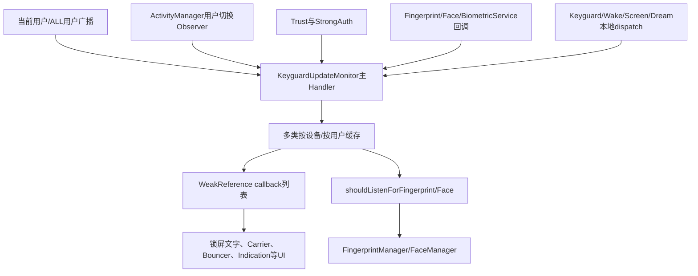
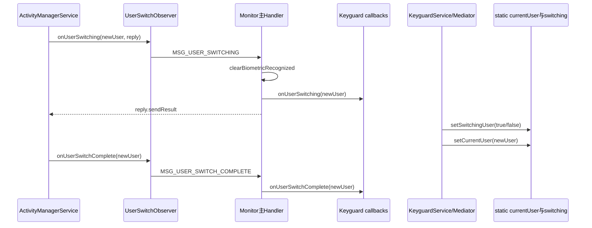
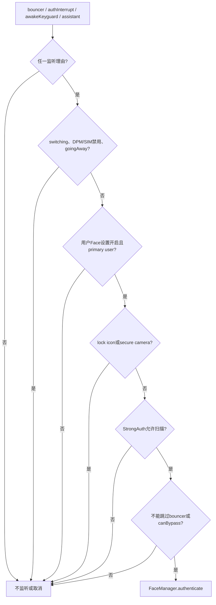

# 第 461 章 Android SystemUI KeyguardUpdateMonitor：锁屏事实总线、回调快照、生物识别与多用户链

> 源码基线：Android 11 / API 30 / `android-11.0.0_r48`。本章只在 macOS 阅读，不实际编译。核心文件：`KeyguardUpdateMonitor.java`、`KeyguardUpdateMonitorCallback.java`、`KeyguardUpdateMonitorTest.java`，并交叉阅读`KeyguardViewMediator.java`、framework `LockPatternUtils.StrongAuthTracker`及system_server `BiometricService.java`。这个类超过3000行，本章按“输入归一化—缓存—回调—生物监听政策”阅读，不逐行背API。

## 1. 本章解决什么问题

锁屏为何需要同时知道时间、电池、SIM、电话、用户、Trust、强认证、生物识别、屏幕和Dream？这些事件怎样汇到SystemUI主线程，哪些状态会给新订阅者回放，指纹/人脸又如何决定开始、取消和重启？

## 2. 一句话主线

`KeyguardUpdateMonitor`是SystemUI锁屏进程内的长期状态聚合器：它从广播、system_server监听、Lifecycle转接和本地调用收事件，经主Handler更新大量缓存并同步扇出弱引用callback，再用这些缓存计算指纹/人脸“此刻是否应该监听”；它不是系统安全裁决的唯一权威，也不是完整可版本化快照。

## 3. 不要把Monitor理解成ViewModel

它既保存状态，又注册跨进程监听、直接控制Biometric Manager、解析SIM广播、调用TrustManager和DPM，还提供dump与destroy。职责远大于普通页面ViewModel。

## 4. 不要把Monitor理解成认证服务

模板匹配与HAL调度在Fingerprint/Face服务，StrongAuth与Trust有system_server权威，KeyguardViewMediator决定锁屏大状态。Monitor负责SystemUI侧监听政策、结果缓存和UI事件分发。

## 5. 四类状态先分开

环境事实包括时间/电池/电话；按用户安全事实包括trust、strong auth、生物成功；锁屏会话事实包括visible、bouncer、goingAway、sleep/dream；执行事实包括face/fingerprint running/cancelling。混成一个“是否可解锁”会丢语义。

## 6. 类的生命周期

类以Dagger `@Singleton`存在，通常贯穿SystemUI进程；构造注册大量Receiver/Observer/Listener，`destroy()`负责多数注销。测试每次tearDown也显式destroy。

## 7. 进程与线程

对象在SystemUI进程；广播和绝大多数状态归一到注入的主Looper；Biometric/Trust/ActivityManager等调用跨Binder到system_server；后台Executor只承担初始ServiceState查询和成功生物解锁上报等少量任务。

## 8. 总体架构图



## 9. 输入源一：当前用户Receiver

普通filter监听时间、时区、电池、飞行模式、SIM、ServiceState、默认数据订阅、电话状态和DPM变化，并通过BroadcastDispatcher绑定主Handler。

## 10. 输入源二：ALL用户Receiver

另一个Receiver以`UserHandle.ALL`监听用户资料、下一闹钟、旧Face Unlock开始/停止、DPM、USER_UNLOCKED/STOPPED/REMOVED。事件需要携带或读取sending user id。

## 11. 输入源三：非广播监听

SubscriptionManager、ActivityManager UserSwitchObserver、TrustManager、StrongAuthTracker、BiometricManager、指纹/人脸lockout reset、TaskStackListener、Ringer LiveData和PhoneStateListener共同输入。

## 12. 输入源四：SystemUI本地调用

KeyguardViewMediator等调用visible、bouncer、goingAway、occluded、sleep/wake、screen、dream、camera launched、credential attempted等方法；这些不是framework广播，而是同进程组件对锁屏状态机的投影。

## 13. 主Handler是归一化枢纽

从301到342的一组MSG把不同输入转成`handleXxx`方法。多数handle开头`Assert.isMainThread()`，缓存和callback列表因此主要以主线程actor方式维护。

## 14. 不是所有入口都已归一化

有些public方法要求调用者本就在主线程并直接改状态；`setSwitchingUser`可任意线程写字段再post；Biometric enabled Binder callback甚至直接写SparseBooleanArray并调用face更新。线程模型并非绝对单一。

## 15. Handler消息通常携带事实

电池对象、SIM的sub/slot/state、ServiceState、userId、sleep reason等写入Message；执行时按payload更新。与上一章active无payload不同，这里多数事件不会仅靠重读一个共享boolean。

## 16. 但消息也没有统一generation

不同来源的事件在同一队列排序，却没有会话ID、用户切换generation或生物请求token。旧用户/旧认证迟到消息能否安全处理，要靠每个handle自己的检查。

## 17. Handler分发源码

```java
case MSG_SIM_STATE_CHANGE:
    handleSimStateChange(msg.arg1, msg.arg2, (int) msg.obj);
    break;
case MSG_USER_SWITCHING:
    handleUserSwitching(msg.arg1, (IRemoteCallback) msg.obj);
    break;
case MSG_BIOMETRIC_AUTHENTICATION_CONTINUE:
    updateBiometricListeningState();
    break;
case MSG_KEYGUARD_GOING_AWAY:
    handleKeyguardGoingAway((boolean) msg.obj);
    break;
```

## 18. 缓存不是一张表

设备级字段有battery、ring、phone、visible、screen、dream；按subscription有SimData/ServiceState；按user有unlocked、trust、face setting、face unlock、biometric authenticated和secondary lockscreen Intent。

## 19. static currentUser尤其特殊

`sCurrentUser`是进程静态字段，以synchronized getter/setter保护。它不是构造时从ActivityManager自动初始化，而由KeyguardViewMediator启动和`setCurrentUser`调用写入。

## 20. 构造早期可能仍是默认用户0

依赖注入会先构造Monitor，之后Mediator才执行`setCurrentUser(ActivityManager.getCurrentUser())`。若SystemUI此时前台并非0，构造期`updateBiometricListeningState()`可能按旧static用户计算。

## 21. 构造顺序的第二个细节

Monitor在赋值final `mIsPrimaryUser`之前就首次`updateBiometricListeningState()`；Java字段此时为false，两个shouldListen最终都被primary-user门拦住。后面赋true后没有紧邻的一次显式总重算，只能等后续事件。

## 22. 初始电池是猜值

构造先放入UNKNOWN、level 100的BatteryStatus，目的是订阅者立即有非null对象。它不代表真实满电；真实sticky BATTERY_CHANGED随后应覆盖。

## 23. 备用sticky读取分支几乎不可达

后台Runnable写着“若mBatteryStatus==null就registerReceiver(null)取sticky”，但前面已经赋非null猜值；正常构造顺序下条件为false。现有测试只断言非null，不能证明初始真实电量已到。

## 24. 初始ServiceState主动查询

因为ACTION_SERVICE_STATE正转向non-sticky，后台Executor查询默认sub的`getServiceStateForSubscriber`，再把结果post回主Handler；这里明确补了初始快照。

## 25. 初始SIM逐modem扫描

构造读取active modem count、每slot当前SIM state和subscription ids，为每个sub排MSG_SIM_STATE_CHANGE。subId尚未有效的早期阶段仍要由后续subscription变化修正。

## 26. callback为什么用弱引用

`mCallbacks`保存`WeakReference<KeyguardUpdateMonitorCallback>`，避免Monitor单例仅因订阅遗忘而永久强持有View/Controller。但弱引用不是完整注销协议，生命周期代码仍应remove。

## 27. callback注册源码

```java
public void registerCallback(KeyguardUpdateMonitorCallback callback) {
    Assert.isMainThread();
    for (int i = 0; i < mCallbacks.size(); i++) {
        if (mCallbacks.get(i).get() == callback) return;
    }
    mCallbacks.add(new WeakReference<>(callback));
    removeCallback(null); // 清理已经失效的弱引用
    sendUpdates(callback);
}
```

## 28. 重复注册会去重

同一对象以引用相等检查；重复注册直接返回，不会再次sendUpdates。不同对象即便equals相同仍可分别订阅，这是identity语义。

## 29. remove会删所有同一对象

`removeIf(el -> el.get() == callback)`删除所有命中。传null时，恰好清掉`WeakReference.get()==null`的死亡项；register每次都会顺便做一次清扫。

## 30. 死亡弱引用仍可能堆积

如果长期没有新register，也没有显式清理，已有死亡WeakReference只在遍历时被跳过，不会自动从ArrayList移除。它不泄漏callback本体，却会让槽位数量增长。

## 31. sendUpdates不是完整快照

新callback只立即收到电池、时间、铃声、电话、carrier刷新、clock刷新、keyguard raw visibility、telephony capable和已有SIM states。

## 32. 哪些重要状态没回放

bouncer、interactive/screen、dreaming、device provisioned、user unlocked、trust、strong auth、生物running/成功、wallpaper、logout和secondary lockscreen都不在sendUpdates。订阅者必须主动query或等待未来事件。

## 33. “注册即获当前状态”只对部分字段成立

不能由Battery测试推广到所有callback。此类接口同时混合快照回放型、纯边沿型和“只发刷新信号型”事件。

## 34. callback是同步外部调用

handle方法直接循环调用外部callback，没有try/catch。一个callback抛RuntimeException会中断后续订阅者并伤及主Looper；弱引用只解决持有关系，不解决故障隔离。

## 35. callback自移除的风险

循环从0向上按动态size取值；callback若同步调用removeCallback，会立即removeIf修改列表，后面的元素左移，循环i++后可能跳过一个订阅者。这里没有safeForeach或快照副本。

## 36. visibility callback自带一秒折叠

基类`onKeyguardVisibilityChangedRaw`若showing与上次相同且距离不足1000ms，就不调用覆写的`onKeyguardVisibilityChanged`。每个callback实例各自维护时间与mShowing。

## 37. 折叠不是Monitor缓存去重

Monitor每次visible输入仍改字段并调用raw；抑制发生在callback基类。直接覆写raw可绕开默认折叠，注册时的首次回放也可能受callback此前使用历史影响。

## 38. 电池interesting过滤

plug变化、充电中status变化、level变化、充电功率变化、health变化或present变化才回调。温度、电压等若未映射到这些条件，不保证每个BATTERY_CHANGED都下发。

## 39. 时间与时区

TIME_TICK/TIME_CHANGED发onTimeChanged；时区变化先onTimeZoneChanged，再为兼容额外onTimeChanged。下一闹钟变化也复用MSG_TIME_UPDATE，让UI重新格式化相关显示。

## 40. 电话状态缓存

字符串IDLE/OFFHOOK/RINGING被归一成TelephonyManager call-state int后，无论是否与旧值相同都通知callback；未知字符串保持旧mPhoneState也仍继续通知。

## 41. telephony capable不是“有SIM”

它表示设备/链路可提供电话能力信息。有效ServiceState、ABSENT或CARD_IO_ERROR都可把它设true；同值会被`updateTelephonyCapable`去重。

## 42. SIM主键组合

`mSimDatas`以subId为key，值再带slotId/subId/state。subId失效且ABSENT时，代码还按slot把旧SimData改ABSENT，避免UI退回PIN/PUK锁态。

## 43. SIM UNKNOWN不通知

新数据仍可能写入map，但只有changed/becameAbsent且state不为UNKNOWN才callback。查询可能看到UNKNOWN，而订阅者不会收到对应事件。

## 44. rebroadcast-on-unlock被忽略

SystemUI是direct-boot aware，SIM解锁后的兼容重广播不应重复处理；但若该重广播是ABSENT，代码仍补telephonyCapable=true以帮助SystemUI崩溃重启恢复。

## 45. subscription变更的“9000级hack”

早期SIM广播subId可能无效；订阅列表变化时强制刷新所有active subscription的slot/state，收集真的changed项逐个callback，再统一刷新carrier。

## 46. grouped opportunistic过滤

两张同group卡且至少一张opportunistic时，按CarrierConfig选择始终保留primary，或保留当前active data subscription。它只影响用于显示的filtered列表，不删除底层SimData。

## 47. 用户状态有两条切换通道

ActivityManager UserSwitchObserver向Monitor主Handler发switching/complete回调；KeyguardService→Mediator另行调用`setSwitchingUser`和`setCurrentUser`。前一条不会自动写后两个核心字段。

## 48. switching事件做什么

`handleUserSwitching`清空所有用户的指纹/人脸成功缓存，刷新目标用户trustUsuallyManaged，通知callbacks，最后调用远端reply放行系统切换。

## 49. reply在callback之后

任一callback很慢会延迟UserSwitchObserver reply；任一callback抛异常甚至会使reply未发送。方法只捕获reply本身的RemoteException，不隔离callback。

## 50. complete事件很薄

`handleUserSwitchComplete`只转发userId，不设置static currentUser、不清switching flag、不重算生物监听。这些动作依赖Mediator的另一组调用及时到达。

## 51. currentUser与switching可短暂错配

四类事件跨Binder/主Handler/KeyguardService排序，没有统一事务。shouldListen可能在“新currentUser但switching仍true”或“旧currentUser而switching已false”窗口被调用。

## 52. USER_UNLOCKED丢了callback userId

ALL用户Receiver把sending user id传入handle并正确写`mUserIsUnlocked[userId]=true`，但callback接口`onUserUnlocked()`没有参数。订阅者无法仅靠事件知道哪个用户刚解锁。

## 53. 后台用户解锁也影响慢解锁缓存

handleUserUnlocked随后调用`resolveNeedsSlowUnlockTransition()`，该函数看的是static currentUser；因此任一用户解锁广播都会重算当前用户的慢过渡，而不一定是事件用户。

## 54. USER_STOPPED与REMOVED清理不对称

stopped只重查unlocked；removed只删除unlocked与trustUsuallyManaged。hasTrust、trustManaged、faceSetting、faceUnlock、secondary lockscreen及生物map并未在removed中全面清理。

## 55. 按用户缓存需要生命周期表

多张SparseArray/Map各自决定何时初始化、清空或保留，缺少统一UserState对象。审计多用户泄漏不能只看`sCurrentUser`。

## 56. 用户切换时序图



## 57. Trust与生物成功不是同一事实

`mUserHasTrust`来自TrustManager；指纹/人脸成功各存`BiometricAuthenticated(authenticated,strong)`。`getUserCanSkipBouncer`是“可用trust OR 被StrongAuth允许的生物成功”。

## 58. SIM PIN会禁用Trust与生物

任一active subscription处于PIN_REQUIRED、PUK_REQUIRED或PERM_DISABLED，`isTrustDisabled`返回true；fingerprint/face disabled判断也把SIM PIN secure作为条件。

## 59. Trust缓存与有效Trust不同

`onTrustChanged`可把mUserHasTrust设true，但`getUserHasTrust`还会检查SIM PIN。缓存记录agent报告，查询返回当前政策下有效结果；而onTrustChanged本身不重算生物监听，Face是否因“已经有Trust”及时停止还依赖后续状态事件。

## 60. StrongAuth是位掩码

after boot、DPM lock now、timeout、lockdown、lockout、non-strong超时等原因可组合。不能把非零简单翻译成“所有生物都禁止”，strong与non-strong允许规则不同。

## 61. 生物成功也要二次过滤

`getUserUnlockedWithBiometric(userId)`只有在目标用户缓存authenticated且StrongAuth允许时才true；但它调用的`isUnlockingWithBiometricAllowed(isStrong)`内部固定读取static current user，而不是参数userId。查询非当前用户时会把“目标用户认证缓存”和“当前用户StrongAuth政策”错误拼接；一次过去成功也会因后续政策变为不可用于跳过bouncer。

## 62. 成功缓存何时清

开始睡眠会`clearBiometricRecognized`，用户switching也会清；长按锁图标只把当前用户face项置null并要求StrongAuth变化。清理还通知TrustManager清两类recognized。

## 63. clear是全用户

两个SparseArray直接`clear()`，不是只清current user。切换一个用户会抹掉所有用户的SystemUI生物成功缓存，采取保守安全策略。

## 64. StrongAuth变化只通知

`notifyStrongAuthStateChanged`遍历callback，却没有调用`updateBiometricListeningState()`。shouldListen依赖StrongAuth，因此政策变化后scanner是否立刻停/启要依赖其他事件或调用者反应。

## 65. DPM变化也有拆分

当前用户Receiver的DPM action更新logout；ALL Receiver的DPM action更新指纹监听、secondary lockscreen并通知callback。`handleDevicePolicyManagerStateChanged`只重算fingerprint，没有同时重算face。

## 66. 成功结果仍复核用户与DPM

fingerprint/face成功handle先向ActivityManagerService重取current user，若authUserId不同就丢弃；随后检查对应DPM/SIM禁用。face额外在goingToSleep时拒绝。

## 67. 复核没有直接查StrongAuth

成功handle不在入口再次拒绝StrongAuth；它缓存结果并通知callback，真正`getUserUnlockedWithBiometric`再按StrongAuth过滤。scanner本应由shouldListen提前停，但第64节说明重算并非每次政策变化自动发生。

## 68. 指纹加密/lockdown走detect

`startListeningForFingerprint`若`isEncryptedOrLockdown(user)`，调用`detectFingerprint`而非authenticate。注释说这是触发成功路径以显示bouncer；检测到手指不等于允许绕过强凭据。

## 69. Face没有对应detect模式

Face只调用authenticate；strong-auth条件由`shouldListenForFace`控制。带bypass时，after boot/timeout可在非bouncer界面预扫描以提前拉起bouncer，但explicit lockdown仍禁止。

## 70. 指纹shouldListen的正向门

keyguard visible、设备非interactive、bouncer显示且未goingAway、正在goingToSleep、assistant特殊场景或occluded+dreaming，满足任一才有监听理由。

## 71. 指纹shouldListen的反向门

不得switching user、不得DPM/SIM禁用、goingAway与interactive组合要允许、必须primary user；fingerprint lockout只有在bouncer且credentialAttempted时额外禁止。

## 72. 指纹政策源码

```java
final boolean allowedOnBouncer =
        !(mFingerprintLockedOut && mBouncer && mCredentialAttempted);
final boolean shouldListen =
        (mKeyguardIsVisible || !mDeviceInteractive
        || (mBouncer && !mKeyguardGoingAway) || mGoingToSleep
        || shouldListenForFingerprintAssistant()
        || (mKeyguardOccluded && mIsDreaming))
        && !mSwitchingUser && !isFingerprintDisabled(getCurrentUser())
        && (!mKeyguardGoingAway || !mDeviceInteractive)
        && mIsPrimaryUser && allowedOnBouncer;
```

## 73. 指纹为何设备非交互也监听

屏幕熄灭时的指纹可用于唤醒/解锁；因此`!mDeviceInteractive`本身是正向理由。不能用Face“只在醒着看人脸”的直觉套指纹。

## 74. Face的awakeKeyguard

要求keyguard visible、deviceInteractive、非goingToSleep且StatusBar不为SHADE_LOCKED。锁屏下拉到锁定Shade时不会因仍visible就持续脸扫。

## 75. Face还受体验门控制

bouncer、auth interrupt、awakeKeyguard或assistant特殊场景之一成立；用户不能已经靠trust/biometric跳过bouncer，除非BypassController要求自动穿透。

## 76. Face安全与用户设置门

不得switching、DPM/SIM disable、goingAway、lock icon pressed、secure camera launched；用户的face-on-keyguard设置必须true；必须primary user；StrongAuth扫描规则也必须允许。

## 77. secure camera为何拦Face

锁屏安全相机启动后置mSecureCameraLaunched=true，避免相机界面被被动人脸解锁打断；回到visible showing或bouncer出现时清标记并可重算。

## 78. Face决策图



## 79. Biometric enabled回调初始回放

Monitor向BiometricService注册后，服务立即读取ActivityManager当前前台用户的face setting，却把AuthService注册时捕获的calling userId放进`onChanged`。SystemUI进程用户通常是0；当前前台若是10，初值可能被错误存成“user0=用户10的设置”。后续当前用户设置变化/用户切换通知才会携带真实变化userId。

## 80. enabled回调的线程漏洞

`IBiometricEnabledOnKeyguardCallback.Stub.onChanged`在SystemUI Binder线程执行，却直接写非线程安全SparseBooleanArray并调用`updateFaceListeningState()`；没有post主Handler，也没有Assert。它会与主线程读写许多Face状态并发。

## 81. 初始回调叠加构造顺序

BiometricService同步Binder调用会在register方法返回前回调SystemUI Binder线程；此时Monitor构造尚未给`mIsPrimaryUser`赋最终值。即便setting=true，首次shouldListen也被默认false门挡住；若前台不是SystemUI calling user，上一节的userId错配还会让真正current user暂时没有setting缓存。

## 82. 四态而非running boolean

每种生物有STOPPED、RUNNING、CANCELLING、CANCELLING_RESTARTING。对外callback只关心“是否实际RUNNING”，取消中间态不单独通知。

## 83. 为什么需要CANCELLING_RESTARTING

取消是异步的；若等待HAL `ERROR_CANCELED`期间条件又变成shouldListen，不能立刻并发新authenticate，于是记“取消完成后重启”。

## 84. 共享取消超时源码

```java
private final Runnable mCancelNotReceived = () -> {
    Log.w(TAG, "Cancel not received, transitioning to STOPPED");
    mFingerprintRunningState = mFaceRunningState = BIOMETRIC_STATE_STOPPED;
    updateBiometricListeningState();
};
```

## 85. 共享Runnable会互相影响

Face或fingerprint任一取消3秒没收到确认，这个Runnable会把两种running state同时改STOPPED；另一种即使正常RUNNING，也会被内部账强行重置并可能重复start。

## 86. 共享hasCallbacks也会抢超时

两种stop都只在Handler还没有该Runnable时post；第二种取消不会拥有独立deadline。任一模态收到CANCELED又会remove共享Runnable，可能把另一模态正在等待的保护超时一起取消。

## 87. 直接赋STOPPED漏running callback

超时Runnable没有调用`setFingerprintRunningState`/`setFaceRunningState`，所以不会触发`onBiometricRunningStateChanged(false, type)`。随后若shouldListen仍true，start从STOPPED到RUNNING时旧/新都被外部看成running，状态通知可能失真。

## 88. fingerprint error还会清face signal

非“取消且需重启”的fingerprint error分支同时把`mFingerprintCancelSignal`与`mFaceCancelSignal`置null。若Face仍运行，后续stop可能拿不到CancellationSignal去通知FaceManager取消。

## 89. HW unavailable重试

两种模态各有计数，500ms后重试，最多10次；updateListening每次先remove对应pending retry，避免普通状态变化留下旧重试。计数只在screen turned off统一清零，成功不清。

## 90. Face unable-to-process也重试

Face把HW_UNAVAILABLE和UNABLE_TO_PROCESS都纳入相同10次重试；fingerprint只对HW_UNAVAILABLE。永久lockout则要求StrongAuth。

## 91. 指纹成功延迟500ms再续听

成功后排`MSG_BIOMETRIC_AUTHENTICATION_CONTINUE`，updateFingerprint/Face若看到此消息都直接return。它略长于成功到goingAway的期望窗口，避免刚成功马上重复认证。

## 92. 延迟是两模态共享栅栏

消息名不区分face/fingerprint；指纹成功后的500ms也阻止Face更新。Face成功本身不排同样延迟，两个模态的后处理并不对称。

## 93. onFaceAuthFailed停止，fingerprint失败不停止

Face失败先set STOPPED，再通知failed/help；下一次显式请求或状态变化可重启。Fingerprint失败只通知failed/help，running state保持，底层认证会继续等待下一触摸。

## 94. 成功回调顺序

先写按用户authenticated缓存；若已可skip bouncer则通知TrustManager；清本模态cancel signal；同步callback；再后台上报LockPatternUtils。Fingerprint另排500mscontinue。

## 95. callback可能在后台上报前解锁UI

`reportSuccessfulBiometricUnlock`经background executor异步执行，UI callback先发生。这个上报是StrongAuth/统计链的一部分，不是UI开始过渡的同步前置ACK。

## 96. 睡眠状态的顺序

startedGoingToSleep先清lock-icon标记和全部生物成功，再通知callbacks，之后才设`mGoingToSleep=true`并重算监听。callback执行时查询`isGoingToSleep()`仍可能得到false。

## 97. interactive与screenOn分开

dispatchStartedWakingUp同步设interactive=true再发消息；finishedGoingToSleep设false；screen turned on/off另改mScreenOn。电源交互状态与物理显示状态不是同一个boolean。

## 98. Dream和assistant也会重算Face

Dream start/stop更新mIsDreaming后重算两模态；TaskStack后台监听assistant stack可见性，post主Handler改mAssistantVisible并重算。assistant成功后又被主动置false，避免重复认证。

## 99. dump的价值

dump输出SIM、订阅、ServiceState、active data sub、当前用户指纹/Face allowed/auth/possible/StrongAuth/trust、Face setting与secure camera；debug build还保留最近20次“想开始Face”的决策模型。

## 100. dump的缺口

它没有完整打印callbacks数量、battery/ring/phone、current static user与switching、interactive/screen/dream/bouncer/goingAway、取消deadline、retry计数和所有用户缓存；Face也不打印actual/expected running对比，Fingerprint会打印。

## 101. destroy覆盖哪些入口

注销PhoneState、subscription、provision observer、user switch、task stack、两个broadcast receiver、ringer observer、StrongAuth和Trust，并清Handler消息。

## 102. destroy未完全对称

构造时向DumpManager注册却未unregister；Biometric enabled callback和两类lockout reset callback也没有对应移除调用。部分framework API本身缺少remove，但“destroy后绝无迟到回调”不能成立。

## 103. 迟到Binder回调尤其危险

destroy清了Handler，却未标destroyed；Biometric enabled Stub仍可直接改字段并启动Face，不经过已清队列。应有lifecycle generation/closed门或可注销token。

## 104. 测试覆盖较好的部分

测试覆盖receiver注册、初始battery非null、SIM/telephony capable、Face/Fingerprint的主要StrongAuth/Bypass条件、成功能否skip bouncer、用户切换清生物、grouped opportunistic、user unlocked、trustUsually和secondary lockscreen。

## 105. 测试线程被简化

TestableLooper集中事件，background executor也直接执行；Biometric enabled mock在注册调用栈同步回调。生产Binder线程与主线程竞态、共享SparseBooleanArray问题没有被模拟。

## 106. 未覆盖共享取消漏洞

现有测试名未覆盖Face/Fingerprint同时运行、一边cancel timeout或CANCELED清掉另一边timeout、Runnable同时重置两态、fingerprint error清face signal。

## 107. 未覆盖callback重入

没有测试callback自remove、抛异常、死亡弱引用长期堆积，以及sendUpdates缺失bouncer/trust/biometric等快照对新订阅者的影响。

## 108. 改进一：按用户聚合对象

把unlocked/trust/setting/faceRunning/authenticated/secondary requirement收进`UserState(userId,generation)`，用户removed统一释放，切换以generation拒绝旧事件。

## 109. 改进二：所有状态主线程独占

Biometric enabled Binder Stub只post不可变payload；`setSwitchingUser`也post赋值；外部query要么主线程限定，要么读immutable snapshot。这样SparseArray与决策字段不再跨线程裸读写。

## 110. 改进三：每模态独立会话

Face/Fingerprint各有cancel timeout、retry token、request generation和CancellationSignal；错误只清本模态，所有state变化统一经过setter并对外发送一致边沿。

## 111. 改进四：声明回放契约

注册时返回完整`KeyguardSnapshot`，事件携带version；或明确每个callback是snapshot还是edge。通知前复制callback列表并隔离异常/重入，避免安全切换reply被UI订阅者阻塞。

## 112. macOS 只读练习一：画输入地图

用`rg`列出两个IntentFilter、Subscription/UserSwitch/Trust/Biometric/TaskStack监听及dispatch方法；给每个输入标注进程来源、进入线程和最终MSG/直接handle，不运行代码。

## 113. macOS 只读练习二：核对注册快照

逐项抄出`sendUpdates`调用，再对照Callback类全部方法；把“注册时立即回放”和“只等未来事件”分成两列，特别检查bouncer、trust、Face running和user unlocked。

## 114. macOS 只读练习三：推演双模态取消

假设Face与Fingerprint都RUNNING，先stop Face并post共享3秒Runnable，再让Fingerprint收到CANCELED或普通ERROR；沿`hasCallbacks/removeCallbacks`和两个signal字段推演最终账，指出串扰。

## 115. macOS 只读练习四：推演用户切换竞态

分别排列Observer switching、Mediator setCurrentUser、setSwitchingUser(false)和Observer complete的不同顺序；每一步代入shouldListen的current user/switching门，找出可能按错用户短暂计算的窗口。

## 116. 最容易误解的一点

KeyguardUpdateMonitor不是“所有状态注册即回放”的完整事实库。它混合部分快照、刷新信号和瞬时边沿，新消费者必须逐方法确认初值来源。

## 117. 第二个易错点

生物`RUNNING`不是“用户已认证”，authenticated缓存也不是“当前一定能解锁”。StrongAuth、SIM PIN、DPM、当前用户、Trust和Keyguard状态共同决定最终有效性。

## 118. 第三个易错点

“都经主Handler”在r48并不完全成立。Biometric enabled Binder回调直接读写Face状态，是分析偶发重复扫描、线程竞态和destroy后复活时必须先看的例外。

## 119. 本章结论

KeyguardUpdateMonitor把锁屏所需的设备、电话、用户、安全与会话事实汇入SystemUI，并以主Handler和弱callback支撑大量UI；其真正难点是不同事实的用户维度、快照/边沿契约及Face/Fingerprint异步取消状态机。r48还存在构造期current/primary时序、部分初值猜测、callback重入、用户切换双通道、清理不全、StrongAuth/DPM重算缺口、Binder线程Face设置以及双模态共享取消保护等边界。读锁屏故障时应先确定“哪一类事实、哪个用户、哪一代认证、哪条线程”再看boolean。

## 120. 下一章预告

第462章继续阅读`KeyguardViewMediator`，研究锁屏show/hide/reset、going-away、Sleep/Wake、Dismiss、安全状态、WMS回调与解锁动画完成链。
