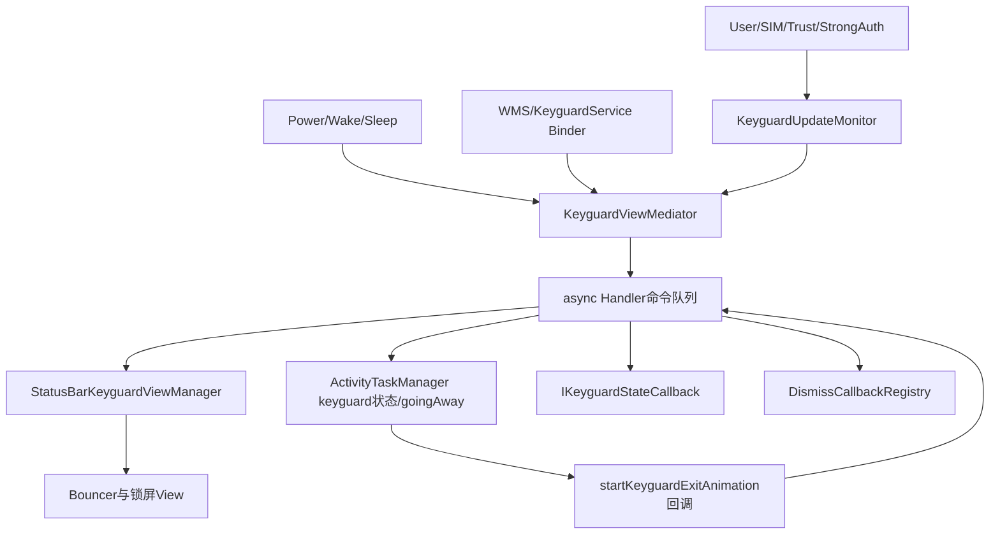
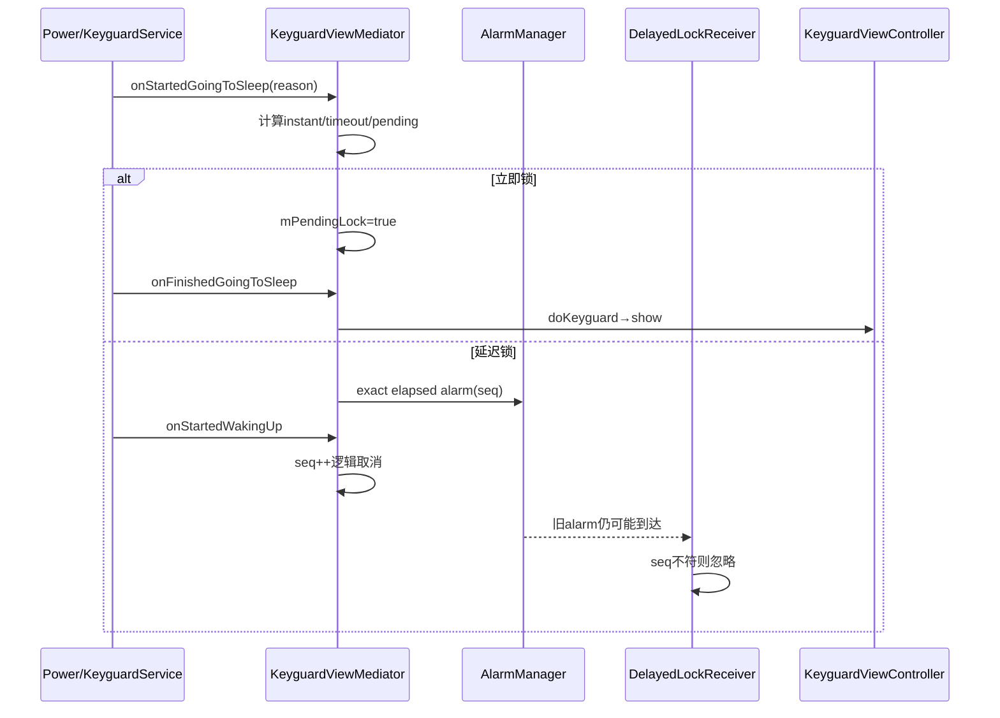
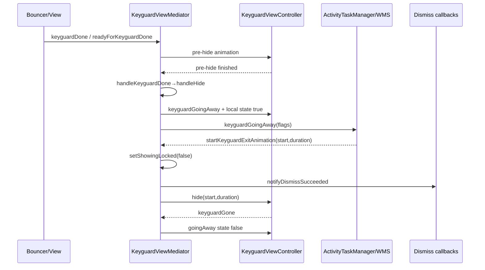

# 第 462 章 Android SystemUI KeyguardViewMediator：锁屏显示、延迟锁定、Dismiss与WMS退出动画链

> 源码基线：Android 11 / API 30 / `android-11.0.0_r48`。本章只在 macOS 阅读，不实际编译。核心文件：`KeyguardViewMediator.java`、`KeyguardViewMediatorTest.java`、`DismissCallbackRegistry.java`、`KeyguardBouncer.java`，并交叉阅读`KeyguardUpdateMonitor`、`StatusBarKeyguardViewManager`和framework Keyguard Binder回调。Mediator是SystemUI锁屏控制面，不要把`mShowing=false`、View已隐藏、ATM/WMS已开始切窗和动画已结束看成同一时刻。

## 1. 本章解决什么问题

设备熄屏后为何有时立即锁、有时延迟锁？锁屏怎样显示、遮挡、Dismiss和退出？SystemUI为什么先通知ATM“going away”，再等WMS给动画时间？Drawn、User Present和Dismiss成功各在什么时候发？

## 2. 一句话主线

`KeyguardViewMediator`把WindowManager/Power/User/SIM请求转成异步Handler命令，依据安全设置决定立即或延迟`show`，协调StatusBar锁屏View、KeyguardUpdateMonitor和状态栏限制；解锁时先进入hiding并通知ATM keyguardGoingAway，等WMS调用`startKeyguardExitAnimation`后才把showing改false、隐藏View、回Dismiss成功并发USER_PRESENT。

## 3. Mediator不是锁屏View

真正的View控制由`KeyguardViewController`/`StatusBarKeyguardViewManager`完成。Mediator保存系统级状态、实施政策、桥接Binder回调和安排顺序。

## 4. Mediator也不是WMS

WMS/ATM掌握应用窗口和转场；Mediator只能报告锁屏状态、提出going-away请求并消费WMS给出的动画起点/时长。它不能单方面保证应用窗口已经准备好。

## 5. 四种“离开锁屏”要区分

`mHiding=true`表示已请求退出；goingAway表示ATM开始准备窗口；`mShowing=false`表示Mediator对外状态切换；`keyguardGone()`表示锁屏View最终消失并可隐藏副屏展示。这四步不是同义词。

## 6. 四种“屏幕状态”也不同

`mDeviceInteractive`、screen turning/on/off callback、`mGoingToSleep`和`mDozing/mAodShowing`分别描述电源交互、显示绘制、睡眠过渡和AOD投影。不能只看一个screenOn boolean。

## 7. 进程与线程

Mediator在SystemUI进程；来自KeyguardService/WMS的入口可能在Binder线程，UI动作统一post到一个async Handler；ATM、Trust、DPM等再跨Binder到system_server；锁声和若干报告走`@UiBackground Executor`。

## 8. 总体架构图



## 9. 主要缓存分类

启动状态有systemReady/bootCompleted；锁屏状态有showing/aodShowing/occluded/hiding；电源状态有interactive/goingToSleep/dozing/pulsing；延迟账有两个sequence；解锁账有donePending/hideAnimationRun/running、exit callback和drawn callback。

## 10. synchronized保护什么

许多政策入口和状态切换以` synchronized(this)`串行；Handler方法也常再次持锁。锁保护跨线程字段，却也意味着锁内调用ViewController、远端callback或等待可能扩大阻塞面。

## 11. Handler在哪里绑定

`mHandler`在字段初始化时用`Looper.myLooper()`构造，而不是由构造函数显式注入主Looper。类必须在预期Looper线程创建；若创建线程无Looper会失败，若是别的Looper则UI命令绑定错误线程。

## 12. 为什么Handler标async

异步消息可穿过Looper同步屏障，降低锁屏关键命令被帧同步屏障延迟的概率。async不代表并行，消息仍在同一Looper按队列时序串行执行。

## 13. start只做setup

`start()`持锁调用setup：建non-reference-counted show WakeLock、注册shutdown与两个延迟锁广播、创建副屏KeyguardDisplayManager、设置current user、猜初始showing、读取交互态并加载锁声/动画。

## 14. systemReady才开始主政策

`onSystemReady`只发SYSTEM_READY消息；handle中先置`mSystemReady=true`、调用`doKeyguardLocked`，再向KeyguardUpdateMonitor注册callback，最后考虑USER_PRESENT。

## 15. callback注册在首次doKeyguard之后

首次是否显示使用Monitor构造期已有的deviceProvisioned/SIM状态，但Mediator还没订阅后续变化。Handler单线程使窗口较短，仍不是“先订阅再取快照”的原子初始化。

## 16. 初始showing是保守猜测

setup若产品启用KeyguardService，按“无需等待provision且锁屏未禁用”设置showing并强制callback；此时View未必已真正show。它给WMS一个保守安全状态，随后systemReady再执行实际doKeyguard。

## 17. showing与View showing可能短暂不同

Mediator有`mShowing`，ViewController也有`isShowing()`；doKeyguard先用ViewController判已显示，handleShow再写Mediator showing并调用View show。调试必须同时取两处证据。

## 18. setShowingLocked做三件事

更新showing和由`dozing&&!wakeAndUnlocking`算出的aodShowing；若值变化或force，通知IKeyguardStateCallback、更新inputRestricted、后台通知TrustManager，并异步告诉ActivityTaskManager锁屏显示状态。

## 19. ATM更新不是同步ACK

`updateActivityLockScreenState`把`setLockScreenShown(showing,aodShowing)`放入背景Executor，捕获RemoteException后静默。Mediator本地状态先变，调用者拿不到system_server确认。

## 20. showing为何不是visible

被SHOW_WHEN_LOCKED窗口遮挡时`mShowing`仍true而`mOccluded=true`；`isShowingAndNotOccluded`才表示默认显示上可见。Bouncer是否显示又是另一维度。

## 21. addStateMonitorCallback的初始快照

新增远端callback立即收到SIM secure、showing、inputRestricted、trusted和wallpaper五项。列表不去重，也没有显式remove；只在后续通知遇DeadObjectException时移除死亡对象。

## 22. 远端callback在锁内调用

add和多种notify在Mediator锁内同步Binder回调。远端慢或重入会拉长锁占用；RemoteException只处理死亡，不设统一超时或generation。

## 23. inputRestricted不是showing副本

它等于`mShowing || mNeedToReshowWhenReenabled`。应用临时外部禁用并隐藏锁屏时，showing可变false但仍限制输入，因为稍后必须恢复锁屏。

## 24. showing更新源码

```java
private void setShowingLocked(boolean showing, boolean forceCallbacks) {
    final boolean aodShowing = mDozing && !mWakeAndUnlocking;
    final boolean notify = showing != mShowing
            || aodShowing != mAodShowing || forceCallbacks;
    mShowing = showing;
    mAodShowing = aodShowing;
    if (notify) {
        notifyDefaultDisplayCallbacks(showing);
        updateActivityLockScreenState(showing, aodShowing);
    }
}
```

## 25. showLocked先获取WakeLock

任何show请求先acquire `mShowKeyguardWakeLock`，再发SHOW消息，防止请求到View显示之间CPU睡眠。WakeLock设为非引用计数，多次acquire只保持一份held状态。

## 26. handleShow的正常步骤

安全用户先在Handler线程同步调用DPM `reportKeyguardSecured`；锁内清hiding/wakeAndUnlocking、设showing=true、调用View show、清done pending、复位pre-hide、限制状态栏、userActivity、清goingAway，最后release show WakeLock。它与handleDone把dismissed报告放后台Executor的做法并不对称。

## 27. 副屏显示在锁外

主锁屏状态和View show完成后，`mKeyguardDisplayManager.show()`在同步块外执行；默认显示和secondary displays不是一个原子显示事务。

## 28. 非强生物四小时计时

每次handleShow结尾调用`LockPatternUtils.scheduleNonStrongBiometricIdleTimeout(currentUser)`，安排弱/便利型生物长期闲置后需要强认证。

## 29. systemReady前SHOW的WakeLock缺口

handleShow发现`!mSystemReady`就直接return，release写在正常分支末尾；若外部路径在ready前调用showLocked，non-reference-counted WakeLock可能一直held。正常首次doKeyguard先置ready，不能证明所有入口都安全。

## 30. 已显示时不是重复show

doKeyguard若ViewController `isShowing()`，只排reset，让现有锁屏重建安全状态，不重新show和重复持WakeLock。

## 31. doKeyguard的第一层否决

CORE_APPS_ONLY半启动解密阶段不显示；外部禁用时记录needToReshow并返回；已经显示则reset。这些门早于用户安全条件。

## 32. split system user政策

split-system-user设备的system user在已provision场景不得解锁；`mustNotUnlockCurrentUser`也会在hide阶段阻止退出，要求切到真正终端用户。

## 33. provisioning例外

设备未完成Setup且当前不secure时通常等待，不显示Keyguard；但SIM locked或按配置要求的missing/perm-disabled可迫使锁屏出现，保证SIM安全界面。

## 34. lockscreen disabled也有例外

用户选择None时，若SIM未锁/缺且未forceShow才跳过；Bundle `OPTION_FORCE_SHOW`、SIM政策或split-user场景可覆盖普通锁屏关闭设置。

## 35. vold password捷径

刚由存储解密验证过凭据时`checkVoldPassword`为true，Mediator设showing=false并hide，避免用户立即再次输入锁屏凭据。

## 36. show请求与完成没有统一回执

showLocked返回只代表消息入队；handleShow release WakeLock代表调用View show已发出，不代表首帧已绘制。特定外部reenable路径另用doneDrawing等待。

## 37. 熄屏第一步先置内部状态

`onStartedGoingToSleep`锁内把interactive=false、goingToSleep=true，向UpdateMonitor异步清goingAway，以便指纹重新按睡眠政策监听。

## 38. 为什么不直接清View goingAway

注释明确不调用ViewController `setKeyguardGoingAwayState(false)`，因为那会扰乱device lock state；Monitor监听政策与View/WMS窗口状态在此刻故意不同步更新。

## 39. lockImmediately计算

当前用户设置“电源键立即锁”或设备根本不secure时为true。非secure仍立即显示锁屏，是为了相机入口和防误触，而不是凭据安全。

## 40. sleep分支优先级

先取消正在verify的exit callback；否则已showing就pendingReset；否则若timeout熄屏且timeout>0，或电源键熄屏但不立即锁，就安排later；否则锁屏未禁用则pendingLock。

## 41. pendingLock何时真正执行

started阶段只置flag并可播放lock sound；`onFinishedGoingToSleep`才在处理相机手势、pendingReset后调用doKeyguard并清flag，减少转场中途直接改View。

## 42. 相机手势覆盖锁定

finished收到cameraGestureTriggered会主动wakeUp并清pendingLock/pendingReset；随后也不锁child profiles。快速双击相机优先进入安全相机而不是完成本次熄屏锁定。

## 43. sleep决策核心源码

```java
if (mShowing) {
    mPendingReset = true;
} else if ((why == OFF_BECAUSE_OF_TIMEOUT && timeout > 0)
        || (why == OFF_BECAUSE_OF_USER && !lockImmediately)) {
    doKeyguardLaterLocked(timeout);
    mLockLater = true;
} else if (!mLockPatternUtils.isLockScreenDisabled(currentUser)) {
    mPendingLock = true;
}
```

## 44. 超时时间由三项夹逼

用户`LOCK_SCREEN_LOCK_AFTER_TIMEOUT`、显示`SCREEN_OFF_TIMEOUT`和DPM `maximumTimeToLock`共同决定；有policy时取`min(policyTimeout-displayTimeout, userLockAfter)`并不小于0。

## 45. 时间基准与闹钟类型

延迟锁使用`elapsedRealtime()+timeout`和`ELAPSED_REALTIME_WAKEUP`，不受墙上时间修改影响；`setExactAndAllowWhileIdle`保证Doze中也能在安全截止点唤醒处理。

## 46. sequence是逻辑取消

cancel并不向AlarmManager取消PendingIntent，只递增`mDelayedShowingSequence`；旧闹钟仍可能唤醒并发广播，但Receiver比较seq后忽略。

## 47. 为什么还用FLAG_CANCEL_CURRENT

新的主用户延迟锁用同一PendingIntent身份，FLAG_CANCEL_CURRENT替换旧sender，使AlarmManager只保留最新主锁计划；sequence再防止已在途或旧Intent误执行。

## 48. 熄屏延迟锁时序图



## 49. 工作资料也用独立sequence

separate profile challenge按各profile lock timeout安排`DELAYED_LOCK_PROFILE_ACTION`，Receiver校验`mDelayedProfileShowingSequence`并调用TrustManager `setDeviceLockedForUser(true)`。

## 50. 多工作资料PendingIntent身份bug

循环中所有profile都使用requestCode 0、同action、同组件语义且FLAG_CANCEL_CURRENT；Intent extra userId不参与PendingIntent identity。后一个profile会取消前一个sender，多个不同超时通常只留下最后安排的资料锁。

## 51. profile超时0的范围偏大

若某profile timeout为0，代码调用`doKeyguardForChildProfilesLocked()`，它会立即锁所有启用且separate-challenge的profiles，而不只当前循环的profile。

## 52. startedWakingUp取消延迟账

锁内置interactive=true并递增主/profile sequence，然后通知View started waking；锁外再dispatch UpdateMonitor和maybe USER_PRESENT。它阻止短时间亮屏后旧闹钟真正锁定。

## 53. 逻辑取消仍有唤醒成本

因为没有AlarmManager.cancel，旧WAKEUP alarm仍可叫醒进程/设备后才被sequence拒绝。正确性保住了，功耗与日志噪声仍存在。

## 54. Dream使用同一锁后延迟

设备interactive且当前用户secure时，Dream started安排普通锁屏timeout；Dream stopped且仍interactive时递增sequence取消。屏保不是立即等同熄屏。

## 55. screen turning on的Drawn协议

WMS传入`IKeyguardDrawnCallback`；普通路径在通知View `onScreenTurningOn`后立刻callback.onDrawn，wake-and-unlock路径则暂存mDrawnCallback，等待退出动画阶段强制下一帧报告。

## 56. Drawn不等于Keyguard gone

onDrawn允许WMS继续点亮/绘制屏幕；锁屏View可能仍显示。keyguardGone是退出动画后View层面的消失，二者服务不同等待者。

## 57. screen off会丢待Drawn callback

`handleNotifyScreenTurnedOff`直接把mDrawnCallback=null，没有向旧远端返回失败/取消。若wake-and-unlock途中又熄屏，原等待方依赖WMS其他超时恢复。

## 58. KEYGUARD_DONE_DRAWING是另一协议

它只用于外部reenable后同步等待“锁屏已可见”；ViewMediatorCallback或2秒timeout都会发送同一消息，handle清waiting并notifyAll。

## 59. 外部enable语义

`setKeyguardEnabled(false)`模拟旧KeyguardLock等外部抑制：若正showing且没有verify流程，记needToReshow、更新inputRestricted并hide；不是修改用户的锁屏安全设置。

## 60. reenable会同步等待最多2秒

恢复enabled且needReshow时showLocked，置waiting，排2秒KEYGUARD_DONE_DRAWING，然后在synchronized块里wait；wait释放Mediator锁，让Handler可show/notify，调用线程仍被阻塞。

## 61. 2秒只是防ANR上限

timeout消息与真实doneDrawing共用handle，均会让等待返回；返回不告诉调用者是实际绘制还是超时。日志只能辅助区分到达顺序。

## 62. verifyUnlock在r48基本保守拒绝

未provision、keyguard仍externally enabled、已有请求或secure设备都false；仅外部已disable且当前不secure时true并恢复enabled。注释中旧式安全验证UI在此实现不再展开。

## 63. exit secure callback仍有遗留状态

字段和sleep取消/handleKeyguardDone成功路径仍存在，但当前`verifyUnlock`分支并未设置新的mExitSecureCallback。它反映历史API演进，不能仅凭字段推断r48常规主链会用。

## 64. Dismiss与外部disable不同

`dismiss(callback,message)`表示通过安全层请求解锁；Handler若showing就登记callback、保存一次性自定义文案并让View `dismissAndCollapse`，secure时通常显示Bouncer。

## 65. 不showing立即报error

Dismiss不是幂等“确保已解锁”；锁屏不在showing时，有callback就直接`notifyDismissError`，不会把请求保留到未来show。

## 66. 多个Dismiss共享一次结果集合

Registry把每个callback包装后append，无request ID；真正退出时反向遍历异步回success并clear，Bouncer取消时异步回cancel并clear。所有等待者绑定当前这轮全局解锁。

## 67. 自定义文案是单槽

每次Dismiss覆盖`mCustomMessage`；Bouncer用`consumeCustomMessage()`读一次后清null。多个并发Dismiss的message最后写入者获胜，callback与文案没有一一对应。

## 68. Dismiss success发得并不晚

success在`handleStartKeyguardExitAnimation`内、调用View.hide之前或相邻时序发到后台Executor；它表示安全解锁已被接受并进入退出，不保证动画和View keyguardGone已完成。

## 69. occluded不是Dismiss成功

SHOW_WHEN_LOCKED activity把Keyguard遮住仍保持showing；setOccluded只通知Monitor/View并调状态栏。如果正hiding时突然occluded，会用0/0直接启动退出动画收束竞态。

## 70. setOccluded会合并队列

入口先remove旧SET_OCCLUDED再发最新值，快速true/false中间态会折叠。最终UI只保证趋向最新遮挡状态，不保证每个边沿都观察到。

## 71. keyguardDone只是提交请求

Bouncer通过`ViewMediatorCallback.keyguardDone(strongAuth,targetUser)`直接进入`tryKeyguardDone()`和pre-hide协调；Mediator自己的无参`keyguardDone()`会userActivity、写EventLog并发KEYGUARD_DONE，但它只被`onWakeAndUnlocking()`调用，Handler随后直接handleDone。两条入口最终都不会立刻把showing=false，仍要进入hide/WMS阶段。

## 72. target user防旧用户完成

ViewMediatorCallback的`keyguardDone(strongAuth,targetUserId)`和pending版本先比较`ActivityManager.getCurrentUser()`；切用户后的旧Bouncer结果被丢弃。传入strongAuth在这两个方法中并未消费。

## 73. tryKeyguardDone的三态栅栏

只有donePending=false、pre-hide已run且已不running才真正handleDone；若还没run，就置run/running并请求View启动pre-hide动画，完成Runnable再回try。

## 74. donePending为Activity绘制让路

`keyguardDonePending`用于先跑pre-hide、再等待目标Activity drawn/ready；`readyForKeyguardDone`清pending并try，避免锁屏过早消失露出未绘制应用。

## 75. pending超时设计意图

它排3秒`KEYGUARD_DONE_PENDING_TIMEOUT`，看似用于Activity永不ready时兜底。读Handler实现必须确认超时是否真的推进状态，不能只看常量名。

## 76. pending超时源码

```java
case KEYGUARD_DONE_PENDING_TIMEOUT:
    Log.w(TAG, "Timeout while waiting for activity drawn!");
    break;
```

## 77. 3秒超时实际上不恢复

消息只写日志，不清`mKeyguardDonePending`、不调用ready或handleDone。若Activity永不回ready，锁屏退出可无限悬挂；“TIMEOUT”不是完成保障。

## 78. pre-hide完成也不够

Runnable只置`mHideAnimationRunning=false`并try；若donePending仍true，try既不handleDone，也不会重跑动画。系统继续等ready，且第77节的超时无救援。

## 79. handleKeyguardDone先报告DPM

它先向UiBackground提交`reportKeyguardDismissed(currentUser)`，随后清pending。如果此时设备goingToSleep，则清生物并return，不执行hide。

## 80. goingToSleep中止不撤DPM任务

DPM dismissed任务在检查goingToSleep之前已提交；因此可能报告“keyguard dismissed”，本地却因睡眠中止没有hide。两者不是事务，背景任务也没有取消token。

## 81. 正常done转入handleHide

遗留exit callback若存在先回true并恢复外部enabled；然后直接handleHide并清生物成功缓存。handleHide才决定是否向ATM发goingAway。

## 82. 解锁与WMS握手图



## 83. handleHide的两条路径

showing且未occluded时运行goingAway Runnable并等待WMS；否则直接用本地hideAnimation的offset/duration调用handleStart。遮挡时应用窗口已在前面，不必走同一准备流程。

## 84. mHiding是WMS回调门

handleHide先置true。`handleStartKeyguardExitAnimation`若发现false，说明回调迟到或已取消，只force重报当前showing给ATM并return，避免旧动画回调误解锁新锁屏。

## 85. goingAway flags来源

ViewController根据是否禁用窗口动画、去通知Shade、带wallpaper、subtle动画，以及wake-and-unlock/pulsing组合生成WMS flags。它们指导窗口转场，不是安全认证标志。

## 86. ATM调用放背景线程

Runnable先在主线程把Monitor/View goingAway设true，再把`ActivityTaskManager.keyguardGoingAway(flags)`放UiBackground，以避免主线程Binder阻塞并保持相关ATM调用顺序。

## 87. ATM失败缺恢复

RemoteException只记录日志；mHiding和goingAway仍true，没有本地timeout触发直接退出。若system_server请求失败且没有start animation回调，解锁链可悬挂。

## 88. wake-and-unlock的Drawn加速

退出动画回调中若wakeAndUnlocking且mDrawnCallback存在，强制ViewRootImpl `setReportNextDraw`，立即notifyDrawn并清callback，减少等WMS再触发ViewRoot的延迟。

## 89. 真正切showing源码

```java
setShowingLocked(false);
mWakeAndUnlocking = false;
mDismissCallbackRegistry.notifyDismissSucceeded();
mKeyguardViewControllerLazy.get().hide(startTime, fadeoutDuration);
resetKeyguardDonePendingLocked();
mHideAnimationRun = false;
adjustStatusBarLocked();
sendUserPresentBroadcast();
```

## 90. unlock sound受电话状态门

只有Mediator缓存的phone state为IDLE才播放unlock sound，避免通话中外部隐藏Keyguard时响声干扰。缓存来自UpdateMonitor callback，可能与modem瞬时状态有传播延迟。

## 91. USER_PRESENT发送范围

boot完成后，后台向current user的`getProfileIdsWithDisabled`所有profile发送ACTION_USER_PRESENT，并调用LockPatternUtils.userPresent(currentUser)允许StrongAuth/Trust相关计时推进。

## 92. boot前USER_PRESENT会延后

若解锁发生时boot未完成，只置`mBootSendUserPresent=true`；onBootCompleted再发送。boolean会合并多次请求，不保存当时userId，最终读取发送时的current user。

## 93. 用户切换可能改变延后目标

用户A在boot前触发present、随后切到B再boot completed，延后任务按B发送；单boolean没有原始用户generation。这是启动极端时序的用户归属边界。

## 94. keyguardGone是View收尾

View回调后Mediator清View goingAway state并隐藏KeyguardDisplayManager副屏内容；主showing早已在start exit animation处变false。副屏清理晚于默认显示状态切换。

## 95. reset与show不同

RESET只调用ViewController.reset(true)以重新选择安全页/隐藏Bouncer，不改变showing；SIM状态变化、用户切换和已显示doKeyguard都会使用它。

## 96. SIM可强制show/reset

PIN/PUK/PERM_DISABLED在不showing时doKeyguard，在showing时reset；READY只在此前slot锁定时reset；ABSENT在未provision或从锁定转移时特殊处理。

## 97. SIM历史按slot而非sub

`mLastSimStates`以slotId记上一状态，适合判断同卡槽locked→ready/absent；多SIM订阅重建时subId变更不会单独形成历史主键。

## 98. 锁声播放也是异步非事务

主线程检查设置后，背景线程再查stream mute并SoundPool.play；期间状态可能已变。stream id在Mediator锁内写，下一次play可stop旧stream，但不保证声音与最终锁屏画面严格同步。

## 99. 状态栏限制政策

showing且未occluded或Bouncer强制时禁Recent，并按DeviceConfig和gestural nav决定是否禁Home；每次adjust通过StatusBarManager.disable写全局flags。

## 100. DeviceConfig动态项只有一个

`NAV_BAR_HANDLE_SHOW_OVER_LOCKSCREEN`经指定namespace listener在mHandler post执行器更新；navigation mode listener更新gesture boolean。字段更新后没有在listener中立即adjustStatusBar，需后续状态事件重算flags。

## 101. 测试覆盖极窄

r48 `KeyguardViewMediatorTest`只有三项：sleep会清UpdateMonitor goingAway且不直接清View goingAway、构造注册Dumpable、keyguardGone清View goingAway。核心show/hide/delay/dismiss/WMS链没有单测。

## 102. 未测WakeLock平衡

没有验证systemReady=false、重复show、异常View.show或split-user return时的WakeLock acquire/release；第29节风险不受测试保护。

## 103. 未测PendingIntent身份

没有两个separate profile不同timeout测试，也没捕获AlarmManager PendingIntent equality；FLAG_CANCEL_CURRENT取消前一profile的行为容易长期隐藏。

## 104. 未测done-pending兜底

没有推进FakeClock三秒后断言最终hide；若有，当前只Log的Handler分支会暴露无法恢复。测试名中的“timeout”存在感不能替代行为断言。

## 105. 未测ATM失败与迟到动画

需覆盖keyguardGoingAway RemoteException、永不回调、回调两次、旧回调在新show之后到达，以及occluded中途切换；当前只有mHiding门是局部防线。

## 106. 改进一：会话generation

每轮show/hide分配sessionId，SHOW、DONE、goingAway请求、WMS动画和Drawn callback都带generation；旧回调明确拒绝并向等待者返回取消。

## 107. 改进二：可恢复超时

done-pending三秒后应按安全政策清pending并继续/回cancel，而不只Log；goingAway也需WMS响应deadline，失败时选择重新show或受控无动画退出并记录原因。

## 108. 改进三：修profile闹钟身份

PendingIntent requestCode包含profileId，或data URI编码用户；分别保存/取消每个profile alarm。sequence仍可保留作旧代防护，但不能让extras承担identity。

## 109. 改进四：WakeLock令牌化

show请求创建token，所有handleShow出口用finally完成token；systemReady否决、View异常、消息替换均能释放。dump输出held时长和owner generation。

## 110. 改进五：状态快照与ACK

把requestedShowing、viewShowing、atmReported、goingAway、animationStarted、viewGone分字段打印；ATM调用结果/失败和Dismiss success时间进入可观测事件，而非压成mShowing。

## 111. 本章检查清单

能否解释instant/later/pendingLock、sequence逻辑取消、profile PendingIntent冲突、show WakeLock、occluded、donePending/pre-hide、goingAway/WMS动画、Dismiss success和USER_PRESENT各自的完成语义？

## 112. macOS 只读练习一：追一次电源键熄屏

从`onStartedGoingToSleep`按secure、instant-lock与timeout三种输入推演到pendingLock或Alarm；继续追finished和startedWakingUp，标出sequence、声音、child profile及相机手势分支。

## 113. macOS 只读练习二：证明profile闹钟冲突

找`PendingIntent.getBroadcast`参数，列出两个profile Intent仅extra userId不同；对照PendingIntent identity规则写出FLAG_CANCEL_CURRENT结果，并提出requestCode/data URI两种只读概念修复。

## 114. macOS 只读练习三：追完整解锁握手

从Bouncer `keyguardDonePending`开始，沿pre-hide、ready、handleDone、handleHide、ATM goingAway、WMS start animation、setShowing(false)、View hide、keyguardGone逐步标线程与回执。

## 115. macOS 只读练习四：审计三个超时

分别阅读2秒doneDrawing、3秒donePending和缺失的goingAway timeout；说明每个超时到期是否真正改变状态、唤醒哪个等待者，以及为何“有timeout常量”不等于链路可恢复。

## 116. 最容易误解的一点

`keyguardDone()`不是“锁屏已经消失”。它只是启动pre-hide和退出协议；真正对外showing=false要等WMS的startKeyguardExitAnimation或直接退出分支。

## 117. 第二个易错点

`KEYGUARD_DONE_PENDING_TIMEOUT`名字像兜底，r48实现却只打印日志。分析卡在锁屏时必须看分支副作用，不能靠消息名推断恢复。

## 118. 第三个易错点

sequence能阻止旧alarm执行锁定，却不取消WAKEUP成本；而profile循环的PendingIntent身份冲突会在sequence校验前就让多个计划互相覆盖。

## 119. 本章结论

KeyguardViewMediator把电源、用户/SIM安全、锁屏View和ATM/WMS转场拼成两套主协议：睡眠阶段决定立即/延迟锁，解锁阶段以pre-hide、donePending和goingAway等待窗口准备。r48总体以Handler+synchronized保证主序，却存在partial ACK、背景Binder非事务、profile PendingIntent覆盖、donePending与goingAway缺恢复、ready前show WakeLock出口、callback/消息无generation及USER_PRESENT用户漂移等边界。排查时应把请求、Mediator缓存、View状态、ATM状态和动画回调分层取证。

## 120. 下一章预告

第463章继续阅读`StatusBarKeyguardViewManager`与`KeyguardBouncer`，研究锁屏View/Bouncer显示隐藏、面板展开、认证页创建、Dismiss取消与可见性回调链。
