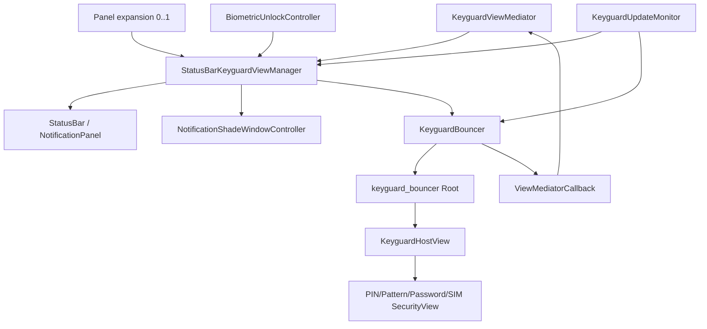
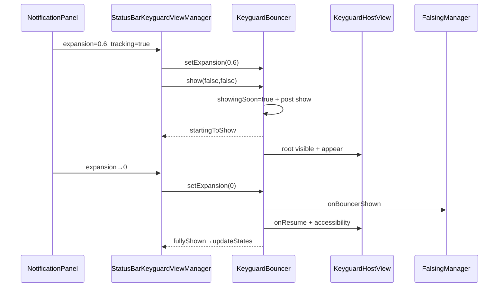
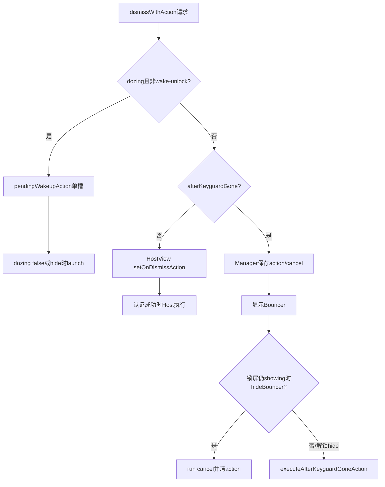

# 第 463 章 Android SystemUI StatusBarKeyguardViewManager 与 KeyguardBouncer：锁屏View、认证页、展开与Dismiss Action链

> 源码基线：Android 11 / API 30 / `android-11.0.0_r48`。本章只在 macOS 阅读，不实际编译。核心文件：`StatusBarKeyguardViewManager.java`、`KeyguardBouncer.java`及两份同名测试，并交叉阅读`KeyguardViewMediator`、`KeyguardHostView`、`DismissCallbackRegistry`、`NotificationPanelViewController`。这里的Bouncer指PIN/图案/密码/SIM认证容器，不是整个Keyguard。

## 1. 本章解决什么问题

Mediator发出show/hide后，StatusBar里的锁屏和Bouncer怎样真正显示？上滑面板为何直接变成Bouncer位移？Face为何让Bouncer延迟1.2秒？Dismiss Action在认证前、解锁开始和View真正消失之间何时执行？

## 2. 一句话主线

`StatusBarKeyguardViewManager`合并Keyguard、occluded、dozing、panel、biometric、remote input和导航状态，决定显示通知锁屏还是全屏Bouncer；`KeyguardBouncer`懒加载`KeyguardHostView`，以`mShowingSoon + root visibility + expansion + animatingAway`描述显示过程，驱动具体安全页、Falsing、Dismiss Action和延迟销毁。

## 3. 两层职责先拆开

Manager拥有“整个锁屏窗口/面板”的事实，控制StatusBar、NotificationShadeWindow、NavBar和锁图标；Bouncer只管理认证根View、SecurityMode、出现/消失动画和认证Action。

## 4. 与上一章的边界

Mediator决定政策和WMS握手；Manager/Bouncer实现View层投影。Mediator的`showing=false`后，Manager可能还在淡出；Manager回`keyguardGone`后，某些child fade仍可能继续。

## 5. 五个显示boolean不要合并

Manager `mShowing`、`mOccluded`，Bouncer `mShowingSoon`、root `VISIBLE`、`mIsAnimatingAway`再叠加expansion。单看`isBouncerShowing()`无法还原完整转场。

## 6. expansion语义反直觉

`EXPANSION_VISIBLE=0f`表示Bouncer位于顶部、完全可见；`EXPANSION_HIDDEN=1f`表示通知面板展开、Bouncer向下移出。数值越大不是“Bouncer展开越多”。

## 7. 线程模型

这些类主要由SystemUI主线程调用；Bouncer注入Handler处理1.2秒Face让路和50ms延迟remove；Manager监听panel、dozing、navigation、configuration和UpdateMonitor，并直接同步更新多个View/controller。

## 8. 总体架构图



## 9. registerStatusBar才完成装配

Manager构造时没有Bouncer；`registerStatusBar`保存StatusBar/容器/面板/生物控制器，借SystemUIFactory创建Bouncer，注册panel expansion与各类监听。

## 10. 注册顺序的前提

多数public方法直接解引用mBouncer/mStatusBar，不做null防御。产品启动必须先registerStatusBar再让Mediator驱动View；测试通过可替换Bouncer验证分支。

## 11. Manager的主要输入

KeyguardUpdateMonitor emergency call、StatusBarState/dozing、panel和QS expansion、Dock、navigation mode、configuration、remote input、global actions、occluded与Mediator show/hide共同改变状态。

## 12. Bouncer的主要输入

show/hide/prepare、panel expansion、screen off、pre-hide、theme/density重建、强认证变化和HostView认证结果共同决定认证页生命周期。

## 13. show先更新窗口事实

Manager `show()`置mShowing=true，让NotificationShadeWindow标Keyguard showing，通知KeyguardStateController，然后`reset(true)`选择全屏Bouncer或普通通知锁屏。

## 14. reset不是重新inflate的同义词

若occluded且非dozing，隐藏StatusBar keyguard并按参数/全屏需要隐藏Bouncer；否则走`showBouncerOrKeyguard`。最后还通知UpdateMonitor keyguard reset并updateStates。

## 15. 普通锁屏路径

无需全屏Bouncer时先`StatusBar.showKeyguard()`；若要求hideBouncer，就hide并`prepare()`，后者确保View存在、可能重选primary security并缓存prompt reason。

## 16. 全屏Bouncer路径

当前SecurityMode是SIM PIN/PUK且非dozing时，隐藏通知锁屏，直接`mBouncer.show(reset=true)`。SIM认证必须优先，不允许通知面板作为主要表面。

## 17. needs与isFullscreen的区别

`needsFullscreenBouncer()`每次借SecurityModel按current user重算；`isFullscreenBouncer()`读取当前HostView已显示mode，更快但要求View存在。前者决定将要展示什么，后者描述现场。

## 18. Bouncer View懒加载

构造只注册UpdateMonitor callback，不inflate。`ensureView()`在首次show/prepare/message/media key等场景创建`keyguard_bouncer`根和KeyguardHostView，降低常驻View成本。

## 19. inflate做了什么

先remove旧root并取消pending remove，inflate布局，给HostView注入LockPatternUtils和ViewMediatorCallback，添加到容器末尾，记录status bar高度，初始设INVISIBLE并转发已有WindowInsets。

## 20. 未attach时Insets可能为空

刚add后`getRootWindowInsets()`可能null，代码跳过；随后正常View attach/layout会走系统Insets分发。这里不是“永远没有Insets”的证据。

## 21. show先固定用户快照

入口记`keyguardUserId`；split system user且为system直接return。ensure/reset之后再读activeUserId，只有仍与快照一致且非禁止用户才允许HostView尝试dismiss。

## 22. 为什么读取两次用户

inflate和安全选择可能跨一段主线程工作；若期间用户切换，旧用户Bouncer不能替新用户提交dismiss。不同就记录warning并继续显示挑战，而不是接受旧结果。

## 23. show的第一步可能直接dismiss

`mKeyguardView.dismiss(activeUserId)`若发现无挑战、已有trust/biometric等可以完成，会返回true，show立即结束，不设置showingSoon，也不再安排出现Runnable。

## 24. show主链源码

```java
ensureView();
mIsScrimmed = isScrimmed;
if (isScrimmed) setExpansion(EXPANSION_VISIBLE);
if (resetSecuritySelection) showPrimarySecurityScreen();
if (mRoot.getVisibility() == View.VISIBLE || mShowingSoon) return;
if (allowDismissKeyguard && mKeyguardView.dismiss(activeUserId)) return;
mShowingSoon = true;
scheduleShowRunnable();
mCallback.onBouncerVisiblityChanged(true);
mExpansionCallback.onStartingToShow();
```

## 25. scrimmed先把expansion置0

全屏/直接出现的Bouncer在检查HostView dismiss之前就set visible expansion，可能先触发onFullyShown、Falsing shown和HostView resume；若随后dismiss返回true，root仍INVISIBLE却已有“fully shown”侧效应，最终靠后续hide收束。

## 26. repeated show仍可重选安全页

resetSecuritySelection处理发生在“root已VISIBLE或showingSoon就return”之前；重复show(true)虽不重复通知visibility，仍可执行showPrimarySecurityScreen适应SIM/凭据方式变化。

## 27. showingSoon是什么

它表示show已接受但Runnable尚未把root设VISIBLE。它不是动画完成，也不保证layout完成；hide/reset会取消相关Runnable并清flag。

## 28. Face让路条件

Face auth enabled、非fullscreen、当前不需StrongAuth且Bypass关闭时，Bouncer延迟1200ms显示，给被动人脸一次无打断解锁机会；否则postAfterTraversal尽快显示。

## 29. 测试名比实现更强

测试叫`delaysIfFaceAuthIsRunning`，实现只查`KeyguardStateController.isFaceAuthEnabled()`，没有检查Face detection running。启用但当前未扫描也会延迟，不能按测试名解释生产条件。

## 30. Bypass为何不延迟

开启Bypass的Face目标就是直接穿过锁屏；需要Bouncer时通常应立即展示强认证/失败反馈，代码跳过1200ms延迟。

## 31. show通知早于View可见

设置showingSoon后立刻`onBouncerVisiblityChanged(true)`和onStartingToShow；Mediator/Manager可能据此改窗口输入与图标，而root要下一遍历或1.2秒后才VISIBLE。

## 32. ShowRunnable真正做什么

设root VISIBLE、显示prompt reason、消费一次custom message；根据Host高度决定立即appear或等pre-draw；清showingSoon，若expansion已0再resume/reset security container并重复prompt，最后写StatsLog SHOWN。

## 33. prompt可能调用两次

Runnable开头一次，expansion visible分支又一次。通常只是重复刷新文案；若SecurityView对prompt有副作用，不能假设一次show只调用一次。

## 34. custom message只消费一次

来自Mediator的单槽message在root真正VISIBLE的Runnable内读取并清；若show被hide取消，message仍留在Mediator，未来另一轮Bouncer可能消费旧文案。

## 35. pre-draw listener缺代际token

高度不合适时注册listener闭包引用`mKeyguardView`字段；hide或50ms remove/reinflate后，迟到pre-draw可能访问新Host或已分离View，代码没有捕获本轮Host局部引用/generation。

## 36. appear前的高度判定

高度非0且不等statusBarHeight才立即动画；0或仅状态栏高说明尚未完成有效layout，requestLayout后等pre-draw，避免从错误尺寸启动。

## 37. expansion驱动几何

非animatingAway时，Host alpha只在0.95→1最后5%从1降到0；translationY始终为`fraction*height`。大部分上滑过程Bouncer保持不透明，只做纵向位移。

## 38. 精确0/1才触发边沿

代码以float `==`判断fully shown/hidden；面板控制器通常会给精确端点，但若动画因取消停在极小非零值，就不会onResume/onPause式收尾。

## 39. FullyShown副作用

FalsingManager结束Bouncer触摸记录阶段、HostView onResume、无障碍播报；Manager callback再updateStates、必要时wake dozing、刷新锁图标。

## 40. FullyHidden副作用

取消show Runnable、root INVISIBLE、Falsing hidden，并postAfterTraversal reset security container；Manager再updateStates和锁图标。

## 41. StartingToHide只在离开0时发

从完全可见0转成非0才通知Manager和HostView；从0.5继续到1不会重复。pre-hide `mIsAnimatingAway=true`时几何更新被跳过，但状态边沿仍可由setExpansion触发。

## 42. Swipe显示链

Manager收到panel expansion；锁屏showing、非wake-and-unlock、非app launch时传给Bouncer。用户tracking且不可直接dismiss、Bouncer未show/未animatingAway时，调用show(reset=false,scrimmed=false)。

## 43. 哪些情况强制固定expansion

unlock hint运行时强制hidden=1；occluded、dismiss action、全屏用户切换、已scrimmed或fullscreen Bouncer需要scrim时强制visible=0，保留独立全屏动画而不跟手拖动。

## 44. 面板链时序图



## 45. isShowing的复合条件

`(showingSoon || root visible) && expansion==0 && !animatingAway`。因此scrimmed show可在root仍INVISIBLE时因showingSoon+0报告true；拖拽中root可见但fraction=0.5又报告false。

```java
public boolean isShowing() {
    return (mShowingSoon || (mRoot != null && mRoot.getVisibility() == View.VISIBLE))
            && mExpansion == EXPANSION_VISIBLE && !isAnimatingAway();
}
```

## 46. inTransit补哪块语义

showingSoon或expansion处于0/1之间为true；Manager的`bouncerIsOrWillBeShowing`用isShowing OR inTransit，覆盖请求中与跟手位移阶段。

## 47. root visibility不是权威API

直接检查VISIBLE会把拖拽中视为showing，也会漏showingSoon；外部应按需求选择isShowing、inTransit或复合方法，不应发明一个万能visible。

## 48. hide的第一项回执

只有`isShowing()`为true时写Stats HIDDEN并通知DismissCallbackRegistry cancelled；拖拽中expansion非0时即使root VISIBLE，hide不会cancel registry，可能留下等待callback到未来成功/取消事件。

## 49. hide总会发visibility false

无论此前是否showing，都清scrim、通知Falsing hidden、`onBouncerVisiblityChanged(false)`、取消show Runnable、取消Host dismiss action、cleanup并清animatingAway。

## 50. hide重复调用不幂等

Falsing hidden和Mediator visibility false可重复；Host cleanup也重复。接收端需容忍同值/重复边沿，测试也验证未show时仍通知Falsing/visibility。

## 51. destroyView延迟50ms

为避免ViewFlipper detach时注销广播争抢AMS锁拖慢解锁，hide先INVISIBLE，50ms后remove root；这是性能折中，不是动画时长。

## 52. ensureView会抢先完成remove

若50ms内又要show，发现Handler仍有remove callback，就立刻inflate；inflate先remove旧root并取消callback，避免旧Runnable稍后把新View误删。

## 53. removeView留下stale Host字段

remove只把root从容器移走并置`mRoot=null`，没有把`mKeyguardView=null`。50ms任务执行后showMessage、willDismissWithAction、isSecure等未ensure的方法仍可能访问已detach旧Host，直到下次inflate覆盖。

```java
protected void removeView() {
    if (mRoot != null && mRoot.getParent() == mContainer) {
        mContainer.removeView(mRoot);
        mRoot = null;
    }
}
```

## 54. reset是销毁重建

Bouncer.reset取消show并直接`inflateView()`，不是只调用Host reset；配置变化、主题变化可重建整个认证树，丢弃旧输入/动画状态。

## 55. prepare比reset温和

若从未初始化就ensure；已初始化才showPrimarySecurityScreen；然后缓存Mediator计算的prompt reason。它不会让root可见。

## 56. StrongAuth变化只改prompt缓存

Bouncer的UpdateMonitor callback仅在onStrongAuthStateChanged时重新调用getBouncerPromptReason；若View当前可见，不立即`showPromptReason`，要等ShowRunnable或其他显式刷新。

## 57. screenOff只pause可见Host

root VISIBLE时调用Host onPause；若处于1.2秒showingSoon且root INVISIBLE，不取消show Runnable。理论上Runnable可在熄屏后继续把root设VISIBLE，通常后续dozing reset会收束，但这里没有独立screen generation。

## 58. pre-hide设置animatingAway

`startPreHideAnimation`先置true，再让Host startDisappear并持有Mediator finish Runnable；之后isShowing=false、setExpansion不再改alpha/translation，避免跟手状态打断退出。

## 59. Host为空仍完成pre-hide

若View不存在，直接run finish，保证上一章`tryKeyguardDone`不会因没有Bouncer View永久等待。

## 60. Manager startPreHide的额外工作

若Bouncer showing才调用Bouncer disappear并通知StatusBar；否则直接完成。无论哪条路都block当前触摸继续展开，并刷新锁图标。

## 61. dismissWithAction的两种时点

`afterKeyguardGone=false`把action/cancel交给HostView，认证完成时执行；true则Manager保存action/cancel，先普通show Bouncer，计划在Manager hide链执行。

## 62. not showing时请求静默丢弃

Manager `dismissWithAction`只有mShowing分支存储或show；锁屏不show时既不执行action，也不run cancel。方法最后仅updateStates，没有error回执。

## 63. dozing会暂存单个请求

dozing且不是wake-and-unlock时，不立刻show Bouncer，而把`DismissWithActionRequest`放mPendingWakeupAction；新请求先cancel旧pending，再覆盖单槽。

## 64. pending何时启动

setDozing(false)或Manager hide开头调用launch；若仍showing则重新走dismissWithAction，若已不showing则直接执行dismissAction，忽略afterKeyguardGone和message。

```java
public void launchPendingWakeupAction() {
    DismissWithActionRequest request = mPendingWakeupAction;
    mPendingWakeupAction = null;
    if (request != null) {
        if (mShowing) {
            dismissWithAction(request.dismissAction, request.cancelAction,
                    request.afterKeyguardGone, request.message);
        } else if (request.dismissAction != null) {
            request.dismissAction.onDismiss();
        }
    }
}
```

## 65. pending direct执行的时点

Manager hide第一行把mShowing=false后立即launchPendingWakeupAction，所以action可能在Keyguard child淡出和`keyguardGone`之前执行；“屏幕醒来后”不等于“锁屏View完全消失后”。

## 66. afterKeyguardGone名称并不统一

普通非launch-transition hide分支先调用`executeAfterKeyguardGoneAction()`，再开始StatusBar hide/fade；launch-transition分支在fade完成回调才执行。同名action在不同转场模式有不同视觉完成语义。

## 67. hideBouncer为何有cancel门

Manager仍mShowing时hideBouncer表示放弃本轮认证，于是清afterGone action并run cancel；Manager.hide先把mShowing=false，随后hideBouncer就不会cancel，使解锁成功路径能执行action。

## 68. 测试证明状态先后很关键

一项测试先hideBouncer再Manager.hide，期待cancel；另一项直接Manager.hide，期待action执行而不cancel。正确性依赖mShowing在调用hideBouncer前已变false。

## 69. Action没有session ID

afterGone是单槽，runnables是全局列表，pending wakeup也是单槽。快速多轮锁屏/解锁时没有generation绑定，旧Runnable可能在新一轮hide被执行。

## 70. Dismiss Action链图



## 71. Manager hide先改什么

立即mShowing=false、通知KeyguardStateController，再launch pending；slow unlock可把fadeout改2秒，随后按WMS start time减48ms校正delay。

## 72. -48ms校正的意义

`HIDE_TIMING_CORRECTION_MS=-16*3`让SystemUI淡出略早三帧，和应用窗口转场对齐；最终delay仍clamp到0，过期startTime不会产生负延迟。

## 73. launch transition是独立路径

先通过StatusBar fade after launch：before回调清window showing/置fading/hide Bouncer；after回调hide keyguard、清fading、回keyguardGone并执行afterGone action。

## 74. 普通路径action执行更早

非launch分支进入后立刻executeAfterGone，再根据wake-unlock/bypass选择fade；所以业务action可能与锁屏退出动画并行，名字不能当“动画结束回调”。

## 75. wake-and-unlock pulsing

强制delay=0、duration=240ms；Bypass需要时淡出除通知容器外的child，否则StatusBar执行pulsing fade。LatencyTracker在遍历后结束指纹wake-unlock指标。

## 76. needsBypassFading条件

生物mode为UNLOCK_FADING、WAKE_AND_UNLOCK_PULSING或WAKE_AND_UNLOCK，且Bypass enabled才true；此时使用Bypass专用panel fade duration与subtle WMS animation。

## 77. leaveOpenOnKeyguardHide

若解锁后保持通知Shade打开，直接hideKeyguard并立即finish两套fading；否则设置window fading，hide/child fade并主动update scrim，防异步hide晚到让fading状态永久卡住。

## 78. keyguardGone回得可能偏早

普通路径在启动某些异步child fade后，同一hide方法末尾就调用ViewMediatorCallback.keyguardGone；真正`onKeyguardFadedAway`稍后才清window fading、reset children和trim memory。

## 79. launch路径的gone更接近视觉结束

launch transition只在fadeKeyguardAfterLaunchTransition的after runnable回gone；因此Mediator收到gone在两类路径的视觉含义不同。

## 80. hide末尾统一写HIDDEN统计

StatsLog发生在方法返回前，不等待child animation。统计“状态进入hidden流程”而非像素完全不可见时间。

## 81. updateStates是差分投影器

读取当前showing/occluded/Bouncer/remote/dozing/pulsing/biometric/nav/dock/global actions，与last快照比较，只在相关组合变化时更新Back、NavBar、窗口Bouncer、Monitor visibility/Bouncer callback和StatusBar总状态。

## 82. firstUpdate强制全量投影

初次即使默认值相同也写一次；之后每轮末尾保存last。last是“已提交UI更新的逻辑快照”，并不保证延迟NavBar Runnable已经真正显示。

## 83. Back键禁用规则

fullscreen Bouncer且Keyguard showing、无remote input时禁Back；普通可dismiss Bouncer、Keyguard不show或remote input active时清禁用。源码在设置禁用分支重复调用两次相同`setSystemUiVisibility`，是无效重复。

## 84. Bouncer showing投影

isShowing变化时同时通知NotificationShadeWindow、StatusBar、锁图标；再向UpdateMonitor发bouncer changed，影响Face/Fingerprint监听政策。

## 85. Keyguard visible投影

Monitor看到的是`showing&&!occluded`，不是Manager mShowing本身。遮挡活动出现时生物/回调会按“默认锁屏不可见”更新，但安全状态仍showing。

## 86. NavBar显示公式

Keyguard不显示且不因dozing隐藏，或Bouncer showing、remote input、手势锁屏、global actions任一条件可显示；pulsing+gestural仅未dock时显示。

## 87. NavBar延迟

Keyguard fading时沿fading delay；Bouncer showing时固定320ms；其他立即。隐藏会remove可见Runnable，再按Insets mode hide或设View GONE。

## 88. 延迟期间last已更新

updateStates在post show Runnable后就把lastNav逻辑状态记为visible；若Runnable被外部原因移除但状态未发生false→true变化，差分器不会自动重投。正常hide路径会remove并同步更新last，异常移除缺自愈。

## 89. Lock icon显示条件

Bouncer showing或KEYGUARD且QS未展开，并且Bouncer未animatingAway、Keyguard未fading才显示；Bypass用专用fade，其余淡出延迟120ms。

## 90. occluded launch竞态

在StatusBar app launch transition中首次occlude，Manager先置mOccluded=true并交给fade回调稍后更新window/reset，然后提前return；回调没有generation且执行时读取可变的当前mOccluded。期间若已unocclude，旧转场回调不会固守旧true，却可能在错误代际再次应用新false并reset/hide Bouncer。

## 91. emergency call特殊reset

若occluded期间启动紧急通话，可能收不到常规setOccluded，于是UpdateMonitor callback手工reset(true)隐藏Bouncer，避免认证页覆盖紧急界面。

## 92. Back行为按scrim/fullscreen区分

Bouncer showing且scrimmed但非fullscreen时直接hide；fullscreen或跟手Bouncer则reset，保持SIM等强制安全页。`hideImmediately`决定reset是否销毁/隐藏Bouncer。

## 93. isSecure的保守默认

Bouncer View尚未inflate时返回true，避免未知状态被当无安全；inflate后依据Host security mode。Manager `isSecure(userId)`还OR LockPatternUtils用户凭据。

## 94. detached Host会影响secure查询

第53节remove后Host字段未清，isSecure不再走“null保守true”，而读已detach旧View mode；配置/用户变化窗口中可能暂时返回陈旧安全模式。

## 95. Falsing回调可能重复

setExpansion fully hidden、hide、reset都调用onBouncerHidden；show scrim set expansion可调用shown，ShowRunnable visible分支又Host resume。Falsing必须把这些当幂等状态通知。

## 96. 测试覆盖Bouncer较丰富

覆盖inflate/show/hide、visibility/Falsing、dismiss尝试、安全页reset、appear/predraw、prompt/message、expansion边沿、Dismiss cancel、pre-hide、secure/fullscreen、scrim、Face delay与inTransit。

## 97. 但Face测试验证了错误名字

测试mock `isFaceAuthEnabled=true`就期待delay，未设置Face running；它固化了实现的“enabled”条件，却用running命名，容易误导维护者。

## 98. 未测screen-off迟到show

没有安排1200ms show后调用onScreenTurnedOff再推进时间，无法证明熄屏不会把root变VISIBLE；也未测dozing reset与show Runnable的真实排序。

## 99. 未测pre-draw跨重建

缺少“注册OnPreDraw→hide destroy→ensure新View→旧preDraw触发”的代际测试；字段闭包可能对新旧Host错配。

## 100. 未测detach Host残留

没有推进50ms remove后断言mKeyguardView清空，或验证showMessage/isSecure/willDismiss不会访问detached View。

## 101. Manager测试聚焦面板和Action

覆盖showBouncer门、hint/scrim/fullscreen expansion、tracking show、occluded/wake-unlock/app-launch不平移、unocclude动画，以及afterGone action cancel/execute的mShowing顺序。

## 102. 未测复杂hide完成语义

launch、pulsing、Bypass、leave-open、child fade、keyguardGone/onKeyguardFadedAway的顺序都未覆盖；afterGone名称与实际执行时间差没有回归测试。

## 103. 未测updateStates异步Nav

没有验证320ms runnable被状态翻转取消、Insets mode两分支、global actions/remote input/dock/pulsing组合及last快照与真实Nav visibility偏差。

## 104. 改进一：显式Bouncer状态机

用DETACHED、PREPARED、SHOW_SCHEDULED、VISIBLE_TRANSITION、FULLY_VISIBLE、PREHIDING、HIDDEN代替四字段组合；每轮show携带generation，Runnable/preDraw/remove只作用本代。

## 105. 改进二：清理View引用

remove同时把root和Host置null，所有对Host操作先ensure或验证attached；延迟remove token关联目标root，不能删除/操作新代View。

## 106. 改进三：统一Action完成点

分别命名`afterAuthentication`、`afterKeyguardStateHidden`、`afterViewGone`、`afterFadeFinished`，每个请求有ID和cancel/error；不再让afterKeyguardGone在不同动画路径提前/延后。

## 107. 改进四：screen与user generation

Face delay和preDraw捕获userId、screen/wake generation；屏幕熄灭、用户切换或Keyguard session变化就取消，而不是依赖后续dozing偶然收束。

## 108. 改进五：差分投影可观测性

dump current/last、pending Nav runnable deadline、root attached/visibility、show generation、preDraw/remove token、pending/afterGone action ID和最后一次callback时刻。r48现有Bouncer dump还把`mShowingSoon`标签后的值误写成`mKeyguardView`对象，首先应修正这个确定性诊断错误。

## 109. 源码阅读顺序

先读Manager show/reset/panel/updateStates，再读Bouncer show/setExpansion/hide/ensure；最后追Manager hide、Action和Nav。先扎进具体PIN View会失去跨层状态语义。

## 110. 四个“显示”问法

问“请求了吗”看showingSoon；“root attach/visible吗”看root；“用户能交互吗”看expansion/isShowing/animating；“整个Keyguard显示吗”看Manager showing&&!occluded。

## 111. 本章检查清单

能否解释0/1 expansion、scrimmed、fullscreen、Face 1200ms、showingSoon、preDraw、50ms remove、detached Host、pending wakeup、两类Dismiss Action、keyguardGone早晚差异及updateStates差分？

## 112. macOS 只读练习一：追一次上滑Bouncer

从`onPanelExpansionChanged(0.6,true)`追setExpansion、show(false,false)、showingSoon、ShowRunnable，再把fraction推到0；记录root visibility、isShowing、inTransit、Falsing和UpdateMonitor callback各何时改变。

## 113. macOS 只读练习二：推演Face延迟竞态

满足Face enabled条件安排1200ms show，分别插入hide、screen off、dozing true、user switch和density change；逐个找谁取消Handler/Dejank Runnable，谁只依赖后续reset。

## 114. macOS 只读练习三：审计View销毁

从hide(true)追50ms remove，确认remove只清root；列出哪些public方法会ensure，哪些直接使用mKeyguardView，并推演在detach窗口中的返回或副作用。

## 115. macOS 只读练习四：比较Action完成点

分别推演afterGone=false、true普通hide、true launch-transition、dozing pending且hide时已not showing；标出action、cancel、keyguardGone、fade finished和Host cleanup顺序。

## 116. 最容易误解的一点

Bouncer `isShowing()`不是root visibility。它刻意把scrimmed showingSoon算showing，又把跟手拖拽中的VISIBLE root算非showing，服务的是交互状态而非像素查询。

## 117. 第二个易错点

Face延迟条件是“Face auth enabled”，不是源码证明的“Face当前正在识别”。测试名不能覆盖if表达式的真实语义。

## 118. 第三个易错点

`afterKeyguardGone`在普通路径会早于真实fade/gone执行，launch路径却在fade后执行。业务若需要严格视觉完成，必须使用更准确的回调点。

## 119. 本章结论

Manager把Keyguard/面板/生物/Doze/导航合成窗口与交互投影，Bouncer则以懒加载Host和expansion驱动具体认证。r48有清晰的主路径和较多Bouncer单测，但状态仍由多boolean、延迟Runnable和单槽Action隐式拼接，存在Face enabled误命名、screen-off迟到show、preDraw无代际、remove后Host残留、拖拽hide漏Dismiss cancel、afterGone完成点不一致、occluded旧回调及Nav差分快照偏差等边界。调试必须先问“哪一层、哪一种显示、哪一代Action”。

## 120. 下一章预告

第464章继续阅读`KeyguardHostView`、`KeyguardSecurityContainer`与`KeyguardSecurityModel`，研究SecurityMode选择、SIM/PIN/图案/密码View切换、finish与Dismiss Action认证闭环。
