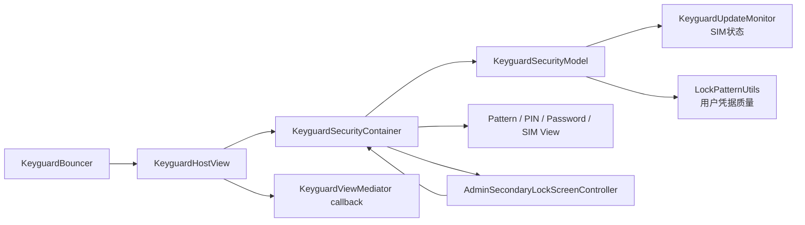
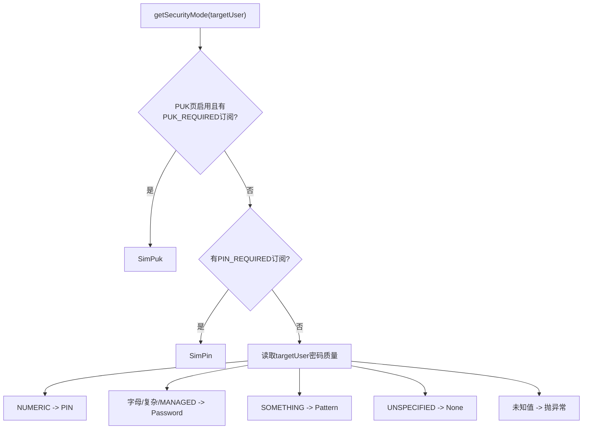
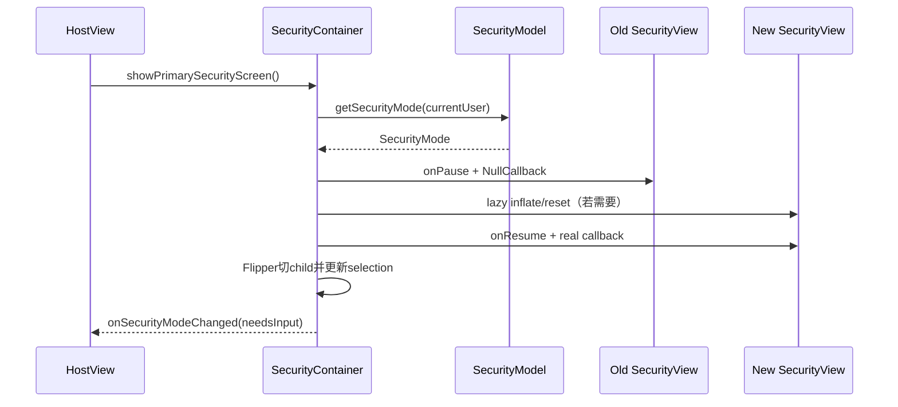

# 第 464 章 Android SystemUI KeyguardHostView、SecurityContainer 与 SecurityModel：安全模式切换、认证完成和企业二次锁屏链

> 源码基线：Android 11 / API 30 / `android-11.0.0_r48`。本章只在 macOS 阅读，不实际编译。核心文件：`KeyguardHostView.java`、`KeyguardSecurityContainer.java`、`KeyguardSecurityModel.java`、`AdminSecondaryLockScreenController.java`，并复核`KeyguardHostViewTest.java`与`KeyguardSecurityContainerTest.java`。

## 1. 本章解决什么问题

上一章看到Bouncer把`KeyguardHostView`放到屏幕上，本章继续向内追：系统如何选SIM PUK、SIM PIN、图案、数字PIN或密码页；验证完成后为何有时还不能解锁；企业二次锁屏又怎样接入同一条完成链。

## 2. 一句话主线

`KeyguardSecurityModel`计算当前优先挑战，`KeyguardSecurityContainer`懒加载并切换具体安全View、汇总认证结果，`KeyguardHostView`把最终结果和Dismiss Action交给Mediator；若设备策略要求额外认证，Container先让`AdminSecondaryLockScreenController`显示远端Surface，完成后再绕回Container并显式跳过第二次检查。

## 3. 四个类各管一层

Model只回答“该用哪种SecurityMode”；Container拥有当前选择、View生命周期和完成决策；HostView承接Bouncer与Mediator；Admin Controller负责绑定企业服务、展示远端Surface和超时收口。不要把它们都叫“密码页”。

## 4. 先分清配置、选择和View

用户的锁屏配置存于LockSettings；Model依据SIM状态和密码质量算出模式；Container的`mCurrentSecuritySelection`记录当前正在展示的模式；具体`KeyguardPINView`等才是可交互View。这四层可能短时间不一致。

## 5. 本章源码地图

入口主要在`frameworks/base/packages/SystemUI/src/com/android/keyguard/`。建议同时打开四个生产文件和两个测试文件，搜索`getSecurityMode`、`showSecurityScreen`、`showNextSecurityScreenOrFinish`、`finish`及`dismiss`。

## 6. 从Bouncer进入的调用链

`KeyguardBouncer.ensureView()`膨胀HostView；HostView的`onFinishInflate()`取得Container并显示主安全页；具体View验证后经`KeyguardSecurityCallback.dismiss()`回到Container；Container决定切下一页、显示企业页或调用HostView的`finish()`。

## 7. SecurityMode一共七种

`Invalid`是尚未建立有效选择，`None`表示无需具体凭据View；`Pattern/Password/PIN`是设备凭据；`SimPin/SimPuk`是SIM挑战。生物识别和Trust不在这个枚举里，它们是绕过当前View的完成条件。

## 8. Invalid不等于None

`Invalid`是容器初始哨兵，防止把“还没选择”误当成“确定无安全方式”；`None`则是一次真实计算结果。两者都没有布局，但语义完全不同。

## 9. 两条安全轴线

SIM挑战保护蜂窝卡，图案/PIN/密码保护Android用户数据。r48把两条轴线串成顺序流程：先解决全局SIM状态，再进入目标用户的设备凭据，而不是从两者任选其一。

## 10. 总体结构图



## 11. PUK优先级最高

只有资源开关`config_enable_puk_unlock_screen`为true，并且Monitor能找到处于`SIM_STATE_PUK_REQUIRED`的有效subscription id，Model才返回`SimPuk`。它先于SIM PIN和设备凭据。

## 12. SIM PIN排第二

没有可用PUK挑战后，Model查`SIM_STATE_PIN_REQUIRED`；只要找到有效订阅就返回`SimPin`。因此一个用户配置了密码，也会先看到SIM PIN。

## 13. SIM查询不是按userId过滤

`getSecurityMode(userId)`的参数只传给`getActivePasswordQuality(userId)`；SIM状态来自全局`KeyguardUpdateMonitor`。所以方法名看似“查某用户”，实际前半段仍是设备级电话状态。

## 14. PUK资源开关是能力边界

SIM处于PUK_REQUIRED却关闭PUK页面时，代码不会返回`SimPuk`，而会继续查PIN_REQUIRED和设备凭据。这不是“PUK等于无锁”，而是当前产品配置不提供这张SystemUI挑战页。

## 15. Model的真实优先级源码

```java
if (mIsPukScreenAvailable && SubscriptionManager.isValidSubscriptionId(
        monitor.getNextSubIdForState(TelephonyManager.SIM_STATE_PUK_REQUIRED))) {
    return SecurityMode.SimPuk;
}
if (SubscriptionManager.isValidSubscriptionId(
        monitor.getNextSubIdForState(TelephonyManager.SIM_STATE_PIN_REQUIRED))) {
    return SecurityMode.SimPin;
}
final int security = whitelistIpcs(() ->
        mLockPatternUtils.getActivePasswordQuality(userId));
```

这段顺序就是行为合同：PUK、PIN、目标用户设备凭据。阅读时不要根据枚举声明顺序猜优先级。

## 16. 密码质量如何映射

`NUMERIC/NUMERIC_COMPLEX`映射PIN；`ALPHABETIC/ALPHANUMERIC/COMPLEX/MANAGED`映射Password；`SOMETHING`映射Pattern；`UNSPECIFIED`映射None。`MANAGED`仍落到密码UI，而不是新SecurityMode。

## 17. 未知质量直接失败

switch的default抛`IllegalStateException`。这是一种fail-fast：新增DevicePolicy质量却忘记更新SystemUI时，系统不会悄悄降级为None。

## 18. whitelistIpcs不是权限白名单

这里的`whitelistIpcs`来自`DejankUtils`，用于标记允许在当前路径发生的同步IPC，避免严格卡顿检查误报；它不改变调用者权限，也不代表安全授权通过。

## 19. 每次重算都可能改变答案

解开一张SIM后，另一张SIM或设备凭据可能成为下一模式；用户切换后，设备凭据也会变化。因此SecurityMode是瞬时决策，不应缓存成“用户永久锁型”。

## 20. SecurityMode决策图



## 21. 用三个场景验证顺序

场景A：SIM需PUK、用户设PIN，结果SimPuk；场景B：PUK解决后另一SIM需PIN，结果SimPin；场景C：全部SIM就绪，才按目标用户质量返回PIN。逐次重算比背枚举更容易理解。

## 22. 多用户边界

设备凭据用传入`targetUserId`，但`showPrimarySecurityScreen()`固定传静态current user。正常主流程二者相同；异步认证或切用户竞态中必须关注“目标用户”和“此刻前台用户”是否仍一致。

## 23. Container构造时拿到什么

它通过`Dependency`取得SecurityModel、UpdateMonitor和KeyguardStateController，建立SpringAnimation、注入型LayoutInflater，并创建Admin Controller。Container因此既是ViewGroup，也是认证编排器。

## 24. Handler隐含线程前提

Admin Controller收到`new Handler(Looper.myLooper())`。若Container不在带Looper的线程构造，Handler会失败；SystemUI正常在主线程膨胀，所以该前提成立，但构造器没有显式断言主线程。

## 25. Flipper是具体页容器

`KeyguardSecurityViewFlipper`持有Pattern、PIN、Password、SimPin、SimPuk子View，并通过`setDisplayedChild()`切换。Container不为每次出现重新创建所有页面。

## 26. 安全页按需膨胀

`getSecurityView(mode)`先按View id扫描已有child；不存在且layout id非0时，才通过InjectionInflationController膨胀、加入Flipper、注入callback与LockPatternUtils并调用`reset()`。

## 27. None和Invalid没有View

二者的View id和layout id都是0，`getSecurityView()`返回null。这是有意设计，所以调用方必须在访问`needsInput()`或生命周期前排除None。

## 28. 注入膨胀的意义

`injectable(inflater)`允许SystemUI组件在XML膨胀时取得依赖，而不是只用反射无参构造。阅读具体安全View时，要同时看其构造注入，不能把XML当完整依赖图。

## 29. showSecurityScreen是真正切页点

它暂停旧View、把旧View callback换成NullCallback；恢复新View、装回真实callback；切Flipper child；最后更新当前选择/当前View并通知Host是否需要IME输入。

## 30. 同模式切换直接返回

若参数等于`mCurrentSecuritySelection`，方法不reset、不resume，也不重复通知`needsInput`。因此“重新显示主安全页”不一定刷新当前页内部状态，刷新通常由外层`reset()`承担。

## 31. View切换核心源码

```java
if (oldView != null) {
    oldView.onPause();
    oldView.setKeyguardCallback(mNullCallback);
}
if (securityMode != SecurityMode.None) {
    newView.onResume(KeyguardSecurityView.VIEW_REVEALED);
    newView.setKeyguardCallback(mCallback);
}
mCurrentSecuritySelection = securityMode;
mCurrentSecurityView = newView;
mSecurityCallback.onSecurityModeChanged(securityMode,
        securityMode != SecurityMode.None && newView.needsInput());
```

短路表达式保证None时不解引用null；非None却没膨胀出View时会在`onResume()`直接暴露问题。

## 32. NullCallback隔离迟到结果

旧View可能仍有异步校验回调。切页时把它的callback替换为空实现，可让多数迟到的dismiss/report失效，避免旧页面改变新状态。

## 33. NullCallback不是完整代际令牌

它依赖异步任务完成时重新读取View字段里的callback；若任务早已捕获真实callback对象，换字段不能撤销捕获。源码没有显式screen generation，审计异步View时仍要看回调保存方式。

## 34. 生命周期顺序有细节

新View先`onResume()`，再`setKeyguardCallback(mCallback)`。首次膨胀时`updateSecurityView()`已经装过真实callback，因此正常可用；但这一顺序本身不适合作为“resume前一定无回调”的保证。

## 35. 非None失败会快速崩出

若布局id错误、膨胀结果不是KeyguardSecurityView或注入失败，`newView.onResume()`会NPE/膨胀异常，而不是静默显示空页。认证UI选择fail-fast更安全，但恢复性较弱。

## 36. current selection与model mode可不同

`getCurrentSecurityMode()`返回正在显示的选择；`getSecurityMode()`重新问Model。例如刚解开SIM但尚未切页时，Model可能已返回设备PIN，当前选择仍是SimPin。

## 37. showPrimarySecurityScreen只做两步

它以current user重新计算Model，然后调用`showSecurityScreen()`。名字里的“primary”不是强制设备凭据；若SIM仍锁定，主安全页就是SIM页。

## 38. turningOff参数在r48未参与决策

`showPrimarySecurityScreen(boolean turningOff)`只把参数写进debug log，计算与切页完全相同。不要根据注释推导关屏时有另一种选择策略。

## 39. Face重试何时开启

Container恢复时调用`updateBiometricRetry()`；只有Face auth enabled，并且Model模式不是SimPin、SimPuk、None，才允许向上滑重试。

## 40. enabled不等于running

开关只判断Face能力/策略已启用，不代表相机当前正在检测。真正松手时又用`isFaceDetectionRunning()`避免重复请求。

## 41. 手势分拦截和消费两层

`onInterceptTouchEvent()`决定是否从具体安全View抢走手势；`onTouchEvent()`更新位移、弹簧回正并可能请求Face。把两者混看，容易误以为每次MOVE都由Container收到。

## 42. 拦截阈值被放大四倍

向上位移要超过`scaledTouchSlop * 4`才进入dragging，避免输入PIN或画图案时轻微移动就切成Face重试手势。

## 43. 跟手位移只取四分之一

每次dy乘`TOUCH_Y_MULTIPLIER=0.25`再加到Container translationY，产生阻尼感；触发阈值却检查最终translation超过10dp，因此手指实际通常要上移更多。

## 44. MOVE存在无效pointer风险

拦截层检查`findPointerIndex()`不为-1，消费层却直接`getY(pointerIndex)`。若多指切换或事件序列异常导致-1，这里可能抛异常；这是r48源码边界，不应写成框架自动兜底。

## 45. 速度计算并不完整

源码只在MOVE调用`addMovement()`，松手前没有`computeCurrentVelocity()`，却直接取`getYVelocity()`传给SpringAnimation；因此起始速度可能为0或旧值，不能把回弹描述为严格复现手指速度。

## 46. Face请求的最终条件

只有ACTION_UP、Container向上translation超过10dp且Face当前未运行，才`requestFaceAuth()`；ACTION_CANCEL只回弹，不请求。

## 47. 请求Face还会做两件事

它调用`mCallback.userActivity()`延长交互活跃状态，并`showMessage(null, null)`清当前安全页提示。请求认证和UI反馈不是同一调用。

## 48. Pattern可拒绝父容器拦截

Container先问当前View的`disallowInterceptTouch(event)`，用于避免画图案过程被父层上滑手势截走。手势优先权由子View动态参与决定。

## 49. Container恢复时的工作

`onResume()`恢复当前非None安全View、安装WindowInsets动画callback并更新Face重试资格。它不是只把View设VISIBLE。

## 50. Container暂停会清理什么

`onPause()`关闭警告Dialog、隐藏企业二次锁屏、暂停当前安全View并移除Insets动画callback。Bouncer销毁前HostView的`cleanUp()`也走这条路径。

## 51. Insets由Container消费

新Insets模式下取系统栏底部与IME底部的最大值作为padding，并从返回Insets中扣掉同样底部值，避免子View再次应用。密码键盘布局由此与导航栏协作。

## 52. 安全页切换时序图



## 53. 消失动画状态先置true

`startDisappearAnimation()`一进入就把`mDisappearAnimRunning=true`，然后Password模式额外控制IME退出，最后委托当前安全View动画。

## 54. IME取消没有清flag

受控Insets动画的`onFinished()`会清false，`onCancelled()`却为空。如果控制请求被取消，`isAnimating()`可能长期仍认为消失动画运行。

## 55. None路径也会留下true

当前模式为None时，方法先置true，随后因无安全View直接返回false，没有清flag。Host会立即运行finishRunnable，但Container内部动画事实可能已经不准确。

## 56. 现有动画测试只覆盖一条路

`startDisappearAnimation_animatesKeyboard`只验证Password调用具体View和Insets控制器；没有验证finished/cancelled、None或重复启动时flag收束。

## 57. 具体View通过Container callback上报

安全View不直接找Mediator。它只调用`KeyguardSecurityCallback`：用户活动、输入、校验成功/失败、dismiss、reset或取消，再由Container桥接给Host。

## 58. 任意用户输入会取消Face

Container callback的`onUserInput()`直接`mUpdateMonitor.cancelFaceAuth()`。开始输PIN/画图案后暂停被动人脸，避免两个认证源同时改变UI。

## 59. 成功上报包含系统记账

成功时写SysUiStatsLog、调用`reportSuccessfulPasswordAttempt(userId)`清理/更新锁屏失败记录，并写Metrics与UiEvent；这不同于最终dismiss，前者是凭据尝试结果。

## 60. 延迟GC实际占用后台线程

成功后代码向后台线程投一个任务，任务内部`Thread.sleep(5000)`再`Runtime.gc()`，意图晚些清理内存中的密码。它不是定时器，会让该后台执行线程睡眠五秒。

## 61. 完成决策的输入有三个

`showNextSecurityScreenOrFinish(authenticated, targetUserId, bypassSecondaryLockScreen)`同时需要“本次是否已验证”“要完成到哪个用户”“是否跳过企业二次页”。少看任一参数都会误判。

## 62. 完成链核心源码

```java
if (mUpdateMonitor.getUserHasTrust(targetUserId)) {
    finish = true;
} else if (mUpdateMonitor.getUserUnlockedWithBiometric(targetUserId)) {
    finish = true;
} else if (SecurityMode.None == mCurrentSecuritySelection) {
    SecurityMode mode = mSecurityModel.getSecurityMode(targetUserId);
    if (SecurityMode.None == mode) finish = true;
    else showSecurityScreen(mode);
} else if (authenticated) {
    // Pattern/PIN/Password完成；SIM则重算下一种模式
}
```

真实源码还设置Metrics subtype和UiEvent，并在finish成立后检查企业二次锁屏。

## 63. Trust和生物识别优先

方法先查目标用户Trust，再查“已用生物识别解锁”，之后才看当前安全页和`authenticated`参数。所以即使PIN页在前台，已有有效Trust/biometric也可让本次调用进入完成候选。

## 64. None模式会再次询问Model

当前选择为None不等于永久可完成。Container重算目标用户模式：仍为None才finish；若SIM或凭据状态已变，就切到新安全页。

## 65. authenticated只影响后半段

Trust、biometric或None无需本次View传入true；当前是Pattern/PIN/Password/SIM时，只有`authenticated=true`才进入对应成功分支。false通常保持当前页等待下一次输入。

## 66. 三种设备凭据直接完成

Pattern、PIN、Password验证成功时令`strongAuth=true`并finish。这里的strongAuth是交给Mediator的认证强度信号，不是SecurityMode枚举，也不是“锁屏一定已经消失”。

## 67. SIM成功不是strongAuth

SimPin/SimPuk只证明SIM持有人知识，不证明Android用户设备凭据，所以不会置`strongAuth=true`。它先重算Model，可能继续到另一SIM或设备凭据。

## 68. SIM后的None还有额外判断

只有重算为None且`isLockScreenDisabled(currentUser)`为true才直接finish；否则切到重算模式。重算为None但锁屏未disabled时，会选择None并返回false，后续再次dismiss才可能完成。

## 69. SIM分支有用户取值不一致

Model用`targetUserId`重算，`isLockScreenDisabled()`却传`KeyguardUpdateMonitor.getCurrentUser()`。正常二者一致；切用户竞态中可能查了不同用户，这是阅读r48必须保留的边界。

## 70. 返回false不等于认证失败

方法返回false可能表示切到下一安全页、仍等待输入、进入企业二次页，或遇到fail-safe。调用者不能仅凭false显示“密码错误”；错误结果由`reportUnlockAttempt(false,...)`单独上报。

## 71. 企业二次检查发生在finish之后

Container先得出“主认证可以完成”，再查询`getSecondaryLockscreenRequirement(targetUserId)`。有Intent且未bypass时显示Admin页并立即返回false，暂不调用Host finish。

## 72. Admin页不是普通本地View

Controller创建一个置顶`SurfaceView`，绑定DevicePolicy提供的远端`IKeyguardClient`服务，由远端通过`SurfaceControlViewHost.SurfacePackage`把内容嵌到SystemUI。

## 73. show同时处理绑定和挂载

若`mClient`为空就`bindService(BIND_AUTO_CREATE)`；若AdminSecurityView尚未附着就加入Container。服务连接与Surface创建可能先后发生，两个回调都能触发`onSurfaceReady()`。

## 74. Surface ready需要host token

View附着且Surface建立后取得host token，调用远端`onCreateKeyguardSurface(hostToken, callback)`；token意外为空就hide，RemoteException则dismiss当前用户。

## 75. 远端只有500毫秒窗口

`surfaceCreated()`注册Monitor callback，并安排500ms超时。远端内容未及时ready时，Controller会dismiss该用户并记录warning，避免锁屏永久卡在空白企业页。

## 76. 远端dismiss的身份读取时机反直觉

`onDismiss()`没有先在Binder线程保存calling user，而是post一个Runnable，并在Runnable真正运行时才调用`UserHandle.getCallingUserId()`。Binder事务此时通常已经结束，读取到的更可能是SystemUI进程身份而非远端服务身份；所以不能把它当成可靠的远端用户捕获。

## 77. 空SurfacePackage也按完成收口

`onRemoteContentReady(null)`会移除所有Handler消息，再post dismiss current user。空内容不是保持黑屏或重试，而是绕过企业页继续主完成链。

## 78. 服务死亡只hide

DeathRecipient调用`hide()`并记录日志，没有调用Container dismiss。与连接时linkToDeath失败走dismiss不同，运行中服务死亡可能让主认证已完成但流程没有自动继续，这是值得关注的可用性边界。

## 79. 企业要求撤销时继续完成

Monitor通知`onSecondaryLockscreenRequirementChanged(userId)`，若新Intent为null就dismiss该用户。仍有非null新Intent时，r48不会在此回调里重绑或替换当前服务。

## 80. dismiss必须同时满足两个条件

Admin View必须仍附着，并且传入userId等于current user；否则什么都不做。超时任务在`surfaceCreated()`时保存用户，因而能挡住切用户后的旧超时；但远端`onDismiss()`的userId受上一节延迟求值影响，不能宣称同样正确验证了远端调用用户。

## 81. bypass参数防止无限循环

合法Admin dismiss后调用Container callback的`dismiss(true, userId, true)`。最后的true使第二次进入完成链时跳过secondary requirement，否则同一个Intent会被再次显示。

## 82. Admin完成不自动等于设备强认证

回绕参数把`authenticated`置true，但当前选择通常仍是之前的Pattern/PIN/Password；Container会重新走分支并据此生成`strongAuth=true`。企业页是在主认证候选之后插入，不单独定义Host的strongAuth值。

## 83. 企业页前不写dismiss指标

找到secondary Intent时方法提前return false，后面的Metrics/UiEvent和Host finish尚未执行。Admin完成回绕后才记录最终dismiss，避免把等待中的状态记成已解锁。

## 84. onPause会强制隐藏企业页

Container暂停时调用Admin Controller `hide()`，解除远端死亡监听、unbind service并移除View。随后旧远端回调即使到达，也要经过附着与用户检查。

## 85. hide不会主动推进解锁

普通hide只做资源清理，不调用Container dismiss。因此关屏、Bouncer隐藏与“企业认证成功”严格分离，不能把解绑服务理解成认证完成。

## 86. Container finish先回Host

所有完成条件满足后，Container调用`mSecurityCallback.finish(strongAuth,targetUserId)`；这个callback由HostView实现。Container自己不直接改Mediator的showing，也不操作WMS token。

## 87. Host处理Dismiss Action的源码

```java
boolean deferKeyguardDone = false;
if (mDismissAction != null) {
    deferKeyguardDone = mDismissAction.onDismiss();
    mDismissAction = null;
    mCancelAction = null;
}
if (mViewMediatorCallback != null) {
    if (deferKeyguardDone) {
        mViewMediatorCallback.keyguardDonePending(strongAuth, targetUserId);
    } else {
        mViewMediatorCallback.keyguardDone(strongAuth, targetUserId);
    }
}
```

## 88. onDismiss返回true的真实含义

它被赋给`deferKeyguardDone`：true表示Action要异步工作，Mediator先进入`keyguardDonePending`；false才立即`keyguardDone`。它不是“Action执行成功”的布尔值。

## 89. Action执行后立即清槽

不管返回true还是false，Host都把dismiss和cancel引用清空，防止重复执行。后续异步完成应通过Mediator提供的完成机制收口，而不是再依赖Host槽位。

## 90. 只有cancel没有dismiss是异常组合

`finish()`只在`mDismissAction != null`块内清`mCancelAction`。若调用者设置null dismiss却给非null cancel，finish不会执行也不会清cancel；常规API用法应把二者视为一组。

## 91. 替换Action会先取消旧Action

`setOnDismissAction()`发现旧`mCancelAction`时先运行它，再写新槽位。它没有generation；若旧Action已有不可取消异步任务，仍需调用方自己避免旧结果污染新一轮。

## 92. strongAuth和targetUser原样向下传

Host不重新判断认证强度或用户，只转给Mediator callback。用户一致性必须在具体View、Container和上游切用户保护中共同保证。

## 93. 返回键不是简单关闭Bouncer

Host的back处理在当前selection非None时调用Container `dismiss(false,currentUser)`并返回true。Container可能重算/切页或因已有Trust完成，不等价于无条件hide。

## 94. Trust回调也能触发dismiss

Monitor通知Trust granted时，Host要求目标是current user且View已附着；再结合Bouncer可见、用户主动和dismiss flag，决定调用dismiss还是只播放trusted sound。

## 95. 屏幕状态影响Trust体验

屏幕开且Bouncer可见或明确要求dismiss时才走dismiss；否则可能只播放信任音。Trust已经存在并不保证任何时刻都立即移除锁屏View。

## 96. dispatchDraw会反复通知绘制

Host每次`dispatchDraw()`后都调用`keyguardDoneDrawing()`，不是只在第一帧。Mediator只在仍等待绘制时消费关键状态，因此重复通知通常无害，但不要把回调次数当帧首标记。

## 97. 失败次数先按“本次+1”计算

Container读取当前失败数并加1，用于提前计算距离wipe的剩余次数；随后才调用`reportFailedPasswordAttempt(userId)`真正记账。UI展示值与即将写入值因此一致。

## 98. wipe对象可能是工作资料

DevicePolicyManager返回最严格失败策略对应的profile；代码区分主用户、次用户和work profile，显示不同警告。失败发生在一个凭据页，不代表最终一定擦除整机。

## 99. Container只显示wipe警告

剩余次数进入grace时弹不可取消Dialog；达到阈值时提示即将擦除。真正策略执行由LockSettings/DevicePolicy相关系统层完成，SystemUI不是数据擦除执行者。

## 100. timeout记账与Dialog分开

`timeoutMs>0`时先`reportPasswordLockout(timeoutMs,userId)`，再按Model当前模式选择图案/PIN/密码提示；SIM、None和Invalid没有这类timeout Dialog。

## 101. 非Activity Context使用Keyguard窗口类型

创建失败/超时Dialog时，若Context不是Activity，就把Window type设为`TYPE_KEYGUARD_DIALOG`，确保它能在锁屏环境正确显示。

## 102. verifyUnlock标志看起来是粘性的

`verifyUnlock()`把`mIsVerifyUnlockOnly=true`并切到当前模式；本文件没有把它恢复false的代码。它是旧验证路径的状态，若同一Container复用，应警惕后续View仍读到true。

## 103. Host测试覆盖非常窄

`KeyguardHostViewTest`只有`testHasDismissActions`和`testOnStartingToHide`，没有验证finish的true/false语义、Action替换、Trust、媒体键或目标用户。

## 104. Container测试也只有两项

它只验证所有安全布局在两套主题下可膨胀，以及Password消失会控制IME。Model优先级、SIM串联、secondary回绕、wipe、手势和用户竞态都没有在这份测试覆盖。

## 105. “没有测试”不等于确定有Bug

指针-1、速度未compute、动画flag不收束、SIM分支用户id不一致，以及Admin回调延迟读取Binder身份，都是源码可见风险；是否在产品事件序列中可达仍需运行时证据。学习笔记应把“代码事实”“推断风险”“已复现缺陷”分开。

## 106. 可改进一：显式认证状态机

把`SELECTING/SHOWING_PRIMARY/WAITING_SECONDARY/FINISH_PENDING/FINISHED`及user generation集中建模，可减少一个false返回值承载多种含义，也方便拒绝迟到回调。

## 107. 可改进二：手势和动画完整收束

MOVE检查pointer index；DOWN/MOVE/UP完整喂VelocityTracker并在取值前compute；所有Insets finished/cancelled和None路径统一清动画flag。每项都应配取消与多指测试。

## 108. 可改进三：企业服务代际

为每次show保存目标user、Intent和generation；连接、Surface ready、超时、死亡与策略变化只处理当前代。服务死亡应有明确的fail-open或fail-closed产品策略，而不是仅hide后悬置。

## 109. 推荐源码阅读顺序

先读Model的100行选择规则，再读Container的`showSecurityScreen`和`showNext...`，然后读具体View；最后读Host finish与Admin Controller。先掌握决策骨架，再进入PIN校验细节。

## 110. 调试时先问五个问题

当前前台用户是谁？Model此刻返回什么？Container selection是什么？本次dismiss的authenticated/bypass是什么？Host是否有Dismiss Action？这五个答案通常能定位“为什么没解锁”。

## 111. 本章检查清单

能否解释PUK→SIM PIN→设备凭据顺序；能否区分None与Invalid、Model与selection；能否说明false返回的多义性、secondary bypass防循环，以及Dismiss Action true为何代表defer。

## 112. macOS 只读练习一：画出SecurityMode决策

用`rg -n "getSecurityMode|SIM_STATE_|PASSWORD_QUALITY" frameworks/base/packages/SystemUI/src/com/android/keyguard/KeyguardSecurityModel.java`定位分支。为“PUK+设备PIN”“双SIM逐个解锁”“无SIM锁+Pattern”各写一次结果，不编译。

## 113. macOS 只读练习二：推演安全页切换

用`sed -n '470,790p'`阅读`KeyguardSecurityContainer.java`，手写旧View pause/NullCallback、新View resume/real callback、Flipper切换、needsInput通知的先后顺序，再解释None为何不崩。

## 114. macOS 只读练习三：追企业二次认证

在`AdminSecondaryLockScreenController.java`搜索`500`、`onDismiss`、`onRemoteContentReady`、`linkToDeath`与`bypassSecondaryLockScreen`。特别标出`getCallingUserId()`是在Binder方法内还是post的Runnable内求值，再推演正常ready、空Surface、超时、切用户和服务死亡，不运行设备。

## 115. macOS 只读练习四：审计四个r48边界

搜索`findPointerIndex`、`getYVelocity`、`mDisappearAnimRunning`、`mIsVerifyUnlockOnly`，为每项记录“源码事实、可能后果、还缺什么运行时证据”。不要把静态风险直接写成已复现Bug。

## 116. 最容易误解的一点

`SecurityMode`只描述具体挑战View；Trust和biometric在完成决策里独立存在，企业二次页又在finish候选之后插入。不能用一个枚举表示整条锁屏认证状态。

## 117. 第二个易错点

`showNextSecurityScreenOrFinish()`返回false不是“密码错”。密码错误由尝试上报表达；false还包括去下一张SIM页、去设备凭据页、等待企业页等正常中间态。

## 118. 第三个易错点

远端企业页超时后调用dismiss是一种可用性上的fail-open收口，但只跳过该附加页面；主认证候选此前已经成立。不能写成“500ms后任何人都能绕过锁屏”。

## 119. 本章结论

r48锁屏认证是一条动态串联链：Model按全局SIM与目标用户凭据选模式，Container维护View和认证决策，Admin页可插入附加挑战，Host最终执行Action并通知Mediator。理解它的关键是持续跟踪用户、当前选择、认证来源和完成阶段，而不是只盯一张密码View。

## 120. 下一章预告

下一章进入具体凭据View，研究`KeyguardAbsKeyInputView`、PIN/Password/Pattern如何异步调用LockPatternChecker，如何防迟到结果、进入lockout倒计时，并把“校验成功”可靠地送回本章的Container完成链。
