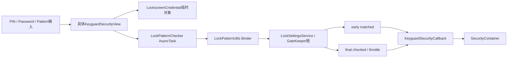
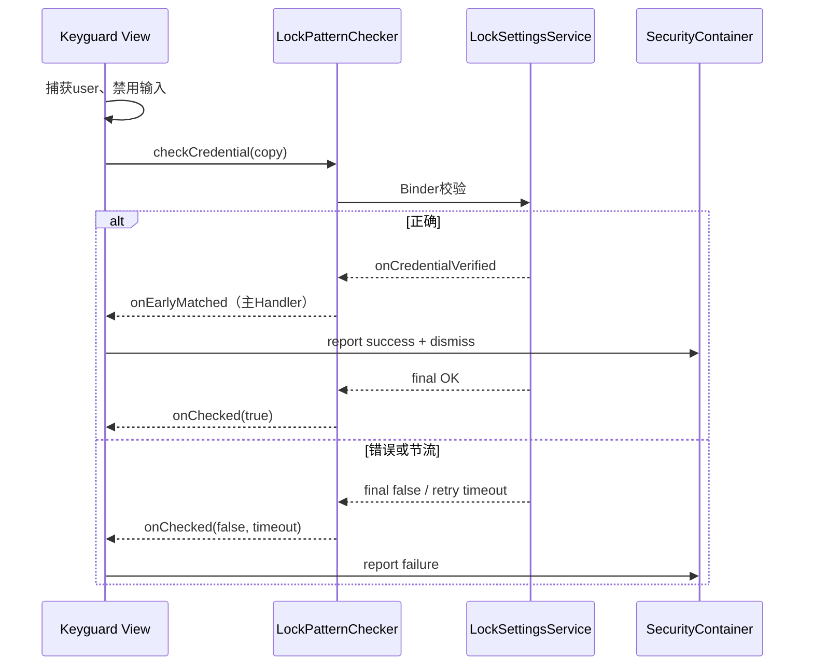
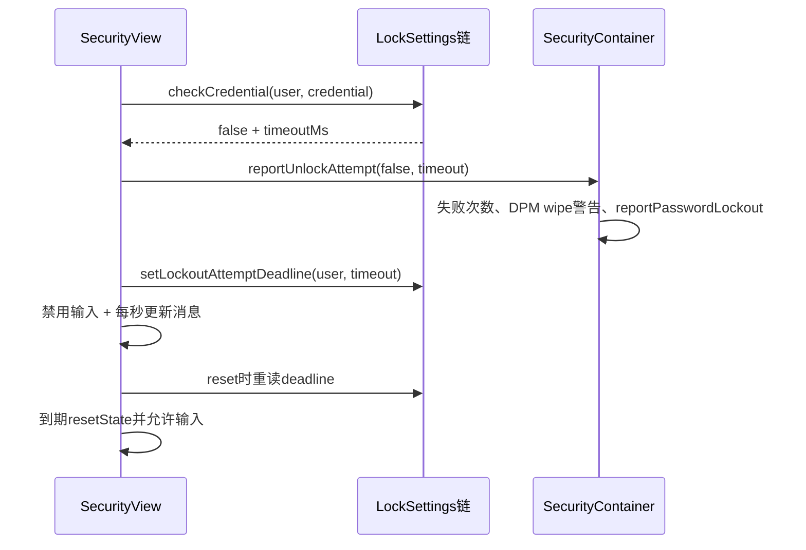

# 第 465 章 Android SystemUI KeyguardAbsKeyInputView 与 PIN、Password、Pattern：异步凭据校验、失败记账和Lockout链

> 源码基线：Android 11 / API 30 / `android-11.0.0_r48`。本章只在 macOS 阅读，不实际编译。核心文件：`KeyguardAbsKeyInputView.java`、`KeyguardPinBasedInputView.java`、`KeyguardPINView.java`、`KeyguardPasswordView.java`、`KeyguardPatternView.java`、`LockPatternChecker.java`与`LockscreenCredential.java`，并复核现有PIN/Pattern测试。

## 1. 本章解决什么问题

用户按下确认或画完图案后，明文怎样变成可校验对象？为什么正确凭据会收到early和final两个回调却只dismiss一次？短输入为何不计失败？系统节流后，View又怎样显示倒计时并禁止继续输入？

## 2. 一句话主线

PIN与Password共用`KeyguardAbsKeyInputView`的异步校验骨架，Pattern维护一份相似实现；它们捕获提交时用户、禁用输入、经`LockPatternChecker`在后台调用LockSettings，early match尽快推进解锁、final callback完成节流和资源收口，再把成功/失败报告交给上一章的Container。

## 3. UI不保存真正凭据配置

SystemUI只持有本次输入的临时`LockscreenCredential`。存储的密码保护材料、GateKeeper/Synthetic Password验证和用户解锁发生在LockSettingsService侧，不在这些View里直接比较字符串。

## 4. 三种View两套骨架

PIN和Password继承`KeyguardAbsKeyInputView`，因此校验、短输入、lockout与取消逻辑相同；Pattern直接实现`KeyguardSecurityView`并复制了相似流程。相似不代表完全一致，多个边界正来自这份重复。

## 5. 主要类的职责

Abs基类编排输入与结果；PinBased把数字键/物理键映射到`PasswordTextView`；PINView主要负责布局与动画；PasswordView管理TextView、IME和输入法切换；PatternView管理九宫格触摸、显示模式和图案动画。

## 6. 与上一章的接口

具体View只持`KeyguardSecurityCallback`。成功/失败先`reportUnlockAttempt()`，成功再`dismiss(true,userId)`；Container接住后记账并决定是否还要SIM、企业二次页或Host finish。

## 7. 提交不是最终解锁

按确认只启动一次凭据检查；early match只证明凭据正确并可尽快推进UI；Container finish、Mediator keyguardDone和WMS退出动画仍是后续不同完成点。

## 8. 用户身份在提交时捕获

两套实现都在启动任务前读取`KeyguardUpdateMonitor.getCurrentUser()`保存到final `userId`。异步结果不会重新把“当前用户”当校验对象，但决定是否dismiss时会再比较当前用户。

## 9. 输入、校验、记账三条状态线

输入框enabled描述用户能否继续编辑；`mPendingLockCheck`描述UI持有的任务引用；系统失败次数/lockout deadline在LockSettings侧。任何一个boolean都不能替代其余两条线。

## 10. 整体校验结构图



## 11. PIN输入存在哪里

`KeyguardPinBasedInputView`的`PasswordTextView`保存当前数字文本，并以动画字符/圆点显示。提交时调用`LockscreenCredential.createPinOrNone(mPasswordEntry.getText())`复制成PIN类型字节数组。

## 12. Password输入存在哪里

PasswordView使用普通TextView，设置`TYPE_CLASS_TEXT | TYPE_TEXT_VARIATION_PASSWORD`，提交时调用`createPasswordOrNone()`。空文本会生成CREDENTIAL_TYPE_NONE，而不是空PASSWORD对象。

## 13. Pattern怎样编码

PatternView拿到`List<LockPatternView.Cell>`后调用`LockscreenCredential.createPattern()`；内部通过`patternToByteArray`编码格子序列，并把类型标成PATTERN。

## 14. Credential类型参与服务端检查

PIN、PASSWORD、PATTERN不是只影响UI文案；LockSettingsService会核对传入类型与存储类型。错误类型可能被当作服务端错误，而不是尝试把同一字节串跨类型匹配。

## 15. 明文清理只能best effort

`LockscreenCredential.zeroize()`把内部byte数组填0并置null，降低内存残留；Java字符串、TextView内部缓冲、Binder序列化副本和运行时复制仍可能存在，所以不能宣传为密码从内存“绝对消失”。

## 16. PIN/Password先检查mDismissing

`verifyPasswordAndUnlock()`开头若`mDismissing=true`就返回。正确凭据的early回调把它置true，防止解锁转场尚未结束时重复提交。

## 17. 每次提交先禁用输入

取得credential后，Abs调用`setPasswordEntryInputEnabled(false)`，再取消旧`mPendingLockCheck`。用户不能在同一TextView里一边等待一边继续修改本轮内容。

## 18. PIN/Password短输入与任务入口源码

```java
final LockscreenCredential password = getEnteredCredential();
setPasswordEntryInputEnabled(false);
if (mPendingLockCheck != null) mPendingLockCheck.cancel(false);
final int userId = KeyguardUpdateMonitor.getCurrentUser();
if (password.size() <= MINIMUM_PASSWORD_LENGTH_BEFORE_REPORT) {
    setPasswordEntryInputEnabled(true);
    onPasswordChecked(userId, false, 0, false);
    password.zeroize();
    return;
}
mKeyguardUpdateMonitor.setCredentialAttempted();
mPendingLockCheck = LockPatternChecker.checkCredential(
        mLockPatternUtils, password, userId, callback);
```

阈值常量为3，即长度0—3都不会进入Binder校验，也不会记失败。

## 19. 短输入仍会显示“错误”

`isValidPassword=false`只阻止`reportUnlockAttempt(false)`；`timeoutMs==0`仍设置错误PIN/密码文案并清空输入。用户看见失败反馈，但系统失败计数不增加。

## 20. 为什么不计三位以下输入

注释说明是避免口袋误触造成意外lockout。它也与`LockPatternUtils.MIN_LOCK_PASSWORD_SIZE=4`一致；这是UI过滤政策，不是服务端验证成功的捷径。

## 21. 短输入不会setCredentialAttempted

Abs把`mKeyguardUpdateMonitor.setCredentialAttempted()`放在长度过滤之后。Monitor因此只把至少4位的PIN/密码当成真正凭据尝试。

## 22. 旧任务用cancel(false)

false表示不请求中断正在执行的后台线程。若旧Binder调用已经开始，它可以继续到服务端完成；取消主要改变AsyncTask最终走`onCancelled()`还是`onPostExecute()`，不是撤销认证事务。

## 23. 取消后立即覆盖任务槽

代码取消旧任务后直接把新任务赋给同一个`mPendingLockCheck`，没有递增generation。字段只能指向最新任务，不能证明旧任务已停止或旧early callback不会再到。

## 24. LatencyTracker有两个区间

`ACTION_CHECK_CREDENTIAL`从提交到early match，`ACTION_CHECK_CREDENTIAL_UNLOCKED`从提交到完整check返回。失败没有early回调，因此主要由第二段覆盖。

## 25. setCredentialAttempted影响生物策略

它通知KeyguardUpdateMonitor用户已尝试设备凭据，供生物认证/StrongAuth相关流程使用。它不是失败记账；真正成功/失败稍后经Container与LockPatternUtils报告。

## 26. LockPatternChecker为何使用AsyncTask

`LockPatternUtils.checkCredential()`明确禁止主线程调用，因为会跨Binder并触发昂贵验证。r48用AsyncTask在后台执行，再把最终结果回到创建任务的主线程。

## 27. Checker会先复制credential

异步任务不能依赖调用方对象的生命周期，所以`checkCredential()`立即`duplicate()`。调用方与任务各拥有一份byte数组，双方都必须各自清理。

## 28. Checker的复制与收口源码

```java
final LockscreenCredential credentialCopy = credential.duplicate();
AsyncTask<Void, Void, Boolean> task = new AsyncTask<Void, Void, Boolean>() {
    protected Boolean doInBackground(Void... args) {
        try {
            return utils.checkCredential(credentialCopy, userId,
                    callback::onEarlyMatched);
        } catch (RequestThrottledException ex) {
            mThrottleTimeout = ex.getTimeoutMs();
            return false;
        }
    }
    protected void onPostExecute(Boolean result) {
        callback.onChecked(result, mThrottleTimeout);
        credentialCopy.zeroize();
    }
    protected void onCancelled() {
        callback.onCancelled();
        credentialCopy.zeroize();
    }
};
```

## 29. RequestThrottled不是普通错误

服务端要求等待时，Checker把结果规范成`matched=false`并携带`mThrottleTimeout`。View据此记失败/lockout并显示倒计时，而不是只显示“密码错误”。

## 30. RemoteException会变成false

`LockPatternUtils.checkCredential()`捕获RemoteException、记录日志并返回false，Checker无法区分“凭据真的错”和“LockSettings通信失败”；UI最终可能按有效错误尝试上报。

## 31. early match从哪里来

LockSettingsService在确认凭据已匹配后，通过`ICheckCredentialProgressCallback`通知客户端；`LockPatternUtils.WrappedCallback`把它post到自身构造线程Handler，再调用View提供的`onEarlyMatched()`。

## 32. early不是后台线程直接改View

正常SystemUI里LockPatternUtils在主Looper线程构造，所以WrappedCallback把UI动作归一到主线程。Binder线程只负责接收并投递。

## 33. final callback为何仍需要

服务端在凭据匹配后还可能完成用户解锁、Keystore/FBE等工作。early让视觉流程尽快开始，final的`onChecked(true)`结束完整延迟统计、恢复输入状态并清任务引用。

## 34. 正确凭据不会成功上报两次

early回调调用`onPasswordChecked(...true...)`；随后final若matched为true只做收口，不再次调用`onPasswordChecked`。失败没有early，完全由final处理。

## 35. early与final时序图



## 36. Abs的early回调做什么

结束第一段LatencyTracker，调用`onPasswordChecked(userId,true,0,true)`并清零调用方password对象。`onPasswordChecked`上报成功，若用户仍匹配则置`mDismissing=true`并dismiss。

## 37. Abs的final回调做什么

结束完整延迟、重新允许输入、把`mPendingLockCheck=null`；仅当`matched=false`才处理失败；最后再次zeroize原credential。重复zeroize安全地成为空操作。

## 38. 成功时先report再dismiss

Container先收到`reportUnlockAttempt(true)`，清失败记录并做指标；之后收到dismiss进入上一章的完成决策。若两个调用之间异常，可能出现成功已记账但UI尚未完成。

## 39. 切用户后不dismiss旧结果

`dismissKeyguard = currentUser == capturedUserId`。正确结果仍为捕获用户调用`reportUnlockAttempt(true)`，但只有该用户仍为当前用户才dismiss，避免旧用户结果直接关闭新用户锁屏。

## 40. 用户检查并非完整代际保护

同一用户内Bouncer隐藏再显示、View暂停再恢复或任务重提时，userId仍相等。代码没有attempt generation，所以仅靠用户比较不能拒绝同用户旧回调。

## 41. cancel不能撤销已post的early

AsyncTask `cancel(false)`不控制LockPatternUtils主Handler队列。若服务端已发early，View暂停/新提交后仍可能收到；是否被Container换成NullCallback取决于具体切页时序。

## 42. Abs的mDismissing只能挡新提交

它防止用户再次进入`verifyPasswordAndUnlock()`，但不标识回调属于哪一轮，也不挡旧回调直接调用`onPasswordChecked()`。reset还会把它恢复false。

## 43. Container的NullCallback提供第二层保护

切到别的SecurityView时，Container在旧View onPause后把callback换成NullCallback。由于结果处理读取View当前`mCallback`，多数切页后的迟到结果不会推进完成链；单纯Bouncer暂停不一定替换callback。

## 44. onPause取消任务但不是完成屏障

Abs和Pattern都cancel并清`mPendingLockCheck`字段，随后立即返回；没有等待后台Binder工作结束，也没有清主Handler里已经排队的early回调。

## 45. Pattern在设计上复制了这套竞态

它也捕获user、禁用输入、cancel旧AsyncTask、监听early/final/cancel，并同样没有generation。代码重复让两个实现可能随版本演进产生不同修复状态。

## 46. Pattern长度阈值也是4

少于`MIN_PATTERN_REGISTER_FAIL`即少于4个点时，不访问Checker、不报告失败，立即恢复输入并按无效图案显示错误。

## 47. Pattern先标记尝试再查长度

与Abs不同，`onPatternDetected()`第一句就`setCredentialAttempted()`，之后才判断长度。三点短图案不计失败，却已经影响“用户尝试了凭据”这一Monitor事实。

## 48. Pattern异步入口源码

```java
mKeyguardUpdateMonitor.setCredentialAttempted();
mLockPatternView.disableInput();
if (mPendingLockCheck != null) mPendingLockCheck.cancel(false);
final int userId = KeyguardUpdateMonitor.getCurrentUser();
if (pattern.size() < LockPatternUtils.MIN_PATTERN_REGISTER_FAIL) {
    mLockPatternView.enableInput();
    onPatternChecked(userId, false, 0, false);
    return;
}
mPendingLockCheck = LockPatternChecker.checkCredential(
        mLockPatternUtils,
        LockscreenCredential.createPattern(pattern),
        userId,
        callback);
```

## 49. Pattern原始credential未显式zeroize

Checker会复制并清自己的`credentialCopy`，但这里内联创建的原始`LockscreenCredential`没有变量，也没有调用zeroize；它只能等待GC。这是与Abs明确清理调用方对象不同的源码事实。

## 50. Pattern成功没有mDismissing

PatternView没有Abs那样的`mDismissing`字段。输入在校验期间被disable，early成功后依赖后续锁屏转场；若旧任务迟到与新任务交叠，缺少额外的一次性门。

## 51. Pattern成功显示Correct模式

current user仍匹配时，它先把LockPatternView设为`DisplayMode.Correct`再dismiss；若用户已切换，只上报旧用户成功，不改成Correct也不dismiss。

## 52. Pattern失败显示Wrong模式

无论图案是否达到有效长度，失败都先设`DisplayMode.Wrong`；只有有效图案才报告失败和处理timeout。

## 53. 普通错误两秒后清图案

`timeoutMs==0`时显示`kg_wrong_pattern`，并post一个2000ms Runnable清线条。lockout有timeout时不走这条延迟清理，而立即进入禁用与倒计时。

## 54. 新图案开始会取消旧清理Runnable

`onPatternStart()`先`removeCallbacks(mCancelPatternRunnable)`并清消息，避免上一轮两秒定时器在用户正在画新图案时突然清屏。

## 55. 每加一个格子都算用户输入

`onPatternCellAdded()`调用`userActivity()`和`onUserInput()`；后者经Container取消Face认证。图案输入与生物认证因此主动互斥。

## 56. 检测完成后还有一次重复poke

图案长度大于2时，`onPatternDetected()`又调用一次userActivity/onUserInput。对三点及以上图案，这在逐格通知之外是额外一次。

## 57. onTouchEvent的唤醒注释与代码脱节

它根据7秒间隔更新`mLastPokeTime`，注释说keep poking wake lock，却没有在该分支调用callback或PowerManager；真正活跃通知来自cell-added等回调。这个时间字段本身不产生唤醒动作。

## 58. Pattern扩大40像素触摸区

布局后按屏幕坐标把图案边界四周各扩40“像素”，不是dp；`disallowInterceptTouch()`在已有图案或触点位于该区时阻止父Container抢上滑Face手势。

## 59. Pattern手工转发MotionEvent

父View把事件坐标偏移到LockPatternView局部坐标，调用其`dispatchTouchEvent()`后再移回。修改事件对象后恢复坐标很关键，否则后续父层观察会读到错误位置。

## 60. PIN物理键复用屏幕按钮

数字、数字小键盘、删除和确认键最终调用对应View的`performClick()`；这样点击逻辑、enabled检查和无障碍行为尽量共用，而不是另写一套文本修改。

## 61. Lockout时数字键仍可见

PinBased只禁用PasswordTextView和OK按钮，没有逐个禁用0—9 View；但`NumPadKey`点击前检查目标PasswordTextView `isEnabled()`，所以按键仍可响应触摸/活跃事件，却不会追加数字。

## 62. 删除与确认有二次enabled检查

其OnClick内部都再看`mPasswordEntry.isEnabled()`。即使物理键路径触发`performClick()`，lockout期间也不会清文本或重新提交。

## 63. PIN的两个禁用接口实际相同

`setPasswordEntryEnabled()`和`setPasswordEntryInputEnabled()`都直接setEnabled输入框与OK。Abs区分“整个输入不可用”和“暂时不能编辑”的抽象，在PIN实现里被折叠。

## 64. Password用TextViewInputDisabler

Password的`setPasswordEntryInputEnabled()`只通过Disabler控制输入连接，`setPasswordEntryEnabled()`才改变View enabled。这使“异步检查中暂禁编辑”和“lockout禁用整控件”可分开表达。

## 65. Password为何needsInput为true

它依赖软键盘，所以Host收到SecurityMode变化后告诉Mediator/窗口需要输入；PIN有自带数字盘、Pattern用触摸，二者返回false。

## 66. Password把文本操作绑定当前用户

膨胀和resetState都调用`setTextOperationUser(UserHandle.of(currentUser))`，使TextView相关文本服务按当前用户运行。用户切换时需要reset才能刷新这个绑定。

## 67. onResume异步请求IME

Password先标记resumed，再post Runnable等待窗口focusable状态建立；Runnable若View shown且entry enabled就请求焦点，并按screen-on资源开关决定是否显示IME。

## 68. IME Runnable没有resume代际检查

post的闭包不重新检查`mResumed`。若onResume后很快onPause，onPause先hide IME，但旧Runnable随后仍可能在View尚shown且enabled时重新show；这是一条需运行时验证的竞态。

## 69. resetState有更严格的IME门

它先启用输入，再要求`mResumed && isVisibleToUser()`才可能showSoftInput；这里不会在暂停状态主动弹键盘，与上一节onResume闭包不同。

## 70. 用户切换后500ms再查IME按钮

onFinishInflate先计算输入法切换按钮，随后postDelayed 500ms再计算一次，注释承认IMMS可能尚未切到新用户。这是针对跨服务状态传播的经验性补丁。

## 71. 500ms任务没有显式取消

View detach或切页时源码不移除该Runnable。它只更新按钮和margin，风险小于认证回调，但仍是无generation的旧View异步任务。

## 72. 锁屏允许选择非辅助IME

按钮调用`showInputMethodPickerFromSystem(false,displayId)`，排除auxiliary subtypes；显示条件统计至少两个符合条件的IME，或当前IME有多个启用subtype。

## 73. 文本变化的用户活动判定很粗

`beforeTextChanged()`总调用userActivity；`afterTextChanged()`只要新文本非空就调用onUserInput。注释直言这是“poor man's”判断，假设空文本是程序清理、非空变化来自用户。

## 74. 程序清空也可能延长亮屏

`resetPasswordText()`调用`setText("")`，会经过beforeTextChanged并触发userActivity，但after阶段因空文本不会取消Face。这是两个callback对同一次程序修改的不同投影。

## 75. PIN/Password lockout核心源码

```java
protected void handleAttemptLockout(long deadline) {
    setPasswordEntryEnabled(false);
    long seconds = (long) Math.ceil(
            (deadline - SystemClock.elapsedRealtime()) / 1000.0);
    mCountdownTimer = new CountDownTimer(seconds * 1000, 1000) {
        public void onTick(long left) {
            int remaining = (int) Math.round(left / 1000.0);
            mSecurityMessageDisplay.setMessage(/* 剩余秒数 */);
        }
        public void onFinish() {
            mSecurityMessageDisplay.setMessage("");
            resetState();
        }
    }.start();
}
```

## 76. timeout来自服务端节流

错误凭据可能让GateKeeper/LockSettings返回retry timeout。View先经Container报告本次失败，再用`setLockoutAttemptDeadline(userId,timeoutMs)`建立按elapsedRealtime的本地deadline。

## 77. deadline而非倒计时对象是恢复依据

View重建或reset时重新读`getLockoutAttemptDeadline(currentUser)`，因此旋转/重建不应仅靠旧CountDownTimer记忆剩余时间。

## 78. 失败与lockout时序图



## 79. 失败记账与deadline不是一次原子操作

Container报告失败/策略警告后，View另一次调用设置deadline。两步之间若View被销毁或异常，系统失败记录和本地UI deadline可能短暂不同步。

## 80. 倒计时用elapsedRealtime

它不受用户修改墙上时间影响，适合“等待N秒”；显示秒数先ceil总时长，tick再round，避免刚进入时直接少显示一秒，但边界可能出现视觉上的重复秒数。

## 81. Abs onPause有反直觉重启计时器

它先取消当前timer和task，随后调用`reset()`；若deadline仍有效，reset马上又`handleAttemptLockout()`创建新CountDownTimer。也就是说字段在onPause返回后可能再次非null并继续tick。

## 82. Pattern onPause行为不同

Pattern只取消timer/task并清默认消息，不调用reset，也不把已因lockout而disabled的LockPatternView重新enable；其`onResume()`又是空实现。因此同一View实例若未被外层reset或重建，恢复后可能仍禁用，却已没有timer负责到期恢复。

## 83. handleAttemptLockout不先取消旧timer

两套实现都直接覆盖`mCountdownTimer`。若同一View在旧timer运行时重复reset/进入lockout，可能存在多个timer同时更新消息，而字段只能取消最后一个。

## 84. timer完成后字段不置null

两个`onFinish()`都恢复UI，却没把`mCountdownTimer=null`。字段可能继续指向已结束对象；后续onPause再cancel通常无害，但状态不够自描述。

## 85. Pattern倒计时完成只启用外层View

它`mLockPatternView.setEnabled(true)`并清默认消息；进入lockout前用setEnabled(false)，所以恢复配对。普通异步检查用disableInput/enableInput，是另一层输入门。

## 86. Abs倒计时完成调用多态resetState

PIN恢复PasswordTextView和OK，Password还刷新text-operation user、启用输入，并仅在resumed且可见时考虑IME。一个基类timer会触发不同子类副作用。

## 87. reset会清PIN/Password输入

Abs先`mDismissing=false`并`resetPasswordText(false,false)`，再判断deadline。即使仍在lockout，也先清掉之前输入。

## 88. Pattern reset会清线条并刷新stealth

它根据current user重新读取“显示图案轨迹”设置，enable input、enable View并clear pattern，再按deadline选择倒计时或默认消息。

## 89. Pattern onPause不主动清图案

它取消任务与timer并清提示，却没有`clearPattern()`或reset。若暂停发生在特殊中间态，旧线条可能保留到外层下一次reset；正常Bouncer重建常会掩盖这一点。

## 90. Pattern的cleanUp没有接入接口

文件里有一个TODO `cleanUp()`，会清LockPatternUtils和listener，但`KeyguardSecurityView`生命周期使用onPause，Container也不调用这个特有方法。不能把它当成正常销毁必经点。

## 91. PIN/Pattern慢解锁动画更长

当Monitor `needsSlowUnlockTransition()`为true，使用乘1.5的DisappearAnimationUtils；常见场景是解锁后系统还需更慢准备。动画慢不代表凭据验证本身更慢。

## 92. Password退出由两层动画组成

PasswordView做100ms alpha/translation ViewPropertyAnimator；上一章Container还为Password控制125ms IME Insets退出。两者完成点并非天然同一帧。

## 93. finishRunnable依赖动画正常收口

具体View把finishRunnable放在动画结束回调；若动画被替换/取消，是否执行取决于动画框架行为和调用时序。r48这些View没有自己的generation或显式cancel收口协议。

## 94. onUserInput同时做三件事

Abs通知userActivity、通知Container取消Face，并清安全消息。按下新数字后旧错误文案马上消失，且设备保持唤醒。

## 95. KEYCODE_UNKNOWN被故意忽略

Abs `onKeyDown()`不把UNKNOWN当用户输入，注释说明指纹传感器会发送这个KeyEvent；否则生物事件可能误清提示和再次取消Face。

## 96. Emergency按钮回到reset链

通话中的Emergency按钮回调调用`mCallback.reset()`；具体取消按钮还调用reset和`onCancelClicked()`。它们不是凭据验证结果。

## 97. PIN测试只有三个交互点

`KeyguardPinBasedInputViewTest`只检查onResume请求焦点、数字键清消息，以及UNKNOWN键不碰消息；没有覆盖短PIN、AsyncTask、early/final、用户切换或lockout。

## 98. Pattern测试只有一个断言

`KeyguardPatternViewTest`只验证onPause清旧消息。长度过滤、原始credential清理、迟到回调、timer、触摸扩展和动画都未覆盖。

## 99. 没有专门的Abs或Password测试

本目录中未找到对应测试类，因此IME post竞态、500ms switch按钮任务、TextWatcher活动判断和两个禁用接口的语义缺少直接单测保护。

## 100. Checker测试不等于View测试

即使框架验证LockPatternChecker复制与回调，SystemUI仍需测试任务代际、callback替换、用户切换、View暂停和输入恢复；边界跨越两个模块，单测不能互相替代。

## 101. 可确认的代码事实

短输入不计失败；early只在匹配时出现；final true不重复成功；cancel(false)不请求中断；Pattern原始credential未显式清零；Abs onPause可重建timer。这些都能由本地源码直接证明。

## 102. 仍需运行时验证的风险

旧early是否能在具体切换中推进dismiss、多个timer是否实际并存、Password暂停后IME是否重弹、Pattern暂停后的“disabled且无timer”是否能在产品转场中持续，以及线条是否可见残留，都取决于消息队列和外层reset/重建时序，不能仅凭静态阅读称为已复现。

## 103. 改进一：统一CredentialViewModel

让PIN、Password、Pattern共用attempt generation、用户快照、任务取消、success-once与deadline状态机，可消除复制实现的语义漂移。

## 104. 改进二：显式拥有credential

调用方用try/finally或try-with-resources清原始对象；Checker继续清副本。Pattern不要把新credential以内联临时值传入后丢失所有权。

## 105. 改进三：取消必须配代际检查

每次提交递增token，early/final/cancel只有token和user都匹配当前会话才更新UI；cancel负责资源释放，但正确性不再依赖后台工作真的停止。

## 106. 改进四：timer单实例收口

启动前取消旧timer，finished/cancelled统一清字段；onPause只停止显示，onResume/reset按deadline重建，同时恢复enabled状态，并在回调前确认View仍是当前安全页。

## 107. 改进五：IME任务可取消

保存onResume与500ms recheck Runnable，onPause/detach移除或用resume generation拒绝；显示IME前同时确认attached、shown、resumed、current mode和目标用户。

## 108. 推荐源码阅读顺序

先读Abs的`verifyPasswordAndUnlock/onPasswordChecked/handleAttemptLockout`，再对照Pattern同名逻辑；随后进LockPatternChecker和LockPatternUtils WrappedCallback；最后读PIN输入映射与Password IME。

## 109. 遇到“正确密码不解锁”先查什么

确认提交时userId、是否收到early/final、View当前callback是否NullCallback、current user是否改变、Container是否转企业页，以及Host是否进入donePending。不要只盯输入框。

## 110. 遇到“倒计时乱跳”先查什么

记录deadline、每次reset/onPause、timer对象身份和View是否当前页；重点寻找未取消的旧timer，而不是先怀疑系统时间，因为使用的是elapsedRealtime。

## 111. 本章检查清单

能否解释4位门槛、两份credential、early/final分工、cancel(false)边界、用户比较、失败记账与deadline两步、PIN/Pattern生命周期差异，以及IME异步任务。

## 112. macOS 只读练习一：追一次正确PIN

用`rg -n "verifyPasswordAndUnlock|onEarlyMatched|onChecked|onPasswordChecked"`依次查看Abs与LockPatternChecker。手写输入禁用、early success、Container dismiss、final收口和两份credential zeroize顺序，不编译。

## 113. macOS 只读练习二：比较三位PIN和三点图案

在Abs与Pattern中定位长度判断和`setCredentialAttempted()`。列出是否访问Binder、是否报告失败、是否显示错误、是否清输入、是否标记credential attempted，解释两者差异。

## 114. macOS 只读练习三：推演迟到early回调

搜索`cancel(false)`、`WrappedCallback`、`mNullCallback`和current-user比较。分别推演同页重提、切到另一安全页、Bouncer仅暂停、切用户四种场景，只标注源码能保证与不能保证的部分。

## 115. macOS 只读练习四：审计lockout与IME

用`rg -n "mCountdownTimer|reset\(|onPause|postDelayed|showSoftInput"`检查Abs、Pattern和Password。画出暂停时timer/IME Runnable是否仍存活，并提出最小代际测试，不实际运行。

## 116. 最容易误解的一点

early match不是“提前猜测正确”，而是服务端已确认凭据匹配后先回一个进度信号；final仍承担完整验证/解锁工作的收口，所以两者都必要。

## 117. 第二个易错点

`cancel(false)`不是撤回LockSettings认证，也不是清空已post消息。正确的异步UI必须用generation拒绝旧结果，而不能把cancel当完成屏障。

## 118. 第三个易错点

View倒计时不是权威失败计数器；权威策略和deadline来自系统服务。CountDownTimer只是当前页面对同一deadline的可视化投影。

## 119. 本章结论

r48凭据页已正确分开主线程UI、后台Binder验证、early视觉推进和final收口，也努力清理credential；但两套重复实现缺统一代际，Pattern原始对象、timer生命周期和Password IME任务仍暴露可审计边界。追问题时必须同时跟attempt、user、callback、deadline和View生命周期。

## 120. 下一章预告

下一章继续阅读`KeyguardSimPinView`与`KeyguardSimPukView`，研究多SIM subscription选择、Telephony Binder解锁、PUK→新PIN状态机、重试次数Dialog与异步结果怎样回到SecurityModel重算链。
