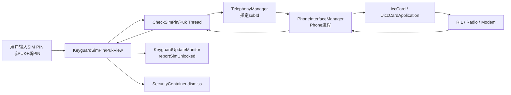
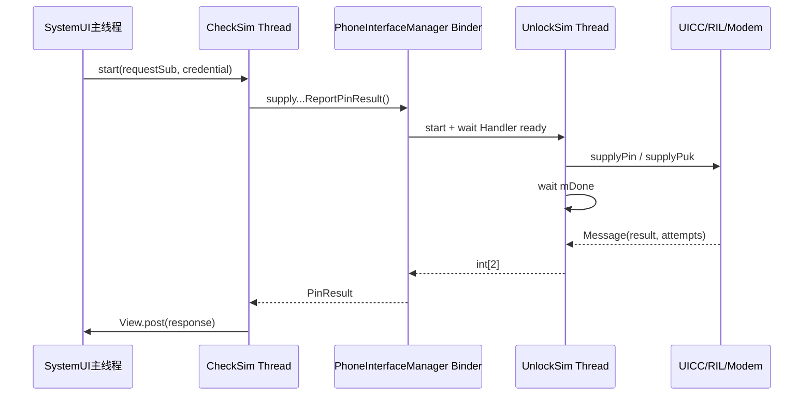
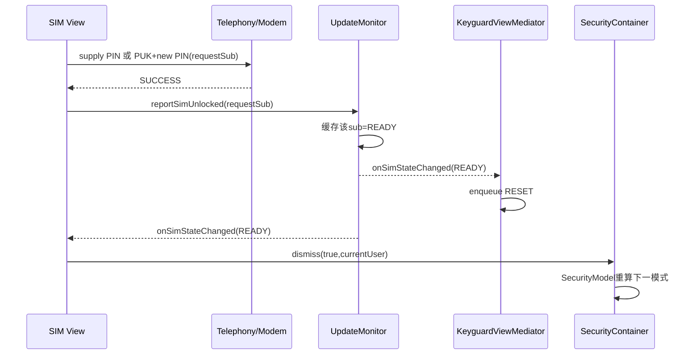

# 第 466 章 Android SystemUI KeyguardSimPinView 与 SimPukView：多SIM解锁、PUK→新PIN状态机和重试链

> 源码基线：Android 11 / API 30 / `android-11.0.0_r48`。本章只在 macOS 阅读，不实际编译。核心文件：`KeyguardSimPinView.java`、`KeyguardSimPukView.java`、`KeyguardUpdateMonitor.java`、`TelephonyManager.java`、`PhoneInterfaceManager.java`、`UiccCardApplication.java`与`KeyguardEsimArea.java`。本章复核SystemUI测试目录，未找到SIM PIN/PUK专用测试。

## 1. 本章解决什么问题

设备有多张SIM时先解哪张？SIM PIN为何不同于设备PIN？PUK为什么必须再设置并确认一个新PIN？SystemUI怎样跨Telephony Binder等待modem结果、显示剩余次数，并在成功后回到上一章的SecurityModel继续下一张SIM或设备凭据？

## 2. 一句话主线

两个View都选最低slot中处于目标锁态的subscription，把输入字符串交给专用Thread；Thread经`TelephonyManager.createForSubscriptionId()`和Phone进程同步桥接到UICC/RIL，结果post回UI。成功先让Monitor把该sub标READY，再dismiss触发SecurityModel重算；错误则根据`PinResult`区分incorrect、general failure和剩余次数。

## 3. SIM凭据保护什么

SIM PIN/PUK保护运营商卡与蜂窝身份，不是Android用户数据凭据。它成功时Container不会设置strongAuth；SIM处理完仍可能要求图案、设备PIN或密码。

## 4. PIN和PUK是不同阶段

PIN是日常开机解SIM；连续错误耗尽PIN机会后进入PUK_REQUIRED。PUK是运营商提供的解阻码，正确PUK必须同时设置一个新SIM PIN。

## 5. 两个View复用数字键基类

它们继承`KeyguardPinBasedInputView`获得数字盘、删除和确认键，但都override `verifyPasswordAndUnlock()`，完全绕开上一章的LockPatternChecker、设备失败计数和elapsedRealtime lockout。

## 6. SIM没有时间型lockout

两者`shouldLockout()`固定false。剩余次数和最终永久锁死由SIM/modem管理，不使用LockPatternUtils的设备凭据deadline。

## 7. 主要进程边界

SystemUI进程创建工作Thread；Binder进入Phone进程`PhoneInterfaceManager`；它再通过`IccCard/UiccCardApplication`向RIL和modem发命令。UI线程只显示进度与消费结果。

## 8. PinResult有三类结果

`SUCCESS`表示命令成功，`INCORRECT`表示凭据错误，`FAILURE`是其他一般失败；另带`attemptsRemaining`，-1表示未知。不能把所有非success都当成输入错误。

## 9. 与SecurityModel的闭环

成功后Monitor先将该sub本地状态改READY；Container收到dismiss后重新调用Model。若还有PUK先继续PUK，再处理PIN_REQUIRED，最后才到当前用户设备凭据。

## 10. 跨进程总图



## 11. 多SIM选择规则

Monitor的`getNextSubIdForState(state)`遍历订阅信息，筛出缓存SIM状态相等者，选择slot id最小的sub。它不是按subscription id、插卡时间或用户选择排序。

## 12. PUK仍整体优先于PIN

SecurityModel先请求PUK_REQUIRED的最低slot；没有PUK才请求PIN_REQUIRED最低slot。所以高slot PUK也会先于低slot普通PIN处理。

## 13. View缓存mSubId

`handleSubInfoChangeIfNeeded()`重算目标sub；只在新值有效且不同于当前值时更新，并把`mShowDefaultMessage=true`、`mRemainingAttempts=-1`。

## 14. 无有效新sub时保留旧值

如果重算返回INVALID，代码不会清`mSubId`。旧View在SIM变READY后短时间仍可能用旧sub刷新文案或发后台请求，最终通常由Mediator reset/切页收束。

## 15. 多SIM文案显示运营商名

active modem count小于2时用单SIM提示；否则从Monitor找SubscriptionInfo，显示displayName并用iconTint给SIM图标着色。info为空时用空名称和壁纸文字色避免崩溃。

## 16. active modem count不是锁定卡数量

它只决定单/多SIM文案模板。两张modem中只有一张锁定仍走多SIM提示，以名称标识当前目标sub。

## 17. eSIM只是附加处置入口

目标SubscriptionInfo为embedded且EuiccManager enabled时显示KeyguardEsimArea，允许用户禁用当前eSIM订阅换取无蜂窝服务状态；它不是绕过实体SIM PIN。

## 18. eSIM按钮动作

按钮以System用户PendingIntent请求`switchToSubscription(INVALID_SUBSCRIPTION_ID)`；失败广播弹Keyguard Dialog，成功不直接dismiss，依赖后续subscription/SIM状态变化驱动锁屏重算。

## 19. eSIM服务存在性没有防护

`isEsimLocked()`直接对取得的EuiccManager调用`isEnabled()`，没有null检查。标准电话产品通常提供该服务，但裁剪环境需注意潜在NPE。

## 20. sub选择源码

```java
public int getNextSubIdForState(int state) {
    List<SubscriptionInfo> list = getSubscriptionInfo(false);
    int resultId = SubscriptionManager.INVALID_SUBSCRIPTION_ID;
    int bestSlotId = Integer.MAX_VALUE;
    for (SubscriptionInfo info : list) {
        int id = info.getSubscriptionId();
        int slotId = getSlotId(id);
        if (state == getSimState(id) && bestSlotId > slotId) {
            resultId = id;
            bestSlotId = slotId;
        }
    }
    return resultId;
}
```

## 21. SIM PIN长度门只检查下限

PinView拒绝少于4位并显示invalid hint，但没有限制最多8位。超过常规SIM PIN长度的输入仍会送到Telephony，可能得到incorrect或general failure。

## 22. PUK格式门更严格

`checkPuk()`要求恰好8位；新PIN要求4—8位；confirm阶段要求第二次输入与保存的新PIN String完全相等。

## 23. PIN短输入不会访问modem

少于4位时清输入、announce删除、通知userActivity并返回。它既不减少SIM机会，也不调用设备凭据失败记账。

## 24. PUK三段输入不会逐段访问modem

输入PUK、新PIN和确认PIN都只在本地检查长度/相等；只有三段完成后才把PUK与新PIN一起发给modem。因此确认不一致不会消耗PUK机会。

## 25. PUK状态机四个状态

`ENTER_PUK → ENTER_PIN → CONFIRM_PIN → DONE`。每按一次确认推进一次；失败格式留在当前态，确认不一致退回ENTER_PIN，要求重新输入并再次确认新PIN。

## 26. 状态机保存String明文

`mPukText`和`mPinText`都是不可变String，reset时只把字段指向空串，无法原地zeroize旧字符。实际请求Thread也保存字符串直到线程与匿名对象可回收。

## 27. StateMachine reset做什么

清两段String引用、回ENTER_PUK、重选sub、按flag显示默认消息、更新eSIM按钮并请求数字输入框焦点。

## 28. PUK状态机核心源码

```java
if (state == ENTER_PUK) {
    if (checkPuk()) state = ENTER_PIN;
} else if (state == ENTER_PIN) {
    if (checkPin()) state = CONFIRM_PIN;
} else if (state == CONFIRM_PIN) {
    if (confirmPin()) {
        state = DONE;
        updateSim();
    } else {
        state = ENTER_PIN;
    }
}
resetPasswordText(true, true);
```

每一步还选择对应提示文案；进入DONE后由非取消进度Dialog挡住常规重复交互。

## 29. DONE没有额外输入分支

若确认键在请求期间再次触发，`next()`不匹配前三态，只清输入且msg为0；`mCheckSimPukThread`又防止创建第二个实际请求，但状态机没有显式“请等待”处理。

## 30. SIM PIN显示非取消进度Dialog

有效输入后立即show；只有实际响应UI Runnable才hide，onPause则dismiss并置null。Dialog不是Binder timeout，也不会取消工作Thread。

## 31. PUK进度Dialog类似

区别是Context为Activity时不强设TYPE_KEYGUARD_DIALOG，非Activity才设置；SIM PIN无条件设置Keyguard类型。行为不一致但主SystemUI Context通常不是普通Activity。

## 32. Thread只是把阻塞移出UI

`CheckSimPin`与`CheckSimPuk`都是裸Thread，没有Executor、Future、interrupt协议、超时或generation。字段非null仅阻止同一View同时发第二个实际请求。

## 33. createForSubscriptionId固定请求目标

Thread构造时保存subId，运行时创建该订阅的TelephonyManager；之后外层View的mSubId即使切到另一张卡，本轮Binder仍发给原sub。

## 34. Phone进程又创建一个UnlockSim Thread

PhoneInterfaceManager为了把IccCard异步Message接口变成同步Binder返回，启动带Looper的`UnlockSim`，等待Handler建立，再发命令并wait直到回调设置result/retryCount。

## 35. 请求线程时序图



## 36. Phone同步桥没有超时

`UnlockSim.unlockSim()`在`while(!mDone) wait()`；中断只恢复interrupt状态后继续循环。若radio永不回调，Phone Binder调用和SystemUI Check Thread都可无限等待。

## 37. TelephonyManager假定数组有两项

它对ITelephony返回值直接读`result[0]`与`result[1]`构造PinResult，没有null/长度检查。标准PhoneInterfaceManager固定返回两项，但异常实现可让工作Thread抛数组越界。

## 38. RemoteException只变成null

TelephonyManager捕获RemoteException并返回null；View把null规范为`PinResult.getDefaultFailedResult()`，即general failure、remaining=-1，再post给UI。

## 39. 其他RuntimeException不收口

TelephonyManager服务为空、`createForSubscriptionId`链异常或结果数组损坏都不在View Thread的try/finally内。Thread退出后`mCheckSim...Thread`字段仍非null，进度Dialog也可能一直显示。

## 40. actual response有两次post

Thread的`run()`先`View.post(onSimCheckResponse)`；实际请求的匿名`onSimCheckResponse()`内部又post一个处理Runnable。结果通常经过两个UI消息队列跳点，默认次数查询则只有外层一次post。

## 41. 双post扩大迟到窗口

两次投递之间View可pause、detach、切sub或被Container换NullCallback；处理代码没有attached/resumed/generation检查，仍读取并修改该旧View字段。

## 42. onPause不取消请求Thread

两个View只关闭进度Dialog；没有interrupt、清thread字段或标记结果失效。响应可在锁屏页已不可见后继续更新消息、弹剩余次数Dialog或调用dismiss。

## 43. onPause也没有调用super

因此基类`mResumed=false`、pending check/timer清理和reset都不执行。SIM页虽不用LockPatternChecker与时间lockout，`mResumed`状态仍可能在暂停后保持true。

## 44. 剩余次数Dialog没有在pause关闭

onPause只处理`mSimUnlockProgressDialog`，不dismiss `mRemainingAttemptsDialog`。低剩余次数警告可能跨越View暂停，直到外部窗口生命周期收走。

## 45. actual response处理源码

```java
if (result.getType() == PinResult.PIN_RESULT_TYPE_SUCCESS) {
    Dependency.get(KeyguardUpdateMonitor.class).reportSimUnlocked(requestSubId);
    mRemainingAttempts = -1;
    mShowDefaultMessage = true;
    if (mCallback != null) {
        mCallback.dismiss(true, KeyguardUpdateMonitor.getCurrentUser());
    }
} else if (result.getType() == PinResult.PIN_RESULT_TYPE_INCORRECT) {
    if (result.getAttemptsRemaining() <= 2) {
        getSimRemainingAttemptsDialog(result.getAttemptsRemaining()).show();
    } else {
        mSecurityMessageDisplay.setMessage(/* 错误与剩余次数 */);
    }
} else {
    mSecurityMessageDisplay.setMessage(/* 一般失败 */);
}
```

PUK版本结构相同，之后还会reset三段状态机。

## 46. success先reportSimUnlocked

Monitor立即在主线程把request sub状态改READY并同步遍历callbacks，比等待Telephony广播更快；注释明确此方法必须由UI线程调用。

## 47. report不是硬件第二次确认

它基于刚收到的成功结果提前更新SystemUI缓存，不向modem再发命令。之后真实SIM状态广播应与之收敛。

## 48. Monitor callback是同步回放

注册callback时`sendUpdates()`立即回放所有已知SIM；`reportSimUnlocked()`也直接调用`handleSimStateChange()`遍历callback，不经过Handler排队。View注册和success处理内部都可能发生重入。

## 49. SIM回调没有按subId过滤

Pin与Puk View的`onSimStateChanged(subId,...)`都不判断事件是否等于当前mSubId。任意卡状态变化都会reset PIN页；PUK页遇任意READY还会请求dismiss。

## 50. 不过滤不等于直接绕过锁

PUK页因另一张SIM READY调用dismiss时，Container会重新问SecurityModel；只要目标PUK卡仍锁定，Model仍返回SimPuk，完成链不会finish。但输入状态可能被额外回调打断。

## 51. 多SIM事件会清正在输入的内容

非READY状态走resetState；Pin清文本并重选sub，Puk还把状态机退回ENTER_PUK。另一张SIM的无关状态抖动也可能让用户重输。

## 52. Pin callback注册在resume

每次onResume先super，再register并显式reset；onPause remove。Monitor阻止相同callback重复注册，但首次register的同步SIM快照可在显式reset之前多次调用resetState。

## 53. PUK callback注册在attach

它随View attach/detach存在，onPause不remove。因此PUK页暂停但仍附着时继续接收SIM事件，并可能reset或dismiss。

## 54. register的快照可启动多条默认查询

每个回放SIM事件都可能resetState，而`mRemainingAttempts`初始为-1；异步查询尚未返回前，后续reset又启动一条。Pin onResume最后还再reset一次，缺少“查询进行中”门。

## 55. 默认次数查询并非只读Framework API

源码通过`new CheckSimPin("",sub)`或`CheckSimPuk("","",sub)`调用同一个supply接口。PhoneInterfaceManager继续把空字符串送给`IccCard.supplyPin/supplyPuk`，没有独立的getRemainingAttempts方法。

## 56. 空凭据是否扣次数依赖下层

Framework只把它称为query，却没有在Java层保证modem/RIL把空输入特殊处理为不扣次数。不能把这段描述成纯缓存读取；安全性依赖radio实现合同。

## 57. 默认查询源码

```java
if (mRemainingAttempts >= 0) return;
new CheckSimPin("", mSubId) {
    void onSimCheckResponse(PinResult result) {
        if (result.getAttemptsRemaining() >= 0) {
            mRemainingAttempts = result.getAttemptsRemaining();
            setLockedSimMessage();
        }
    }
}.start();
```

它不复用`mCheckSimPinThread`槽，也没有query generation或sub匹配检查。

## 58. PIN查询结果实际没有显示数字

`setLockedSimMessage()`只生成单/多SIM通用指令与eSIM包装，不读取`mRemainingAttempts`。因此查询虽缓存数字并阻止下次查询，默认PIN文案并未把剩余次数插进去。

## 59. PUK默认查询会显示数字

PUK回调调用`getPukPasswordErrorMessage(attempts,true)`并设到MessageArea；后续`mRemainingAttempts>=0`也直接显示默认剩余次数文案。两页行为不一致。

## 60. PUK注释写错了对象

空PUK查询上方注释说“remaining PIN attempts”，实际返回和展示的是PUK尝试次数。这是注释错误，不能据此把两种计数混为一谈。

## 61. 查询回调会污染新sub

query Thread固定旧sub，但匿名回调写外层`mRemainingAttempts`并用外层当前mSubId构造消息；View若已切到另一卡，旧卡数字可能短暂显示在新卡名称下。

## 62. 多条查询彼此无仲裁

后返回的旧请求可覆盖先返回的新请求，唯一门只是“启动时remaining是否已知”。没有request sub、sequence或时间戳对响应做新旧判断。

## 63. PIN错误次数为0意味着转PUK

文案使用`kg_password_wrong_pin_code_pukked`；Monitor随后收到SIM_STATE_PUK_REQUIRED时，Mediator reset并由SecurityModel把页面切成SimPuk。

## 64. PUK错误次数为0意味着卡死亡

文案为PUK code dead，SIM通常进入PERM_DISABLED；Mediator对该状态强制显示或reset锁屏，但SecurityModel枚举没有单独PermDisabled挑战页。

## 65. 剩余2次及以下弹不可取消Dialog

Pin与Puk都在`attemptsRemaining <= 2`时show keyguard AlertDialog。这个条件也包含0和-1，但只在结果类型INCORRECT分支；若modem返回incorrect且次数未知-1，也会弹一般失败式剩余对话框。

## 66. 大于2次只写MessageArea

错误信息留在当前安全页，不阻断下一次输入；PUK失败后状态机reset回ENTER_PUK，PIN失败则保持同一输入页。

## 67. general failure不展示剩余次数

类型FAILURE使用`kg_password_pin_failed`或`kg_password_puk_failed`。它可能代表通信/内部错误，不应该提示“凭据错误还剩N次”。

## 68. Pin success的本地回调先reset

`reportSimUnlocked()`同步触发Pin View的READY callback，设置remaining=-1并`resetState()`；若还有PIN_REQUIRED卡会换mSubId，否则可能暂时保留旧sub并刷新旧页。

## 69. PUK success可能两次dismiss

同步READY callback先调用一次`mCallback.dismiss()`；回到实际响应代码后又调用一次。若第一次导致Container切页，旧View callback会被换成NullCallback，第二次通常无效；同模式多PUK时则可能两次重算。

## 70. Container靠重算决定下一步

SIM View传`authenticated=true`，但Container的SimPin/SimPuk分支不直接strongAuth finish；它重新问Model，可能保持相同模式处理下一卡、切另一SIM模式、切设备凭据或在无锁屏时完成。

## 71. 同模式时View不会自动换页生命周期

若下一张卡仍是SimPin/SimPuk，`showSecurityScreen(sameMode)`直接返回；目标sub更新依赖当前View自己的resetState/Monitor回调，而不是创建新View。

## 72. PUK实际响应末尾总reset状态机

成功或失败都执行`mStateMachine.reset()`。成功已切离旧View时，这个旧View仍可能重选下一sub、更新eSIM按钮并发默认空PUK查询。

## 73. Pin实际响应只清线程槽

它不在末尾显式resetState，主要依赖success的Monitor READY回调或错误分支直接设置消息；最后调用userActivity并`mCheckSimPinThread=null`。

## 74. PUK响应没有userActivity

与Pin不同，PUK实际响应处理末尾没有`mCallback.userActivity()`。三段输入本身会通过数字键保持活动，但漫长radio响应完成时不会额外延长亮屏。

## 75. request thread字段不是volatile

创建、判断和清空都在主线程响应链，工作Thread只持请求值并post结果，正常避免跨线程直接读写字段；但异常退出没有UI清理，字段会永久保持旧Thread引用。

## 76. 输入字符串没有显式清零

SIM PIN Thread的`mPin`和PUK Thread的`mPuk/mPin`都是String；完成后只靠字段/对象不可达等待GC。它不像LockscreenCredential那样提供zeroize。

## 77. Dialog hide和dismiss不同

响应时对progress调用hide并保留对象以复用；onPause调用dismiss并置null。hide后的Window可再次show，dismiss后会新建。

## 78. 成功闭环时序图



## 79. Mediator reset是异步消息

Monitor callback里的`resetStateLocked()`只向Mediator Handler发送RESET，不会在`reportSimUnlocked()`调用栈内立即重建Bouncer；View自己的直接dismiss通常先有机会推进Container。

## 80. Monitor callback顺序仍不应成为合同

回调列表按注册顺序遍历但使用弱引用，模块初始化时序可变；正确性应依赖Model重算和幂等处理，不应假定View一定先于Mediator或反之。

## 81. READY外部来源的差异

PUK View显式支持Emergency Dialer通过特殊码把SIM变READY并直接dismiss；Pin View只reset，主要依赖Mediator READY reset来重新构建锁屏状态。

## 82. PERM_DISABLED没有独立输入页

Mediator会保持/显示Keyguard并reset以展示永久禁用信息，但SecurityModel只选择PUK/PIN/设备凭据。永久禁用提示更多依赖Carrier/Text等投影，而不是还能输入PUK。

## 83. callback注册回放是重入点

`registerCallback()`会同步调用sendUpdates；所以SimPin `onResume()`还没走到最后一行resetState，callback已可能多次reset、改sub、启动Thread或请求dismiss。

## 84. View初始化字段必须已就绪

幸好注册发生在onResume/onAttached，通常已完成onFinishInflate并有mSimImageView、MessageArea；若生命周期被非标准调用顺序破坏，同步回放会立刻触碰这些字段。

## 85. 输入期间配置变化会reset

SimPin override `onConfigurationChanged()`直接resetState，清当前PIN并可能启动默认查询；PUK没有同名override，但View重建/外层配置流程也可能清三段状态。

## 86. PUK三段状态没有saved state

旋转、主题重建或Bouncer重膨胀不会保存已经输入的PUK或新PIN。这对敏感数据是保守选择，但用户必须重输。

## 87. MessageArea与Dialog可能不同步

低剩余次数时Puk代码先设置MessageArea，再显示Dialog；后续reset可能改MessageArea，Dialog持自己的message。两处不是同一状态对象。

## 88. showDefaultMessage flag的含义

true表示允许显示启动/新SIM的默认提示并查询次数；一次实际错误后置false，避免reset立刻覆盖错误；成功或切sub再恢复true。

## 89. Pin错误后reset可能不显示默认文案

错误置`mShowDefaultMessage=false`；之后无关SIM事件调用resetState时只更新sub/eSIM，不调用showDefaultMessage，原错误MessageArea可能保留或被输入清理影响。

## 90. PUK错误reset保留错误消息

响应先写错误，再把flag置false并reset状态机；reset因flag false不写默认文案，所以用户回到ENTER_PUK仍看到刚才错误/剩余次数。

## 91. 权限为什么能调用Telephony接口

API要求`MODIFY_PHONE_STATE`，PhoneInterfaceManager也`enforceModifyPermission()`；SystemUI是特权系统组件，普通应用不能复用这条接口尝试SIM密码。

## 92. Binder identity在Phone侧被清除

权限检查后PhoneInterfaceManager `clearCallingIdentity()`，以Phone进程身份访问内部Phone/IccCard，finally恢复。清身份不跳过最前面的权限检查。

## 93. Phone UnlockSim Thread不会退出Looper

其`run()`进入`Looper.loop()`；收到一次结果只设置mDone并notify，没有quit Looper。每次supply调用新建一个Thread，完成后Looper线程仍可能存活，形成潜在线程泄漏。

## 94. 这是源码可见的严重资源边界

`UnlockSim`没有保存Looper引用或调用quit，Handler也一直存在。除非进程/Looper有外部机制终止，连续空查询和实际尝试会累计Phone进程线程；需运行时线程dump确认规模。

## 95. 空查询会放大线程问题

每次reset可发多个dummy supply，每个Binder请求又创建一个永不quit的UnlockSim Thread。即使modem快速返回，线程生命周期也没有显式收口。

## 96. 中断处理还会忙循环

等待Handler或结果时捕获InterruptedException后重新设置interrupt flag却继续while；下一次wait会立即再次抛，可能形成CPU自旋。常规代码不主动interrupt，但实现并不健壮。

## 97. SystemUI没有SIM专用测试

本地`packages/SystemUI/tests`没有KeyguardSimPinViewTest或KeyguardSimPukViewTest。多SIM选择、空查询、状态机、线程/对话框、迟到响应和Monitor重入均无直接单测。

## 98. Telephony底层测试不能替代UI测试

RIL/Uicc单测可能验证命令映射，却不能证明旧sub结果不会污染新View、Dialog会关闭、PUK状态能正确复位或Container按预期重算。

## 99. 可确认的代码事实

最低slot选择、PIN只查最小4位、PUK恰8位、新PIN 4—8、空字符串走真实supply接口、query无代际、callbacks不筛sub、Thread无timeout以及UnlockSim不quit都能由本地源码直接证明。

## 100. 需要运行时验证的风险

特定modem是否对空输入扣次数、Phone线程是否实际长期存活、异常数组是否可出现、暂停后Dialog是否仍可见、旧响应是否污染新sub，不能仅凭静态代码宣布已复现。

## 101. 改进一：提供只读剩余次数API

不要用空凭据复用supply；Telephony应暴露明确、不消耗机会、带subId和可信错误码的查询接口，SystemUI只做展示。

## 102. 改进二：统一request generation

每次sub/attach/resume变化递增代际；响应必须同时匹配requestSub、current target sub和generation，旧结果只做敏感字符串清理，不改UI、不dismiss。

## 103. 改进三：有界异步执行

SystemUI用可取消Executor/Future和超时；Phone同步桥用CountDownLatch超时并保证Looper quit；所有异常走finally关闭Dialog、清请求槽。

## 104. 改进四：按sub过滤callback

当前View只消费目标sub事件；全局事件若会改变“下一目标”，先重算再明确切换。无关SIM READY不应清用户正在输入的PUK。

## 105. 改进五：敏感输入容器

用可zeroize的char/byte容器保存SIM PIN/PUK和新PIN，完成、失败、取消、pause、代际失效时统一擦除，避免不可变String延长驻留。

## 106. 改进六：Dialog归一化

进度、剩余次数与页面生命周期绑定；pause/detach统一dismiss，响应只在当前页显示；用一份状态驱动MessageArea和Dialog，避免两处文案漂移。

## 107. 推荐源码阅读顺序

先读两个View的verify/state machine，再读Check Thread；然后进入TelephonyManager、PhoneInterfaceManager UnlockSim、UiccCardApplication；最后回到Monitor的sub选择/report和Mediator SIM callback。

## 108. 调试“SIM解锁卡住”五问

request sub是谁？工作Thread是否仍活？Phone Binder是否等radio？PinResult type/remaining是什么？UI响应时View是否当前代？先分通信悬挂、错误结果和迟到UI三类。

## 109. 调试“解了一张又出现一张”

分别列出所有PUK_REQUIRED与PIN_REQUIRED订阅及slot；按PUK全局优先、同状态最低slot排序。它通常是预期串联，不是第一次输入没生效。

## 110. 调试“次数显示错卡”

记录每个query创建时subId、返回时外层mSubId和sequence；若二者不同，就是旧query用新卡文案展示的候选，而不是先怀疑modem计数。

## 111. 本章检查清单

能否解释PUK/PIN排序、三段PUK状态机、两级Thread、空查询非只读、PinResult三类型、Monitor同步report、callback不筛sub、迟到响应与Dialog/字符串资源边界。

## 112. macOS 只读练习一：排列三张SIM

用`rg -n "getNextSubIdForState|SIM_STATE_PUK_REQUIRED|SIM_STATE_PIN_REQUIRED"`定位Model与Monitor。假设slot0 PIN、slot1 PUK、slot2 PUK，写出三次成功后页面顺序，不编译。

## 113. macOS 只读练习二：追空查询到modem

从`showDefaultMessage()`的空字符串开始，依次定位Check Thread、TelephonyManager、PhoneInterfaceManager、IccCard与UiccCardApplication。标出哪一层保证或没有保证“不扣次数”。

## 114. macOS 只读练习三：推演旧sub响应

记录request sub、View mSubId、Monitor缓存和callback generation四列，推演查询发出后另一SIM变锁、View切sub、旧结果最后到达；指出哪些字段会被旧结果覆盖。

## 115. macOS 只读练习四：审计线程和Dialog

搜索`new Thread`、`wait()`、`Looper.loop()`、`post()`、`hide()`、`dismiss()`和`mCheckSim`。为正常、RemoteException、RuntimeException、radio无回调、pause后响应分别写资源收口结果，不实际运行。

## 116. 最容易误解的一点

SIM成功不是设备strongAuth。它只把一张subscription从锁态移走，Container必须重算，可能继续另一张SIM或要求Android用户凭据。

## 117. 第二个易错点

“查询剩余次数”只是SystemUI注释赋予空supply调用的意图；从Framework实现看，它仍是一条真实解锁命令，不能当作天然只读API。

## 118. 第三个易错点

PUK页因任意SIM READY调用dismiss也不会自动绕过仍锁定的目标卡，因为SecurityModel会再次检查全局SIM状态；真正问题是无关事件、重复请求和状态重置的可用性/竞态。

## 119. 本章结论

r48以简单线程和动态SecurityModel完成了多SIM串联，PUK三段状态机也清晰；但空凭据查询、无sub/generation过滤、无超时异常收口、String敏感数据与Phone Looper线程生命周期构成明显审计面。理解时必须把目标sub、请求代际、modem结果、Monitor缓存和当前安全页同时记录。

## 120. 下一章预告

下一章阅读SystemUI `BiometricUnlockController`、`KeyguardBypassController`与Wake-and-Unlock模式，研究指纹/人脸成功后如何依据屏幕、Doze、Bouncer、StrongAuth和Bypass选择唤屏、解锁、只收起Bouncer或保持锁屏。
