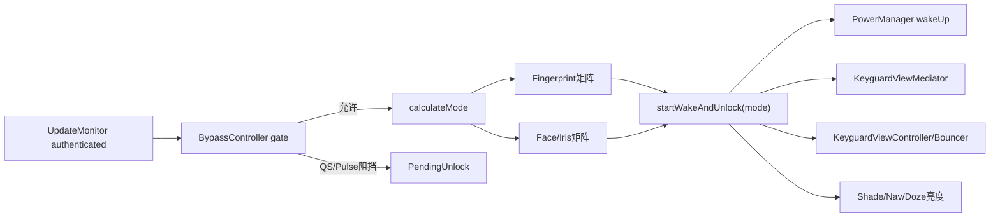
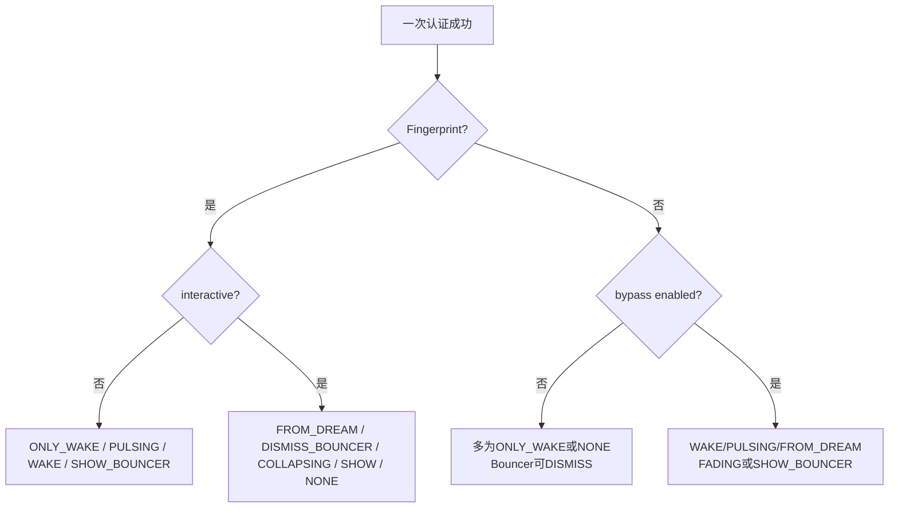
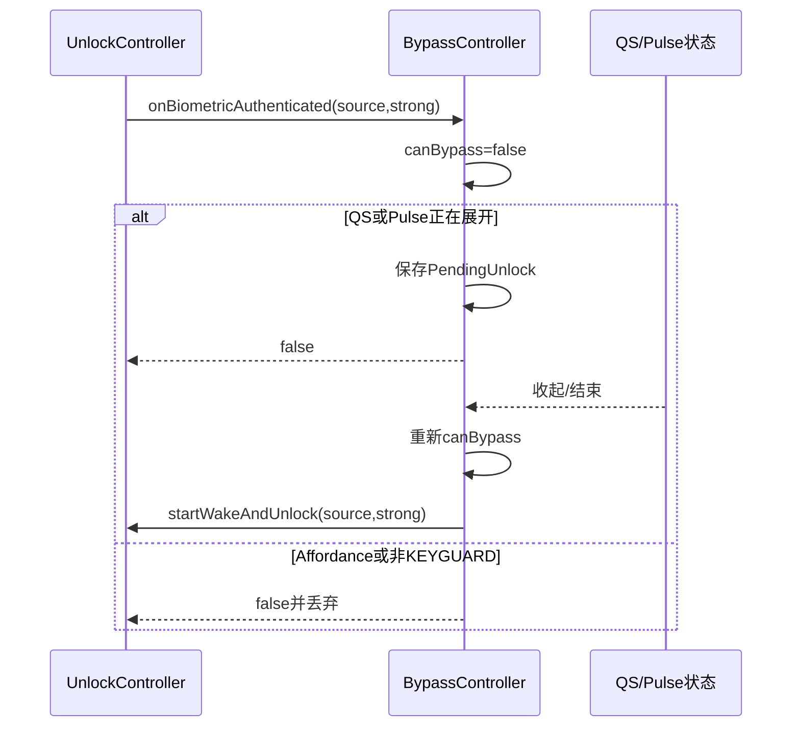

# 第 467 章 Android SystemUI BiometricUnlockController 与 KeyguardBypassController：生物识别Wake-and-Unlock模式链

> 源码基线：Android 11 / API 30 / `android-11.0.0_r48`。本章只在 macOS 阅读，不实际编译。核心文件：`BiometricUnlockController.java`、`KeyguardBypassController.kt`及`BiometricsUnlockControllerTest.java`，并交叉阅读`KeyguardUpdateMonitor`、`KeyguardViewMediator`与`StatusBarKeyguardViewManager`。

## 1. 本章解决什么问题

同样一次生物识别成功，为何有时黑屏直达桌面、有时只唤亮、有时显示Bouncer、有时淡出锁屏？Face为何默认留在锁屏而指纹直接解锁？QS或通知脉冲展开时，成功结果又为何会暂存？

## 2. 一句话主线

Controller把屏幕交互、Keyguard/Bouncer、Doze pulse、Dream、StrongAuth允许性、生物类型与Face bypass合成九种mode，再投影为唤屏、Mediator wake-and-unlock、Bouncer认证、Shade收起和窗口动画；Bypass Controller决定被动Face能否立即越过锁屏，或只在QS/pulse暂时阻挡时保存一个pending结果。

## 3. Controller不判断生物真假

真假与强度由BiometricService/KeyguardUpdateMonitor确认；本类收到authenticated后只选择UI路径。`isStrongBiometric`用于查询当前StrongAuth政策是否允许，不自行升级认证强度。

## 4. active与passive认证分流

Fingerprint走`calculateModeForFingerprint()`；Face和Iris走`calculateModeForPassiveAuth()`。前者通常代表主动触摸，后者默认允许用户看通知锁屏而不自动穿过。

## 5. 九种mode不是生命周期状态机

它们是一次成功后的动作方案：NONE、WAKE_AND_UNLOCK、PULSING、SHOW_BOUNCER、ONLY_WAKE、UNLOCK_COLLAPSING、FROM_DREAM、UNLOCK_FADING、DISMISS_BOUNCER。`mMode`随后也被下游当转场事实读取。

## 6. 三个问题决定大部分分支

设备是否interactive？Keyguard是否showing？本次生物是否被StrongAuth允许？再叠加pulsing/dreaming、Bouncer与bypass，才能得到最终mode。

## 7. unlockAllowed并非硬件成功

硬件成功后，重启后首次解锁、Lockdown、DPM或超时可能仍要求强凭据；`isUnlockingWithBiometricAllowed(isStrong)`表达当前政策是否接受本生物结果解锁。

## 8. Bypass的产品含义

Face bypass开启时，脸成功可像指纹一样直接离开Keyguard；关闭时通常只完成认证事实并保持通知锁屏，等用户再上滑。

## 9. 本章五条事实线

认证结果、屏幕wakefulness、Keyguard/Bouncer可见、Doze/Scrim和Shade展开分别来自不同对象。mode只是一次合成结果，不会让这些事实原子同时改变。

## 10. 总体决策图



## 11. acquire阶段先保CPU

设备非interactive时，`onBiometricAcquired()`创建PARTIAL_WAKE_LOCK，防止生物结果尚未回到SystemUI时CPU重新睡眠；interactive时不申请。

## 12. 每次acquire先释放旧锁

新acquire开头调用release，移除旧timeout并释放旧WakeLock，再决定是否创建新锁。连续采样不会简单叠加多把锁。

## 13. WakeLock最长15秒

申请后post 15秒释放Runnable。成功路径唤屏、失败和error cleanup也会提前释放；超时是最后保险，不是认证timeout。

## 14. acquire同时启动延迟统计

熄屏采样根据Face或其他源启动不同LatencyTracker action；真正结束点在后续转场代码，不能把acquired当认证完成。

## 15. authenticated遇正在入睡先暂存

`isGoingToSleep()`为true时，只保存userId、source、strong三项`PendingAuthenticated`并返回，不记本轮mode、指标或Bypass决定，等finished-going-to-sleep后重新走完整入口。

## 16. sleep pending与Bypass pending不同

前者属于BiometricUnlockController并保存userId；后者属于BypassController，只保存source和strong，用于QS/pulse阻挡。两者清理条件和安全边界不同。

## 17. 认证入口核心源码

```java
if (mUpdateMonitor.isGoingToSleep()) {
    mPendingAuthenticated = new PendingAuthenticated(
            userId, biometricSourceType, isStrongBiometric);
    return;
}
mBiometricType = biometricSourceType;
boolean unlockAllowed = mKeyguardBypassController.onBiometricAuthenticated(
        biometricSourceType, isStrongBiometric);
if (unlockAllowed) {
    mKeyguardViewMediator.userActivity();
    startWakeAndUnlock(biometricSourceType, isStrongBiometric);
}
```

## 18. Controller入口不再次核对userId

非sleep路径没有比较传入userId与current user，主要依赖UpdateMonitor只上送合法当前用户结果。作为公开callback方法直接测试/异常调用时，本类自身没有用户门。

## 19. finished sleep无条件重放pending

它post再次调用`onBiometricAuthenticated(savedUser,...)`并清槽，没有先用`hasPendingAuthentication()`核对current user或StrongAuth；后者只是查询方法，不是重放门。

## 20. pending跨用户是静态风险

若入睡期间用户/政策变化，重放入口又不消费saved user做检查，可能按新当前状态选择mode。正常上游切用户或sleep流程是否排除该序列仍需运行时验证。

## 21. Fingerprint熄屏且Keyguard不显示

返回ONLY_WAKE：设备被唤亮，但不执行Keyguard退出，因为当时本来没有Keyguard showing。

## 22. Fingerprint熄屏、pulsing且允许

返回WAKE_AND_UNLOCK_PULSING，淡出已可见的AOD/通知内容，并用强制Doze亮度避免唤屏瞬间亮度跳变。

## 23. Fingerprint熄屏、允许且非pulse

返回WAKE_AND_UNLOCK；若方法本身不secure，即使本次生物不被允许也走该mode，因为没有设备凭据需要保护。

## 24. Fingerprint熄屏但强凭据必需

安全方法且unlockingAllowed=false时返回SHOW_BOUNCER：先唤屏，待waking完成展示图案/PIN/密码。

## 25. Fingerprint交互中Dream

允许解锁且dreaming时返回WAKE_AND_UNLOCK_FROM_DREAM，并先请求UpdateMonitor `awakenFromDream()`。

## 26. Fingerprint在Bouncer上成功

Bouncer showing-or-will-show且允许时返回DISMISS_BOUNCER，调用`notifyKeyguardAuthenticated(false)`；false说明不是设备强凭据。

## 27. Fingerprint在普通锁屏成功

Keyguard showing、允许且Bouncer未占先时返回UNLOCK_COLLAPSING；它不show Bouncer，只加速收起Shade并进入正常解锁投影。

## 28. Fingerprint不允许但锁屏亮着

若Bouncer当前没有显示，返回SHOW_BOUNCER；若Bouncer已经显示，则没有新动作，最终落NONE。

## 29. Fingerprint矩阵源码

```java
if (!isDeviceInteractive()) {
    if (!keyguardShowing) return MODE_ONLY_WAKE;
    if (isPulsing && unlockingAllowed) return MODE_WAKE_AND_UNLOCK_PULSING;
    if (unlockingAllowed || !isMethodSecure()) return MODE_WAKE_AND_UNLOCK;
    return MODE_SHOW_BOUNCER;
}
if (unlockingAllowed && dreaming) return MODE_WAKE_AND_UNLOCK_FROM_DREAM;
if (keyguardShowing) {
    if (bouncerIsOrWillBeShowing && unlockingAllowed) return MODE_DISMISS_BOUNCER;
    if (unlockingAllowed) return MODE_UNLOCK_COLLAPSING;
    if (!isBouncerShowing) return MODE_SHOW_BOUNCER;
}
return MODE_NONE;
```

## 30. Passive mode先读取bypass getter

getter不是单纯Tuner值，而是`backingField && isFaceAuthEnabled`。Face政策临时禁用时，配置仍开也会表现为bypass=false。

## 31. 熄屏无Keyguard的Face

bypass开返回WAKE_AND_UNLOCK，关返回ONLY_WAKE。即使锁屏没显示，passive认证仍按产品选择是否同时执行wake-and-unlock协议。

## 32. 熄屏且生物不允许

bypass开返回SHOW_BOUNCER，关返回NONE。后者甚至不唤屏，避免被动Face失败政策打扰用户。

## 33. Face在pulse时成功

允许且bypass开返回PULSING直解；bypass关只ONLY_WAKE，让用户看见锁屏而不自动离开。

## 34. Face熄屏非pulse成功

bypass开仍复用PULSING动画获得柔和淡出；关则ONLY_WAKE。名字PULSING在这里不保证DozeScrim真的正在pulse。

## 35. Face交互中Dream

允许时bypass开FROM_DREAM，关ONLY_WAKE；被动认证不默认关闭Dream后穿透Keyguard。

## 36. Face在Bouncer上成功

允许时不论bypass开关都至少DISMISS_BOUNCER；若bypass开且允许subtle window animation，则用更快的UNLOCK_FADING。

## 37. Face普通锁屏成功

允许且bypass关返回NONE，即保留锁屏；bypass开返回UNLOCK_FADING并通知Keyguard认证。

## 38. Face不允许且锁屏显示

bypass开返回SHOW_BOUNCER，关返回NONE。开启“看脸即穿过”的用户在StrongAuth拦截时会得到凭据页。

## 39. Passive模式不是只用于Face

Iris也走同一矩阵，且Bypass Controller名称/能力判断以Face为中心。无Face硬件时Controller构造早退，bypass保持false，因此Iris行为偏向无bypass。

## 40. 模式矩阵图



## 41. Bypass Tuner有资源默认值

`config_faceAuthDismissesKeyguard`决定默认；Secure setting `FACE_UNLOCK_DISMISSES_KEYGUARD`可覆盖。无Face feature时不注册Tuner、状态监听和dump。

## 42. canBypass的优先级

Bouncer showing直接true；否则必须处于KEYGUARD，且不能launching affordance、pulse expanding或QS expanded。Bouncer优先意味着即使QS字段异常为true，认证页仍可被Face关闭。

## 43. Bypass门源码

```java
if (!bypassEnabled) return false;
if (bouncerShowing) return true;
if (statusBarState != KEYGUARD) return false;
if (launchingAffordance) return false;
if (isPulseExpanding || qSExpanded) return false;
return true;
```

这是把Kotlin源码的`when`按原顺序等价展开成Java，便于与本章其余源码对照；判断优先级没有改变。

## 44. pending只为两种暂时阻挡

认证发生时can=false，只有`isPulseExpanding || qSExpanded`才保存PendingUnlock；因launchingAffordance或不在KEYGUARD而阻挡的结果直接丢弃。

## 45. QS收起自动重试

`qSExpanded`从true变false会调用`maybePerformPendingUnlock()`；pulse结束也由外部调用同方法。重试先重新走Bypass门，通过后才让UnlockController重新计算mode。

## 46. pending没有userId

它只存source和strong。用户变化监听会清pending，离开KEYGUARD和开始入睡也会清；正确性依赖这些事件在重试前及时到达。

## 47. Bypass入口不筛source

BiometricUnlockController对Fingerprint、Face、Iris都调用`onBiometricAuthenticated()`；若Face bypass已启用且QS/pulse展开，指纹成功也可能被这个门暂存。源码没有`source==FACE`判断。

## 48. 这可能改变指纹即时性

主动指纹通常期待立即解锁，但在启用Face bypass的设备上，它会共享展开阻挡政策。是否为产品有意设计需结合交互测试，不能仅按类名推断只管Face。

## 49. canPlaySubtle条件更宽

它只要求bypass enabled、状态为KEYGUARD且QS未展开，不检查launchingAffordance、pulse expanding或Bouncer。它回答“动画可否细微”，不等同canBypass。

## 50. start先写mMode

动作执行前把mode存字段并把`mHasScreenTurnedOnSinceAuthenticating=false`；StatusBar、Doze、Wallpaper等下游可同步读取本轮认证模式。

## 51. PULSING可能强制Doze亮度

仅当mode=PULSING且当前Scrim确为AOD/PULSING才置forceDozeBrightness。被动Face非pulse却返回PULSING时不会强制，因为`pulsingOrAod()`仍作第二重判断。

## 52. wakeUp动作先于mode switch

除延迟WAKE和NONE外，代码先执行wakeUp Runnable，再进入不同mode动作。因此SHOW_BOUNCER会先唤屏，ONLY_WAKE虽switch空操作也已经唤亮并释放WakeLock。

## 53. AOD延迟只针对普通WAKE

mode必须WAKE_AND_UNLOCK、AlwaysOn启用且资源delay>0。PULSING、FROM_DREAM或SHOW_BOUNCER都不走这段延迟。

## 54. 延迟目的是先画黑

注释说明Wake-and-Unlock唤屏前需让窗口准备黑色，减少显示状态切换时突兀亮度；延迟结束才wakeUp并调用Mediator `onWakeAndUnlocking()`。

```java
boolean delayWakeUp = mode == MODE_WAKE_AND_UNLOCK
        && mDozeParameters.getAlwaysOn() && mWakeUpDelay > 0;
Runnable wakeUp = () -> {
    if (!wasDeviceInteractive) {
        mPowerManager.wakeUp(SystemClock.uptimeMillis(),
                PowerManager.WAKE_REASON_GESTURE, "android.policy:BIOMETRIC");
    }
    if (delayWakeUp) mKeyguardViewMediator.onWakeAndUnlocking();
    releaseBiometricWakeLock();
};
if (!delayWakeUp && mMode != MODE_NONE) wakeUp.run();
```

## 55. 延迟Runnable没有字段句柄

它是方法局部对象，只postDelayed，不保存、不在reset/sleep时remove。状态在delay内改变后，旧Runnable仍按捕获的`wasDeviceInteractive/delayWakeUp`执行。

## 56. stale wake是可审计风险

若开始入睡、mode被另一认证覆盖或Keyguard状态改变，旧任务仍可能wakeUp并通知Mediator。现有代码没有mode generation校验；产品可达性需实际时序测试。

## 57. DISMISS与FADING共享认证动作

两者调用`notifyKeyguardAuthenticated(false)`，走Host/Container已有生物完成事实；FADING差别主要在窗口/面板视觉路径。

## 58. COLLAPSING与SHOW共享分支

interactive时调用`showBouncer()` helper；helper只有mode=SHOW才真正show认证页，但无论哪种都以1.1倍速度强制collapse panels。

## 59. 熄屏SHOW先挂pending

当`wasDeviceInteractive=false`，不立即调用helper，只置`mPendingShowBouncer=true`；Wakefulness observer收到finished waking才show并collapse。

## 60. pending show没有随reset清理

`resetMode()`清mode、biometric type、亮度和Nav标志，却不清`mPendingShowBouncer`。若认证后又开始睡眠，下一次finished waking可能消费旧pending。

## 61. observer执行时看当前mMode

它调用`showBouncer()`；若旧pending仍true但mMode已NONE，helper不会show Bouncer，却仍collapse panels并清pending。旧事件仍有可见Shade副作用。

## 62. 三种Wake mode通知Mediator

WAKE、PULSING、FROM_DREAM都将Shade window设不可focus，调用或延迟调用`onWakeAndUnlocking()`，并通知NavBar `setWakeAndUnlocking(true)`。

## 63. FROM_DREAM额外awaken

它先让UpdateMonitor唤醒Dream，再进入同一Mediator协议；Dream退出与Keyguard消失仍是两个过程。

## 64. PULSING刷新媒体元数据

允许enter animation地更新媒体，配合AOD通知淡出。它是视觉准备，不参与认证安全判定。

## 65. mode NONE不释放新WakeLock

start方法遇NONE不会运行wakeUp Runnable，switch也无动作。通常interactive时本来没有acquire WakeLock；若异常序列带着锁进入NONE，只能靠failure/error、下次acquire或15秒timeout释放。

## 66. failure与error只cleanup

记录不同Metrics/UiEvent后释放WakeLock，不reset mode、不清pending show或延迟wake。它们通常发生在成功mode建立前，但实现不是统一会话收口。

## 67. 开始入睡会resetMode

同时清`mFadedAwayAfterWakeAndUnlock=false`与sleep pending；Bypass Controller还有独立`onStartedGoingToSleep()`清自己的pending，由外部生命周期分别调用。

## 68. resetMode不释放WakeLock

它没有调用cleanup，也不移除15秒释放Runnable。入睡开始时若acquired已拿锁，可能继续持有到结果/timeout。

## 69. FadingAway两阶段

start阶段延迟关闭forceDozeBrightness；finish阶段若当前仍是Wake mode，就把`mFadedAwayAfterWakeAndUnlock=true`，然后resetMode。

## 70. 亮度关闭Runnable也无代际

`startKeyguardFadingAway()`每次post固定延迟Runnable，不保存取消；新一轮PULSING若在旧Runnable到期前开始，旧任务可能把新一轮force亮度提前关掉。

## 71. unlockedByWakeAndUnlock有历史粘性

即使finish后mode已NONE，`mFadedAwayAfterWakeAndUnlock`仍让它返回true，直到下一次started-going-to-sleep清false；用于Wallpaper/Doze判断刚才的退出来源。

## 72. isBiometricUnlock范围更宽

它包含三种Wake mode、UNLOCK_COLLAPSING与UNLOCK_FADING，不含DISMISS_BOUNCER。名字问的是整体生物解锁视觉路径，不等于“曾收到生物成功”。

## 73. mBiometricType何时写

通过非sleep authenticated入口且未被早退后先写source，即使Bypass随后拒绝、mode未开始，字段仍保留该source直到resetMode。

## 74. pending Bypass重放不走Controller认证入口

`maybePerformPendingUnlock()`直接调用`unlockController.startWakeAndUnlock(source,strong)`，不会重新记success指标或userActivity，也没有userId可复核。

## 75. Bypass pending时序图



## 76. pending只保留一槽

新的受阻成功覆盖旧source/strong，没有队列。生物成功是当前会话事实，单槽合理，但缺user/generation使覆盖语义依赖外部清理。

## 77. QS setter只在true→false重试

重复赋false不触发；pulse字段是普通公开var，不自带setter重试逻辑，调用方必须在合适时机显式`maybePerformPendingUnlock()`。

## 78. 离开KEYGUARD清pending

StatusBarState listener在任何非KEYGUARD状态清；若先进入SHADE_LOCKED等状态再很快回来，成功结果不会保留。

## 79. 用户变化只清Bypass pending

LockscreenUserManager listener清其单槽；BiometricUnlockController的sleep pending由另一机制管理，不会被这个listener直接清。

## 80. Face设置读取是动态getter

Tuner backing值可为true，但每次get还问KeyguardStateController Face auth enabled；DPM/用户设置变化无需重写field就能立即关闭有效bypass。

## 81. 没Face硬件则构造早退

不会注册dump、状态/Tuner/user监听，`unlockController` late-init也可能未赋；因为pending流程不可达，正常不会访问它。

## 82. showBouncer pending由Wakefulness完成

测试显式先确认熄屏Face+StrongAuth得到SHOW_BOUNCER且未立即show，再调用`onFinishedWakingUp()`验证展示。这说明pending不是理论字段。

## 83. 现有主测试有14项

覆盖指纹不允许/弱生物、熄屏pulse、亮屏collapse/Bouncer，Face有无bypass、StrongAuth、pulse、subtle animation，以及sleep pending重放，模式矩阵核心比前几章更有保护。

## 84. 测试类名多了s

文件是`BiometricsUnlockControllerTest.java`，生产类是`BiometricUnlockController`。搜索只按完全同名容易误判“没有测试”。

## 85. 测试仍缺WakeLock生命周期

没有直接验证15秒timeout、重复acquire、sleep reset、MODE_NONE或延迟wake后的释放与取消。

## 86. 测试缺stale Runnable

AOD delayed wake、forceDozeBrightness延迟关闭和跨轮pendingShowBouncer generation均未覆盖。

## 87. Bypass没有独立测试文件

矩阵测试mock它的返回值，不能覆盖真实canBypass优先级、QS setter、pending overwrite、用户/状态清理或Fingerprint也被门控。

## 88. sleep pending测试未切用户

它只验证going-to-sleep期间成功会在finished后认证；没有验证saved user与current user不同时应否丢弃。

## 89. 可确认的代码事实

模式分支、Bypass门不筛source、pending不含user、resetMode不清pendingShow/不释放WakeLock、三个局部延迟Runnable无取消，都能由本地r48源码直接证明。

## 90. 需运行时验证的风险

旧wake是否跨会话唤屏、旧亮度任务是否干扰新pulse、指纹在Face bypass+QS下是否被延迟、pending show是否产生误collapse，依赖真实消息/生命周期顺序。

## 91. MODE名称不要按字面猜

PULSING可在非pulse的passive+bypass分支返回；SHOW_BOUNCER熄屏时先只挂pending；ONLY_WAKE的switch为空但前置wake已执行。要读start方法整体。

## 92. strongAuth参数为何传false

`notifyKeyguardAuthenticated(false)`表示本次不是图案/PIN/密码强认证，即使硬件生物被标strong。设备凭据strongAuth与BiometricManager的strong biometric是不同概念。

## 93. Wake reason使用GESTURE

PowerManager wakeUp传`WAKE_REASON_GESTURE`和`android.policy:BIOMETRIC`详情；统计大类按gesture记，详细字符串才指出生物来源。

## 94. userActivity只在Bypass允许后调用

被QS/pulse暂存或其他门拒绝时，本次入口不poke userActivity；pending以后直接start也不补，长时间展开时屏幕活跃依赖其他交互。

## 95. mMode可被后一次认证覆盖

没有session token；第二次start直接写新mode。旧转场/延迟任务读取字段或执行闭包时，可能混合两轮事实。

## 96. 下游应把mode当瞬时提示

Nav、StatusBar、Doze和Wallpaper用它选动画，但安全完成仍由Mediator/Container事实决定。mode NONE不等于“未认证”，也可能是Face成功选择留在锁屏。

## 97. 改进一：统一认证session

建立包含generation、userId、source、strong、acquire WakeLock、mode和pending任务的对象；所有callback/Runnable只处理当前session。

## 98. 改进二：集中取消资源

sleep、failure、error、mode替换和fade finish统一取消wake、亮度、pending show及WakeLock timeout；不要让局部Runnable逃离生命周期。

## 99. 改进三：Bypass限定来源

明确产品政策：若只服务被动Face/Iris，就在入口筛source；若有意统一全部生物，重命名并补指纹+QS测试，避免类名误导。

## 100. 改进四：pending保存用户

Bypass与sleep pending都保存userId和认证session；重放前复核current user、StrongAuth、Keyguard状态与生物仍有效。

## 101. 改进五：mode用结构化结果

用`wake/displayKeyguard/showBouncer/dismiss/animation`字段替代九个互斥整数，可显式表达PULSING名称与真实Scrim状态的差异。

## 102. 推荐阅读顺序

先画Fingerprint矩阵，再画Passive矩阵；随后读start的前置wake与switch；最后读Bypass pending、sleep pending和reset/fading资源收口。

## 103. 调试“认证成功却没解锁”

先看source、unlockingAllowed、bypass有效getter、canBypass阻挡原因和mode；Face+bypass关得到NONE可能是预期，不应先怀疑硬件结果丢失。

## 104. 调试“突然弹出Bouncer”

检查是否StrongAuth不允许、认证时是否熄屏、`mPendingShowBouncer`是否来自旧轮，以及finished-waking时当前mode；同时查Mediator自己的reset来源。

## 105. 调试“屏幕被晚到唤醒”

记录start时间、mode、AOD delay、sleep/reset与真正wakeUp时间；若wake发生在资源delay后且无generation，很可能是旧局部Runnable候选。

## 106. 调试“QS收起才解锁”

检查Bypass pending source/strong、qSExpanded边沿和current user；这是设计中的pending路径，但指纹也可能进入，需要确认产品预期。

## 107. 四种完成点

生物服务确认成功、Controller选择mode、Mediator收到wake-and-unlocking/notify authenticated、Keyguard fade完成分别不同；日志中“success”不能证明屏幕已经到桌面。

## 108. 安全与体验的分工

StrongAuth和current-user合法性主要由Monitor保障；Controller优化唤屏和动画；Bypass表达用户体验选择。任何视觉mode都不能绕过上游认证政策。

## 109. 与前两章的连接

生物被允许时Container可因`getUserUnlockedWithBiometric()`完成；不允许时SHOW_BOUNCER进入第465章设备凭据页；SIM安全仍由第466章优先选择，不被生物当作设备strongAuth替代。

## 110. dump能看到什么

Unlock Controller只打印mode和WakeLock；Bypass打印pending、有效bypass和阻挡boolean。看不到session user、延迟Runnable、pending show与时间戳，诊断能力有限。

## 111. 本章检查清单

能否区分active/passive、九种mode、前置wake、AOD delay、StrongAuth、Bypass effective getter、两类pending、用户字段差异以及reset资源缺口。

## 112. macOS 只读练习一：画指纹矩阵

用`sed -n '490,535p'`阅读Controller，按interactive、showing、pulsing、allowed、dreaming、Bouncer六列列出mode，不编译。

## 113. macOS 只读练习二：画Face/Bypass矩阵

阅读`calculateModeForPassiveAuth()`与`canBypass()`，推演bypass开关、QS展开、Bouncer、StrongAuth和Dream组合，特别解释为何Face成功可返回NONE。

## 114. macOS 只读练习三：审计三个迟到任务

搜索`postDelayed`、`mPendingShowBouncer`、`setForceDozeBrightness`与`resetMode`，为WakeLock timeout、AOD wake、fade亮度任务分别标出创建、取消和代际检查。

## 115. macOS 只读练习四：推演跨用户pending

比较`PendingAuthenticated`与`PendingUnlock`字段，追sleep finished、QS收起、用户变化和StatusBar离开KEYGUARD，写出哪些路径明确清理、哪些只依赖上游，不运行设备。

## 116. 最容易误解的一点

Face认证成功与Face立即穿过锁屏是两回事；bypass关时mode NONE/ONLY_WAKE仍可代表认证成功，只是产品选择保留Keyguard体验。

## 117. 第二个易错点

start的switch里ONLY_WAKE为空，不代表什么都没做；wakeUp和WakeLock释放已在switch之前执行。

## 118. 第三个易错点

PULSING是动画策略名，不是Scrim状态证明。被动Face+bypass可在非pulse时返回它，实际强制Doze亮度还有独立状态检查。

## 119. 本章结论

r48用清晰矩阵把生物成功适配到熄屏、AOD、Dream、Bouncer和Face体验，核心模式测试也较完整；但两个pending模型、未限定source的Bypass以及无generation的wake/亮度/Bouncer任务，使跨状态竞态仍需重点审计。读代码必须同时跟user、mode、wakefulness、Keyguard和延迟任务代际。

## 120. 下一章预告

下一章阅读SystemUI DozeMachine、DozeTriggers与DozeScrimController，研究AOD/pulse状态机、传感器/通知触发、Proximity门、WakeLock与本章PULSING wake-and-unlock怎样协同。
