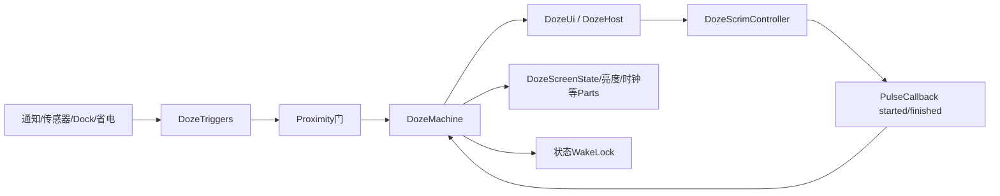
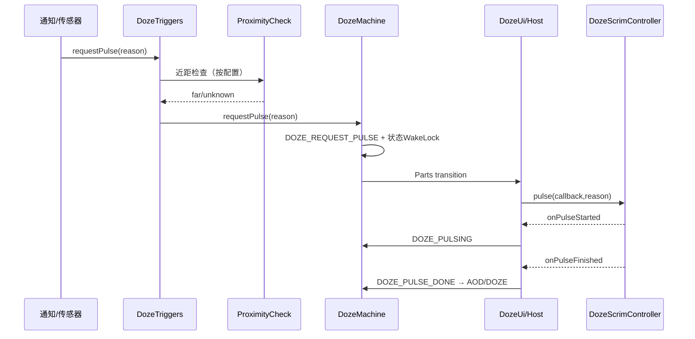
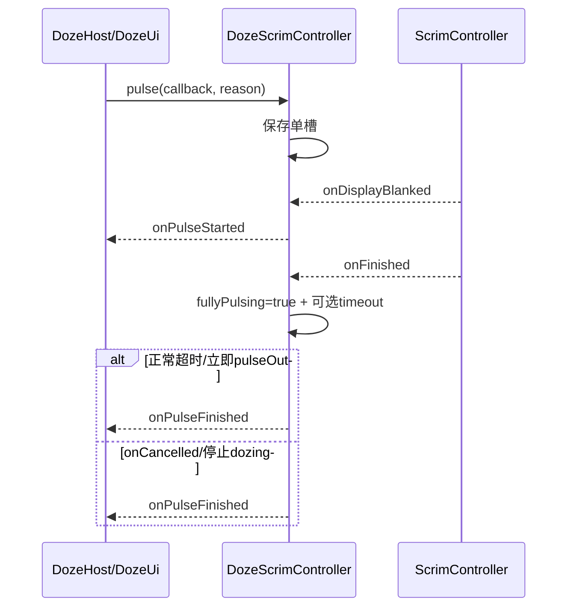

# 第 468 章 Android SystemUI DozeMachine、DozeTriggers 与 DozeScrimController：AOD、Pulse、近距和WakeLock状态链

> 源码基线：Android 11 / API 30 / `android-11.0.0_r48`。本章只在 macOS 阅读，不实际编译。核心文件：`DozeMachine.java`、`DozeTriggers.java`、`DozeScrimController.java`及三份同名测试，并交叉阅读`DozeSensors`、`DozeHost`、`DozeUi`和第467章`BiometricUnlockController`。

## 1. 本章解决什么问题

AOD与普通黑屏Doze有什么区别？通知、抬手、双击和传感器怎样请求一次Pulse？近距为什么既能拒绝Pulse又能暂停AOD？Pulse为何必须持WakeLock，Scrim淡入淡出完成后又怎样回到AOD或DOZE？

## 2. 一句话主线

`DozeMachine`串行化并校验全局状态；`DozeTriggers`把通知、广播、传感器、近距、Dock和省电事件翻译成状态请求；`DozeScrimController`只管理一次Pulse的Scrim可见窗口和回调。状态、触发政策与视觉超时分层后，AOD/Pulse才不会被误写成一个boolean。

## 3. Doze不是设备空闲Doze

这里是SystemUI环境显示/AOD状态机，控制低功耗锁屏显示；它不同于DeviceIdleController限制后台任务的Doze Mode。两者同名但进程、职责和状态完全不同。

## 4. Machine拥有唯一主状态

Parts不能各自宣布全局Doze状态，只接收`transitionTo(old,new)`并投影显示、触发器、亮度、时钟等子职责；所有主状态请求必须回Machine。

## 5. Triggers不直接画屏

它决定是否值得pulse/wake/切AOD，执行近距门并请求Machine；真正Scrim动画由StatusBar侧Controller完成，屏幕硬件状态还有DozeScreenState等Part。

## 6. Scrim不决定安全政策

它接受已经批准的Pulse callback与reason，等待ScrimController通知display blanked/finished，再按可见时长结束。它不检查通知设置、口袋或StrongAuth。

## 7. 三类完成点

触发获批进入`DOZE_REQUEST_PULSE`、Scrim `onDisplayBlanked`回`onPulseStarted`、Scrim/外部超时回`onPulseFinished`是三步；只有最后一步推动Machine到PULSE_DONE并释放状态WakeLock。

## 8. 与生物解锁的连接

第467章检测到Scrim AOD/PULSING时选择`MODE_WAKE_AND_UNLOCK_PULSING`，强制Doze亮度并淡出内容；生物Controller不拥有本章状态机，只读取/配合其当前视觉事实。

## 9. 需要同时跟踪五个量

Machine state、pulse reason、Triggers `mPulsePending`、Scrim `mPulseCallback/mFullyPulsing`和两层WakeLock分别变化。任一单值都不能证明“一次Pulse已完整结束”。

## 10. 总体结构图



## 11. Machine共有十二个状态

UNINITIALIZED、INITIALIZED、DOZE、DOZE_AOD、REQUEST_PULSE、PULSING、PULSING_BRIGHT、PULSE_DONE、FINISH、AOD_PAUSED、AOD_PAUSING、AOD_DOCKED。中间态也是正式状态，不是日志标签。

## 12. DOZE与DOZE_AOD

DOZE通常屏幕OFF但监听触发；AOD通常DOZE_SUSPEND并显示低功耗内容。是否支持Always-On由AmbientDisplayConfiguration、抑制和省电共同决定。

## 13. PAUSING与PAUSED

近距变near时AOD先进PAUSING，后续Part的超时/屏幕投影进入PAUSED；far时Triggers把两者恢复AOD。它避免口袋中持续点亮AOD。

## 14. DOZE_AOD_DOCKED很特殊

Dock场景屏幕ON且`staysAwake=true`，关闭触摸传感器和近距监听，由Dock UI/策略管理；它不是普通低功耗AOD的同义词。

## 15. 请求队列与转换WakeLock源码

```java
boolean runNow = !isExecutingTransition();
mQueuedRequests.add(requestedState);
if (runNow) {
    mWakeLock.acquire(REASON_CHANGE_STATE);
    for (int i = 0; i < mQueuedRequests.size(); i++) {
        transitionTo(mQueuedRequests.get(i), pulseReason);
    }
    mQueuedRequests.clear();
    mWakeLock.release(REASON_CHANGE_STATE);
}
```

Part在转换中再次request只会扩展同一ArrayList，由外层for继续消费，避免递归破坏主顺序。

## 16. 请求必须在主线程

`requestState/requestPulse/getState`都有主线程断言或约束。传感器/Binder输入需先归一到主线程，Machine本身不是加锁的多线程状态机。

## 17. requestPulse禁止在转换中调用

普通state可以排队，Pulse却要求`!isExecutingTransition()`；因为队列只保存State，不保存每项pulseReason。若允许嵌套Pulse，reason会与请求错配。

## 18. getState也禁止转换中读取

队列非空时抛IllegalStateException，强迫Part使用传入的old/new而非在半转换时猜主状态。Triggers部分异步回调会先检查`isExecutingTransition()`。

## 19. 转换先写mState再通知Parts

Machine验证后立即`mState=newState`、写trace和pulse reason，再逐Part回调；Part请求的新状态入队，但当前主状态已经是new。

## 20. 同状态请求直接丢弃

政策转换后若new等于current，既不通知Parts、不更新WakeLock，也不更新pulse reason。这让重复AOD/DOZE幂等。

## 21. INITIALIZED是瞬时中间态

所有Parts先收到初始化，随后Machine依据Dock、Always-On和当前wakefulness直接递归转到DOZE/AOD/AOD_DOCKED。

## 22. PULSE_DONE也是中间态

若设备已awake/waking则转FINISH；否则按Dock/Always-On回到合适基态。Parts仍能观察PULSE_DONE做传感器临时禁用等清理。

## 23. FINISH具有吸收性

进入后Service.finish；后续任何请求政策都改成FINISH，合法性只允许FINISH→FINISH，Machine不会重新启动。

## 24. PULSING只能来自REQUEST

validate明确要求；PULSE_DONE可从REQUEST、PULSING或PULSING_BRIGHT进入，所以Scrim在真正started前被取消也能结束本轮。

## 25. Pulse reason何时保存

进入REQUEST时写`mPulseReason`；离开PULSE_DONE后清NONE。REQUEST→PULSING→DONE全程可读取同一reason。

## 26. Pulse reason不是队列元素

外层requestState私有方法把一个pulseReason参数用于整轮队列消费；嵌套普通状态不使用它，嵌套Pulse被禁止，因此当前设计才成立。

## 27. 状态屏幕映射不是简单ON/OFF

DOZE/PAUSED为OFF；PULSING/BRIGHT/DOCKED为ON；AOD/PAUSING为DOZE_SUSPEND；INITIALIZED/REQUEST依`shouldControlScreenOff()`选ON或OFF。

## 28. REQUEST可能屏幕仍OFF

它只表示准备Pulse，Scrim与Display Part尚未完成；不能在看到REQUEST日志时宣称内容已经可见。

## 29. 两层WakeLock

每轮状态转换临时持`REASON_CHANGE_STATE`；REQUEST、PULSING、BRIGHT、AOD_DOCKED另外长期持`HELD_FOR_STATE`。前者保护回调执行，后者保护状态停留。

## 30. 状态锁的交接顺序

进入staysAwake状态时，外层转换锁仍持有，Parts完成后再申请状态锁，最后外层释放转换锁；CPU保护不会出现空窗。

## 31. 离开Pulse释放状态锁

进入PULSE_DONE时`staysAwake=false`，状态锁释放；外层转换锁仍保护PULSE_DONE及自动回基态的清理过程。

## 32. Part异常会破坏收口

request队列外层没有try/finally。某个Part `transitionTo()`抛异常时，队列可能不清、转换WakeLock不释放、mState已提前改变；这是一条源码可见的fail-fast资源风险。

## 33. 测试证明正常锁交接

Machine测试检查转换内持锁、Pulse状态持锁、Doze基态不持状态锁和Pulse后释放；没有测试Part抛异常后的finally语义。

## 34. Machine转换政策源码

```java
if (mState == FINISH) return FINISH;
if (mDozeHost.isDozeSuppressed() && requestedState.isAlwaysOn()) return DOZE;
if ((mState == DOZE_AOD_PAUSED || mState == DOZE_AOD_PAUSING
        || mState == DOZE_AOD || mState == DOZE
        || mState == DOZE_AOD_DOCKED)
        && requestedState == DOZE_PULSE_DONE) return mState;
if (requestedState == DOZE_AOD && mBatteryController.isAodPowerSave()) return DOZE;
if (requestedState == DOZE_REQUEST_PULSE && !mState.canPulse()) return mState;
return requestedState;
```

这里的baseState包括DOZE、AOD、AOD暂停态和Docked AOD。

## 35. Doze suppressed只改Always-On态

`isAlwaysOn()`仅AOD和AOD_DOCKED为true；PAUSING/PAUSED不是。抑制状态通常由Host callback另行请求DOZE，不能只依赖这一行覆盖所有旧态。

## 36. 省电只拦普通AOD请求

Battery `isAodPowerSave()`把请求DOZE_AOD降为DOZE；Docked AOD由doze suppressed等其他条件裁决，代码没有在此处统一降级所有亮态。

## 37. 已回基态的PULSE_DONE被丢弃

迟到finished callback到达时若状态已经DOZE/AOD/PAUSED/Docked，政策返回当前态，避免非法重复收尾。

## 38. Machine与Triggers的canPulse不同

Machine允许DOZE、AOD、PAUSED、PAUSING、DOCKED；Triggers只允许DOZE、AOD、DOCKED。正常通知/传感器不会从暂停态发Pulse，即使Machine底层技术上接受。

## 39. 这不是矛盾而是两层政策

Machine定义合法状态边；Triggers定义本触发源愿意使用的边。其他Part若直接requestPulse可利用更宽合法集合，但必须满足非转换约束。

## 40. Triggers输入很多

通知Host callback、调试Pulse广播、Car mode、用户切换、DozeSensors、Proximity、Dock、PowerSave和Doze suppressed都汇入同一Part。

## 41. INITIALIZED注册外部监听

注册Receiver、Host callback、Dock listener，临时禁用Sensor并检查Car mode、Host blocking和provisioned；任一不适合Doze即可请求FINISH并排队。

## 42. FINISH必须对称注销

注销三类listener，关闭Sensor与Prox监听并清want flags；`destroy()`另调用DozeSensors.destroy，不与状态转换自动等同。

## 43. want flags是增量状态

每个newState只修改相关字段，再统一`setListening`。例如PAUSED只确保wantProx=true，其他Sensor意图沿用之前状态；阅读单个case不能假设未赋字段为false。

## 44. 基本Pulse时序图



## 45. 通知Pulse有三道前门

静态wake-display sensor必须true、当前用户允许pulseOnNotification、Host不能doze suppressed；任一失败立即运行suppressed listener并记录drop。

## 46. notificationPulseTime写得较早

通过wake-display门后立刻记录时间，之后才查用户配置和Host suppressed。即使通知最终没Pulse，随后pickup统计仍可能把它当“最近通知”。

## 47. suppressed listener是调用方收口

通知流水线可用它处理Pulse未发生时的生命周期；代码必须在所有拒绝分支至多一次调用，否则外层可能等待错误完成点。

## 48. 近距检查有三条路径

调用方声明已检查则回null；DozeSensors有缓存则同步回near/far；否则启动带timeout的ProximityCheck，并单独持WakeLock直到callback。

## 49. null近距按可继续处理

结果判断通常是`result != null && result`才认为口袋；unknown/null不会拦Pulse或gentle wake，是可用性优先的fail-open。

## 50. Prox WakeLock依赖callback配对

异步检查前acquire，回调末尾release；若ProximityCheck自身连timeout callback都不执行，本层没有finally或第二个超时，WakeLock会留住。

## 51. 已检查参数绕过缓存

`alreadyPerformedProxCheck=true`直接callback null，即使当前缓存near也不再拒绝。它信任上游传感器/路径已经完成合适的口袋判断。

## 52. 长按直接请求Pulse

Long press与wake-lock-screen传感器走performed=true；wake-lock-screen只有rawValues首值非0才请求。已PULSING时该reason还可直接升级PULSING_BRIGHT。

## 53. Tap与Pickup走gentleWakeUp

双击/单击可把坐标传给SLPI tap，再请求真正wakeUp；Pickup也wake。其他一般Sensor事件只extend当前Pulse。

## 54. gentle wake可能先画黑

若Display需要blanking，先把AOD dimming scrim设1，再让DozeService requestWakeUp，遮住硬件唤醒黑帧/亮度跳变。

## 55. onSensor内Prox被标已做

一般分支调用`proximityCheckThenCall(..., true, reason)`，因此Triggers本层不再查缓存/传感器；是否真的做过近距依赖DozeSensors对该Sensor的配置合同。

## 56. Pickup统计与Pulse独立

无论上面事件最终怎样处理，Pickup都会计算距`mNotificationPulseTime`是否小于震动阈值并写DozeLog。

## 57. wake-display是静态进程状态

`sWakeDisplaySensorState`初始true，Sensor事件更新；新DozeTriggers实例初始化时不重置。上一Doze会话最后为false可影响下一会话通知Pulse，直到Sensor再报告。

## 58. false会拒绝所有通知Pulse

onNotification第一道门直接drop；进入AOD时若该静态值仍false，Triggers还调用`onWakeScreen(false,AOD)`请求DOZE。

## 59. wake=true异步使用旧state

`onWakeScreen`接收触发瞬间state，近距异步完成后仍用这个捕获值判断是否从DOZE转AOD，没有重新读取Machine当前状态或代际。

## 60. stale wake-display风险

检查期间若Machine已FINISH、Pulse或其他态，旧callback仍可能request AOD；Machine政策会挡部分非法边，但FINISH吸收之外并无专用sensor generation。

## 61. requestPulse核心源码

```java
mDozeHost.extendPulse(reason);
if (mPulsePending || !mAllowPulseTriggers || !canPulse()) {
    runIfNotNull(onPulseSuppressedListener);
    return;
}
mPulsePending = true;
proximityCheckThenCall(result -> {
    if (result != null && result) {
        mPulsePending = false;
        runIfNotNull(onPulseSuppressedListener);
    } else {
        continuePulseRequest(reason);
    }
}, !mDozeParameters.getProxCheckBeforePulse() || performedProxCheck, reason);
```

## 62. extendPulse发生在所有门之前

即使当前不是Pulse、触发禁用或状态不允许，Host仍先收到extend请求。方法名像延长已有Pulse，但调用并不以“当前已Pulsing”为前提。

## 63. mPulsePending只覆盖Prox窗口

通过前门后置true，near/drop或continue开始就清false；Machine进入REQUEST后不再靠它表示Pulse进行中，后续由state和Scrim callback表示。

## 64. 第二道门防检查期间变状态

Prox返回far/unknown后，`continuePulseRequest()`重新检查Host blocked和Triggers canPulse，避免检查前在AOD、回来已不允许却仍request。

## 65. 第二道drop漏suppressed listener

listener没有传入`continuePulseRequest()`；若第一道通过、Prox非near，但随后因Host blocked/state变化被第二道丢弃，调用方不会收到suppressed回调。

## 66. Pulse请求指标早于实际批准

在启动/跳过Prox后立即写Metrics/UiEvent；即使稍后in-pocket或第二道门drop也已有“request reason”记录。它统计请求，不是可见Pulse次数。

## 67. 已Pulsing可升级Bright

若当前精确为DOZE_PULSING且reason是WAKE_LOCK_SCREEN，先request BRIGHT并return；不会检查allowPulseTriggers、Triggers canPulse或Host blocked，但这是升级已有Pulse，不是新建。

## 68. 已BRIGHT不会重复特殊升级

条件只匹配PULSING；随后进入普通门，而canPulse不含BRIGHT，因此请求被drop，可能调用suppressed listener。

## 69. Proximity持续监听负责AOD暂停

far且当前PAUSED/PAUSING请求AOD；near且当前AOD请求PAUSING。与单次Pulse前ProxCheck不同，这是状态变化监听。

## 70. Pulse中near只屏蔽触摸

PULSING/BRIGHT时调用Host `onIgnoreTouchWhilePulsing(near)`，不立即结束Pulse，避免口袋误触可见内容。

## 71. onProximityFar主动防旧回调

若Machine正在transition直接忽略，然后读取实时state；这比wake-display异步闭包使用捕获state更稳健，但仍没有显式Prox generation。

## 72. PowerSave callback双向切换

省电active请求DOZE；关闭后若当前精确DOZE且当前用户Always-On enabled，请求AOD。不会从任意状态强拉AOD。

## 73. Doze suppressed callback更直接

Always-On enabled且suppressed=false就AOD，否则DOZE；Machine政策会再次检查Host suppression和Battery。

## 74. Car mode结束Doze

Receiver收到ENTER_CAR_MODE请求FINISH；用户切换只通知DozeSensors刷新，不直接重建Machine配置。

## 75. Scrim pulse只保存一槽

不dozing或已有callback时立即调用新callback `onPulseFinished()`抑制；接受时仅保存callback/reason，等外部Scrim转场回调真正开始。

## 76. pulse()本身不启动动画

它不post timeout、不回started，也不请求Machine；StatusBar/ScrimController之后用同一个`mScrimCallback`驱动display blanked与finished。

## 77. onDisplayBlanked才回started

只要仍dozing就调用pulseStarted；它不检查`mPulseCallback`是否仍存在，pulseStarted内部才用null门。日志仍会写当前reason。

## 78. onFinished标记fully pulsing

非通知、非Docking reason安排普通与extended两个超时，然后无条件`mFullyPulsing=true`。通知和Dock由外部生命周期结束，不设内部timeout但仍fully=true。

## 79. 两个timeout谁先结束

普通mPulseOut先到就移除两者并finish；`extendPulse()`只移除普通，使extended成为最晚兜底；extended到时也先移除普通再执行out。

## 80. cancelPendingPulseTimeout更强

它同时移除普通和extended，Pulse不会因本Controller的时间到期结束，必须等外部调用pulseOutNow、取消dozing或其他完成源。

## 81. callback finished必须可靠

注释明确调用者靠它释放Pulse WakeLock。Scrim视觉完成不回callback会让Machine停在staysAwake状态。

## 82. Scrim视觉时序图



## 83. 不dozing时抑制有配对

新Pulse不会悬空，立即finished让上游结束REQUEST；这也是Scrim测试覆盖的基本合同。

## 84. Scrim收口源码

```java
private void pulseFinished() {
    mDozeLog.tracePulseFinish();
    if (mPulseCallback != null) {
        mPulseCallback.onPulseFinished();
        mPulseCallback = null;
    }
}
private final Runnable mPulseOut = new Runnable() {
    @Override
    public void run() {
        mFullyPulsing = false;
        mHandler.removeCallbacks(mPulseOut);
        mHandler.removeCallbacks(mPulseOutExtended);
        if (!mDozing) return;
        pulseFinished();
    }
};
```

## 85. pulseFinished自身不清fully

也不移除timeout；正常mPulseOut和cancelPulsing在调用前清理，但Scrim callback的`onCancelled()`直接调用pulseFinished，形成不同收口语义。

## 86. onCancelled可留下旧状态

若取消发生在onFinished之后，`mFullyPulsing`仍true且两个timeout仍排队；callback已null。下一轮Pulse可能继承fully并被`pulseOutNow()`过早结束。

## 87. 迟到onFinished无callback门

旧Scrim转场cancel/finish乱序时，onFinished只检查mDozing，仍会按当前`mPulseReason`排timeout并置fully；若新Pulse已占槽，旧完成可控制新一轮。

## 88. Scrim callback没有generation

所有Pulse复用同一`mScrimCallback`对象，回调不携带pulse id；只能靠单槽和Scrim顺序假设防串代。

## 89. cancelPulsing路径较完整

setDozing(false)时清fully、移除两timeout再finish callback；正常停止Doze不会遗留可见Pulse任务。

## 90. mPulseOut的非dozing早退

它已先清fully和timeout，随后若!dozing不finish；通常setDozing(false)已同步cancelPulsing完成callback，因此是避免重复通知。

## 91. Handler隐含主Looper

字段初始化`new Handler()`依赖构造线程Looper；SystemUI单例正常在主线程创建，但类没有显式注入Looper，测试/重构必须保持前提。

## 92. Controller从不注销StateListener

构造注释写“Never expected to be destroyed”，因此无destroy。若依赖图未来允许重建，旧实例会留在StatusBarStateController回调列表。

## 93. Machine测试覆盖较丰富

本地共验证初始化/Dock/抑制、Pulse done回基态、FINISH吸收、WakeLock、嵌套state请求、reason与wakeUp；相比Triggers/Scrim更完整。

## 94. Triggers测试只有五项

覆盖一次失败Prox后通知仍能Pulse、Pulse阶段触摸Sensor开关、Dock关闭触摸、Dock listener注册和无Prox Sensor不崩；通知第二道drop、静态wake-display和异步旧state未测。

## 95. Scrim测试只有三项

验证正常started/finished、第二Pulse抑制和非dozing抑制；timeout、extend、onCancelled乱序、fully残留、旧onFinished串代均未覆盖。

## 96. 测试数量不等于路径覆盖

Machine主边较多，但完整Pulse横跨Triggers→Machine→DozeUi→Host→Scrim，单模块green不能证明跨模块callback/WakeLock一定闭合。

## 97. 可确认的代码事实

两层canPulse集合不同、通知时间提前写、第二道drop漏listener、wake-display static不重置、Machine异常无finally、Scrim cancelled不清fully/timeout，均可由r48源码直接证明。

## 98. 需运行时验证的风险

Prox callback是否可能不回、旧wake callback能否跨到FINISH、新旧Scrim回调是否实际乱序、静态Sensor false能否跨会话困住通知，依赖具体Sensor/Scrim生命周期。

## 99. 改进一：请求携带generation

PulseRequest保存id、reason、source、listener和state snapshot；Prox、Machine、Host、Scrim回调都核对id，旧回调只做资源收口。

## 100. 改进二：Machine用finally

无论Part成功或抛错都清队列并释放转换WakeLock；必要时转FINISH或记录故障Part，避免半状态与永久持锁。

## 101. 改进三：suppressed listener至多一次

把listener传入第二道门，用原子finished标志确保前门、near、状态竞态和Host blocked所有drop都回调一次。

## 102. 改进四：Scrim统一finish

所有normal/cancel/dozing-off路径都移除timeout、清fully、清callback；onFinished要求callback与generation仍匹配再安排任务。

## 103. 改进五：静态Sensor状态有会话边界

明确它是硬件全局事实还是Doze会话事实；若前者记录时间/有效性，若后者INITIALIZED重置并等首个Sensor快照，避免无期限沿用旧false。

## 104. 推荐源码阅读顺序

先读State枚举和transitionPolicy，再读request队列/WakeLock；接着从onNotification追requestPulse两道门；最后沿DozeUi/Host进入Scrim started/finished。

## 105. 调试“通知不亮屏”

依次查wake-display static、用户pulse配置、Host suppression、allowPulse、当前Triggers canPulse、mPulsePending、Prox结果、第二道Host/state门和Scrim是否dozing。

## 106. 调试“Pulse不结束”

看Machine state与state WakeLock、Scrim callback/fully、reason是否notification/docking、普通/extended timeout是否被extend/cancel，以及上游是否收到finished。

## 107. 调试“AOD口袋中仍亮”

区分持续Prox listener与Pulse前单次check；确认wantProx、实际screenState、near/far事件、Machine是否transition中忽略，以及PAUSING是否由其他Part推进PAUSED。

## 108. 调试“抬手后状态跳回”

记录wake-display回调捕获state、Prox完成时实时state和request AOD时间；异步闭包使用旧state是首要竞态候选。

## 109. 与第467章的视觉交接

生物PULSING解锁可能在Scrim Pulse中途让Keyguard fade；DozeScrim的finished和Biometric fade完成并非同一callback。两边都需幂等处理对方先结束。

## 110. dump能证明什么

Machine打印state、状态WakeLock和Parts；Triggers打印notification time、pulsePending和Sensors；Scrim没有独立dump。缺pulse generation、callback年龄和timeout截止时间。

## 111. 本章检查清单

能否解释十二状态、两层WakeLock、请求队列、政策改写、两种Prox、Triggers双门、Scrim单槽/双timeout，以及started/finished与Machine状态的对应关系。

## 112. macOS 只读练习一：画一次通知Pulse

用`rg -n "onNotification|requestPulse|continuePulseRequest|DOZE_REQUEST_PULSE"`从Host callback追到Machine，列出每个drop点及suppressed listener是否调用，不编译。

## 113. macOS 只读练习二：比较两层canPulse

分别读取`State.canPulse()`和Triggers `canPulse()`，为DOZE、AOD、PAUSING、PAUSED、DOCKED、PULSING建立表格，解释合法边与触发政策的差异。

## 114. macOS 只读练习三：审计WakeLock配对

搜索`REASON_CHANGE_STATE`、`REASON_HELD_FOR_STATE`、`proximityCheckThenCall`和`onPulseFinished`，推演正常、Part异常、Prox不回、Scrim不回四种情况，只记录源码能证明的配对。

## 115. macOS 只读练习四：推演Scrim乱序

按`pulse→onDisplayBlanked→onCancelled→新pulse→旧onFinished→pulseOutNow`顺序手算callback、fully和Handler任务，提出最小generation修复与测试，不运行设备。

## 116. 最容易误解的一点

DOZE_REQUEST_PULSE不是内容已显示；只有Scrim回onPulseStarted后才进入PULSING，finished后才PULSE_DONE并回基态。

## 117. 第二个易错点

近距不是一处统一判断：Pulse前可做单次检查，AOD有持续listener，部分Sensor又声明上游已检查。看到“有Prox”不能推导所有触发都重新测口袋。

## 118. 第三个易错点

`extendPulse()`只取消普通timeout，保留extended兜底；`cancelPendingPulseTimeout()`才取消两者。二者名字相近但结束保证不同。

## 119. 本章结论

r48把全局Doze状态、事件政策和Scrim视觉合理拆层，并以转换/状态WakeLock保护正常Pulse；真正难点在异步Prox、双层canPulse、listener收口和无generation Scrim回调。排查时必须沿reason、state、pending、callback与WakeLock完整走一圈。

## 120. 下一章预告

下一章继续读`DozeSensors`、`DozeScreenState`、`DozeScreenBrightness`与`DozePauser`，研究Sensor注册/临时禁用、屏幕状态延迟、亮度Bucket/调暗Scrim及AOD_PAUSING如何真正进入PAUSED。
