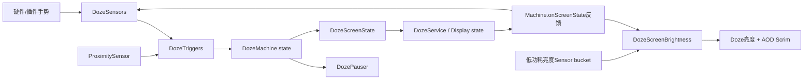
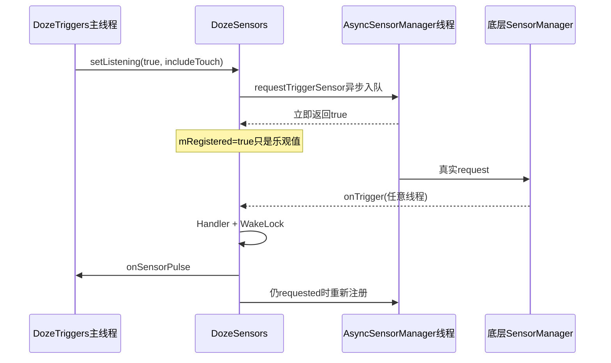
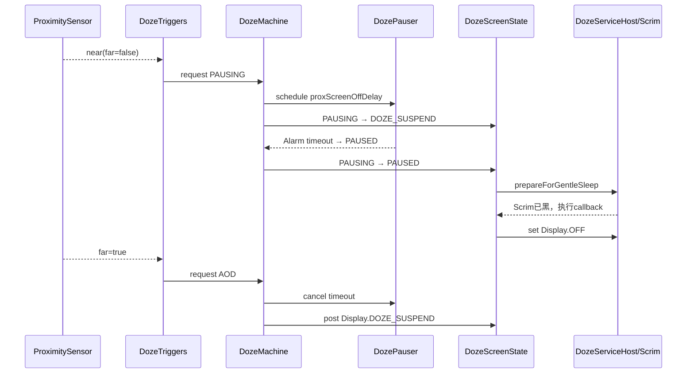

# 第 469 章 Android SystemUI DozeSensors、DozeScreenState、DozeScreenBrightness 与 DozePauser：传感器、屏幕、亮度和 AOD 暂停链

> 源码基线：Android 11 / API 30 / `android-11.0.0_r48`。本章只在 macOS 阅读，不实际编译。核心文件：`DozeSensors.java`、`DozeScreenState.java`、`DozeScreenBrightness.java`、`DozePauser.java`；交叉阅读 `DozeTriggers.java`、`DozeMachine.java`、`DozeFactory.java`、`AsyncSensorManager.java`、`AlarmTimeout.java`、`AlwaysOnDisplayPolicy.java`、`DozeServiceHost.java` 及本地测试。

## 1. 本章解决什么问题

抬手、双击和插件手势在什么条件下注册？状态机说“进入 AOD”后，屏幕为何不一定立刻切到低功耗状态？光传感器给出的值为何不是 lux，而是数组下标？手机被遮挡后，`DOZE_AOD_PAUSING` 又是谁在多久以后推进到 `DOZE_AOD_PAUSED`？

## 2. 一句话主线

`DozeSensors` 管“哪些事件可以进来”，`DozeScreenState` 管“Machine 状态投影成哪种 Display 状态以及何时应用”，`DozeScreenBrightness` 管“低功耗屏幕的亮度和黑色遮罩”，`DozePauser` 管“近距持续为 near 时何时真正熄屏”。它们都是 `DozeMachine.Part` 或被 Part 持有的协作者，却拥有互不相同的状态。

## 3. 先纠正四个直觉

第一，Doze 手势 Sensor 与 AOD 亮度 Sensor 不是同一个监听器；第二，Machine 状态变化不等于硬件屏幕已经切换；第三，亮度 Sensor 值在这里被当成 bucket 下标而非照度；第四，`requestTemporaryDisable()` 并不会统一注销所有 Sensor。

## 4. 四个类的职责边界

`DozeSensors` 不设置屏幕，`DozeScreenState` 不决定手势是否合法，`DozeScreenBrightness` 不推动 Machine 状态，`DozePauser` 不读取近距 Sensor。近距事件由第 468 章的 `DozeTriggers` 翻译成 PAUSING/AOD，Pauser 只消费已经形成的 PAUSING 状态。

## 5. DozeFactory怎样装配

Factory 先用亮度转发器和两层屏幕状态兼容 Adapter 包装 `DozeService`，再按 Pauser、Triggers、Ui、ScreenState、ScreenBrightness 等顺序装入 Parts。转换时 Machine 按数组顺序逐个通知，因此同一次转换里 Pauser 先调闹钟，ScreenState 后投影屏幕。

## 6. 两条Sensor数据面

手势面是 significant motion、pickup、double tap、tap、long press、wake-display 和 wake-lock-screen，输出 `onSensorPulse(reason,x,y,rawValues)`；亮度面只监听厂商配置的 `doze_brightness_sensor_type`，输出亮度值和 AOD front scrim alpha。

## 7. 三种状态不能混为一谈

Machine state 是业务主状态；Display state 是 `OFF/ON/DOZE/DOZE_SUSPEND`；Sensor 本地状态是 requested/registered/disabled。看到 AOD 不能直接推出光 Sensor 已真实注册，也不能推出面板已经进入 DOZE_SUSPEND。

## 8. 线程模型先行

DozeMachine 和 Triggers 主要在 SystemUI 主线程；`DozeSensors` 自建 `new Handler()`，依赖构造线程 Looper；`AsyncSensorManager` 把实际注册/注销投递到 `async_sensor` HandlerThread；硬件回调再经 Handler/WakeLock 回到预期线程。代码中的 `mRegistered=true` 因而可能只是“已排队”。

## 9. 必须同时记录的量

排查时至少记录 Machine state、实际 Display state、`mWantSensors/mWantProx/mWantTouchScreenSensors`、每个 TriggerSensor 的 requested/registered/disabled、ProximitySensor 的 near/registered、ScreenState pending 值、光 Sensor bucket、亮度、scrim 和 Pause Alarm 是否 scheduled。

## 10. 总体结构图



## 11. DozeSensors创建七个触发器

数组包含五个 framework TriggerSensor 和两个 plugin Sensor。每项保存硬件/插件标识、Secure setting、默认开关、设备是否配置、pulse reason、是否报告坐标、是否依赖触摸屏以及是否忽略设置。

## 12. Significant motion的配置

它使用 `TYPE_SIGNIFICANT_MOTION`，没有独立 Secure setting，是否配置来自 `DozeParameters.getPulseOnSigMotion()`。这是一次性 trigger sensor，触发后 framework 取消注册，SystemUI 需要重新请求。

## 13. Pickup的双层门

Pickup 的设置是 `DOZE_PICK_UP_GESTURE`，默认开，但还要求 `dozePickupSensorAvailable()`；触发时除向 Triggers 发送 reason，还把 event 第一个值作为 subtype 写 Metrics 和 UiEvent。统计动作与最终是否 pulse/wake 成功不是同一事实。

## 14. Double tap、tap和long press

三者通常由厂商 string type 查找 Sensor。Double tap 可由参数决定是否报告 x/y；tap 在本版本不取坐标；long press 报告坐标、默认 Secure setting 为关，但 configured 固定为 true，最终仍要求按 type 找到实际 Sensor。

## 15. 两个Plugin Sensor

`TYPE_WAKE_DISPLAY` 只在设备支持 wake-screen 且构造时 Always-On 已启用时 configured；`TYPE_WAKE_LOCK_SCREEN` 只要求 wake-screen 能力，并带 `getWakeLockScreenDebounce()`。Plugin 事件不是 framework 的一次性 TriggerEvent。

## 16. configured不等于enabled

`mConfigured` 表示此机型/功能能否使用；`enabledBySetting()` 还要先检查 Ambient Display 总开关，再检查当前用户对应 Secure setting。Sensor 对象为空、总开关关或用户子开关关，任何一个都能阻止真实注册。

## 17. requested、registered与disabled

`mRequested` 是上层想监听，`mRegistered` 是本类相信已经注册，`mDisabled` 是额外硬禁用门。真正注册条件是 configured、有 Sensor、requested、非 disabled、设置允许或 ignoresSetting，并且当前未 registered。

## 18. setListening的两个参数

第一个参数控制总体监听，第二个决定是否纳入 `mRequiresTouchscreen` 的 Sensor。非触摸 Sensor 只看总体开关；触摸类必须两者都为 true。相同参数重复调用直接返回，不重复操作 observer。

## 19. 为什么Pulse时关闭触摸Sensor

Triggers 在 PULSING/PULSING_BRIGHT 保留 Sensor 总开关和近距需求，但把 touch-screen sensors 关掉，避免正在显示 Pulse 时双击、tap、long press 再次干扰；pickup、插件类等非触摸触发器仍可按各自策略存在。

## 20. updateListening还管理设置Observer

循环按全局/touch 条件调用每个 Sensor 的 `setListening`。只要有一项“被要求监听”，就为所有已配置且有 setting 的 Sensor 注册同一个 ContentObserver；一项都不要求时则统一 unregister。

## 21. anyListening不是注册成功数

这里的 `anyListening` 只要局部 `listen` 为 true 就置 true，不检查 Sensor 是否存在、configured、setting 是否开启或底层注册是否成功。因此 `mSettingRegistered=true` 只表示应保留设置观察者，不能证明至少一个硬件 Sensor 正常工作。

## 22. 设置Observer按当前用户过滤

Observer 对 `USER_ALL` 注册，但 `onChange` 先比较回调 userId 与 `ActivityManager.getCurrentUser()`；只有当前用户变化才逐 Sensor `updateListening()`。这避免后台用户设置变化重配当前 Doze 会话。

## 23. onUserSwitched补做什么

用户切换时不会重建 Sensor 数组，而是逐项重新读取 `USER_CURRENT` setting 并更新注册。注意 `TYPE_WAKE_DISPLAY` 的 configured 条件里 `alwaysOn` 是构造时快照，用户切换后该布尔值不会重新计算。

## 24. ProximitySensor走独立通道

近距不在七项 `mSensors` 数组中；构造时先 pause，再向共享 `ProximitySensor` 注册一个监听器。`setProxListening` 负责 resume/pause，若已注册又请求 listen，则调用 `alertListeners()` 立即回放当前结果。

## 25. Prox回调布尔值表示far

`ProximitySensorEvent.getBelow()` 为 true 表示 near，本类传给 Triggers 的却是 `!getBelow()`，即 true 表示 far。变量/接口如果只写 Boolean 而不写语义，很容易把口袋 near 的处理完全反过来。

## 26. onScreenState为何影响近距安全模式

Display 为 DOZE、DOZE_SUSPEND 或 OFF 时调用 `setSecondarySafe(true)`，其他状态为 false。它调整 ProximitySensor 主/次 Sensor 的安全选择，不等于开始监听；是否 resume 仍由 Triggers 的 `mWantProx` 与显示状态共同决定。

## 27. TriggerSensor注册源码

```java
private void updateListening() {
    boolean anyListening = false;
    for (TriggerSensor s : mSensors) {
        boolean listen = mListening
                && (!s.mRequiresTouchscreen || mListeningTouchScreenSensors);
        s.setListening(listen);
        if (listen) anyListening = true;
    }
    if (!anyListening) {
        mResolver.unregisterContentObserver(mSettingsObserver);
    } else if (!mSettingRegistered) {
        for (TriggerSensor s : mSensors) {
            s.registerSettingsObserver(mSettingsObserver);
        }
    }
    mSettingRegistered = anyListening;
}

public void updateListening() {
    if (!mConfigured || mSensor == null) return;
    if (mRequested && !mDisabled && (enabledBySetting() || mIgnoresSetting)
            && !mRegistered) {
        mRegistered = mSensorManager.requestTriggerSensor(this, mSensor);
    } else if (mRegistered) {
        mSensorManager.cancelTriggerSensor(this, mSensor);
        mRegistered = false;
    }
}
```

外层决定“想不想”，内层才结合机型、对象、设置和禁用状态决定“要不要向 SensorManager 请求”。

## 28. AsyncSensorManager总是先报成功

其 `requestTriggerSensorImpl()` 把真实调用 post 到后台，然后立即返回 true；注释明确说异步注册“现在总显得成功”。真实失败只写错误日志，不反向修正 TriggerSensor 的 `mRegistered`。

## 29. mRegistered是乐观状态

因此 dump 中 `mRegistered=true` 可能仅表示后台请求已入队，甚至底层最终失败。诊断“手势不触发”不能只看这个字段，还要查 `AsyncSensorManager` 失败日志、Sensor 是否存在及 vendor 实现。

## 30. 异步注销也有窗口

cancel 同样 post 到后台。本地主线程先把 `mRegistered=false`，但底层 listener 可能尚未取消；一个已经产生或在途的 TriggerEvent 仍可能进入 `onTrigger()`。回调内部没有再次检查 requested、disabled、setting 或 Machine 会话 generation。

## 31. onTrigger为何先包WakeLock

硬件触发可来自任意线程，代码先 post 到 `mHandler`，并用 `mWakeLock.wrap()` 包住 Runnable，确保事件转译、callback 和重新注册期间 CPU 不睡。WakeLock 保护的是处理窗口，不代表 Pulse 后续整个显示窗口。

## 32. 一次性Sensor怎样重新注册

进入 Handler Runnable 后先把 `mRegistered=false`，解析坐标并回调 Triggers；回调返回后若仍未 registered，就执行 `updateListening()`。若上层在 callback 内改变 requested，重新注册会读取最新字段。

## 33. callback也可能主动重配

`mCallback.onSensorPulse()` 可能最终推动 Machine 转换，Triggers 的 `transitionTo()` 又会调用 `setListening()`。所以 callback 返回时 `mRegistered` 可能已被其他路径改变，末尾 `if (!mRegistered)` 是为避免重复请求，而不是并发锁。

## 34. 触摸坐标的边界

只有 `mReportsTouchCoordinates` 且 values 长度至少 2 才取 `[0]`、`[1]`，否则均为 -1。Pickup 在统计前直接读取 `event.values[0]`，代码未做长度检查，依赖该 Sensor 合同始终提供 subtype。

## 35. 设置变化与在途事件

设置关掉会排队取消底层 listener，但已经投递的回调仍可执行；`onTrigger()` 不重新调用 `enabledBySetting()`。因此“用户关开关后绝不再来一个旧事件”不是本类可证明的强保证。

## 36. Plugin Sensor不是一次性触发

Plugin 通过 `registerPluginListener/unregisterPluginListener` 维持持续监听，事件后不把 registered 置 false，也不重新注册。其 callback 同样 post + WakeLock，但 x/y 固定为 -1，raw values 原样传递。

## 37. Plugin注册状态更乐观

`registerPluginListener()` 会在没有任何插件时返回 false并打日志，但 `PluginSensor.updateListening()` 完全忽略返回值，随后无条件 `mRegistered=true`。所以 Plugin dump 为 true 甚至不能证明当时存在提供者。

## 38. requestTemporaryDisable真正做了什么

它只执行 `mDebounceFrom = SystemClock.uptimeMillis()`，不遍历 Sensor、不设置 disabled，也不取消注册。名字应理解为“更新某些插件事件的去抖起点”，不能理解为“暂时关闭所有 Doze Sensor”。

## 39. 只有一个事件读取这次去抖

普通 TriggerSensor 的 `onTrigger()` 完全不看 `mDebounceFrom`；wake-display Plugin 的 debounce 为 0；只有 wake-lock-screen Plugin 使用配置的非零 debounce。因此 INITIALIZED/PULSE_DONE 后临时抑制的核心对象是锁屏唤醒插件事件。

## 40. 去抖判定源码

```java
public void requestTemporaryDisable() {
    mDebounceFrom = SystemClock.uptimeMillis();
}

public void onSensorChanged(SensorManagerPlugin.SensorEvent event) {
    mDozeLog.traceSensor(mPulseReason);
    mHandler.post(mWakeLock.wrap(() -> {
        final long now = SystemClock.uptimeMillis();
        if (now < mDebounceFrom + mDebounce) {
            Log.d(TAG, "onSensorEvent dropped: " + triggerEventToString(event));
            return;
        }
        mCallback.onSensorPulse(mPulseReason, -1, -1, event.getValues());
    }));
}
```

日志 `traceSensor` 在 drop 判定之前，所以看到 Sensor trace 不等于 callback 已进入 Triggers。

## 41. Sensor注册与回调时序图



## 42. enabledBySetting的总开关

无论某项是否有独立 setting，都先检查 `AmbientDisplayConfiguration.enabled(USER_CURRENT)`。所以具体手势开关为开但 Ambient Display 总开关为关时，依旧不会注册。

## 43. Dock为何可以忽略触摸设置

`ignoreTouchScreenSensorsSettingInterferingWithDocking(true)` 只把 touchscreen Sensor 的 `mIgnoresSetting` 设为 true，使 Dock 场景可越过对应 Secure setting；它不能越过 configured、Sensor null、requested 或 disabled。

## 44. setTouchscreenSensorsListening的隐患

这个方法直接逐项改 touchscreen Sensor 的 requested，却不更新 `mListeningTouchScreenSensors`，也不重算设置 Observer；而 r48 Doze 包内没有调用者。若未来单独调用，再调用全局 `setListening` 时可能被缓存参数覆盖，使用者必须理解它不是第二套完整状态源。

## 45. destroy做了什么

destroy 逐 TriggerSensor `setListening(false)` 并 pause ProximitySensor，足以取消活动监听。它不显式 unregister 构造时向共享 ProximitySensor 注册的 lambda；当前依赖 SystemUI/Doze 对象生命周期与共享 Sensor 管理方式，而非本类完整移除 listener。

## 46. mAlarmManager是未使用字段

DozeSensors 构造参数保存了 `AlarmManager`，但 r48 本文件没有后续读取。去抖只比较 uptime，不靠 Alarm；真正 AOD 暂停闹钟属于 DozePauser。看到字段不能推导它参与 Sensor 超时。

## 47. DozeSensors现有五项测试

本地测试覆盖 Prox resume、wake-lock-screen debounce、首次监听注册 Observer、重复同参不重复 Observer、destroy 关闭 mock TriggerSensor。没有验证普通 Trigger 一次性重注册、设置/用户切换、底层异步失败、迟到事件、插件不存在、坐标越界或 listener 生命周期。

## 48. Sensor侧最关键的审计结论

可以由源码确认：registered 是乐观标志、普通事件不受 temporary disable 影响、Plugin 无提供者仍记 registered、callback 不复查当前 requested/setting。迟到事件能否在具体设备频繁发生则需要运行时日志，不能仅凭静态代码断言发生率。

## 49. 进入DozeScreenState

Machine 每次状态变化都把 old/new 交给 ScreenState。它先调用 `newState.screenState(parameters)` 得到目标 Display state，再决定立即设置、Handler 延迟、等待 gentle sleep，或保持现状。

## 50. 业务状态与Display投影

DOZE/PAUSED 映射 OFF；AOD/PAUSING 映射 DOZE_SUSPEND；PULSING/PULSING_BRIGHT/DOCKED 映射 ON；FINISH/PULSE_DONE 默认 UNKNOWN。INITIALIZED、UNINITIALIZED、REQUEST_PULSE 则根据 `shouldControlScreenOff()` 在 ON 与 OFF 中选择。

## 51. PAUSING为何仍显示AOD

PAUSING 映射 DOZE_SUSPEND，说明“刚检测到 near”不会立刻硬熄屏；Pauser 等一段策略时间才请求 PAUSED，ScreenState 再把它投影为 OFF。这个缓冲防止短暂遮挡导致 AOD 闪灭。

## 52. STATE_UNKNOWN表示保持

目标为 UNKNOWN 时直接 return，不调用 service。它不表示把 Display 设置为 UNKNOWN，而是当前转换不拥有屏幕状态变化，例如 FINISH 之外的某些中间态。

## 53. 每次转换先取消gentle sleep

`mDozeHost.cancelGentleSleep()` 在目标判断之前执行，包括 UNKNOWN 和 FINISH。Host 会清空单槽 pending screen-off callback；若 Scrim 已到 OFF 还会更新 ScrimController，避免旧的柔和熄屏回调在新状态下执行。

## 54. 四种情况走Handler pending

已有 pending message、刚离开 INITIALIZED、Pulse Done 后回 Always-On、或从 DOZE/PAUSED 打开 Always-On，都会把目标写入 `mPendingScreenState` 并通过 Handler 应用。目的是等待一次 traversal 或协调低功耗动画。

## 55. 初始化为何至少post一次

初始化期间导航栏隐藏需要经过一次 View traversal；如果立刻切屏，面板可能先亮而导航栏尚未隐藏。因此 justInitialized 路径至少 `post()` 一次，而不是在当前 transition 栈内直接设置。

## 56. pulseEnding为何也延迟

PULSE_DONE 是中间态，Machine 随后解析回 AOD/DOCKED。ScreenState 用 `oldState==PULSE_DONE && newState.isAlwaysOn()` 识别回落，让视觉完成与低功耗屏幕切换错开一个消息周期。

## 57. turningOn的定义很窄

只有 old 为 PAUSED 或 DOZE，new 为 `isAlwaysOn()` 才算 turningOn；本版 `isAlwaysOn()` 仅 AOD 与 AOD_DOCKED。PAUSING 不是 Always-On 判定成员，尽管其屏幕投影仍为 DOZE_SUSPEND。

## 58. 何时延迟四秒

目标是 DOZE_AOD、系统自己控制 screen-off 动画、且不是 turningOn 时，`shouldDelayTransition=true`，延迟 `ENTER_DOZE_DELAY=4000ms`。这为元素以 60fps 移到最终位置留时间；另有 2500ms wallpaper hide 常量供外部协调黑帧间隔。

## 59. 延迟期间为何持WakeLock

四秒 Handler 任务等待期间需要 CPU 活着，所以用 `SettableWakeLock` acquire；真正 `applyScreenState()` 后释放。FINISH 会移除 pending callback、清 pending、尝试应用 FINISH 的 UNKNOWN 并强制释放。

## 60. pending只有一个槽

已有 Handler callback 时，新转换只覆盖 `mPendingScreenState`，不再 post 第二条任务。优点是合并多次状态，缺点是保留原任务的执行时刻，不为新目标建立独立 generation 或 deadline。

## 61. 覆盖不会重新定时

若原任务是四秒延迟，后来的 ON 目标可能仍等原 deadline；反过来，若原任务只是一次普通 post，后来满足四秒延迟的 AOD 会 acquire WakeLock，却仍由原来的近时任务立即应用并释放。代码合并的是值，不是完整的“值+计划时间”。

## 62. messagePending分支的精确含义

`Handler.hasCallbacks(mApplyPendingScreenState)` 只能告诉同一 Runnable 是否在队列，不说明哪次转换创建、剩余多久或当前 pending 值。日志 “Pending display state change” 也没有 request id，排查竞态要同时记转换时间和 deadline。

## 63. turningOff走gentle sleep

AOD/DOCKED 到 DOZE，或 PAUSING 到 PAUSED，被识别为 turningOff。ScreenState 不立即 set OFF，而是交给 Host `prepareForGentleSleep(callback)`，由 Scrim 先柔和遮黑，Host 执行 callback 后才真正设置 Display state。

## 64. gentle sleep有Host单槽保护

`DozeServiceHost` 保存一个 `mPendingScreenOffCallback`；重叠时记录警告并覆盖旧值。ScreenState 每次转换先 cancel，因此正常新状态会使旧 callback 失效。ScreenState 自身回调不带 generation，正确性依赖 Host 严格遵守 cancel/单槽合同。

## 65. PAUSING到PAUSED的视觉链

Pauser Alarm 请求 PAUSED后，ScreenState 看到 old PAUSING/new PAUSED，先 cancel 旧 gentle sleep，再新建“Scrim OFF 后 set Display.OFF”的 callback。所以 Alarm 到点不等于面板瞬间 OFF，还要等 Host/Scrim 完成。

## 66. 两层兼容Adapter可能改写结果

设备不支持 doze display state 时，`DOZE→ON`、`DOZE_SUSPEND→ON_SUSPEND`；不支持 suspend doze state 时，`DOZE_SUSPEND→DOZE`。ScreenState 请求值与 DreamService 最终接收值可能不同，必须读 Factory 的包装顺序。

## 67. DozeService形成显示反馈

`DozeService.setDozeScreenState(state)` 先调用 DreamService，再立即 `mDozeMachine.onScreenState(state)`，逐 Part 回调。这个反馈用的是传入 DozeService 的状态；若 Adapter 在外层改写，传到 DozeService 的已是改写后值。

## 68. 显示反馈反过来控制Sensor

Triggers 在 `onScreenState` 中决定 Prox 是否 resume 并重申手势监听；Brightness 只在 DOZE/DOZE_SUSPEND 时启用光 Sensor。因此 Machine transition、屏幕请求和 Sensor 注册构成闭环，而不是单向流水线。

## 69. ScreenState核心源码

```java
final boolean messagePending = mHandler.hasCallbacks(mApplyPendingScreenState);
final boolean pulseEnding = oldState == DOZE_PULSE_DONE && newState.isAlwaysOn();
final boolean turningOn = (oldState == DOZE_AOD_PAUSED || oldState == DOZE)
        && newState.isAlwaysOn();
final boolean turningOff = (oldState.isAlwaysOn() && newState == DOZE)
        || (oldState == DOZE_AOD_PAUSING && newState == DOZE_AOD_PAUSED);
final boolean justInitialized = oldState == DozeMachine.State.INITIALIZED;
if (messagePending || justInitialized || pulseEnding || turningOn) {
    mPendingScreenState = screenState;
    boolean shouldDelayTransition = newState == DOZE_AOD
            && mParameters.shouldControlScreenOff() && !turningOn;
    if (shouldDelayTransition) mWakeLock.setAcquired(true);
    if (!messagePending) {
        if (shouldDelayTransition) {
            mHandler.postDelayed(mApplyPendingScreenState, ENTER_DOZE_DELAY);
        } else {
            mHandler.post(mApplyPendingScreenState);
        }
    }
} else if (turningOff) {
    mDozeHost.prepareForGentleSleep(() -> applyScreenState(screenState));
} else {
    applyScreenState(screenState);
}
```

优先级是 pending/初始化/回 AOD/开 AOD，高于 turningOff；已有 pending 时只换值，不换定时策略。

## 70. near到熄屏再恢复时序图



## 71. ScreenState现有十二项测试

测试覆盖 DOZE OFF、AOD DOZE_SUSPEND、Pulse ON、REQUEST 状态、Dock ON、初始化 post、FINISH 清 pending、四秒延迟持锁/终止释放，以及 AOD→DOZE、PAUSING→PAUSED 的 gentle sleep。它们证明正常路径，不覆盖 pending deadline 被覆盖或 Host 旧 callback 乱序。

## 72. ScreenState应新增的测试

至少应构造“普通 post 后被四秒目标覆盖”和“四秒任务后被 ON 覆盖”，断言实际执行时刻与 WakeLock；再测 cancelGentleSleep 后旧 callback 人工迟到、Adapter 改写后的 onScreenState 值及 Part 抛异常时延迟锁的收口。

## 73. Brightness Sensor来自厂商string type

Factory 用 `R.string.doze_brightness_sensor_type` 调 `findSensorWithType()`。AOSP 默认字符串为空，因此默认产品可能没有这只专用 Sensor；设备 overlay 才能指定一种适合休眠监听、直接报告离散环境档位的 Sensor。

## 74. bucket不是lux

`onSensorChanged` 把 `event.values[0]` 强转 int，直接作为两个数组下标。若厂商 Sensor 返回 100 lux，代码会视为下标 100 并大概率判越界；HAL/overlay 合同必须让值对应 OFF/NIGHT/LOW/HIGH/SUN 等 bucket。

## 75. AOSP默认映射

默认亮度数组是 `[-1,2,5,27,28]`，默认 scrim 数组是 `[-1,0,0,0,0]`。-1 表示保持当前值，scrim 0 表示透明；具体产品可通过 resource overlay 或全局 AOD constants 替换。

## 76. Policy数组是构造时引用

`AlwaysOnDisplayPolicy` 的 Observer 更新时会把字段替换为新数组；Brightness 构造器只保存当时 `policy.screenBrightnessArray/dimmingScrimArray` 的引用，之后 policy 字段换新数组不会自动更新本 Part。运行时修改 Global constants 对已装配会话是否生效要区分字段读取方式。

## 77. Brightness生命周期入口

INITIALIZED 和 DOZE 都重置为默认 Doze 亮度并把 scrim 设 0；FINISH 关闭光 Sensor 并在 debug 模式注销广播。其他状态不直接重置，而是更新 screenOff/paused 边沿。

## 78. 真正注册由onScreenState驱动

只有反馈的 Display state 为 DOZE 或 DOZE_SUSPEND 才 `setLightSensorEnabled(true)`；ON/OFF/ON_SUSPEND 等均关闭。进入 Machine AOD 但屏幕延迟尚未应用时，光 Sensor 也可能尚未启用。

## 79. 注册成功后先清旧bucket

`registerListener()` 返回 true 就设 registered，并把 `mLastSensorValue=-1`，等待首个新事件。AsyncSensorManager 同样始终先返回 true，所以这里也存在“本地已注册、底层后来失败”的乐观状态。

## 80. paused与screenOff只是边沿触发器

`mPaused`、`mScreenOff` 的值没有参与 brightness/scrim 计算；setter 仅在布尔变化时调用 `updateBrightnessAndReady()`。screenOff 变化使用 force=true，paused 变化不 force。名字像策略条件，实际只是触发重新计算的状态记忆。

## 81. onSensorChanged还有本地门

回调只有 `mRegistered` 为 true 才保存 bucket 并更新；注销后迟到事件通常被忽略。但若已快速重新注册，旧一代迟到事件会看到新一代 registered=true，类中没有 registration generation 可分辨来源。

## 82. computeBrightness只做数组检查

下标小于 0 或大于等于数组长度返回 -1，否则原样返回数组值。这里不校验数组是否为空、不验证数值上限，也不把物理照度转换成 bucket。

## 83. brightnessReady为何要求大于0

只有映射亮度 `>0` 才向 service 设置亮度；0 与负数都保留以前亮度。这样 -1 的“保持”语义成立，但也意味着配置 0 不能直接表达“把 Doze 亮度设为 0”。

## 84. scrim更新依赖亮度先ready

有光 Sensor 时，只有 brightnessReady 才计算 scrim；亮度无效时即使 scrim 数组该 bucket 有合法值，也不会应用。设计意图是首个有效亮度到来之前保持 blank，避免以未知亮度突然露出 AOD。

## 85. 没有光Sensor时scrim透明

`mLightSensor==null` 时直接选择 scrimOpacity=0，与 brightnessReady 无关。设备将使用默认 Doze 亮度，并假设不需要等待环境档位即可取消调暗遮罩。

## 86. 无效bucket保留旧视觉

有 Sensor 且 bucket 越界/亮度非正时，不设置亮度，也不设置 scrim；此前值继续存在。单测明确验证先收到 bucket 1，再收到无效 bucket 0 后仍保留亮度 1 和旧 scrim。

## 87. 两个数组长度可以不一致

代码分别边界检查。亮度数组命中、scrim 数组越界时会更新亮度但保留旧 scrim；反向情况下因 brightness 未 ready，scrim 也不会更新。Policy 解析没有在本类验证数组等长或 opacity 位于 0—255。

## 88. 用户亮度设置只做上限

每次有效更新读取当前用户 `SCREEN_BRIGHTNESS`，返回 `min(mapped,userSetting)`。它不是完整的亮度归一化：没有在此处做最小值/最大值 clamp，也不会随设置变化主动刷新，除非随后有状态或 Sensor 事件。

## 89. clamp后为0仍可能解开scrim

brightnessReady 在 clamp 之前按映射值判断。若映射为正而用户 setting 为 0，service 可收到亮度 0，同时 scrim 仍按该 bucket 设为透明。是否产生预期面板效果依赖后续显示栈，静态代码只能确认判断顺序。

## 90. Debug bucket会持续覆盖硬件

仅系统属性 `debug.aod_brightness` 为 true 时注册广播。收到 `brightness_bucket` 后保存到字段，只要不为 -1，后续真实 Sensor 事件仍优先使用 debug bucket；发送 -1 才恢复。它不是一次性注入。

## 91. Brightness异步竞态

注册/注销实际在 AsyncSensorManager 后台排队，本地 `mRegistered` 立即翻转。连续 DOZE→ON→DOZE 可能形成 register/unregister/register 队列；后台顺序通常保持，但事件来源没有代际标签，debug/用户设置/状态边沿也没有统一 snapshot。

## 92. Brightness核心与Pauser源码

```java
private void updateBrightnessAndReady(boolean force) {
    if (force || mRegistered || mDebugBrightnessBucket != -1) {
        int sensorValue = mDebugBrightnessBucket == -1
                ? mLastSensorValue : mDebugBrightnessBucket;
        int brightness = computeBrightness(sensorValue);
        boolean brightnessReady = brightness > 0;
        if (brightnessReady) {
            mDozeService.setDozeScreenBrightness(clampToUserSetting(brightness));
        }
        int scrimOpacity = -1;
        if (mLightSensor == null) {
            scrimOpacity = 0;
        } else if (brightnessReady) {
            scrimOpacity = computeScrimOpacity(sensorValue);
        }
        if (scrimOpacity >= 0) {
            mDozeHost.setAodDimmingScrim(scrimOpacity / 255f);
        }
    }
}

// DozePauser.transitionTo()，与本地 r48 源码保持同一 switch 结构
switch (newState) {
    case DOZE_AOD_PAUSING:
        mPauseTimeout.schedule(mPolicy.proxScreenOffDelayMs,
                AlarmTimeout.MODE_IGNORE_IF_SCHEDULED);
        break;
    default:
        mPauseTimeout.cancel();
        break;
}
```

两段逻辑共享同一 Machine 转换，却没有直接互相调用：亮度保持当前视觉，Pauser 决定何时申请 PAUSED。

## 93. 亮度还被转发给Host

Factory 最外层 `DozeBrightnessHostForwarder` 在调用 DreamService 的同时执行 `DozeHost.setDozeScreenBrightness()`，后者更新 NotificationShadeWindow 的 Doze 亮度。一次设置有两个消费者，不能只查其中一个。

## 94. Brightness现有十三项测试

覆盖默认亮度、Sensor/debug bucket、用户上限、PAUSING/PAUSED不重置、无 Sensor scrim 透明、Pulse 后停止 Sensor、显示反馈先后顺序、null Sensor、FINISH 后无事件、非正值保留及暂停恢复 unblank。没有覆盖异步注册失败、数组不等长、用户设置 0、debug 持久、运行时 Policy 替换或旧代事件。

## 95. Brightness最容易误诊的黑屏

若专用 Sensor 配置存在但底层注册失败，mRegistered 仍可为 true，且“有 Sensor”分支不会像 null Sensor 那样主动把 scrim 改成透明；它会保留此前 scrim。INITIALIZED/DOZE 正常重置通常已把 scrim 设为 0，但若此前路径留下其他值，首个有效 bucket 不来就不会由本方法刷新。要结合 Sensor 日志、bucket 和实际 scrim 观察，不能只看 mRegistered，也不能一概断言必黑或必透明。

## 96. DozePauser只有一个职责

进入 PAUSING 就以 `proxScreenOffDelayMs` 安排 `ELAPSED_REALTIME_WAKEUP` 精确 Alarm；进入任何其他状态都 cancel。Alarm 到点回主 Handler 后请求 Machine 进入 PAUSED。

## 97. 默认等待十秒

AlwaysOnDisplayPolicy 默认 `prox_screen_off_delay` 是 10 秒，可由 `Settings.Global.ALWAYS_ON_DISPLAY_CONSTANTS` 覆盖。它使用 elapsed realtime，不受墙上时间或时区变化影响；WAKEUP 类型确保休眠时也可触发。

## 98. MODE_IGNORE_IF_SCHEDULED

如果 Pauser 认为 Alarm 已 scheduled，再次进入 PAUSING 不重设 deadline、不采用新 policy 值，而是返回 false。Machine 本身通常丢弃同状态请求，所以这一模式也防御直接重复通知。

## 99. cancel能挡普通迟到Alarm

`AlarmTimeout.cancel()` 先调用 AlarmManager.cancel 再清 `mScheduled=false`；若已取消的 callback 仍到达，`onAlarm()` 看到 false 会直接忽略。因此 far 导致 Machine 回 AOD 后，通常不会再被旧 timeout 推 PAUSED。

## 100. 单boolean仍没有generation

AlarmTimeout 复用同一个 OnAlarmListener 和 `mScheduled`。理论上若旧 callback 已在 Handler 队列，随后 cancel 并为新一轮 PAUSING schedule，使标志重新为 true，旧 callback 无法辨认代际，可能消费新标志并提前调用 listener。是否可在具体 AlarmManager 时序出现需测试，本类没有 request id/state 复查。

## 101. Pauser读取Policy是动态的

与 Brightness 保存数组引用不同，Pauser 保存整个 policy 对象，并在每次进入 PAUSING 时读取当前 `proxScreenOffDelayMs`。下一轮 PAUSING 能采用 Global setting 更新后的时长；已经 scheduled 的本轮不会自动重排。

## 102. Policy值没有本地合法性校验

Pauser 不检查 delay 是否为负或异常巨大，Policy parser 也只是取 long。错误配置可能让 deadline 落在当前时间之前或极远未来。厂商/调试配置必须保证合理范围。

## 103. DozePauser没有专用测试

本地 tests 目录没有 DozePauserTest，也没有直接覆盖 AlarmTimeout 与 PAUSING 的集成测试。应补进入 schedule、离开 cancel、far 后迟到、第二轮旧 callback、policy 更新和异常 delay；当前正确性主要依赖简单实现与 AlarmTimeout 自身合同。

## 104. near完整链路

ProximitySensor 报 below→DozeSensors 转成 far=false→Triggers 在 AOD 请求 PAUSING→Pauser schedule→ScreenState 维持 DOZE_SUSPEND→Alarm 请求 PAUSED→ScreenState gentle sleep→Host Scrim 黑完→Display OFF。任何一环缺失都会表现成“遮住手机但 AOD 不灭”。

## 105. far恢复链路

far=true 时 Triggers 若当前是 PAUSING/PAUSED 就请求 AOD；Pauser 立即 cancel timeout；ScreenState 把 DOZE_SUSPEND 放入 Handler pending；Display feedback 再让 Prox/亮度监听重评。PAUSED 恢复不是仅调亮度，而是完整主状态转换。

## 106. 五种时间必须分开

Sensor 异步注册队列时间、wake-lock-screen debounce、ScreenState 一次 post、AOD 进入四秒延迟、近距默认十秒暂停以及 gentle-sleep Scrim 动画是不同计时器。日志中只看到“延迟”二字不能确定是哪一层。

## 107. 调试“AOD一直亮”

依次查 Prox 是否 registered/near、DozeSensors 回调是否把 near 转成 far=false、Triggers 当前 state 是否允许 PAUSING、Pauser Alarm 是否 scheduled/deadline、是否提前被 far/其他状态 cancel、PAUSED 是否请求成功、Host pending screen-off callback 是否执行。

## 108. 调试“AOD一直黑或亮度不变”

查亮度 Sensor type 是否为空、底层真实注册是否失败、event value 是否为合法 bucket、两个数组长度/值、brightnessReady、用户 brightness 上限、debug bucket 是否残留、scrim 是否仍为旧值，以及 Display 是否真的处于 DOZE/DOZE_SUSPEND。

## 109. 调试“手势开着却没反应”

查 Ambient Display 总开关、当前用户具体 Secure setting、configured、Sensor 对象、touchscreen inclusion、disabled/ignoreSetting、Plugin provider、AsyncSensorManager 错误日志、temporary debounce drop，以及 callback 后 Triggers 的 Prox/state/pulse 门。

## 110. 静态源码可确认的事实

普通 Trigger 不读 temporary debounce；Async 注册先报成功；Plugin 无提供者也记 registered；Screen pending 只存一槽且不重排 deadline；brightness bucket 是数组下标；invalid bucket 保留旧值；Pauser 对每个非 PAUSING 状态 cancel。

## 111. 本章检查清单

能否画出两条 Sensor 数据面，解释 requested/registered/disabled、设置与用户切换、异步乐观注册、Display 状态闭环、四种 ScreenState 调度、bucket/scrim ready 规则、near→PAUSING→Alarm→PAUSED→gentle OFF 全链。

## 112. macOS 只读练习一：建立七项Sensor表

用 `sed` 阅读 `DozeSensors` 构造器，为每项记录 framework/plugin、type、setting 默认值、configured 来源、reason、坐标、touchscreen、debounce；再标出 temporary disable 真正影响的唯一项，不编译。

## 113. macOS 只读练习二：手算pending覆盖

沿 `DozeScreenState.transitionTo()` 推演“先四秒 AOD、1秒后 PULSING”和“先普通 post、同栈再 AOD 四秒”两组序列，记录 pending 值、Handler 数、deadline 和 WakeLock，区分源码事实与期望设计。

## 114. macOS 只读练习三：检查Brightness配置

用 `rg -n "doze_brightness_sensor_type|config_doze_brightness_sensor"` 找默认资源与设备 overlay，列出每个 bucket 的 brightness/scrim；只做数组长度、范围和 -1 语义审计，不连接设备、不发广播。

## 115. macOS 只读练习四：画near/far双轮竞态

按“near1→schedule1→far→cancel1→near2→schedule2→旧callback1→callback2”阅读 `DozePauser` 与 `AlarmTimeout`，逐步填写 `mScheduled` 和 Machine state，并设计带 generation 的最小单测，不实际运行。

## 116. 最容易误解的一点

`requestTemporaryDisable()` 不等于注销全部 Sensor。r48 只记录 uptime；只有 PluginSensor callback 会读它，且实际非零 debounce 只配置给 wake-lock-screen。

## 117. 第二个易错点

`mRegistered=true` 不等于底层成功。AsyncSensorManager 明确提前返回 true；PluginSensor 甚至忽略“没有插件”的 false。dump 是本地意图/乐观状态，不是硬件证明。

## 118. 第三个易错点

PAUSING 不是屏幕已经关闭：它仍映射 DOZE_SUSPEND；默认十秒 Alarm 后才请求 PAUSED，随后还要等待 gentle-sleep Scrim callback 才 set OFF。

## 119. 本章结论

r48 通过 Sensor政策、Display投影、低功耗亮度和暂停计时四层协作，把 AOD 的功耗与视觉变化拆开；正常路径边界清晰，难点集中在异步注册的乐观标志、迟到事件无 generation、pending 单槽沿用旧 deadline、亮度无效值保留旧视觉和 Alarm 代际。调试必须同时看主状态、显示反馈、Sensor真实结果、视觉值与计时器。

## 120. 下一章预告

下一章继续阅读 `DozeUi`、`AlwaysOnDisplayPolicy`、`AlarmTimeout` 与时间刻度相关协作者，研究 AOD time tick 怎样精确调度、遗漏 tick 如何检测、Pulse callback 怎样回 Machine，以及 WakeLock 如何覆盖延迟任务。
