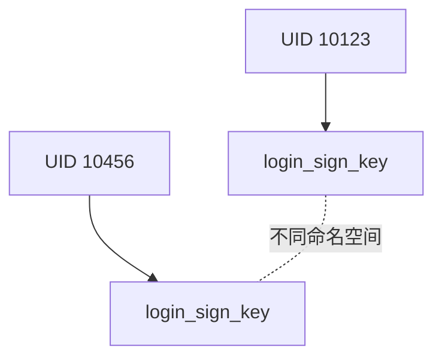
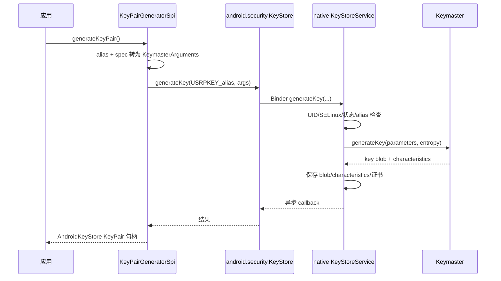
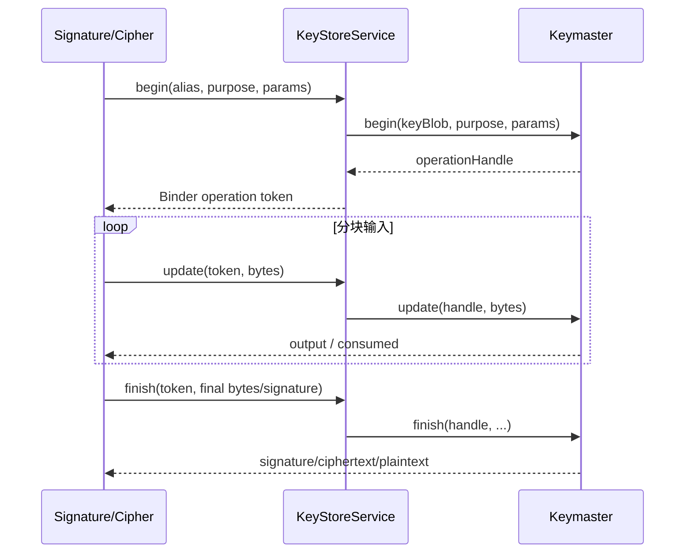

# 47 Android Keystore、KeyStoreService 与 Keymaster

> 源码版本：Android 11 / API 30 / `android-11.0.0_r48`  
> 学习方式：macOS 上只读源码，不要求编译。  
> 本章目标：理解“应用拿到一个 `PrivateKey` 对象”为什么不等于“应用拿到了私钥字节”，并能独立追踪密钥生成、保存、使用、认证和硬件执行链路。

---

## 1. 先用一句话理解 Android Keystore

Android Keystore 是一套**让应用按别名使用密钥，同时尽量阻止密钥材料离开安全边界**的系统。

应用通常只拿到三个东西：

1. alias，例如 `login_sign_key`；
2. Java 层的 `PrivateKey`/`SecretKey` 句柄对象；
3. 对密钥执行签名、解密等操作的权限。

应用通常拿不到私钥原文。真正的私钥可能以加密 key blob 形式存储，也可能只有 TEE 或 StrongBox 能解释和使用。

```text
“我能让系统用这把钥匙签名” ≠ “我能读取这把钥匙的私钥字节”
```

这是贯穿本章的第一条主线。

---

## 2. Android 11 的版本边界

本工程是 Android 11，因此源码主角是：

- Java Provider：`frameworks/base/keystore/java/android/security/keystore/`
- Java Binder 包装：`frameworks/base/keystore/java/android/security/KeyStore.java`
- native `keystore` 进程：`system/security/keystore/`
- Binder 接口：`IKeystoreService.aidl`
- Keymaster HIDL 3.0/4.0/4.1

不要把后续版本概念直接套进来：

| 版本语境 | 主要名称 |
|---|---|
| Android 11 本章 | keystore daemon、KeyStoreService、Keymaster HIDL |
| Android 12 以后 | Keystore 2.0、KeyMint、AIDL、Rust 服务实现逐步成为主线 |

二者目标相似，但接口、服务实现、数据库与权限模型已有明显变化。读当前工程时，应优先相信当前源码。

---

## 3. 先分清四个名字

### 3.1 `java.security.KeyStore`

它是 JCA/JCE 的通用门面。调用：

```java
java.security.KeyStore ks = java.security.KeyStore.getInstance("AndroidKeyStore");
ks.load(null);
```

这里的 `AndroidKeyStore` 是 Provider 类型名，不是磁盘文件路径。

### 3.2 `AndroidKeyStoreSpi`

它是 `java.security.KeyStoreSpi` 的 Android 实现，负责把 `getEntry()`、`containsAlias()`、`deleteEntry()` 等通用 API 翻译为 Android Keystore 调用。

### 3.3 `android.security.KeyStore`

这是 Framework 内部 Binder 客户端包装器。它通过 ServiceManager 找到：

```java
ServiceManager.getService("android.security.keystore")
```

然后调用 `IKeystoreService`。

### 3.4 native `KeyStoreService`

它运行在独立的 `keystore` 进程，负责：

- 检查调用者 UID、SELinux SID 和操作权限；
- 管理 alias、key blob、证书及 grant；
- 选择软件、TEE 或 StrongBox Keymaster；
- 管理密码学 operation；
- 处理用户认证 token。

### 3.5 Keymaster

Keymaster 是密码学硬件抽象接口及其实现。它负责生成/导入密钥、解析授权参数并执行密码学操作。


---

## 4. Keystore 解决了什么问题

如果应用把 AES 密钥直接写入 SharedPreferences，即使再 Base64 一次，攻击者只要获得应用数据就可能读走密钥。Keystore 尝试把问题改造成：

- 磁盘上保存的不是明文密钥，而是受保护的 blob；
- blob 与应用 UID、设备状态和授权参数绑定；
- 私钥运算尽可能在安全硬件内部完成；
- 每次使用都校验 purpose、算法、padding、digest、有效期及认证要求。

注意：Keystore 不会自动保护应用的所有业务数据。应用仍需要主动生成密钥，并用它加密业务数据。

---

## 5. 服务如何启动

入口文件：

```text
system/security/keystore/keystore.rc
system/security/keystore/keystore_main.cpp
```

rc 声明很直接：

```rc
service keystore /system/bin/keystore /data/misc/keystore
    class main
    user keystore
    group keystore drmrpc readproc log
```

这表示它不是 `system_server` 中的 Java SystemService，而是 init 启动的 native 进程。

`main()` 的关键步骤可压缩为：

```cpp
auto kmDevices = initializeKeymasters();
sp<KeyStore> keyStore(new KeyStore(kmDevices, minimalSecurityLevel));
keyStore->initialize();

sp<KeyStoreService> service = new KeyStoreService(keyStore);
service->setRequestingSid(true);
sm->addService(String16("android.security.keystore"), service);
IPCThreadState::self()->joinThreadPool();
```

阅读要点：

1. 先枚举 Keymaster 设备；
2. 创建内部 `KeyStore` 数据管理对象；
3. 注册 Binder 服务；
4. 主线程进入 Binder 线程池处理请求。

---

## 6. 为什么要枚举多个 Keymaster

Android 11 的 `initializeKeymasters()` 会寻找不同安全级别的实现：

| 安全级别 | 大致执行位置 | 特点 |
|---|---|---|
| SOFTWARE | 普通系统软件 | 兼容性强，隔离强度最低 |
| TRUSTED_ENVIRONMENT | TEE，例如 TrustZone | 与 Android OS 隔离，常见硬件支持 |
| STRONGBOX | 独立安全芯片/安全单元 | 隔离更强，但不是所有设备都有 |

源码先枚举 Keymaster 4，再在需要时兼容 Keymaster 3，并确保存在软件 fallback。

一个常见误解是“请求 StrongBox 后自动降级到 TEE”。应用显式调用 `setIsStrongBoxBacked(true)` 时，如果设备不可用，通常应收到 `StrongBoxUnavailableException`，由应用决定是否重新生成非 StrongBox 密钥。静默降级会违背调用者声明的安全目标。

---

## 7. alias 到底是什么

alias 是应用可读的逻辑名称，例如：

```text
login_sign_key
```

但系统内部还会加入用途前缀。非对称密钥常见条目包括：

```text
USRPKEY_login_sign_key   // 私钥或 Keymaster key blob
USRCERT_login_sign_key   // 用户证书
CACERT_login_sign_key    // CA 证书链
```

因此“一个 Java alias”可能对应多种内部条目。删除一个 KeyPair entry 时也要清理相应的私钥和证书记录。

---

## 8. alias 不是全局唯一：还要加 UID

Keystore 命名空间的核心不是只有 alias，而是近似：

```text
(目标 UID, 内部 alias)
```

两个不同 UID 的应用都可以创建 `login_sign_key`，默认互不冲突、互不可见。



Android 多用户下，应用 UID 本身已经编码 userId 与 appId，所以同一包在 user 0 和 user 10 通常也进入不同命名空间。

---

## 9. Java Provider 如何接入 JCA/JCE

入口：

```text
frameworks/base/keystore/java/android/security/keystore/AndroidKeyStoreProvider.java
```

Provider 注册的实现包括：

- `KeyStore.AndroidKeyStore`
- RSA/EC `KeyPairGenerator`
- AES/HMAC `KeyGenerator`
- `Cipher`
- `Signature`
- `Mac`
- `KeyFactory` / `SecretKeyFactory`

因此下面几组看似不同的 API，最后会进入同一套服务：

```java
KeyStore.getInstance("AndroidKeyStore");
KeyPairGenerator.getInstance("EC", "AndroidKeyStore");
KeyGenerator.getInstance("AES", "AndroidKeyStore");
Signature.getInstance("SHA256withECDSA");
Cipher.getInstance("AES/GCM/NoPadding");
```

是否最终使用 AndroidKeyStore 实现，还取决于传入的 Key 对象和 Provider 选择。

---

## 10. 密钥生成示例

```java
KeyPairGenerator generator = KeyPairGenerator.getInstance(
        KeyProperties.KEY_ALGORITHM_EC, "AndroidKeyStore");

KeyGenParameterSpec spec = new KeyGenParameterSpec.Builder(
        "login_sign_key",
        KeyProperties.PURPOSE_SIGN | KeyProperties.PURPOSE_VERIFY)
        .setDigests(KeyProperties.DIGEST_SHA256)
        .build();

generator.initialize(spec);
KeyPair pair = generator.generateKeyPair();
```

这里真正重要的不是曲线默认值，而是 `KeyGenParameterSpec` 描述了一份不可随意突破的授权契约。

---

## 11. `KeyGenParameterSpec` 如何变成 Keymaster 参数

Java SPI 会把参数转换成 tag 集合，例如：

| Java 配置 | Keymaster 参数含义 |
|---|---|
| `PURPOSE_SIGN` | `KM_TAG_PURPOSE = SIGN` |
| `DIGEST_SHA256` | `KM_TAG_DIGEST = SHA_2_256` |
| GCM | `KM_TAG_BLOCK_MODE = GCM` |
| `setUserAuthenticationRequired(true)` | 加入 SID、认证类型、超时等约束 |
| `setUnlockedDeviceRequired(true)` | `UNLOCKED_DEVICE_REQUIRED` |
| 无需认证 | `NO_AUTH_REQUIRED` |

这些参数不是普通提示。它们会进入 key characteristics，后续 `begin()` 时再次校验。

例如只允许签名的密钥，不能因为应用后来改传 `PURPOSE_DECRYPT` 就拿来解密。

---

## 12. 密钥生成完整链路



源码中 `AndroidKeyStoreKeyPairGeneratorSpi` 会构造内部私钥名：

```java
final String privateKeyAlias = Credentials.USER_PRIVATE_KEY + mEntryAlias;
int errorCode = mKeyStore.generateKey(
        privateKeyAlias, args, additionalEntropy,
        mEntryUid, flags, outKeyCharacteristics);
```

native `KeyStoreService::generateKey()` 的关键保护顺序是：

1. `getEffectiveUid(uid)` 确定目标命名空间；
2. 检查 Binder/SELinux 权限与 keystore 状态；
3. 检查系统专用 flag；
4. 根据 flag 选择安全级别；
5. 确保目标 alias 不已存在；
6. 交给相应 Keymaster 生成；
7. callback 返回 characteristics。

---

## 13. 为什么结果通过 callback 返回

`IKeystoreService.aidl` 中 `generateKey()` 同时有：

- Binder 方法的立即返回码；
- `IKeystoreKeyCharacteristicsCallback` 的最终结果。

原因是 Keymaster 操作可能在 worker 中异步完成。立即返回成功只表示“请求成功受理”，不一定表示密钥已经生成成功。

Java `android.security.KeyStore` 用 promise/callback 把它重新包装成调用者看到的同步式方法。这与前面章节的“请求已提交”和“业务已完成”必须分开理解。

---

## 14. key blob 是什么

Keymaster 返回的 key blob 是不透明字节序列。对 Framework 来说，它通常不能被解释成私钥明文。

可把它理解为：

```text
key blob = 安全实现能识别的密钥封装 + 授权绑定信息
```

TEE 实现可能用只有 TEE 掌握的密钥保护 blob。Android 文件系统即使保存了 blob，也不代表 Android 普通进程能还原私钥。

但不要过度承诺：安全程度取决于具体设备实现、安全级别、系统完整性、漏洞情况和密钥参数。

---

## 15. 私钥、秘密密钥与公钥的可导出性

通常：

- 私钥：不可导出，`getEncoded()` 常返回 `null`；
- AES/HMAC 秘密密钥：不可导出；
- 公钥：可以以 X.509 形式导出；
- 证书：可以读取，它本来就不是秘密。

所以 `KeyPair.getPrivate()` 返回对象不代表私钥字节已进入应用。该对象主要携带 alias、UID、算法等句柄信息。

---

## 16. 取出密钥时发生了什么

```java
PrivateKey key = (PrivateKey) keyStore.getKey("login_sign_key", null);
```

大体链路：

```text
java.security.KeyStore
  → AndroidKeyStoreSpi.engineGetKey
  → 根据内部 alias 查询 characteristics / public key
  → 构造 AndroidKeyStorePrivateKey
```

对象中不会复制真正的私钥材料。真正运算时才凭 alias 回到系统服务。

---

## 17. 签名不是一次 Binder 调用

```java
Signature signature = Signature.getInstance("SHA256withECDSA");
signature.initSign(privateKey);
signature.update(message);
byte[] result = signature.sign();
```

系统侧通常对应三阶段协议：

```text
begin → update（零次或多次）→ finish
```

若异常退出或主动取消，则调用 `abort`。



---

## 18. 两种 token 不要混淆

### 18.1 Operation token

`begin()` 后 Keystore 返回 Binder token，用于 `update()`、`finish()`、`abort()` 找回同一密码学操作。

### 18.2 Hardware Auth Token（HAT）

用户通过锁屏密码或生物识别认证后，由 GateKeeper/Biometric 体系产生的认证证明，包含 challenge、secure user ID、认证类型、时间戳和 MAC 等。

二者完全不同：

| 名称 | 证明什么 |
|---|---|
| operation token | 这是哪一个进行中的密码学操作 |
| Hardware Auth Token | 用户最近或针对本次操作完成了可信认证 |

---

## 19. `begin()` 为什么重要

`begin()` 不只是“分配句柄”，它会集中检查：

- alias 和 UID 是否能解析到密钥；
- purpose 是否被授权；
- digest、padding、block mode 是否允许；
- key 是否尚未生效或已经过期；
- 用户认证是否满足；
- 设备是否必须处于解锁状态；
- 并发 operation 资源是否足够。

很多 `InvalidKeyException`、`UserNotAuthenticatedException` 的根因都在这一步。

---

## 20. operation 的生命周期和 LRU

进行中的操作会占用 Keymaster/硬件资源。Keystore 维护 operation 记录，并通过 Binder token 与应用关联。

当资源不足时，可裁剪的旧 operation 可能被 LRU 回收。因此长时间初始化一个 Cipher 却迟迟不完成，可能导致后续操作失败。

正确习惯：

- 不再使用时及时完成或 abort；
- 不要跨很长生命周期缓存已初始化的 Cipher/Signature；
- 捕获失败后重新初始化，而不是复用已失效 operation。

---

## 21. 用户认证绑定：SID 是关键

认证绑定密钥不是简单保存“用户输入过密码”这个布尔值。关键标识是 Secure User ID（SID）。

生成密钥时，授权参数可包含：

- `USER_SECURE_ID`
- `USER_AUTH_TYPE`
- `AUTH_TIMEOUT`

使用时，Keystore/Keymaster 检查 HAT 中的 SID、认证类型、时间或 challenge 是否匹配。

如果用户重置安全锁屏，SID 可能改变，旧密钥可能永久失效。这正是 `KeyPermanentlyInvalidatedException` 背后的安全语义之一。

---

## 22. 两种认证模式

### 22.1 时间窗口认证

例如认证后 30 秒内可以多次使用：

```java
.setUserAuthenticationRequired(true)
.setUserAuthenticationValidityDurationSeconds(30)
```

系统检查最近的合格 HAT 是否仍在有效期内。

### 22.2 每次操作认证

有效期为每次操作语义时，认证通常绑定本次 operation challenge。常见流程是：

1. `Cipher.init()` / `Signature.initSign()` 创建 operation；
2. 得到需要认证的 crypto object；
3. 通过 BiometricPrompt 完成认证；
4. HAT 与 operation challenge 对应；
5. 继续 `doFinal()` / `sign()`。

不能把一个旧 HAT 任意拿给新 operation 使用。

---

## 23. GateKeeper、生物识别和 Keystore 如何接起来


`IKeystoreService` 暴露 `addAuthToken(byte[])`。Keystore 的 `AuthTokenTable` 负责保存和匹配 token。

不是应用随便构造一个 byte[] 就能伪造 HAT，因为可信 token 带有由安全环境共享密钥生成的 MAC。

---

## 24. hwEnforced 与 swEnforced

`KeyCharacteristics` 把授权大致分成：

- `hwEnforced`：由安全硬件/TEE 强制；
- `swEnforced`：由 Android 系统软件强制。

这不是说 `swEnforced` 毫无价值，而是攻击模型不同：Android OS 若被完全攻破，软件强制项更容易被绕过；硬件强制项仍由隔离环境裁决。

查看 `KeyInfo.isInsideSecureHardware()` 时，也应理解它是对密钥实现位置的概括，不等于整个应用链路都运行在硬件中。

---

## 25. TEE 与 StrongBox 的边界

### TEE

- 与普通 Android OS 隔离；
- 通常共享主 SoC 的 CPU/内存资源；
- 性能较好，普及度高。

### StrongBox

- 独立安全硬件；
- 通常有独立 CPU、安全存储、真随机数和防篡改能力；
- 支持的算法、密钥大小、并发量可能更有限；
- 操作可能更慢。

“更安全级别”不等于“所有业务都必须 StrongBox”。应根据威胁模型、兼容性与性能选择。

---

## 26. 加密静态存储与硬件保护不是一回事

容易混淆的三层：

1. **应用数据加密**：应用用 Keystore 密钥加密数据库字段；
2. **Keystore blob 的静态保护**：磁盘上的 key blob/条目如何加密；
3. **Keymaster 硬件隔离**：密钥运算是否在 TEE/StrongBox 中执行。

它们可以组合，但不是同一个概念。设备已解锁也不代表硬件私钥会被导出到应用进程。

---

## 27. 锁屏、开机解锁与密钥可用性

Android 11 旧 Keystore 仍有用户状态与 master key 相关逻辑。部分条目带 `FLAG_ENCRYPTED`，要求相应用户的 keystore 已解锁。

与此同时，Keymaster 的 `UNLOCKED_DEVICE_REQUIRED` 和用户认证授权又是另一层使用限制。

因此报“设备锁定/用户未认证”时要问清：

- 是 Keystore 用户存储未解锁？
- 是密钥要求设备当前为解锁状态？
- 是认证窗口过期？
- 是 SID 已改变导致永久失效？

---

## 28. 权限模型：三道边界

### 28.1 Linux UID 命名空间

默认只能访问自身 UID 下的 alias。

### 28.2 Binder + SELinux 权限

服务启用了：

```cpp
service->setRequestingSid(true);
```

因此可以取得调用者 SELinux SID。`has_permission()` 综合 UID/PID/SID 检查操作标签，例如 get、insert、delete、grant、add_auth。

### 28.3 密钥自身授权参数

即使有权找到 key blob，Keymaster 仍检查 purpose、算法和认证条件。

三道边界分别回答：

```text
你能访问哪个命名空间？
你能请求哪类服务操作？
这把密钥允许做什么？
```

---

## 29. grant 是什么

密钥所有者可以临时把某个 key 的使用权授予另一个 UID。Android 11 的 grant：

- 由 Keystore 内存中的 grant store 管理；
- 生成特殊 grant alias；
- keystore 进程退出后丢失；
- 可被显式撤销；
- 受让者不能继续转授第三方。

grant 不是复制密钥，也不会把私钥字节交给对方；它只是建立受控的 alias 间接解析关系。

---

## 30. 生成、导入、wrapped import 的区别

### 30.1 generateKey

让目标 Keymaster 在安全边界内生成密钥，最容易实现“密钥从未离开安全环境”。

### 30.2 importKey

应用把已有明文密钥材料交给 Keystore 导入。导入完成后可以不可导出，但密钥在导入前已经存在于调用方内存，因此安全历史不同。

### 30.3 importWrappedKey

导入被 wrapping key 加密封装的密钥，目标是让明文密钥尽量不经过 Android 普通世界。是否支持取决于硬件与 Keymaster 能力。

---

## 31. 远程密钥证明 Attestation

Attestation 用证书链证明某个公钥及其属性，例如：

- 密钥是否在安全硬件中生成；
- OS/version/patch level 等可信状态；
- challenge 是否来自服务器；
- 应用身份信息；
- 部分设备标识（受严格权限和支持条件限制）。

典型链路：

```text
服务端下发随机 challenge
→ App 生成带 challenge 的 key
→ Keymaster 产生 attestation certificate chain
→ App 上传公钥证书链
→ 服务端验证链、challenge 和扩展字段
```

challenge 必须由验证方生成并防重放。只在本机检查自己提供的固定 challenge，证明价值很有限。

---

## 32. 证书为什么会与 KeyPair 一起出现

Java 的 `KeyStore.PrivateKeyEntry` 约定私钥通常关联证书链。若没有正式 attestation 或 CA 签发证书，Framework 可能为生成的公钥构造自签名证书，方便 JCA API 表达 KeyPair entry。

证书公开并不泄露私钥。它主要包含公钥、主体、签发者、有效期、签名及扩展。

---

## 33. AES/GCM 使用时必须额外注意什么

```java
Cipher cipher = Cipher.getInstance("AES/GCM/NoPadding");
cipher.init(Cipher.ENCRYPT_MODE, key);
byte[] iv = cipher.getIV();
byte[] ciphertext = cipher.doFinal(plaintext);
```

关键点：

- 同一 AES-GCM key 下不能重复使用相同 IV；
- IV 通常不需要保密，应与密文一起保存；
- GCM tag 用于完整性校验；
- 解密失败不能简单当作“密码不对”，也可能是密文、IV、AAD 或 tag 被修改；
- 不要把 alias 当成 IV。

Keystore 保护的是 key，应用仍负责正确保存 IV、密文版本、AAD 和业务元数据。

---

## 34. 服务崩溃和应用死亡时怎样清理

operation token 是 Binder 对象，能够关联调用进程生命周期。应用死亡或 token 失效时，服务应取消相关 operation，释放 Keymaster 资源。

Keystore 自身重启后：

- 持久化 key blob 仍可能存在；
- 内存 grant 消失；
- 进行中的 operation 消失；
- 旧 operation token 不能继续使用；
- 应用需要重新 `init()`。

---

## 35. 错误不是同一层产生的

| 表现 | 可能层级 |
|---|---|
| alias 不存在 | SPI 命名转换、UID 命名空间、条目被删除 |
| `StrongBoxUnavailableException` | 请求的 StrongBox 不存在或不支持 |
| `UserNotAuthenticatedException` | HAT 缺失、超时、类型/challenge 不匹配 |
| `KeyPermanentlyInvalidatedException` | SID/生物识别绑定发生安全性变化 |
| padding/digest 不允许 | Keymaster authorization 与操作参数冲突 |
| `KeyStoreConnectException` | Binder 服务不可用或通信失败 |
| `AEADBadTagException` | GCM 数据、IV、AAD、tag 或 key 不匹配 |

排障时先定位错误发生在 generate、load、begin、update 还是 finish，范围会迅速缩小。

---

## 36. 一条实用排障路线

### 第一步：确认 alias 与 UID

- alias 是否拼写一致？
- 是否发生应用重装、签名/UID 改变、多用户切换？
- 是否使用了 work profile？

### 第二步：确认生成参数

- purpose 是否覆盖实际操作？
- digest/padding/block mode 是否匹配？
- 是否要求 StrongBox？
- 是否绑定用户认证？

### 第三步：确认失败阶段

```text
generate / import
load key
begin / init
update
finish / doFinal / sign
```

### 第四步：确认安全状态变化

- 用户是否修改或移除锁屏凭据？
- 生物识别是否重新注册？
- 是否刚重启且用户尚未首次解锁？
- 认证有效期是否已过？

### 第五步：再看日志和源码返回码

Android 11 可围绕 `keystore`、`KeyStore`、Keymaster HAL 日志判断错误来自哪一层。阅读源码时从 Java 异常反向找到 `getInvalidKeyException()` 等错误码转换逻辑。

---

## 37. 源码阅读地图

### Java/JCA 层

```text
frameworks/base/keystore/java/android/security/keystore/AndroidKeyStoreProvider.java
frameworks/base/keystore/java/android/security/keystore/AndroidKeyStoreSpi.java
frameworks/base/keystore/java/android/security/keystore/AndroidKeyStoreKeyPairGeneratorSpi.java
frameworks/base/keystore/java/android/security/keystore/AndroidKeyStoreKeyGeneratorSpi.java
frameworks/base/keystore/java/android/security/keystore/AndroidKeyStoreCipherSpiBase.java
frameworks/base/keystore/java/android/security/keystore/AndroidKeyStoreSignatureSpiBase.java
frameworks/base/keystore/java/android/security/keystore/KeyGenParameterSpec.java
frameworks/base/keystore/java/android/security/keystore/KeymasterUtils.java
frameworks/base/keystore/java/android/security/KeyStore.java
```

### Binder/native 服务

```text
system/security/keystore/binder/android/security/keystore/IKeystoreService.aidl
system/security/keystore/keystore_main.cpp
system/security/keystore/key_store_service.cpp
system/security/keystore/KeyStore.cpp
system/security/keystore/keymaster_worker.cpp
system/security/keystore/operation.cpp
system/security/keystore/auth_token_table.cpp
system/security/keystore/permissions.cpp
system/security/keystore/grant_store.cpp
system/security/keystore/user_state.cpp
```

### HAL

```text
hardware/interfaces/keymaster/4.0/IKeymasterDevice.hal
hardware/interfaces/keymaster/4.0/types.hal
hardware/interfaces/keymaster/4.1/IKeymasterDevice.hal
hardware/interfaces/keymaster/4.1/support/
```

---

## 38. 推荐的实际阅读顺序

不要一开始逐行啃 `key_store_service.cpp`。按以下顺序更容易建立模型：

1. `keystore.rc`：确认进程身份；
2. `keystore_main.cpp`：确认设备枚举和服务注册；
3. `AndroidKeyStoreProvider.java`：确认 JCA 注册关系；
4. `AndroidKeyStoreKeyPairGeneratorSpi.generateKeyPair()`：追生成入口；
5. `android.security.KeyStore.generateKey()`：看 Binder 包装；
6. `IKeystoreService.aidl`：看服务能力全貌；
7. `KeyStoreService::generateKey()`：看权限、UID 和设备选择；
8. `IKeymasterDevice.hal`：看 HAL 契约；
9. `AndroidKeyStoreCipherSpiBase`：追 begin/update/finish；
10. `auth_token_table.cpp`：理解用户认证匹配。

---

## 39. 八组只读练习

### 练习一：证明 Keystore 是独立 native 进程

找出 rc、可执行文件、Binder 服务名和 `joinThreadPool()`。

### 练习二：追 EC 密钥生成

从 `KeyPairGenerator.getInstance()` 追到 native `generateKey()`，记录每层类名和参数变化。

### 练习三：画 alias 变换表

以 `demo` 为例，记录 Java alias、`USRPKEY_`、证书 alias 和 UID 命名空间。

### 练习四：追一次签名

从 `Signature.initSign/update/sign` 找到 begin/update/finish，并标出 operation token。

### 练习五：追认证参数

从 `setUserAuthenticationRequired(true)` 追到 `KeymasterUtils.addUserAuthArgs()`，列出生成的 tags。

### 练习六：区分软硬件授权

找到 `KeyCharacteristics` 的 `hwEnforced` 与 `swEnforced`，说明为何二者威胁模型不同。

### 练习七：追 StrongBox 失败

找到 Java flag、native `flagsToSecurityLevel()`、设备为空的错误码和最终 Java 异常。

### 练习八：追权限拒绝

从 `KeyStoreService::generateKey()` 的 `checkBinderPermissionAndKeystoreState()` 追到 UID/SID 权限检查。

---

## 40. 初学者最容易混淆的十件事

1. AndroidKeyStore 不是普通 `.jks` 文件。
2. Java `PrivateKey` 对象可能只是系统密钥句柄。
3. alias 还要与 UID 组合才能唯一定位。
4. 能读取公钥/证书不等于能读取私钥。
5. TEE 与 StrongBox 不是同一个安全级别。
6. 明文导入后的不可导出，不等于密钥从未出现在普通内存。
7. operation token 不是 Hardware Auth Token。
8. `begin()` 成功才表示本次 purpose/参数/认证被接受。
9. Provider 返回的同步结果，底层可能由异步 callback 完成。
10. Keystore 保护 key，不会替应用自动设计安全的数据加密格式。

---

## 41. 本章心智模型

遇到任何 Keystore 问题，按五层思考：

```text
JCA API：应用请求什么算法与操作？
Provider/SPI：alias 和 spec 被翻译成什么？
Keystore 服务：哪个 UID、哪项权限、哪个 operation？
Keymaster：哪些授权参数被硬件或软件强制？
安全环境：密钥在哪里生成、保存和执行？
```

再按三条线并行追踪：

- **身份线**：package → UID → SELinux SID → alias namespace；
- **授权线**：KeyGenParameterSpec → Keymaster tags → characteristics → begin 校验；
- **数据线**：输入 → begin/update/finish → 安全环境 → 输出。

---

## 42. 本章总结

Android 11 Keystore 的核心不是“一个保存密码的容器”，而是一个跨越 Java Provider、Binder 服务、权限系统、Keymaster HAL 和安全硬件的密钥使用系统。

完整主链可以概括为：

```text
应用通过 AndroidKeyStore Provider 声明 alias 与授权参数
→ Java SPI 转成 Keymaster tags
→ android.security.KeyStore 发起 Binder 请求
→ native KeyStoreService 检查 UID、SELinux、状态和权限
→ 选择 SOFTWARE / TEE / StrongBox Keymaster
→ Keymaster 生成或导入不透明 key blob
→ 使用时通过 begin/update/finish 执行运算
→ 用户认证密钥再由 SID、HAT、时间或 challenge 约束
```

真正应该记住的是：**应用持有的是受 UID 和授权参数约束的“使用能力”，而不是必然可读取的密钥原文。**

---

## 43. 下一章预告

下一章进入 Android 锁屏认证体系：

> **第 48 章：LockSettingsService、GateKeeper、Synthetic Password 与用户解锁**

它会进一步解释本章留下的问题：SID 从哪里来、锁屏凭据如何验证、Synthetic Password 如何连接 FBE 与 Keystore，以及首次解锁为什么会同时打开多条安全链路。
