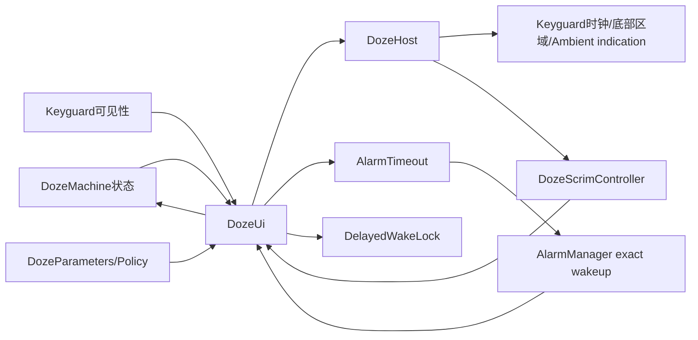
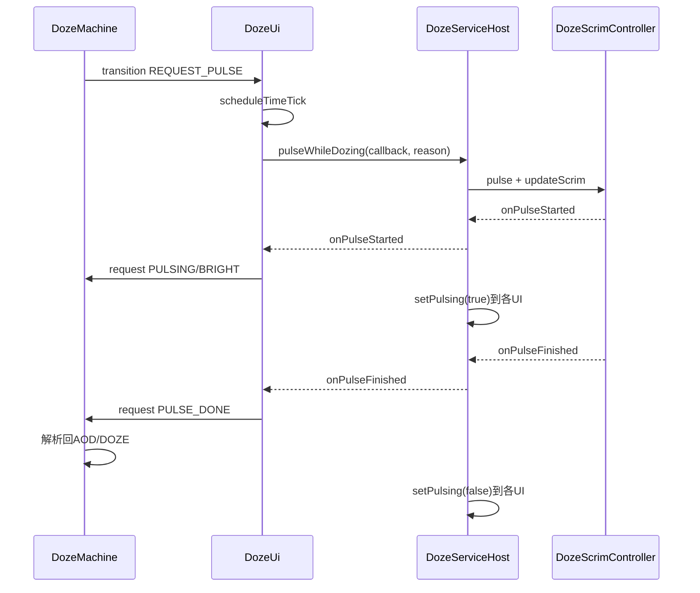
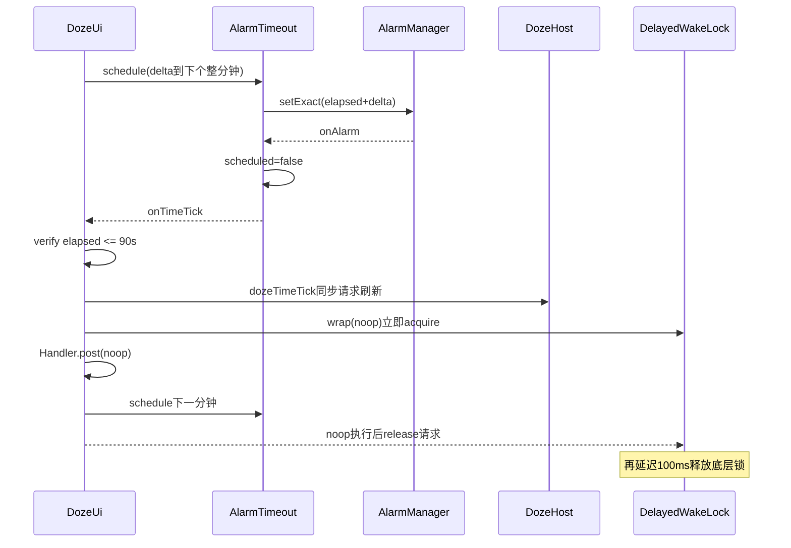

# 第 470 章 Android SystemUI DozeUi、AlwaysOnDisplayPolicy 与 AlarmTimeout：AOD Time Tick、Pulse、动画和 WakeLock 链

> 源码基线：Android 11 / API 30 / `android-11.0.0_r48`。本章只在 macOS 阅读，不实际编译。核心文件：`DozeUi.java`、`AlwaysOnDisplayPolicy.java`、`AlarmTimeout.java`；交叉阅读 `DozeFactory.java`、`DozeServiceHost.java`、`DozeParameters.java`、`WakeLock.java`、`DelayedWakeLock.java`、`KeyguardUpdateMonitor.java`、`KeyguardStatusView.java` 和本地测试。

## 1. 本章解决什么问题

AOD 的时钟为什么要自己安排每分钟唤醒，而不是依赖普通广播？进入 AOD 时为何立即刷新一次、500ms 后又刷新一次？Pulse 的 started/finished 怎样推动 DozeMachine？屏幕开关动画由谁决定？AOD 策略字符串和通用 AlarmTimeout 又提供了什么保证？

## 2. 一句话主线

`DozeUi` 把 Machine 状态投影成 Host 的 dozing、pulse、time tick 和动画开关；`AlarmTimeout` 用一个 scheduled 标志包装精确唤醒 Alarm；`AlwaysOnDisplayPolicy` 把 Global 字符串解析成暂停、近距冷却、壁纸和亮度参数。正常路径简洁，真正需要审计的是时钟基准、延迟任务生命周期、callback 配对和单 boolean 代际。

## 3. DozeUi不是View

名字里有 Ui，但它不直接 inflate、measure 或 draw。它是 `DozeMachine.Part`，向 `DozeHost` 发“开始/停止 dozing、刷新时间、开始 Pulse、动画是否开启”等命令，具体 View 与 Scrim 在 StatusBar 侧执行。

## 4. Time tick不是ACTION_TIME_TICK

本类没有注册 `Intent.ACTION_TIME_TICK`。AOD 状态下普通进程/广播时序不足以承担低功耗精确刷新，所以它自己算下一个整分钟，并用 `ELAPSED_REALTIME_WAKEUP` exact Alarm 唤醒 SystemUI。

## 5. 三个对象的边界

DozeUi 决定何时 schedule/cancel 和如何响应；AlarmTimeout 只负责一次 Alarm 的排他、取消与迟到过滤；Policy 不调 Alarm，只提供各消费者读取的参数。分钟 tick 的周期固定在 DozeUi，不来自 Policy。

## 6. Factory注入同一个延迟WakeLock

DozeFactory 给 Machine、Triggers、Ui 和 ScreenState 共享同一个 `DelayedWakeLock`。不同 reason 可以并行计数；release 还会延后 100ms，为 framebuffer 更新留余量。

## 7. 线程模型

Factory 注入 SystemUI Handler，AlarmTimeout 让 AlarmManager 把 callback 投递到这个 Handler；Machine 转换、Host 调用和时间刷新通常在主线程。`KeyguardUpdateMonitor.registerCallback()` 也强制主线程，构造 DozeUi 的线程前提非常明确。

## 8. 三套时间基准

目标“下个整分钟”用 `System.currentTimeMillis()` 与 `Calendar`；Alarm 的触发点用 `SystemClock.elapsedRealtime()` 加 delta；遗漏检测也用 elapsedRealtime。墙上时间负责对齐显示分钟，单调时钟负责等待与测延迟。

## 9. DozeUi持有的关键状态

本地只有 `mKeyguardShowing`、构造时的 `mCanAnimateTransition`、`mLastTimeTickElapsed` 和 AlarmTimeout 内部 scheduled。Machine state 不缓存，pulse reason 临时读取，Host 的 dozing/pulsing/animation 又是另一套投影状态。

## 10. 总体结构图



## 11. 构造函数做四件事

保存协作者；以 `!getDisplayNeedsBlanking()` 形成可动画能力快照；创建 tag 为 `doze_time_tick` 的 AlarmTimeout；向 KeyguardUpdateMonitor 注册可见性 callback。它不在构造时直接 start dozing 或 schedule tick。

## 12. Keyguard注册会立即回放

KeyguardUpdateMonitor 在加入 WeakReference 后调用 `sendUpdates(callback)`，其中通过 raw 可见性入口通知当前值。因此 `mKeyguardShowing` 与 screen-off 动画通常会在构造时获得初始快照，而不是一定等下次锁屏变化。

## 13. Raw callback还有500ms折叠

`onKeyguardVisibilityChangedRaw` 若 showing 与上次相同且距上次不足 500ms，会跳过具体 callback。DozeUi 只覆盖非 raw 方法，但初始和后续事件会先经过该折叠层。

## 14. Callback没有显式remove

DozeUi 未实现 destroy，也不调用 `removeCallback`。不过 KeyguardUpdateMonitor 保存的是 WeakReference，Machine/DozeUi 不再被引用后 callback 可被 GC，因此不能简单断言永久强引用泄漏；可确认的是列表清理依赖弱引用回收和后续清扫，而非对称注销。

## 15. mCanAnimateTransition是构造快照

它只读取一次 `getDisplayNeedsBlanking()`。该值主要由资源和 debug system property 决定，通常稳定；如果测试/运行环境动态改变依赖，本实例不会重算 capability。

## 16. Screen-off动画的四道门

只有设备无需 blanking，才进一步要求 Always-On 为开、Keyguard showing、AOD Power Save 为 false；四者都满足才由 SystemUI 接管 screen-off 动画。

## 17. 为什么Keyguard必须可见

锁屏不可见时由 PowerManager 处理 screen off，SystemUI 不应为不存在的 Keyguard/AOD 画过渡。`mKeyguardShowing` 是视觉前提，不是设备 interactive 状态。

## 18. Power Save在这里是读取门

`mHost.isPowerSaveActive()` 最终读取 `BatteryController.isAodPowerSave()`。省电开启时 `controlScreenOff=false`，避免为将被抑制的 AOD 接管较长动画。

## 19. 但DozeUi不监听Power Save

`updateAnimateScreenOff()` 只由 Keyguard 可见性 callback 调用；DozeTriggers 虽监听 Host power-save callback并切 Machine 状态，却不会直接调用本方法。因此 power-save 单独变化时，screen-off animation flag 的及时刷新依赖是否伴随其他可见性/流程更新，DozeUi 自身没有专门入口。

## 20. 一个决定写到两个出口

它既调用 `DozeParameters.setControlScreenOffAnimation(control)`，又调用 `DozeHost.setAnimateScreenOff(control)`。前者影响 PowerManager 的 doze-after-screen-off 与 ScreenState/Wallpaper 决策，后者影响 StatusBar 视觉动画。

## 21. DozeParameters还反向通知PowerManager

`setControlScreenOffAnimation(true)` 会调用 `PowerManager.setDozeAfterScreenOff(false)`，表示 SystemUI 接管过渡，不能让 PowerManager 立刻进入 Doze；false 则设置为 true。这个布尔名与下发值正好取反。

## 22. 不支持动画时为何完全不写Host

若 display needs blanking，`updateAnimateScreenOff()` 外层直接跳过，连 `setAnimateScreenOff(false)` 都不调用。它依赖 Host 默认/先前状态正确；单测也明确验证“从不调用”，而不是“每次强写 false”。

## 23. screen-off与wakeup动画不是同一开关

`setAnimateScreenOff` 控制进入 AOD/熄屏；`setAnimateWakeup` 控制从 Doze 唤醒。两者的门不同：Pulse 全程强制 wakeup 动画为 true，普通状态才看 capability 与 Always-On。

## 24. Pulse状态统一开wakeup动画

REQUEST_PULSE、PULSING、PULSING_BRIGHT、PULSE_DONE 都向 Host 写 true，确保 Pulse 期间突然唤醒能有一致过渡。reason 不影响这个动画开关。

## 25. FINISH故意保持旧值

`updateAnimateWakeup(FINISH)` 不调用 Host，注释写 Keep current state。退出 Doze 时最后一次选择仍供正在发生的 wakeup 过渡使用，不能在 FINISH 一律清 false。

## 26. 普通状态的wakeup规则

其他状态写 `mCanAnimateTransition && getAlwaysOn()`。所以 DOZE 状态也可能设置 true：它表达“若接下来唤醒是否可动画”，不是“当前是否正在显示 AOD”。

## 27. Host可能拒绝太晚的修改

DozeServiceHost 在 wakefulness 已 AWAKE 或 WAKING 时直接 return。DozeUi 调过 setter 不等于 Host 字段必更新；修改必须发生在唤醒开始前。

## 28. 动画决策源码

```java
private void updateAnimateScreenOff() {
    if (mCanAnimateTransition) {
        final boolean controlScreenOff = mDozeParameters.getAlwaysOn() && mKeyguardShowing
                && !mHost.isPowerSaveActive();
        mDozeParameters.setControlScreenOffAnimation(controlScreenOff);
        mHost.setAnimateScreenOff(controlScreenOff);
    }
}

private void updateAnimateWakeup(DozeMachine.State state) {
    switch (state) {
        case DOZE_REQUEST_PULSE:
        case DOZE_PULSING:
        case DOZE_PULSING_BRIGHT:
        case DOZE_PULSE_DONE:
            mHost.setAnimateWakeup(true);
            break;
        case FINISH:
            break;
        default:
            mHost.setAnimateWakeup(mCanAnimateTransition
                    && mDozeParameters.getAlwaysOn());
            break;
    }
}
```

前者由可见性事件驱动，后者每次 Machine transition 结束都调用。

## 29. INITIALIZED启动Host dozing

进入 INITIALIZED 调 `mHost.startDozing()`。Host 把 `mDozingRequested=true`，结合 StatusBarState 与 biometric mode 计算 StatusBarStateController 的 isDozing，并更新 Keyguard 状态。

## 30. FINISH停止Host dozing

进入 FINISH 调 `stopDozing()` 并 unschedule tick。Host 清 `mDozingRequested` 后重新计算 isDozing；但 wake-and-unlock-pulsing 模式可暂时让 dozing 继续，直到解锁完成。

## 31. Host的dozing不是请求值直拷贝

表达式本质是“requested 且 StatusBar 在 KEYGUARD，或者 biometric 模式为 WAKE_AND_UNLOCK_PULSING”；普通 WAKE_AND_UNLOCK 又强制 false。排查时应区分 `mDozingRequested` 与 StatusBarStateController 实际 isDozing。

## 32. REQUEST_PULSE同时做两件事

DozeUi 先确保分钟 tick 已安排，再读 `mMachine.getPulseReason()` 调 `pulseWhileDozing`。REQUEST 状态本身由 Machine 状态 WakeLock 保护，直到 started/finished 或其他状态把它收口。

## 33. Pulse reason决定BRIGHT分支

只有 `PULSE_REASON_SENSOR_WAKE_LOCK_SCREEN` 在 `onPulseStarted` 请求 `DOZE_PULSING_BRIGHT`；其他正常 reason 请求 `DOZE_PULSING`。BRIGHT 允许更直接露出亮壁纸/认证视觉。

## 34. Host的long-press是特殊出口

若 reason 为 long press，Host 直接 `PowerManager.wakeUp()` 并启动 Assist，然后 return，不调用传入的 PulseCallback。Machine 因而不会由 DozeUi 收到 started/finished，而是依赖整机唤醒让 Dream/Doze 进入 FINISH。

## 35. long-press失败时的收口依赖

代码没有为 wakeUp/Assist 路径设置本地 timeout 或 fallback state。静态源码可确认 callback 不配对；是否会实际卡在 REQUEST 取决于唤醒/Dream 生命周期是否可靠完成，需运行时验证。

## 36. wake-lock-screen还启动被动认证

Host 先把 ScrimController 的 wake-lock-screen sensor active 设 true，并在配置允许时用 pulsing true/false 通知 KeyguardUpdateMonitor auth interrupt。finished 时才清 sensor active 与各消费者 pulsing。

## 37. onPulseStarted推动Machine

Scrim 黑帧准备好后 Host 回调 DozeUi；DozeUi 请求 PULSING 或 PULSING_BRIGHT。Machine 校验要求 PULSING 必须来自 REQUEST，保证“视觉已准备”与主状态一致。

## 38. IllegalStateException被吞掉

started 期间若 Pulse 已被异步取消，Machine 请求可能因非法状态抛异常；DozeUi catch 后不记录日志、不补 finished、不改状态。注释认为这是压力场景下可忽略的取消竞态。

## 39. Host仍会把pulsing设true

DozeServiceHost 的包装 callback 先调用 DozeUi `onPulseStarted()`，返回后不关心是否 catch 了异常，仍向多个 UI/Keyguard 组件 `setPulsing(true)`。因此非法 started 被吞时，Host 视觉投影可能短时显示 pulsing 而 Machine 并未进入 PULSING。

## 40. onPulseFinished不捕获异常

finished 直接请求 `DOZE_PULSE_DONE`。Machine 的 transitionPolicy 会在已经回到 DOZE/AOD/PAUSING/PAUSED/DOCKED 时丢弃迟到 pulse-done；若调用线程或其他前提错误，DozeUi 没有本地 catch。

## 41. Host finished的清理顺序

Host 先 `mPulsing=false`，再调用 DozeUi finished 推 Machine，然后更新触摸、清 wake-lock-screen active，并向多个消费者 setPulsing(false)。Machine Parts 的转换可发生在 UI 消费者清理之前，存在可观察的短暂顺序差。

## 42. Pulse时序图



## 43. 哪些状态保持分钟tick

DOZE_AOD、DOZE_AOD_DOCKED、DOZE_AOD_PAUSING 和 DOZE_REQUEST_PULSE 都 schedule。PULSING/BRIGHT/PULSE_DONE 没有显式操作，继承 REQUEST 时已经存在的 Alarm，直到后续稳定状态处理。

## 44. 为什么PAUSING仍刷新

PAUSING 屏幕仍是 DOZE_SUSPEND，默认还会显示 AOD，十秒后才可能 PAUSED，所以分钟时钟继续更新。PAUSED 真正黑屏后才 unschedule。

## 45. DOZE和PAUSED取消tick

两者屏幕投影为 OFF，没有必要每分钟唤醒刷新不可见 View。unschedule 前先验证距上次 schedule 是否超过 90 秒，以便记录已错过的 tick。

## 46. AOD_DOCKED也要tick

Docked 状态屏幕为 ON 并展示 Dock/AOD UI，仍需时钟与 burn-in 位置更新。它虽 `staysAwake=true`，分钟对齐逻辑仍复用同一个 AlarmTimeout。

## 47. 从DOZE/PAUSED打开AOD先推一帧

显示 buffer 可能为空，进入 AOD 或 Docked 且 old 为 DOZE/PAUSED 时立即 `dozeTimeTick()`，让时钟、Slice、底部 burn-in 等内容先刷新。

## 48. 500ms后再推第二帧

注释说明首帧可能在 display 尚未 ready 时到达，所以另 postDelayed 500ms 再 tick。它不是下一分钟 Alarm，也不更新 missed-tick 记账。

## 49. WakeLock在包装时立即acquire

`WakeLock.wrapImpl()` 先执行 acquire，再返回含 try/finally release 的 Runnable。因此 500ms 任务从 `postDelayed` 前就持锁，不是等 500ms 后开始持；这保证等待期间 CPU 不睡。

## 50. DelayedWakeLock再延后100ms释放

Runnable 执行 finally 调 `DelayedWakeLock.release()`，后者又 postDelayed 100ms 才释放底层锁。正常第二帧路径锁窗口约为 500ms + Handler 排队 + 100ms，而非只覆盖一次函数调用。

## 51. 500ms任务没有被取消

DozeUi 没保存 Runnable，也不在 DOZE、PAUSED 或 FINISH removeCallbacks。若打开 AOD 后很快退出，旧第二帧仍会调用 Host 并最终释放锁；它可能在非 Doze 状态刷新 UI，但不会永久持锁，除非 Handler 不再处理任务且底层20秒超时兜底才释放。

## 52. transitionTo核心源码

```java
switch (newState) {
    case DOZE_AOD:
    case DOZE_AOD_DOCKED:
        if (oldState == DOZE_AOD_PAUSED || oldState == DOZE) {
            mHost.dozeTimeTick();
            mHandler.postDelayed(mWakeLock.wrap(mHost::dozeTimeTick), 500);
        }
        scheduleTimeTick();
        break;
    case DOZE_AOD_PAUSING:
        scheduleTimeTick();
        break;
    case DOZE:
    case DOZE_AOD_PAUSED:
        unscheduleTimeTick();
        break;
    case DOZE_REQUEST_PULSE:
        scheduleTimeTick();
        pulseWhileDozing(mMachine.getPulseReason());
        break;
    case INITIALIZED:
        mHost.startDozing();
        break;
    case FINISH:
        mHost.stopDozing();
        unscheduleTimeTick();
        break;
}
```

switch 后无论何态都调用 wakeup animation 更新，这与 tick/pulse 分支相互独立。

## 53. roundToNextMinute怎样取整

用默认时区 Calendar 装入 wall time，把毫秒和秒清零，再加一分钟。12:34:00.000 也会得到 12:35:00.000，不会安排在“当前这个已到达的整分钟”。

## 54. delta调用了两次currentTimeMillis

先保存 `time`，再用 `roundToNextMinute(time) - System.currentTimeMillis()`。第二次读取通常只晚几毫秒；若恰好跨过目标分钟，delta 可成为很小的负数，使 Alarm 近乎立即触发，下一轮再对齐。

## 55. 墙上时间只用于计算差值

AlarmTimeout 接收 delta 后以 `elapsedRealtime()+delta` 设置 `ELAPSED_REALTIME_WAKEUP`。因此等待不怕设备睡眠，也不因 elapsed clock 回拨，但它不是 RTC 类型 Alarm。

## 56. 改系统时间后的一个窗口

Alarm 已 schedule 后若用户/NTP大幅校正墙上时间，elapsed deadline 不会随新 wall clock 重算；本类也没有 TIME_SET receiver。下次旧 Alarm 到达时先刷新一次，再按新 wall time 对齐后续分钟，因此中间可能有提前/延后的 tick。单纯时区切换通常不改变 epoch 的分钟相位，但本类同样不会因此主动立刻刷新显示，时区内容更新依赖锁屏时钟的其他通知链。

## 57. schedule有本地幂等门

若 `mTimeTicker.isScheduled()` 为 true，直接 return，不重算分钟、不更新日志和 `mLastTimeTickElapsed`。多个保持 tick 的状态转换不会不断推迟 deadline。

## 58. Alarm使用exact wakeup

AlarmTimeout 调 `setExact(ELAPSED_REALTIME_WAKEUP, trigger, tag, listener, handler)`。它不是 allow-while-idle API；这里运行的是 SystemUI Doze 显示链，与第三方 App 的后台闹钟限制语境不同。

## 59. schedule日志记录两种时间

DozeLog 的 `traceTimeTickScheduled(time,time+delta)` 记录 wall clock 计划；AlarmManager 实际参数是 elapsed trigger。排查时要先确认日志字段的时基，不能拿 wall 数字直接与 elapsed dump 相减。

## 60. lastTick在schedule成功后更新

代码无论 `scheduled` boolean 是否 true，都会写 `mLastTimeTickElapsed`；不过外层已先检查未 scheduled，正常 AlarmTimeout schedule 应返回 true。字段更准确地说是“本轮 schedule 时刻”，不是每次 Host 刷新的时刻。

## 61. schedule源码

逐行读法是：先以 `isScheduled()` 拦截重复请求；保存第一次 wall time；用 `roundToNextMinute(time)` 减第二次 wall time 得到 delta；以 `MODE_IGNORE_IF_SCHEDULED` 注册；成功才写 scheduled 日志；最后把当前 elapsedRealtime 记为本轮遗漏检测基准。由于 AlarmTimeout 的 MODE 与外层检查双重防重，正常调用不会重排现有 tick。

## 62. AlarmTimeout的三个模式

CRASH 在已安排时抛异常；IGNORE 返回 false并保留旧 Alarm；RESCHEDULE 先 cancel 再设置新 Alarm。DozeUi 与 DozePauser 均使用 IGNORE。

## 63. scheduled何时变true

它先调用 AlarmManager.setExact，再写 `mScheduled=true`。setExact 是同步注册调用；若调用直接抛异常，标志不会误写。它不捕获 SecurityException/RuntimeException。

## 64. onAlarm先清标志

收到 Alarm 时若 scheduled 为 false，认定是已 cancel 的迟到 callback并忽略；若 true，先设 false，再调用业务 listener。这样 DozeUi 的 onTimeTick 内可立即 schedule 下一轮，不会被 IGNORE 拦截。

## 65. cancel是幂等的

只有 scheduled 为 true 才调用 AlarmManager.cancel 并清标志，重复 cancel 无操作。unscheduleTimeTick 也先看 isScheduled，所以不会在从未安排时做 missed-tick 检查。

## 66. 单标志不能区分两代Alarm

如果旧 callback 已排入 Handler，随后 cancel 并 reschedule 同一个 listener，使 scheduled 再变 true，旧 callback 看不出自己属于前一代。DozeUi 正常分钟循环较少主动 cancel+快速 reschedule，但 PAUSED→AOD、时间/状态抖动仍值得 generation 测试。

## 67. AlarmTimeout没有自己的WakeLock

它依赖 WAKEUP Alarm 触发与 Handler 投递语义，类内不 acquire PowerManager WakeLock。DozeUi 在业务 tick 后额外 post wrapped noop，专门把 CPU 生命周期延伸到主队列后续位置。

## 68. Missed tick阈值是严格大于90秒

`millisSinceLastTick > 90_000` 才记录；恰好 90秒不报。正常一分钟 Alarm 加调度抖动应低于阈值，额外 30秒容忍系统繁忙。

## 69. verify比较的是schedule时刻

变量名叫 last time tick，但初始化/更新发生在 schedule。每次 Alarm callback 结尾立即 schedule，因而通常近似上一 tick 时刻；立即帧和 500ms 帧不会更新它。

## 70. 首轮也能检测遗漏

进入 AOD schedule 后如果 Alarm 超过90秒才回调，onTimeTick 开头就会报 missed；无需先成功执行过一轮 tick。

## 71. unschedule也会触发诊断

若准备离开 AOD 时发现当前 Alarm 已等待超过90秒，先记录 missed 再 cancel。这样即使迟到 Alarm 永远没回调，退出状态仍留下证据。

## 72. elapsedRealtime避免深睡误判

elapsedRealtime 包含设备 suspend 时间，所以 AOD 等待一分钟后即使 CPU 睡着，差值仍是实际经过时间。若用 uptimeMillis，深睡时间不计，会掩盖 Alarm 迟到。

## 73. onTimeTick的执行顺序

先 verify；再同步调用 Host 刷时钟/布局；再 acquire WakeLock 并 post 空任务；最后 schedule 下一分钟。若 Host 调用抛异常，后两步不会执行，Alarm scheduled 已被 AlarmTimeout 清 false，周期链会中断。

## 74. Host具体刷新哪些消费者

DozeServiceHost 调 NotificationPanel 的 tick，并在 AmbientIndicationContainer 实现 DozeReceiver 时也调用。Panel 再刷新 BottomArea、KeyguardStatusView，并在 dark amount 大于 0 时重排时钟与通知。

## 75. 时钟之外还更新burn-in

KeyguardStatusView 刷时间和 KeyguardSlice；BottomArea 重新计算 burn-in Y offset。分钟 tick 因而不仅防止数字时间过期，也周期性移动 AOD 元素以减轻烧屏。

## 76. 为什么post一个空Runnable

Host tick 通常只发 invalidation/layout 请求，真正 traversal 在稍后的主线程帧。紧接着把 wrapped noop 放入同一 Handler，至少让 WakeLock 跨过当前调用并等到队列继续前进，给已请求帧一次运行机会。

## 77. 这不是Frame完成ACK

空 Runnable 结束只证明 Handler 执行到该消息，不证明 Choreographer traversal、RenderThread 提交或 SurfaceFlinger present 已完成。代码注释说“until a frame has been pushed”，实现实际依赖消息/帧调度顺序的经验合同。

## 78. 共享的是DelayedWakeLock

Factory 构建的锁 release 再延迟100ms，进一步覆盖 framebuffer 提交窗口。底层普通 WakeLock 又有20秒 max timeout，防止 release 路径丢失造成无限耗电，但客户端 reason 账本可能仍保留旧计数。

## 79. onTimeTick与WakeLock源码

```java
private void onTimeTick() {
    verifyLastTimeTick();
    mHost.dozeTimeTick();
    mHandler.post(mWakeLock.wrap(() -> {}));
    scheduleTimeTick();
}

static Runnable wrapImpl(WakeLock w, Runnable r) {
    w.acquire(REASON_WRAP);
    return () -> {
        try {
            r.run();
        } finally {
            w.release(REASON_WRAP);
        }
    };
}
```

第二段证明 acquire 发生在 `post()` 之前，finally 只保证 Runnable 真正执行后的配对。

## 80. Tick时序图



## 81. AlwaysOnDisplayPolicy为何常驻

它用 application Context 注册 Global setting Observer，并由依赖注入长期持有。字段 public，消费者可直接读取；更新不是生成不可变 snapshot，而是在主 Handler 上逐字段改写。

## 82. 监听的是Global而非Secure

URI 是 `Settings.Global.ALWAYS_ON_DISPLAY_CONSTANTS`，对 USER_ALL 注册，但 Global 本身是设备级配置，不像手势 Secure setting 按用户分别存。userId 也没有在 callback 中过滤。

## 83. 初始化通过update(null)

构造时 `observe()` 注册后立即 `update(null)`，使所有字段在对象返回前有默认或配置值。onChange 只在 URI 为空或匹配目标 URI 时解析。

## 84. 字符串格式

外层以逗号分隔 `key=value`，亮度/遮罩数组值内部以冒号分隔，例如 `screen_brightness_array=1:2:3`。未知 key 会留在 parser，但本策略不读取。

## 85. 整串格式坏会回默认

KeyValueListParser 每次先 clear；任一片段没有 `=` 时再次 clear 并抛异常。Policy catch 后继续 get 各字段，因此所有 key 都找不到，回到默认值，而不是沿用旧解析结果。

## 86. 单个数字坏只回该字段默认

字符串结构合法但 long/int-array 内容解析失败时，getter 吞 NumberFormatException 并返回传入 default；其他合法 key 仍生效。日志只对整串 malformed 打 “Bad AOD constants”，单字段数字错误不额外记录。

## 87. 六组策略参数

包括近距熄屏 delay、近距 cooldown trigger/period、壁纸可见时长、壁纸 fade 时长、亮度 bucket 数组和 scrim 数组。DozeUi 的分钟 tick/90秒/500ms均是类内常量，不受这些字段控制。

## 88. 默认值来源不同

五个时长在 Java 定义：近距10秒、冷却触发2秒、冷却期5秒、壁纸60秒、fade 400ms；两个数组来自 SystemUI resources，可由产品 overlay。

## 89. Policy不校验范围

负时长、超大时长、空/不等长数组、brightness 越界或 scrim 不在0—255，本类均不拦。各消费者可能有局部边界检查，但配置层不提供统一 schema validation。

## 90. update不是原子snapshot

它按顺序逐字段赋值，没有锁或新 Policy 对象整体替换。当前 Observer 在主 Handler，主要消费者也在主线程，正常避免并发半读；若后台线程直接读 public 字段，则没有可见性/一致性保证。

## 91. 不同消费者的动态性不同

DozePauser 保存 Policy 对象并在每轮 PAUSING 读最新 delay；DozeParameters 的 wallpaper getter每次读最新字段；第469章 Brightness 构造时复制数组引用，Policy 后来换新数组不会进入已建 Brightness Part。

## 92. Always-On本身不由Policy字段决定

`DozeParameters.getAlwaysOn()` 返回 Tuner 回调更新的 `mDozeAlwaysOn`，来源是 AmbientDisplayConfiguration 当前用户。不要把 `ALWAYS_ON_DISPLAY_CONSTANTS` 与用户的 Always-On 开关混为一项。

## 93. Policy更新源码

```java
try {
    mParser.setString(value);
} catch (IllegalArgumentException e) {
    Log.e(TAG, "Bad AOD constants");
}
proxScreenOffDelayMs = mParser.getLong(KEY_PROX_SCREEN_OFF_DELAY_MS,
        DEFAULT_PROX_SCREEN_OFF_DELAY_MS);
proxCooldownTriggerMs = mParser.getLong(KEY_PROX_COOLDOWN_TRIGGER_MS,
        DEFAULT_PROX_COOLDOWN_TRIGGER_MS);
proxCooldownPeriodMs = mParser.getLong(KEY_PROX_COOLDOWN_PERIOD_MS,
        DEFAULT_PROX_COOLDOWN_PERIOD_MS);
wallpaperFadeOutDuration = mParser.getLong(KEY_WALLPAPER_FADE_OUT_MS,
        DEFAULT_WALLPAPER_FADE_OUT_MS);
wallpaperVisibilityDuration = mParser.getLong(KEY_WALLPAPER_VISIBILITY_MS,
        DEFAULT_WALLPAPER_VISIBILITY_MS);
screenBrightnessArray = mParser.getIntArray(KEY_SCREEN_BRIGHTNESS_ARRAY,
        resources.getIntArray(R.array.config_doze_brightness_sensor_to_brightness));
dimmingScrimArray = mParser.getIntArray(KEY_DIMMING_SCRIM_ARRAY,
        resources.getIntArray(R.array.config_doze_brightness_sensor_to_scrim_opacity));
```

这是可变配置容器，不包含版本号、更新时间或合法性报告。

## 94. DozeUi现有七项测试

覆盖 PAUSED→AOD 重新注册 time tick、Always-On/Keyguard 对 screen-off animation、需要 blanking 时完全不调用、可见性改变 control flag，以及 Always-On 开关对 wakeup animation。测试数与本地 `@Test` 统计一致为7。

## 95. Tick主链几乎未测

现有 DozeUiTest 不触发 Alarm callback，不验证整分钟 delta、90秒 missed、onTimeTick 重排、Host tick、WakeLock、500ms双帧、FINISH遗留任务、wall clock跳变或 Host异常中断周期。

## 96. Pulse链也未测

没有对 REQUEST reason、started PULSING/BRIGHT、IllegalState catch、finished PULSE_DONE、long-press无callback和 Host/Machine状态错位的 DozeUi 单测。

## 97. Policy只有两项测试

一项验证 null 字符串使用默认，一项验证合法字符串覆盖 delay/cooldown/两数组。没有 malformed 整串、局部坏数字、运行时 Observer 更新、负值、数组不等长或 wallpaper 字段覆盖测试。

## 98. AlarmTimeout没有专用测试

SystemUI tests 中没有直接测试三个 mode、cancel 后迟到、旧代 callback 与新 schedule 混淆、setExact 异常或 Handler 投递。DozeUi/Pauser 的测试也没有补足这些公共语义。

## 99. 可由源码确认的边界

500ms任务持锁从排队前开始且不会取消；missed 基于 schedule 时刻；wall clock改变不会重排现有 elapsed Alarm；Host long press不回 PulseCallback；started异常被吞但Host随后仍set pulsing；Policy字段更新无范围校验。

## 100. 需要运行时验证的风险

时钟跳变造成的可见错误长度、旧 Alarm callback跨代是否可达、Host started/Machine非法时的实际视觉错位、旧500ms tick在退出后的副作用、power-save变化让 animation flag陈旧多久，都依赖具体队列与系统生命周期。

## 101. 改进一：为tick会话加generation

每次进入/离开需要 tick 的状态递增 generation；Alarm callback、500ms第二帧和 wrapped noop都核对 generation。FINISH remove 已保存 Runnable，旧任务只释放自己的锁、不调用 Host。

## 102. 改进二：显式处理墙上时间变化

监听 TIME_SET 并在 TIMEZONE 变化时至少主动刷新显示，或统一由系统时钟控制器通知；墙上时间校正时取消并重算下个分钟 deadline。计算 delta 只读取一次 wall time，负数明确 clamp/记录，避免跨边界隐式立即连发。

## 103. 改进三：Pulse使用一次性完成对象

为每次 request 保存 id/reason/finished；started若 Machine 已取消，通知 Host不要 set pulsing或立即收口；long press明确走 wake request类型而非伪装成永不回调的 Pulse。

## 104. 改进四：动画门响应所有输入

把 Keyguard showing、Always-On、AOD power save 和 capability 聚合成可观察状态；任一变化都重算 screen-off control，并在不支持时显式建立初始 false，而非只依赖可见性 callback。

## 105. 改进五：Policy提供校验snapshot

解析到临时不可变对象，验证时长非负、数组等长、brightness/scrim范围；全部通过后一次发布带 version 的 snapshot。消费者按 version更新或明确选择会话快照。

## 106. 调试“AOD时间不走”

查 Machine是否 AOD/DOCKED/PAUSING/REQUEST，AlarmTimeout scheduled、`doze_time_tick` trigger、last schedule elapsed、missed日志、Alarm callback是否进入、Host是否调用Panel/Ambient、KeyguardStatusView refresh及Handler是否被阻塞。

## 107. 调试“每分钟耗电异常”

确认是否重复实例/重复Alarm、每轮是否只一条exact、Host刷新触发多少布局、WakeLock `wrap` reason计数、Delayed release队列、500ms旧任务、missed后是否短周期补发，以及壁纸/clock重排成本。

## 108. 调试“Pulse卡在REQUEST”

先看 reason 是否 long press；再看 Scrim callback是否started、Machine是否已变状态导致IllegalState被吞、Host `mPulsing`与Machine state是否分叉、finished是否到达、PULSE_DONE是否被政策丢弃，以及 Dream是否正在FINISH。

## 109. 调试“熄屏动画忽有忽无”

同时记录 displayNeedsBlanking、mCanAnimateTransition、Always-On、Keyguard showing、AOD power save、DozeParameters control、PowerManager dozeAfterScreenOff、Host animateScreenOff和调用时间；只查一个boolean无法定位。

## 110. 推荐阅读顺序

先读 transitionTo 状态表，再读 schedule/verify/onTimeTick；随后下钻 AlarmTimeout 与 WakeLock.wrap；再沿 pulse callback 到 DozeServiceHost；最后读 DozeParameters 与 Policy，区分能力、用户开关、运行时常量。

## 111. 本章检查清单

能否解释 wall/elapsed 双时基、整分钟 exact Alarm、90秒遗漏门、立即+500ms双帧、wrap acquire时刻、Delayed release、Pulse started/finished、long-press特例、两种动画开关及 Policy 动态/快照消费者差别。

## 112. macOS 只读练习一：手算三个分钟边界

分别以 12:34:00.000、12:34:59.990 和第二次读时已到12:35:00.002 推演 `roundToNextMinute` 与 delta，写出 elapsed trigger；只用源码和纸面计算，不编译。

## 113. macOS 只读练习二：审计两条WakeLock时间线

沿 `wrapImpl`、`DelayedWakeLock` 手算500ms第二帧与onTimeTick noop从 acquire 到底层 release 的最短窗口，再推演FINISH发生在第100ms时旧任务如何收口。

## 114. macOS 只读练习三：推演Pulse异常

画出普通通知、wake-lock-screen和long-press三条 Host 分支；对 started 前 Machine已取消的情形，分别记录Machine state、Host mPulsing、UI setPulsing和callback配对，提出一条generation断言。

## 115. macOS 只读练习四：验证Policy解析回退

阅读 `KeyValueListParser.setString/getLong/getIntArray`，手算“缺等号”“delay=abc”“数组1:x:3”“负delay”四种输入最终字段，不实际写 Global setting。

## 116. 最容易误解的一点

`WakeLock.wrap(r)` 会立刻 acquire，再返回 Runnable；所以把它传给 `postDelayed(500)` 会覆盖整段等待时间，而非只在500ms后执行函数时才持锁。

## 117. 第二个易错点

`mLastTimeTickElapsed` 不是每次 `dozeTimeTick()` 都更新。它只在安排分钟 Alarm 时写；进入 AOD 的立即帧和500ms第二帧不改变 missed-tick 基准。

## 118. 第三个易错点

long press虽然从 REQUEST_PULSE 进入 DozeUi，却在 Host 被转换成 wakeUp+Assist并且不回 PulseCallback。它的完成条件是整机唤醒结束Doze，不是PULSING→PULSE_DONE。

## 119. 本章结论

r48 的 DozeUi 以精确分钟 Alarm、双帧补刷、延迟 WakeLock 和 Host callback 把 AOD UI维持在低功耗状态；Policy和AlarmTimeout提供了简洁可复用的配置/计时骨架。易错处在双时基不重排、单scheduled无代际、旧500ms任务不取消、Pulse callback特殊/乱序以及动画门的非完整事件驱动。静态阅读必须把Machine、Host、Alarm、Handler和锁五条线合在一起。

## 120. 下一章预告

下一章继续阅读 `DozeWallpaperState`、`DozeDockHandler`、`DozeAuthRemover` 与 `DozeFalsingManagerAdapter`，研究AOD壁纸状态/动画时长、Dock事件状态投影、离开解锁态时生物认证清理和Falsing会话边界。
