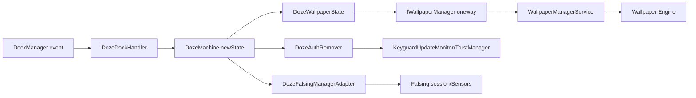
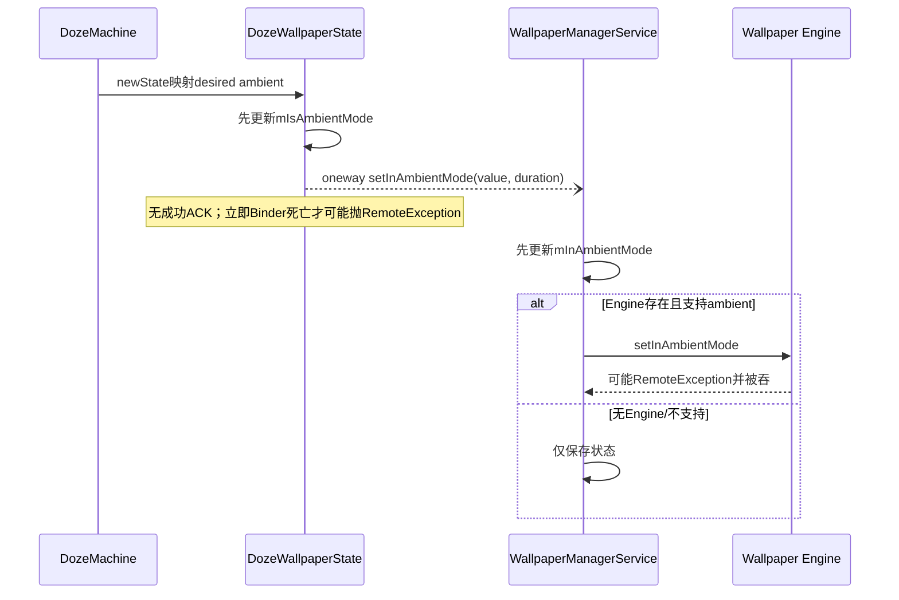
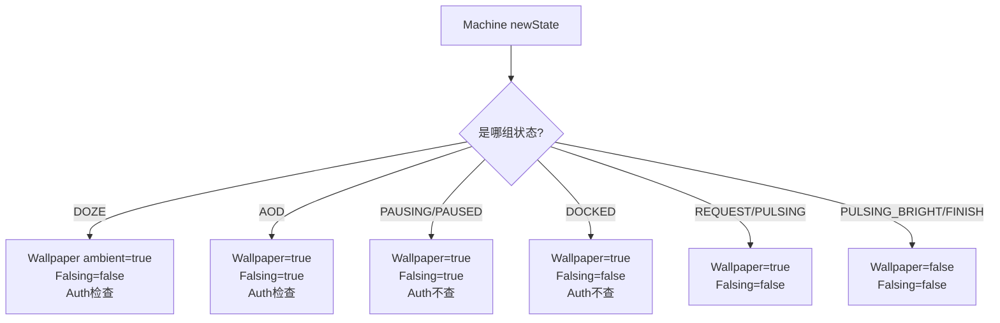

# 第 471 章 Android SystemUI DozeWallpaperState、DozeDockHandler、DozeAuthRemover 与 DozeFalsingManagerAdapter：壁纸、Dock、认证和误触链

> 源码基线：Android 11 / API 30 / `android-11.0.0_r48`。本章只在 macOS 阅读，不实际编译。核心文件：`DozeWallpaperState.java`、`DozeDockHandler.java`、`DozeAuthRemover.java`、`DozeFalsingManagerAdapter.java`；交叉阅读 `DozeMachine.java`、`DozeFactory.java`、`WallpaperManagerService.java`、`WallpaperService.java`、`KeyguardUpdateMonitor.java`、`DozeTriggers.java`、`BrightLineFalsingManager.java` 及本地测试。

## 1. 本章解决什么问题

Doze 状态怎样通知动态壁纸进入 ambient mode？Dock/隐藏 Dock UI 如何改写 AOD 主状态？手机再次睡眠时为什么还要清生物认证缓存？Falsing 为什么把 AOD、Pulse、Docked 划成不同集合？四个很短的 Part 如何影响跨进程和跨子系统状态？

## 2. 一句话主线

Wallpaper Part 把 Machine 状态压缩为一个 ambient 布尔并通过 oneway Binder 下发；Dock Part 把外设事件翻译为 Machine 状态；Auth Part 在稳定睡眠态按门清生物缓存；Falsing Part 把部分 AOD 状态投影成“误触会话是否应停”。代码短，但每个投影集合都不同。

## 3. 不要寻找一个统一的isAod

Wallpaper 认为 DOZE、REQUEST、普通 PULSING 等也是 ambient；Falsing 只认为 AOD/PAUSING/PAUSED 是 showing AOD；Machine 的 `isAlwaysOn()` 又只含 AOD 与 DOCKED。它们回答的是不同消费者问题，集合不同不必然是 bug。

## 4. 四个Part的输出类型不同

Wallpaper 发 Binder 消息；Dock 反向请求 Machine 状态；Auth 直接修改 SystemUI 单例并通知 Trust/回调；Falsing 调本进程插件接口，后者可能启动/停止 Sensor 会话。不能因它们都实现 `transitionTo` 就假设成本与失败模式相同。

## 5. Factory中的通知顺序

数组顺序是 Pauser→Falsing→Triggers→Ui→ScreenState→Brightness→Wallpaper→Dock→Auth。一次状态转换中 Falsing 最早看到 newState，Wallpaper/认证较晚；任何前面 Part 抛异常都会阻止后面 Part 收到本次状态。

## 6. 三个进程边界

Wallpaper 从 SystemUI 通过 `IWallpaperManager` 到 system_server，再到壁纸应用的 Engine；DockManager 默认在 SystemUI，但 OEM实现可接硬件/插件；Auth/Falsing主体在 SystemUI，`clearBiometricRecognized` 还会调用 TrustManager 服务。

## 7. 线程前提

Machine transition 在主线程；Wallpaper oneway Binder从主线程发出但不等服务处理；Auth 的 clear 明确 Assert main；DockManager接口没有线程注解，DockHandler也没有 Handler 归一化，厂商 callback 若不在主线程会违反 `getState/requestState` 前提。

## 8. 阅读时要画四张状态表

分别记录 Wallpaper ambient、Wallpaper animated、Dock event→state、Falsing showingAod，再单列 Auth clear 条件。把四者合成一个布尔会掩盖 PULSING_BRIGHT、DOCKED、PAUSED 和 FINISH 的关键差异。

## 9. 还要区分本地事实与远端事实

`mIsAmbientMode` 是 SystemUI 已发送意图，WallpaperManagerService 有自己的 `mInAmbientMode`，壁纸 Engine 又有实际处理状态。oneway 调用没有成功 ACK，三层值可能短时甚至长期不一致。

## 10. 总体结构图



## 11. WallpaperManager服务可以为空

Factory 以 `@Nullable IWallpaperManager` 注入，Part 即使服务为空也正常构造。此时仍更新本地 ambient 状态并可 dump，但不会尝试 Binder；这使无壁纸服务环境不阻断 Doze。

## 12. Wallpaper的ambient=true集合

DOZE、DOZE_AOD、DOZE_AOD_DOCKED、PAUSING、PAUSED、REQUEST_PULSE、PULSE_DONE、普通 PULSING 均为 true。它表达“壁纸处于 Doze/Ambient 语境”，比“屏幕正在显示 AOD”宽得多。

## 13. DOZE为何也算ambient

DOZE 的 Display 通常 OFF，但壁纸仍应知道整个 Dream/低功耗会话未结束；ambient mode 可让 Engine降低动画、准备AOD，而不等价于壁纸像素此刻可见。

## 14. REQUEST与PULSE_DONE仍算ambient

两者是过渡中间态，若每次都把壁纸退出/再进入 ambient，会制造无意义的 Binder 消息和动画。保持 true 让普通 Pulse 的边缘更平滑。

## 15. 普通PULSING仍是ambient

普通 Pulse 可以只展示通知/锁屏内容而让壁纸保持 AOD 处理；真正 bright pulse 单独切 false，让 wake-lock-screen 等场景露出更明亮的壁纸/认证视觉。

## 16. PULSING_BRIGHT与default为false

BRIGHT、UNINITIALIZED、INITIALIZED、FINISH 以及任何 default 状态都不是 ambient。FINISH 退出自然；INITIALIZED 尚未解析到稳定 Doze，不提前通知 true。

## 17. 只有布尔变化才发Binder

`isAmbientMode != mIsAmbientMode` 才更新字段并调用服务。AOD→PAUSING→PAUSED 都保持 true，不重复发送；普通 PULSING→PULSE_DONE 也通常不触发。

## 18. 进入ambient的动画规则

目标 ambient=true 时，animated 直接等于 `DozeParameters.shouldControlScreenOff()`。SystemUI接管熄屏动画时通知壁纸用500ms过渡，否则时长0立即进入。

## 19. 离开ambient的普通规则

目标 false 时先算 `fastDisplay=!getDisplayNeedsBlanking()`，并要求不是 wake-and-unlock 解锁；两者满足才 animated。生物 wake-and-unlock 通常已有自己淡出，不应再叠壁纸动画。

## 20. 从普通Pulse直接FINISH是例外

若 old=PULSING 且 new=FINISH，`wakingUpFromPulse=true`，最终 animated 无条件为 true，即使 display needs blanking 或 biometric 标志为 true。代码用 OR 让此特例覆盖普通门。

## 21. BRIGHT到FINISH不会命中该例外

BRIGHT 在进入时已经把 ambient 变 false，后续 FINISH 仍为 false，布尔无变化所以根本不再调用。真正退出 ambient 的动作发生在 PULSING/REQUEST→BRIGHT 那条边。

## 22. 动画时长固定500ms

animated 时使用 `StackStateAnimator.ANIMATION_DURATION_WAKEUP`，本地常量为500；false时0。它不是第470章 Policy 的 wallpaper visibility/fade duration，那些由其他壁纸/Scrim路径消费。

## 23. animated每次都算但未必使用

即便 ambient 布尔不变，函数仍计算 animated，随后因无状态差而不下发。因此 AOD过程中 `shouldControlScreenOff` 变化不会更新远端动画参数；duration只属于某次模式切换消息。

## 24. Wallpaper状态源码

```java
switch (newState) {
    case DOZE:
    case DOZE_AOD:
    case DOZE_AOD_DOCKED:
    case DOZE_AOD_PAUSING:
    case DOZE_AOD_PAUSED:
    case DOZE_REQUEST_PULSE:
    case DOZE_PULSE_DONE:
    case DOZE_PULSING:
        isAmbientMode = true;
        break;
    case DOZE_PULSING_BRIGHT:
    default:
        isAmbientMode = false;
}
if (isAmbientMode) {
    animated = mDozeParameters.shouldControlScreenOff();
} else {
    boolean wakingUpFromPulse = oldState == DozeMachine.State.DOZE_PULSING
            && newState == DozeMachine.State.FINISH;
    boolean fastDisplay = !mDozeParameters.getDisplayNeedsBlanking();
    animated = (fastDisplay && !mBiometricUnlockController.unlockedByWakeAndUnlock())
            || wakingUpFromPulse;
}
```

这段先决定模式，再决定“若模式变化，远端用多长动画”。

## 25. IWallpaperManager调用是oneway

AIDL 明确声明 `oneway void setInAmbientMode`。SystemUI Binder调用返回只表示事务已成功入队/未立即发现Binder死亡，不表示 system_server或Engine已执行完成。

## 26. SystemUI本地字段先于Binder更新

代码先 `mIsAmbientMode=isAmbientMode`，再进入 try 调远端。若 Binder立即抛 RemoteException，本地仍认为已经同步；下一次同一 desired 值因无差异不会重试。

## 27. RemoteException只记录不恢复

catch 打 warning，不回滚本地字段、不安排重连、不持有 pending desired。只有未来状态先切到相反值再切回来，才可能再次发送原值。

## 28. system_server也先记状态

WallpaperManagerService 收到后在锁内先写 `mInAmbientMode`，再找当前用户默认显示的 Engine，锁外调用。Engine不存在或不支持 ambient 时不发，但服务端仍保存全局模式，后续新 Engine连接会以 duration 0补发当前状态。

## 29. Engine失败也没有回传

system_server 对 `engine.setInAmbientMode` 的 RemoteException直接吞掉；由于上游是oneway，SystemUI更不可能知道此失败。完整链路是“最终尽力投影”，不是端到端确认协议。

## 30. 只面向当前用户默认显示

r48 服务端有 TODO multi-display，取 `mCurrentUserId` 的 WallpaperData 和 DEFAULT_DISPLAY connector。Doze Part 本身不携带 user/display，不能表达副屏或不同用户独立 ambient。

## 31. Wallpaper Binder时序图



## 32. dump能证明什么

只打印 SystemUI `mIsAmbientMode` 与构造时是否有 service。它不能证明 system_server字段、Engine是否支持、消息是否处理或动画是否完成。

## 33. Wallpaper测试有七项

覆盖 AOD true/FINISH false、支持/不支持动画、wake-and-unlock无动画、REQUEST ambient、BRIGHT退出及普通Pulse→FINISH强制动画。测试对主要状态矩阵较好，但无Binder失败、null service、重复状态或多显示。

## 34. testDreamNotification尾部验证较弱

该测试在前半已经验证过一次 `setInAmbientMode(false,...)`，后半没有 clear/reset Wallpaper mock 就再次 `verify(false)`；该断言可被前一次调用满足，注释“确保AoD关闭发送false”并未证明最后一条 transition 的独立效果。

## 35. RemoteException应补状态重试测试

可让首次 true 抛异常，再重复 AOD transition，现实现不会第二次调用；随后 FINISH→AOD才会重试。测试应明确这是期望的best-effort还是需要pending/重连修复。

## 36. 进入Dock处理链

DozeDockHandler只负责 Dock事件→Machine状态；DozeTriggers另有一个 Dock listener，负责在 Dock 时让触屏Doze Sensor忽略用户setting。两者同时注册，职责互补但不是一个原子事务。

## 37. Listener生命周期

INITIALIZED调用register，FINISH调用unregister；内部 `mRegistered` 防重复。Machine不会回到UNINITIALIZED，所以一轮Doze正常只有一次注册/注销。

## 38. DockManager为空也记registered

null时不add/remove，但仍翻本地标志。这让生命周期幂等且不崩；dump没有显示 manager存在或 registered，只显示最后事件状态。

## 39. AOSP默认DockManagerImpl完全no-op

r48裸实现 add/remove为空、isDocked/isHidden恒false。真正 Dock事件依赖产品/OEM替换实现；只读AOSP能分析合同，不能推断某设备一定产生事件。

## 40. 三个公开Dock状态

NONE=0 表示未初始化/正在离座；DOCKED=1表示展示Dock UI；DOCKED_HIDE=2表示已Dock但隐藏UI。对齐状态是另一组 listener，本 Part 不处理。

## 41. DOCKED强制进入DOZE_AOD_DOCKED

它不检查用户 Always-On 开关。Dock模式由外设/产品体验单独授权；Machine该状态屏幕ON且staysAwake，Triggers关闭近距和触屏Sensor。

## 42. NONE按当前用户开关恢复

离Dock时动态调用 `alwaysOnEnabled(USER_CURRENT)`：开则AOD，关则DOZE。它不沿用Dock前状态，也不考虑进入Dock前是否因power-save/suppression已被迫DOZE；Machine transitionPolicy仍可进一步改写AOD请求。

## 43. DOCKED_HIDE进入DOZE

隐藏Dock UI时直接请求普通DOZE，即使用户Always-On开。Machine仍保持Doze会话和触发器，但显示通常OFF。

## 44. 重复event被忽略

比较 `mDockState==dockState` 后直接return，避免初始/重复NONE覆盖Proximity等正在进行的转换。代价是同Dock状态下其他条件变化不会由重复事件重新评估。

## 45. 重复NONE不会响应AOD开关变化

若本地已NONE，用户切换Always-On后DockManager再发NONE仍被忽略；用户切换广播/DozeMachine其他政策应负责状态更新。DockHandler自身只把“event边沿”当触发。

## 46. event先写状态再判断Pulse

收到新事件立即 `mDockState=dockState`，然后若Machine在REQUEST/PULSING/BRIGHT便return。这样dump保留最新外设状态，但本次不请求主状态，以免打断Pulse。

## 47. Pulse后Machine重新查询DockManager

PULSE_DONE中间态解析下一状态时，Machine直接调用 `mDockManager.isDocked()/isHidden()`，而不是读Handler的 `mDockState`。若实现的事件状态与查询状态一致，Pulse期间被跳过的event仍会在结束后正确生效。

## 48. 一致性取决于DockManager实现

接口未规定 onEvent 更新与 `isDocked/isHidden` 的原子顺序。若厂商只发event却未同步query字段，Pulse期间的边沿会被Handler记住但不重放，Machine结束时可能解析成旧状态。

## 49. isPulsing集合不含PULSE_DONE

只含REQUEST、PULSING、BRIGHT。若event恰在PULSE_DONE转换/解析窗口进入，`getState()`本身因Machine正在执行转换会抛，而不是返回后被集合判断；类中没有 `isExecutingTransition` 防护。

## 50. Dock callback没有线程归一化

onEvent直接读Machine并requestState。默认实现无事件，测试Fake同步在测试线程；OEM若从Binder/硬件线程直接回调，会违反Machine主线程要求。接口和类都没有注解或Handler保护。

## 51. 注册期同步回放也是风险点

INITIALIZED的Part回调中调用 `addListener(this)`；若某实现同步回放当前Dock状态，onEvent会在Machine正在转换时调用 `getState()`，而 `getState`禁止队列非空，可能抛IllegalStateException。AOSP no-op与Fake都不回放，所以测试没覆盖。

## 52. 未知event仍污染本地状态

代码在switch前已赋 `mDockState`。未知int走default return，但dump保留未知值；下一次同未知值会被duplicate门忽略，下一次合法值仍可正常处理。

## 53. Dock事件源码

```java
public void onEvent(int dockState) {
    if (mDockState == dockState) {
        return;
    }
    mDockState = dockState;
    if (isPulsing()) {
        return;
    }
    DozeMachine.State nextState;
    switch (mDockState) {
        case DockManager.STATE_DOCKED:
            nextState = State.DOZE_AOD_DOCKED;
            break;
        case DockManager.STATE_NONE:
            nextState = mConfig.alwaysOnEnabled(UserHandle.USER_CURRENT)
                    ? State.DOZE_AOD : State.DOZE;
            break;
        case DockManager.STATE_DOCKED_HIDE:
            nextState = State.DOZE;
            break;
        default:
            return;
    }
    mMachine.requestState(nextState);
}
```

去重与Pulse门发生在政策switch之前；任何异步化修复都要保留事件顺序和最新值。

## 54. 两个Dock listener的顺序未规定

Triggers listener先后改变Sensor ignoresSetting，DockHandler listener请求Machine；DockManager接口不保证 listener集合顺序。状态转换可能先发生、Sensor设置稍后更新，最终一般收敛，但瞬时dump/注册动作可不同。

## 55. Dock测试有十项

覆盖注册/注销、三种状态映射、NONE下AOD开关、相同NONE忽略，以及三种event在PULSING时不request。它们使用单callback Fake，未覆盖多个listener顺序、线程、同步初始回放、unknown、null或query一致性。

## 56. Fake的isDocked恒false

测试Fake仅把event交给一个callback，`isDocked/isHidden`始终false，因此无法验证“Pulse中event跳过后由Machine query恢复”的集成链；Machine也被mock，PULSE_DONE解析根本未执行。

## 57. 进入DozeAuthRemover

这个Part不是删除用户认证方式，而是清 KeyguardUpdateMonitor 已识别的Fingerprint/Face成功缓存，避免上一次会话的生物通过继续让新锁屏 `canSkipBouncer`。

## 58. 只在DOZE和DOZE_AOD检查

INITIALIZED、DOCKED、PAUSING、PAUSED、REQUEST、Pulse、FINISH都不直接清。正常INITIALIZED会立刻解析成DOZE/AOD而触发；Dock设备可能直接解析DOCKED并绕过本Part门。

## 59. 为什么选稳定基态

DOZE/AOD表示新睡眠会话已落在普通稳定状态，清缓存不会打断正在显示的Pulse或生物wake-and-unlock。但KeyguardUpdateMonitor在startedGoingToSleep本来也会清，AuthRemover更像状态机侧兜底。

## 60. 检查的是当前用户

先取静态 `KeyguardUpdateMonitor.getCurrentUser()`，再问该用户 `getUserUnlockedWithBiometric(user)`。多用户切换时使用调用瞬间的全局current，而不是Machine携带的用户快照。

## 61. getter只承认可用认证

它要求缓存 `mAuthenticated=true`，并且当前StrongAuth/策略仍允许该生物强度。缓存存在但因策略变化不可用于解锁时，getter返回false，本Part不会调用clear。

## 62. clear却清所有用户

一旦当前用户门为true，`clearBiometricRecognized()` 会 clear 整个Fingerprint与Face SparseArray，并调用 TrustManager清全部生物 recognized，随后通知所有callbacks。检查范围是单用户，副作用范围是全局。

## 63. 门与副作用范围不对称

若仅后台用户有recognized而当前用户没有，本Part不清；若当前用户有，则后台所有用户一起清。正常睡眠/用户切换其他路径也做全局clear，但这个类名和前置判断本身没有表达范围差。

## 64. 不可用缓存可能继续留存

当前用户有缓存但StrongAuth暂时不允许时getter false，AuthRemover不清；缓存以后是否会重新变可用取决于KeyguardUpdateMonitor其他StrongAuth/睡眠清理路径。静态代码不能把“不可用”当“缓存不存在”。

## 65. startedGoingToSleep已经清一次

KeyguardUpdateMonitor `handleStartedGoingToSleep()` 无条件调用clear，再发callbacks并更新监听。因此标准睡眠顺序里AuthRemover常发现false而不重复清；它主要防异常顺序或不同入口。

## 66. 直接DOCKED的理论缺口

Machine INITIALIZED若 `DockManager.isDocked()` 可直接进入DOZE_AOD_DOCKED，AuthRemover不检查该状态。若started-going-to-sleep未先清，残留认证不会由此Part处理；是否可达依赖完整Wakefulness时序。

## 67. 构造参数Context没有被使用

构造器接Context却只执行 `Dependency.get(KeyguardUpdateMonitor.class)`，没有读context。Factory已有注入的monitor字段却没有传给它，降低可测试性并把依赖隐藏在全局容器。

## 68. Auth清理源码

```java
public DozeAuthRemover(Context context) {
    mKeyguardUpdateMonitor = Dependency.get(KeyguardUpdateMonitor.class);
}

public void transitionTo(DozeMachine.State oldState, DozeMachine.State newState) {
    if (newState == DozeMachine.State.DOZE
            || newState == DozeMachine.State.DOZE_AOD) {
        int currentUser = KeyguardUpdateMonitor.getCurrentUser();
        if (mKeyguardUpdateMonitor.getUserUnlockedWithBiometric(currentUser)) {
            mKeyguardUpdateMonitor.clearBiometricRecognized();
        }
    }
}
```

oldState完全未使用；同一newState无论从初始化、Pulse还是Dock返回，都采用同一门。

## 69. clear可能扩大一次Machine转换

clear在主线程执行，内部调用TrustManager并遍历Keyguard callbacks触发 `onBiometricsCleared()`。callback可引起其他UI/监听变化；若抛未捕获RuntimeException，按照第468章Machine无finally问题，会中断后续转换收口。

## 70. DozeAuthRemover没有测试

本地无专用Test，未验证DOZE/AOD、DOCKED、当前/后台用户、StrongAuth变更、全局clear范围、Dependency缺失或callback重入。

## 71. 更清晰的改法

直接构造注入 KeyguardUpdateMonitor；明确需求是“进入任何睡眠稳定态清全部缓存”还是“只清当前用户”；最好让Monitor提供按用户clear或无条件会话clear API，避免单用户门配全局副作用。

## 72. 进入Falsing Adapter

它每次transition都调用 `setShowingAod(isAodMode(newState))`，无本地缓存、无生命周期注册，也不读oldState。实际作用由当前 FalsingManager 实现决定。

## 73. Falsing的true集合只有三个

DOZE_AOD、DOZE_AOD_PAUSING、DOZE_AOD_PAUSED 为true；DOZE_AOD_DOCKED不在，REQUEST/PULSING也不在。这里的“showing AOD”用于决定是否运行误触会话，不是Machine ambient分类。

## 74. AOD true会停止Falsing会话

BrightLine 的 active 条件是 screenOn、StatusBarState KEYGUARD且 `!mShowingAod`。设true后updateSessionActive会sessionEnd，注销近距Sensor并通知 classifiers结束，避免对低功耗AOD无交互画面持续分类。

## 75. PAUSED虽屏幕OFF仍保true

PAUSED仍属于AOD会话，只是近距临时熄屏；保持true避免因screen生命周期边沿尚未同步而误启动Falsing session。

## 76. Pulse切false是为了恢复交互分类

进入REQUEST/PULSING时显示内容可接受触摸/展开，Adapter设false；如果screenOn和KEYGUARD条件满足，Falsing session会启动并注册Sensor。Pulse结束回AOD再设true关闭。

## 77. DOCKED为false有另一层豁免

Docked屏幕ON，Adapter允许Falsing session条件成立；但 BrightLine `isFalseTouch` 又显式要求 `!mDockManager.isDocked()` 才真正判false touch。这样Dock交互不被拒绝，却可能仍维持session/Sensor成本。

## 78. 默认FalsingManagerImpl也受影响

旧实现 active 条件同样含 `!mShowingAod`，false时可能在KEYGUARD+screenOn启动Sensor/DataCollector。Adapter通过Proxy转发给当前内部实现，切换算法不会绕过这项状态。

## 79. 每次重复写都会重算会话

没有判断值是否变化。AOD→PAUSING→PAUSED连续三次都set true并调用updateSessionActive；实现内部start/end有幂等门，所以通常不重复注册，但仍产生函数调用和状态检查。

## 80. DOZE设false的瞬时窗口

DOZE屏幕目标OFF，但Falsing收到状态很早，ScreenState和screen lifecycle稍后才投影。若Falsing的mScreenOn尚true且KEYGUARD，set false可短时启动session/Sensor，随后screen-off事件再结束；发生与否依赖事件顺序。

## 81. Falsing投影源码

```java
public void transitionTo(DozeMachine.State oldState, DozeMachine.State newState) {
    mFalsingManager.setShowingAod(isAodMode(newState));
}

private boolean isAodMode(DozeMachine.State state) {
    switch (state) {
        case DOZE_AOD:
        case DOZE_AOD_PAUSING:
        case DOZE_AOD_PAUSED:
            return true;
        default:
            return false;
    }
}
```

它故意不使用 Machine `isAlwaysOn()`：否则PAUSING/PAUSED会漏掉，DOCKED反而被加入。

## 82. Falsing Adapter没有专用测试

本地未验证状态集合、重复调用、DOCKED、Pulse session以及不同内部实现。Falsing自身测试也没有搜索到本Adapter `setShowingAod` 的集成用例。

## 83. 四个状态集合对照

DOZE：Wallpaper true、Falsing false、Auth检查；AOD：true/true/检查；PAUSING/PAUSED：true/true/不检查；DOCKED：true/false/不检查；PULSING：true/false/不检查；BRIGHT：false/false/不检查；FINISH：false/false/不检查。

## 84. PULSING是最能说明语义差异的例子

壁纸仍ambient以保持低功耗背景，Falsing却退出“showing AOD”以允许对Pulse交互分类。两个布尔一真一假并非自相矛盾，而是服务于渲染与输入安全两种目标。

## 85. DOCKED是第二个例子

Wallpaper仍ambient，Machine认为Always-On且屏幕ON，Falsing却false并在判定时由DockManager另行豁免，Auth不清。Dock是独立产品模式，不能机械套普通AOD政策。

## 86. PAUSED是第三个例子

屏幕OFF，Wallpaper/Falsing仍都把它归在AOD语境，Pauser Alarm已完成，Sensor近距仍可恢复；“显示硬件已关”不等于所有上层AOD标志都应false。

## 87. FINISH的通知先后

Falsing先set false，Ui stopDozing，Screen/Brightness清理，Wallpaper后发ambient false，Dock unregister，Auth不动作。因为Wallpaper是oneway，Machine完成FINISH时远端Engine可能尚未处理退出。

## 88. Part顺序与异常传播

若Falsing实现抛异常，后面的Host/屏幕/壁纸/Dock/Auth都不执行；若Wallpaper Binder只抛RemoteException则内部catch，Dock/Auth继续。四个类对异常的隔离策略不同。

## 89. 跨层状态没有事务

Machine newState先写入，再逐Part通知；Wallpaper远端异步、Dock可能同时来event、Auth callbacks可重入、Falsing会异步注册/注销Sensor。最终一致依赖幂等与后续事件，不存在跨组件原子commit。

## 90. 完整状态投影图



## 91. 现有测试覆盖分布不均

Wallpaper 7项、Dock 10项，Auth与Falsing均0项。数量较多的Dock测试仍只覆盖mock Machine与单listener Fake；真实query/线程/Pulse结束链未覆盖。

## 92. 可由源码确认的事实

Wallpaper oneway无ACK且失败前更新本地；Engine失败被服务端吞；Dock callback不切线程、Pulse event先记后跳过；Auth当前用户门触发全局clear；Falsing集合排除Docked/Pulse且每次都写。

## 93. 需要运行时验证的风险

Wallpaper本地/远端长期失配频率、OEM Dock同步回放/线程、Pulse期间Dock query一致性、DOZE瞬间Falsing Sensor抖动、直接Docked时生物缓存是否可能残留，都依赖产品实现和实际生命周期。

## 94. 改进一：Wallpaper记录desired与delivered

只有Binder事务成功入队才更新delivered；Binder death或RemoteException保留dirty，在服务重连/下一transition重试。若需Engine级保证，则system_server应提供状态查询/ack，而不是把oneway入队当完成。

## 95. 改进二：Dock事件统一进主线程

listener只把 `(sequence,state)` post到主Handler；执行时验证Machine非transition或使用可排队API，不调用受限getState；Pulse中保存latest pending Dock并在PULSE_DONE后与manager query核对。

## 96. 改进三：认证清理API明确范围

若需求是睡眠会话安全边界，就无条件调用 `clearAllBiometricRecognizedForSleep()` 并覆盖DOCKED/PAUSED等稳定态；若只清当前用户，则Monitor提供 `clearBiometricRecognized(userId)`，不再用单用户门触发全局副作用。

## 97. 改进四：Falsing用语义枚举

传 `AOD_NON_INTERACTIVE/PULSE_INTERACTIVE/DOCK_INTERACTIVE/OFF`，由Falsing集中决定session和Dock豁免；至少在Adapter缓存上次值并为每个Machine状态写表驱动测试。

## 98. 调试“动态壁纸不进AOD”

查Machine state→desired ambient、mIsAmbientMode、service是否null、Binder warning、WallpaperManagerService mInAmbientMode、当前用户WallpaperData、supportsAmbientMode、default display Engine及Engine消息线程；SystemUI dump true不是最终证明。

## 99. 调试“Dock后状态不对”

查两类Dock listener是否注册、event线程/顺序、Handler mDockState、Machine当时是否Pulse/transition、DockManager query值、Always-On当前用户开关、transitionPolicy省电/抑制，以及默认实现是否其实no-op。

## 100. 调试“睡眠后还能跳过Bouncer”

记录startedGoingToSleep是否clear、current user、Fingerprint/Face cache及强度、StrongAuth allowed、Doze进入的首个稳定态是否DOCKED、AuthRemover是否执行和TrustManager recognized；不要只看getter false。

## 101. 调试“Pulse误触判断异常”

同时看Machine状态、Adapter showingAod、StatusBarState、screenOn、Falsing sessionStarted、Docked、ProximitySensor注册及Pulse触摸门；Falsing false只代表允许会话，不代表最终一定判false touch。

## 102. 推荐源码阅读顺序

先为四个Part画newState表；再下钻 WallpaperManagerService/Engine、Machine PULSE_DONE Dock query、KeyguardUpdateMonitor clear、Falsing shouldSessionBeActive；最后对照Factory顺序和测试Fake限制。

## 103. 审计oneway Binder的固定问题

调用前还是调用后更新本地？死亡是否回滚？服务端是否另存状态？下游失败是否吞掉？新下游连接是否回放？是否按user/display隔离？用这六问可避免把“调用无异常”写成“壁纸已完成”。

## 104. 审计事件Adapter的固定问题

callback在哪个线程？注册是否同步回放？重复值是否有意义？处理中间态如何保存？主状态结束后谁重放？query与event是否同一事实？DockHandler暴露了这类短Adapter的典型风险。

## 105. 审计安全清理的固定问题

前置门检查谁、实际清谁、强策略变化时缓存算不算存在、回调是否重入、失败是否影响状态机、还有哪些重复清理入口。DozeAuthRemover的“当前用户门/全局clear”正适合练习。

## 106. 审计布尔投影的固定问题

先给布尔命名完整语义，再穷举所有Machine状态；确认中间态、Dock、Pulse、Paused、Finish；检查消费者对重复值是否幂等。不要直接复用名字相似的 `isAlwaysOn/isAmbient/showingAod`。

## 107. 本章最重要的代码审计结论

四个类均没有“行数多”的复杂算法，复杂性来自边界：异步Binder的三层事实、外部事件线程、认证清理范围和不同状态集合。阅读系统源码时，短适配器往往正是跨子系统不一致的入口。

## 108. 与第468—470章的连接

Machine/Pulse提供主时序；Screen/Ui决定屏幕和帧；本章把同一状态继续投影到壁纸、Dock、认证和输入安全。一次AOD故障可能表面在壁纸或Falsing，根因却是前面Machine状态或Display反馈未收口。

## 109. 日志与dump缺口

Wallpaper dump无desired/delivered/last error；Dock dump无registered/thread/pending；Auth无dump；Falsing Adapter无dump。跨组件排查常需同时抓Machine、Falsing、Wallpaper服务和Dock实现日志。

## 110. 适合补的最小测试集

Wallpaper RemoteException后同值重试；Dock同步addListener回放与后台线程；Pulse中event后PULSE_DONE query；Auth current/background/StrongAuth矩阵；Falsing十二状态参数化表与DOZE屏幕事件顺序。

## 111. 本章检查清单

能否解释Wallpaper/Falsing/Machine三种AOD集合、oneway三层状态、进出ambient动画门、Dock三态/Pulse保护/query恢复、Auth当前用户门与全局clear、Falsing session active条件及Factory异常顺序。

## 112. macOS 只读练习一：画十二态投影表

从 `DozeMachine.State` 枚举出发，为每态填写Wallpaper ambient、animated条件、Falsing showingAod、Auth是否检查、Dock event是否可能请求；只读源码，不编译。

## 113. macOS 只读练习二：追Wallpaper三层事实

沿 `DozeWallpaperState→IWallpaperManager.aidl→WallpaperManagerService→IWallpaperEngine→WallpaperService` 标出oneway、锁、本地字段、异常吞点和新Engine回放，区分“已请求/服务已记/Engine已处理”。

## 114. macOS 只读练习三：推演Pulse中Dock变化

按REQUEST→收到DOCKED_HIDE→PULSING→PULSE_DONE顺序，分别假设DockManager query同步/不同步，手算Handler mDockState与Machine下一态；设计latest-event generation修复。

## 115. macOS 只读练习四：审计认证清理范围

列出当前用户/后台用户各自Fingerprint、Face、StrongAuth allowed的组合，执行getter门与全局clear，指出哪些缓存保留/被连带清；再对照startedGoingToSleep入口，不实际解锁设备。

## 116. 最容易误解的一点

Wallpaper `mIsAmbientMode=true` 只证明SystemUI本地已决定并尝试投递；oneway没有执行ACK，system_server和壁纸Engine可能尚未或未能应用。

## 117. 第二个易错点

Dock事件在Pulse中不是完全丢弃：Handler会先保存最新mDockState，Machine通常在PULSE_DONE通过DockManager query恢复；但正确性取决于event与query一致，Handler自己不会重放。

## 118. 第三个易错点

AuthRemover先查当前用户，调用的clear却清所有用户与两种模态；`getUserUnlockedWithBiometric=false`也可能只是StrongAuth当前不允许，不代表缓存为空。

## 119. 本章结论

r48用四个小Part把Doze主状态分发给壁纸、Dock、安全缓存和误触会话，保持了职责分层；风险则来自无ACK Binder、本地先提交、外部线程/同步回放、单用户门配全局副作用以及语义不同的状态集合。正确阅读方式不是数分支，而是为每个消费者画投影表并追到真实执行端。

## 120. 下一章预告

下一章回到 Doze 服务入口，阅读 `DozeService`、`DozeFactory`、`DozeMachine.Service` 包装器与 Dream 生命周期，研究组件如何被创建、屏幕/亮度命令如何穿过Adapter、Service销毁与Machine FINISH如何闭环。
