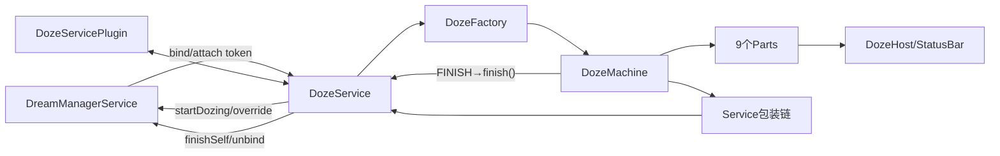
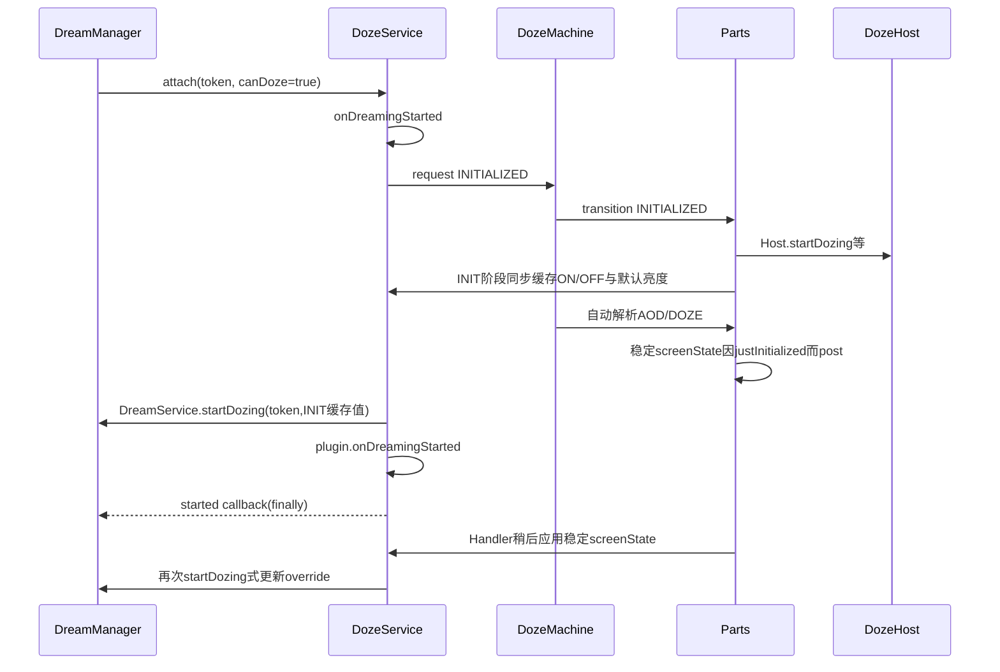
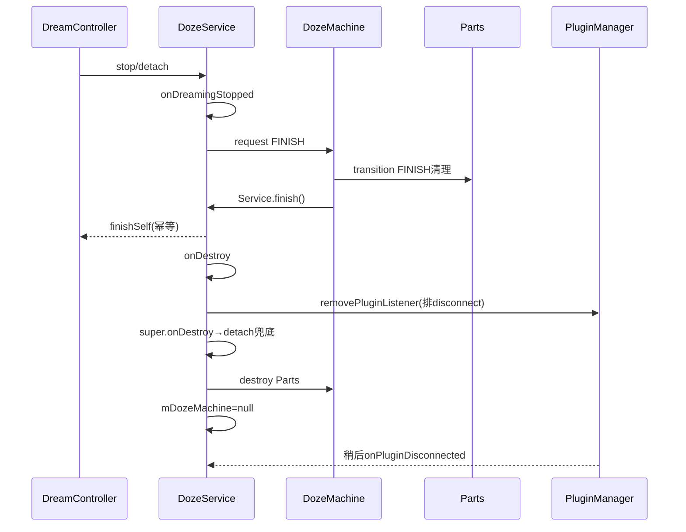

# 第 472 章 Android SystemUI DozeService、DozeFactory 与 Service 包装器：Dream 生命周期、装配和显示命令链

> 源码基线：Android 11 / API 30 / `android-11.0.0_r48`。本章只在 macOS 阅读，不实际编译。核心文件：`DozeService.java`、`DozeFactory.java`、`DozeBrightnessHostForwarder.java`、`DozeScreenStatePreventingAdapter.java`、`DozeSuspendScreenStatePreventingAdapter.java`；交叉阅读 `DreamService.java`、`DreamManagerService.java`、`DozeMachine.java`、`PluginManagerImpl.java`、`NotificationShadeWindowController.java` 及本地测试。

## 1. 本章解决什么问题

SystemUI 的 Doze 为什么是 DreamService？Machine/九个 Part 何时创建与销毁？屏幕状态和亮度怎样从 Part 穿过兼容 Adapter 到 system_server？为什么状态更新可以先于 `startDozing()`？插件何时收到 started/stopped，又有哪些重复或迟到边界？

## 2. 一句话主线

DreamManager 绑定 windowless DozeService；Service 创建 Factory 装配的 Machine；Machine 把状态投影给 Parts，屏幕/亮度命令经包装链进入 DreamService 缓存并由 DreamManager设置电源override；Dream停止后Machine先FINISH、framework再detach、最后destroy。真正难点在双层生命周期、提前缓存、Adapter改写与插件异步通知。

## 3. DozeService不是普通后台Service

它继承 `android.service.dreams.DreamService`，由 DreamManager 以 dream token 管理。普通 `startService/onStartCommand` 不是主入口；关键回调是 attach→onDreamingStarted、onDreamingStopped、finish和onDestroy。

## 4. Manifest安全边界

Service exported=true、singleUser=true，并要求 `android.permission.BIND_DREAM_SERVICE`。虽然组件可导出，绑定权限把入口限制给持有系统签名级权限的一方；singleUser让SystemUI主用户实例服务全设备。

## 5. Windowless意味着什么

onCreate 调 `setWindowless(true)`，所以不创建 DreamActivity/Window；锁屏/AOD视觉由已有StatusBar窗口承载。DreamService attach若发现windowless但 `canDoze=false` 会抛IllegalStateException。

## 6. 构造由SystemUI依赖注入

DefaultServiceBinder把DozeService加入可注入Service map；构造拿DozeFactory和PluginManager，先设置debug。Android框架创建的是Service，但实例依赖仍由SystemUI Dagger工厂提供。

## 7. 三层“Dozing”不能混同

DreamService `mDozing`表示已向DreamManager startDozing；DozeServiceHost `mDozingRequested/isDozing`表示StatusBar视觉状态；DozeMachine state表示业务状态。onDreamingStarted会分别通过framework调用和DozeUi Part推动前两层。

## 8. 两条服务输出链

屏幕/亮度走 `DozeMachine.Service`→包装器→DozeService/DreamService→DreamManagerService→PowerManagerInternal；Pulse、时间、Scrim与StatusBar dozing走Parts→DozeHost。亮度Forwarder让同一个数同时进入两条链。

## 9. 线程模型

DreamService attach/detach要求其Handler线程，SystemUI这里即主线程；Machine也要求主线程。PluginManager连接/断开投递到main handler，但插件拿到RequestDoze后可从自身线程调用，接口没有线程注解或自动post。

## 10. 总体架构图



## 11. onCreate的精确顺序

先super，再设windowless；然后向PluginManager注册单插件listener；最后 `assembleMachine(this)`。因此监听已注册而Machine字段尚未赋值的短窗口真实存在，虽然Plugin load通常通过Handler异步完成。

## 12. 先注册插件有什么好处

插件若尽早连接，可在Dream开始前拿到RequestDoze并在started时收到通知；但如果连接callback同步/重入或插件立即请求show/hide，`mDozeMachine`可能仍null，只会被onRequest的null门忽略。

## 13. Factory每轮新建Ambient配置

`assembleMachine`用DozeService Context创建新 `AmbientDisplayConfiguration`，Machine/Triggers共用它；DozeParameters内部又持有注入时的Ambient配置。两者读取同一Settings/资源，但不是同一个对象实例。

## 14. 每轮新建共享DelayedWakeLock

Builder设置主Handler和tag `Doze`后build。Machine、Triggers、Ui、ScreenState共享这个引用，通过reason计数；底层默认20秒超时，release再延100ms。

## 15. Service包装链的建立顺序

base是DozeService；先套BrightnessHostForwarder；若不支持Doze display state再套ScreenStatePreventing；若不支持DOZE_SUSPEND再套SuspendPreventing。最后一个创建的是最外层，调用按相反方向逐层进入base。

## 16. Machine与显示Part都拿最外层Service

Machine、DozeScreenState、DozeScreenBrightness都使用 `wrappedService`；Triggers/Ui则需要原始DozeService作为Context。屏幕/亮度不会绕过兼容层，wakeUp/finish也由Delegate透明转发。

## 17. 九个Part固定顺序

Pauser、Falsing、Triggers、Ui、ScreenState、ScreenBrightness、Wallpaper、Dock、Auth。一次transition逐个同步调用，没有依赖拓扑检查、异常隔离或逆序rollback。

## 18. Factory装配源码

```java
DozeMachine.Service wrappedService = dozeService;
wrappedService = new DozeBrightnessHostForwarder(wrappedService, mDozeHost);
wrappedService = DozeScreenStatePreventingAdapter.wrapIfNeeded(
        wrappedService, mDozeParameters);
wrappedService = DozeSuspendScreenStatePreventingAdapter.wrapIfNeeded(
        wrappedService, mDozeParameters);

DozeMachine machine = new DozeMachine(wrappedService, config, wakeLock,
        mWakefulnessLifecycle, mBatteryController, mDozeLog, mDockManager, mDozeHost);
machine.setParts(new DozeMachine.Part[]{
        new DozePauser(mHandler, machine, mAlarmManager, mDozeParameters.getPolicy()),
        new DozeFalsingManagerAdapter(mFalsingManager),
        createDozeTriggers(dozeService, mAsyncSensorManager, mDozeHost,
                mAlarmManager, config, mDozeParameters, wakeLock,
                machine, mDockManager, mDozeLog, mProximityCheck),
        createDozeUi(dozeService, mDozeHost, wakeLock, machine, mHandler,
                mAlarmManager, mDozeParameters, mDozeLog),
        new DozeScreenState(wrappedService, mHandler, mDozeHost, mDozeParameters, wakeLock),
        createDozeScreenBrightness(dozeService, wrappedService, mAsyncSensorManager,
                mDozeHost, mDozeParameters, mHandler),
        new DozeWallpaperState(mWallpaperManager, mBiometricUnlockController, mDozeParameters),
        new DozeDockHandler(config, machine, mDockManager),
        new DozeAuthRemover(dozeService)
});
```

这段既是依赖图，也是状态通知顺序表。

## 19. attach何时调用started

DreamService收到token/canDoze后，windowless路径无需等待Activity，立即把 `mStarted=true` 并调用onDreamingStarted；started远端callback放在finally里，即使子类抛异常也尝试通知DreamController attach回调结束。

## 20. started callback不是业务成功ACK

finally发送只表示onDreamingStarted调用栈已退出，不证明Machine落到AOD、屏幕override生效或插件启动成功。若子类抛异常，远端仍可能先收到started，然后SystemUI线程继续抛错。

## 21. onDreamingStarted先请求INITIALIZED

Machine从UNINITIALIZED只允许到INITIALIZED；Parts注册监听/启动Host，Machine随后在同一请求循环解析Dock/Always-On/DOZE稳定态。Service下一行执行时，Machine通常已完成多次transition。

## 22. ScreenState可在framework start前设置值

UNINITIALIZED→INITIALIZED 时，ScreenState会同步把 INITIALIZED 映射的ON/OFF写入DozeService缓存，Brightness也同步写默认值。紧接着INITIALIZED→稳定AOD/DOZE时，因为 `oldState==INITIALIZED`，稳定屏幕目标会post到下一轮Handler，并不会在当前started调用栈内立即覆盖缓存。

## 23. startDozing一次发送缓存

INITIALIZED请求返回后，DozeService调用继承的 `DreamService.startDozing()`，把mDozing设true并调用DreamManager `startDozing(token,cachedState,cachedBrightness)`。首次提交通常是INITIALIZED阶段的ON/OFF加默认亮度，而不是UNKNOWN；started返回后，Handler中的稳定AOD/DOZE屏幕目标再触发第二次override更新。

## 24. DozeUi的startDozing不是同一个函数

Ui Part在INITIALIZED调用 `mHost.startDozing()`，更新StatusBar视觉；Service随后无接收者地调用framework `startDozing()`，更新DreamManager/PowerManager。两个同名方法处在不同对象和数据面。

## 25. startDozing没有等待绘制完成

DreamService文档建议完成必要工作后再调用，因为CPU随后可suspend。SystemUI用Machine转换WakeLock覆盖初始化状态投影，再开始Dozing；后续帧由DozeUi的exact Alarm和WakeLock保护。

## 26. 启动正常时序图



## 27. 初始化也可能直接FINISH

Triggers在INITIALIZED检查Car mode、Host blocking或未provisioned，可在当前Machine请求队列中追加FINISH。Machine处理FINISH、通知Parts并调用Service.finish，DreamService把mFinished=true并请求DreamManager finishSelf。

## 28. 但Service随后仍无条件startDozing

`requestState(INITIALIZED)`返回后没有检查Machine/finished，下一行仍调用 `startDozing()`；DreamService该方法也不检查mFinished，只看canDoze与mDozing。因此异常初始化可在finishSelf之后又短暂向DreamManager请求startDozing。

## 29. token校验可能让迟到start无效

DreamManagerService只在token仍等于current且canDoze时应用override/DozeWakeLock；finishSelf异步停止是否已先清token决定迟到start是否生效。静态源码能证明请求顺序，不能断言服务端一定接受。

## 30. 插件started也无条件继续

同一路径在startDozing后仍调用 `mDozePlugin.onDreamingStarted()`。即使Machine已FINISH/Service已请求销毁，当前连接插件也可能收到started，随后很快收到stopped。

## 31. 启动源码

```java
@Override
public void onDreamingStarted() {
    super.onDreamingStarted();
    mDozeMachine.requestState(DozeMachine.State.INITIALIZED);
    startDozing();
    if (mDozePlugin != null) {
        mDozePlugin.onDreamingStarted();
    }
}

@Override
public void onDreamingStopped() {
    super.onDreamingStopped();
    mDozeMachine.requestState(DozeMachine.State.FINISH);
    if (mDozePlugin != null) {
        mDozePlugin.onDreamingStopped();
    }
}
```

Machine与framework Dream状态没有事务，靠调用顺序和幂等收敛。

## 32. DreamManager如何应用override

server校验current token/canDoze后保存screen state/brightness，调用PowerManagerInternal `setDozeOverrideFromDreamManager`；首次进入还设currentDreamIsDozing并acquire专用DozeWakeLock。后续更新复用startDozing Binder但不重复acquire。

## 33. DreamService setter会去重

screen/brightness与缓存相同则不调用updateDoze；不同且mDozing=true时立即再次向DreamManager startDozing，服务端更新override。方法名startDozing也承担“更新已Dozing参数”。

## 34. 亮度在framework再clamp

除BRIGHTNESS_DEFAULT(-1)外，DreamService用绝对亮度clamp到0—255。第469章Brightness先要求mapped>0并做用户上限，但Adapter/其他调用者仍受framework最后防线。

## 35. DozeService只覆写screen setter

它继承DreamService的brightness setter直接满足Service接口；screen setter额外在super后调用 `mDozeMachine.onScreenState(state)`，让Triggers/Brightness按最终请求的Display状态重配Sensor。

## 36. 相同screen值仍会反馈Parts

DreamService super内部相同值不update DreamManager，但DozeService无条件调用Machine onScreenState。因此重复set会再次逐Part反馈，Prox可能alertListeners、Sensor策略重评，即使硬件override未改变。

## 37. 反馈值已经经过Adapter

ScreenState拿最外层Service；兼容Adapter先改state，最内层DozeService看到/反馈的是最终兼容值。Part不会收到Machine最初想要但硬件不支持的DOZE_SUSPEND。

## 38. screen feedback不是硬件完成ACK

DozeService先调用DreamService setter；后者向DreamManager发Binder并吞RemoteException，再立刻onScreenState。反馈表示“最终值已提交/缓存”，不证明PowerManager/Display已完成切换。

## 39. brightness feedback有两个消费者

BrightnessForwarder先把值传入DreamService/DreamManager，再调用Host保存到NotificationShadeWindowController。前者控制Doze显示override，后者保存0—1浮点供Biometric强制Doze亮度窗口使用。

## 40. Host保存亮度不立即apply窗口

`setDozeScreenBrightness`只写 `mScreenBrightnessDoze=value/255f`；真正Window LayoutParams在其他state setter触发`apply()`且forceDozeBrightness为true时使用。它是“保持最新备用值”，不是第二条实时面板亮度控制。

## 41. Forwarder先inner后Host

如果inner调用抛RuntimeException，Host不会更新；DreamService正常只吞DreamManager RemoteException并返回，所以常见远端失败下Host仍会保存值。链条不是跨两消费者事务。

## 42. screen与brightness包装源码

```java
// DozeService
public void setDozeScreenState(int state) {
    super.setDozeScreenState(state);
    mDozeMachine.onScreenState(state);
}

// DozeBrightnessHostForwarder
public void setDozeScreenBrightness(int brightness) {
    super.setDozeScreenBrightness(brightness);
    mHost.setDozeScreenBrightness(brightness);
}
```

一个增加回流通知，一个增加第二消费者；两者都没有完成ACK。

## 43. Display能力有两个开关

`getDisplayStateSupported`决定是否支持DOZE/DOZE_SUSPEND这类低功耗状态；`getDozeSuspendDisplayStateSupported`专门决定能否进入suspend版本。后者为false不必否定普通DOZE。

## 44. ScreenStatePreventing映射

当低功耗Display state整体不支持时，DOZE→ON，DOZE_SUSPEND→ON_SUSPEND；OFF/ON/ON_SUSPEND等原样。它尽量保留“suspend控制权”语义，同时换成非Doze族状态。

## 45. SuspendPreventing映射

仅把DOZE_SUSPEND→DOZE；其他值不变。设备仍能低功耗显示，但不能把面板/Sidekick进入suspend控制。

## 46. 包装顺序为何重要

SuspendPreventing在最外层先执行，再进入ScreenStatePreventing。两种能力都不支持时，DOZE_SUSPEND先变DOZE，再变ON；不会得到ON_SUSPEND。

## 47. 四种能力矩阵

都支持：DOZE_SUSPEND；仅不支持suspend：DOZE；仅不支持整体Doze但宣称支持suspend：ON_SUSPEND；两者都不支持：ON。第三种配置虽语义少见，代码按两个独立布尔处理。

## 48. Adapter源码

```java
// outer: DozeSuspendScreenStatePreventingAdapter
if (state == Display.STATE_DOZE_SUSPEND) {
    state = Display.STATE_DOZE;
}
super.setDozeScreenState(state);

// inner: DozeScreenStatePreventingAdapter
if (state == Display.STATE_DOZE) {
    state = Display.STATE_ON;
} else if (state == Display.STATE_DOZE_SUSPEND) {
    state = Display.STATE_ON_SUSPEND;
}
super.setDozeScreenState(state);
```

从外到内手算，才能得到两开关同时关闭时的最终ON。

## 49. Adapter不改Machine state

Machine仍可处于DOZE_AOD、PAUSING等，只有Display命令被降级。业务层AOD与硬件状态集合因此不再一一对应；Parts应依赖onScreenState最终值处理硬件相关行为。

## 50. 降级会影响光Sensor

Brightness只在最终反馈DOZE/DOZE_SUSPEND时启用专用光Sensor；被映射到ON/ON_SUSPEND后会关闭。设备不支持低功耗显示时，不继续按AOD Sensor bucket调面板符合能力降级。

## 51. 降级也影响Prox安全模式

DozeSensors把DOZE/DOZE_SUSPEND/OFF设secondarySafe；最终ON/ON_SUSPEND会false。Triggers的持续Prox监听也要求最终状态为DOZE/DOZE_SUSPEND/OFF，降级可能停止该监听，产品需由能力设计保证行为合理。

## 52. Delegate透明转发其余方法

finish、requestWakeUp、brightness和未改写的screen state逐层转发。包装器没有null检查、线程切换、日志或异常处理，保持调用栈同步。

## 53. onDreamingStopped先FINISH

外部Dream停止时，Service请求Machine FINISH；Parts按顺序取消监听/Alarm、stop Host、清屏幕pending、退出Wallpaper/Dock。Machine随后调用其Service.finish，即DreamService final finish。

## 54. FINISH中的finish可能是重复请求

若停止由DreamController发起，framework已经在detach；Machine再finishSelf是幂等/冗余。DreamService用mFinished门避免重复Binder，detach末尾再次finish也会直接return。

## 55. framework detach把started先清false

DreamService.detach若mStarted，先置false再调用子类onDreamingStopped，避免DozeService内部finish触发的后续detach再次调用stopped，形成递归。

## 56. onDestroy为什么先super

DozeService先移除Plugin listener，再调用super；DreamService.onDestroy会detach，若尚未stopped则此时仍需有效mDozeMachine处理FINISH。只有super返回后才destroy Machine并置null，所以顺序是有意保留停止能力。

## 57. Machine.destroy不等于FINISH

destroy只逐Part调用 `destroy()`；r48只有DozeTriggers覆盖并销毁Sensors。广播、Host、Dock、Ui tick等主要清理由FINISH transition完成，不能拿destroy替代正常stopped。

## 58. 异常onDestroy的依赖

若Service从未started，super detach不会onDreamingStopped，Machine仍UNINITIALIZED；destroy只清Triggers Sensor，其他未注册资源较少，但DozeUi构造时的Keyguard弱callback没有显式remove。若assembleMachine失败使字段null，onDestroy无null门会NPE。

## 59. 销毁时序图



## 60. Plugin只允许一个

addPluginListener传allowMultiple=false；Service也只保存单个mDozePlugin。连接时覆盖字段并把RequestDoze交给插件，未记录是否Dream当前正在运行。

## 61. 晚连接插件漏started

若Dream已started后插件才连接，onPluginConnected只set requester，不补 `onDreamingStarted()`。插件直到下一轮Dream才收到started，却可能在本轮断开时收到stopped。

## 62. 断开总调用stopped

只要mDozePlugin非null，onPluginDisconnected就调用其onDreamingStopped并清字段，不检查Dream started，也不检查参数plugin是否就是当前字段。allowMultiple=false降低但不消除旧disconnect/新connect乱序风险。

## 63. 正常销毁可能双stopped

Dream onDreamingStopped先通知插件但不清mDozePlugin；onDestroy removePluginListener会让PluginInstanceManager把PLUGIN_DISCONNECTED消息投到main，随后Service又调用同一插件stopped并清。插件需幂等，否则一次Dream结束可能观察到两次停止。

## 64. removeListener的disconnect是异步的

PluginInstanceManager.destroy遍历当前插件并向main Handler发送消息，DozeService onDestroy不会等它完成。message持有listener/Service引用，使disconnect可在Service销毁栈返回后执行。

## 65. RequestDoze只有null门

show/hide只检查Machine非null，随后直接request AOD/DOZE；不检查是否started、当前FINISH、是否主线程或插件身份。连接后在UNINITIALIZED调用会触发非法transition，销毁后Machine null才静默忽略。

## 66. 插件请求仍受Machine政策

Show AOD可能被Doze suppressed或AOD power save改为DOZE；Hide是普通DOZE请求。插件只是提出desired，不绕过Machine policy、屏幕能力或用户配置。

## 67. 插件线程是隐含合同

Plugin callback由Manager main Handler连接，但RequestDoze对象可被插件保存并从任意线程调用。Machine requestState标注MainThread并内部Assert；接口没有Handler封送，插件实现必须自行回主线程。

## 68. 插件无reason/generation

show/hide不携带会话id、原因或调用结果。旧插件/旧会话迟到请求只看当前mDozeMachine是否非null，可能作用于当前Dream；Service未在onPluginDisconnected撤销传给插件的requester。

## 69. wakeUp走PowerManager而非finish

Machine `wakeUp()`最终调用DozeService.requestWakeUp，以uptime和GESTURE reason调用PowerManager。系统Wakefulness变化会让Dream停止/FINISH；它不是直接调用DreamService.finish，给正常唤醒链处理机会。

## 70. uptime作为wake时间

PowerManager.wakeUp要求uptime时间基准，代码使用SystemClock.uptimeMillis而非elapsed/wall，reason字符串为`com.android.systemui:NODOZE`，便于电源日志归因。

## 71. startDozing与DozeWakeLock的语义

DreamManagerService首次标记currentDreamIsDozing时acquire专用锁，stopDozing时释放并清override。该锁属于system_server Dream管理，不是SystemUI Part任务WakeLock；名称相同也不能混用配对。

## 72. DozeService没有显式stopDozing

onDreamingStopped请求FINISH/finish，framework Dream detach/manager停止负责解除dozing；Service不直接调用继承的stopDozing。DreamManager停止当前Dream时会收口其DozeWakeLock/override。

## 73. dump只在Handler上执行

`dumpOnHandler`先super，再在Machine非null时dump状态、WakeLock和Parts。销毁后只显示DreamService信息；它不打印插件、包装链、capability矩阵或service缓存与server override差异。

## 74. Factory没有专用测试

本地没有DozeFactoryTest，九Part顺序、共享对象、包装组合、nullable Wallpaper、亮度Sensor选择和allowPulseTriggers=true均无构造级断言。

## 75. DozeService也没有专用测试

没有覆盖started/stopped/onDestroy、提前FINISH后仍startDozing、插件晚连接/双stopped/线程、重复screen feedback、Machine null或Dream token生命周期。MachineTest使用DozeServiceFake，绕开framework层。

## 76. ScreenStatePreventing有八项测试

覆盖finish、ON/OFF转发、DOZE→ON、DOZE_SUSPEND→ON_SUSPEND、wakeUp和wrap needed/not needed。没有brightness转发，但Delegate逻辑由代码直观提供。

## 77. SuspendPreventing有九项测试

多覆盖ON_SUSPEND原样，其余类似，并验证DOZE_SUSPEND→DOZE。两个测试类各自单独包inner，没有测试Factory真实嵌套顺序及两能力矩阵。

## 78. BrightnessForwarder没有测试

未验证inner/Host调用顺序、异常时Host是否跳过、重复值、0/255/-1或Window存储应用时机。DreamServiceFake相关亮度测试也不观察Host第二消费者。

## 79. 测试绿色不能证明完整显示链

Adapter单元测试只证明纯映射；真实链还包括ScreenState pending、DreamService缓存/去重、DreamManager token检查、PowerManager override、DozeService即时feedback和Sensor重配。

## 80. 可确认的启动边界

INITIALIZED内部可FINISH，但onDreamingStarted仍继续startDozing/plugin started；INIT的ON/OFF与默认亮度可在start前缓存，而稳定screenState因justInitialized延后一轮；started远端callback在finally发送。这些均由r48源码直接证明。

## 81. 可确认的销毁边界

super.onDestroy在Machine destroy前；destroy只显式销毁Triggers Sensor；Plugin remove排异步disconnect；正常stop与disconnect可对同插件各调用一次stopped。

## 82. 可确认的显示边界

最终adapted state反馈给Parts但不是硬件ACK；相同state仍反馈；亮度先inner后Host且Host只存备用浮点；两Adapter叠加结果依赖顺序。

## 83. 需要运行时验证的风险

提前finish后的startDozing是否被token门接收、插件双stopped实际时序、旧插件requester是否会迟到调用、新旧Dream Service实例能否重叠、final state反馈与硬件完成差距，依赖Manager队列。

## 84. 改进一：started采用显式结果

INITIALIZED返回后检查Machine state/Service mFinished；若FINISH则不startDozing、不发plugin started，并向DreamController报告已结束。把attach完成与Doze业务成功区分成结果或至少日志。

## 85. 改进二：插件维护会话状态

记录mDreaming和generation；晚连接时补当前started，stopped至多一次；disconnect核对identity；销毁时清requester或令RequestDoze校验generation，所有请求post主Handler。

## 86. 改进三：统一清理合同

让每个Part的destroy都能幂等完成自身资源收口，FINISH仍负责视觉/业务转换；Service onDestroy对Machine null与未FINISH做兜底，减少对framework detach顺序的脆弱依赖。

## 87. 改进四：包装链可观测

dump capability和最终包装顺序；setScreen记录requested/adapted/submitted序列及时间；DreamManager反馈实际override变化，避免把onScreenState命名成硬件完成。

## 88. 改进五：亮度双消费者一致性

Forwarder用try/finally或明确best-effort分别提交；Host若forceDozeBrightness已true，应评估是否立即apply最新值；为Dream override和Window备用值记录同一generation。

## 89. 调试“Dream一启动就结束”

查canDoze/windowless、INITIALIZED队列、Car mode、blockingDoze、provisioned、Dock/Always-On解析、Machine是否FINISH、finishSelf token，以及Service是否随后仍startDozing/plugin started。

## 90. 调试“状态是AOD但面板不是低功耗”

查两capability、Factory包装链、ScreenState requested与adapted值、DreamService cache/mDozing、DreamManager current token/canDoze/override、PowerManager display状态和onScreenState反馈。

## 91. 调试“亮度变了但窗口不变”

区分Dream显示override与NotificationShade Window force亮度；查mapped/clamp值、DreamService cache、Forwarder Host存值、mForceDozeBrightness是否true、是否有后续apply调用。Host setter本身不apply。

## 92. 调试“插件控制偶发失效”

记录connect/disconnect、Dreaming generation、started/stopped次数、request线程、Machine state/null、旧requester、AOD policy改写及插件是否晚连接未获started。

## 93. 调试“Sensor开关与Machine状态矛盾”

先看Adapter最终Display feedback：Machine可AOD但最终ON_SUSPEND/ON，Brightness与Prox按Display而非业务state决定监听。两套状态不同可能是能力降级，不一定是错。

## 94. 读取Dream源码的关键抓手

围绕token、mCanDoze、mDozing、mDozeScreenState/brightness、mStarted、mFinished、mWaking阅读；DozeService的短生命周期方法只有放入这些framework字段变化中才完整。

## 95. 读取Factory的关键抓手

区分原始Service Context、wrapped Service输出、共享单例依赖、每会话新对象；标注哪个Part注册外部监听、哪个只投影、哪个反向request Machine，并保留数组顺序。

## 96. 读取Delegate的关键抓手

从最外层向内手算参数，每层是否改值/增加副作用/改变异常；finish/wake/brightness与screen可能走不同override。Decorator图比只看类名更可靠。

## 97. 生命周期不是对称一行对一行

onCreate注册plugin+建Machine；started初始化+framework doze+plugin；stopped Machine FINISH+plugin；onDestroy remove listener+super detach兜底+Part destroy。相同cleanup可能被不同入口重复触发。

## 98. finish有三种来源

外部DreamController停止触发stopped；Machine政策进入FINISH调用Service.finishSelf；DreamService window/detach异常也可finish。mFinished/mStarted门负责防重，但SystemUI插件通知另有自己的状态缺口。

## 99. requestWakeUp与finish的选择

手势唤醒用PowerManager让系统进入WAKING并正常结束Dream；政策/初始化失败直接FINISH；Scrim Pulse finished只回基态。不同出口影响动画、Wakefulness和插件时序。

## 100. 多用户语境

Service singleUser运行在主SystemUI进程，Ambient配置/DozeMachine多处以USER_CURRENT读取；Dream token属于当前全局Dream。用户切换期间配置对象、plugin与当前用户读取没有会话snapshot。

## 101. 安全语境

Manifest权限保护绑定，但DozeServicePlugin是SystemUI插件机制，具备调用RequestDoze的高信任代码。线程/生命周期校验仍重要，因为可信插件也可能有竞态或版本错误。

## 102. 性能语境

windowless避免独立窗口；异步SensorManager降低主线程注册延迟；screen/brightness去重减少Binder；但每次screen setter仍反馈Parts，插件/Part均在主线程，异常或慢callback可阻塞Machine转换。

## 103. 故障隔离语境

DreamService吞DreamManager RemoteException，Wallpaper自己catch，Plugin/Host/Parts大多不catch。Machine无finally时一个RuntimeException会留下半状态/锁；Service层并未提供全局恢复监督器。

## 104. 推荐的端到端日志字段

Dream generation/token哈希、Machine old/requested/new、requested/adaptedDisplay、Dream cache与server override、brightness两消费者、plugin identity/state、Part index/耗时、WakeLock clients及finish来源。

## 105. 现有dump缺失

Machine dump没有Dream token/mDozing/cache、Factory包装、plugin状态；DreamService super dump与Machine分开。定位启动/销毁竞态常需合并dumpsys dream、SystemUI dump和PowerManager状态。

## 106. 适合补的Service测试

模拟INITIALIZED→FINISH，断言不startDozing/plugin started；正常stop+remove listener断言plugin stopped一次；晚connect补started；旧requester被拒；onDestroy未started/assembly null安全。

## 107. 适合补的包装集成测试

参数化两个capability的四组合，输入DOZE/DOZE_SUSPEND并验证base收到值、Machine onScreenState反馈值、Brightness Sensor开关；再验证brightness inner与Host顺序和异常。

## 108. 适合补的Dream边界测试

set state/brightness beforestart再start、相同值反馈、finishSelf后start、token切换、server RemoteException以及detach递归；区分framework保证与SystemUI假设。

## 109. 与前四章的总连接

468定义Machine/Pulse；469定义Sensor/Display/Brightness/Pauser；470定义Ui tick/Host；471定义其他投影；本章给出它们的出生、共享依赖、命令出口和死亡顺序，完成Doze子系统纵向闭环。

## 110. 最小心智模型

先把Machine当纯业务状态机，再把九Parts当同步观察者/请求者，把wrapped Service当显示命令Decorator，把DreamService当缓存+token Binder客户端，把DozeHost当StatusBar视觉面；不要把五层折叠成“DozeService控制AOD”。

## 111. 本章检查清单

能否解释manifest/windowless、attach/started/stopped/detach/destroy、提前缓存后start、提前FINISH边界、九Part顺序、三层Service包装、能力矩阵、screen feedback非ACK、亮度双消费者和插件晚连/双停/线程。

## 112. macOS 只读练习一：画正常与提前FINISH启动

沿DreamService attach、DozeService started、Machine INITIALIZED/resolve/FINISH画两条时序，填写mStarted/mFinished/mDozing、token、Machine state及插件回调，不编译。

## 113. macOS 只读练习二：手算四种Adapter组合

对两个capability布尔的四组合，分别输入DOZE_SUSPEND、DOZE、ON_SUSPEND，按outer→inner写最终DozeService值及Brightness/Prox是否监听。

## 114. macOS 只读练习三：审计插件双stopped

追onDreamingStopped→onDestroy→removePluginListener→PluginInstanceManager.destroy→main PLUGIN_DISCONNECTED，标出同一插件的两次stopped与线程消息边界，设计一次性generation门。

## 115. macOS 只读练习四：追亮度双出口

从DozeScreenBrightness映射值追wrapped Service到DreamManager override，再追BrightnessForwarder到Window备用值和Biometric force apply，说明为何Host setter不立即改Window也有意义。

## 116. 最容易误解的一点

Machine会在framework `startDozing()`前同步缓存INITIALIZED的ON/OFF和默认亮度；稳定AOD/DOZE屏幕目标则因justInitialized post到started之后。前置setter不是无效调用，但首次提交也不等于最终低功耗状态。

## 117. 第二个易错点

DozeUi调用的是Host.startDozing，DozeService调用的是DreamService.startDozing；前者改StatusBar视觉，后者改DreamManager电源状态，不能互相替代。

## 118. 第三个易错点

DozeService `onScreenState(state)`是“最终兼容值已提交/缓存”的同步反馈，不是硬件面板完成ACK；Adapter还可能让它与Machine AOD映射的原始值不同。

## 119. 本章结论

r48以windowless Dream承载AOD电源会话，以Factory固定装配九Parts，以Decorator适配硬件能力并转发亮度到Host。正常启动/停止链清楚，但提前FINISH后继续start、插件晚连接/双stopped/旧请求、destroy依赖FINISH、显示反馈非ACK和嵌套能力映射都是源码级边界。排查必须同时跟踪Dream、Machine、Part、Service包装与Host五层。

## 120. 下一章预告

下一章转向AOD实际锁屏内容，阅读 `KeyguardStatusView`、`ClockView`、`KeyguardSliceView` 与 burn-in 更新链，研究time tick如何刷新时间/Slice、时区与格式如何传播、低功耗位移如何避免烧屏。
