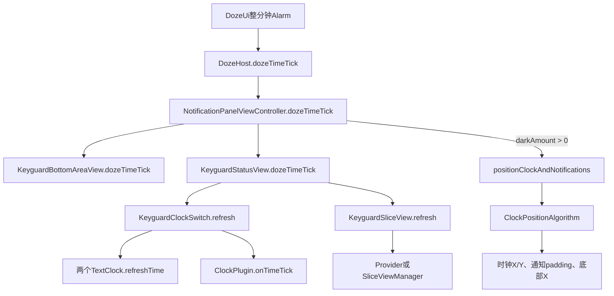
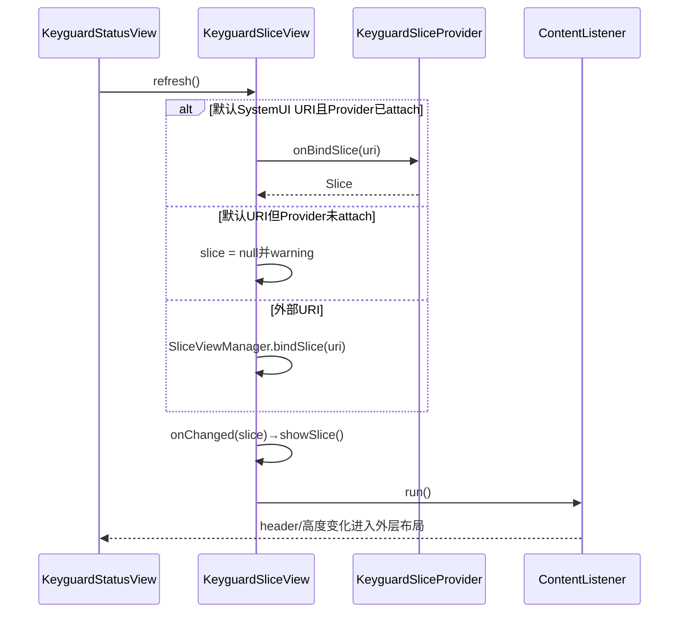
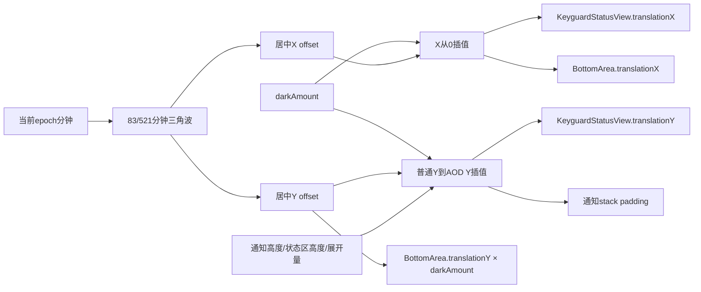

# 第 473 章 Android SystemUI KeyguardStatusView、KeyguardClockSwitch 与 KeyguardSliceView：AOD 时间、Slice 和 Burn-in 刷新链

> 源码基线：Android 11 / API 30 / `android-11.0.0_r48`。本章只在 macOS 阅读，不实际编译。核心文件：`KeyguardStatusView.java`、`KeyguardClockSwitch.java`、`KeyguardSliceView.java`、`KeyguardSliceProvider.java`、`NotificationPanelViewController.java`、`KeyguardClockPositionAlgorithm.java`、`KeyguardBottomAreaView.java`、`BurnInHelper.kt` 以及对应本地测试。

## 1. 本章解决什么问题

AOD 屏幕看似只是每分钟换一次数字，源码却同时刷新默认时钟、插件时钟、日期/媒体 Slice、底部提示和防烧屏位置。本章要回答：tick 从哪里进来，各对象各改什么，Slice 为什么既有 LiveData 又会主动绑定，时区与格式怎样更新，以及“内容刷新”和“坐标刷新”为何必须分开理解。

## 2. 先纠正类名

Android 11 r48 这条链没有独立的 `ClockView.java`。`KeyguardStatusView` 中名为 `mClockView` 的字段，实际类型是 `KeyguardClockSwitch`；它内部再持有两个默认 `TextClock` 和可选 `ClockPlugin`。读源码时应以真实类型为准，不能被变量名误导。

## 3. 一句话主线

`DozeUi` 的整分钟闹钟最终调用面板 `dozeTimeTick()`：底部区域重算 Y 位移，状态区刷新两个默认时钟、插件和 Slice；仅当暗屏插值量大于 0 时，面板再跑时钟位置算法，把 X/Y、通知顶部间距及底部 X 位移一起更新。

## 4. 本章对象地图

`NotificationPanelViewController` 是总协调者；`KeyguardStatusView` 是时钟与状态区容器；`KeyguardClockSwitch` 选择默认或插件时钟；`KeyguardSliceView` 把 Slice 模型变成标题和若干按钮；`KeyguardSliceProvider` 生产日期、媒体、闹钟、勿扰数据；位置算法只计算，不直接改 View。

## 5. 不要把三种刷新混成一种

第一种是“内容刷新”，例如 `TextClock.refreshTime()`；第二种是“模型重绑”，即 Slice 再次生成并解析；第三种是“布局坐标刷新”，即 Burn-in 偏移与通知 padding 重算。三者可能在同一次 tick 中发生，但触发条件、失败方式和输出完全不同。

## 6. 为什么 AOD 需要主动 tick

设备进入 Doze 后，普通每分钟广播和主线程执行机会不能被当作稳定时钟源。上一章的 `DozeUi` 用精确 Alarm 对齐下一分钟，并用 WakeLock 包住回调；本章从 Host/面板收到 tick 后继续向 UI 下钻。

## 7. 本章的线程假设

这些 View 与面板控制器通常在 SystemUI 主线程执行。`KeyguardSliceProvider.onBindSlice()` 标注 `@AnyThread` 并用同步保护字段，但 `KeyguardSliceView.refresh()` 本身没有切后台；默认同进程路径会在当前调用栈直接构建 Slice。

## 8. 先看完整调用图



## 9. 入口并非 KeyguardStatusView 自己定时

`KeyguardStatusView` 没有 Alarm，也不计算下一分钟。它只是一个被动接收者。真正的时间计划在 Doze 层完成，这种分层让 View 不必知道设备能否休眠、闹钟是否需要 WakeLock。

## 10. 阅读时先建立输出表

一次 tick 至少可能改变：普通时钟文字、粗体时钟文字、插件时钟内部状态、Slice 标题/行、底部提示 Y、状态区 X/Y、通知列表顶部 padding、底部提示 X。以后排查“时间没更新”时要先问是哪一个输出没更新。

## 11. 面板入口的精确顺序

面板先更新底部 Y，再更新状态区内容，最后视暗屏量决定是否重算整体位置。顺序意味着 Slice 内容变化可能先触发布局监听，而完整位置算法随后又以新高度计算一次；不能假设坐标先定、内容后填。

## 12. 面板入口源码

```java
public void dozeTimeTick() {
    mKeyguardBottomArea.dozeTimeTick();
    mKeyguardStatusView.dozeTimeTick();
    if (mInterpolatedDarkAmount > 0) {
        positionClockAndNotifications();
    }
}
```

短短五行体现三个边界：底部和状态区始终刷新；完整布局有条件；条件使用插值后的 `darkAmount`，不是简单 boolean `isDozing`。

## 13. 为什么条件是大于零

只要 AOD/Doze 过渡已开始，即使尚未完全暗屏，也要逐步混入防烧屏坐标。完全清醒且暗屏量为 0 时，每分钟重新跑完整锁屏位置算法没有必要，内容仍可由正常时间事件更新。

## 14. 浮点条件的含义

源码没有要求 `darkAmount == 1`。过渡中的 0.01 也会进入位置计算，因此 Burn-in 偏移随暗屏量插值渐入，而不是屏幕进入 AOD 瞬间跳动。

## 15. onScreenTurningOn 是另一条入口

`NotificationPanelViewController.onScreenTurningOn()` 只调用 `mKeyguardStatusView.dozeTimeTick()`。它会补刷新时钟和 Slice，却不调用底部 `dozeTimeTick()`，也不在该方法里跑位置算法。不能把它等同于完整的 Doze tick。

## 16. 为什么亮屏前也补一次内容

设备休眠期间 UI 可能错过普通广播。屏幕即将点亮时主动刷新，能减少用户看到旧分钟或旧 Slice 的机会；这是一条“展示前校准”路径，而不是新的周期调度器。

## 17. KeyguardStatusView 的职责边界

它负责组合时钟、Slice、owner info 和 logout 视图，也监听 KeyguardUpdateMonitor 与配置变化。本章聚焦时间/Slice，但要记住它不是纯时钟控件，尺寸变化会影响下游位置算法所用的整个状态区高度。

## 18. dozeTimeTick 的两步顺序

`KeyguardStatusView.dozeTimeTick()` 先 `refreshTime()`，后 `mKeyguardSlice.refresh()`。因此若自定义 ClockPlugin 的 `onTimeTick()` 未捕获异常并向外抛出，Slice 刷新不会继续执行；源码没有 `try/finally` 隔离。

## 19. StatusView 的核心源码

```java
public void dozeTimeTick() {
    refreshTime();
    mKeyguardSlice.refresh();
}

private void refreshTime() {
    mClockView.refresh();
}

private void updateTimeZone(TimeZone timeZone) {
    mClockView.onTimeZoneChanged(timeZone);
}
```

这里的 `mClockView` 是 `KeyguardClockSwitch`，所以 `refreshTime()` 不是只改一个 TextView，而是进入“默认双时钟 + 插件”的分发器。

## 20. 正常时间变化也能刷新

`KeyguardUpdateMonitorCallback.onTimeChanged()` 同样调用 `refreshTime()`。Doze tick 是低功耗场景的保障路径，并没有取代系统时间回调；清醒锁屏主要仍可由普通时间变化驱动。

## 21. 锁屏重新可见也补刷新

`onKeyguardVisibilityChanged(true)` 会刷新时间、owner info 和 logout 视图。可见性入口解决的是“重新展示时数据可能过期”，与整分钟节拍的目标不同。

## 22. 时区变化走专门路径

`onTimeZoneChanged(TimeZone)` 调 `updateTimeZone()`，最终只显式通知 ClockPlugin。两个默认 `TextClock` 依靠自身的时间/时区监听机制更新，不能据此误判默认时钟完全不处理时区。

## 23. 时区与格式不是同一事件

时区决定同一时刻显示哪个本地时间；12/24 小时格式决定字符串样式。SystemUI 把插件时区回调与 `refreshFormat()` 分开，后者为两个格式字段重新计算 pattern。

## 24. Patterns 为什么静态缓存

格式计算要调用 ICU `DateFormat.getBestDateTimePattern()`。`Patterns` 用 locale 与 skeleton 组成的 key 避免重复计算，并同时缓存 12 小时和 24 小时 pattern；它缓存的是格式模板，不是当前时间文本。

## 25. skeleton 不是最终 pattern

资源中的 skeleton 描述希望出现哪些时间字段，ICU 再按 Locale 排列顺序、分隔符与日夜标记。例如同样的小时和分钟，在不同语言环境中可能生成不同最终 pattern。

## 26. 为什么可能移除 a

若 12 小时 skeleton 不包含 `a`，代码会从 ICU 结果移除 AM/PM 标记。这样资源可以控制锁屏是否显示日夜标志；但这是字符串正则替换，阅读时应知道它不是 ICU 字段级 AST 操作。

## 27. fancy colon 是什么

最终 pattern 把普通冒号替换为私有字符 `\uee01`，让字体使用专门设计的分隔符字形。这只改变展示字形，不改变时间计算和 tick 节奏。

## 28. 用户切换也会影响格式

12/24 小时偏好按用户读取。用户切换回调会重新加载相关信息并刷新格式；只盯 Locale 或 TimeZone 会漏掉多用户场景。

## 29. 配置变化影响字号和高度

密度或字体缩放变化时，StatusView 调用 `KeyguardClockSwitch.setTextSize()`、更新 owner info 字号和底部 margin。高度改变后，位置算法下一次执行会拿到新的 `KeyguardStatusView` 高度。

## 30. 一个值得留意的字号边界

Android 11 r48 的 `KeyguardClockSwitch.setTextSize()` 只对普通 `mClockView` 调 `setTextSize()`，没有同步修改 `mClockViewBold`。源码事实只能说明存在不对称；是否造成实际视觉问题还取决于布局资源、样式和重新膨胀，不能直接断言必现 bug。

## 31. KeyguardClockSwitch 不是简单开关

它同时管理默认普通时钟、默认粗体时钟、自定义小钟、自定义大钟、状态区显隐、壁纸颜色、暗屏量与通知存在状态。“Switch”指的是多种表盘/布局之间的选择。

## 32. 为什么有两个默认 TextClock

Slice 出现媒体 header 时，默认时钟可从普通样式切换到粗体样式，以配合状态区结构变化。两者是不同 View，而不是对一个 TextClock 临时改 Typeface。

## 33. refresh 为什么两个都更新

无论当前哪个默认时钟可见，`refresh()` 都调用两者的 `refreshTime()`。这样切换样式时隐藏的那个已经是最新时间，不会先显示旧文本再等待下一 tick。

## 34. ClockSwitch 刷新源码

```java
public void refresh() {
    mClockView.refreshTime();
    mClockViewBold.refreshTime();
    if (mClockPlugin != null) {
        mClockPlugin.onTimeTick();
    }
    if (Build.IS_DEBUGGABLE) {
        Log.d(TAG, "Updating clock: " + mClockView.getText());
    }
}

public void onTimeZoneChanged(TimeZone timeZone) {
    if (mClockPlugin != null) {
        mClockPlugin.onTimeZoneChanged(timeZone);
    }
}
```

日志打印的是默认普通 TextClock 文本，即使当前显示的是粗体或插件。因此日志“正确”不等于用户眼前的插件一定正确。

## 35. 插件时间由谁计算

SystemUI 只通知 `ClockPlugin.onTimeTick()`，不会把格式化后的时间字符串传进去。插件必须自己读取时间、格式化和刷新其 View；插件实现错误可以只影响插件表盘而不影响默认 TextClock。

## 36. 插件异常没有隔离

`onTimeTick()` 周围没有 catch。第三方/内置插件若抛 RuntimeException，当前主线程调用链会中断，甚至影响 SystemUI 稳定性。插件接口扩展了能力，也扩大了故障面。

## 37. 插件连接时先拆旧表盘

`setClockPlugin()` 会从容器移除旧小钟、清空大钟容器、调用旧插件 `onDestroyView()`，再把字段设 null。拆除发生在新插件安装之前，所以切换不是事务式原子替换。

## 38. plugin 为 null 时恢复默认

无插件时，根据 `mShowingHeader` 决定普通或粗体默认时钟可见，并让状态区重新可见。这里恢复的是 SystemUI 自己的 fallback。

## 39. 插件小 View 可以为 null

若 `plugin.getView()` 返回 null，代码不会隐藏两个默认 TextClock；但插件对象仍可被安装，大钟也可能存在。不能用“mClockPlugin 非空”直接推出小钟一定来自插件。

## 40. 插件大 View 是独立出口

`getBigClockView()` 返回的 View 加入 `mBigClockContainer`，它位于通知列表和 StatusView 后方的专门容器。小钟与大钟可以由同一插件提供，但生命周期和可见性判断并不相同。

## 41. 大钟何时显示

大钟要求容器中确有 child，并且状态是 KEYGUARD 或 SHADE_LOCKED。通知存在、暗屏量和 bypass 等还会影响 alpha/布局，不应把“已 addView”当成“用户一定可见”。

## 42. 插件可以隐藏状态区

`shouldShowStatusArea()` 为 false 时，整个 Keyguard status area 会隐藏。这可能连带 Slice 消失；它不是只隐藏日期的一项配置。

## 43. 插件初始化参数

安装后 SystemUI 依次传入 Paint style、当前文字颜色、darkAmount 和可用的壁纸色板。插件必须把这些参数投影到自己的 View，SystemUI 不会自动修改插件内部控件。

## 44. 壁纸颜色如何到插件

ClockSwitch 监听锁屏壁纸颜色提取器，获得是否支持深色文字与 color palette，再更新默认/插件表盘。颜色刷新与每分钟 tick 是并列事件，不由 tick 触发。

## 45. darkAmount 如何到插件

StatusView/面板在 Doze 过渡中传递暗屏量，ClockSwitch 再调用插件 `setDarkAmount()`。这决定视觉插值；它与 Burn-in 的坐标插值共享概念，但不是同一方法。

## 46. Slice header 会驱动默认表盘切换

`KeyguardSliceView` 的内容变化监听器会让外层知道是否存在 header，ClockSwitch 据此切普通/粗体默认时钟。因而 Slice 不只提供一行文字，也会改变时钟样式和整体高度。

## 47. 这个切换为什么需要动画 WakeLock

默认表盘切换使用 Transition，并配合 `KeepAwakeAnimationListener`。AOD 中 CPU 可能在动画未完成时挂起，短时保持唤醒可让 View 到达目标状态；它不是长期阻止 Doze。

## 48. ClockManager 的监听生命周期

ClockSwitch attach 时注册 ClockManager、StatusBarStateController 与颜色提取器回调；detach 时对称移除，并将插件设为 null。泄漏排查应确认 attach/detach 是否配对，而不是只检查插件字段。

## 49. 测试覆盖告诉我们什么

`KeyguardClockSwitchTest` 有 18 个 `@Test`，主要覆盖插件加入/移除、默认和大钟可见性、通知/状态等；它没有完整证明每分钟 tick、时区与插件异常路径。测试数是阅读线索，不是质量结论。

## 50. ClockSwitch 的心智模型

把它看成“表盘适配器 + View 容器协调器”：上游只说 refresh、timezone、dark、color；它将事件分发给默认 TextClock 或 ClockPlugin，并维护多套 View 的显示关系。

## 51. KeyguardSliceView 展示什么

它位于时钟下方，可展示日期，或媒体标题 header 与歌手行，还可追加下一闹钟、勿扰图标。Provider 总会附加一个满足 Slice API 的 primary action 行，但 View 会把该 action 行过滤掉。

## 52. 默认 Slice URI

默认地址是 `content://com.android.systemui.keyguard/main`。View 允许 Tuner 的 `Settings.Secure.KEYGUARD_SLICE_URI` 改成其他 URI，因此源码同时保留同进程快速路径和通用 Slice 绑定路径。

## 53. setupUri 做了什么

若传入 null，恢复默认 URI；若旧 LiveData 正在 active，先移除 observer；然后解析新 URI、创建新 LiveData，最后仅在先前确实观察时重新 `observeForever()`。

## 54. Tuner 回调为什么重要

构造函数没有初始化 `mKeyguardSliceUri`。attach 时 `TunerService.addTunable()` 通常会立即回调当前值，从而调用 `setupUri()`；测试则显式调用 setup。若脱离正常生命周期直接过早调用 `refresh()`，对 null URI 的访问存在风险。

## 55. 主显示才 observeForever

attach 后读取 Display ID，只有 `DEFAULT_DISPLAY` 才对 LiveData 调 `observeForever(this)`。这是源码中的多显示限制：非默认显示不会通过此 observer 自动接收 Slice 变化。

## 56. detach 的对称清理

只有记录为默认显示时移除 observer，然后移除 Tuner 和 ConfigurationController 回调。`observeForever` 不受 LifecycleOwner 自动清理，手动 remove 是必要的。

## 57. LiveData 与主动 refresh 为什么并存

ContentResolver 的变化通知可让 LiveData 异步推新数据；而 Doze tick 需要在确定时刻立即拿到最新日期/媒体模型，所以主动绑定并直接 `onChanged()`。前者事件驱动，后者节拍校准。

## 58. 默认 URI 的同进程优化

View 调 `KeyguardSliceProvider.getAttachedInstance()`，非空时直接执行 `instance.onBindSlice(uri)`。这避开 Binder，但也意味着 Slice 构建在调用 `refresh()` 的当前线程同步完成。

## 59. Provider 尚未 attach 时

默认路径若拿不到实例，会记录 warning，把 `slice` 设 null，再调用 `onChanged(null)`。结果是隐藏旧标题和行，而不是保留上次内容或排队重试。

## 60. 外部 URI 的路径

非默认 URI 使用 `SliceViewManager.getInstance(context).bindSlice(uri)`。这条通用路径可能跨进程并产生 Binder/Provider 开销，仍在当前 `refresh()` 调用栈中完成；源码没有为它显式切后台。

## 61. refresh 的同步时序图



## 62. onChanged 不做去重

无论新 Slice 与旧 Slice 是否内容相同，`onChanged()` 都赋值并调用 `showSlice()`。每分钟主动 refresh 因此会重新解析和回调内容监听器，不能假定相同内容自动短路。

## 63. null Slice 的 UI 结果

标题 GONE、行 GONE、`mHasHeader=false`，然后仍调用内容变化监听器。通知监听器非常重要，因为隐藏内容会改变 StatusView 高度与时钟样式。

## 64. 非 null 先清点击映射

`mClickActions.clear()` 后重新从 Slice 行构建 View→PendingIntent 映射。复用旧 View 不等于沿用旧点击动作；动作会在每次展示中覆盖。

## 65. ListContent 的作用

AndroidX `ListContent` 把通用 Slice 树解释成 header 与 row items。KeyguardSliceView 依赖该语义层，而不是自己遍历所有底层 SliceItem；这也是 header 可能同时出现在 rowItems 中的原因。

## 66. header 判断不是只看非空

`lc.getHeader()` 非空且其 SliceItem 不带 `HINT_LIST_ITEM`，才设置 `mHasHeader=true`。普通第一行也可能被 ListContent 视作 headerContent，但 list-item hint 会让它按行展示。

## 67. 为什么有 startIndex

代码把过滤后的 rowItems 收进 `subItems`；若存在真正 header，循环从索引 1 开始，跳过已用 `mTitle` 展示的首项。这里基于 ListContent 的行列表包含 header 的约定，不应擅自删除这个偏移。

## 68. action 行为什么过滤

Provider 为满足 Slice API 添加 URI 为 `KEYGUARD_ACTION_URI` 的 primary action 行，并明确注释 Keyguard 自己不会展示它。View 按 URI 过滤，防止空 action 行变成锁屏按钮。

## 69. header 怎样变成标题

从 `RowContent.getTitleItem()` 取文字放入 `mTitle`；若 header 自带 primary action，则保存 PendingIntent。默认媒体 header 没有这里的点击动作也没关系，标题仍可展示。

## 70. 行 View 怎样复用

每个业务行以其 Slice URI 作为 tag，在 `mRow` 中查找同 tag 的 `KeyguardSliceTextView`。找到就复用，找不到才创建并插入目标索引，减少每分钟刷新时不必要的对象重建。

## 71. URI 是 UI 身份键

日期、闹钟、DND、媒体各有稳定 URI，因此内容文本变了仍能复用同一个 View。若两个语义不同的行误用同一 URI，会发生身份冲突；Provider 设计 URI 时就承担了稳定 key 的职责。

## 72. 文本、描述与字号都重设

复用后仍更新 title、contentDescription 和 textSize。header 存在时使用另一套行字号与 top margin，使媒体布局与普通日期布局有不同层级。

## 73. 图标加载是同步的

代码查找第一个 image SliceItem，调用 `icon.getIcon().loadDrawable(mContext)`，再按目标高度等比计算宽度并 setBounds。每次展示都可能产生 drawable 加载成本，源码没有异步缓存层。

## 74. 防止零宽图标

算出的宽度用 `Math.max(width, 1)`，避免极端 intrinsic 比例或整数截断得到 0。高度固定为资源定义的 iconSize。

## 75. 点击怎样穿过锁屏

有 PendingIntent 才把 View 标记 clickable；点击后调用 `ActivityStarter.startPendingIntentDismissingKeyguard(action)`。View 不自己处理解锁或直接 `PendingIntent.send()`，由 SystemUI 的 ActivityStarter 协调锁屏退出。

## 76. 旧 View 怎样删除

完成新映射后遍历现有 children，不在 `mClickActions` 中的就 remove，并递减索引继续。先复用/创建、后清旧项，能让 LayoutTransition 对变更做动画。

## 77. 内容监听器的时机

所有标题、行、点击映射和旧 View 清理完成后才运行 listener。它看到的是新结构；null 分支也运行。listener 本身同步执行，若做重活会延长 Doze tick。

## 78. Slice 暗色插值

`getTextColor()` 用 `ColorUtils.blendARGB(mTextColor, Color.WHITE, mDarkAmount)`。暗屏量 0 使用壁纸适配文字色，暗屏量 1 变白，中间连续插值。

## 79. Row 的 darkAmount 还有动画职责

Row 不仅存颜色。它根据从清醒到非清醒的边界切换 LayoutAnimationListener，在需要时使用 KeepAwakeAnimationListener，确保 AOD 内容变更动画能完成。

## 80. 变量名 isAwake 有迷惑性

Row 中 `boolean isAwake = darkAmount != 0` 从命名看容易反直觉：darkAmount 非零通常表示正在靠近 Doze/AOD。学习时应以条件和 listener 设置结果为准，不要只按局部变量名推导业务状态。

## 81. Provider 的 Slice 构成

若媒体应显示，设置媒体标题为 header，并可加歌手行；否则加日期行。随后可加未来 12 小时内的闹钟、DND 图标，最后总加 primary action 占位行。

## 82. 日期何时生成

Provider 保存可复用 Date 和 ICU DateFormat。`updateClockLocked()` 格式化当前时间，只有文本与 `mLastText` 不同才 `notifyChange()`；但 View 主动 `onBindSlice()` 即使没有 notify 也能读到现有字段。

## 83. 日期变化与分钟变化的区别

Provider 注册 DATE_CHANGED、LOCALE_CHANGED 和 KeyguardUpdateMonitor 时间/时区回调。日期文本通常一天变化一次，而时钟数字每分钟变化；所以 Provider 不需要每分钟都因日期相同而发 ContentResolver 通知。

## 84. Locale 变化先清格式缓存

收到 Locale 改变只把 `mDateFormat=null`，下一次格式化才按新 Locale 创建。时区变化同样清缓存；后续时间回调或主动绑定时是否立即重算，要结合 `updateClockLocked()` 调用位置看，不能只看 cache 清空。

## 85. 下一闹钟的 12 小时窗口

Provider 只展示触发时间不晚于当前时间加 12 小时的 next alarm。若闹钟还在窗口外，会安排一个 RTC exact alarm，在进入 12 小时窗口时调用 `updateNextAlarm()`。

## 86. 窗口判断的边界

`withinNHoursLocked()` 只比较 `triggerTime <= limit`，没有显式检查 triggerTime 是否已经过去；正常 NextAlarmController 应提供未来闹钟。阅读局部函数时不要忽略上游数据契约。

## 87. 闹钟格式按当前用户

Provider 用 `ActivityManager.getCurrentUser()` 查询 24 小时偏好，再选择 `HH:mm` 或 `h:mm`。这是 Slice 内容与多用户状态的连接点。

## 88. DND 行为什么可能只有图标

DND RowBuilder 设置 contentDescription 并添加结束图标，没有 title 文本。KeyguardSliceTextView 仍设置无障碍描述，视觉上可只显示图标；不能用“title 为空”判定该行无意义。

## 89. 媒体显示不是 metadata 非空就够

还要求 media visible，并且满足 dozing、bypass+always-on，或处于 SHADE 且媒体可见等条件。`needsMediaLocked()` 把播放器状态、StatusBar 状态、AOD 配置与 bypass 综合起来。

## 90. 停止媒体为什么延迟两秒

在非 SHADE 场景，媒体从可见变不可见会延迟更新，避免播放器短暂 buffering/状态抖动导致 header 消失再出现。期间用 SettableWakeLock 保证延迟任务能完成。

## 91. 延迟更新不是固定保留旧数据

新的 metadata/state 到来会先 `removeCallbacksAndMessages(null)`，再按当前条件决定立即或再次延迟。它是可取消的去抖逻辑，不是无条件睡两秒。

## 92. Provider 单例指针的用途

`sInstance` 只为了 SystemUI View 的同进程快速访问。创建新 Provider 时会销毁旧实例，再赋当前实例；销毁时清回调、闹钟、WakeLock 和静态指针。

## 93. onBindSlice 的锁边界

整个 ListBuilder 组装在 `synchronized(this)` 中，确保日期、媒体、闹钟和 Doze 状态形成相对一致的快照。构建期间其他回调会等待，故不宜在锁内加入昂贵 I/O。

## 94. notifyChange 只发“数据可能变了”

Provider 调 `ContentResolver.notifyChange(mSliceUri, null)`，不携带新 Slice。observer 收到后还需重新 bind；主动 tick 路径则直接 bind。通知与数据载体要分开理解。

## 95. Provider 测试覆盖

`KeyguardSliceProviderTest` 有 14 个 `@Test`，覆盖创建注册、日期/时区、闹钟、媒体等关键逻辑；但并不替代 View 对 ListContent 解释和动画生命周期的测试。

## 96. Burn-in 不是随机抖动

`getBurnInOffset()` 以 `System.currentTimeMillis()/60000f` 作为相位，输入周期性三角波，返回 0 到 amplitude 的整数。相同时间相位会得到确定结果，不调用随机数。

## 97. X 与 Y 为什么不同周期

X 使用 83 分钟，Y 使用 521 分钟。两个不同且不易短期对齐的周期让二维轨迹长期变化，避免总在少数固定点往返。

## 98. 居中偏移怎样得到

调用方把 amplitude 传成 `offset*2`，再减去 `offset`，于是原本 `[0, 2d]` 变成近似 `[-d, d]`。整数截断使端点/步进未必完美对称，但范围语义成立。

## 99. 墙上时钟跳变会影响相位

相位直接取 `System.currentTimeMillis()`，不是 `elapsedRealtime()`。手动校时或网络时间修正可能令偏移跳到另一个相位；单纯改变时区通常不改变 epoch 毫秒，因此通常不会改变 Burn-in 相位。

## 100. 底部区域的 Y 位移

`KeyguardBottomAreaView.dozeTimeTick()` 计算居中的 Y offset，再乘 `mDarkAmount` 设置 indication area translationY。清醒时为 0，AOD 时用完整偏移，过渡中平滑混入。

## 101. 底部 X 从哪里来

底部区域不独立计算 X；面板运行时钟位置算法后，把 `mClockPositionResult.clockX` 传给 `setAntiBurnInOffsetX()`。这样时钟状态区与底部提示共享相同 X 偏移。

## 102. 位置算法的输入

输入包括状态栏最小高度、可用底边、通知内容高度、面板展开比例、父高度、状态区高度、插件首选 Y、是否自定义时钟、是否有通知、darkAmount、空白拖动量、bypass 和解锁 padding。

## 103. 普通锁屏的 Y

展开锁屏会在可用高度中综合通知栈高度、状态区高度权重 0.7 和边距，结果夹在最小顶边与屏幕中线约束内。通知越多，时钟通常越向上让空间。

## 104. AOD 的 Y

暗屏目标为自定义时钟首选 Y，或默认时钟的 `屏幕高度/2 - 状态区高度 - 边距`，再加 Y burn-in。结果至少夹到 0，避免移出屏幕顶端。

## 105. 过渡怎样插值

先按面板展开比例在 bouncer 外位置与正常锁屏位置之间插值，再按 darkAmount 在普通锁屏 Y 与暗屏 Y 之间插值，最后加空白拖动量。多个插值层不能简化成一个固定坐标。

## 106. Bypass 的特殊处理

若 bypass 开启且不是自定义时钟，位置算法把有效 darkAmount 强制为 1，让时钟按暗屏布局；通知 padding 则可直接使用 unlocked padding。这里体现人脸解锁绕过锁屏交互对布局的影响。

## 107. X 位移怎样插值

算法先计算居中的 X burn-in offset，再从 0 到该值按 `mDarkAmount` 插值。清醒锁屏 X 为 0，AOD 才逐渐移动；结果转换为 int 后写入状态区 X property。

```java
public void run(Result result) {
    final int y = getClockY(mPanelExpansion);
    result.clockY = y;
    result.clockAlpha = getClockAlpha(y);
    result.stackScrollerPadding = mBypassEnabled ? mUnlockedStackScrollerPadding
            : y + mKeyguardStatusHeight;
    result.stackScrollerPaddingExpanded = mBypassEnabled ? mUnlockedStackScrollerPadding
            : getClockY(1.0f) + mKeyguardStatusHeight;
    result.clockX = (int) interpolate(0, burnInPreventionOffsetX(), mDarkAmount);
}
```

`Result` 是一次纯计算的输出容器；真正写 View 由面板完成。这种分离使 23 个位置算法测试无需创建完整通知面板。

## 108. 通知 padding 与时钟坐标一起算

`stackScrollerPadding`/`stackScrollerPaddingExpanded` 由时钟 Y 和状态区高度派生。防烧屏移动不能只改时钟而完全忘记通知列表，否则两者间距会不一致。

## 109. 完整位置数据流图



## 110. 测试如何约束位置算法

`KeyguardClockPositionAlgorithmTest` 有 23 个 `@Test`，覆盖 AOD/锁屏、状态区与通知高度、拖动、透明度、custom clock、bypass 等。Burn-in 测试常因测试资源 offset 为 0 而看到 X=0，不能据此认为真机永远不横移。

## 111. 本章复读后的排错顺序

先确认 DozeUi tick 是否到面板；再区分默认 TextClock、插件还是 Slice 旧；检查 Provider 实例/URI 与 `onChanged()`；若内容正确但位置不动，检查 `mInterpolatedDarkAmount`、算法输入和 PropertyAnimator；最后检查底部 X/Y 是否分别来自算法与自身 tick。按数据面排查比泛查“时间刷新”更快。

## 112. macOS 只读练习一：追一次 tick

在源码根目录执行只读检索：`rg -n "dozeTimeTick\(\)" frameworks/base/packages/SystemUI/src/com/android frameworks/base/packages/SystemUI/src/com/android/systemui/statusbar/phone`。按 DozeUi→Host→面板→StatusView/BottomArea 顺序记录文件与行号，不修改任何文件，也不编译。

## 113. macOS 只读练习二：验证默认双时钟

执行 `sed -n '382,414p' frameworks/base/packages/SystemUI/src/com/android/keyguard/KeyguardClockSwitch.java`，回答：隐藏的默认时钟是否刷新、插件通过什么回调刷新、debug 日志读取哪个 View。再查 `setTextSize`，记录普通/粗体字号更新是否对称。

## 114. macOS 只读练习三：手工模拟 Burn-in

阅读 `BurnInHelper.kt` 与 `KeyguardClockPositionAlgorithm.java`，任选两个相隔一分钟的 epoch-minute，按三角波公式只在纸上推演 offset 变化。重点写出 `[0,2d]` 为什么减 d 后成为 `[-d,d]`；不运行 Android、不编译。

## 115. macOS 只读练习四：构造 Slice 清单

只读查看 `KeyguardSliceProvider.onBindSlice()` 与 `KeyguardSliceView.showSlice()`，分别列出“无媒体”和“有媒体+歌手+闹钟+DND”时的 builder 项，再标出 header、被过滤 action 行、最终可复用 View 的 URI。不要只凭 UI 截图猜结构。

## 116. 最容易误解的五点

第一，`mClockView` 实际是 ClockSwitch；第二，tick 不只更新时间文字；第三，默认 TextClock 的时区不只靠 ClockSwitch 显式回调；第四，Burn-in 是确定性三角波而非随机；第五，面板只在 darkAmount>0 时随 tick 跑完整位置算法。

## 117. 可改进但本章不修改的地方

可考虑给 ClockPlugin 回调做异常隔离、让 `setTextSize()` 对两个默认 TextClock 对称、给 Slice refresh 的未初始化 URI 提供显式防护、对外部 Slice 绑定评估异步化，并增加 tick→Slice→布局的集成测试。本章只读学习，不把建议伪装成现有实现。

## 118. 用一句因果链复述

精确分钟闹钟给 SystemUI 一次短暂执行机会；面板把机会分给内容和位置；ClockSwitch 更新所有可能表盘，SliceView 同步重建锁屏信息，位置算法用当前分钟相位与界面状态计算缓慢漂移，从而同时保证“时间新”和“像素不长期停在原处”。

## 119. 本章检查题

你应能回答：为什么两个 TextClock 都刷新？Provider 未 attach 时旧 Slice 是否保留？外部 Slice 是否必然后台绑定？时区变化为何只显式通知插件仍不代表默认时钟失效？BottomArea 的 X/Y 分别来自哪里？为什么清醒时 tick 可刷新内容却不必运行位置算法？

## 120. 下一章

下一章阅读 `KeyguardIndicationController`、`KeyguardBottomAreaView` 与锁屏提示消息链：梳理充电、信任、指纹、企业披露、临时 indication 的优先级、超时、WakeLock、AOD 可见性和点击边界。
