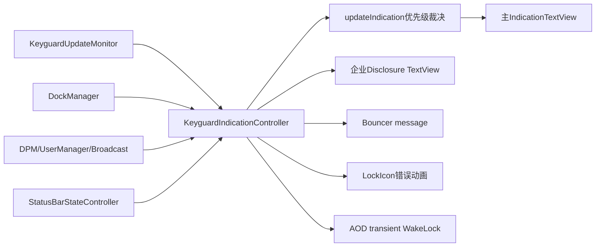
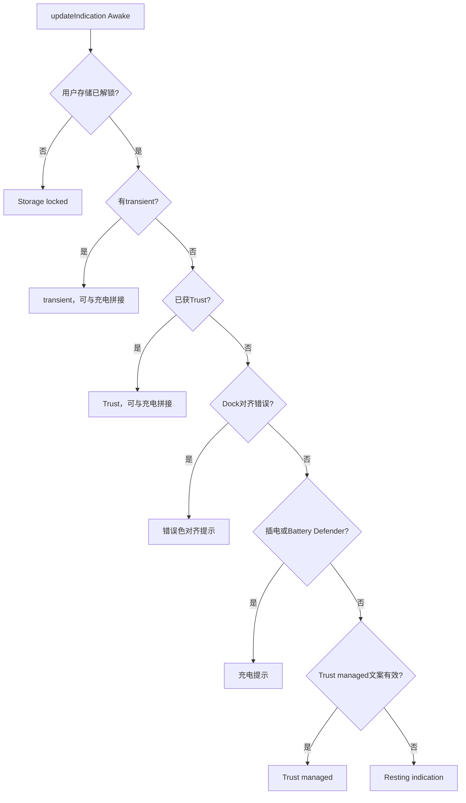
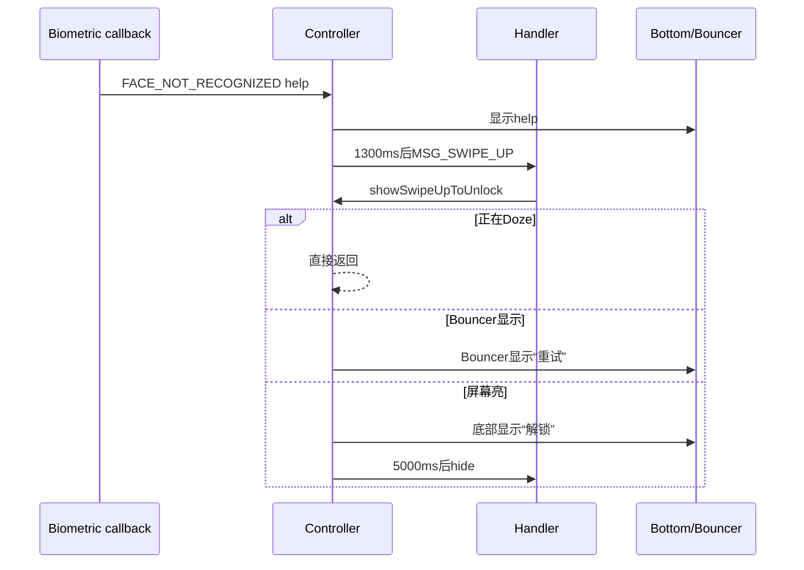

# 第 474 章 Android SystemUI KeyguardIndicationController 与 KeyguardIndicationTextView：锁屏提示优先级、超时和 WakeLock 链

> 源码基线：Android 11 / API 30 / `android-11.0.0_r48`。本章只在 macOS 阅读，不实际编译。核心文件：`KeyguardIndicationController.java`、`KeyguardIndicationTextView.java`；交叉阅读 `KeyguardBottomAreaView.java`、`KeyguardUpdateMonitor.java`、`BatteryStatus.java`、`SettableWakeLock.java`、`StatusBarKeyguardViewManager.java` 及本地测试。

## 1. 本章解决什么问题

锁屏底部同一位置可能显示电量、充电速度、剩余时间、指纹/人脸错误、信任状态、无线充电对齐或默认提示。它们如何竞争？AOD 为什么要拿 WakeLock？熄屏时的生物错误去哪了？企业披露为何是另一条 View？本章用源码优先级回答。

## 2. 一句话主线

Controller 缓存各事实，事件到来只更新字段并调用 `updateIndication()`；该方法按 Awake/AOD 两张不同优先级表选出一条主提示，交给 TextView；短暂提示在 AOD 持 WakeLock 并强制五秒清除，企业披露则由独立 TextView 与 Doze alpha 控制。

## 3. 先区分两个文字出口

`mTextView` 显示电量、充电、临时、生物和信任等主提示；`mDisclosure` 显示“设备由组织管理”。两者同在 indication area，但不是同一个优先级槽，Disclosure 不经过主 `updateIndication()` 的 if/else 选择。

## 4. Controller 是裁决器不是队列

源码没有保存多条待轮播消息。它只有一个 `mTransientIndication` 单槽，加若干长期事实字段；每次刷新重新按顺序选择。后来的 transient 会覆盖先前 transient，不会排在队尾。

## 5. 主要输入源

KeyguardUpdateMonitor 提供电池、时间、生物、信任、用户与屏幕事件；StatusBarStateController 提供 Doze；KeyguardStateController 提供 unlocked 变化；DockManager 提供对齐；DPM/UserManager/Broadcast 提供企业披露。

## 6. 主要输出

输出包括主 TextView 的文字、颜色和可见性，Disclosure 的文字/alpha/可见性，LockIcon 的短暂错误状态，Bouncer 上的消息，以及一个 SettableWakeLock 的持有状态。

## 7. 主线程模型

Controller 构造 `new Handler()`，绑定构造线程 Looper；SystemUI 正常注入在主线程。Dock 对齐 listener 明确 `mHandler.post()`，将可能的外部回调归一到 Handler；其他 Keyguard 回调通常已由 Monitor 归一化。

## 8. 总体架构图



## 9. setIndicationArea 才接上真实 View

构造时先注册数据回调，`setIndicationArea()` 才查找两个 TextView、保存初始文字颜色并做首次刷新。若事件在 View 接入前回调并访问 mTextView，存在初始化顺序依赖；正常 StatusBar 装配保证顺序。

## 10. mVisible 是逻辑总门

`updateIndication()` 在释放可能不再需要的 WakeLock 后，若 `mVisible=false` 就返回。隐藏时仍可缓存电池/错误事实，但不会立刻修改主文字。

## 11. setVisible(true) 不总清 transient

若 Handler 尚有 `MSG_HIDE_TRANSIENT`，说明一条带超时提示仍有效，重新显示时保留；否则先清 transient 再刷新。这避免暂时隐藏/重显把仍应展示的错误过早抹掉。

## 12. setVisible(false) 会清 transient

锁屏消失时立即 `hideTransientIndication()`，避免快速回到锁屏看到上次错误。清除还会移除 hide 消息并触发 WakeLock 释放。

## 13. Awake 与 AOD 是两张表

Awake 表关注存储未解锁、transient、trust、对齐、充电、resting；AOD 表更简洁：transient、无电池、对齐、充电，否则电量百分比。不能拿 Awake 优先级解释 AOD。

## 14. AOD 优先级源码

```java
if (mDozing) {
    mTextView.setTextColor(Color.WHITE);
    if (!TextUtils.isEmpty(mTransientIndication)) {
        mTextView.switchIndication(mTransientIndication);
    } else if (!mBatteryPresent) {
        mIndicationArea.setVisibility(View.GONE);
    } else if (!TextUtils.isEmpty(mAlignmentIndication)) {
        mTextView.switchIndication(mAlignmentIndication);
        mTextView.setTextColor(mContext.getColor(R.color.misalignment_text_color));
    } else if (mPowerPluggedIn || mEnableBatteryDefender) {
        mTextView.switchIndication(computePowerIndication());
    } else {
        mTextView.switchIndication(NumberFormat.getPercentInstance()
                .format(mBatteryLevel / 100f));
    }
    return;
}
```

实际源码充电分支还可调用 bounce 动画；这里保留裁决骨架，方便看顺序。

## 15. AOD 为什么优先 transient

生物错误或插电提示需要用户及时看到，所以压过常驻电量；但它必须限时，否则低亮度屏幕长期显示同一文字会增加烧屏风险。

## 16. 无电池为何排第二

若设备报告 battery absent 且无 transient，整个 indication area 隐藏。这样不会显示没有意义的百分比；但 transient 仍可先显示，说明“无电池”不是绝对总门。

## 17. 对齐错误压过充电

无线底座对齐 poor/terrible 时，用户最需要知道为何慢充或不充，因此对齐提示排在普通充电信息之前，并使用专用 misalignment 色。

## 18. AOD 默认只显示百分比

未插电、无 transient、无对齐问题且有电池时，AOD 主提示就是格式化百分比。`onTimeChanged()` 会在可见时刷新，让充电剩余时间等依赖时间的文案有更新机会。

## 19. AOD 统一白色也有例外

代码先设白色，但对齐分支随后改成 `misalignment_text_color`。所以“Doze 一律白色”只适用于普通路径，不适用于明确的错误强调色。

## 20. Awake 优先级第一名

当前用户的 CE 存储未解锁时显示 framework 的 `lockscreen_storage_locked`。它甚至压过 transient；临时消息字段可能存在并持有定时器，却暂时不在主 TextView 可见。

## 21. Awake transient 可与充电拼接

若同时有 powerIndication，且 transient 与 power 文本不同，资源模板把两者拼成一条；相同则不重复。变量名使用“trust unlocked plugged in”历史资源名，不代表所有 transient 都是 trust。

## 22. Trust granted 的位置

无 transient 后，若 `getUserHasTrust(userId)` 且提示非空，显示“已由信任解锁”；插电时同样可与充电文案拼接。

## 23. 对齐提示的位置

Awake 中它低于 transient 与已获 trust，高于普通充电。该分支标记 `isError=true`，最终使用 SettingsLib error 颜色；AOD 则用另一专用颜色。

## 24. 充电之后才是 trust managed

不过 r48 基类 `getTrustManagedIndication()` 固定返回 null，因此该分支在本实现不可达。阅读优先级时应区分“代码形状保留”与“当前返回值实际启用”。

## 25. 最后才是 resting indication

以上条件都不成立时展示外部设置的常驻文案。它可能为空；TextView 会变 INVISIBLE，而非整个 area 必然 GONE。

## 26. Awake 优先级图



## 27. hideIndication 不是统一无电池门

Awake 只在部分含 power/对齐的分支把 `hideIndication=!mBatteryPresent`。Storage locked 或纯 resting 分支不会因 battery absent 自动隐藏，说明电池缺失只约束电池相关展示组合。

## 28. 颜色在裁决后统一落地

Awake 最后根据 `isError` 在错误色与初始 ColorStateList 之间选择。Transient 的 error 标志来自调用参数；普通帮助文案不是 error，生物 error 和 TrustAgent error 是。

## 29. Transient 是单槽状态

字段包括文字、是否 error、是否在熄屏时隐藏。新 `showTransientIndication()` 直接覆盖三者，并移除旧 hide 与 swipe 消息；没有 message id 或 generation。

## 30. show 时先取消哪些旧任务

它移除 `MSG_HIDE_TRANSIENT` 和 `MSG_SWIPE_UP_TO_UNLOCK`，但不移除 LockIcon 的 `MSG_CLEAR_BIOMETRIC_MSG`。文字生命周期与锁图标错误动画是两条独立计时线。

## 31. AOD transient 自动拿 WakeLock

只要 `mDozing` 且文字非空，SettableWakeLock acquired=true，并自动安排五秒 hide。调用者即使忘记设超时，AOD 也有烧屏/耗电保险。

## 32. Transient 核心源码

```java
private void showTransientIndication(CharSequence text,
        boolean isError, boolean hideOnScreenOff) {
    mTransientIndication = text;
    mHideTransientMessageOnScreenOff = hideOnScreenOff && text != null;
    mTransientTextIsError = isError;
    mHandler.removeMessages(MSG_HIDE_TRANSIENT);
    mHandler.removeMessages(MSG_SWIPE_UP_TO_UNLOCK);
    if (mDozing && !TextUtils.isEmpty(mTransientIndication)) {
        mWakeLock.setAcquired(true);
        hideTransientIndicationDelayed(BaseKeyguardCallback.HIDE_DELAY_MS);
    }
    updateIndication(false);
}
```

注意 `hideOnScreenOff` 用 `text != null`，空字符串也会把标志设 true；而 WakeLock 用 `!TextUtils.isEmpty`，两处空值语义不完全相同。

## 33. 五秒从哪里来

`BaseKeyguardCallback.HIDE_DELAY_MS=5000`。普通生物 help 非“人脸未识别”只展示 1300ms；一般 biometric error 为五秒；AOD 所有非空 transient 又由 show 方法兜底五秒。

## 34. hideDelayed 本身不去重

它只是 `sendMessageDelayed`，不先 remove。同一 transient 若多次调用可存在多个 hide 消息；不过首个执行时 `hideTransientIndication()` 会移除其余 hide 消息。

## 35. hide 如何释放 WakeLock

字段非 null 时置 null、清 hideOnScreenOff、移除 hide 消息并调用 update。update 开头看到 transient 为空就释放 WakeLock，且释放发生在 `mVisible` 早退之前。

## 36. 隐藏 View 不会锁住 WakeLock

`setVisible(false)` 调 hide；即使直接 update 且不可见，update 也先执行释放判断。设计上不会因 UI 隐藏而让已清空 transient 的 WakeLock 悬挂。

## 37. 空 transient 的边界

传 null/空串时不会 acquire，update 会 release。TextView 收到空文本后变 INVISIBLE；公开 API 没有拒绝空值。

## 38. SettableWakeLock 的价值

调用方只声明目标 acquired 状态；重复 true/false 不会重复底层 acquire/release。它适合字段驱动 UI 状态，但仍需保证最终有清除事件。

## 39. 休眠为何可能烧屏

AOD CPU 可再次 suspend；如果只 post 一个普通延迟任务却不持 WakeLock，任务可能不能准时执行，静态 transient 会停留更久。五秒 WakeLock 同时保护 timeout 执行与文字生命周期。

## 40. 不是所有提示都拿 WakeLock

常驻电量、充电和对齐提示不通过 transient WakeLock。它们本来就是 AOD 的持续内容，并依靠上一章的防烧屏位移；WakeLock 只保护短暂文字按时消失。

## 41. 电池字段怎样更新

`onRefreshBatteryInfo()` 一次写入 plugged、wired、charged、wattage、speed、level、overheated、defender、present 和充电剩余时间，然后刷新 UI。

## 42. plugged 还要求 charging/full

即使物理插头存在，只有 Battery status 为 CHARGING 或 FULL 才将 `mPowerPluggedIn` 设 true。过热但 status 非 charging 时，Battery Defender 另用 `overheated && isPluggedIn()` 保留受限充电提示。

## 43. Battery Defender 的语义

`mEnableBatteryDefender` 在过热且物理插电时为 true，即使 `mPowerPluggedIn` 因未处于 charging/full 而 false，仍进入 power 分支显示 charging limited。

## 44. 剩余时间来自 Binder

插电时调用 `IBatteryStats.computeChargeTimeRemaining()`；RemoteException 时记日志并设 -1。这个 IPC 位于电池 callback 路径，`setDozing()` 本身不会重新查询，测试专门约束了这一点。

## 45. 充满优先于过热

`computePowerIndication()` 先判断 `mPowerCharged`，直接返回 charged；之后才看 overheated。因此 FULL+overheat 显示已充满，而非充电受限。

## 46. 过热提示包含百分比

未充满但 overheated 返回 `keyguard_plugged_in_charging_limited`，并格式化当前电量百分比。它在 wired/wireless 和速度选择之前短路。

## 47. 有线分三档

根据 BatteryStatus charging speed 选择 fast、slowly 或普通资源；每档再按是否有剩余时间选择带时间或不带时间版本。

## 48. 无线不看速度档

非 wired 路径选择 wireless 文案，同样按剩余时间分两种。这里“非 wired”是在 power 分支内，通常代表无线充电或 defender 场景，不能脱离调用条件理解。

## 49. 剩余时间向上取整到分钟

使用 `Formatter.formatShortElapsedTimeRoundingUpToMinutes()`，避免还有几十秒时显示 0 分钟。它是估计值，来自 BatteryStats，不是硬件承诺的完成时刻。

## 50. 翻译兼容回退

新资源期望同时接收时间和百分比，但旧 Locale 可能参数数目/类型不同。代码捕获 `IllegalFormatConversionException`，退回只传时间或无百分比版本；它并不捕获所有可能格式异常。

## 51. 插入有线充电时才 bounce

刷新调用的 animate 参数是 `!wasPluggedIn && mPowerPluggedInWired`。从未插电变有线充电触发上移再弹回；无线插入不会走这个条件。

## 52. bounce 的文字何时切换

先取消旧 animator、暂时关闭祖先 clipping；向上动画开始时 `switchIndication(newText)`，上移结束后用 BOUNCE 插值回 Y=0，最后恢复 clipping。

## 53. 动画取消有清理

onCancel 把 translationY 归零并记 cancelled；onEnd 检查后恢复 clipping，不再启动下半程。它防止中途新提示让 TextView 停在偏移位置。

## 54. AOD 插电还会转成 transient

电池更新先刷新常驻 power 文案；若 Dozing 且从未插电变插电，又调用 showTransient(power) 并安排五秒 hide。五秒后仍插电时，常驻优先级会继续显示 power 文案，所以“hide transient”不等于充电文字消失。

## 55. AOD 拔电会清 transient

从 plugged 变 unplugged 时调用 hideTransient；随后 AOD 默认退回电量百分比。即使 transient 原本是别的消息，也会被这个拔电分支清掉，单槽模型会产生事件间覆盖。

## 56. 时间变化为什么刷新充电文案

Tick receiver 在 visible 时调用 update，但不重新执行 BatteryStats IPC。它只是用缓存的 `mChargingTimeRemaining` 再格式化，所以数值本身不会随每分钟自动递减；只有新 BatteryStatus 回调更新估算。

## 57. Dock 对齐 listener 先 post

构造时立即注册，回调把处理 post 到 Handler。poor 映射 slow charging，terrible 映射 not charging，其他状态映射空串；文本变化才刷新。

## 58. Alignment 没有独立超时

它持续显示到 DockManager 发出新的状态覆盖为空或其他更高优先级出现。Controller 不为对齐错误安排 hide message。

## 59. 生物 help 的第一道门

若 `isUnlockingWithBiometricAllowed(true)` 为 false，直接忽略。传 true 的意图是只检查是否必须主凭据，不在这里按强/弱生物的强度再裁决。

## 60. Bouncer 正显示时

help/error 不写底部 TextView，而调用 `StatusBarKeyguardViewManager.showBouncerMessage()`。同一生物事件根据认证 UI 是否展开走不同出口。

## 61. 屏幕亮且无 Bouncer 时

help 成为 transient。普通 help 1300ms 后隐藏；FACE_NOT_RECOGNIZED 不立刻安排 hide，而是 1300ms 后尝试显示“向上滑动解锁”。

## 62. Swipe 提示的转换



## 63. Swipe transient 会标记熄屏隐藏

底部“解锁”调用 `hideOnScreenOff=true`。进入 Doze 时 `setDozing()` 会立即清它，避免清醒交互提示被搬到 AOD。

## 64. 但普通 help 默认不标这个门

普通 `showTransientIndication(CharSequence)` 的 hideOnScreenOff=false；若正好进入 Doze，它可能继续作为 AOD transient，并由 AOD 五秒保险清除。

## 65. FACE timeout 的特殊文案

Face error timeout 被认为不够可操作，不直接展示原 errString，而调用 `showSwipeUpToUnlock()`。若当时 Dozing，该方法直接返回，可能只有锁图标错误状态短暂变化。

## 66. 其他生物 error 的三路

Bouncer 显示→Bouncer message；屏幕亮→底部 error transient 五秒；屏幕灭→写入 `mMessageToShowOnScreenOn`，等 screen turned on 再显示。

```java
if (mStatusBarKeyguardViewManager.isBouncerShowing()) {
    mStatusBarKeyguardViewManager.showBouncerMessage(errString,
            mInitialTextColorState);
} else if (mKeyguardUpdateMonitor.isScreenOn()) {
    showTransientIndication(errString);
    hideTransientIndicationDelayed(HIDE_DELAY_MS);
} else {
    mMessageToShowOnScreenOn = errString;
}
```

真实方法在这段之前还处理 suppressed error、LockIcon 错误态以及 Face timeout 特例；不能把摘录当成完整入口。

## 67. 屏幕灭错误是单槽

新错误覆盖旧字符串，没有队列、来源或 userId。下一次 onScreenTurnedOn 展示五秒并把字段清 null。

## 68. 新认证开始会清旧错误

`onBiometricRunningStateChanged(true)` 清 transient 和待亮屏消息，避免多个尝试重叠。running=false 不清。

## 69. 认证成功异步清 transient

`onBiometricAuthenticated()` 向 Handler 发送立即 `MSG_HIDE_TRANSIENT`，而不是同步直接清。这让当前 Monitor callback 栈先完成。

## 70. 错误抑制规则

Fingerprint/Face canceled 总抑制；当生物解锁不允许时也抑制一般错误，但 permanent lockout 例外，仍提示用户必须采用主凭据。

## 71. 未识别 source 默认不抑制

`shouldSuppressBiometricError()` 只专门处理 FINGERPRINT 和 FACE；其他 BiometricSourceType 返回 false。Iris 等来源会进入一般错误展示路径。

## 72. LockIcon 错误计时独立

每个未抑制 biometric error 先让 LockIcon transient error=true，并在 1300ms 后清。即使正文 error 显示五秒，图标错误态也只持续 1300ms。

## 73. 新 error 会重置图标计时

先 remove `MSG_CLEAR_BIOMETRIC_MSG` 再 post 1300ms，连续错误从最后一次重新计时。它与文字 hide 消息没有共同 generation。

## 74. TrustAgent error 没有 Awake 自动超时

它以 error transient 展示，但调用后不安排 hide。Awake 下可一直保留，直到显式清除、可见性变化、生物开始或其他 transient 覆盖；Doze 下 show 方法会自动五秒清除。

## 75. Trust granted 来自事实而非 transient

`getUserHasTrust()` 为 true 时每次 update 都可重选 trust 文案，不需要 timeout。Trust 失效或用户切换后重新裁决即可消失。

## 76. 用户切换和用户解锁

只有 Controller visible 时才 update。新用户的 storage/trust 状态会在下一次裁决读取 current user；旧 transient 没有 userId，切换回调本身也不主动清单槽。

## 77. setDozing 的两个分支

状态不变就返回；进入 Doze 且当前 transient 标记 hideOnScreenOff 时清除，否则正常 update。它不重新查询电池剩余时间，避免 Doze 状态切换触发 Binder IPC。

## 78. Disclosure 的所有权判断

设备有 Device Owner，或带受管工作资料且组织所有，即显示披露；优先取 Device Owner organization name，否则取当前 SystemUI user 的第一个 managed profile organization name。

## 79. 多工作资料的边界

`getWorkProfileUserId()` 遍历 profiles，遇到第一个 managed profile 就返回，没有聚合多个组织名。源码可证明“首个匹配”，不能保证其排序代表某种业务优先级。

## 80. 无组织名用通用文案

ownership 为真但 organizationName=null 时显示 generic disclosure；有名称则格式化带组织名文案。是否显示不依赖名称是否存在。

## 81. Disclosure IPC 特意避开关键路径

`updateDisclosure()` 注释说明会 IPC，使用 `DejankUtils.whitelistIpcs()` 包住检查；首次 set area 主动更新，之后监听 DPM state change 与 USER_REMOVED 广播，而不是每次主提示 refresh 都查 DPM。

## 82. Broadcast 只注册一次

`mBroadcastReceiver==null` 才创建并注册。Controller 是 Singleton，源码没有对应 unregister；生命周期设计假定它与 SystemUI 进程同寿命。

## 83. Disclosure 在 AOD 如何隐藏

`onDozeAmountChanged(linear,eased)` 使用 linear，alpha=`(1-linear)*maxAlpha`。到完全 Doze 时 alpha 0，但 View visibility 仍可保持 VISIBLE；这是透明而非 GONE。

## 84. 为什么不用 eased

回调同时给 linear/eased，r48 明确选 linear。文档只能描述实际线性淡出，不能根据参数名猜它用了视觉 easing。

## 85. 主提示和 Disclosure 可同时存在

主 TextView 显示充电/错误时，Disclosure 仍可能在下方可见；Doze 过渡只逐渐把 Disclosure 淡掉，不参与主槽优先级。

## 86. KeyguardIndicationTextView 很简单

它自己保存 `mText`，空值时设 INVISIBLE；非空且与缓存不同才 setText。注释声称“带动画并保证足够展示时间”，但 TODO 明确动画/最短时长尚未实现。

## 87. TextView 源码

```java
public void switchIndication(CharSequence text) {
    // TODO: Animation, make sure that we will show one indication long enough.
    if (TextUtils.isEmpty(text)) {
        mText = "";
        setVisibility(View.INVISIBLE);
    } else if (!TextUtils.equals(text, mText)) {
        mText = text;
        setVisibility(View.VISIBLE);
        setText(mText);
    }
}
```

真正的充电 bounce 在 Controller 的 `animateText()`，不是这个方法的通用切换动画。

## 88. 空提示不清 getText

空分支只改内部 `mText` 和 visibility，没有 `setText("")`。因此 View invisible 时 `getText()` 仍可能保留上一次字符串；调试应同时看 visibility，不能仅看 getText。

## 89. 相同文本不重复 setText

这减少 layout/无障碍等重复工作，但若外部直接改了 TextView 文本而没同步 `mText`，下一次传入缓存相同值不会修正。正常代码应只通过 switchIndication 更新。

## 90. INVISIBLE 与 GONE 的差别

空主提示保留布局占位；无电池某些路径则把整个 indication area GONE。两者对 BottomArea 高度和动画的影响不同。

## 91. Controller 的优先级没有公平性

高优先级事实长期存在会一直遮住低优先级项。例如 storage locked 可压住 transient；代码不轮播、不累计等待时间，也不保证每条至少显示一次。

## 92. 单槽覆盖的实际影响

生物 error、TrustAgent error、插电 transient 共用字段。事件靠近时，后来的消息替换前者并取消其 hide 计时；这是明确的 latest-wins，不应在文档中画成 FIFO。

## 93. Handler 消息也不是完整状态

`MSG_HIDE_TRANSIENT` 不携带哪一代文本。若旧 hide 未被正确移除，它会清当前字段；show 通常先 remove 旧消息，但公开 `hideTransientIndicationDelayed()` 可由外部在任意时刻添加。

## 94. Bouncer 与底部不是同步镜像

当 Bouncer 正显示，生物消息只送 Bouncer，不同时写底部 transient。Bouncer 隐藏后 Controller 不会自动把那条旧消息补到底部。

## 95. 锁图标与文字也可不同步

Face timeout 在 Doze 中可能不显示正文，但 LockIcon error 仍被设 1300ms；反之 TrustAgent error 会有错误文字，却不调用 animatePadlockError。

## 96. 电量缺失也不是全局事实门

AOD 无 transient 时直接隐藏 area；Awake 只在部分 power 组合隐藏。测试和排错要带上 dozing 与所选分支，不能只凭 `batteryPresent=false` 预测 UI。

## 97. computePowerIndication 不验证百分比范围

它直接 `mBatteryLevel/100f` 格式化，假定 BatteryStatus 提供合理 0—100。局部函数没有 clamp，异常上游值可能生成异常百分比。

## 98. 充电时间是缓存快照

每次 battery callback 才从 IBatteryStats 更新。时间 tick 只重新选择/格式化，不做倒计时减法；所以它不是 Controller 自己维护的精确倒计时器。

## 99. 颜色状态列表的意义

正常 Awake 使用初始 `ColorStateList` 而非单色 int，保留 View 状态颜色；error 则用 SettingsLib 生成的错误 ColorStateList。AOD 分支直接 set int 白色/对齐色。

## 100. 从 AOD 回 Awake 会恢复颜色

下一次 Awake `updateIndication()` 最后会 set 初始或 error 色。若 Controller 不可见而早退，恢复要等重新可见/下一次 update；字段状态与屏幕实际像素存在事件时序。

## 101. dump 能看什么

输出 transient error 标志、初始颜色、插电/充满/速度/电量/present、待亮屏消息、Doze、当前 TextView text 和重新计算的 power 文案。它没有打印 transient 文字、alignment、WakeLock 或 Handler 队列，诊断并不完整。

## 102. dump 调 compute 的副作用边界

`computePowerIndication()` 只读缓存和资源，不发 BatteryStats IPC，所以 dump 不会重新估算充电时间。但若字段组合不适合 power 文案，它仍会生成一个字符串，需结合 plugged 状态解释。

## 103. Controller 测试覆盖

本地 `KeyguardIndicationControllerTest` 有 30 个 `@Test`，覆盖 Dock 对齐、Disclosure、WakeLock、Doze transient、生物 swipe、电池时间与过热等；`KeyguardIndicationTextViewTest` 有 4 项。

## 104. 测试没有证明什么

没有完整覆盖多 transient 竞态、旧 hide 清新消息、多个 managed profile 顺序、外部直接 setText 破坏缓存、TrustAgent error 长驻、动画取消跨代和初始化前回调。已有 34 项测试不能等同于所有边界安全。

## 105. 复读修正一：Disclosure 不是主优先级最后一项

它是第二个 TextView，独立更新、独立 alpha。把它列在 resting 后面会错误暗示其他消息能覆盖它；实际可同时显示。

## 106. 复读修正二：AOD hide transient 后充电文案可继续

插电 transient 的文字与常驻 power 文案可能相同。五秒只清临时字段，优先级随即落到 power 分支，因此用户仍看到充电状态，这不是 timeout 失效。

## 107. 复读修正三：屏幕关闭不保存所有错误

只有 biometric error 在 screen off 分支写 `mMessageToShowOnScreenOn`；普通 help 在 screen 不亮时不显示也不排队，TrustAgent error 则直接写 transient。

## 108. 复读修正四：Doze 状态切换不查电池服务

`setDozing()` 只清特定 transient 或 update；BatteryStats IPC 仅在 battery callback。不要把进入 AOD 卡顿一概归因于 `computeChargeTimeRemaining()`。

## 109. 复读修正五：TextView 没有通用动画

类注释与方法注释描述了理想行为，但 TODO 和实现表明只做去重/显隐。只有有线插入路径由 Controller 显式 bounce。

## 110. 推荐的排错状态表

记录 visible、dozing、userUnlocked、transient/error/hideOnScreenOff、battery present/plugged/defender/charged、alignment、trust、resting、Disclosure ownership/alpha、Bouncer、screenOn 和 Handler 消息。按对应优先级表自上而下，第一条命中就是应显示结果。

## 111. 本章阅读结论

锁屏提示的核心不是“谁调用 setText”，而是事实缓存、两张优先级表、单 transient 槽和多个独立计时线。掌握这些后，提示被覆盖、AOD 仍显示充电、错误到亮屏才出现等现象都能从源码直接推导。

## 112. macOS 只读练习一：手写两张优先级表

执行 `sed -n '390,490p' frameworks/base/packages/SystemUI/src/com/android/systemui/statusbar/KeyguardIndicationController.java`，分别抄出 Doze 与 Awake 的 if/else 顺序，再为“未解锁+transient+插电”和“Doze+对齐错误+插电”选结果；不修改、不编译。

## 113. macOS 只读练习二：追一次人脸未识别

用 `rg -n "onBiometricHelp|MSG_SWIPE_UP_TO_UNLOCK|showSwipeUpToUnlock"` 定位入口、1300ms 消息和最终 Bottom/Bouncer 分支。写出进入 Doze 前后结果差异，并标明哪个提示 hideOnScreenOff。

## 114. macOS 只读练习三：验证充电文案

只读查看 `computePowerIndication()`，列出 charged、overheated、wired fast/slow/normal、wireless 与有无 remaining time 的决策树；再说明为什么 FULL+overheated 先显示 charged。

## 115. macOS 只读练习四：检查 View 的隐藏语义

阅读 `KeyguardIndicationTextView.switchIndication()`，回答空字符串后 `visibility`、内部 mText 与继承的 `getText()` 各是什么；对比 Controller 无电池时 area GONE。全程只读，不运行 Android。

## 116. 最容易误解的六点

Transient 不是队列；Disclosure 不是主槽一项；AOD timeout 后可能仍显示同样充电文案；storage locked 可压 transient；TextView 空值不清旧 getText；LockIcon 1300ms 与正文 5s 是独立计时线。

## 117. 可改进但本章不修改

可引入带 generation/type/user 的 indication 模型、集中式 timeout 去重、明确 TrustAgent error 生命周期、补全 dump、使 TextView 空分支清 text、为优先级生成表驱动测试，并把初始化前回调做安全门。本章只记录建议。

## 118. 用一句因果链复述

外部事件更新事实字段，Controller 按当前 Awake/AOD 表选文案；临时提示在 AOD 用 WakeLock 保证五秒清除，生物消息按 Bouncer/屏幕状态改道，充电和信任可组合，而企业披露始终在独立 View 上随 Doze 线性淡出。

## 119. 本章检查题

你应能回答：为何 AOD transient 消失后充电文字还在？storage locked 与 transient 谁优先？Face timeout 在 Doze 会显示什么？屏幕灭时生物错误怎样保存？Disclosure 是否会被 transient 覆盖？空 switch 后 getText 为何可能仍是旧值？

## 120. 下一章

下一章阅读 `LockscreenLockIconController` 与 `LockIcon`，交叉 `KeyguardUpdateMonitor`、`KeyguardStateController`：梳理锁/扫描/错误图标状态、可点击/长按、无障碍动作、动画、AOD tint/可见性和信任/生物事实链。Android 11 r48 本目录没有旧版本常见的 `UnlockMethodCache`，不以不存在的类作入口。
