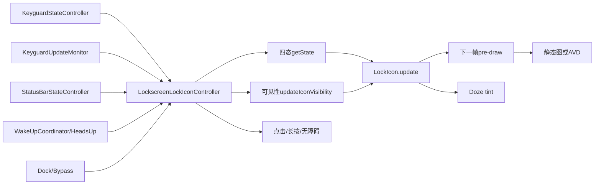
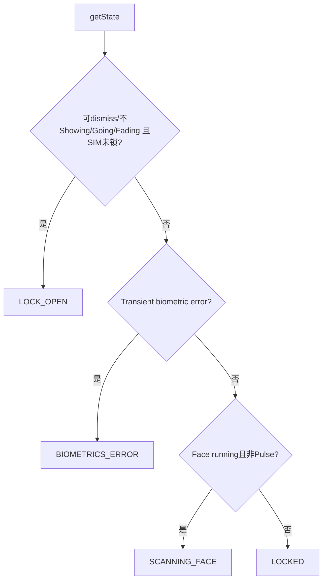
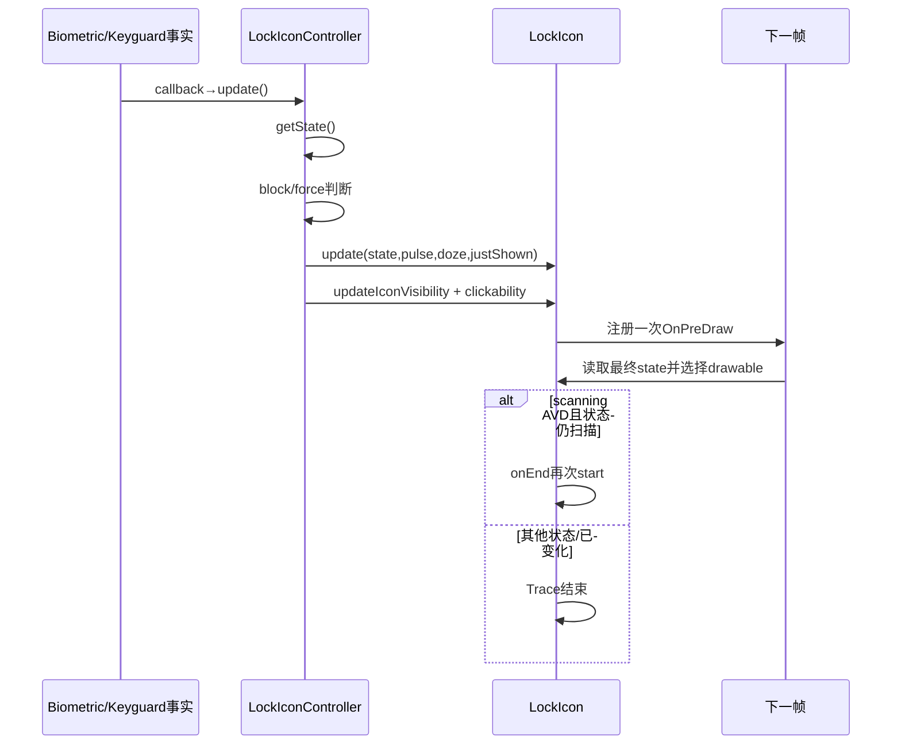

# 第 475 章 Android SystemUI LockscreenLockIconController 与 LockIcon：锁、扫描、错误状态、交互动画和 AOD 可见性链

> 源码基线：Android 11 / API 30 / `android-11.0.0_r48`。本章只在 macOS 阅读，不实际编译。核心文件：`LockscreenLockIconController.java`、`LockIcon.java`；交叉阅读 `SuperStatusBarViewFactory.java`、`StatusBar.java`、`StatusBarKeyguardViewManager.java`、`KeyguardUpdateMonitor.java`、`KeyguardStateController.java`、`NotificationWakeUpCoordinator.java`、布局/动画资源及本地测试。r48 此目录不存在旧版 `UnlockMethodCache`。

## 1. 本章解决什么问题

锁屏顶部的小锁什么时候闭合、打开、扫描或报错？为何逻辑状态变化后图标仍可能不变？AOD/Pulse、SIM、Face、Fingerprint、Bypass、通知和 Dock 怎样共同影响它？点击和长按为什么是两种完全不同的安全动作？本章从真实源码建立两层状态机。

## 2. 一句话主线

Controller 从 Keyguard/生物/Doze/SIM 等事实算出四态，再独立计算是否可见、是否可点击；LockIcon 在下一次 pre-draw 选择静态 drawable 或主题动画，扫描动画循环，Doze 只做白色 tint 插值。状态、可见性、交互和像素提交不能混为一个事实。

## 3. 先纠正旧版本知识

Android 11 r48 的 SystemUI 没有 `UnlockMethodCache` 类。是否可解锁、是否安全、Keyguard 是否 showing 等事实来自 `KeyguardStateController`，生物运行与 SIM 安全来自 `KeyguardUpdateMonitor`；继续按旧类名检索会走错版本。

## 4. 两个类怎样分工

`LockscreenLockIconController` 聚合业务状态、监听生命周期、处理点击与无障碍；`LockIcon` 是 View，负责 drawable、AVD、tint、缩放显隐动画和 pre-draw 提交。前者不画路径，后者不查询用户信任。

## 5. 四个逻辑状态

`STATE_LOCKED=0`、`STATE_LOCK_OPEN=1`、`STATE_SCANNING_FACE=2`、`STATE_BIOMETRICS_ERROR=3`。没有独立“指纹扫描”状态；等待指纹主要通过无障碍提示和外部认证流程表达。

## 6. 状态不是可见性

Controller 即使算出 LOCKED/OPEN/SCANNING/ERROR，随后仍会单独调用 `updateIconVisibility()`。AOD、Wake-and-Unlock 或相机启动可让 View INVISIBLE；因此 dump 或日志看到 state 不能证明屏幕上有图标。

## 7. 状态不是动画

同一状态变化是否动画还取决于旧状态、Dozing、Pulsing、KeyguardJustShown。LockIcon 可能只换静态图，也可能选 unlock/lock/error/scanning AVD。

## 8. 总体架构图



## 9. View 从哪里创建

`super_notification_shade.xml` 中的 `LockIcon` 位于 `lock_icon_container`，默认 42dp×42dp、居中、src 为 framework `ic_lock`，contentDescription 为“Unlock”。它和 `KeyguardMessageArea` 共处一个纵向容器。

## 10. 谁执行 attach

`SuperStatusBarViewFactory` inflate NotificationShadeWindowView 后 find `R.id.lock_icon`，只要非 null 就调用 Controller.attach。不是 LockIcon 自己从 Dependency 找 Controller。

## 11. attach 安装三类入口

设置 OnClick、OnLongClick 与 AccessibilityDelegate；若 View 已 attach，手动执行 attach callback；随后注册 OnAttachStateChangeListener，并读取当前 StatusBar state 更新可见性。

## 12. 重复 attach 没有防护

方法直接覆盖 `mLockIcon`，也不从旧 View 移除 listener。正常工厂只调用一次；若测试或重建流程错误重复调用，源码没有幂等保护。

## 13. View attach 才注册事实监听

注册 StatusBarState、Configuration、WakeUpCoordinator、KeyguardUpdateMonitor、KeyguardStateController 和可选 DockManager。Controller 是 Singleton，但回调随 View attach/detach 开关，减少 detached View 被继续更新。

## 14. detach 对称清理

对应 remove 五类 callback/listener。字段缓存并未清零，再次 attach 会沿用 wake-and-unlock、fingerprintUnlock、docked 等已有值，随后重新查询部分实时事实并 update。

## 15. attach 时只主动初始化部分字段

它立即读取 `isSimPinSecure()`，刷新主题并 update；`mKeyguardShowing` 没有在这里从 StateController主动赋值，而要等 showing callback。`getState()` 本身直接查询 StateController，所以图形状态仍可正确，但 `canBlockUpdates()` 的缓存可能暂时不同。

## 16. 第一次 locked 可能不调用 View.update

`mLastState` Java 默认也是 0，即 STATE_LOCKED。若首次计算仍 locked 且 force=false，`shouldUpdate=false`；布局已给 `android:src=ic_lock`，所以仍有静态锁图，但不会靠首次 Controller update 重设动画状态。

## 17. 主题仍在首次更新

attach callback 先调用 `onThemeChanged()`，从当前主题读取 `wallpaperTextColor`，清缓存并更新 tint。即使状态值未变，颜色仍被初始化。

## 18. 四态优先级源码

```java
private int getState() {
    if ((mKeyguardStateController.canDismissLockScreen()
            || !mKeyguardStateController.isShowing()
            || mKeyguardStateController.isKeyguardGoingAway()
            || mKeyguardStateController.isKeyguardFadingAway()) && !mSimLocked) {
        return STATE_LOCK_OPEN;
    } else if (mTransientBiometricsError) {
        return STATE_BIOMETRICS_ERROR;
    } else if (mKeyguardUpdateMonitor.isFaceDetectionRunning()
            && !mStatusBarStateController.isPulsing()) {
        return STATE_SCANNING_FACE;
    } else {
        return STATE_LOCKED;
    }
}
```

这是严格 first-match，不是多个 flag 叠加绘制。

## 19. OPEN 的四种来源

可 dismiss、Keyguard 已不 showing、正在 going away、正在 fading away，任一为真都想显示开锁。它表达“锁屏已可离开/正在离开”，不等于用户一定刚输入了正确密码。

## 20. SIM 门为何在整个 OPEN 外

即便信任/生物让普通设备凭据可 dismiss，只要 SIM PIN secure，第一分支被 `!mSimLocked` 阻止。图标不会因设备级信任提前变 open，体现 SIM 认证独立门。

## 21. SIM locked 时还能显示 error

阻止 OPEN 后继续往下判断 transient biometrics error、Face scan、locked。正常政策通常不会在 SIM PIN 层运行生物，但局部状态机没有用 SIM 统一短路后续状态。

## 22. Error 高于 Face scanning

`mTransientBiometricsError=true` 时即使 Face detection 仍 running，也先返回 ERROR。上一章 Controller 约 1300ms 后清该 flag，随后 update 才可能恢复扫描。

## 23. Pulse 抑制扫描状态

只有 Face running 且 `!isPulsing()` 才返回 SCANNING。Pulse 期间退为 LOCKED/其他更高态，避免 AOD Pulse 上运行扫描锁动画。

## 24. Dozing 本身不抑制扫描状态

getState 只看 pulsing，不看 dozing；但 AOD 非 pulsing 的可见性规则会把图标隐藏。因此内部可能是 SCANNING，像素不可见，正说明状态和可见性两层必须分开。



## 25. update 的固定收口

先算 state 与 shouldUpdate；若允许则把 state/pulsing/dozing/justShown 交给 View；无论是否更新 drawable，都写 `mLastState`、清 `mKeyguardJustShown`，最后刷新可见性和交互性。

## 26. update 核心源码

```java
private void update(boolean force) {
    int state = getState();
    boolean shouldUpdate = mLastState != state || force;
    if (mBlockUpdates && canBlockUpdates()) {
        shouldUpdate = false;
    }
    if (shouldUpdate && mLockIcon != null) {
        mLockIcon.update(state, mStatusBarStateController.isPulsing(),
                mStatusBarStateController.isDozing(), mKeyguardJustShown);
    }
    mLastState = state;
    mKeyguardJustShown = false;
    updateIconVisibility();
    updateClickability();
}
```

即使 block 阻止像素更新，`mLastState` 仍前进；解除 block 必须 force 才能把当前状态重新推给 View。

## 27. 为什么要 block updates

指纹解锁或 Face bypass 正在 dismiss Keyguard 时，锁图从 closed 切 open 可能叠在黑色前景/Scrim 转场上。Controller 临时冻结 drawable，等 Keyguard 展示/淡出边界再强制同步。

## 28. canBlockUpdates 的范围

只有缓存的 `mKeyguardShowing` 或 StateController 的 fadingAway 为真才允许 block。若锁屏已完全不 showing，继续冻结没有意义。

## 29. block 何时开启

Biometric auth mode change 中，isUnlock=true，且来源是 fingerprint 或 bypass enabled，并且 canBlockUpdates 时置 true。Face 非 bypass 不满足这条冻结条件。

## 30. wakeAndUnlock 是另一字段

参数 wakeAndUnlock=true 时把 `mWakeAndUnlockRunning=true`，用于直接隐藏图标；它不等于 block。两个机制可同时发生：一条冻结 drawable，一条控制 visibility。

## 31. wakeAndUnlock 如何结束

`onScrimVisibilityChanged(TRANSPARENT)` 才清 false 并 update。若预期 Scrim callback 丢失，字段没有 timeout；源码无法保证所有异常转场都自行恢复。

## 32. mFingerprintUnlock 的黏性

每次 biometric mode 通知都按 type 是否 FINGERPRINT 覆盖。没有单独 reset 方法；它依赖 StatusBar 在模式变化时再次通知并给出当前 type。排错需看调用序列，不能把它当实时 Monitor 查询。

## 33. unblock 的两条主要路径

Keyguard 从不 showing 变 showing 且 block 时，清 block 并 force；Keyguard fadingAway 变 false 时若 block 仍在，也清并 force。force 很关键，因为 blocked 期间 mLastState 已被更新。

## 34. keyguardJustShown 的作用

从 not showing 到 showing 设置 true；本轮 update 交给 LockIcon 后立刻清。它只影响“open→locked”是否播放 lock 动画，避免锁屏刚出现就做一次突兀的上锁动画。

## 35. justShown 也可能被消费但没绘制

update 无论 View 是否实际 update 都清 flag。若 block/状态未变/LockIcon null，该一次性语义会丢失；正常路径靠 showing force 和已 attach 减少此情况，但源码没有保存到真正 pre-draw ACK。

## 36. 状态输入回调

SIM、Keyguard visibility、生物 running、StrongAuth、Keyguard showing/fading/unlocked 都触发 update。部分回调参数不用，因为 update 统一从事实源重新查询，避免局部增量值互相矛盾。

## 37. setPulsing/setDozing 为什么忽略参数

它们只调用 update，View 参数与状态判断再从 StatusBarStateController getter 获取。这假设 listener 回调时 Controller 内部状态已提交；若假实现先回调后改 getter，测试会看到旧值。

## 38. Bouncer pre-hide 也只 update

方法不设置字段，依赖 KeyguardStateController 的 canDismiss/goingAway 等事实已经变化。它是一次重算提示，不是“强制 open”的命令。

## 39. 可见性第一条 AOD 规则

Dozing 且“非 pulsing 或 docked”就不可见。于是普通 AOD 隐藏；Pulse 且未 Dock 时可显示；Dock 即使 Pulse 也隐藏。

## 40. 为什么 Dock Pulse 仍隐藏

源码直接把 `|| mDocked` 放在括号内，没有进一步区分 Dock 类型。设计意图可理解为底座 AOD 不展示小锁，但文档应以条件为准。

## 41. Wake-and-Unlock 强制隐藏

只要字段为 true，不考虑其他状态，invisible=true。它避免解锁黑屏/Scrim 上短暂露出锁图。

## 42. Launch affordance 强制隐藏

接口注释以启动相机等 affordance 为例；若外部调用 `onShowingLaunchAffordanceChanged(true)`，图标会强制隐藏，false 后再 update。不过在本地 r48 `frameworks/base/packages/SystemUI` 全量检索只找到方法声明，未找到生产调用点，因此这是一条保留输入能力，不能断言本版本相机主链实际会设置它。

## 43. Bypass/指纹的第二层隐藏规则

若最近解锁类型为 fingerprint 或 bypass enabled，且 Bouncer 没有 scrim，通知/HeadsUp尚未完全隐藏时可能隐藏图标，避免图标叠在通知唤醒转场。

## 44. 第二层不是无条件隐藏

还要满足 HeadsUp going away、存在 pinned HUN、StatusBar为 KEYGUARD 或 SHADE 之一，并且 notificationsFullyHidden=false。`WakeUpListener.onFullyHiddenChanged()` 只有 bypass enabled 时才主动重算；若仅 `mFingerprintUnlock=true` 而 bypass=false，fullyHidden 变化本身不会经该 listener 触发更新，要等待其他 update 事件。

## 45. SHADE_LOCKED 的边界

状态条件显式列 KEYGUARD 与 SHADE，没有列 SHADE_LOCKED；在 SHADE_LOCKED 只有 HUN 条件可使前半成立。不能笼统写成“所有锁屏 shade 状态”。

## 46. 可见性源码

```java
boolean onAodNotPulsingOrDocked = mStatusBarStateController.isDozing()
        && (!mStatusBarStateController.isPulsing() || mDocked);
boolean invisible = onAodNotPulsingOrDocked || mWakeAndUnlockRunning
        || mShowingLaunchAffordance;
boolean fingerprintOrBypass = mFingerprintUnlock
        || mKeyguardBypassController.getBypassEnabled();
if (fingerprintOrBypass && !mBouncerShowingScrimmed) {
    if ((mHeadsUpManagerPhone.isHeadsUpGoingAway()
            || mHeadsUpManagerPhone.hasPinnedHeadsUp()
            || mStatusBarState == StatusBarState.KEYGUARD
            || mStatusBarState == StatusBarState.SHADE)
            && !mNotificationWakeUpCoordinator.getNotificationsFullyHidden()) {
        invisible = true;
    }
}
```

最后把 `!invisible` 交给 LockIcon，并返回 visibility 是否真的变化。

## 47. Container 还有外层显隐

`StatusBarKeyguardViewManager.updateLockIcon()` 会对整个 `lock_icon_container` fade in/out，依据 Bouncer、KEYGUARD、QS、animatingAway 与 fadingAway。Controller 只管内部 LockIcon View，最终像素还受父容器控制。

## 48. 两层 visibility 的诊断含义

内部 LockIcon VISIBLE 但 container alpha=0/GONE，用户仍看不到；反之 container visible 但内部 INVISIBLE，也看不到。排查必须同时看父子层。

## 49. LockIcon 使用 INVISIBLE

内部显隐不是 GONE，保留 42dp 布局位置。变为 visible 时从 scale 0 动画到 1，持续 233ms；隐藏则立即 INVISIBLE，不做缩小退场。

## 50. 重复可见不重复动画

`updateIconVisibility()` 比较当前 visibility，只有变化才 cancel animator/修改；返回 boolean 让 WakeUpListener决定是否还需 update drawable。

## 51. 显示动画会重置 scale

每次从 invisible→visible 都先 setScaleX/Y(0)，再 LINEAR_OUT_SLOW_IN 到 1，并启用 hardware layer。旧 scale 动画先 cancel。

## 52. View.update 不立刻换 drawable

它记录 old/new state、pulsing/dozing/justShown，然后若尚未注册则添加 OnPreDrawListener。真正 `getIcon()` 和 `setImageDrawable()` 在下一次 pre-draw。

## 53. 为什么用 pre-draw

把多次同步状态变化合并到下一帧，避免同一调用栈重复装 drawable/启动动画。`mPredrawRegistered` 保证一帧前最多一个 listener。

## 54. 多次 update 如何合并

第一次 update 保存 old=A、new=B 并注册；第二次在 pre-draw 前执行时，`mOldState` 会变成当前 `mState=B`，再设 new=C。因此最终动画按 B→C，而 A→B 中间态从未画出。

## 55. 合并不是完整事件历史

这对视觉去抖有益，但可能跳过短暂 ERROR/OPEN 动画。Controller 的 state history 和屏幕真正显示过的 history 不等价。

## 56. pre-draw 的提交顺序

先移除 listener、清 flag；读取最终 state、选择 drawable、setImageDrawable；若 scanning 则无障碍 announce；若 AVD，再清/注册 callback、begin Trace、start。

## 57. 扫描动画为何循环

AVD onAnimationEnd 时，若当前 drawable仍是该 animation、state仍 scanning，就再次 start；否则结束 async Trace。循环不靠 Handler 定时。

## 58. 非扫描动画只播一次

unlock/lock/error 动画结束时条件不满足 scanning，进入 Trace.end，不 restart。最终 AVD 本身的末帧设计应对应稳定图形。

## 59. 清 animation callbacks 的代价

每次装 AVD 都 `clearAnimationCallbacks()`，会移除该 drawable 上此前所有 callback，再注册自己的。Drawable来自 View 私有缓存，正常没有其他所有者依赖其 callback。

## 60. forceAnimationOnUI 的含义

AVD 被要求在 UI 线程驱动，避免 RenderThread/硬件路径在 AOD 等场景的行为差异；这增加主线程动画工作，但图标很小。

## 61. 四种动画选择顺序

屏幕 off 门优先；否则 new ERROR→error；旧非 OPEN 到新 OPEN→unlock；旧 OPEN到新 LOCKED且非 justShown→lock；新 SCANNING→scanning；其余静态。

## 62. 动画决策源码

```java
private static int getAnimationIndexForTransition(int oldState, int newState,
        boolean pulsing, boolean dozing, boolean keyguardJustShown) {
    if (dozing && !pulsing) return -1;
    if (newState == STATE_BIOMETRICS_ERROR) return ERROR;
    if (oldState != STATE_LOCK_OPEN && newState == STATE_LOCK_OPEN) return UNLOCK;
    if (oldState == STATE_LOCK_OPEN && newState == STATE_LOCKED && !keyguardJustShown) return LOCK;
    if (newState == STATE_SCANNING_FACE) return SCANNING;
    return -1;
}
```

ERROR 优先于转场来源；进入 ERROR 总尝试 error animation，即使旧状态也是 ERROR，但 Controller 通常相同 state 不调用 update。

## 63. 屏幕 off 的定义

这里用 `dozing && !pulsing` 近似“screen off”。Dozing+Pulse 允许动画；它不是查询 Display state，命名注释比真实条件更宽泛。

## 64. justShown 只抑制哪一种

仅抑制 OPEN→LOCKED 的 lock animation，不抑制 error/scanning/unlock。如果锁屏刚出现同时进入扫描，仍可播放 scanning。

## 65. OPEN→ERROR 会选 error

第一条状态动画分支只看 new ERROR，优先于 lock/unlock关系。错误 AVD资源设计从锁形开始/结束，但旧屏幕可能刚是 open，视觉衔接不完全由状态机验证。

## 66. 静态图映射

LOCKED、SCANNING、ERROR 的静态 fallback 都是 framework `ic_lock`；OPEN 才是 `ic_lock_open`。扫描/错误语义主要靠动画过程，动画结束或被禁止后回到闭锁形。

## 67. AOD 为什么多为静态锁或隐藏

普通 AOD内部 visibility 已隐藏；即使某路径可见，`dozing&&!pulsing` 又禁止状态 AVD。Pulse 才允许图标显示/动画，Dock Pulse仍被可见性门隐藏。

## 68. 主题动画有四套

默认、circular、filled、rounded，每套都有 error/unlock/lock/scanning。数组第一维是主题，第二维与四个 animation index 对齐。

## 69. 主题如何判断

每次选动画时同步读取 `Settings.Secure.THEME_CUSTOMIZATION_OVERLAY_PACKAGES` 字符串，用 `contains()` 查三种 icon pack 包名，否则默认。它不是解析 JSON/OverlayManager 状态。

## 70. contains 的边界

只要设置字符串包含目标子串就命中，无法证明对应 overlay 当前有效；多个包名同时存在时 circular 优先于 filled，filled 优先于 rounded。

## 71. drawable 缓存键

以资源 id 存 SparseArray。相同动画/静态图重复使用同一 Drawable 实例；配置变化与主题变化会 clear，避免尺寸/资源主题陈旧。

## 72. Secure setting 变化如何生效

主题变化 callback 调 `onThemeChange()` 清缓存；但 `getThemedAnimationResId()` 每次动画也读取 setting。若 setting 变而没触发 update/pre-draw，不会主动重绘当前静态帧。

## 73. tint 与 AVD 内白色路径

LockIcon作为 ImageView设置 ImageTintList，资源内部路径虽写白色，最终受 tint 着色。主题色到 AOD白色之间按 Doze amount混合。

## 74. Doze amount 用 eased

StatusBar callback同时给 linear/eased，Controller明确把 eased 传 `LockIcon.setDozeAmount()`；与上一章 Disclosure 使用 linear形成对比。

## 75. tint 公式

`blendARGB(mIconColor, Color.WHITE, mDozeAmount)`。清醒为壁纸文字色，完全 Doze为白，中间按 eased amount插值；这不是 Burn-in位移。

## 76. 本类没有 Burn-in 坐标

LockIcon/Controller都不调用 `getBurnInOffset()`。如果整体容器随别处布局移动，应追父层；不能因为处在 AOD 就给本类虚构独立 burn-in 算法。

## 77. Configuration 四类响应

Theme重取色；density/font scale重设42dp资源尺寸并 force；Locale重设 contentDescription并 force；generic config只在 densityDpi变化时 update。

## 78. mDensity 初值的边界

ConfigurationListener内部 mDensity默认为0，首次 onConfigChanged通常会看到实际dpi不同并 update；但 attach主动调用的是 onThemeChanged，不主动调用 onConfigChanged。

## 79. Locale force 为什么必要

状态可能不变，但 contentDescription语言变了；方法已直接 setDescription，force还会让 drawable按当前状态重交一次，属于较宽的刷新。

## 80. 点击只为无障碍启用

OnClick始终安装，但 handler首先检查 accessibility enabled；未开启直接返回。开启后强制 collapse panels，意图是让用户进入解锁/Bouncer路径，而不是直接解锁。

## 81. 点击不调用 dismiss

它只调用 `ShadeController.animateCollapsePanels(...)`，没有 `KeyguardDone`、没有关闭凭据门。把小锁点击写成“解锁设备”是不准确的。

## 82. 长按的安全语义

记录指标、显示“信任已禁用”临时提示、通知 Monitor lock icon pressed，并调用 `LockPatternUtils.requireCredentialEntry(currentUser)`，强制下次需要主凭据。

## 83. 长按不是普通锁屏

它用于主动撤销/限制 Trust 与生物便捷解锁能力，要求凭据重新进入；设备本来已在 Keyguard，不是再调用 PowerManager把屏幕锁一次。

## 84. 长按返回 true

表示消费手势，避免随后触发 click。提示通过上一章 Controller 的 transient单槽，Awake没有这里的显式 hide timeout，生命周期依赖后续事件/可见性。

## 85. 何时允许 longClickable

设备解锁方法 secure、当前可 dismiss，并且 Accessibility没有启用。也就是通过 Trust等已可解锁时允许长按重新要求凭据；无障碍开启时把交互让给 click。

## 86. 何时 clickable/focusable

Accessibility enabled时 clickable=true、focusable=true；否则 false。`canLock`不影响 click，只影响无障碍关闭时的 longClickable。

## 87. 两种交互互斥

`longClickable = canLock && !clickToUnlock`。无障碍启用后，即使可主动锁定，也不开放长按，避免探索手势冲突；click执行collapse。

## 88. AccessibilityDelegate 指纹分支

若 fingerprint detection running 且 biometric unlocking allowed(true)，增加自定义 ACTION_CLICK“无需指纹解锁”，并设置 hint“等待指纹”。它不改变 click handler本身，仍由 collapse panels进入认证 UI。

## 89. 为什么传 isStrong=true

注释说明只想检查主凭据是否被要求，不在这里阻止非强生物，因此用 true绕过 non-strong allowed检查。这是API使用策略，不代表实际指纹一定被认定strong。

## 90. Face scanning 的无障碍分支

若不是上述指纹条件且当前state为 SCANNING，将 className改为 LockIcon而非 Button，并把 description改为“Scanning face”，避免读屏说“按钮”。

## 91. 指纹分支优先于 Face

若指纹 detection和Face scanning同时成立，先走指纹分支，不改成 face scanning description。多模态并行时无障碍暴露的是指纹等待语义。

## 92. 默认 contentDescription

XML与Locale callback设为“Unlock”。Delegate的扫描 description写入 node info，不一定修改 View持久字段；下一次无障碍节点初始化重新计算。

## 93. updateClickability 的触发范围

每次 update都会执行，包括状态相同、drawable被block时；所以 Trust/Accessibility状态变化可更新交互，而无需图标动画变化。

## 94. 但 AccessibilityController 是否主动通知

Controller字段用于查询，本类没有注册 AccessibilityController callback。可点击性刷新依赖其他 update事件；源码局部不能保证开启无障碍后立刻无延迟更新。

## 95. 状态与交互可能看似矛盾

图标可显示 OPEN，同时 longClickable=true，用来重新要求凭据；也可显示 LOCKED而 accessibility click collapse面板。图形描述状态，交互表达可用动作，两者不是同一个 boolean。

## 96. 错误 flag 从上一章而来

`KeyguardIndicationController.animatePadlockError()` 调 `setTransientBiometricsError(true)`，1300ms Handler后 false。锁图 Controller不自行计时，也不知道错误文本内容。

## 97. 错误文字和图标可不同步

错误文字一般五秒、LockIcon错误约1.3秒；Face timeout在Doze可能无正文但仍触发图标flag；TrustAgent error有正文却不设置锁图 error。

## 98. 状态时序图



## 99. 状态合并竞态示例

同一帧前 LOCKED→ERROR→LOCKED，View第二次 update把 old记为ERROR、new为LOCKED；pre-draw可能只画静态 lock，用户从未看到 error AVD。字段回调发生过不等于帧展示过。

## 100. scanning callback 的停止条件

动画结束时同时验证 drawable identity与 state。若 state改变但新 pre-draw尚未替换drawable，state检查已能阻止 restart；如果 View detach但条件仍真，代码没有显式在 detach停止，后续 drawable/调度行为需运行时验证。

## 101. Async Trace 的潜在边界

每次 AVD begin同一个state cookie；扫描循环每轮不end再begin，而持续一段Trace直到退出。若 drawable因配置清缓存/生命周期异常替换但 callback不回，Trace可能缺end；源码无专用兜底。

## 102. Visibility动画不等待 drawable pre-draw

从 INVISIBLE显示立即启动scale动画，drawable可能还是旧图，新的状态图要到pre-draw才换。通常同帧很快收敛，但两套动画没有显式同步协议。

## 103. 父容器fade与子scale可叠加

Manager fade container，LockIcon自己scale in；两个控制器无统一AnimatorSet。转场时最终alpha×scale由两个动画共同决定，排错需同时看。

## 104. 唯一专用测试非常窄

`LockscreenIconControllerTest` 只有1个 `@Test`，并且 LockIcon是mock，只验证安装click/long-click后：无障碍click collapse panels、long-click要求凭据并通知Monitor。

## 105. LockIcon动画没有专用测试

本地测试目录未找到直接测试 `getAnimationIndexForTransition()`、pre-draw合并、扫描循环、主题资源、Doze tint或visibility矩阵的类。源码private方法与真实View行为基本靠集成/人工验证。

## 106. 测试名也有版本痕迹

文件叫 `LockscreenIconControllerTest`，生产类叫 `LockscreenLockIconController`。检索只按完整生产类名可能漏掉这唯一测试。

## 107. 复读修正一：没有指纹扫描图态

四态只包含 Face scanning；Fingerprint影响无障碍、可见性与解锁冻结，但没有 `STATE_SCANNING_FINGERPRINT`。不要按现代Pixel UI经验补一个不存在的状态。

## 108. 复读修正二：AOD不做独立位移

本章对象只有Doze tint和可见性；没有BurnInHelper。若看到位置变化，应追父容器/面板布局，而非声称LockIcon每分钟计算offset。

## 109. 复读修正三：Pulse不是总隐藏

Dozing+Pulse且未Dock可绕过第一条AOD隐藏门，也允许AVD；普通AOD才是非Pulse隐藏。把“Doze时永远不显示”写死会漏Pulse。

## 110. 复读修正四：block不冻结所有输出

它只阻止 `mLockIcon.update()`，仍写mLastState、刷新visibility和clickability。名称 `mBlockUpdates` 比实际范围更宽，不能理解成整个Controller暂停。

## 111. 建议排错顺序

先看父container可见/alpha，再看内部visibility；然后记录四态输入与SIM；检查block/force/lastState；确认View是否收到update与pre-draw；最后检查动画主题、Doze/Pulse、drawable identity/tint和交互 flags。按层排查能避免把隐藏误判成状态错误。

## 112. macOS 只读练习一：手算四态

执行 `sed -n '463,540p' frameworks/base/packages/SystemUI/src/com/android/systemui/statusbar/phone/LockscreenLockIconController.java`，为“可dismiss+SIM锁”“error+Face running”“Face running+Pulse”“Keyguard fading且无SIM锁”分别算state与第一层visibility；不修改、不编译。

## 113. macOS 只读练习二：画动画矩阵

阅读 `LockIcon.getAnimationIndexForTransition()`，列出dozing/pulsing门及ERROR、UNLOCK、LOCK、SCANNING顺序；特别解释justShown只抑制哪条转场。只用本地源码与纸笔。

## 114. macOS 只读练习三：追长按安全链

用 `rg -n "handleLongClick|onLockIconPressed|requireCredentialEntry"` 追Controller、Monitor和LockPatternUtils调用，区分“禁用信任/要求凭据”与“直接锁屏/直接解锁”。全程只读。

## 115. macOS 只读练习四：验证两层显隐

对照 Controller `updateIconVisibility()` 与 Manager `updateLockIcon()`，构造一个“子View VISIBLE但父container淡出”的场景，再记录Bypass+通知未fully hidden的子View规则；不运行Android。

## 116. 最容易误解的七点

没有UnlockMethodCache；没有指纹扫描状态；state不等于visible；父子两层显隐；update到pre-draw不是立即提交；block仍更新lastState/visibility/clickability；Doze+Pulse未Dock时可能显示并动画。

## 117. 可改进但本章不修改

可为四态/visibility矩阵加表驱动测试、给block引入明确generation与实际displayedState、为attach做幂等、监听Accessibility变化、结构化解析主题overlay、在detach停止AVD/闭合Trace，并把父子显隐汇聚为可诊断模型。

## 118. 用一句因果链复述

Keyguard与生物事实先经SIM/error/Face优先级变成四态，再经过AOD、Dock、解锁转场、Bypass和通知门决定是否可见；View把最终状态合并到下一帧，按主题选择静态锁或AVD，并以Doze eased amount把壁纸色渐变到白色。

## 119. 本章检查题

你应能回答：SIM锁为何阻止OPEN？Error和Face谁优先？普通AOD与Pulse的显隐差别？block时mLastState是否变化？扫描动画如何退出？长按为什么不是直接锁屏？为什么LockIcon VISIBLE仍可能看不见？

## 120. 下一章

下一章阅读 `NotificationWakeUpCoordinator`、`NotificationShelf` 与 AmbientState 的 AOD通知显隐链：追Pulse高度、fullyHidden、visibilityAmount、HeadsUp、Bypass与锁图/通知栈的协作边界。
