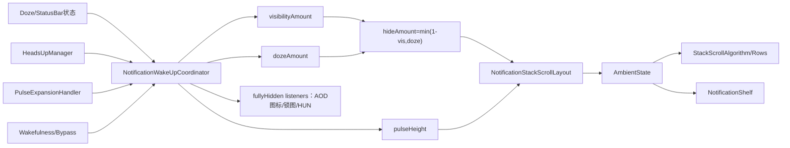
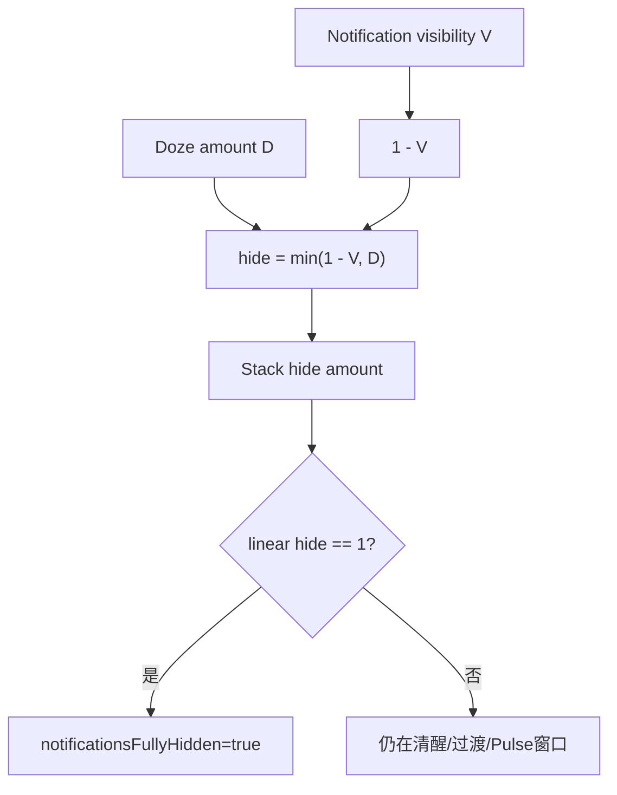
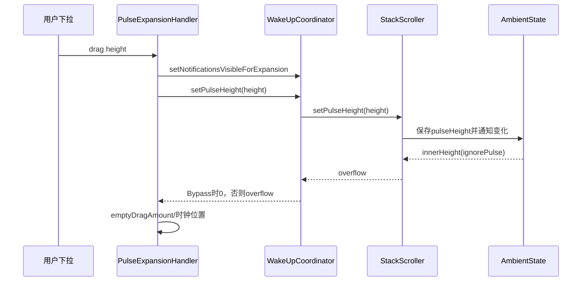

# 第 476 章 Android SystemUI NotificationWakeUpCoordinator、NotificationShelf 与 AmbientState：AOD 通知显隐、Pulse 高度和 Bypass 链

> 源码基线：Android 11 / API 30 / `android-11.0.0_r48`。本章只在 macOS 阅读，不实际编译。核心文件：`NotificationWakeUpCoordinator.kt`、`NotificationStackScrollLayout.java`、`AmbientState.java`、`NotificationShelf.java`；交叉阅读 `PulseExpansionHandler.kt`、`DozeServiceHost.java`、`NotificationIconAreaController.java`、`HeadsUpAppearanceController.java`、`LockscreenLockIconController.java` 与本地源码测试目录。

## 1. 本章解决什么问题

AOD 上通知何时出现、为何只显示 Pulse/HUN、下拉 Pulse 怎样长成通知列表、唤醒时为何不能突然消失？`notificationsFullyHidden` 到底表示什么？Shelf、AOD小图标与上一章锁图怎样响应？本章把“Doze程度”和“通知可见程度”两根轴拆开。

## 2. 一句话主线

Coordinator 用 Doze amount 与 notification visibility amount 计算 hide amount；HeadsUp、Pulse展开、唤醒和Bypass决定目标可见性，ObjectAnimator推进线性/插值量；StackScroller把hide/doze/pulse height写入AmbientState，算法再决定行、背景、Shelf与图标的像素状态。

## 3. 先区分三组 amount

Doze amount描述设备从清醒到低功耗；visibility amount描述Pulse通知从隐藏到显示；hide amount是两者组合后的“通知栈隐藏程度”。它们都有linear与interpolated版本，不能只看一个float。

## 4. fullyHidden不是dozing同义词

Coordinator只有在线性Doze恰为1且线性visibility恰为0时才令fullyHidden=true。设备正在Doze但Pulse通知可见时，fullyHidden=false；清醒时Doze=0，也false。

## 5. Pulse与普通通知列表

普通AOD尽量隐藏完整通知行，只保留可选AOD图标；Pulse到来后特定HeadsUp row可显现。用户继续下拉可扩大pulseHeight并最终进入SHADE_LOCKED。

## 6. Coordinator的边界

它不负责通知排序、行绑定或实际measure/layout；它只协调“能否显示、显示多少、Pulse高度、动画何时开始”，实际布局由NotificationStackScrollLayout与StackScrollAlgorithm完成。

## 7. AmbientState的边界

它是栈算法的输入快照，保存dozing、hideAmount、dozeAmount、pulseHeight、Shelf、HeadsUp等大量字段。本章只追与AOD显隐相关的子集。

## 8. Shelf不是Coordinator直接调用

Coordinator调用StackScroller，Scroller写AmbientState并request children update；Shelf在算法/外观更新中读取AmbientState。两者是间接数据链，不存在Coordinator→Shelf的直接方法调用。

## 9. 总体架构图



## 10. 构造时立即注册监听

init块向HeadsUpManager与StatusBarStateController注册，并给自己添加一个WakeUpListener用于fully hidden时收口Pulse expansion flag。Controller是Singleton，没有destroy/unregister方法，生命周期与SystemUI进程一致。

## 11. StackScroller是lateinit

构造后必须由NotificationPanelViewController调用`setStackScroller()`。在此之前若收到需要访问mStackScroller的回调会抛UninitializedPropertyAccessException；正常装配依赖回调不会抢在Panel初始化之前触发。

## 12. iconAreaController字段是残留

类中声明`lateinit var iconAreaController`，但本地整文件没有读取或赋值使用。真正的NotificationIconAreaController在自身构造时向Coordinator加listener；不能按字段名推导反向持有关系。

## 13. 初始状态不等于系统当前状态

本地`state`初始KEYGUARD、amount均0、notificationsVisible=false。StatusBarState回调和Panel装配随后校正；构造瞬间只是默认缓存，不是已完成一次事实快照。

## 14. setStackScroller做两件事

保存Scroller，并读取当前`isPulseExpanding`；再安装pulse height变化listener。每次高度变化都重新计算expanding布尔并通知所有WakeUpListener。

## 15. expandingChanged参数的真实语义

listener每次pulseHeight变化都会被调用，参数只是“本次是否跨过expanding true/false边界”。因此callback发生不代表状态一定改变；消费者需检查参数。

## 16. Panel消费者只在changed时动作

NotificationPanelViewController收到Pulse expansion callback后，只有Bypass enabled才重算通知top padding与QS Pulse状态；它不因每个高度像素都走该分支。

## 17. canShowPulsingHuns是计算属性

无Bypass时只等于pulsing；有Bypass时还允许“wakingUp/willWakeUp/fullyAwake 且当前KEYGUARD”，最后再受panel collapsedEnough门限制。

## 18. 不是有HUN就能显示

目标visible先由`expansionVisible || HeadsUpManager.hasNotifications()`给出，再与canShowPulsingHuns相与。必须同时有内容来源和政策许可。

## 19. 可见性决策源码

```kotlin
private fun updateNotificationVisibility(animate: Boolean, increaseSpeed: Boolean) {
    var visible = mNotificationsVisibleForExpansion || mHeadsUpManager.hasNotifications()
    visible = visible && canShowPulsingHuns

    if (!visible && mNotificationsVisible && (wakingUp || willWakeUp) &&
            mDozeAmount != 0.0f) {
        return
    }
    setNotificationsVisible(visible, animate, increaseSpeed)
}
```

唤醒保护会暂时拒绝visible true→false，直到Doze amount归零或其他状态推进。

## 20. 为什么唤醒时不立即隐藏

Pulse通知若在屏幕亮起过程中先消失，行会跳走，随后普通锁屏又重新布局。保护条件让现有通知保持到Doze动画收口，形成连续过渡。

## 21. 保护只挡隐藏

只有`!visible && mNotificationsVisible`才return；隐藏→显示仍可执行。它也要求waking/will与interpolated doze非0，完全清醒后不再保护。

## 22. mNotificationsVisible是目标布尔

它表示当前动画目标/政策状态，不是实际alpha。动画开始即更新布尔，mLinearVisibilityAmount可能仍在中间。

## 23. setNotificationsVisible的去重

目标与字段相同就return；变化时先写目标、cancel旧animator，再按animate决定启动ObjectAnimator或直接把amount设0/1。

## 24. 取消动画保留中间值

ObjectAnimator cancel不会在这里强制跳到旧目标；新动画从FloatProperty getter返回的mLinearVisibilityAmount继续，因而可平滑反向，插值器选择却另有r48问题。

## 25. 两层visibility amount

FloatProperty写入linear amount；setVisibilityAmount再通过mVisibilityInterpolator算mVisibilityAmount。线性值用于fullyHidden与清理门，插值值用于实际hide曲线。

## 26. 动画目标与时长

visible目标1，hidden目标0；Animator自身用LINEAR，真正曲线在setVisibilityAmount内部应用。时长是StackStateAnimator的WAKEUP常量，increaseSpeed时除以1.5。

## 27. 显示与隐藏使用不同曲线

从端点启动时，显示选TOUCH_RESPONSE，隐藏选FAST_OUT_SLOW_IN_REVERSE。这样用户下拉/通知出现与淡出有不同节奏。

## 28. r48未赋值字段缺陷

`mNotificationVisibleAmount`只声明并在startVisibilityAnimation判断是否0/1，全文件没有赋值；它始终为0。因此每次启动动画都进入“端点”分支并按当前目标重选插值器，即使实际mLinearVisibilityAmount处于中间。

## 29. 三个相似字段不能混读

真正更新的是`mLinearVisibilityAmount`与`mVisibilityAmount`；缺陷字段多了单词Notification。阅读时若只凭名字，会误以为端点检测使用了当前可见量。

## 30. 这会造成什么

源码可证明中途反转会换新曲线；是否产生肉眼可见速度突变取决于动画时点和帧，需运行验证，不能仅凭静态代码断言必然卡顿。

## 31. Doze amount入口

StatusBarStateController回调给linear/eased。若Bypass开启，Coordinator忽略传入曲线并按StatusBar state强制0或1；否则检测端点离开并通知Scroller动画开始，再保存amount。

## 32. notifyAnimationStart的awake参数

从Doze=1端点离开时传awake=true，内部却调用`notifyHideAnimationStart(!awake)`。最终Scroller收到hide=false，选择唤醒背景曲线；变量名需要沿调用反转理解。

## 33. setDozeAmount的固定输出

写linear/eased，调用Scroller.setDozeAmount(eased)，更新hide amount；若linear变到0，强制清普通visible与expansion visible。

## 34. amount归零的两次清理

先`setNotificationsVisible(false)`，再`setNotificationsVisibleForExpansion(false)`。由于第一步已把mNotificationsVisible变false，第二步中的releaseAll条件通常不会因旧visible触发；它主要清flag并重算。

## 35. Bypass为何重写Doze amount

Bypass在KEYGUARD希望沿用AOD式隐藏/显现逻辑，所以amount=1；SHADE或SHADE_LOCKED则amount=0。它不跟随真实屏幕Doze渐变，而按状态离散映射。

## 36. Bypass映射源码

```kotlin
private fun updateDozeAmountIfBypass(): Boolean {
    if (bypassController.bypassEnabled) {
        var amount = 1.0f
        if (statusBarStateController.state == StatusBarState.SHADE ||
                statusBarStateController.state == StatusBarState.SHADE_LOCKED) {
            amount = 0.0f
        }
        setDozeAmount(amount, amount)
        return true
    }
    return false
}
```

KEYGUARD以外未列出的状态也得到1，不能把它简化成“只有KEYGUARD为1”。

## 37. state callback的旧新状态

方法先按StatusBarController当前getter更新Bypass amount，再用参数newState与本地旧`state`判断SHADE_LOCKED→KEYGUARD，最后才`this.state=newState`。旧字段专门用于转场识别。

## 38. Bypass离开SHADE_LOCKED动画

满足条件时先无动画强制visible=true，再动画到false，让通知有明确淡出起点。即使此前目标已隐藏，也人为构造一次显示→隐藏。

## 39. 动画条件的Display blanking边界

若正在Dozing且设备不适合visibility动画，则特殊转场不执行；`shouldAnimateVisibility()`要求AlwaysOn且Display无需blanking。

## 40. pulsing setter不对称

设true时立即update，因为Doze pulse finished/唤醒回调顺序可能晚；设false只改字段，不主动update。隐藏通常依赖HeadsUp释放或后续状态事件，局部setter不是对称状态机。

## 41. onDozingChanged也不对称

isDozing=true立即无动画hide；false不做任何事。唤醒显示/隐藏由Doze amount、wakingUp和HeadsUp等其他入口接管。

## 42. pulsing从哪里设置

DozeServiceHost在Pulse started/finished中同时更新StatusBarStateController、KeyguardView、Panel、VisualStability、PulseExpansionHandler和Coordinator。Coordinator只是多个投影之一。

## 43. HeadsUp成为显示内容源

onHeadsUpStateChanged无论进入/离开都在末尾update visibility。HeadsUpManager.hasNotifications给目标公式提供“是否有可Pulse通知”。

## 44. HUN离开时的三种处理

Row已dismiss→禁用整体visibility动画，避免Shelf短闪；非唤醒中→标记headsUpAnimatingAway并放入待清集合；正在waking/will→不设该flag，由唤醒过渡接管。

## 45. HUN重新出现可撤销待清

若entry又isHeadsUp且在集合中，移除并`setHeadsUpAnimatingAway(false)`，防止旧离场状态污染新一轮alert。

## 46. handleAnimationFinished名不准确

它在每一帧setVisibilityAmount都调用，不只Animator结束。只要Doze linear为0或visibility linear为0，就批量清animatingAway集合。

## 47. 清理依赖精确端点

动画正常到0会清；完全唤醒Doze到0也清。若动画被永久停在中间且Doze不归零，entry可留在集合，源码没有独立timeout。

## 48. hide amount公式

linearHide=`min(1-linearVisibility, linearDoze)`；interpolatedHide=`min(1-visibility, doze)`。使用min意味着清醒轴或可见轴任一打开，都能降低隐藏量。

## 49. 公式源码

```kotlin
private fun updateHideAmount() {
    val linearAmount = Math.min(1.0f - mLinearVisibilityAmount, mLinearDozeAmount)
    val amount = Math.min(1.0f - mVisibilityAmount, mDozeAmount)
    mStackScroller.setHideAmount(linearAmount, amount)
    notificationsFullyHidden = linearAmount == 1.0f
}
```

fullyHidden使用linear精确等于1，不使用视觉插值amount。

## 50. 用四个端点理解公式

清醒D=0→hide=0；完整AOD且通知隐藏D=1,V=0→hide=1；AOD Pulse通知全显D=1,V=1→hide=0；过渡D=.6,V=.2→linearHide=min(.8,.6)=.6。



## 51. fullyHidden的充要条件

在正常0—1范围，min等于1要求Doze linear=1且1-visibility=1，也就是visibility=0。它不是“栈当前View INVISIBLE”的直接读取。

## 52. listener只在布尔变化时通知

Kotlin自定义setter比较old/new；hide从0.9到0.95不会callback，只有跨入/跨出精确fullyHidden端点。消费者得到的是边沿，不是连续进度。

## 53. 自监听如何收口expansion

当fullyHidden=true且`mNotificationsVisibleForExpansion`仍true，立即无动画设false。它处理Bouncer/熄屏打断下拉后flag没复位的异常路径。

## 54. setExpansionVisible的release逻辑

设false后若mNotificationsVisible仍true，说明Pulse/HUN还让通知可见，就`HeadsUpManager.releaseAllImmediately()`，避免扩展结束却长期卡在可见状态。

## 55. 为什么先update再判断

方法先重算目标，再看mNotificationsVisible。如果HUN仍存在，visible会保持true，随后release all；若已无内容，目标已false，就无需release。

## 56. Panel collapsed门只在Bypass起作用

expansion<=0.9视为collapsedEnough。无Bypass时canShow只看pulsing，不读取该门；有Bypass才用它阻止锁屏HUN在面板收得过窄时显示。

## 57. 阈值变化的单向动作

只有“原来可show、更新后不可show”时触发动画hide并releaseAll。由collapsed→展开重新允许时不主动update，需HeadsUp/唤醒等其他事件推动。

## 58. wakingUp setter

每次先把willWakeUp=false。设true时，非Bypass且正显示Pulse通知、非expansion，会调用Scroller.wakeUpFromPulse；Bypass且当前未显示则重算，让被近距挡住的HUN有机会出现。

## 59. wakeUpFromPulse做什么

把pulseHeight设为wakeUpHeight，并把隐藏行/Shelf摆到第一条可见通知末尾附近，为唤醒布局动画建立连续起点，同时标记dimmed动画。

## 60. fullyAwake只是外部字段

StatusBar在started going to sleep设false，finished waking设true。setter没有副作用；它只在Bypass的canShowPulsingHuns getter中被读取。

## 61. willWakeUp的拒绝门

设true时只有当前interpolated Doze amount非0才写入；设false总能写。这样完全清醒时不会凭空留下“即将唤醒”状态。

## 62. Pulse drag的数据链

PulseExpansionHandler根据拖动高度决定expansion visible，调用setPulseHeight；Coordinator把高度交给Scroller/AmbientState并把overflow返回为emptyDragAmount，时钟位置再使用该拖动量。



## 63. 有starting child与空白拖动不同

抓到可展开通知时直接改该child实际高度；没有starting child才切换整个notificationsVisibleForExpansion并至少保持wakeUpHeight。

## 64. setPulseHeight返回overflow

Scroller先写AmbientState并request布局，再算`max(0,height-innerHeight(ignorePulse))`。Coordinator在Bypass开启时无论真实overflow多少都返回0，不让空白rubber-band偏移介入。

## 65. Pulse取消如何收口

PulseExpansionHandler重置child或时钟emptyDrag，再把expansion visible设false并动画。若HUN仍维持目标visible，Coordinator会release all推动隐藏。

## 66. Pulse完成如何唤醒

若仍Dozing，handler先`willWakeUp=true`，再PowerManager.wakeUp，随后goToLockedShade。willWakeUp保护防止通知在真正wakingUp callback前先消失。

## 67. AmbientState的Pulse哨兵

`MAX_PULSE_HEIGHT=100000f`表示“未限制/未展开”，不是实际10万像素高度。getPulseHeight遇到哨兵对外返回0。

## 68. isPulseExpanding三条件

pulseHeight非哨兵、dozeAmount非0、hideAmount非1同时成立。只设置高度但栈已fully hidden，仍不算expanding。

## 69. AmbientState源码

```java
public boolean isPulseExpanding() {
    return mPulseHeight != MAX_PULSE_HEIGHT
            && mDozeAmount != 0.0f
            && mHideAmount != 1.0f;
}

public void setHideAmount(float hideAmount) {
    if (hideAmount == 1.0f && mHideAmount != hideAmount) {
        setPulseHeight(MAX_PULSE_HEIGHT);
    }
    mHideAmount = hideAmount;
}
```

进入fully hidden时会先重置pulseHeight并触发height listener，再写mHideAmount=1；callback中短暂读取的旧hideAmount仍可能不是1。

## 70. Doze端点也重置Pulse高度

AmbientState.setDozeAmount在amount变为0或1时设哨兵。进入完整AOD后仍可随后通过用户Pulse drag重新设置高度；端点重置不是永久禁止。

## 71. getInnerHeight的AOD特例

Doze=1且非pulse expanding时只返回Shelf高度；否则先算正常可用高度，再按Doze amount从正常height插值到min(pulseHeight,height)。

## 72. 为什么fully AOD只留Shelf高度

完整通知列表隐藏时算法空间压缩到Shelf占位；Pulse expanding后高度由pulseHeight重新打开，使行从AOD位置平滑展开。

## 73. Shelf必须先注入AmbientState

getInnerHeight完整AOD会调用`mShelf.getHeight()`，若Shelf尚未set会NPE。StackScroller初始化顺序保证算法运行前设置；AmbientState自身没有null防护。

## 74. hideAmount如何进入Scroller

Scroller保存linear/interpolated值，将interpolated写AmbientState；跨fullyHidden时更新自身visibility，跨hidden边界重置曝光菜单、outline、背景、算法与Z。

## 75. Scroller visibility规则

`shouldShow = !AmbientState.isFullyHidden() || !onKeyguard()`。KEYGUARD且fullyHidden时Scroller INVISIBLE；离开Keyguard即使hide=1也保持VISIBLE，以免Shade被错误藏掉。

## 76. Linear hide仍供绘制使用

Scroller不仅把interpolated写AmbientState，还保存mLinearHideAmount，用于背景宽度/alpha等计算。AmbientState.getHideAmount看到的是interpolated版本。

## 77. notifyHideAnimationStart只换曲线

在interpolated hide正好0或1时，按hide选择background X factor与插值器；中途不换，避免电源键快速反转造成背景曲线跳变。

## 78. Bypass时Z轴特殊处理

如果Bypass enabled且AmbientState hiddenAtAll，Scroller把自己的translationZ设为首个Pulse row的Z，防止outline clipping截掉阴影；没有Pulse child则0。

## 79. Shelf updateState的输入

读取last visible background child、innerHeight、topPadding、stackTranslation和ViewState，算最大Shelf末端、Y、openedAmount、Z、speed bump、是否有稳定项。

## 80. Shelf自己的显示门

资源可全局关闭Shelf；否则viewState在shade未expanded或QS customizer显示时hidden。随后updateAppearance还会按clipTop是否覆盖整个Shelf设INVISIBLE。

## 81. Shelf与fullyHidden的直接连接很少

`updateIconClipAmount()`在AmbientState非fullyHidden时才裁剪Shelf icon；fullyHidden则清clip bounds。主要布局影响来自innerHeight/hideAmount，而非Shelf直接监听Coordinator。

## 82. Shelf不是AOD小图标容器

ShelfIcons属于通知列表底部收纳；AOD通知图标由NotificationIconAreaController的mAodIcons管理。两者都显示通知icon，但宿主、筛选与显隐不同。

## 83. AOD图标如何监听fullyHidden

NotificationIconAreaController实现WakeUpListener。fullyHidden变化时决定动画，更新AOD icon容器visibility并重新筛选icon。

## 84. AOD图标的目标门

默认在Bypass enabled或notificationsFullyHidden时允许；必须StatusBar state为KEYGUARD；Pulse expanding时又隐藏。它们倾向在完整AOD显示，Pulse行展开时让位。

## 85. 图标与完整通知互补

fullyHidden=true时完整栈隐藏而AOD icon可见；Pulse使visibility amount上升、fullyHidden=false，AOD icons隐藏而通知row出现，减少两套视觉重叠。

## 86. AOD icon动画政策

非Bypass时只有AlwaysOn且无需display blanking并且正在变fullyHidden才animate；从fullyHidden退出的unhide不动画，避免与通知row显现叠加。Bypass时默认animate=true。

## 87. Pulse expansion callback也更新图标

只有expandingChanged=true时强制动画更新AOD icons；高度继续变化但expanding状态未跨边界，不反复启动动画。

## 88. AOD icon筛选Pulse项

Bypass enabled时hidePulsing=true；若entry showingPulsing且“完整通知尚未fullyHidden或pulse未被suppressed”，AOD icon被过滤，避免同一通知行/图标重复。

## 89. fullyHidden还有哪些消费者

NotificationPanel更新Keyguard状态栏HeadsUp；HeadsUpAppearance更新顶部entry；上一章LockIcon在Bypass场景重算可见；IconArea切AOD图标。一个布尔边沿影响至少四个视觉出口。

## 90. Listener没有异常隔离

setter用for循环同步调用listeners，没有try/catch，也没有快照复制。listener抛异常会阻断后续；listener在callback内增删列表还可能影响迭代，源码未防并发修改。

## 91. 线程假设

动画、StatusBar回调、HeadsUp和View通常都在主线程。类没有显式线程断言/Handler归一化；若上游从错误线程调用公开setter，MutableList与View访问无同步保护。

## 92. mVisibilityAnimator生命周期

字段保存最后Animator但结束时不置null；下一次目标变化会cancel一个已结束Animator，通常无害。没有listener用来标记“动画正在运行”，状态主要靠amount。

## 93. FloatProperty getter可空的语法边界

Kotlin override返回Float?以匹配Java Property泛型，实际总返回线性amount。ObjectAnimator从该值取起点；它不是mNotificationsVisible布尔的0/1转换。

## 94. shouldAnimateVisibility是能力门

只看AlwaysOn与Display是否需要blanking，不看当前屏幕是否已经绘制。调用者仍决定何时传animate；能力允许不等于每次变化都动画。

## 95. Display blanking为何禁动画

需要先黑屏切换显示模式的设备，跨黑帧做通知渐变没有可见意义，还可能出现闪烁；因此直接跳amount端点。

## 96. onHeadsUp dismissed为何禁动画

注释说明若整体visibility动画，Shelf会短暂露出；改为false让row自身及背景完整退出。它是针对组合动画artifact的局部政策。

## 97. releaseAllImmediately的范围

它释放HeadsUpManager所有alert，不只是用户正拖的entry。Pulse expansion结束的收口可能影响多条同时HUN，需理解其全局性。

## 98. PulseHeight callback的changed命名陷阱

代码把`changed = nowExpanding != pulseExpanding`传给参数名expandingChanged。它不是“现在是否expanding”，而是“是否发生变化”；调用方不能直接把参数赋给状态字段。

## 99. AmbientState setExpansionChanging重复赋值

方法连续两次`mExpansionChanging = expansionChanging`，是无行为差异的重复行。复读时不要为第二次赋值虚构同步/通知含义。

## 100. AmbientState fullyHidden用插值值

`isFullyHidden()`判断mHideAmount==1，而Coordinator `notificationsFullyHidden`判断linearAmount==1。正常端点一致，中间动画两者都false；若自定义插值异常提前到1，两个事实理论上可能短暂不同。

## 101. 两个fullyHidden不是同一字段

Coordinator布尔供listeners；AmbientState方法供Stack/Shelf算法。前者由linear公式更新，后者由interpolated hide写入；命名相同不能当同一存储。

## 102. 没有专用测试文件

本地SystemUI全量文件检索未找到NotificationWakeUpCoordinatorTest、NotificationShelfTest或AmbientStateTest。相关行为可能被更大组件测试间接覆盖，但本章三核心类没有同名专用测试证据。

## 103. 因而哪些风险未被直接约束

Bypass状态矩阵、唤醒hide保护、PulseHeight哨兵、listener重入、HUN animating-away清理、mNotificationVisibleAmount缺陷、linear/interpolated fullyHidden一致性与Shelf端点都缺专用单测。

## 104. 复读修正一：fullyHidden不是“没有通知”

它不查询通知集合大小；有很多通知但AOD全部隐藏时仍true。反之没有通知但清醒Doze=0时false。

## 105. 复读修正二：Shelf不是AOD icon区

Shelf位于栈底并参与行收纳；mAodIcons在状态栏icon区域。fullyHidden让完整栈/Shelf隐藏时，AOD icons反而可能出现。

## 106. 复读修正三：pulsing=false不立即hide

setter只在true时update。Pulse结束后的清理依赖HeadsUp、Dozing或其他回调；不能把一次setPulsing(false)画成同步visibility=0。

## 107. 复读修正四：Bypass并非简单Always显示

还要有HUN/expansion内容、KEYGUARD唤醒条件、panel展开>0.9且状态门；AOD icon与完整row也有互补显隐。

## 108. 复读修正五：mNotificationVisibleAmount不是当前值

它从未赋值，是r48残留/缺陷；动画真实进度看mLinearVisibilityAmount和mVisibilityAmount。文档和调试脚本应避免打印错字段。

## 109. 复读修正六：fullyHidden有两套存储

Coordinator listener布尔基于linear，AmbientState方法基于interpolated。通常端点相同，但不能引用一个字段证明另一个每帧完全相等。

## 110. 推荐排错状态表

记录Doze linear/eased、visibility linear/eased、hide linear/eased、目标visible、expansion flag、HUN数量、pulsing、waking/will/awake、Bypass、panel expansion、StatusBar state、pulseHeight哨兵、两种fullyHidden及Scroller/parent visibility。

## 111. 本章阅读结论

这条链本质是二维混合器：Doze轴决定“设备应隐藏到什么程度”，通知visibility轴为Pulse/唤醒开窗口；min公式把窗口投影为hide，PulseHeight再决定打开多少布局空间，listeners同步切换图标、锁图与HeadsUp出口。

## 112. macOS 只读练习一：手算hide公式

阅读Coordinator `updateHideAmount()`，分别代入(D,V)=(0,0)、(1,0)、(1,1)、(.6,.2)，计算linearHide与fullyHidden；再解释“有通知但fullyHidden=true”为什么不矛盾。只读、不编译。

## 113. macOS 只读练习二：追Pulse下拉

用`rg -n "setNotificationsVisibleForExpansion|setPulseHeight|willWakeUp"`串起PulseExpansionHandler→Coordinator→Scroller→AmbientState，标出startingChild存在与不存在的分支，以及Bypass为何把overflow归零。

## 114. macOS 只读练习三：验证AOD图标互补

阅读NotificationIconAreaController `onFullyHiddenChanged()`与`updateAodIconsVisibility()`，写出KEYGUARD、Bypass、fullyHidden、pulseExpanding四个输入的真值表；区分ShelfIcons和AodIcons。

## 115. macOS 只读练习四：确认r48未赋值字段

执行`rg -n "mNotificationVisibleAmount" NotificationWakeUpCoordinator.kt`，确认只有声明和读取；再检索另外两个visibility amount的写入点。只记录源码证据，不运行或修改Android。

## 116. 最容易误解的七点

Doze/visibility/hide三组amount；fullyHidden不等于无通知；两套fullyHidden存储；Shelf不等于AOD icons；pulsing=false不主动刷新；changed参数不是当前expanding值；缺陷字段不是动画进度。

## 117. 可改进但本章不修改

可删除/修正mNotificationVisibleAmount、为lateinit装配加门、给listeners做快照与异常隔离、让pulsing/collapsed门对称重算、结束时清Animator引用、统一linear/interpolated命名，并补Bypass×Pulse×WakeUp表驱动测试。

## 118. 用一句因果链复述

Pulse/HUN/下拉和Bypass先决定通知目标visible，Animator产生visibility量；Doze量与其经min得到hide量，Scroller写AmbientState并按pulseHeight打开空间，Shelf/行随算法变化，而fullyHidden边沿让AOD图标、锁图和HeadsUp显示彼此让位。

## 119. 本章检查题

你应能回答：fullyHidden为何要求D=1且V=0？唤醒中为什么拒绝hide？Bypass怎样重写Doze amount？PulseHeight哨兵是什么？Shelf和AOD icon有何区别？哪个visibility字段从未赋值？为什么setPulsing(false)不保证同步隐藏？

## 120. 下一章

下一章阅读`PulseExpansionHandler`、`FalsingManager`、`ShadeController.goToLockedShade`与Panel触摸协作：梳理AOD下拉手势、起始通知捕获、误触门、唤醒、SHADE_LOCKED转场和取消回弹链。
