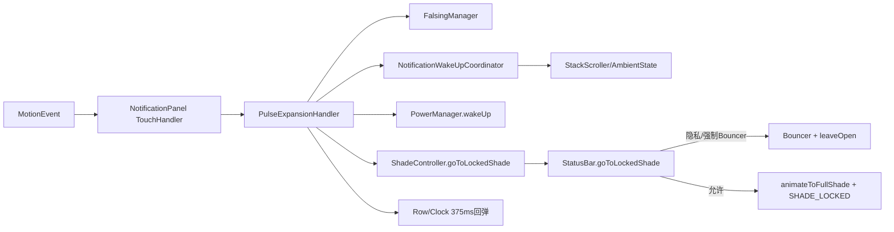
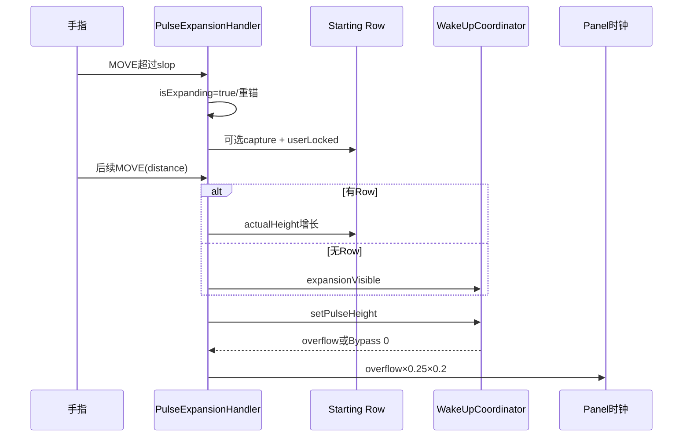
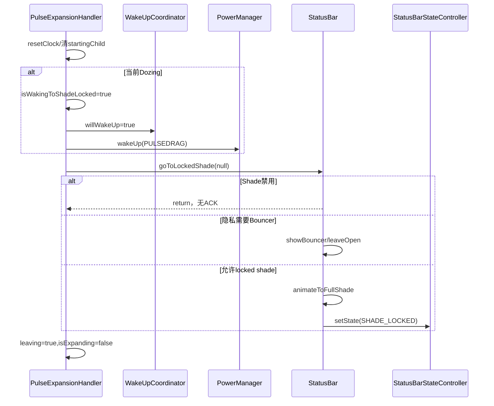

# 第 477 章 Android SystemUI PulseExpansionHandler、FalsingManager 与 goToLockedShade：AOD 下拉、误触、唤醒和回弹链

> 源码基线：Android 11 / API 30 / `android-11.0.0_r48`。本章只在 macOS 阅读，不实际编译。核心文件：`PulseExpansionHandler.kt`、`NotificationWakeUpCoordinator.kt`、`ShadeControllerImpl.java`、`StatusBar.java`；交叉阅读`NotificationPanelViewController.java`、`FalsingManager.java`、`FalsingManagerImpl.java`、`BrightLineFalsingManager.java`、`KeyguardBypassController.java`与本地测试目录。

## 1. 本章解决什么问题

AOD Pulse通知怎样被手指向下拖开？何时由Panel拦截？起始Row怎样捕获？为何要先设willWakeUp再唤醒？误触怎样否决？取消后Row与时钟如何回弹？成功手势是否一定进入SHADE_LOCKED？本章按MotionEvent逐步回答。

## 2. 一句话主线

Panel先让PulseExpansionHandler观察触摸；垂直下拉超过slop后进入expanding、捕获可展开Row并驱动pulseHeight；UP时结合Falsing、解锁政策、速度和状态决定finish或cancel。finish可请求PowerManager唤醒并委托StatusBar进入锁定Shade，cancel则375ms回弹并释放HUN。

## 3. 四个完成点不能合并

超过slop只表示手势被接管；超过wakeUpHeight只改变显示阈值；`PowerManager.wakeUp()`只提交唤醒请求；`goToLockedShade()`还可能被通知Shade禁用或隐私Bouncer分支拦住。只有StatusBar state真正变为SHADE_LOCKED才是对应状态完成。

## 4. 类的职责边界

Handler处理触摸、局部Row高度、emptyDrag、WakeUp请求和finish/cancel；WakeUpCoordinator处理通知可见量与pulseHeight；ShadeController只转发；StatusBar做隐私/Bouncer/SHADE_LOCKED决策。

## 5. 它实现Gefingerpoken

该接口允许Panel把同一MotionEvent序列交给多个手势识别器。Handler同时实现intercept与touch，必须正确维护跨两阶段的VelocityTracker和isExpanding。

## 6. 主要状态字段

触点X/Y、touchSlop、VelocityTracker、isExpanding、leavingLockscreen、startingChild、wakeUpHeight/reached、emptyDrag、isWakingToShadeLocked，以及QS/Bouncer门。多个字段是一次gesture session的松散状态，不是封装对象。

## 7. 三个r48残留字段

`mMinDragDistance`读取资源却从不使用；`mDraggedFarEnough`只在DOWN设false，从不设true/读取；`mPulsing`由setPulsing写入却从不读取。不能用这些名字解释实际finish门。

## 8. 总体调用图



## 9. setUp是必需装配

构造只拿政策对象；Panel初始化后才传入StackScroller、ExpansionCallback和ShadeController。三者都是lateinit，过早收到有效手势会崩溃；正常NotificationPanel在可触摸前完成setUp。

## 10. PowerManager为什么可空

构造用`getSystemService(PowerManager::class.java)`保存nullable；finish在Dozing时用`mPowerManager!!`。系统进程正常必有服务，测试/异常Context缺失会在成功finish崩溃，没有fallback。

## 11. Panel的拦截顺序

先处理block/QS、Bouncer、HeadsUpTouchHelper；仅当不是QuickSettings手势时才问Pulse handler。HeadsUp普通拖动比PulseExpansion优先获得intercept机会。

## 12. onTouch的顺序

Panel在自身尚未expanding、非QS手势时先交给Pulse handler；返回true就不再给其他手势。UP/Cancel后Handler常把isExpanding置false并返回false，Panel可能继续处理同一终止事件。

## 13. Bouncer有两道门

Panel若Bouncer showing在intercept直接吃事件；scrimmed Bouncer在onTouch直接false。Handler自己的`bouncerShowing`也使canHandle=false，多层政策避免Pulse下拉绕过认证UI。

## 14. canHandle的三个条件

WakeUpCoordinator允许显示Pulsing HUN、QS未expanded、Bouncer未showing。它不读本类mPulsing，也不直接要求HeadsUp数量；政策事实来自Coordinator。

## 15. 门在每个事件重算

onIntercept和onTouch都先canHandle。若QS/Bouncer/Coordinator在gesture中途变化，onTouch直接false，不执行cancel/recycle；这可能遗留VelocityTracker、isExpanding或userLocked Row，源码没有统一abort钩子。

## 16. ACTION_DOWN初始化

先确保VelocityTracker存在并addMovement；再清draggedFarEnough、isExpanding、leavingLockscreen、startingChild，记录初始X/Y。它没有先recycle一个可能因上一手势丢终止事件而残留的tracker。

## 17. DOWN设置isExpanding=false的副作用

若旧session异常仍为true，setter会执行结束逻辑：清roundness、若非leaving则尝试pending unlock与abort listener，并unpin HUN。DOWN既是初始化，也可能意外收口旧session。

## 18. MOVE开始条件

纵向位移h必须大于touchSlop，并且大于水平位移绝对值。只识别明显向下且主要垂直的gesture；向上h为负不会开始。

## 19. 开始Expansion源码

```kotlin
val h = y - mInitialTouchY
if (h > mTouchSlop && h > Math.abs(x - mInitialTouchX)) {
    falsingManager.onStartExpandingFromPulse()
    isExpanding = true
    captureStartingChild(mInitialTouchX, mInitialTouchY)
    mInitialTouchY = y
    mInitialTouchX = x
    mWakeUpHeight = wakeUpCoordinator.getWakeUpHeight()
    mReachedWakeUpHeight = false
    return true
}
```

捕获使用原始DOWN坐标，随后才把起点重锚到当前MOVE。

## 20. 为什么重锚

超过slop的前一段被当作手势判定死区；后续moveDistance从接管点算，视觉不会在intercept瞬间跳过slop距离。但finish门也因此使用重锚后的距离，不是总下拉距离。

## 21. mMinDragDistance实际无效

资源`keyguard_drag_down_min_distance`从未进入UP条件。成功最小距离由“先超过touchSlop开始 + 重锚后moveDistance>0 + Falsing/速度”共同决定，不是该资源值。

## 22. isExpanding setter不只是赋值

它同步写BypassController.isPulseExpanding；开始时跟踪top HUN roundness；结束时清tracking，若非leaving则尝试pending unlock并运行abort listener；每次状态变化都`headsUpManager.unpinAll(true)`。

## 23. 开始时就unpin全部HUN

setter先读取topEntry交给RoundnessManager，随后unpinAll。它不只处理起始Row，而是全局取消所有pinned HUN，并标记userUnPinned=true。

## 24. 结束时再次unpin

true→false又调用一次unpinAll，即使开始时已做。通常幂等，但这是全局操作，不是只收口当前通知。

## 25. Roundness跟踪谁

跟踪HeadsUpManager.topEntry.row，不一定等于用户DOWN位置捕获的startingChild。视觉圆角目标与被拖Row可能不同。

## 26. Bypass pending unlock

只有expansion结束且`leavingLockscreen=false`才`maybePerformPendingUnlock()`。成功finish会先设leaving=true再设isExpanding=false，避免在向Shade离开时误重放生物解锁。

## 27. Abort listener做什么

Panel安装的listener只在非leaving结束时让QS header animate sliding out。它不是cancel整个Panel，也不负责Row回弹；具体回弹由cancelExpansion完成。

## 28. Falsing开始回调

跨slop时调用`onStartExpandingFromPulse()`。Legacy FalsingManagerImpl把HumanInteractionClassifier类型设为PULSE_EXPAND并通知DataCollector；BrightLine实现更新interaction type。

## 29. Intercept后的事件怎样继续

onTouch若tracker为空、尚未expanding或收到DOWN，会再次走startExpansion；一旦已expanding，后续事件直接addMovement并按重锚起点算moveDistance。

## 30. MOVE驱动两种视觉路径

有startingChild时增大该child actualHeight；无startingChild时切换整个notificationsVisibleForExpansion。两种路径最终都设置pulseHeight和emptyDrag。

## 31. captureStartingChild的Bypass门

Bypass enabled时完全不捕获Row，始终走整栈/时钟路径。普通模式才按DOWN坐标查找可展开child并设userLocked=true。

## 32. 坐标如何转换

DOWN是Panel局部坐标；方法获取StackScroller屏幕位置并相加，再调用`getChildAtRawPosition`。找到但`isContentExpandable=false`也返回null。

## 33. userLocked的意义

仅ExpandableNotificationRow会设置，告诉Row正由用户控制高度，避免自动布局抢夺；其他ExpandableView即使被返回，也不会有该标志。

## 34. Row高度公式

`newHeight=min(collapsedHeight+max(drag,0), maxContentHeight)`；再令expansionHeight至少等于newHeight。PulseHeight因此至少包含Row当前高度，不只是手指位移。

## 35. reachedWakeUpHeight是粘性门

一旦原始height>wakeUpHeight设true，本gesture不再变false。此前无Row路径以target=0判断可见；越过后target改为wakeUpHeight，拖回阈值以下会把expansion visible关掉。

## 36. 为什么阈值前任何正值都可见

未reached时条件是height>0，让通知立即跟手出现；达到wakeUpHeight后才要求继续高于该阈值，形成一种回拖收口策略。是否符合预期需结合视觉运行验证。

## 37. emptyDrag的两次缩放

Coordinator返回overflow；Handler乘0.25；Panel ExpansionCallback又乘0.2再写mEmptyDragAmount。因此最终时钟空白拖动量是overflow的0.05，而非类中单看0.25。

## 38. Bypass丢弃overflow

上一章Coordinator在Bypass时固定返回0，后续两次缩放仍是0；Bypass Pulse下拉不通过emptyDrag移动时钟。

## 39. Pulse MOVE时序图



## 40. UP先计算速度

VelocityTracker以每秒1000单位计算，使用无pointerId版本的Y velocity。多指切换时依赖VelocityTracker默认active pointer语义，本类没有显式管理pointer id。

## 41. canExpand三条件

重锚后moveDistance>0；Y速度>-1000px/s；StatusBar state不是SHADE。快速向上回甩超过1000会取消，任意正向下速度都满足速度门。

## 42. 没有真正使用“拖得足够远”

mDraggedFarEnough与mMinDragDistance均不参与。只要已跨slop开始，之后还有极小正moveDistance，且Falsing通过，就能finish。

## 43. UP政策短路顺序

Kotlin `&&`从左到右：先`!isUnlockingDisabled`，再查询isFalseTouch，最后canExpand。若解锁被禁，Falsing查询与canExpand布尔求值不会继续。

## 44. isUnlockingDisabled是什么

FalsingManager提供的独立政策，不等于一次手势被判误触。Legacy实现从DataCollector读取；它可以在分类器判断之前全局阻止解锁式交互。

## 45. interactionType的不一致

Handler查询`isFalseTouch(NOTIFICATION_DRAG_DOWN)`，但开始时通知的是PULSE_EXPAND。BrightLine查询会用参数覆盖为NOTIFICATION_DRAG_DOWN；Legacy `isFalseTouch(int)`不使用参数更新类型，继续依赖PULSE_EXPAND。两实现可能按不同interaction type分类同一手势。

## 46. 这不是文案差异

分类器可使用不同阈值/特征组合，因此实现切换可能改变误触结果。源码能证明类型输入不一致，不能静态断言哪种更严格。

## 47. Dock/Face可影响Falsing

BrightLine在test harness、刚用Face解锁或Docked时可直接认为非误触；Legacy对test harness、Touch Exploration、非触屏、刚Face解锁也有旁路。Handler本身不重复这些政策。

## 48. Cancel路径总通知Falsing停止

ACTION_CANCEL或UP门失败调用cancelExpansion，第一步isExpanding=false，随后`onExpansionFromPulseStopped()`。成功finish不调用stop，依赖离开锁屏/会话状态在别处收口。

## 49. Falsing stop与setter顺序

cancel先让isExpanding false，触发pending unlock/abort/unpin，再通知Falsing stop。分类器在abort listener运行时尚未收到stop。

## 50. finish入口源码

```kotlin
private fun finishExpansion() {
    resetClock()
    if (mStartingChild != null) {
        setUserLocked(mStartingChild!!, false)
        mStartingChild = null
    }
    if (statusBarStateController.isDozing) {
        isWakingToShadeLocked = true
        wakeUpCoordinator.willWakeUp = true
        mPowerManager!!.wakeUp(SystemClock.uptimeMillis(), WAKE_REASON_GESTURE,
                "com.android.systemui:PULSEDRAG")
    }
    shadeController.goToLockedShade(mStartingChild)
    leavingLockscreen = true
    isExpanding = false
    if (mStartingChild is ExpandableNotificationRow) {
        val row = mStartingChild as ExpandableNotificationRow?
        row!!.onExpandedByGesture(true /* userExpanded */)
    }
}
```

这段存在一个可直接证明的startingChild提前清空问题。

## 51. startingChild被提前清空

非null时先解userLocked并设null；因此后面的`goToLockedShade(mStartingChild)`总收到null，最后的Row类型判断永远false。不是竞态，而是同一同步函数内的确定顺序。

## 52. 直接后果一：Row参数丢失

StatusBar无法从Pulse路径获得被拖entry，不能在goToLockedShade中对它setUserExpanded/groupExpansionChanging，也不能按该entry所属user选择public mode。

## 53. 直接后果二：最后回调不可达

`onExpandedByGesture(true)`永远不会由该函数执行。文档不能把它写进正常成功链；它是看起来想做、实际到不了的代码。

## 54. 为什么现有编译不会提示

mStartingChild是可变nullable字段，Kotlin编译器不把后续`is`静态报错；从语法上其他调用可能改字段，但本同步代码中shadeController也只收到null，除非存在极不寻常的重入通过外部共享Handler重新赋值，而字段没有公开setter。

## 55. resetClock即使成功也回弹

finish第一行把emptyDrag 375ms动画回0。进入Shade的面板/时钟转场与这个回弹并行，不是成功后立即置0。

## 56. 成功Row不做高度回弹

有startingChild时只解除userLocked并清引用，没有把actualHeight重置为collapsed；本意可能让Shade接管扩展高度，但因Row参数丢失，后续是否自然收口依赖全局布局。

## 57. 唤醒请求的顺序

Dozing时先设isWakingToShadeLocked、再willWakeUp、再PowerManager.wakeUp，之后才goToLockedShade。两个flag在Wakefulness callback到来前保护Coordinator/StatusBar转场。

## 58. willWakeUp防什么

WakeUpCoordinator在wakingUp正式变true之前，若HUN政策暂时想hide，会因willWakeUp且DozeAmount非0拒绝，避免通知在唤醒请求与回调间消失。

## 59. isWakingToShadeLocked防什么

StatusBar的`showKeyguardImpl()`在flag true时不强制State回KEYGUARD。onStartedWakingUp先updateIsKeyguard时flag仍true，完成相关更新后才调用Handler.onStartedWakingUp清false。

## 60. flag不是直到SHADE_LOCKED完成

它在“开始唤醒”回调末尾就清，而不是等状态确认或动画结束。因此名称更像短窗口保护，不是完整transition token。

## 61. 非Dozing成功不调用wakeUp

直接goToLockedShade。isWakingToShadeLocked保持原值，正常应已由先前onStartedWakingUp清false；本类不在每次finish开头重置。

## 62. ShadeController只是转发

`ShadeControllerImpl.goToLockedShade(View)`没有自己的政策，直接调用StatusBar同名方法。真正的disable/隐私/Bouncer/状态逻辑仍在StatusBar。

## 63. StatusBar第一道禁用门

若`DISABLE2_NOTIFICATION_SHADE`置位立即return。Handler不会收到成功/失败返回值，随后仍设置leavingLockscreen=true并结束expansion。

## 64. leavingLockscreen不是ACK

它只表示Handler选择了finish路径，不证明ShadeController接受、Bouncer通过、State已SHADE_LOCKED或动画已结束。变量名容易让人误当最终事实。

## 65. goToLockedShade隐私决策

如果Row参数有效，先拿entry/user并标记展开；然后综合当前用户是否允许私密通知、是否允许锁屏通知、Falsing是否强制Bouncer。Bypass enabled则强制不需要Bouncer。

## 66. 为什么还问shouldEnforceBouncer

即使UP的isFalseTouch通过，FalsingManager仍可基于更高层政策要求认证页。一次gesture分类与“是否强制Bouncer”是两个不同API。

## 67. Bouncer分支条件

目标user处于lockscreen public mode且fullShadeNeedsBouncer时，设置leaveOpenOnKeyguardHide、show Bouncer、保存dragged entry、清pending remote input。此时不会立即State=SHADE_LOCKED。

## 68. 直接Shade分支

Panel `animateToFullShade(0)`，随后StatusBarStateController.setState(SHADE_LOCKED)。setState是状态提交点，但动画仍异步继续。

## 69. goToLockedShade源码

```java
void goToLockedShade(View expandView) {
    if ((mDisabled2 & StatusBarManager.DISABLE2_NOTIFICATION_SHADE) != 0) {
        return;
    }
    int userId = mLockscreenUserManager.getCurrentUserId();
    ExpandableNotificationRow row = null;
    NotificationEntry entry = null;
    if (expandView instanceof ExpandableNotificationRow) {
        entry = ((ExpandableNotificationRow) expandView).getEntry();
        entry.setUserExpanded(true /* userExpanded */, true /* allowChildExpansion */);
        entry.setGroupExpansionChanging(true);
        userId = entry.getSbn().getUserId();
    }
    boolean fullShadeNeedsBouncer = !mLockscreenUserManager
            .userAllowsPrivateNotificationsInPublic(mLockscreenUserManager.getCurrentUserId())
            || !mLockscreenUserManager.shouldShowLockscreenNotifications()
            || mFalsingManager.shouldEnforceBouncer();
    if (mKeyguardBypassController.getBypassEnabled()) {
        fullShadeNeedsBouncer = false;
    }
    if (mLockscreenUserManager.isLockscreenPublicMode(userId)
            && fullShadeNeedsBouncer) {
        mStatusBarStateController.setLeaveOpenOnKeyguardHide(true);
        showBouncerIfKeyguard();
        mDraggedDownEntry = entry;
        mPendingRemoteInputView = null;
    } else {
        mNotificationPanelViewController.animateToFullShade(0 /* delay */);
        mStatusBarStateController.setState(StatusBarState.SHADE_LOCKED);
    }
}
```

Pulse路径因提前null，实际从current user和entry=null开始。

## 70. Pulse路径的隐私影响

若被拖Row来自工作资料/其他user，原设计可按entry user判断public mode；实际传null后按当前Lockscreen user。是否造成可见隐私差异取决于上游通知可Pulse政策与用户配置，但源码风险存在。

## 71. Bypass为何跳过Bouncer

Bypass已将Face认证等作为直接进入内容的体验，StatusBar强制needsBouncer=false。但其他安全门仍可能在更上游阻止canDismiss；这里只描述本函数政策。

## 72. finish时序图



## 73. cancel的两种回弹

有startingChild就ObjectAnimator把actualHeight回collapsed；无Row则ValueAnimator把emptyDrag回0。两者均375ms FAST_OUT_SLOW_IN。

```kotlin
private fun cancelExpansion() {
    isExpanding = false
    falsingManager.onExpansionFromPulseStopped()
    if (mStartingChild != null) {
        reset(mStartingChild!!)
        mStartingChild = null
    } else {
        resetClock()
    }
    wakeUpCoordinator.setNotificationsVisibleForExpansion(
            false, true, false)
}
```

注意setter副作用发生在Falsing stop和回弹之前；取消不是一个原子事务。

## 74. Row已是collapsed时

reset直接userLocked=false并return，不创建Animator。否则只在onAnimationEnd清userLocked，onCancel没有listener覆盖。

## 75. Row回弹被取消的边界

Animator未保存字段，外部若取消，AnimatorListenerAdapter默认onAnimationEnd通常仍可能被调用取决于Animator语义，但源码没有显式onCancel清锁；无法从本类主动取消或查询。

## 76. Clock回弹可重叠

resetClock每次创建新ValueAnimator，不cancel旧animator也不保存引用。快速多次gesture可有多个animator同时写emptyDrag，产生互相覆盖；本类没有generation。

## 77. finish也会产生Clock回弹重叠

成功和无Row cancel都调用resetClock。新DOWN不停止旧回弹，手指MOVE与旧Animator可能同时写Panel时钟位置。

## 78. cancel先清startingChild后visibility

Row reset启动后字段立刻null；然后Coordinator expansion visible=false。Row高度动画与整体通知淡出可并行。

## 79. ACTION_CANCEL一定走cancel吗

只有canHandle仍true且onTouch进入已expanding分支。若中途canHandle变false，方法早退，Cancel不会到cancelExpansion，这是前述状态泄漏窗口。

## 80. VelocityTracker何时回收

正常UP/CANCEL在intercept未扩展或touch finish/cancel都会recycle；门中途关闭/事件丢失则不回收。没有View detach/Doze结束的显式cleanup。

## 81. mPulsing为何不能作为cleanup

setPulsing只写未读取字段，Pulse结束不会自动cancel gesture或recycle。实际canHandle可能因Coordinator变化转false，从而更容易触发早退残留。

## 82. qsExpanded如何进入

Panel的setQsExpanded同步传给Falsing、StatusBar、通知容器和Pulse handler。它是缓存布尔，不是Handler自行查询QS对象。

## 83. bouncerShowing如何进入

StatusBar.setBouncerShowing传给BypassController、Pulse handler、锁图等。若在gesture中途变true，下一事件Handler直接false而非cancel。

## 84. 事件消费返回值

Handler最后返回当前isExpanding。finish/cancel已将其false，所以终止事件返回false；Panel可能继续自己的UP/CANCEL逻辑。MOVE期间true才独占。

## 85. 为什么这可能复杂

同一DOWN序列已被Pulse handler拦截，但UP又落入Panel后续状态机；Panel内部通常能识别自身未expanding，然而源码没有一个“本gesture曾由Pulse消费”的独立粘性返回门。

## 86. leavingLockscreen对Panel header

Bypass Pulse布局中，若既不isExpanding也不leaving，Panel认为是abort并保持header不重新出现；成功finish将leaving=true，让appearFraction继续按Pulse高度算。

## 87. 新DOWN重置leaving

只要后续手势能进入startExpansion ACTION_DOWN，就设false。若finish后没有新DOWN，字段可长期true；外部没有专门“Shade完成”清理。

## 88. isWakingToShadeLocked与leaving生命周期不同

前者在Wakefulness started callback清，后者在下一次DOWN清。一个保护Keyguard state短窗口，一个影响Panel header与isExpanding setter的abort行为。

## 89. roundness和Row高度无事务

isExpanding=true先跟踪top HUN/unpin，再捕获starting child；任一步异常都没有rollback。UI主线程异常会中断整个触摸链。

## 90. Falsing query只在UP

MOVE过程中即使轨迹显然误触仍更新Row/通知/时钟；最终UP才接受/回弹。这让视觉跟手，安全决策延迟到commit。

## 91. 没有距离硬门的安全影响

Falsing分类器承担更多责任。若Falsing被test harness/Touch Exploration/Face/Dock旁路，成功门主要剩重锚后正距离和速度。

## 92. Touch Exploration的特殊性

Legacy Falsing直接返回非误触，但Pulse handler的click/手势可用性仍由Panel和Accessibility交互决定；不能据此断言无障碍用户一定能完成该下拉。

## 93. 成功不通知onExpansionStopped

DataCollector可能依赖后续screen/state session结束；本类只在cancel调用stop。接口命名看似成对，实际调用不对称。

## 94. no-op Falsing stop实现

BrightLine的onExpansionFromPulseStopped为空；Legacy转给DataCollector。相同不对称对不同后端影响不同。

## 95. Shade状态也有双结果

成功finish可能直接SHADE_LOCKED，也可能只show Bouncer等待凭据；Handler统一leaving=true。调用方不能用leaving推断当前StatusBar state。

## 96. DISABLE2返回更极端

Shade完全禁用时StatusBar立即return，甚至不show Bouncer；Handler仍结束且不走abort listener/pending unlock。没有返回值让它恢复gesture视觉。

## 97. startingChild bug让Bouncer保存null

隐私分支`mDraggedDownEntry=entry`得到null，凭据完成后无法对特定被拖通知解除userLocked/恢复高度；showKeyguardImpl的dragged entry清理也无对象可处理。

## 98. 但Handler已提前解userLocked

finish清Row前调用setUserLocked(false)，所以不会因StatusBar entry=null永久保留userLocked；真正丢的是entry展开/组动画/用户身份和回调语义。

## 99. PowerManager调用不是等待

wakeUp同步提交请求，但屏幕/StatusBar Wakefulness回调随后到达。方法紧接着goToLockedShade，不等待interactive=true或首帧。

## 100. uptime时间基准正确

PowerManager.wakeUp要求uptimeMillis时间，代码使用SystemClock.uptimeMillis；reason为GESTURE、details标识PULSEDRAG，便于电源日志归因。

## 101. 唤醒和Shade政策可分叉

即使随后Shade被禁或要求Bouncer，wakeUp请求已发，无法由本函数撤销。用户可能被唤醒但未进入SHADE_LOCKED，这是合法可推导结果。

## 102. 本地无专用Handler测试

全量测试文件检索未找到PulseExpansionHandlerTest。NotificationPanelViewTest只在装配中new Handler，没有覆盖其DOWN/MOVE/UP、startingChild或finish/cancel核心链。

## 103. 间接测试不能证明核心状态机

Panel、StatusBar、DozeHost测试使用mock或只验证邻接行为，无法证明提前null、门中途关闭、Animator重叠、Falsing type差异已被约束。

## 104. 复读修正一：成功不一定SHADE_LOCKED

可能DISABLE2 return或走Bouncer；leavingLockscreen只是本地选择finish。文档必须写出三分支。

## 105. 复读修正二：被拖Row没有传下去

r48同步顺序确定先null后调用。不能照函数签名/StatusBar支持Row的能力画成实际Pulse链。

## 106. 复读修正三：minDrag资源不生效

实际代码未读mMinDragDistance，mDraggedFarEnough也无效；finish距离门不能引用该dimen。

## 107. 复读修正四：mPulsing不控制canHandle

真实门是WakeUpCoordinator.canShowPulsingHuns。setPulsing仅写死字段，当前r48逻辑不消费。

## 108. 复读修正五：Falsing interaction type分后端

BrightLine采用UP查询传入的NOTIFICATION_DRAG_DOWN，Legacy保留start时PULSE_EXPAND；不能统一写成一种分类类型。

## 109. 复读修正六：中途门关闭不自动cancel

早退会漏Falsing stop、Row/clock回弹、tracker recycle和isExpanding reset。这是源码风险，发生率需真机事件顺序验证。

## 110. 推荐排错状态表

记录事件action/x/y/pointer、tracker、initial重锚点、isExpanding/leaving/wakingToShade、canShow/QS/Bouncer、startingChild/userLocked/actualHeight、wakeUpHeight/reached、Falsing后端/类型/结果、Dozing/willWake、DISABLE2/public mode/最终state。

## 111. 本章阅读结论

Pulse下拉不是一个fling调用，而是触摸接管、视觉跟手、UP安全commit、Wakefulness保护和Shade隐私决策五层协议。r48的unused门、Falsing类型分叉、startingChild提前null和中途早退使边界比主线更值得记忆。

## 112. macOS 只读练习一：手推一次成功手势

阅读`startExpansion()`与`onTouchEvent()`，假设向下超过slop、UP速度200、非误触、state KEYGUARD，逐项记录重锚、startingChild、pulseHeight、finish门和返回值；不编译、不修改。

## 113. macOS 只读练习二：证明startingChild不可达

只读查看`finishExpansion()`，给每行标字段值，证明传给goToLockedShade的参数和最后Row判断结果；再对照StatusBar说明丢失的四项Row语义。

## 114. macOS 只读练习三：比较两种Falsing后端

用`rg -n "onStartExpandingFromPulse|isFalseTouch"`对照FalsingManagerImpl与BrightLineFalsingManager，写出PULSE_EXPAND何时被NOTIFICATION_DRAG_DOWN覆盖，避免只看接口。

## 115. macOS 只读练习四：构造中途门关闭

设gesture已isExpanding且Row userLocked，随后Bouncer变true，再送ACTION_CANCEL；按onTouch首行推演哪些cleanup不会发生，并列出需要的修复入口。只读推演，不运行Android。

## 116. 最容易误解的八点

slop不是minDrag；重锚后距离用于UP；startingChild实际传null；leaving不是Shade ACK；成功不一定SHADE_LOCKED；Falsing类型因后端不同；mPulsing无效；终止事件可能返回false给Panel继续处理。

## 117. 可改进但本章不修改

可用GestureSession封装字段、在finish先保存局部Row再清、让goToLockedShade返回结果、统一PULSE_EXPAND interaction type、真正使用minDrag、门中途关闭时强制abort、保存/cancel回弹Animator、管理pointerId并补完整MotionEvent表驱动测试。

## 118. 用一句因果链复述

垂直下拉越过slop后Handler接管并让Row/整栈随pulseHeight展开；UP由解锁政策、Falsing、距离速度commit，Dozing时先保护通知并请求唤醒，再由StatusBar在禁用、Bouncer或SHADE_LOCKED间决策，失败/CANCEL则Row或时钟回弹。

## 119. 本章检查题

你应能回答：为什么mMinDragDistance不生效？重锚改变了哪个距离？startingChild为何总传null？willWakeUp与isWakingToShadeLocked各保护什么？Falsing两后端用何类型？为何leaving=true仍可能没有SHADE_LOCKED？

## 120. 下一章

下一章阅读`NotificationStackScrollLayout`、`StackScrollAlgorithm`与`ExpandableViewState`：梳理通知栈一次requestChildrenUpdate如何生成ViewState、应用位置/高度/alpha/Z/clip，并与AOD hide、Shelf和HeadsUp协作。
