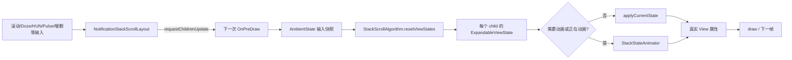
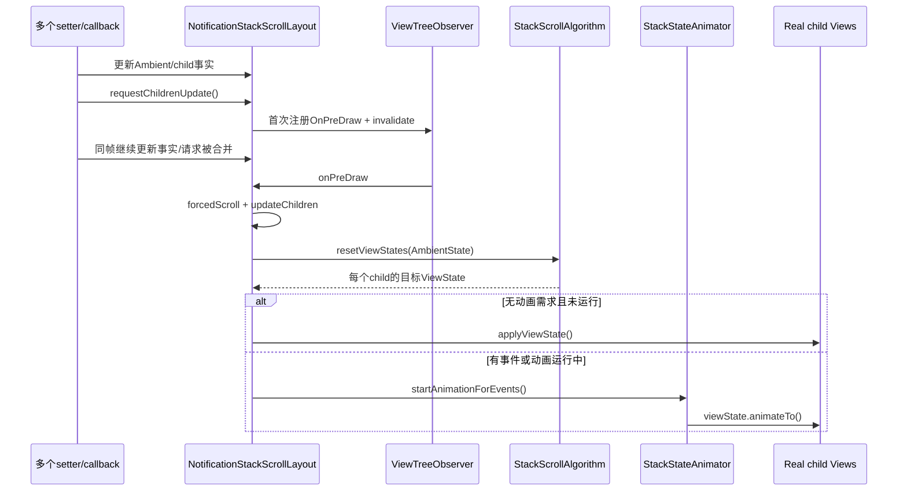
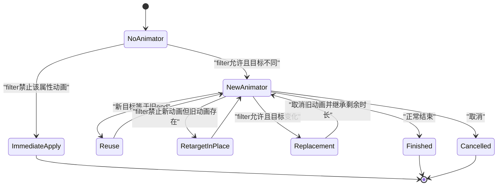

# 第 478 章 Android SystemUI NotificationStackScrollLayout、StackScrollAlgorithm 与 ExpandableViewState：通知栈状态生成、应用和动画链

> 源码基线：Android 11 / API 30 / `android-11.0.0_r48`。本章只在 macOS 阅读，不实际编译。核心文件：`NotificationStackScrollLayout.java`、`StackScrollAlgorithm.java`、`ExpandableViewState.java`、`ViewState.java`、`StackStateAnimator.java`；交叉阅读 `ExpandableView.java`、`AmbientState.java`、`NotificationShelf.java` 和本地 SystemUI 测试目录。

## 1. 本章要解决什么问题

通知的真实 View 为什么没有在每个 setter 里直接改坐标？`requestChildrenUpdate()` 怎样把几十次变化合成一帧？算法如何同时处理滚动、AOD、Shelf、HeadsUp、Pulse、Z 轴和裁剪？算出的状态又怎样选择立即应用或动画到达？本章把这条“输入事实→生成目标状态→提交到 View”的闭环完整拆开。

## 2. 先建立一句话主线

`NotificationStackScrollLayout` 收集输入并申请下一次 pre-draw；`StackScrollAlgorithm` 读取 `AmbientState` 和每个 child 的事实，重建 `ExpandableViewState`；没有动画需求时直接 `applyToView()`，有动画事件或旧动画运行时交给 `StackStateAnimator` 调用 `animateTo()`。

## 3. 这是一套状态解析器，不是普通 LinearLayout

普通纵向列表常把位置写进 `layout()`；通知栈却要允许多个通知重叠、被 Shelf 吸收、HeadsUp 悬浮、Pulse 显示、折叠组、滑动删除和中断动画。它先算“这一帧最终应该是什么样”，再统一提交，因而更像一个小型状态解析器。

## 4. 四类事实不要混在一起

第一类是当前环境，如滚动量、Doze、Keyguard、顶部 padding；第二类是 child 自身事实，如 intrinsic height、pinned、aboveShelf；第三类是算法输出 `ViewState`；第四类才是真实 View 当前属性。读源码时把这四层分开，绝大多数疑惑会消失。

## 5. 目标状态不等于屏幕现状

`child.getViewState().yTranslation` 是目标 Y；`child.getTranslationY()` 是此刻真实 Y。动画进行时二者可以长期不同。日志若只打印其中一个，容易把“算法算错”与“动画尚未结束”混为一谈。

## 6. 本章的五个主角

`NotificationStackScrollLayout` 是宿主和调度器；`AmbientState` 是输入快照；`StackScrollAlgorithm` 计算目标；`ExpandableViewState` 描述一个通知类 View；`StackStateAnimator` 把动画事件翻译成属性动画。`NotificationShelf` 既是 child，又参与算法收口。

## 7. 运行位置和线程

这些类位于 SystemUI 进程，View、pre-draw、Animator 和绝大多数回调都应在主线程运行。本链没有 Binder 或 native 跨进程调用；本章关注的是同一 UI 线程内，一次绘制前后的状态协调。

## 8. 为什么需要统一计算

若滚动 setter 立即改 Y，HeadsUp setter 随后又改 Y，Shelf 再覆盖 hidden，最终结果将依赖回调偶然顺序。统一算法仍有明确覆盖顺序，但它固定在一次 `resetViewStates()` 内，能够复读、测试和诊断。

## 9. 本章的三个完成点

“已请求更新”只表示 listener 已挂；“目标状态已生成”表示 `resetViewStates()` 返回；“画面到达目标”还要看直接 apply 是否完成，或动画是否结束。三者不能用一个“刷新完成”概括。

## 10. 总体结构图



## 11. requestChildrenUpdate的真实含义

它不是立刻遍历 child，而是把一次更新安排到当前/下一帧绘制之前。调用方可以继续更新多个字段，算法最后读取的是 pre-draw 到来时的最新事实，而不是第一次请求时的旧值。

## 12. 为什么选择OnPreDraw

pre-draw 位于 ViewTree 即将绘制的关口，最新测量尺寸、可见 child 和多数同步状态已准备好。把计算放在这里，可以在同一帧 draw 前完成目标状态提交，又不用每个 setter 都立即做昂贵遍历。

## 13. invalidate扮演什么角色

只挂 listener 不保证马上有新绘制，`invalidate()` 用来推动 ViewRoot 申请下一帧。它不直接调用算法，也不等价于“整个窗口立即重绘”。

## 14. 布尔标志如何合并请求

`mChildrenUpdateRequested` 为 false 时才注册 listener；第一次请求后变 true，此后同帧再调用只更新各自事实，不再重复注册。这样几十个 setter 可以合成一次算法 pass。

## 15. 合并会不会丢失不同原因

不会因为没有保存“原因列表”就丢结果：算法每次从 `AmbientState` 和 child 重新读完整目标。不过动画原因另有 `mNeedsAnimation`、各类集合和布尔标记保存；目标状态合并与动画事件记录是两套机制。

## 16. childrenUpdater的执行顺序

pre-draw 先 `updateForcedScroll()`，再 `updateChildren()`；之后才把请求标志清 false、移除 listener。强制聚焦滚动因此能在本轮算法读取 scrollY 之前生效。

## 17. 一个需要谨慎描述的重入边界

因为标志在 `updateChildren()` 返回后才清，如果其内部同步回调再次调用 `requestChildrenUpdate()`，那次调用会看到 true 而不挂下一轮 listener，随后旧 listener 又把标志清 false。这是源码可见的“可能丢失重入请求”窗口；本地没有测试证明生产路径一定触发，不能写成必现故障。

## 18. 调度源码

```java
private ViewTreeObserver.OnPreDrawListener mChildrenUpdater
        = new ViewTreeObserver.OnPreDrawListener() {
    @Override
    public boolean onPreDraw() {
        updateForcedScroll();
        updateChildren();
        mChildrenUpdateRequested = false;
        getViewTreeObserver().removeOnPreDrawListener(this);
        return true;
    }
};

private void requestChildrenUpdate() {
    if (!mChildrenUpdateRequested) {
        getViewTreeObserver().addOnPreDrawListener(mChildrenUpdater);
        mChildrenUpdateRequested = true;
        invalidate();
    }
}
```

这是 r48 的两个原始方法片段；真正重要的是“先更新，后清标志”的顺序。

## 19. 哪些变化会申请更新

滚动、顶部 padding、展开高度、Doze 量、hide amount、Pulse height、激活 child、敏感内容、速度分界、组状态、布局高度和若干动画入口都会请求。应从调用点反推“哪个输入变了”，不要只在 `requestChildrenUpdate()` 断点处猜原因。

## 20. updateForcedScroll做什么

它维护需要保持可见的焦点 View：焦点丢失或脱离窗口就清引用；仍有效时计算目标滚动，并只在需要向上滚或 View 已从顶部消失时修改 `mOwnScrollY`。因此输入法/无障碍焦点也可能间接改变下一轮布局。

## 21. 新增child为什么会补偿scrollY

当新通知插在当前可视区域上方，旧内容若不补偿会整体向下跳。`updateScrollStateForAddedChildren()` 把新 child 高度和 padding 加到 `mOwnScrollY`，尽量维持用户看到的旧内容位置，然后再 clamp 范围。

## 22. ANCHOR_SCROLLING在r48是关闭的

`NotificationStackScrollLayout` 和算法都保留 anchor 分支，但常量为 false。实际路径把 `mOwnScrollY` 写入 `AmbientState.scrollY`；阅读时不应把尚未启用的 anchor 反向布局当成当前产品主链。

## 23. updateChildren先写哪些动态输入

它先处理新增通知的滚动补偿，再把 `OverScroller` 的当前速度写入 `AmbientState`；scroller 已结束则写 0。随后写 scrollY，才调用算法。

## 24. scroll velocity为什么属于AmbientState

Shelf 和动画表现可能需要知道列表是在快速滑动还是静止。算法输入不只几何位置，也包含交互动态；`AmbientState` 因而不是纯布局尺寸对象。

## 25. resetViewStates每次从头算

名字容易让人以为只是“清空”。实际上它先让所有 child 恢复默认目标，再依次执行位置、Z、HeadsUp、Pulse、dim、clip、Shelf 和组 child 阶段，最终产出完整状态。

## 26. 为什么先reset再覆盖

某帧曾经 `hidden=true` 或 `inShelf=true`，下一帧条件消失时若没有默认复位，旧值会粘住。每帧从明确默认值出发，再由当前条件覆盖，减少跨帧残留。

## 27. ExpandableView.resetViewState的默认值

它设置 intrinsic height、gone、alpha=1、notGoneIndex=-1、当前 translationX、hidden=false、当前 scale、inShelf=false、headsUpIsVisible=false；组摘要还递归 reset attached children。注意这里没有统一重置所有父类字段到 0。

## 28. 核心提交分叉源码

```java
private void updateChildren() {
    updateScrollStateForAddedChildren();
    mAmbientState.setCurrentScrollVelocity(mScroller.isFinished()
            ? 0
            : mScroller.getCurrVelocity());
    if (ANCHOR_SCROLLING) {
        mAmbientState.setAnchorViewIndex(indexOfChild(mScrollAnchorView));
        mAmbientState.setAnchorViewY(mScrollAnchorViewY);
    } else {
        mAmbientState.setScrollY(mOwnScrollY);
    }
    mStackScrollAlgorithm.resetViewStates(mAmbientState);
    if (!isCurrentlyAnimating() && !mNeedsAnimation) {
        applyCurrentState();
    } else {
        startAnimationToState();
    }
}
```

目标计算无论是否动画都会进行；分叉发生在“怎样把同一份目标提交给真实 View”。

## 29. mNeedsAnimation不等于Animator正在运行

前者表示有尚待转成动画事件的变化，后者由 `StackStateAnimator.isRunning()` 反映已有 Animator。任一为真都不能简单把新状态直接拍到 View 上，否则会跳变或破坏中断动画。

## 30. 没有动画时怎样提交

`applyCurrentState()` 遍历宿主直接调用每个 child 的 `applyViewState()`；随后通知 child locations changed、执行完成回调、标记动画停止，并刷新背景、阴影和顶部圆角裁剪。

## 31. gone child为什么不apply

`ExpandableView.applyViewState()` 只在目标 `gone=false` 时调用 `applyToView()`。GONE View 不参与普通目标提交；它的增删和 transient 动画由更外层事件管理处理。

## 32. 有动画时先生成事件

`startAnimationToState()` 若 `mNeedsAnimation=true`，会依次生成 HeadsUp、移除、新增、换位、top padding、激活、dim、敏感内容、全 Shade、resize、组展开和 animate-everything 事件，然后清需求标志。

## 33. 有动画需求也可能最终直接apply

如果生成后事件列表为空且当前没有 Animator，方法会回退 `applyCurrentState()`。反过来，即使本轮没有新事件，只要旧动画仍运行，也会让 Animator 接收新目标。

## 34. 一帧内的详细时序



## 35. 算法的固定阶段顺序

顺序是 reset、init、position、Z、HeadsUp、Pulse、dim/activated/hideSensitive、clip、speed bump、Shelf、组 child。后阶段可以看见并覆盖前阶段的输出；这不是互不相关的函数清单。

## 36. initAlgorithmState的scrollY

它先把负 scrollY clamp 到 0，再加 bottom overscroll，并转为 int。负滚动已由 top padding 等路径表达，若再次参与列表 Y 会重复补偿。

## 37. visibleChildren到底是什么

它包含宿主中 visibility 不是 GONE 的 `ExpandableView`，但显式跳过 Shelf。名字“visible”不保证最终屏幕可见：后续 state 仍可能 `hidden=true` 或 alpha=0；更准确地说，它是本轮参加算法的非 GONE 主 child。

## 38. Shelf为何被跳过又在后面出现

Shelf 不是普通通知，不能和通知按同一线性序列累加高度；算法先计算通知，再单独调用 `shelf.updateState(ambientState)`。它仍是宿主 child，最终也会 apply/animate 自己的 ViewState。

## 39. Dozing下firstHiddenIndex不删除child

Dozing 时该值是“有 Pulse 则 1，否则 0”；代码只在达到索引后把 `lastView=null`，使 padding 计算回到普通间距。它没有从 `visibleChildren` 过滤后续通知，也没有直接给它们设 hidden。

## 40. AOD隐藏到底由谁完成

更上游的 notification visibility、Doze/hide amount、row/Shelf 状态共同完成视觉隐藏；这里的 firstHiddenIndex 主要改变 padding bookkeeping。不能把“Dozing 只保留第一条通知”完全归因于这几行。

## 41. notGoneIndex与宿主index不同

宿主索引包括 Shelf、Footer 等 child；notGoneIndex 按参与顺序递增，组内 attached row 也被插入编号。动画延迟用它计算距离，因此它更接近用户感知的通知顺序。

## 42. 组内child怎样编号

摘要是主 child；若 `isSummaryWithChildren()`，其可见 attached children 紧接着获得 notGoneIndex。它们不进入宿主 `visibleChildren` 主列表，却能参与组内部状态和动画延迟。

## 43. paddingMap解决什么问题

每个 View 的 `increasedPaddingAmount` 可以在 -1 到 1 间表达收缩/增大间距。算法不仅看当前 child，还结合上一 child 的值插值，避免相邻两项对同一间距提出不同要求时突跳。

## 44. 关于“重复变量”的复读纠正

逐行复核 r48 第 270 行只声明一次 `float increasedPadding`。先前长命令输出曾让这一行视觉重复，那是输出拼接伪影，不是源码重复声明；遇到可疑编译级错误必须用带行号的小窗口再次确认。

## 45. expanding notification索引

若正在展开的是组 child，算法把它映射到 notification parent 在主列表的索引；否则直接查自身。后续对该索引及其之前的 child 叠加 `expandAnimationTopChange`，让展开动画上方内容保持协调。

## 46. 位置计算从负scrollY开始

主路径令 `currentYPosition=-algorithmState.scrollY`，然后从上到下处理 child。滚得越多，最前面的通知目标 Y 越负；最后再统一加 top padding 和 stack translation。

## 47. section gap何时加入

当 `SectionProvider.beginsSection(child, previousChild)` 且不是第一项时，在当前 child 前加入 `mGapHeight`。这是优先级/静默通知分区等视觉间隔，不是每项固定 padding。

## 48. childHeight用什么值

`getMaxAllowedChildHeight()` 对 ExpandableView 返回 intrinsic height，而目标 state 在 reset 时也以 intrinsic height 初始化。HeadsUp 等阶段之后还能增减 `state.height`；真实 actualHeight 只是提交时的当前起点。

## 49. location为何先UNKNOWN再MAIN_AREA

算法用 UNKNOWN 作为“尚未赋值”哨兵，进入普通位置阶段后立即置 MAIN_AREA；滚出顶部时再改 HIDDEN_TOP，HeadsUp 阶段可改 FIRST_HUN。它不是一个互斥 Java enum，而是一组位标记常量。

## 50. reverse分支的一处历史痕迹

reverse 分支在设置 MAIN_AREA 之前可能先写 HIDDEN_TOP，随后会被无条件 MAIN_AREA 覆盖。当前 `ANCHOR_SCROLLING=false`，该分支不走；可记录为未启用路径的可疑顺序，但不能说当前正常滚动必有错误。

## 51. inset最后才加

大部分线性计算先在内容局部坐标中进行，最后把 `topPadding+stackTranslation` 加到 `yTranslation`。因此 Shelf clamp 的 `shelfStart=innerHeight-shelfHeight` 也处于未加 inset 的同一局部坐标系。

## 52. expandAnimationTopChange只影响一段

只有索引小于等于 expanding notification 的 child 才把该值加入 inset。这样展开项及其上方内容可以共同移动，下方列表仍由正常累加位置决定。

## 53. FooterView的特殊位置

Footer 的 Y 不得超过 innerHeight 减自身高度，避免被线性累加推到可视区域下方。它不走普通 Shelf clamp 分支。

## 54. EmptyShadeView的特殊位置

空列表提示直接放在 innerHeight 底部方向，并只使用 `stackTranslation*0.25` 的弱跟随。它不是一张 intrinsic-height 通知，也不进入 Shelf 吸收逻辑。

## 55. tracked HeadsUp为什么暂不clamp Shelf

正在从 HUN 向 Shade 过渡的 row 需要在 HeadsUp 阶段按 appearFraction 插值；位置阶段若先把它压到 Shelf，会破坏这条轨迹。因此普通 child 才调用 `clampPositionToShelf()`。

## 56. Shelf起点怎样算

局部坐标中的 `shelfStart=innerHeight-shelf.intrinsicHeight`。child Y 被限制不超过该值；达到起点便进入 Shelf 状态，而不是继续排到屏幕外无限向下。

## 57. appearing阶段为何把普通通知推到Shelf

当 Ambient 正在 appearing、child 不 aboveShelf 且不在 tracked HUN 前方时，先用 `max(y,shelfStart)`，随后再用 `min(y,shelfStart)`，结果恰好等于 Shelf 起点。这是在出现阶段暂不展示普通非 HUN 内容。

## 58. 到达Shelf时写三个输出

`inShelf=true`；`headsUpIsVisible=false`；通常 `hidden=true`。但 child 自己正在 expand animation 或含 expanding child 时 hidden=false，使展开过渡仍能被绘制。

## 59. inShelf和hidden不是同义词

inShelf描述归属/变形目标，hidden决定普通 View 可见性；展开动画例外证明二者可以一真一假。后续 `NotificationShelf` 还会根据这些状态绘制图标、透明度和裁剪。

## 60. headsUpIsVisible的含义

它不是 `row.isHeadsUp()` 的副本，而表示一个 must-stay-on-screen row 按普通位置计算时是否已经完整处于 HUN 可见范围。若已经可见，就不必再强制钉到顶部。

## 61. 为什么Z先于HeadsUp计算

r48 的固定顺序先 `updateZValuesForState()`，后 `updateHeadsUpStates()`。因此 Z 判断读取的是普通位置阶段的 Y/height/headsUpIsVisible；HeadsUp 随后可能再夹紧 Y 和 height，但本轮不会回头重算 Z。

## 62. 这是否一定导致错误Z

只能说 Z 与最终 HUN 几何并非完全同阶段快照。算法还用 aboveShelf、showingPulsing、mustStayOnScreen 和 headerVisibleAmount 补偿常见场景；是否出现视觉异常要用具体状态和运行画面验证。

## 63. topHunIndex怎样选

从上到下找到第一个 `ActivatableNotificationView`，且它 aboveShelf 或 showingPulsing。变量名叫 topHunIndex，但条件不要求 `isHeadsUp()`；Pulse row 也可成为抬升候选。

## 64. Z为何从下往上遍历

算法需要知道顶部重叠了多少 child，倒序处理可累积 `childrenOnTop`。mustStay row 被顶边压住时按重叠比例逐步增加 Z，而不是所有 HUN 使用同一个固定层级。

## 65. dozingAndNotPulsing为何不堆Z

AOD 下非 Pulse 通知不应像活跃 HUN 一样层叠抬高。`AmbientState.isDozingAndNotPulsing(child)` 阻止 must-stay 分支，减少不需要显示内容的 elevation 干扰。

## 66. Shelf重叠也会影响Z

被选中的 top candidate 若接近 Shelf，算法按 notificationEnd 与 shelfStart 的重叠比例从 baseZ 插值到一个 zDistance。这样 HUN 从 Shelf 上方浮起时 elevation 连续变化。

## 67. headerVisibleAmount的额外Z

每个 child 最后都加 `(1-headerVisibleAmount)*pinnedZTranslationExtra`。Header 从隐藏到完整显示时，额外 elevation 逐渐消失；它不是只在 `isPinned=true` 的 if 内执行。

## 68. tracked HUN的插值

HeadsUp 阶段先取其普通 endPosition，并在 `mHeadsUpInset` 与 endPosition 之间按 appearFraction 线性插值。它把“顶部 HUN 起点”和“Shade 中正常位置”连接起来。

## 69. 第一张HUN怎样认定

遍历 heads-up rows，首个 `mustStayOnScreen && !headsUpIsVisible` 的 row 成为 topHeadsUpEntry，location 改为 FIRST_HUN。逐行复核只有一次赋值；先前长输出里出现的重复同样不是可靠源码事实。

## 70. 展开Shade中的HUN夹紧

当 stack expanded、row 必须留屏、尚未自然可见且不是 pulsing，先夹到 top padding；若它还是第一张且 aboveShelf，再限制最大 HUN translation，并强制 hidden=false。

## 71. pinned row的三项保证

Y 至少是 headsUpInset；height 至少是 intrinsicHeight；hidden=false。后续非顶部 pinned row 还会被限制，不能垂直伸出顶部 HUN 的底边。

## 72. 折叠Shade时scrollY的特殊处理

当 stack 未展开、row 是 top entry 且 scrollY>0，代码再从 Y 减去 scrollY。注释明确留下 anchor scrolling TODO；当前仍是传统 scrollY 路径。

## 73. animatingAway为何仍显示

`isHeadsUpAnimatingAway()` 的 row 被强制 hidden=false，给离场动画留出绘制时间。逻辑状态已不再普通显示，不代表 View 可以立刻 INVISIBLE。

## 74. Pulse阶段做得比名字少

它遍历 showingPulsing rows，把目标 hidden=false；唯一例外是索引 0 且 `ambientState.isPulseExpanding()`，此时跳过。它不计算 Pulse 高度、不设置 Y，也不挑选哪一条 Pulse。

## 75. Pulse expanding首项跳过意味着什么

由于 reset 默认 hidden=false，跳过不必然把第一条隐藏；它只是保留前面位置/Shelf/HeadsUp 阶段已经决定的 hidden 值。解释时必须结合覆盖顺序，不能把 `continue` 直接翻译成“隐藏第一条”。

## 76. dim、敏感内容与激活态

所有参与 child 都复制 Ambient 的 dimmed 和 hideSensitive；若当前 dimmed child 正是 activatedChild，再给其 Z 加两个 zDistance。这个 Z 修正发生在 HeadsUp 之后，但不会改变 Y。

## 77. clipTopAmount计算什么

它表示 child 顶部被前面内容覆盖的像素数，用来裁掉重叠部分。非 Keyguard 时 drawStart 包含 topPadding、stackTranslation 和 expandAnimationTopChange；Keyguard 时从 0 起。

## 78. 透明child为何不推进clipStart

透明占位若成为下一项裁剪基准，会把真实内容无故切掉。代码只让非透明 child 更新前沿；Pinned HUN 使用自身 Y，普通 child 使用底边作为下一基准。

## 79. 第一张Pinned HUN的裁剪例外

条件允许 Shelf 内的第一张 pinned HUN 不按普通 Shelf 项裁剪；后续 pinned HUN 则可被裁。`firstHeadsUp` 只在遇到 pinned child 后变 false，不是任意 `isHeadsUp()`。

## 80. speed bump只写布尔

按 visibleChildren 索引 `i >= speedBumpIndex` 设置 `belowSpeedBump`。它不在这里插入真实分隔 View；Row 后续根据该状态改变视觉，索引相等也算在分界下方。

## 81. Shelf状态为何靠近末尾

Shelf 需要读取已完成的 child Y、hidden、inShelf、Z、clip 等目标；过早计算会基于半成品。它更新后，最后才让各通知摘要计算 attached children 状态。

## 82. 组child为什么最后计算

组内 row 的位置依赖父摘要最终高度、展开量和 AmbientState。父目标先稳定，再由 `row.updateChildrenStates()` 生成子目标，避免父子使用不同一轮几何。

## 83. ViewState保存哪些通用属性

父类含 alpha、translation X/Y/Z、gone、hidden、scaleX、scaleY。`ExpandableViewState` 再加 height、dimmed、hideSensitive、belowSpeedBump、inShelf、headsUpIsVisible、clipTopAmount、notGoneIndex 和 location。

## 84. gone与hidden的区别

gone 表示不参加布局/状态提交；hidden 最终通常映射为 INVISIBLE，仍保留 View 和几何。动画离场期间还可能暂时保持 VISIBLE。把两者都译成“不可见”会丢失生命周期差异。

## 85. applyToView先调用父类

父类先处理 translation、scale、alpha 和 visibility；子类再立即设置 actualHeight、dim、敏感内容、speed bump、clip、Shelf 和 HeadsUp 可见标记。属性之间不是一次原子写入，但都发生在同一主线程调用栈。

## 86. apply也会维护正在运行的动画

若某通用属性已有 animator，`ViewState.applyToView()` 不直接拍值，而是 retarget 旧动画。因而“走 apply 分支”不保证所有旧属性动画瞬间消失；这是支持动画中途收到新目标的重要机制。

## 87. Expandable状态应用源码

```java
@Override
public void applyToView(View view) {
    super.applyToView(view);
    if (view instanceof ExpandableView) {
        ExpandableView expandableView = (ExpandableView) view;

        int height = expandableView.getActualHeight();
        int newHeight = this.height;
        if (height != newHeight) {
            expandableView.setActualHeight(newHeight, false /* notifyListeners */);
        }
        expandableView.setDimmed(this.dimmed, false /* animate */);
        expandableView.setHideSensitive(
                this.hideSensitive, false /* animated */, 0 /* delay */, 0 /* duration */);
        expandableView.setBelowSpeedBump(this.belowSpeedBump);
        float oldClipTopAmount = expandableView.getClipTopAmount();
        if (oldClipTopAmount != this.clipTopAmount) {
            expandableView.setClipTopAmount(this.clipTopAmount);
        }
        expandableView.setTransformingInShelf(false);
        expandableView.setInShelf(inShelf);
        if (headsUpIsVisible) {
            expandableView.setHeadsUpIsVisible();
        }
    }
}
```

这是 r48 的原始方法主体，能直接看到父类属性先提交、Expandable 属性后提交。

## 88. hidden怎样变成INVISIBLE

父类把 `alpha==0`，或“hidden 且当前没有合适可见动画”判作 becomesInvisible。若 View 正在动画且仍 VISIBLE，可能先保留可见，等动画收口；`willBeGone()` 也阻止普通 visibility 写入打断删除动画。

## 89. alpha中间值为何切硬件层

View 有 overlapping rendering，且 alpha 既非 0 也非 1 时，父类使用硬件 layer，动画/合成后在端点恢复 NONE。这优化透明混合，但也意味着异常取消时 layer 清理很重要。

## 90. animateTo怎样分工

`ExpandableViewState.animateTo()` 先让父类处理 X/Y/Z、scale、alpha，再单独处理 height 和 top inset 动画；dim 和 hideSensitive 走各自 View API；Shelf 进入状态还会先标 `transformingInShelf=true`。

复读父类还发现一个不对称：X/Y 在 filter 禁止动画且没有旧 Animator 时，立即写值后 `return`；alpha 和 Z 的对应分支立即写值后没有 `return`，会继续创建一个起终值相同的 Animator。源码能证明这个零距离 Animator 路径，是否为完成监听而刻意保留还是历史遗漏，单凭本类不能定性。

## 91. StackStateAnimator并非所有child都动画

它跳过没有 ViewState、GONE 或 `applyWithoutAnimation()` 返回 true 的 child。Shade 未展开时，普通非 HUN 且没有 Y 动画的 child 常直接 apply；HUN 出现/消失、pinned 或已有 Y 动画才保留动画路径。

## 92. 动画Filter从哪里来

本轮多个 `AnimationEvent` 被 `AnimationFilter.applyCombination()` 合并，决定是否 animateY、alpha、height、dim、topInset、是否有 delay 等。目标状态本身不携带“必须动画”，动画政策来自事件组合。

## 93. delay怎样判断

新增 child，或 filter 要求 delay 且 Y/Z/alpha/height/clip 任一目标不同，才计算额外延迟。Go-to-full-shade 使用 notGoneIndex 和 stagger；普通增删也按变化项与自身索引距离计算。

## 94. 旧动画目标相同就复用

height/topInset 若 tag 中旧 end 已等于新 end，函数直接 return。不会重复创建 Animator，也不会重新开始计时。

## 95. Filter不允许新height动画时

若已有 Animator，代码把旧 start/end 同时平移 relativeDiff，并保持 currentPlayTime；若没有旧 Animator，立即写新高度。这里的“不动画”意思是不创建新动画，而不是无条件取消既有动画。

## 96. 动画中途改目标的状态图



## 97. 新height动画怎样建立

从 `child.getActualHeight()` 到目标 height 创建 `ValueAnimator`，使用 FAST_OUT_SLOW_IN；取消旧 Animator 后依据已运行时间缩短新 duration。只有旧 Animator 不存在或 fraction 为 0 时才重新使用 delay。

## 98. Animator的tag为何重要

View tag 保存 Animator、start 和 end。下一次算法可判断是否正在动画、获取最终高度并 retarget；这是一种把动画会话附着在 View 上的轻量状态机。

## 99. getFinalActualHeight返回什么

无 height Animator 时返回真实 actualHeight；有时返回 end tag。调用者可查询“最终将多高”，而不是拿中间帧高度做后续决策。

## 100. height结束监听的取消差异

无论正常或取消，都会清三个 tag 并把 actualHeightAnimating=false；但只有未取消且 child 是通知 Row 时，才把 `groupExpansionChanging=false`。取消通常预期替换动画继续接管，不能过早宣布组展开完成。

## 101. topInset监听更简单也更危险

它在 `onAnimationEnd()` 无条件清 tag，没有像 height 那样记录 `mWasCancelled`。Android Animator 取消会随后回调 end；若旧 Animator 被新 Animator 替换，旧监听清 tag 与新 tag 的赋值顺序必须依赖同步调用顺序正确配合。

## 102. copyFrom遗漏inShelf

逐行复核 `ExpandableViewState.copyFrom()` 复制 height、dimmed、hideSensitive、belowSpeedBump、clip、notGoneIndex、location、headsUpIsVisible，却没有复制 `inShelf`。目标对象会保留原有/default inShelf，调用者若期待完整克隆就可能得到不一致状态。

```java
public void copyFrom(ViewState viewState) {
    super.copyFrom(viewState);
    if (viewState instanceof ExpandableViewState) {
        ExpandableViewState svs = (ExpandableViewState) viewState;
        height = svs.height;
        dimmed = svs.dimmed;
        hideSensitive = svs.hideSensitive;
        belowSpeedBump = svs.belowSpeedBump;
        clipTopAmount = svs.clipTopAmount;
        notGoneIndex = svs.notGoneIndex;
        location = svs.location;
        headsUpIsVisible = svs.headsUpIsVisible;
    }
}
```

这段是 r48 原方法主体；缺少的正是 `inShelf = svs.inShelf`。

## 103. 这是确定bug还是风险

“字段遗漏”是源码事实，但当前两个主要调用点没有立即证明画面错误：Shelf 每轮 reset 后本来就让自身 `inShelf=false`，并另外从 last row 写 `hasItemsInStableShelf`；Animator 的复用临时 state 也始终保留默认 false。更准确的结论是这个 copy 合同不完整，未来或其他调用者若依赖完整复制会有风险，而不是当前用户必现故障。

## 104. setHeadsUpIsVisible为何只有true调用

`ExpandableView` 基类方法为空，`ExpandableNotificationRow` 的覆盖实现只把 `mMustStayOnScreen=false`。所以它是“已经自然完整可见，可以解除顶部强制停留”的一次性动作，而不是把 `headsUpIsVisible` 保存到 View 的可逆 setter；state 为 false 时自然也没有对称调用。

## 105. onPreDrawDuringAnimation还做什么

每个动画帧更新 Shelf appearance 和顶部圆角裁剪；只有既没有待动画又没有 child update 请求时才刷新 background。背景更新被推迟，是为了避免与即将重算的 child 状态使用不同帧事实。

## 106. 算法clip与顶部圆角clip不是一件事

`StackScrollAlgorithm.updateClipping()` 计算通知相互重叠的 `clipTopAmount`；NSSL 的 `updateClippingToTopRoundedCorner()` 计算 child 到顶部圆角区域的距离。一个裁内容重叠，一个服务容器圆角视觉。

## 107. hideAmount怎样影响这条链

NSSL 把 interpolated hide amount 写入 AmbientState，并在 fully-hidden 边沿更新整个容器 visibility；同时更新 outline、背景、算法高度、Z 并请求 children update。完全隐藏且在 Keyguard 才使 NSSL 自身 INVISIBLE，否则 child 状态仍可计算。

## 108. Doze和Pulse怎样进入算法

`setDozeAmount()` 写 Ambient 并请求更新；`setPulseHeight()` 写 Pulse 高度、Bypass 时通知 appear listener，再请求更新。算法本章直接读取 dozing、pulsing、pulseExpanding、innerHeight 等派生事实，Pulse 高度还会改变 Ambient 的有效可用高度。

## 109. 本地测试覆盖了什么

`NotificationStackScrollLayoutTest` 共 22 个 `@Test`，主要覆盖 dim 门、Empty/Footer、菜单、清除通知和少量回调。它没有直接断言 `requestChildrenUpdate→preDraw→resetViewStates→apply/animate` 的完整时序。

## 110. 哪些核心类没有专用测试

本地 stack 测试目录没有 `StackScrollAlgorithmTest`、`ExpandableViewStateTest`、`ViewStateTest` 或 `StackStateAnimatorTest`。因此阶段覆盖顺序、inShelf copy、重入窗口和动画 retarget 等边界不能借助同名单测获得保护证据。

## 111. 一套实用诊断顺序

先确认 setter 是否更新 Ambient/child 事实；再确认请求标志和 pre-draw；然后同时打印目标 state 与真实 View；接着看 `mNeedsAnimation`、事件列表和 Animator tag；最后才检查 Shelf/roundness/background。按层定位比直接在 draw 截图猜快得多。

## 112. macOS只读练习一：手工追一次更新

用 `rg -n "requestChildrenUpdate\\(" NotificationStackScrollLayout.java` 任选一个 setter，记录它先改了哪个字段、是否设置动画需求、何时请求更新。再沿 `mChildrenUpdater→updateChildren→resetViewStates` 写出调用链，全程只读。

## 113. macOS只读练习二：制作算法覆盖表

打开 `StackScrollAlgorithm.java`，为 Y、height、hidden、inShelf、Z、clipTopAmount 六列做表，逐阶段标记“读取/写入”。重点验证 Z 在 HeadsUp 前、clip 在 HeadsUp 后，并用行号说明后阶段能看到哪些前阶段结果。

## 114. macOS只读练习三：比较目标与真实属性

只读列出 `ExpandableViewState` 字段与真实 View getter/setter 的对应关系，例如 state.height→actualHeight、state.yTranslation→translationY。标出 notGoneIndex/location 没有直接 View 属性，它们属于算法/动画元数据。

## 115. macOS只读练习四：审计动画tag

在 `ViewState.java` 和 `ExpandableViewState.java` 搜索 `_animator_tag`、`_start_value_tag`、`_end_value_tag`，为 alpha、Y、height、topInset 各画一次创建、retarget、取消、清理路径。特别比较 height 与 topInset 的取消监听差异。

## 116. 易错理解一：request就是刷新完成

错误。它只保证在当前标志为 false 时挂一次 pre-draw listener 并 invalidate；窗口未到 pre-draw、View 未 attach 或请求发生在可疑重入窗口时，都不能据此声称画面已经更新。

## 117. 易错理解二：visibleChildren都可见

错误。它只是非 GONE 且不为 Shelf 的算法参与集合；child 后续可 hidden、alpha=0、进入 Shelf 或被裁剪。屏幕可见性必须看最终 state 和真实动画阶段。

## 118. 易错理解三：HeadsUp先定位置再算Z

r48 恰好相反：普通位置后先算 Z，再进行 HeadsUp Y/height 夹紧。描述任何 elevation 问题时都要保留这个顺序，避免用最终 Y 反推本轮 Z 一定如何得出。

## 119. 复读后的最终心智模型

把 NSSL 看成帧调度与提交器，把 AmbientState 看成事实板，把 StackScrollAlgorithm 看成有固定覆盖顺序的纯目标生成器，把 ViewState 看成目标快照，把 StackStateAnimator 看成中断友好的差值执行器。看到异常时先问“事实错、目标错，还是提交尚未到达”。

## 120. 本章结论与下一章

通知栈的稳定性来自同帧合并、每轮默认复位、固定阶段覆盖和动画 retarget；风险也藏在这些边界里：pre-draw 重入窗口、Z/HeadsUp阶段差、`copyFrom()` 漏 `inShelf`、以及核心算法缺少专用测试。下一章继续研究 `NotificationShelf`、`ShelfState`、`NotificationIconContainer` 与行图标从通知内容压入 Shelf 的变形、裁剪和连续动画链。
