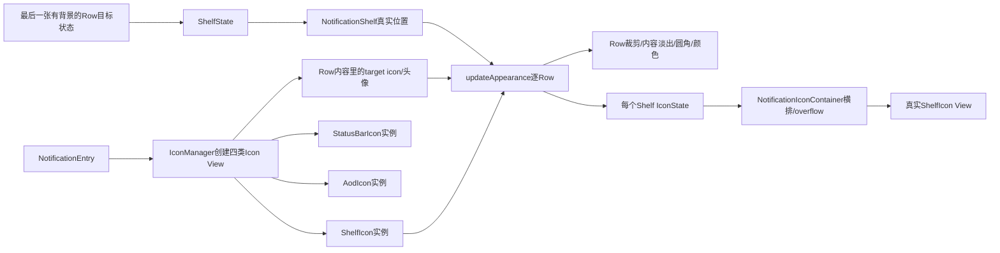
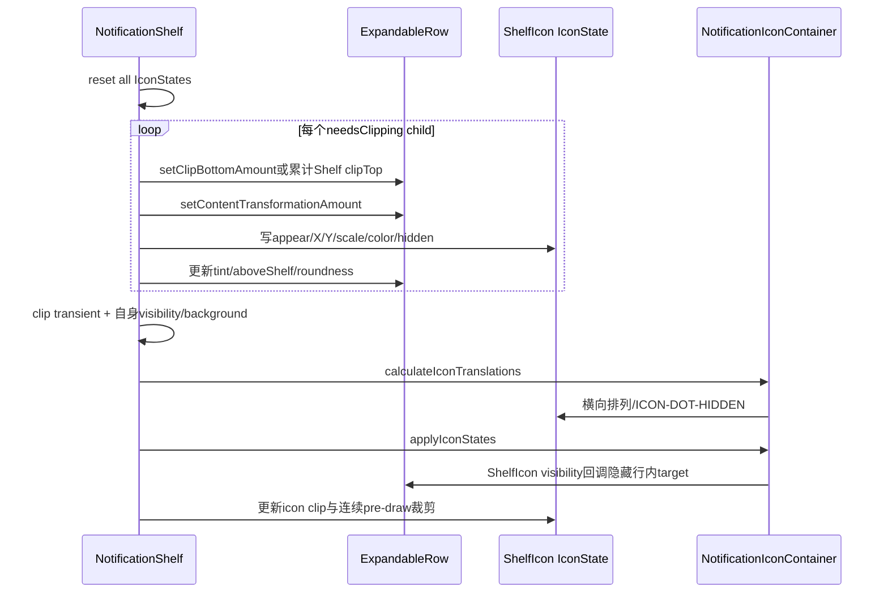
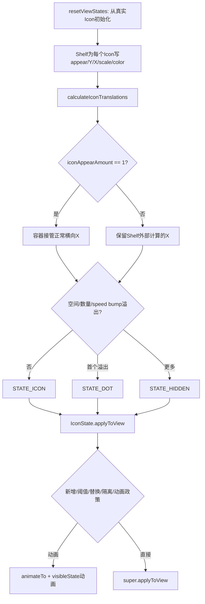

# 第 479 章 Android SystemUI NotificationShelf、ShelfState 与 NotificationIconContainer：通知行内容裁剪、图标变形和连续动画链

> 源码基线：Android 11 / API 30 / `android-11.0.0_r48`。本章只在 macOS 阅读，不实际编译。核心文件：`NotificationShelf.java`、`NotificationIconContainer.java`；交叉阅读 `StackScrollAlgorithm.java`、`ExpandableViewState.java`、`ExpandableView.java`、`ExpandableNotificationRow.java`、`NotificationContentView.java`、`NotificationIconAreaController.java`、`IconManager.kt`、`StatusBarIconView.java` 及本地测试目录。

## 1. 本章要回答什么问题

通知滚到列表底部时，为什么整张卡片会被裁掉、内容向上淡出，而小图标像“钻进”Shelf？Shelf 的位置由谁算？图标是否真从 Row 搬到另一个父容器？快速滚动、AOD、Pulse、HeadsUp、分组和溢出圆点又怎样改变这段动画？本章按一帧真实执行顺序回答。

## 2. 一句话主线

算法先用最后一张有背景的通知生成 `ShelfState`；Shelf 提交后按真实动画中位置逐行计算底部裁剪、内容变形和独立 ShelfIcon 的目标状态；`NotificationIconContainer` 再负责横向排列、溢出圆点和属性动画。

## 3. Shelf不是普通列表项

它继承 `ActivatableNotificationView`，外观像通知卡片，却返回 `hasNoContentHeight=true`，不为线性列表增加内容高度。上一章算法也把它从 `visibleChildren` 中跳过，最后单独 `updateState()`。

## 4. Shelf也不是AOD图标区

Shelf 内的 `NotificationIconContainer`、状态栏折叠图标容器和 AOD 图标容器是三个宿主；同一 `NotificationEntry` 为它们持有不同 `StatusBarIconView` 实例。不能把 Shelf icon、status bar icon、AOD icon 当作一个 View 被反复换父容器。

## 5. 行内目标图标又是第四个对象

通知内容里的 header 小图标或重要会话头像只是变形起点；真正移动和缩放的是 entry 的 ShelfIcon。`getShelfTransformationTarget()` 返回行内 target，用来测相对 top/start padding，并不返回要加入 Shelf 容器的那个 View。

## 6. 为什么视觉上像同一个图标

ShelfIcon 的初始 X/Y、大小和颜色被算成与行内 target 重合，同时 wrapper 把行内 target `forceHidden`；变形完成后 ShelfIcon 回到 Shelf 的标准位置。两个 View 的显隐交接制造出“同一图标飞过去”的连续错觉。

## 7. 主要状态分四层

`ShelfState` 决定 Shelf 自身位置；Row 的 `inShelf/clipBottom/contentTransformation` 决定卡片；`IconState` 决定单个 ShelfIcon；`NotificationIconContainer` 决定整排图标及 overflow。任何一层完成都不代表其余三层已到终点。

## 8. 同时使用目标值和真实值

`updateState()` 读取最后一行的目标 `ViewState`；`updateAppearance()` 大量读取 `getTranslationY()`、`getActualHeight()` 等动画中真实值。前者规划终点，后者让每个动画帧的裁剪和图标连续跟随。

## 9. 本章的三个完成点

ShelfState 生成完成只是目标确定；Shelf 自身 apply/animate 后才有当前位置；随后 `updateAppearance→calculateIconTranslations→applyIconStates` 才更新 Row 与图标。排查时不能只在 `StackScrollAlgorithm.updateShelfState()` 返回处截图下结论。

## 10. 总体协作图



## 11. XML里有哪些实际子View

Shelf XML 内有 normal/dimmed 两层 `NotificationBackgroundView`、一个 `NotificationIconContainer` 和 `FakeShadowView`。高度资源默认 32dp；图标容器左右 padding 默认 13dp，但具体 overlay 可以覆盖资源。

## 12. onFinishInflate的关键配置

它关闭 Shelf 和图标容器的 child/padding 裁剪，图标容器设为 non-static，Shelf 不按 actualHeight 裁自身内容；底圆角固定 1，并把 Shelf 标记为 section 首项以配合整个 Shade 顶部圆角裁剪。

## 13. non-static IconContainer意味着什么

普通状态栏图标容器可在 `onLayout()` 自己 reset/calculate/apply；ShelfIcons 设为 non-static 后，layout 不自动重排，必须由 `NotificationShelf.updateAppearance()` 每帧显式驱动。

## 14. Shelf怎样装进通知栈

Factory 只 inflate 而不 attach；Panel 依赖初始化时调用 NSSL `setShelf()`，宿主加入 child，并把同一对象交给 AmbientState、StackStateAnimator，再调用 `shelf.bind(ambient, host)`。

## 15. 图标区域怎样与Shelf连接

`NotificationIconAreaController.setupShelf()` 保存 ShelfIcons，并把状态栏折叠图标容器传给 `setCollapsedIcons()`。后者用于计算 Shelf 从状态栏窄图标区展开到全宽时的起点、宽度和 padding。

## 16. ShelfIcons里放哪些通知

`updateShelfIcons()` 允许 ambient 和 low-priority，不隐藏 dismissed、已回复消息、当前媒体、centered icon 或 pulsing。它的候选集合通常比状态栏和 AOD 容器更宽；最终是否可见还要由 Shelf 变形逻辑裁决。

## 17. 图标实例在哪里创建

`IconManager.createIcons()` 分别创建 status bar、shelf、AOD、可选 centered icon；ShelfIcon 初始 INVISIBLE，并安装 visibility listener。由此能直接证明不是在运行时把 Row header icon reparent 到 Shelf。

## 18. visibility listener的反向作用

ShelfIcon 变 VISIBLE 时，listener 写 `entry.setShelfIconVisible(true)`，再到 Row/Content wrapper，把行内 header icon 或重要会话头像 forceHidden。ShelfIcon 隐藏时解除这层强制隐藏，完成两个实例的交接。

## 19. 组内child为什么不参加独立ShelfIcon交接

ShelfIcons 候选只遍历 NSSL 的主 Row，不直接遍历 attached children；摘要负责 Shelf 里的代表 Icon。Row 的 `updateIconVisibilities()` 对 child-in-group 传入 false，恰恰是不强制隐藏其内容图标，而不是把一个 child ShelfIcon显示出来；组抑制/摘要替换由 IconAreaController 重建列表处理。

## 20. ShelfState从谁复制

输入是 `AmbientState.getLastVisibleBackgroundChild()`，即通知区最后一个带背景的可见 child，不是宿主最后一个 View，也不是 Footer、EmptyView 或 Shelf 自己。

## 21. last background child何时更新

NSSL 的 `updateFirstAndLastBackgroundViews()` 根据 section 和当前背景 child 重算，并写入 AmbientState。它同时驱动 section bounds 和圆角；Shelf 与通知区背景因此共享同一“最后实体卡片”事实。

## 22. ShelfState原始源码

```java
public void updateState(AmbientState ambientState) {
    ExpandableView lastView = ambientState.getLastVisibleBackgroundChild();
    ShelfState viewState = (ShelfState) getViewState();
    if (mShowNotificationShelf && lastView != null) {
        float maxShelfEnd = ambientState.getInnerHeight() + ambientState.getTopPadding()
                + ambientState.getStackTranslation();
        ExpandableViewState lastViewState = lastView.getViewState();
        float viewEnd = lastViewState.yTranslation + lastViewState.height;
        viewState.copyFrom(lastViewState);
        viewState.height = getIntrinsicHeight();
        viewState.yTranslation = Math.max(Math.min(viewEnd, maxShelfEnd) - viewState.height,
                getFullyClosedTranslation());
        viewState.zTranslation = ambientState.getBaseZHeight();
        float openedAmount = (viewState.yTranslation - getFullyClosedTranslation())
                / (getIntrinsicHeight() * 2 + mCutoutHeight);
        openedAmount = Math.min(1.0f, openedAmount);
        viewState.openedAmount = openedAmount;
        viewState.clipTopAmount = 0;
        viewState.alpha = 1;
        viewState.belowSpeedBump = mAmbientState.getSpeedBumpIndex() == 0;
        viewState.hideSensitive = false;
        viewState.xTranslation = getTranslationX();
        if (mNotGoneIndex != -1) {
            viewState.notGoneIndex = Math.min(viewState.notGoneIndex, mNotGoneIndex);
        }
        viewState.hasItemsInStableShelf = lastViewState.inShelf;
        viewState.hidden = !mAmbientState.isShadeExpanded()
                || mAmbientState.isQsCustomizerShowing();
        viewState.maxShelfEnd = maxShelfEnd;
    } else {
        viewState.hidden = true;
        viewState.location = ExpandableViewState.LOCATION_GONE;
        viewState.hasItemsInStableShelf = false;
    }
}
```

这是 r48 方法主体；源码中的小屏 cutout 解释性注释在摘录中省略，赋值和分支未改写。

## 23. yTranslation公式怎样读

先取最后 Row 的目标底边，最多不超过 `innerHeight+topPadding+stackTranslation`，再减 Shelf 高度，让 Shelf 顶边贴在该底边之上；最后不得高于 `getFullyClosedTranslation()` 给出的折叠位置边界。

## 24. fullyClosedTranslation为什么可能是负数

公式是 `-(shelfHeight-statusBarHeight)/2`。Shelf 折叠成状态栏附近的小区域时，局部顶边允许略高于 0；这不是通知滚到负 Y，而是 Shelf 自身由高 32dp 向状态栏图标基线对齐的设计坐标。

## 25. Shelf复制最后Row哪些状态

它继承 alpha、X/Y/Z、hidden、scale、height、dim、speed bump、location 等，再覆盖 height、Y、Z、alpha、clip、hideSensitive 和 X。上一章确认 `ExpandableViewState.copyFrom()` 不复制 `inShelf`，因此 Shelf 自身每轮 reset 后仍保持 `inShelf=false`。

## 26. stable shelf不是实际像素统计

`hasItemsInStableShelf=lastViewState.inShelf` 读取算法目标：最后 Row 在动画结束后是否属于 Shelf。它不同于当前帧 `numViewsInShelf` 的连续总量，也不同于图标此刻是否已经 VISIBLE。

## 27. Shelf自身何时hidden

即使有 last row，只要 Shade 未 expanded 或 QS customizer showing，目标 hidden=true；没有 last row 或配置关闭则 hidden，location 设 GONE。实际 `updateAppearance()` 还会因自身 clipTopAmount 覆盖整高而设 INVISIBLE。

## 28. config关闭时的双层防护

`initDimens()` 直接把 Shelf View 设 GONE；`updateState()` 和 ShelfState apply/animate 又检查 `mShowNotificationShelf`。这避免配置关闭后算法和外观路径重新把它显示出来。

## 29. openedAmount如何产生

Shelf Y 接近 `maxLayoutHeight-2*shelfHeight` 后，从 0 到 1 线性增加；越过一倍 Shelf 高度即到 1。它不是 Panel expansion fraction，而是根据 Shelf 当前目标位置派生的“从状态栏折叠形态展开为全宽 Shelf”进度。

## 30. openedAmount怎样改变容器几何

它用反向 FAST_OUT_SLOW_IN 在折叠图标区末端与 ShelfIcons 全宽之间插值 actual width，同时插值 start/end padding，并传给 IconContainer。RTL 时折叠起点会镜像。

## 31. 非全宽Panel或Dozing为何强制opened=1

`setOpenedAmount()` 先缓存原始进度，再在 `!panelFullWidth || dozing` 时把局部计算值改成 1，跳过从状态栏图标区展开的横向变形。原始值仍用于判断本帧是否 0→1 跳变。

## 32. mNoAnimationsInThisFrame只活一帧

原始 openedAmount 从 0 直接到 1 时置 true，阻止同帧 canned icon animation；下一次仍传 1 时，因为旧值已是 1，会恢复 false。它是一次跳变抑制器，不是永久关闭动画。

## 33. ShelfState提交顺序

`applyToView()` 或 `animateTo()` 先调用父类提交 Shelf 自身，再写 maxShelfEnd、openedAmount，立即 `updateAppearance()`，之后写 stable items，最后按 Shelf 总开关恢复 IconContainer 动画。

## 34. stable items为何在updateAppearance之后写

本帧外观里的 `backgroundForceHidden` 读取 ShelfState 自己的 `hasItemsInStableShelf`，不是成员 `mHasItemsInStableShelf`；而点击/阴影读取成员，在 appearance 后才更新。两者来源相同但生效点不同。

## 35. updateAppearance还会在动画pre-draw执行

NSSL 的 `onPreDrawDuringAnimation()` 每帧调用 `mShelf.updateAppearance()`。因此即使 ShelfState 目标没有重新生成，Shelf 也能根据 Row/Shelf Animator 的当前值连续更新裁剪与图标。

## 36. 每次appearance先重置IconState

`mShelfIcons.resetViewStates()` 从真实 Icon View 初始化 X/Y/Z/alpha/scale/color，并清通用 hidden；Shelf 随后为每个参与 Row 覆盖目标。自定义字段如 clamped amount、useFull、noAnimations 不在 reset 中统一清零，它们有跨帧记忆。

## 37. expandAmount与openedAmount不是同一量

appearance 重新用“ShelfStart 相对 maxLayoutHeight-2*shelfHeight”计算 expandAmount，主要控制纵向变形距离和曲线；openedAmount 还控制容器宽度/padding。数值来源相近，消费者不同。

## 38. 遍历哪些宿主child

跳过 `needsClippingToShelf=false` 或 GONE。普通 ExpandableView 默认需要裁；Shelf 自己覆盖为 false，因此不会递归裁自己。Footer/Empty 等非 Row 也可能参与裁剪和内容变形，但没有 ShelfIcon 状态。

## 39. aboveShelf使用最终Z而非当前Z

它通过 `ViewState.getFinalTranslationZ(child)>baseZ` 或 pinned 判断。appearance 的 Y/height 用真实值，aboveShelf 却看动画终点 Z；这是刻意的混合时序，可提前保护将要浮到 Shelf 上方的 HUN。

## 40. notificationClipEnd有两个位置

普通已归 Shelf 的行裁到 `shelfStart-paddingBetweenElements`；最后一行尚未 inShelf、aboveShelf 或 backgroundForceHidden 时，裁剪终点放到 Shelf 底边。后者避免悬浮/最后一行被 Shelf 顶边过早切掉。

## 41. bottom clip何时写到Row

Row 底边越过 clipEnd、自己不是“应裁 Shelf 顶部”的 Pulse 行，且 Shade expanded 或不是 pinned，才设置 `clipBottomAmount=viewEnd-clipEnd`。Pinned 行的裁剪最多到 `intrinsicHeight-collapsedHeight`，保留折叠 HUN 高度。

## 42. Dozing非Pulse的Pinned为何不同

`isPinned` 还要求不是 `isDozingAndNotPulsing(view)`。AOD 下不 pulsing 的 row 不享受 pinned 保护，可按普通内容裁掉；真正 Pulse 行走另一条“裁 Shelf 自身顶部”的路径。

## 43. Pulse expanding的childIndex规则

Pulse expansion 时仅 `childIndex==0` 的参与项要求裁 Shelf 自身顶部；非 expansion 时由 `view.showingPulsing()` 决定。传入 index 是只对通知 Row 递增的 notGoneIndex，非 Row 会复用当前值，不能简单等同宿主 index。

## 44. Pulse为何裁Shelf而不是裁通知

Pulse 通知要完整显示在 AOD/Shelf 上方，代码把其底边相对 Shelf 顶部的距离返回为 Shelf `clipTopAmount`，而不裁通知底部。若 clip 覆盖整个 Shelf 高度，Shelf 自身变 INVISIBLE。

## 45. 裁剪源码

```java
private int updateNotificationClipHeight(ExpandableView view,
        float notificationClipEnd, int childIndex) {
    float viewEnd = view.getTranslationY() + view.getActualHeight();
    boolean isPinned = (view.isPinned() || view.isHeadsUpAnimatingAway())
            && !mAmbientState.isDozingAndNotPulsing(view);
    boolean shouldClipOwnTop;
    if (mAmbientState.isPulseExpanding()) {
        shouldClipOwnTop = childIndex == 0;
    } else {
        shouldClipOwnTop = view.showingPulsing();
    }
    if (viewEnd > notificationClipEnd && !shouldClipOwnTop
            && (mAmbientState.isShadeExpanded() || !isPinned)) {
        int clipBottomAmount = (int) (viewEnd - notificationClipEnd);
        if (isPinned) {
            clipBottomAmount = Math.min(
                    view.getIntrinsicHeight() - view.getCollapsedHeight(),
                    clipBottomAmount);
        }
        view.setClipBottomAmount(clipBottomAmount);
    } else {
        view.setClipBottomAmount(0);
    }
    if (shouldClipOwnTop) {
        return (int) (viewEnd - getTranslationY());
    } else {
        return 0;
    }
}
```

## 46. 裁剪与图标更新时序图



## 47. expand animation为何可拒绝bottom clip

`ExpandableNotificationRow.setClipBottomAmount()` 在 `mExpandAnimationRunning` 时直接 return；组 child 正展开时也避免覆盖其裁剪。Shelf 算出了数值，不代表 Row 一定接受，这保护 Row 自己的展开几何。

## 48. transient view怎样裁

删除动画使用的 transient child 不在正常宿主遍历结果里，Shelf 另遍历 `getTransientViewCount()`，以 Shelf 顶边为 clipEnd、index=-1 调同一函数，防止快速滑动时离场 View 绘到通知栈底部以下。

## 49. Shelf自身visibility还有第二道门

appearance 取 `getViewState().hidden`，再 OR `clipTopAmount>=intrinsicHeight`，最后设 VISIBLE/INVISIBLE。它不在这里设 GONE，避免动画/状态对象因临时裁满而退出布局。

## 50. ShelfIcon还要单独clip

若 Shelf 自身顶部被裁，或 Row 顶边压住 ShelfIcon，`updateIconClipAmount()` 给 icon 设置 clipBounds；fullyHidden 时反而清 clip，使隐藏过渡不被旧几何裁断。

## 51. 连续裁剪为什么需要pre-draw listener

Icon Y Animator 每帧改变 translation，单次 appearance 算的 clipRect 会过时。只要 Icon 正在 Y 动画且非 Dozing，Shelf 在 Icon 的 ViewTree 上挂 pre-draw，每帧重算 clip，动画结束后移除。

## 52. 连续裁剪listener的累积边界

正常动画结束时 pre-draw listener 会移除并清 tag，却没有移除同时注册的 `OnAttachStateChangeListener`；每次新的连续裁剪会再加一个。它们捕获旧 observer/predraw，直到以后 detach 仍会逐个回调，属于 r48 可证明的 listener 累积，而非仅命名问题。

## 53. Dozing只阻止新建listener

`needsContinuousClipping` 创建条件含 `!isDozing()`；已经挂上的 listener 内部只检查 Y 是否仍动画，不再检查 Dozing。因此中途进入 Doze 不会主动终止旧 listener，通常要等动画结束或 Icon detach。

## 54. numViewsInShelf怎样控制背景

每个 Row 返回 `fullTransitionAmount` 并累加；总和小于 1 时隐藏 Shelf 背景。它允许两张各进入 0.5 合计显示背景，并不要求某一张已 `inShelf=true`。

## 55. backgroundForceHidden是什么

当当前背景已要求隐藏、且 ShelfState 认为动画终点没有稳定 item 时，forceHidden=true；它把 clipEnd 放到底边并最终继续隐藏背景，避免空 Shelf 在过渡中闪出实体卡片。

## 56. mNotGoneIndex怎样找

遇到第一张真实 `rowTranslationY>=shelfStart` 的 Row 时记录通知序号；若一张都没有，循环后记录 Row 总数。它描述 Shelf 在当前真实画面中的视觉插入位置。

## 57. mNotGoneIndex有一帧反馈特征

`updateState()` 在算法阶段读取成员旧值来修正 ShelfState.notGoneIndex；本帧 `updateAppearance()` 才按真实位置写新值，供后续算法/动画延迟使用。它不是与目标 ViewState 同时一次性算出的纯值。

## 58. 颜色如何从最后Row过渡到Shelf

代码跟踪 previousColor、colorTwoBefore 和 last row 前一项颜色。Shelf tint 取越过顶边前的 Row 色；最后 Row 在 Shade expanded 且非 Keyguard Bypass 时，用 `inShelfAmount` 向前一背景色做 override，减少卡片合并处的色块跳变。

## 59. Bypass为什么禁止改最后Row颜色

Keyguard Bypass 下通知/图标显隐由离散 Doze/hide 政策驱动，普通 Shade 的连续背景融合会产生不合时机的 tint。代码保留 Row 原色，并让其他可见性路径处理过渡。

## 60. aboveShelf标志会被appearance收口

对非第一张 Row，或第一张但最终不 aboveShelf，代码调用 `setAboveShelf(false)`。只有第一张且 pinned/最终 Z 高于 base 的行可保留；Shelf 外观阶段会清理其他行可能残留的 elevated 标志。

## 61. section gap如何改变Shelf顶圆角

若 Shelf 顶边落在上一 section 末项与下一 section 首项之间，按 Shelf 距 gap 顶部的比例把 Shelf 顶圆角和上一项底圆角同步从 0 插到 1，使间隔中两条边像一个连续分离过程。

## 62. 第一图标何时决定backgroundTop

只有通知序号 0 的 ShelfIconState 存在且 `clampedAppearAmount==1`，才用 Row 相对 Shelf Y 设置 backgroundTop，并复制 Row 当前顶圆角。半进入的第一图标不会立即把背景顶边推下。

## 63. 变形有三个不同amount

`fullTransitionAmount` 表示整行进入 Shelf 的连续量并用于背景统计；`transitionAmount` 更靠近行内 icon target，用于 ShelfIcon 几何；`contentTransformationAmount` 控制卡片内容上移/淡出。三者不可互换。

## 64. transformDistance从哪里来

基础为 Shelf 高度的 1.5 倍；expandAmount 从 0→1 时再把倍率从 1 插到 1.5，即最大 2.25 倍 Shelf 高度；随后不得超过 Row fullHeight，也不得超过 Row 底边到 icon transform start 的距离。

## 65. 最后一张Row为什么特殊

它把 fullHeight 和 transformDistance 限到 `minHeight-shelfHeight`，并用整张通知到 Shelf 的距离计算 transition，而不是只看 icon target。否则最后一张卡片的图标位置较低时会很晚才开始收口。

## 66. 局部进入公式怎样读

Row 顶在 Shelf 上方、底已越过 Shelf 时，以 `(shelfStart-viewStart)/fullHeight` 求重叠比例，再经过 accelerate-decelerate，并按 expandAmount向线性比例混合；最后用 `1-ratio` 得到从 0 到 1 的进入量。

## 67. Row顶到达Shelf时为何直接为1

若 `viewStart>=shelfStart`，full 和 icon transition 都直接设 1；整张 Row 已处在 Shelf 起点以下，不再需要按高度渐进计算。

## 68. unlock hint和Pinned门

Row 只有底边达到 Shelf，并且不是“unlock hint 中尚未 inShelf”，同时 Shade expanded 或非 pinned/非 HUN-away，才允许进入。锁屏提示动画和折叠 HUN 因此不会被普通 Shelf 变形抢走。

## 69. 内容变形源码

```java
if (viewEnd >= shelfStart && (!mAmbientState.isUnlockHintRunning() || view.isInShelf())
        && (mAmbientState.isShadeExpanded()
        || (!view.isPinned() && !view.isHeadsUpAnimatingAway()))) {
    if (viewStart < shelfStart) {
        if (iconState != null && iconState.hasCustomTransformHeight()) {
            fullHeight = iconState.customTransformHeight;
            transformDistance = iconState.customTransformHeight;
        }
        float fullAmount = (shelfStart - viewStart) / fullHeight;
        fullAmount = Math.min(1.0f, fullAmount);
        float interpolatedAmount = Interpolators.ACCELERATE_DECELERATE.getInterpolation(
                fullAmount);
        interpolatedAmount = NotificationUtils.interpolate(
                interpolatedAmount, fullAmount, expandAmount);
        fullTransitionAmount = 1.0f - interpolatedAmount;

        if (isLastChild) {
            transitionAmount = (shelfStart - viewStart) / transformDistance;
        } else {
            transitionAmount = (shelfStart - iconTransformStart) / transformDistance;
        }
        transitionAmount = MathUtils.constrain(transitionAmount, 0.0f, 1.0f);
        transitionAmount = 1.0f - transitionAmount;
        fullyInOrOut = false;
    } else {
        fullTransitionAmount = 1.0f;
        transitionAmount = 1.0f;
    }

    contentTransformationAmount = (shelfStart - viewStart) / transformDistance;
    contentTransformationAmount = Math.min(1.0f, contentTransformationAmount);
    contentTransformationAmount = 1.0f - contentTransformationAmount;
} else {
    fullTransitionAmount = 0.0f;
    transitionAmount = 0.0f;
    contentTransformationAmount = 0.0f;
}
```

这是 r48 主公式的连续原始片段，仅去掉注释。

## 70. content amount在Row里怎样落地

`ExpandableView` 用 `-amount*contentShift` 上移内容；alpha 先由 `(1-amount)/0.5` 限到 1，再过 ALPHA_OUT，意味着变形后半段才明显淡出。最后一项的 Y 位移再乘 0.4，移动更弱。

## 71. 非最后Row实际上不淡出

`ExpandableNotificationRow.applyContentTransformation()` 对非最后项把计算出的 alpha 强制改回 1，只保留 translationY；最后一项才对私有/公开 layout 和 children container 真正淡出。

## 72. expand animation会冻结内容变形

Row 的 `updateContentTransformation()` 在 expand animation running 时直接 return。Shelf 仍会计算并调用 setter，但 Row 暂不重写内容 alpha/Y，避免与展开动画争夺同一属性。

## 73. aboveShelf和Pulse为何禁用内容变形

Row aboveShelf、showingPulsing，或非最后项且 IconState 不允许 translateContent 时，amount 被改成 0。悬浮/脉冲通知应保留完整内容，不应边展示边钻入 Shelf。

## 74. customTransformHeight解决什么跳变

Panel 非手指跟踪地自动展开、scrollY=0、非 Keyguard 时，正常曲线可能让最后一个 Icon 卡在行与 Shelf 中间。代码把该 Icon 标为 `isLastExpandIcon`，选择强制进 Shelf或持久化较短 custom height。

## 75. custom状态何时清

只有 Icon 已完全进或完全出、当前不再 expandingAnimated 时，才清 `isLastExpandIcon/customTransformHeight`。它刻意跨越 expansion 结束边沿保留，避免下一帧曲线突然换回。

## 76. 0.5阈值与target clipped

Icon transition 大于 0.5，或行内 transformation target 的底边已经碰到 Shelf 前一段 padding，就令 binary `clampedAmount=1`；否则为 0。Target 若将被裁，策略是把独立 ShelfIcon 提前放进 Shelf，而不是继续裁掉“源图标”。

## 77. continuous与canned怎样配合

最后一项、关闭 opening animations、useFull/useLinear 时用连续 amount；普通非最后项默认使用 binary clamped amount，并在 0↔1 改变时标 `needsCannedAnimation`，让 Icon 以 100ms overshoot 动画跨过阈值。

## 78. 快速滚动为何取消旧Icon动画

快速 scroll 或某些自动 expansion 状态下，若不是强制进 Shelf，代码取消 Icon 动画、启用 full transition 并 `noAnimations=true`，优先让图标跟手/跟布局，避免多个短动画落后于高速位置。

## 79. 这些IconState开关有跨帧记忆

resetViewStates 只重置通用 ViewState 和 color；`useFullTransitionAmount`、`useLinearTransitionAmount`、`translateContent`、`noAnimations`、custom height 等不会统一清除，只在端点或特定分支改写。这是有意的滞回状态，不能把每帧当纯函数。

## 80. hideAmount对Icon transition的离散处理

只要 Ambient hiddenAtAll 且 Row 尚未 inShelf，中间 hide 量统一令 transition=0；到 fullyHidden 才跳到 1。源码没有按 hideAmount 连续插值这项几何，其他通知可见动画、alpha和容器显隐负责整体过渡。

## 81. fullyHidden时Icon大小不同

Shelf icon 标准尺寸取状态栏 icon size；fullyHidden 时改为 `hidden_shelf_icon_size`（默认 16dp），再乘 Icon 自身 scale。不要把这理解成 AODIcon：仍然是 ShelfIcon 实例，只是目标尺寸变小。

## 82. noIcon路径如何补出图标

Guts 暴露或当前 content wrapper 没有 transformation target 时，ShelfIcon alpha 使用 transition，初始大小取 ShelfIcon 的一半，并从容器 start padding 出现。它避免从一个不存在的行内图标坐标硬插值。

## 83. X/Y缩放的真实起终点

Y 从“Row Y+contentTranslation+target top padding”到 ShelfIcon 居中位置；X 从 target 相对 start padding 到 ShelfIcons actual start padding；scale 从 target height 到 Shelf icon size。RTL 的行内 start 由递归相对坐标函数处理，容器最终横排再镜像。

## 84. stayingInShelf为何强制标准状态

Row 已 `inShelf` 且不在 `transformingInShelf` 时，Icon appear=1、alpha=1、scale=1、hidden=false。这样完成动画的稳定图标不再因上游临时 amount 误差抖动。

## 85. 哪些Row最终仍隐藏ShelfIcon

Row aboveShelf、showingPulsing，或尚未 inShelf 且“最后一项 Guts 暴露/目标 Z 高于 base”时，IconState.hidden=true。候选列表包含它，不等于这一帧一定画出。

## 86. Icon颜色怎样过渡

先根据 Shelf 背景求有对比度的静态色；若 Row 确实有源图标色，则按 `iconAppearAmount` 从 Row original icon color 插到 Shelf 对比色。颜色进度与几何 appear 绑定。

## 87. 一个明确的未使用参数和两个残留字段

`setIconTransformationAmount()` 接收 `iconTransformDistance` 却从未读取；`mStatusBarPaddingStart` 只加载资源不消费；`mMaxShelfEnd` 只由 setter 写入不读取。它们是 r48 残留，不能拿来解释当前视觉决策。

## 88. IconContainer状态流水线



## 89. IconContainer怎样拥有IconState

View add 时创建 `IconState(child)` 放进 map；组摘要/child 替换若识别为 replacing，会标 justReplaced 而不是 justAdded。换位期间 `mChangingViewPositions=true`，remove/add 不删除原有 state。

## 90. Shelf每轮为何先reset再横排

Shelf 已为部分进入的 Icon 写外部 X/Y，Container 不能覆盖它们；`calculateIconTranslations()` 只在 `iconAppearAmount==1` 时把 X 设为正常横排位置。小于 1 的 Icon 保留 Shelf 计算的连续 X。

## 91. maxVisibleIcons的三种模式

锁屏最多 5；static 容器最多 4；ShelfIcons 是 non-static，数量上限等于 childCount。但 Shelf 仍会因实际空间或 speed bump 把后续 icon 转为 overflow，并非无限显示。

## 92. speed bump怎样强制overflow

索引达到 speedBumpIndex 且 appear>0，或超过 maxVisibleIcons，就 forceOverflow。Shelf 因此可把 gentle/silent 分区的后续图标压成一个圆点，即使横向空间仍足够。

## 93. overflow边界怎么算

正常 Icon 逐个按 `appearAmount*width*drawingScale` 推进 translationX；空间不足时记录 firstOverflowIndex 和 visualOverflowStart，之后从 overflowStart 重排为 DOT/HIDDEN。

## 94. MAX_DOTS=1带来的真实结果

r48 常量 `MAX_DOTS=1`：第一个达到显示条件的 overflow 变一个 DOT，后续全 HIDDEN。文件注释仍写 mNumDots 范围 [0,3]、partial overflow 可为 1或2，已经与常量不一致。

## 95. partial-overflow分支实际不可达

`hasPartialOverflow()` 要求 `mNumDots>0 && mNumDots<MAX_DOTS`；MAX_DOTS 为 1 时不存在满足的整数，所以恒 false，`getPartialOverflowExtraPadding()`恒返回 0。Shelf 的 opened padding 分支仍保留调用，是历史通用代码。

## 96. overflow从ICON切DOT的0.8门

第一个 overflow icon 的 appearAmount 小于 0.8 时暂保持 ICON；达到阈值才变 DOT并计数。这样一个正在进入的图标不会刚露一点就突然画成圆点。

## 97. 锁屏横向居中

onLockScreen 时按首末可见 state 估算 contentWidth，把所有 Icon X 平移到可用区域中间；有 overflow 时圆点视觉权重按一半折中。最后再统一执行 RTL 镜像。

## 98. firstVisible名字并不筛hidden

循环首次迭代就设置 `mFirstVisibleIconState`，没有检查 alpha、hidden、appear 或 visibleState。它实际是“首个 child state”；锁屏居中在特殊隐藏组合下可能用到名不副实的参考。

## 99. 容器清空留下last state

`calculateIconTranslations()` 开头清 `mFirstVisibleIconState`，却不清 `mLastVisibleIconState`；childCount=0 时也没有后续分支覆盖。`getFinalTranslationX()` 因而可能返回已移除最后 Icon 的旧 X，Shelf opened width 又会拿这个折叠容器结果作起点。

## 100. 这是内存泄漏还是几何残留

Map 在 remove 时会删除 state，但成员仍强引用旧 `IconState`，后者又持有旧 View，因此至少会延长最后一个 Icon/View 的生命期，并提供过时几何；下一次出现 Icon 后会覆盖。是否造成可见宽度闪动要运行时复现，不能静态宣称必现。

## 101. IconState提交源码

```java
icon.setVisibleState(visibleState, animationsAllowed);
icon.setIconColor(iconColor, needsCannedAnimation && animationsAllowed);
if (animate) {
    animateTo(icon, animationProperties);
} else {
    super.applyToView(view);
}
boolean inShelf = iconAppearAmount == 1.0f;
icon.setIsInShelf(inShelf);
```

这是 r48 `IconState.applyToView()` 中连续的提交片段；上半段负责选择新增、DOT、canned、兄弟X或isolation动画政策，外层分支结束后还会清 `justAdded/justReplaced/needsCannedAnimation`。

## 102. justAdded动画怎样开始

若 appearAmount 非 0，先直接 apply 目标基础状态，再把 alpha=0、visibleState=HIDDEN，使用 50ms delay、200ms alpha 动画进入。appear=0 的新 Icon 不启动这段添加动画。

## 103. canned动画为什么会overshoot

clamped threshold 翻转时组合 X/Y/alpha/scale filter，Y 对普通图标用 `ICON_OVERSHOT`，重要会话用幅度较小的 `ICON_OVERSHOT_LESS`；100ms 后若 Y 动画结束且 appear=0，再设 INVISIBLE。

## 104. 动画政策的优先组合

新增/替换、ICON↔DOT、add start index、canned、canned之后的兄弟 X、isolation 依次可能覆盖或合并 properties。共享 `sTempProperties` 每个 child 前重置 filter/interpolator，依赖主线程顺序使用。

## 105. setAnimationsEnabled(false)不是只改布尔

从 true 切 false 时，Container 遍历所有 child，取消 state 动画并立即 apply 当前目标，然后才保存 false。Shelf 自身的开关会在禁用时立刻关 Icon 动画，重新启用则等 ShelfState本帧 appearance 后调用。

## 106. Icon的isInShelf采用严格端点

提交后以 `iconAppearAmount==1.0f` 写 `StatusBarIconView.mIsInShelf`。它表示 Shelf 变形完成，不保证 visibleState 是 ICON：空间 overflow 时同一 Icon 仍可能是 DOT 或 HIDDEN。

## 107. replacing icon如何避免闪烁

IconAreaController 找被移除 Icon 与新候选中 source icon、groupKey 相同且恰好唯一的配对，临时写 replacing map；Container remove/add 时跳过普通消失/新增动画。若同组有多个相同候选，认为歧义并取消 replacement 优化。

## 108. Shelf点击与稳定状态

只有状态为 KEYGUARD 且 `mHasItemsInStableShelf=true` 才设置 clickable/focusable/accessibility yes；点击 listener 再检查 StatusBar 当前 state，唤醒 Dozing 并 `goToLockedShade(null)`。它展开通知区，不代表点击某个具体通知。

## 109. 初始交互状态的一处不对称

XML 预设 clickable/focusable=true；成员默认 status=SHADE、stable=false，却没有在 inflate/attach 主动 `updateInteractiveness()`。StatusBarStateController `addCallback()`也不回放当前状态；要等状态改变或 stable 值发生改变才校正。点击 listener 自带 KEYGUARD 门，但可访问性/可聚焦属性存在短暂或长期不同步风险。

## 110. 测试覆盖事实

本地没有 `NotificationShelfTest` 或 `NotificationIconContainerTest`。`NotificationIconAreaControllerTest` 只有 3 项，测试 low-priority setting 与 AOD appear；`StatusBarIconViewTest` 4 项、Row 测试 26 项也没有覆盖本章的 Shelf 几何、overflow和连续裁剪闭环。

## 111. 推荐诊断顺序

先确认 ShelfIcons 候选列表和 IconState 是否存在；再区分 ShelfState 目标Y与真实Y；打印 Row start/end、Shelf start、三个 amount；随后看 clamped/useFull/noAnimations；最后检查 Container overflow visibleState、真实 Animator tag 和 clipBounds。不要从最终一个 INVISIBLE 反猜全链。

## 112. macOS只读练习一：证明图标不是reparent

用 `rg` 串起 `IconManager.createIcons→NotificationEntry.icons→NotificationIconAreaController.updateShelfIcons→NotificationShelf.setIconTransformationAmount`，列出 row target、ShelfIcon、status bar icon、AOD icon 四个对象，各写父容器和用途。

## 113. macOS只读练习二：手算三个amount

任选 shelfHeight=32、RowStart=100、RowHeight=96、ShelfStart 分别为 196/164/132/100，忽略插值曲线先手算 full、icon、content amount；再标注最后一项、target较低时公式会怎样变化，全程不运行代码。

## 114. macOS只读练习三：审计裁剪责任

逐行阅读 `updateNotificationClipHeight()`、`ExpandableNotificationRow.setClipBottomAmount()`、`updateIconClipAmount()`，做一张普通Row/Pinned/Pulsing/PulseExpanding/ExpandAnimation表，写清是裁Row底、裁Shelf顶、裁Icon还是拒绝裁剪。

## 115. macOS只读练习四：推演overflow

从 `MAX_DOTS=1` 出发，给 6 个 Icon 设置不同 appearAmount 和 speedBumpIndex，手工走 `calculateIconTranslations()`，记录 X、ICON/DOT/HIDDEN、mNumDots、first/last state；再证明 `hasPartialOverflow()`在r48为何恒 false。

## 116. 易错理解一：Shelf就是状态栏图标区

错误。ShelfIcons、collapsed notification icons、AOD icons 是独立 Container，entry 也持有独立 Icon View；Shelf 只借 collapsed container 的位置/宽度作为展开几何起点。

## 117. 易错理解二：inShelfAmount只有一个

错误。整行、图标、内容至少三套量，另有二值 clamped amount 和目标 boolean inShelf。背景、淡出、X/Y、canned animation各自消费不同值。

## 118. 易错理解三：进入Shelf就一定显示为小图标

错误。Icon appear=1 只说明变形完成；aboveShelf/Pulse/Guts可令 hidden，Container 空间/speed bump又可把它变 DOT 或 HIDDEN，Shelf自身也可能 hidden或被clip满。

## 119. 复读后的最终心智模型

ShelfState负责“平台放哪里”，appearance负责“卡片怎样被平台吞入”，IconState负责“独立替身图标如何接棒”，IconContainer负责“替身们怎样横排与溢出”。一帧同时存在目标平面、真实动画平面和跨帧滞回开关。

## 120. 本章结论与下一章

r48 Shelf依靠目标/真实双平面、三套变形量、Row/Shelf/Icon三重裁剪和二值阈值+canned动画实现连续视觉；复读还确认 listener累积、三个残留参数/字段、partial overflow不可达、空容器last state残留及初始交互属性不同步等边界。下一章继续研究 `NotificationChildrenContainer`、组摘要与子通知的高度、裁剪、展开状态和动画链。
