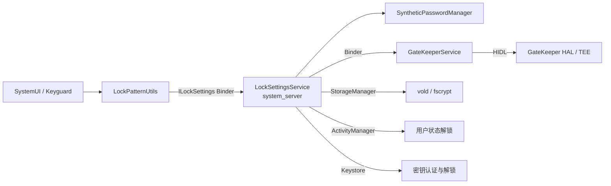
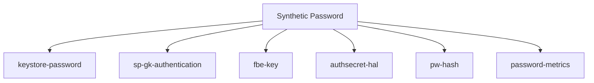
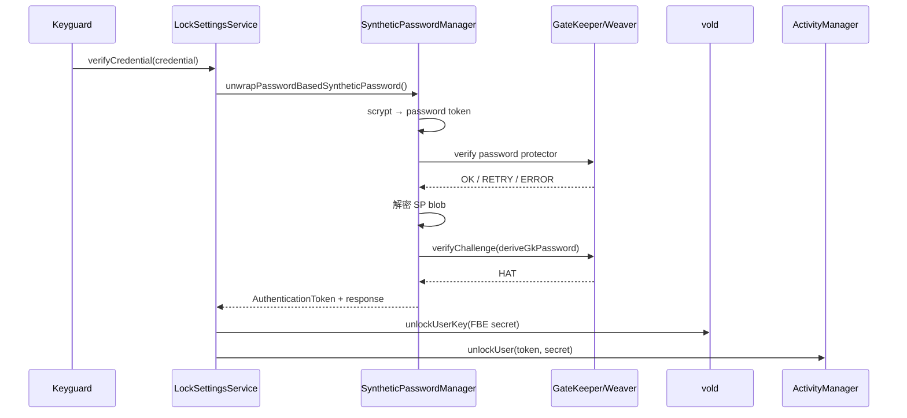

# 48 LockSettingsService、GateKeeper、Synthetic Password 与用户解锁

> 源码版本：Android 11 / API 30 / `android-11.0.0_r48`  
> 学习方式：macOS 只读源码，不要求编译。  
> 本章目标：能解释输入正确 PIN 后，系统如何验证凭据、恢复 Synthetic Password、生成认证令牌、解锁 CE 存储并推进 Android 用户状态。

---

## 1. 先看最终答案

用户在锁屏界面输入 PIN 后，Android 11 的核心链路不是简单执行：

```text
输入 PIN → 与磁盘上的 PIN 比较 → 解锁
```

而更接近：

```text
输入凭据
→ LockSettingsService
→ scrypt 派生 password token
→ GateKeeper 或 Weaver 限速验证
→ 解开 Synthetic Password blob
→ 从 Synthetic Password 派生不同用途的秘密
→ GateKeeper 签发 Hardware Auth Token
→ vold 解锁用户 CE 存储密钥
→ Keystore 获得认证状态/解锁材料
→ ActivityManager 推进用户到 unlocked
```

最重要的设计思想是：**用户凭据是低熵、可更换的输入；Synthetic Password 是高熵、随机、稳定的主秘密。**

---

## 2. 为什么不能直接用 PIN 加密所有东西

PIN 通常只有 4～6 位，搜索空间很小。如果磁盘密钥直接由 PIN 派生，攻击者拿到离线数据后可能高速穷举。

Android 把问题拆成两层：

- 凭据层：PIN、图案或密码，用于证明用户身份；
- 高熵秘密层：随机 Synthetic Password，派生 FBE、Keystore 等用途的秘密。

凭据层由 GateKeeper/Weaver 提供可信限速，高熵层负责真正保护系统密钥。修改 PIN 时，通常只需重新建立“新凭据如何解开同一个或新建的 SP 包装关系”，不必用 PIN 直接重加密所有业务文件。

---

## 3. 六个最容易混淆的对象

| 对象 | 是什么 | 是否是用户输入 |
|---|---|---|
| `LockscreenCredential` | PIN/密码/图案的内存包装 | 是 |
| password token | 对凭据做 scrypt 等处理后的结果 | 否，是派生值 |
| Synthetic Password（SP） | 每用户的高熵主秘密 | 否，随机生成 |
| SID | GateKeeper 的 Secure User ID | 否，安全身份标识 |
| Hardware Auth Token（HAT） | 可信认证成功证明 | 否，带 MAC 的短期令牌 |
| FBE user key | 用于解锁用户 CE 数据的文件加密密钥 | 否，由 vold 管理 |

它们不能互换。尤其要记住：SP 既不是锁屏密码，也不是磁盘密钥；它是派生多个用途秘密的根。

---

## 4. 主要进程和组件



运行位置：

- Keyguard UI：通常在 SystemUI；
- `LockSettingsService`、`SyntheticPasswordManager`：`system_server`；
- GateKeeper：系统服务代理加 GateKeeper HAL，可信实现通常位于 TEE；
- vold：独立 native 进程；
- Keystore：Android 11 独立 native 进程。

---

## 5. LockSettingsService 的职责

入口：

```text
frameworks/base/services/core/java/com/android/server/locksettings/LockSettingsService.java
```

它负责协调，而不是亲自完成全部密码学：

- 保存锁屏配置和凭据元数据；
- 调用 GateKeeper enroll/verify；
- 创建、包装和恢复 SP；
- 修改锁屏凭据；
- 通知强认证状态；
- 解锁 Keystore 和 FBE user key；
- 请求 ActivityManager 解锁 Android user；
- 处理 managed profile、escrow token、FRP、reboot escrow 等特殊场景。

它继承 `ILockSettings.Stub`，因此锁屏验证入口是 Binder 服务接口。

---

## 6. LockscreenCredential 为什么值得单独封装

源码：

```text
frameworks/base/core/java/com/android/internal/widget/LockscreenCredential.java
```

它不仅保存字节，还保存类型：NONE、PATTERN、PIN、PASSWORD。验证前会检查传入类型是否与保存类型一致。

凭据属于高度敏感数据，应缩短生命周期并及时清零。源码中的 `scheduleGc()` 不能保证秘密瞬间从所有内存副本消失，但体现了减少驻留时间的意图。

---

## 7. GateKeeper 到底做什么

GateKeeper 主要提供：

1. `enroll`：注册或更新凭据，返回 password handle；
2. `verify` / `verifyChallenge`：验证输入，成功后返回 HAT；
3. 维护 SID；
4. 对失败尝试进行可信限速。

接口：

```text
hardware/interfaces/gatekeeper/1.0/IGatekeeper.hal
system/gatekeeper/gatekeeper.cpp
```

GateKeeper 不负责显示锁屏，也不直接挂载用户目录。它是“可信凭据验证器”。

---

## 8. password handle 不是密码哈希

GateKeeper enroll 后返回的 handle 包含验证所需信息，典型结构关联：

- version；
- user/SID；
- flags；
- salt；
- 由安全环境密钥计算的签名/MAC。

Framework 保存 handle，却不需要保存明文密码。把它简称“密码哈希”容易漏掉两个关键属性：它由可信实现认证，并携带安全身份与版本语义。

---

## 9. SID 是什么

SID 即 Secure User ID，是一个由 GateKeeper 管理的高熵身份标识。它连接锁屏认证和认证绑定密钥：

```text
GateKeeper 验证成功 → HAT 中带 SID
Keystore 密钥授权包含 USER_SECURE_ID → 匹配 SID 后允许使用
```

删除或重置安全锁屏时 SID 可能改变。绑定旧 SID 的密钥可能永久失效，这是安全设计，不只是缓存错误。

不要把 SID 与 Android `userId`、Linux UID、应用 appId 混为一谈。

---

## 10. GateKeeper 如何限速

`system/gatekeeper/gatekeeper.cpp` 中验证失败会更新 failure record，并计算 retry timeout。连续失败后，响应可能是：

```text
RESPONSE_RETRY(timeoutMillis)
```

限速最好由 TEE/安全硬件维护，因为如果只在 SystemUI 倒计时，攻击者绕过 UI 就能继续尝试。

Framework 收到 RETRY 后还会更新 strong-auth 要求，UI 根据 timeout 展示等待时间。

---

## 11. Synthetic Password 是什么

入口：

```text
frameworks/base/services/core/java/com/android/server/locksettings/SyntheticPasswordManager.java
```

源码注释把 `AuthenticationToken` 描述为每用户的 master cryptographic secret。Android 11 v3 创建 SP 时生成两个随机块：

```text
P0 = random
P1 = random
SP = personalizedHash(P0 || P1)
E0 = Encrypt(key=SP, plaintext=P0)
```

SP 本身是高熵随机体系的产物，不是对 PIN 简单 hash 得到的值。

---

## 12. 为什么叫“密码”却不是用户密码

Synthetic Password 是历史命名。更准确的心智模型是：

```text
per-user high-entropy root secret
```

“synthetic” 表示它由系统构造，用来统一派生和包装多个安全秘密。用户不需要知道它，也无法在 UI 中直接输入它。

---

## 13. SP 的多用途派生

`AuthenticationToken` 使用不同 personalization/context，从同一个 SP 派生不同结果：

```java
deriveKeyStorePassword();
deriveGkPassword();
deriveDiskEncryptionKey();
deriveVendorAuthSecret();
derivePasswordHashFactor();
deriveMetricsKey();
```



Personalization 的意义是域分离：即使共享同一个根秘密，不同用途也得到不同派生结果，避免把一处输出直接当作另一处密钥。

---

## 14. SP blob 如何被用户凭据保护

密码型 SP protector 的简化模型：

```text
credential + salt
→ scrypt
→ password token

password token + secdiscardable/Weaver secret
→ applicationId

applicationId + Android Keystore blob key
→ 解密 SP blob
→ 得到 Synthetic Password
```

这里同时组合了：

- 用户知道的低熵凭据；
- 慢速 KDF；
- GateKeeper/Weaver 限速；
- 可删除随机材料 `secdiscardable`；
- Android Keystore 中的 blob key。

任何一步不匹配都无法正常恢复 SP。

---

## 15. secdiscardable 的作用

secdiscardable 是随机数据，参与构造解开 SP blob 所需的 `applicationId`。删除它后，即使其他持久化 blob 还在，也应无法还原同一 applicationId。

这是一种“通过可靠删除少量随机材料，使大块加密数据密码学不可恢复”的设计。它不是用户密码，也不是 SP。

---

## 16. Weaver 是什么

Weaver 提供按 slot 存储的“key 验证 + secret 返回 + 硬件限速”能力。概念接口是：

```text
write(slot, key, value)
read(slot, key)
  key 正确 → 返回 value
  key 错误 → 失败/要求等待
```

在支持 Weaver 的设备上，password token 的派生结果会变成 Weaver key；验证成功拿到 Weaver secret，再参与构造 applicationId。

没有 Weaver 时走 GateKeeper password handle + secdiscardable 路线。两者是不同 protector 后端，不要误以为每台设备都会同时执行两次。

---

## 17. 输入正确凭据的主链

`LockSettingsService.doVerifyCredential()` 优先进入 SP 路径：

```java
response = spBasedDoVerifyCredential(
        credential, challengeType, challenge,
        userId, progressCallback, resetLockouts);
```

主流程如下：



---

## 18. `unwrapPasswordBasedSyntheticPassword()` 逐段理解

源码的关键步骤是：

1. 加载 `PasswordData`；
2. 检查凭据类型；
3. `computePasswordToken()` 执行 scrypt；
4. 若有 Weaver slot，调用 `weaverVerify()`；
5. 否则调用 GateKeeper 验证 fake UID 下的 password handle；
6. 生成 applicationId；
7. 解密 SP blob；
8. 用恢复出的 SP 再做真正用户 ID 的 `verifyChallenge()`；
9. 返回 `AuthenticationToken` 和 GateKeeper 响应。

为什么会看到两次 GateKeeper 语义？第一次验证的是“凭据 protector”；恢复 SP 后，第二次用 `deriveGkPassword()` 刷新真实用户 SID 对应的 HAT。

---

## 19. fakeUid 为什么出现

密码型 protector 可使用：

```java
gatekeeper.verifyChallenge(fakeUid(userId), ...)
```

这个 GateKeeper namespace 用来验证保护 SP 的 password token；恢复 SP 后再以真实 `userId` 和 SP 派生的 GateKeeper password 获取用户认证令牌。

因此 fakeUid 不是应用 UID，也不是伪造调用者身份，而是隔离 GateKeeper 中两类 enrollment 的内部命名技巧。

---

## 20. HAT 的结构和意义

Hardware Auth Token 通常携带：

- challenge；
- userId/SID；
- authenticatorId；
- authenticator type；
- timestamp；
- MAC。

成功验证不只是返回 true，而是签发一张安全环境可验证的“认证收据”。Keystore 可校验该收据，从而允许认证绑定密钥操作。

challenge 为 0 常用于刷新通用认证状态；非零 challenge 可把 HAT 绑定到某次特定密码学 operation。

---

## 21. `VerifyCredentialResponse` 的三态

不要只写成 boolean：

| 响应 | 含义 |
|---|---|
| `RESPONSE_OK` | 验证成功，可携带 HAT payload |
| `RESPONSE_ERROR` | 验证失败 |
| `RESPONSE_RETRY` | 因限速暂不可再试，携带 timeout |

此外 `shouldReEnroll` 表示 handle/实现需要升级。Framework 可以在成功后用同一凭据重新 enroll，而不是把它当作失败。

---

## 22. 凭据正确后为什么还没结束

凭据正确只完成“身份验证”。用户真正可用还需要：

- 解锁 FBE 的 CE key；
- 解锁/更新 Keystore；
- 向认证系统加入 HAT；
- 更新 strong auth 状态；
- 解锁 managed profiles（视配置）；
- 让 ActivityManager 启动 user-unlocked 生命周期；
- 发送 `ACTION_USER_UNLOCKED` 等后续事件。

所以 UI 消失、凭据验证成功、CE 可访问、用户生命周期完成，是不同完成点。

---

## 23. FBE 中 DE 与 CE 再复习

| 存储 | 可用时机 | 用途示例 |
|---|---|---|
| DE（Device Encrypted） | 设备启动后较早 | Direct Boot 数据、接收开机事件所需状态 |
| CE（Credential Encrypted） | 用户首次解锁后 | 大多数用户私有数据 |

锁屏验证成功后，SP 派生的 `deriveDiskEncryptionKey()` 参与解锁 vold 管理的用户 CE key。

不要说“PIN 就是磁盘加密密钥”。准确说法是：PIN 帮助恢复 SP，SP 再派生用于解锁 FBE key 的秘密。

---

## 24. LSS 到 vold 的链路

`LockSettingsService` 通过 `StorageManager` 调用：

```java
mStorageManager.unlockUserKey(
        userId, userInfo.serialNumber, token, secret);
```

Binder 再到 vold/fscrypt。参数中的 token 与 secret 来自认证/SP 派生体系，而真正的文件加密 key 仍由 vold 的 key storage 逻辑管理。

相关源码：

```text
system/vold/VoldNativeService.cpp
system/vold/FsCrypt.cpp
system/vold/KeyStorage.cpp
system/vold/KeyUtil.cpp
```

---

## 25. Android user 解锁不是只挂载目录

LSS 还调用：

```java
mActivityManager.unlockUser(userId, token, secret, listener);
```

ActivityManager/UserController 会推进用户状态，并通知 SystemServiceManager 和应用。许多服务在 `onUnlockUser()` 或用户解锁广播之后才加载 CE 数据。

`LockSettingsService.unlockUser()` 等待 listener 最多 15 秒，并特别提醒潜在死锁，因为用户解锁会回调多个系统服务。

---

## 26. Keystore 如何接入

SP 可以派生：

```java
authToken.deriveKeyStorePassword()
```

锁屏成功还会产生 HAT。二者解决不同问题：

- Keystore password/用户状态：让旧版 Keystore 的用户级静态保护进入可用状态；
- HAT：证明认证事件，满足某把密钥的 `USER_SECURE_ID`、认证类型、超时或 challenge 约束。

上一章中的认证绑定密钥，正是在这里获得认证证据。

---

## 27. Strong Auth 是什么

`LockSettingsStrongAuth` 跟踪哪些情况下必须使用强凭据，而不能只依赖弱认证或便利解锁，例如：

- 设备重启后；
- 管理策略要求；
- 长时间未使用强凭据；
- 多次失败/锁定后；
- 用户主动触发 lockdown。

Strong Auth 是 Framework 策略状态，不等于 GateKeeper SID，也不等于 HAT。它决定当前允许哪些认证方式解锁或授权。

---

## 28. 修改 PIN 时发生什么

`setLockCredential()` 必须先验证旧凭据（除受控特殊流程外），然后：

1. 用旧 protector 恢复 SP；
2. 为新凭据建立新的 password token、GateKeeper/Weaver enrollment；
3. 创建新的 password-based SP protector；
4. 更新 FBE key authentication；
5. 清理旧 protector；
6. 更新 password metrics、通知策略服务；
7. 必要时处理 SID/Keystore 影响。

核心优势是高熵 SP 把“用户凭据可更换”与“下游密钥派生”隔离开。

操作顺序非常重要：必须先建立可用的新保护，再删除旧保护，否则断电或崩溃可能使用户永久丢失数据。

---

## 29. 清除锁屏为什么可能使密钥失效

清除安全凭据会影响 GateKeeper enrollment 和 SID。对于声明了用户认证绑定的 Android Keystore key：

```text
旧 key authorization 中的 SID
≠ 新锁屏体系的 SID
→ 旧 HAT 无法满足授权
→ KeyPermanentlyInvalidatedException
```

这防止攻击者通过重置锁屏，再用自己的新凭据接管受旧用户认证保护的密钥。

---

## 30. 生物识别与 GateKeeper 的关系

生物识别 HAL 也能产生 HAT，并使用 authenticatorId/type 表达认证来源。Keystore key 可配置允许的认证类型和失效策略。

但重启后是否可仅用生物识别解锁设备，还受 Strong Auth、FBE 首次解锁和平台策略限制。通常首次解锁需要知识型强凭据，以恢复 SP 和 CE key。

“生物识别能授权一把已加载的密钥”不等于“生物识别独立掌握了用户磁盘解密秘密”。

---

## 31. Managed Profile 的统一与独立挑战

工作资料可以：

- separate challenge：拥有自己的锁屏凭据；
- unified challenge：与父用户凭据联动。

统一挑战并不意味着父子用户直接共用同一 CE key。系统保存受父用户 Keystore 保护的 profile 随机密码，父用户解锁后将其解密，再验证并解锁 profile。

源码入口：

```text
verifyTiedProfileChallenge()
getDecryptedPasswordForTiedProfile()
unlockChildProfile()
```

这也解释了为什么父用户 Keystore 状态异常时，统一工作资料可能无法自动解锁。

---

## 32. Escrow token 是什么

Escrow token 提供另一条受控恢复 SP 的路径，常用于受信管理场景。它不是把用户 PIN 存一份备用副本。

SP 的 P0/P1 分片设计允许：

- password protector 用凭据恢复 SP；
- token protector 用 escrow secret 恢复同一 SP；
- 删除 escrow 数据可密码学禁用恢复能力。

token 必须先添加，通常在用户解锁后激活。调用权限受到严格限制。

---

## 33. Reboot Escrow 与普通 escrow token

Reboot Escrow 用于 unattended reboot 等场景：设备升级重启后，在严格条件下临时恢复 SP，使用户 CE 存储可自动恢复，随后销毁材料。

它与长期管理用 escrow token 目标不同：

- 使用窗口短；
- 与一次重启流程绑定；
- 要求硬件/服务支持和完整状态校验；
- 成功或失败后进行清理。

源码：`RebootEscrowManager.java`、`RebootEscrowData.java`、`RebootEscrowKey.java`。

---

## 34. FRP 凭据

Factory Reset Protection 用于恢复出厂后、设备重新配置前验证先前授权身份。LSS 对 `USER_FRP` 有专门分支，并禁止在设备完成 provisioning 后继续用普通接口验证 FRP 凭据。

FRP 与日常 user 0 解锁不是同一个用户状态，也不要把 FRP handle 当作普通 SP protector。

---

## 35. 凭据数据保存在哪里

`LockSettingsStorage` 管理：

- locksettings 数据库；
- credential hash/handle；
- Synthetic Password state 文件；
- 每用户 SP 目录；
- child profile lock 等文件。

SP state 常按随机 handle 和状态名组织。看到磁盘文件不代表里面有明文 SP：blob 还受 applicationId 和 Keystore blob key 保护。

源码入口：

```text
frameworks/base/services/core/java/com/android/server/locksettings/LockSettingsStorage.java
```

---

## 36. SP state 名称如何阅读

源码中常见状态包括：

- `spblob`：加密的 SP blob；
- `pwd`：PasswordData；
- `secdis`：secdiscardable；
- Weaver slot 标记；
- escrow split；
- synthetic password GateKeeper handle；
- password metrics。

阅读时以“protector handle + state name + userId”作为组合主键理解，不要把一个 handle 当成 SP 本身。

---

## 37. 线程与敏感数据边界

`verifyCredential()` 是 Binder 入口，可能发生：

- scrypt CPU 计算；
- GateKeeper/Weaver Binder/HIDL 往返；
- 磁盘读取；
- Keystore 调用；
- vold/ActivityManager Binder 调用。

源码用 `StrictMode.noteDiskRead()` 明确提示验证会触发磁盘 I/O。调用者不应在 UI 主线程直接执行阻塞验证，常通过 `LockPatternChecker` 等异步封装。

敏感数组在可行时会 `Arrays.fill(..., 0)`，但 Java GC、复制和 Binder 序列化使“绝对无残留”很难保证；设计目标是减少副本、缩短生命周期和限制进程边界。

---

## 38. 一次失败验证的链路

```text
错误 PIN
→ scrypt 得到错误 password token
→ GateKeeper/Weaver 验证失败
→ 更新可信 failure record
→ ERROR 或 RETRY(timeout)
→ 不解 SP blob
→ 不派生 FBE secret
→ 不解锁 CE
→ 不推进 user unlocked
```

关键安全性质是：攻击者不能靠绕过 SystemUI 把一次失败伪装成成功，也不能无限高速尝试。

---

## 39. 常见错误定位表

| 现象 | 优先检查 |
|---|---|
| 正确 PIN 仍失败 | credential type、GateKeeper handle、SP state、Weaver slot |
| 一直提示稍后重试 | GateKeeper/Weaver throttle 与 timeout |
| UI 已消失但应用数据打不开 | vold `unlockUserKey`、CE key、user lifecycle |
| 重启后生物识别不可用 | Strong Auth/首次解锁要求，通常是正常策略 |
| 改锁屏后旧 Keystore key 失效 | SID 是否改变、key invalidation 配置 |
| 工作资料不自动解锁 | unified challenge、child profile key、父用户 Keystore |
| 用户解锁广播迟迟不来 | ActivityManager/UserController、系统服务回调或死锁 |
| OTA 后 handle 需要更新 | `shouldReEnroll` 流程 |

---

## 40. 分层排障路线

### 第一层：UI 与请求

- SystemUI 是否把正确类型和 userId 传入？
- 是 verify、check、还是 challenge 验证？

### 第二层：LSS/SP

- 是否 SP based？
- protector handle、`pwd`、`spblob`、`secdis` 是否齐全？
- 走 Weaver 还是 GateKeeper？

### 第三层：可信验证

- GateKeeper 返回 OK、ERROR 还是 RETRY？
- 是否 `shouldReEnroll`？
- SID/HAT 是否产生？

### 第四层：密钥解锁

- SP 是否成功恢复？
- FBE、Keystore 派生 secret 是否正确？
- vold 是否接受 `unlockUserKey`？

### 第五层：用户生命周期

- ActivityManager user state 到哪一步？
- 哪个 SystemService 或 profile 解锁回调卡住？

---

## 41. 源码阅读地图

### Framework 入口

```text
frameworks/base/core/java/com/android/internal/widget/LockPatternUtils.java
frameworks/base/core/java/com/android/internal/widget/LockPatternChecker.java
frameworks/base/core/java/com/android/internal/widget/LockscreenCredential.java
frameworks/base/core/java/com/android/internal/widget/ILockSettings.aidl
```

### system_server 核心

```text
frameworks/base/services/core/java/com/android/server/locksettings/LockSettingsService.java
frameworks/base/services/core/java/com/android/server/locksettings/SyntheticPasswordManager.java
frameworks/base/services/core/java/com/android/server/locksettings/SyntheticPasswordCrypto.java
frameworks/base/services/core/java/com/android/server/locksettings/SP800Derive.java
frameworks/base/services/core/java/com/android/server/locksettings/LockSettingsStorage.java
frameworks/base/services/core/java/com/android/server/locksettings/LockSettingsStrongAuth.java
```

### GateKeeper

```text
hardware/interfaces/gatekeeper/1.0/IGatekeeper.hal
hardware/interfaces/gatekeeper/1.0/types.hal
system/gatekeeper/gatekeeper.cpp
system/gatekeeper/include/gatekeeper/password_handle.h
```

这里同样要区分接口源文件和构建生成物：Android 11 r48 的 HIDL 契约源码是
`IGatekeeper.hal` 与 `types.hal`。调用侧可能 include 生成的 `IGatekeeper.h`，但生成头文件
不是仓库中定义 enroll/verify 契约的源码入口。

### FBE/vold

```text
system/vold/VoldNativeService.cpp
system/vold/FsCrypt.cpp
system/vold/KeyStorage.cpp
system/vold/KeyUtil.cpp
```

---

## 42. 推荐阅读顺序

1. `ILockSettings.aidl`：看服务能力；
2. `LockscreenCredential`：分清凭据类型和敏感数据；
3. `LockSettingsService.doVerifyCredential()`：抓住总入口；
4. `spBasedDoVerifyCredential()`：看成功后的协调动作；
5. `unwrapPasswordBasedSyntheticPassword()`：追 protector；
6. `AuthenticationToken`：看 SP 创建与派生；
7. `IGatekeeper.hal`：看 enroll/verify 契约；
8. `gatekeeper.cpp`：看 handle、HAT 和限速；
9. `unlockUserKey()`：追到 vold；
10. `unlockUser()`：追用户生命周期。

---

## 43. 八组只读练习

### 练习一：画对象表

用自己的话区分 credential、password token、SP、SID、HAT、FBE key。

### 练习二：追正确 PIN

从 `verifyCredential()` 追到 `unwrapPasswordBasedSyntheticPassword()`，记录每一步输入输出。

### 练习三：追失败限速

从 GateKeeper `Verify()` 找到 failure record、retry timeout 和 Framework `RESPONSE_RETRY`。

### 练习四：追 SP 派生

列出 `AuthenticationToken` 的六个 derive 方法，说明 personalization 的作用。

### 练习五：比较后端

对比 GateKeeper + secdiscardable 与 Weaver slot 两条 protector 路径。

### 练习六：追 CE 解锁

从 LSS `unlockUserKey()` 追到 StorageManager、IVold 和 `FsCrypt.cpp`。

### 练习七：追 HAT

从 `verifyChallenge()` 返回 payload，回顾第 47 章 Keystore 如何使用 HAT。

### 练习八：追换 PIN

从 `setLockCredential()` 标出验证旧凭据、新建 protector、更新 FBE auth、删除旧 protector的顺序。

---

## 44. 初学者最容易误解的十二点

1. 系统不会把 PIN 明文写进数据库。
2. password handle 不只是普通无盐哈希。
3. SP 不是用户密码，也不是 FBE key。
4. PIN 正确只是验证成功，不代表 user lifecycle 已解锁完成。
5. GateKeeper 负责可信验证，不负责挂载 CE 目录。
6. HAT 是认证证明，不是用来解密文件的 key。
7. SID 不是 Android userId，也不是应用 UID。
8. Weaver 和 GateKeeper 是可选的不同 protector 后端路径。
9. fakeUid 是内部 GateKeeper 命名空间，不是假冒 Linux 身份。
10. 修改 PIN 不等于直接用新 PIN 重加密所有用户文件。
11. 删除锁屏导致认证绑定 key 失效往往是预期安全行为。
12. 生物识别能授权密码学操作，不代表它能独立完成首次 CE 解锁。

---

## 45. 本章心智模型

把整个系统记成“三道门、一个根”：

```text
第一道门：凭据 KDF + GateKeeper/Weaver 可信限速
第二道门：applicationId + Keystore blob key 解开 SP blob
一个根：Synthetic Password 派生各用途秘密
第三道门：vold/Keystore/ActivityManager 各自完成解锁与状态推进
```

排查时同步追三条线：

- **验证线**：credential → password token → GateKeeper/Weaver → response；
- **秘密线**：SP blob → SP → FBE/Keystore/GK 派生值；
- **状态线**：credential verified → CE unlocked → user unlocked → services/apps notified。

---

## 46. 本章总结

Android 11 锁屏认证的本质，是利用低熵但便于人记忆的凭据，在可信限速保护下恢复一个高熵 Synthetic Password，再由 SP 通过域分离派生各系统秘密。

完整主链为：

```text
Keyguard 提交 LockscreenCredential
→ LockSettingsService 选择 SP 验证路径
→ scrypt 产生 password token
→ GateKeeper 或 Weaver 验证并限速
→ applicationId 解开 SP blob
→ SP 派生 GateKeeper、FBE、Keystore 等秘密
→ GateKeeper verifyChallenge 产生 HAT
→ vold 解锁 CE user key
→ Keystore 更新认证/解锁状态
→ ActivityManager 推进用户解锁生命周期
```

真正应该记住的是：**PIN 是进入系统秘密体系的认证因子，而 Synthetic Password 才是连接锁屏、FBE、Keystore 和可信认证的高熵枢纽。**

---

## 47. 下一章预告

下一章进入 Android 用户与多用户体系：

> **第 49 章：UserManagerService、UserController、用户启动与多用户隔离**

它会继续回答：用户解锁前后有哪些状态、`userId` 如何进入 UID、不同用户的进程/包/数据如何隔离，以及 managed profile 为什么既依赖父用户又保持独立安全边界。
