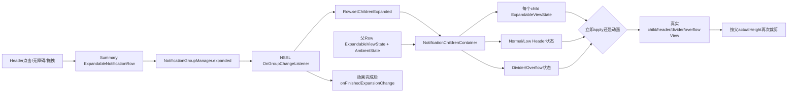
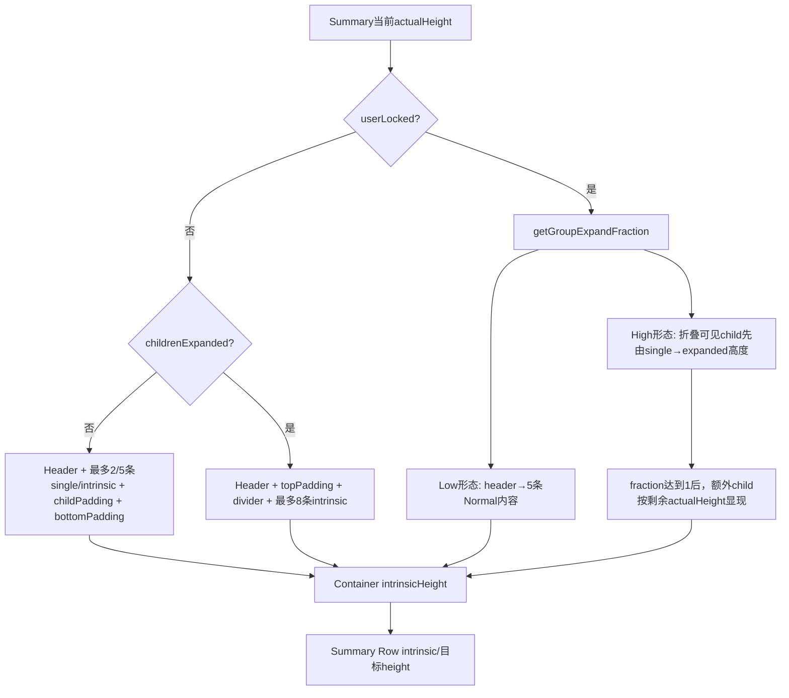
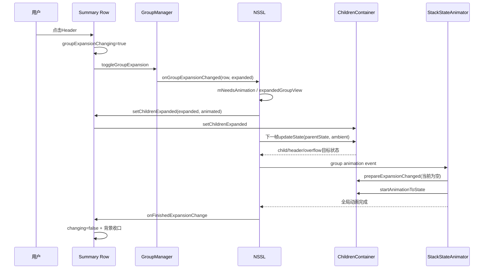

# 第 480 章 Android SystemUI NotificationChildrenContainer 与 ExpandableNotificationRow：分组通知摘要、子项高度、展开、裁剪和动画链

> 源码基线：Android 11 / API 30 / `android-11.0.0_r48`。本章只在 macOS 阅读，不实际编译。核心文件：`NotificationChildrenContainer.java`、`ExpandableNotificationRow.java`；交叉阅读 `NotificationGroupManager.java`、`NotificationStackScrollLayout.java`、`StackScrollAlgorithm.java`、`ExpandableViewState.java`、`NotificationContentView.java`、`HybridGroupManager.java`、`NotificationHeaderUtil.java`、`VisualStabilityManager.java` 及本地测试。

## 1. 本章要解决什么问题

为什么折叠通知组只显示两条，某些状态却显示五条，真正展开能到八条？摘要高度、子项高度、overflow 数字、Header 切换、分隔线、背景、裁剪和点击是谁控制的？用户拖动展开时多出来的子项何时出现？本章把“逻辑组展开”到每个子 Row 像素的链路拆开。

## 2. 一句话主线

`NotificationGroupManager` 保存逻辑 expanded；NSSL 把变化投影为摘要 Row 的 childrenExpanded 和动画事件；`NotificationChildrenContainer` 根据状态/高度计算每个 attached child 的目标 ViewState，再立即 apply 或 animate，并单独处理 Header、divider、overflow 和父边界裁剪。

## 3. 先分清摘要与子项

摘要本身仍是一张 `ExpandableNotificationRow`，也是 NSSL 的直接 child；组内子通知 Row 被从主栈移入摘要的 `NotificationChildrenContainer`。算法主列表只算摘要，再由摘要在最后阶段递归生成子状态。

## 4. Container不是RecyclerView

它是自定义 ViewGroup，维护 `mAttachedChildren` 和同索引 `mDividers` 两张列表；最多测量/布局前八个 attached child，没有复用 ViewHolder。排序、可见性和动画都由外部通知管线与 ViewState 手工协调。

## 5. 六种“展开”不能混写

逻辑 group expanded、摘要 Row 普通 expanded、childrenExpanded、groupExpansionChanging、userLocked、child 自身 expanded 是不同字段。它们有时同步、有时只用于过渡；看到 `expanded` 必须先确认对象和语义。

## 6. 两类展开交互

点击普通摘要 Header 可直接 toggle group；低优先级摘要第一次点击常先把低优先级折叠样式展开成普通摘要，满足条件后再次操作才进入 group toggle。手势拖高则先 userLocked，以连续 actualHeight 驱动 fraction，松手后再提交最终状态。

## 7. 三个显示上限

`NUMBER_OF_CHILDREN_WHEN_COLLAPSED=2`，`WHEN_SYSTEM_EXPANDED=5`，`WHEN_CHILDREN_EXPANDED=8`。它们既影响高度和 alpha，也影响 overflow 数字；“组最多两条”只适用于最普通折叠状态。

## 8. 目标状态与真实裁剪仍然分层

Container 的 `updateState()` 生成 child Y/height/alpha/Z；`applyState()/startAnimationToState()`提交；最后 `updateChildrenClipping()`按摘要真实 actualHeight 与 clipBottom 再设 child visibility/底部裁剪。目标可见不等于真实边界内可见。

## 9. 本章的四个完成点

Manager expanded 已改只是逻辑完成；摘要收到 `setChildrenExpanded()`是投影完成；child ViewState 已生成是目标完成；Animator、裁剪和背景结束才是视觉完成。`onFinishedExpansionChange()`清 changing 又是最后一个状态收口点。

## 10. 总体协作图



## 11. Container何时创建

摘要 Row 初始可通过 ViewStub 延迟 inflate；`setUntruncatedChildCount()` 或 `addChildNotification()`发现 null 就 inflate。真正有第一个 attached child 后，Row 才把 `mIsSummaryWithChildren=true` 并创建组 Header。

## 12. summary身份是视图事实

`mIsSummaryWithChildren` 要求 Container 存在且 attached child count>0；它不只是 Notification flag。最后一个 child 移走后，Row 会恢复普通 private layout 可见性，即使通知元数据仍带 group summary 标志。

## 13. child加入的顺序

Container 先把 Row 插入逻辑列表、addView、继承 userLocked，再创建 divider；随后清 content transformation、取消旧 ViewState 动画和 appear drawing。外层 Row 最后设置 child-in-group 与 parent，并刷新 Header、背景、圆角和内容可见性。

## 14. 新child继承userLocked的一处不一致

`addNotification()`直接 `row.setUserLocked(mUserLocked)`；而正常 `setUserLocked()`遍历时使用 `userLocked && !showingAsLowPriority()`。若低优先级 Header 正显示且组恰在 userLocked 中加入新 child，新 Row 会暂时得到 true，直到后续重新调用 setUserLocked 才与旧 child一致。

## 15. child移除做哪些清理

从列表/ViewGroup移除 Row 和 divider；divider 放 overlay 交叉淡出；child 的 systemChildExpanded 与 userLocked 清 false；若 Row 不是被删除实体，则恢复被组 Header 合并隐藏的通知 Header 元素。

## 16. remove的调用合同

方法假定 Row 一定在 `mAttachedChildren`；否则 index=-1 后 `mDividers.remove(-1)`会异常。正常 Group 管线先维护归属再调用，Container 本身没有防御重复移除。

## 17. ViewGroup顺序与逻辑顺序

实际 children 还混有 Header、divider、overflow，不能用 `getChildAt(i)`代表第 i 个通知；布局、状态和命中都以 `mAttachedChildren` 为准。`applyChildOrder()`也主要重排逻辑列表，而不是把所有 ViewGroup child重新排序。

## 18. VisualStability怎样限制重排

发现 desired child不在当前位置时，只有 `canReorderNotification()`允许才移动；否则注册一次 reordering-allowed callback。方法继续检查后续位置，因此一次调用可能部分重排，而不是全有或全无事务。

## 19. 重排后为何更新system child expanded

折叠且非 userLocked 时，如果组只剩一个 child，就把它 `setSystemChildExpanded(true)`；多 child则全部 false。展开/userLocked期间不改，避免排序中途重写用户正在看的 child 高度形态。

## 20. untruncated count是什么

它是逻辑组真实 child 数，可能大于当前创建 View 的 attached 数。管线可以只附加最多需要显示的 child，但 overflow 应显示“还有多少条”，所以不能用 `mAttachedChildren.size()`代替。

## 21. overflow数字怎样算

`untruncatedCount-maxAllowedVisibleChildren(likeCollapsed=true)`大于0就由 HybridGroupManager绑定“+N”；不再溢出时从 ViewGroup移除，若已显示且 attached，则作为 transient View fade out。

## 22. likeCollapsed不总是2

它只禁止“childrenExpanded/userLocked→8”这条分支；低优先级、摘要 Row 在非锁屏自己 expanded、或可显示 HUN 时仍返回5。命名表示“不要按完整组展开”，不是强制常量2。

## 23. 可见上限源码

```java
int getMaxAllowedVisibleChildren(boolean likeCollapsed) {
    if (!likeCollapsed && (mChildrenExpanded || mContainingNotification.isUserLocked())
            && !showingAsLowPriority()) {
        return NUMBER_OF_CHILDREN_WHEN_CHILDREN_EXPANDED;
    }
    if (mIsLowPriority
            || (!mContainingNotification.isOnKeyguard()
                    && mContainingNotification.isExpanded())
            || (mContainingNotification.isHeadsUpState()
                    && mContainingNotification.canShowHeadsUp())) {
        return NUMBER_OF_CHILDREN_WHEN_SYSTEM_EXPANDED;
    }
    return NUMBER_OF_CHILDREN_WHEN_COLLAPSED;
}
```

顺序很关键：仍显示 low-priority 形态时，即使 childrenExpanded/userLocked也不会走8，而是落到5。

## 24. 锁屏为何抑制摘要普通expanded的5条

第二分支要求 `!onKeyguard && containing.isExpanded()`；Row 的 `isExpanded()`本身默认也不允许 Keyguard。锁屏普通摘要因此常回到2，除非 low-priority 或 HUN条件单独把上限提高到5。

## 25. HUN为何允许5条

摘要 HeadsUp 时容器 intrinsic height可能成为 pinned HUN高度，五条 system-expanded单行提供更多组信息；但必须 `canShowHeadsUp()`，普通锁屏非Doze且无Bypass时该门可能 false。

## 26. onMeasure为什么只处理八个

childCount取 `min(attachedSize,8)`；所有这八个即使 GONE也先 measure/layout，以保留高度信息，但测量总高度只累加非 GONE child。第九个以后不参与本 Container 的测量与布局。

## 27. measuredHeight与mRealHeight

`mRealHeight`保存前八项未受父 AT_MOST/EXACTLY截断的总高；真正 measured height可被 size clamp。`pointInView()`却使用 mRealHeight，让触摸范围按内容真实高度判断，而不是简单按 measured height。

## 28. overflow怎样占用单行宽度

若 attached child数超过 collapsed-like上限，overflow index是最后一个可见 child；测量前把 overflow TextView宽度写为该 child single-line indentation，防止标题/文本与右侧“+N”重叠。

## 29. Header高度由两段组成

`mHeaderHeight=headerMargin+notificationTopPadding`，Normal/Low Header都以这个 EXACT高度测量。Header自身 translation另由 `mCurrentHeaderTranslation`加入 Container高度和 child Y。

## 30. Header不是摘要原NotificationContentView

Container用 summary Notification.Builder重新生成独立 NotificationHeaderView，包装成 NotificationViewWrapper；同时 `NotificationHeaderUtil`把多个 child重复的 app名、图标、时间等做合并/恢复。摘要 private layout在 summary模式会 INVISIBLE。

## 31. normal Header怎样创建

用 `makeNotificationHeader()` apply/reapply，强制 expand button visible并绑定 summary expand click；conversation summary可对 wrapper应用 conversation skin。每次 content更新后再重建/刷新 low-priority Header和 child Header合并外观。

## 32. low-priority Header何时存在

`mIsLowPriority=true`时用 `makeLowPriorityContentView(true)`创建；变回 false立即 remove并清 wrapper。`showingAsLowPriority()`还要求 containing Row `!isExpanded()`，所以对象存在不等于当前可见。

## 33. low-priority conversation skin的复制错误

创建 low Header后，r48 检查并操作的是 `mNotificationHeaderWrapper`，不是 `mNotificationHeaderWrapperLowPriority`；因此代码再次给 normal Header应用/清除 conversation skin，Low wrapper只收到 `onContentUpdated()`。这是明确的对象引用不一致，实际皮肤差异仍需界面验证。

## 34. desired Header怎样选择

只在 Low形态真正显示时选 low Header，否则选 normal Header。Header切换可以直接 setVisible，也可让两个 wrapper `transformFrom/transformTo`并在完成回调中再次无动画校正。

## 35. Header快速反向切换的保障

transform完成 Runnable不是捕获旧 desired后强设，而是重新调用 `updateHeaderVisibility(false)`计算当前 desired，能收口一部分竞态；但 wrapper内部动画仍可能被快速状态变化中断，类里没有显式 generation id。

## 36. Low Header向Normal拖拽变形

仅当 userLocked 且仍 showingAsLowPriority，`updateHeaderTransformation()`用 group fraction让 normal wrapper从Low变入、Low wrapper向Normal变出，并确保 normal Header VISIBLE。这是低优先级第一次展开的连续视觉。

## 37. child alpha辅助Header切换

Header切换动画最多处理前5个 child，每个 delay=i×50ms；向Normal时从0到1，向Low时从1到0。常量名 `ALPHA_FADE_IN`即使 target=0也被复用，实际可做fade out。

## 38. 静态AnimationProperties为何当前可用

共享对象的 delay在循环中反复修改，但 `animateTo()`同步把当前 delay写入每个 Animator，后一个赋值不会回改已创建 Animator；主线程串行是前提。下一次调用 i=0又会把 delay重置为0。

## 39. childrenExpanded怎样传播

NSSL收到 Manager group expansion listener，决定是否生成动画，调用 summary `setChildrenExpanded(expanded, animated)`；Row保存布尔、Container保存布尔并递归写给每个 child，还更新摘要/child背景、Header触摸和点击焦点。

## 40. animate参数其实未被Row消费

`ExpandableNotificationRow.setChildrenExpanded(boolean, boolean)`中的 `animate`参数没有在方法体读取；动画由 NSSL同时设置 `mExpandedGroupView/mNeedsAnimation`并生成 group event实现。不能从该参数名字推断 Row内部直接开 Animator。

## 41. 点击展开源码链

```java
if (!shouldShowPublic() && (!mIsLowPriority || isExpanded())
        && mGroupManager.isSummaryOfGroup(mEntry.getSbn())) {
    mGroupExpansionChanging = true;
    final boolean wasExpanded = mGroupManager.isGroupExpanded(mEntry.getSbn());
    boolean nowExpanded = mGroupManager.toggleGroupExpansion(mEntry.getSbn());
    mOnExpandClickListener.onExpandClicked(mEntry, nowExpanded);
    onExpansionChanged(true /* userAction */, wasExpanded);
}
```

Manager修改逻辑组并同步通知监听者；Row自己又更新日志、Shelf icon颜色和Header变形，二者职责不同。

## 42. 低优先级第一次点击为何不进这里

当 `mIsLowPriority=true && !isExpanded()`，group toggle条件失败，若允许普通展开则走后面的 `setUserExpanded(true)`。此后 `showingAsLowPriority=false`，Normal Header/children出现，才具备直接组展开的视觉条件。

## 43. childrenExpanded与Manager expanded如何同步

Manager只保存 group.expanded并回调；NSSL监听才把布尔写到 Row/Container。若某个调用只改 Row字段而绕过 Manager，`isGroupExpanded()`仍可能返回旧值；正常生产入口不应绕过监听链。

## 44. groupExpansionChanging何时清

点击开始先设 true；NSSL把 `onFinishedExpansionChange()`放入动画结束队列，最终清 false并重算背景。高度 Animator正常结束也可能清 `setGroupExpansionChanging(false)`，但取消时上一章确认不清，外层完成队列是重要兜底。

## 45. prepareExpansionChanged在r48是空实现

StackStateAnimator生成 GROUP_EXPANSION_CHANGED事件时会调用 Row→Container `prepareExpansionChanged()`；方法只有TODO和return，并没有预摆 invisible child。不能把方法名写成已完成的起始布局准备。

## 46. 摘要intrinsicHeight优先级

Row userLocked先返回自身 actualHeight；Guts exposed返回Guts；未展开组child返回private min；敏感隐藏返回min；summary返回Container intrinsic；之后才是HUN、普通expanded/collapsed。分组高度并非总覆盖其他临时状态。

## 47. Container intrinsicHeight的折叠结构

从 Header margin+translation开始；第一项折叠时不加top padding，后续加 childPadding；加每个可见 child intrinsicHeight；未展开结尾加 collapsedBottomPadding。

## 48. 真正组展开的高度结构

第一项前加 notificationTopPadding+dividerHeight，后续每项前加 dividerHeight，结尾不加 collapsedBottomPadding；最多累计8个 child。展开/折叠不仅 child数不同，间距模型也不同。

## 49. userLocked时怎样插值高度

第一项前从0插到topPadding+divider；后续间距从 childPadding插到divider；底部padding从collapsedBottom插到0。child intrinsic height本身由 Row实际状态决定，Container总高与 child actualHeight还有第二条插值链。

## 50. 高度模型图



## 51. getMinHeight使用single-line

折叠最小高度不是 child intrinsicHeight，而是每个 child 的 `HybridNotificationView.getHeight()`，中间用 childPadding，最后加 bottom padding。Low形态且不要求likeHighPriority时直接返回 Low Header当前 height。

## 52. Low Header early lifecycle风险

`getMinHeight()`读取 `mNotificationHeaderLowPriority.getHeight()`而非固定 mHeaderHeight；Header已创建但尚未layout时可能为0。正常初始化/测量顺序会很快填入高度，本地测试没有覆盖早期同步查询。

## 53. getMaxContentHeight做什么

Normal形态累加 Header、top padding、最多8个 child；每个 child若自身expanded取 maxExpandHeight，否则取 likeGroupExpanded minHeight，并加每项divider。Low形态则按“像High Priority”计算最多5条的 min height，作为Low→Normal拖拽终点。

## 54. group fraction的两个终点

Low形态用 `getMaxContentHeight()`；High形态用 `getVisibleChildrenExpandHeight()`，后者只计算 collapsed-like允许的2或5条从single-line展开到组内完整高度。因此 fraction=1不代表全部8条都已占满父高度。

## 55. 为什么额外child晚出现

High userLocked时，前 collapsed上限的 child始终参与；超出部分只有 `expandFactor==1.0f`才按 `(actualHeight-childY)/childHeight`算 alpha。先把原来能看到的 child展开完整，再随着父继续长高逐项露出更多 child。

## 56. denominator没有防零

fraction公式直接除 `visibleExpandedHeight-minExpandHeight`再 clamp，未显式处理分母0。正常有child且资源/行高使展开终点更大；异常零高度或特殊布局若让两者相等，会出现NaN/Infinity风险，本地测试未覆盖。

## 57. setActualHeight只在userLocked生效

Container非userLocked时立即return；正常状态切换依赖 ViewState height Animator。拖拽时保存父 actualHeight、求fraction，并调整 child actualHeight和Header transform。

## 58. Low拖拽时child高度不扩

showingLowPriority分支的目标 childHeight取普通非组展开 minHeight，通常与singleLineHeight一致；主要变化是 Header transform、前5个 child alpha和父高度，而不是把每张 child内容展开到大卡片。

## 59. High拖拽时哪些child改actualHeight

仅索引小于 collapsed-like上限的 child从single-line插到 expanded/min group height；其余 child直接设最终 childHeight，先在不可见区域准备好，后续由 alpha和父裁剪揭示。

## 60. Row userLocked与Container userLocked可能分叉

Row `isUserLocked()`还受 `mForceUnlocked`否决，Container只保存传入原始布尔。force-unlock改变时没有同步清 Container字段；特殊展开动画中可能出现 Row高度选择已解锁而 Container仍按fraction算子状态，这是源码边界，发生条件需结合调用链验证。

## 61. updateState在总算法的最后阶段

上一章 `StackScrollAlgorithm.resetViewStates()`先完成摘要目标，再调用 `getNotificationChildrenStates()`；Row把自己的最终 state和 AmbientState交给 Container。子项因此继承父 location/inShelf/dim/sensitive/speed-bump和可选Z。

## 62. child Y从哪里开始

初值是 Header margin+currentHeaderTranslation；第一项依据展开/fraction加top padding+divider，后续加divider或childPadding；写 childState.yTranslation 后再累加 intrinsicHeight。

## 63. child height为何每轮回到intrinsic

`childState.height=child.getIntrinsicHeight()`，避免上轮被裁/动画缩短的目标残留。父真实边界裁剪不在这里改 state height，而在提交后用 child clipBottom/visibility处理。

## 64. expandedGroup裁child高度的旧方法未使用

类里保留 `updateChildStateForExpandedGroup()`，能把越过parentHeight的 childState.height截短并隐藏后续，但全文件没有调用。r48实际使用 `updateChildrenClipping()`裁真实 View，不应按这个私有方法注释解释当前主链。

## 65. child hidden为何先设false

所有 attached child目标 hidden=false，再以alpha决定折叠上限外的可见性；ViewState提交时 alpha=0会令真实 View INVISIBLE。这样需要淡入的 child仍保有完整目标位置，而不是先从GONE重新布局。

## 66. parent属性怎样继承

dimmed、hideSensitive、belowSpeedBump、location、inShelf直接复制；clipTop归0。子项不复制父alpha，而自己算；Z只在组已展开且不在 expansionChanging、资源允许 child shadow时复制父Z，否则0。

## 67. 为什么展开动画中child Z为0

只有稳定 expanded group才让 child各自投影阴影；过渡中父摘要背景/阴影仍承担整体视觉，避免父子shadow叠加。动画结束清 changing 后下一轮才切给child。

## 68. launchTransitionCompensation是什么

某个 child正运行 expand launch animation后，后续 child Y额外减 `ambient.expandAnimationTopChange`。补偿从该 child之后生效，不回改它自己或之前child，保持下面兄弟相对窗口扩展变化稳定。

## 69. child状态生成源码

```java
ExpandableViewState childState = child.getViewState();
int intrinsicHeight = child.getIntrinsicHeight();
childState.height = intrinsicHeight;
childState.yTranslation = yPosition + launchTransitionCompensation;
childState.hidden = false;
childState.zTranslation =
        (childrenExpandedAndNotAnimating && mEnableShadowOnChildNotifications)
        ? parentState.zTranslation
        : 0;
childState.dimmed = parentState.dimmed;
childState.hideSensitive = parentState.hideSensitive;
childState.belowSpeedBump = parentState.belowSpeedBump;
childState.clipTopAmount = 0;
childState.alpha = 0;
if (i < firstOverflowIndex) {
    childState.alpha = showingAsLowPriority() ? expandFactor : 1.0f;
} else if (expandFactor == 1.0f && i <= lastVisibleIndex) {
    childState.alpha = (mActualHeight - childState.yTranslation) / childState.height;
    childState.alpha = Math.max(0.0f, Math.min(1.0f, childState.alpha));
}
childState.location = parentState.location;
childState.inShelf = parentState.inShelf;
```

这段是 r48 循环内连续原始片段，清楚展示额外child只在fraction精确到1后按剩余高度显现。

## 70. GONE child的计数语义并不统一

测量总高只累加非GONE child，但可见上限、updateState、intrinsic/max height循环大多按列表索引计数且不跳GONE。正常组管线倾向移除而非长期GONE；若存在GONE attached Row，它可能占名额或影响高度，测试没有覆盖。

## 71. overflow ViewState从谁复制

取 collapsed-like最后一个可见 child的 ViewState复制通用X/Y/Z/alpha；折叠时再对齐该 child single-line的text，text GONE则title，再不行用整个Hybrid view。展开时向下加Header margin并alpha=0。

## 72. first overflow child索引安全条件

Overflow存在意味着 untruncated count大于上限，但 attached count理论上也应至少包含一个可对齐child；代码用 `min(maxAllowed, childCount)-1`，若 attached count为0会得到-1并崩溃。生产管线需保证有可见attached child，本类无防御。

## 73. mNeverAppliedGroupState的首帧策略

新建 overflow state时标true；动画提交若从未apply过，先临时把目标alpha改0直接apply，恢复目标alpha后再animate。这样“+N”从透明目标位置出现，不从XML默认原点飞入。

## 74. Header ViewState只算Normal Header

若 normal Header存在，state从真实 View init，Z在稳定展开组继承父Z，Y取current translation，alpha取headerVisibleAmount，hidden强制false。Low Header主要由wrapper transform与visibility管理，不单独建立第二个Header ViewState。

## 75. headerVisibleAmount来自HeadsUp外观

HeadsUpAppearanceController写摘要 Row，Row同步给各ContentView和ChildrenContainer；Container把 `(1-amount)*translationForHeader`变成Header Y，并把amount作为Normal Header alpha。抽取到状态栏的Header消失时，子列表起点也随之补偿。

## 76. hidden=false为何配alpha0

Header state注释明确：若设hidden，下一帧 `initFrom()`会捡到INVISIBLE，可能让Header持续不可见；保持hidden=false，仅由alpha控制，便能在后续amount回升时重新显示。

## 77. applyState的遍历顺序

从第一个child到最后一个，先 `viewState.applyToView(child)`，再构造divider临时state；所有child fake shadow强度清0，因为稳定expanded的真实elevation已由 child zTranslation和父背景策略表达。

## 78. divider何时可见

userLocked且非Low，或childrenExpanded且资源允许，或group changing且资源不要求隐藏；alpha在稳定expanded用资源dividerAlpha，userLocked时从0插到0.5。visible条件与alpha条件是两层。

## 79. apply与animate的divider alpha不完全相同

apply稳定expanded使用 `mDividerAlpha`；animate稳定expanded把目标写死0.5。若资源 dividerAlpha不是0.5，直接提交与动画终点可能不一致；需查看具体资源overlay或运行结果，源码差异本身确定。

## 80. 动画为何从后往前遍历child

`startAnimationToState()`从最后一项到第一项，便于重叠/延迟时后方child先建立Animator；applyState则正序。属性目标相同，但 Animator创建与全局finish listener注册顺序可能不同。

## 81. Header在动画方法里仍直接apply

方法末尾对 `mHeaderViewState.applyToView(mNotificationHeader)`，不是animateTo；Header wrapper另有transform动画，普通 ViewState的Y/alpha会直接跟到目标。不能说所有子树属性都由同一AnimationProperties动画。

## 82. Group event的准备方法没有补位

由于 `prepareExpansionChanged()`空实现，新显现child的起始位置主要靠上一帧保存的真实属性、alpha0 state、Animator retarget和overflow首帧策略；不存在一段统一“把所有不可见child先摆好”的代码。

## 83. 裁剪使用哪个边界

`layoutEnd=summary.actualHeight-container.clipBottomAmount`；逐child比较真实 translationY+actualHeight。完全在边界下设INVISIBLE，部分越界写child.clipBottomAmount，完全在内清0。

## 84. 裁剪源码

```java
private void updateChildrenClipping() {
    if (mContainingNotification.hasExpandingChild()) {
        return;
    }
    int childCount = mAttachedChildren.size();
    int layoutEnd = mContainingNotification.getActualHeight() - mClipBottomAmount;
    for (int i = 0; i < childCount; i++) {
        ExpandableNotificationRow child = mAttachedChildren.get(i);
        if (child.getVisibility() == GONE) {
            continue;
        }
        float childTop = child.getTranslationY();
        float childBottom = childTop + child.getActualHeight();
        boolean visible = true;
        int clipBottomAmount = 0;
        if (childTop > layoutEnd) {
            visible = false;
        } else if (childBottom > layoutEnd) {
            clipBottomAmount = (int) (childBottom - layoutEnd);
        }

        boolean isVisible = child.getVisibility() == VISIBLE;
        if (visible != isVisible) {
            child.setVisibility(visible ? VISIBLE : INVISIBLE);
        }

        child.setClipBottomAmount(clipBottomAmount);
    }
}
```

这是 r48 `updateChildrenClipping()` 的连续原文；`visible` 是根据几何计算的目标值，`isVisible` 是当前 View 状态，两者不同时才切换 `VISIBLE/INVISIBLE`。

## 85. childTop等于layoutEnd的端点

条件使用 `>`而不是`>=`：顶边恰好等于父底边时仍标visible，但clipBottom会等于整个child高度，形成“VISIBLE但完全裁掉”的状态，利于动画连续性而非立刻切INVISIBLE。

## 86. hasExpandingChild为何整段跳过

Launch/expand animation的child可能绘出父边界并由专用 clipping参数处理；Container此时不只跳过该child，而是跳过所有child裁剪更新。异常未收口时会保留旧visibility/clip，需要后续状态帧纠正。

## 87. Row自身还会把Shelf clip传进来

上一章 Shelf给摘要 Row写 clipBottom；Row重写 `setClipBottomAmount()` 后同步 `mChildrenContainer.setClipBottomAmount()`。于是组child最终边界同时受摘要 actualHeight和摘要被Shelf裁掉的底部量约束。

## 88. expand animation又可能拒绝摘要clip

Row `mExpandAnimationRunning`时会直接拒绝普通 setClipBottomAmount；childIsExpanding时Container裁剪更新也受保护。组/Launch/Shelf三套裁剪通过这些门避免相互截断。

## 89. child点击命中怎样选择

只有 `mChildrenExpanded=true`时摘要 `getViewAtPosition()`才查Container，否则总返回摘要。Container按child真实Y、clipTop和actualHeight命中，但没有显式跳过GONE/INVISIBLE。

## 90. getViewAtPosition注释与实现的差异

注释称“accounting for GONE views”，实现却遍历全部attached child且不检查visibility；若GONE child仍有旧translation/height，可能被返回。正常管线是否保留这种child需运行时验证，静态不应写成必现误点。

## 91. 折叠组child为何拒绝ACTION_DOWN

Row若是group child且逻辑组未expanded，ACTION_DOWN直接false；即使其View因动画/alpha仍暂时存在，也不会作为独立通知响应。展开后才走普通Row触摸。

## 92. 展开状态时序图



## 93. 摘要与child背景怎样交接

稳定展开且配置不保留摘要背景时，摘要 `mShowNoBackground=true`，Header可加计算后的背景，child各自显示背景；展开/折叠中或userLocked时摘要背景继续存在，避免背景瞬间消失。

## 94. child自定义背景的例外

group child在稳定展开时显示背景；过渡中只有自身 content wrapper提供非0背景色才显示，否则 `mShowNoBackground=true`。这样普通透明child不与父背景叠出双层色块。

## 95. bottom roundness给谁

从attached列表末尾向前找非GONE child，只有最后一个获得摘要当前bottom roundness，其余0。组底部圆角跟随真正最后可用child，不跟 overflow数字或divider。

## 96. increased padding怎样回到主栈

摘要稳定group expanded返回1；userLocked返回Container fraction；折叠返回0。上一章StackScrollAlgorithm用这个值在摘要与邻项之间插值padding，使组展开不仅内部长高，外部间距也同步增大。

## 97. Header touchability

Normal Header只有childrenExpanded或userLocked时 `setAcceptAllTouches(true)`；折叠时仍有expand button/click listener，但HeaderView可用更窄的触摸策略，避免整个Header抢夺普通通知点击。

## 98. Accessibility走同一个expand click

ACTION_EXPAND/COLLAPSE直接调用 `mExpandClickListener.onClick(this)`，不根据action强制目标状态；它本质是toggle。若无障碍服务重复发送“EXPAND”给已展开组，仍可能折叠，这是接口语义边界。

## 99. 测试覆盖了什么

`NotificationChildrenContainerTest`共有13项：9项左右集中于2/5/8上限和Low显示判定，另有Low Header移除与Header重建。它们证明分支表，却没有验证child Y/alpha、fraction、高度、divider、overflow、裁剪或动画。

## 100. Row支持测试不能替代Container测试

`ExpandableNotificationRowTest`有26项，但本版本主要覆盖Row自身行为；不能据此宣称组child状态闭环被覆盖。尤其本章发现的Low wrapper引用、空prepare、dead clipping方法和命中visibility均无直接断言。

## 101. 复读发现一：Low conversation wrapper对象错误

这是逐行可证的copy/paste问题：low Header创建后，conversation skin分支仍取normal `mNotificationHeaderWrapper`。不能擅自改源码，但学习时应准确记录为“操作对象不匹配”，并与视觉是否明显分开。

## 102. 复读发现二：两个看似关键的方法不工作

`prepareExpansionChanged()`明确no-op；`updateChildStateForExpandedGroup()`全文件零调用。若只按方法名阅读，会虚构出“动画前预摆”和“按父高度改child state height”两条不存在的主链。

## 103. 复读发现三：动画参数和Header提交不对称

Row `setChildrenExpanded`忽略animate参数；Container动画方法又直接apply Normal Header state。实际动画由NSSL事件、child ViewState、wrapper transform和divider properties拼成，不是一个boolean贯穿到底。

## 104. 复读发现四：额外child不是随fraction连续淡入

High组中，collapsed上限外 child在fraction<1时alpha固定0；fraction饱和后才按父剩余高度逐条显现。把所有8条都写成“随0→1同步淡入”是不准确的。

## 105. 复读发现五：GONE处理存在多套合同

测量累计、裁剪和roundness会跳GONE，state/高度/命中不少循环却不跳。更安全的理解是生产管线尽量从attached列表移除不可用child，而不是依赖Container对GONE统一过滤。

## 106. 一套高度异常诊断顺序

先打印summary `isExpanded/isGroupExpanded/childrenExpanded/userLocked/showingLow`；再算maxAllowed；确认actualHeight、collapsedHeight、visibleExpandHeight和fraction；然后逐child对比 intrinsic/actual/state.height/Y/alpha，最后看父clip与divider/Header。

## 107. 一套overflow异常诊断顺序

区分untruncated与attached count；计算likeCollapsed上限；确认overflow View是否刚创建、mNeverApplied状态、对齐child及single-line text/title可见性；最后看 transient fade，避免把“+N旧View淡出”当作重复overflow。

## 108. 一套Header异常诊断顺序

确认Low Header对象是否存在、showingAsLowPriority、current/desired Header；再看wrapper visible/transform、userLocked fraction、headerVisibleAmount/translation；conversation场景还要检查实际被skin的是Normal还是Low wrapper。

## 109. 一套动画异常诊断顺序

检查Manager回调是否触发、NSSL是否mNeedsAnimation、group event是否生成；接受prepare为空这一事实；再看child Animator tag、groupExpansionChanging、全局finished runnable和background收口，别把空prepare当断点漏走。

## 110. 本章不跨进程

所有组 View、Manager监听、状态生成和 Animator都在SystemUI主线程；Notification.Builder/RemoteViews在这里用于本进程重建Header View，不发生通知应用进程回调。原始通知早已通过系统通知链进入SystemUI。

## 111. 最小可记忆公式

“2/5/8决定名额；Low/Normal决定Header；actualHeight决定fraction；fraction先展开旧可见child，饱和后露出新child；父actualHeight减Shelf clip决定最终裁剪。”先记这五句，再读具体分支不易迷路。

## 112. macOS只读练习一：列出2/5/8矩阵

只读 `getMaxAllowedVisibleChildren()`，为 likeCollapsed、childrenExpanded、Row userLocked、Low、Keyguard、Row expanded、HUN/canShowHeadsUp列真值表；至少写出8个组合并手算返回值。

## 113. macOS只读练习二：手算拖拽高度

任选Header、padding、divider、两个single-line和expanded child高度，先算collapsedHeight与visibleChildrenExpandHeight，再给三个actualHeight算fraction；说明第三到第八个child何时alpha开始大于0。

## 114. macOS只读练习三：追一次点击展开

从 `mExpandClickListener`逐行追 `GroupManager.toggle→NSSL listener→setChildrenExpanded→updateState→StackStateAnimator→onFinishedExpansionChange`，给每一步标注改变的是逻辑、目标、真实View还是收口状态。

## 115. macOS只读练习四：审计GONE与裁剪

用 `rg`列出Container所有遍历mAttachedChildren的循环，标注哪些跳GONE、哪些按列表索引计数；再用一个中间child为GONE的假例推演measure、intrinsicHeight、state、hit-test和roundness可能怎样分叉。

## 116. 易错理解一：Manager expanded就是画面已展开

错误。它只提交逻辑事实；Row/Container、目标state、Animator、clip和background还有多个阶段。快速日志必须带时间与层级。

## 117. 易错理解二：折叠组永远只允许两条

错误。Low、非锁屏摘要自身expanded和可显示HUN可提高到5；真正childrenExpanded/userLocked且非Low可到8，likeCollapsed也不保证固定2。

## 118. 易错理解三：alpha0 child等于不参加布局

错误。它仍有目标Y/height、可能已measure/layout，并可在后续父高度增加时淡入；GONE、INVISIBLE、alpha0、未attached是四种不同状态。

## 119. 复读后的最终心智模型

把摘要看成主栈代理，Container看成最多八项的小型状态解析器：Header负责组身份，single-line负责折叠，ViewState负责目标，actualHeight/fraction负责手势连续量，overflow解释被截断数量，父裁剪负责最终窗口。

## 120. 本章结论与下一章

r48分组通知依靠2/5/8名额、Low/Normal双Header、两阶段拖拽显现、父状态继承与真实边界裁剪完成展开；复读还确认Low wrapper对象错误、空prepare、dead state裁剪方法、animate参数未用、Header直接apply及GONE/命中不统一等边界。下一章继续研究 `NotificationGroupManager` 的逻辑分组、抑制、孤立HeadsUp与摘要/child重组链。
