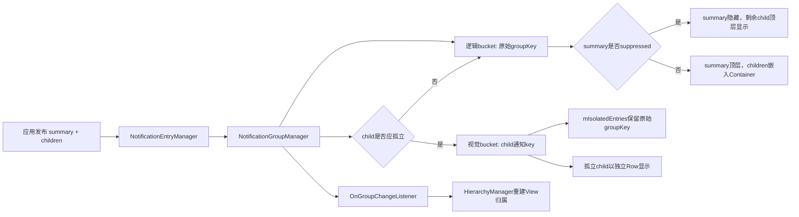
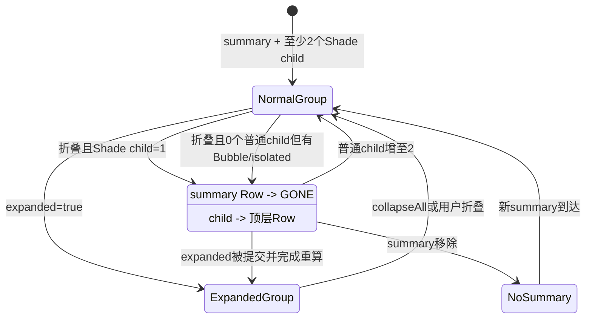
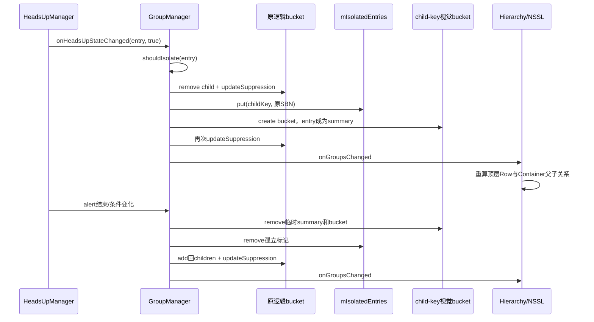

# 第 481 章 Android SystemUI NotificationGroupManager：逻辑分组、摘要抑制、Heads-up 孤立与视图重组链

> 源码基线：Android 11 / API 30 / android-11.0.0_r48。本章只在 macOS 阅读，不实际编译。核心文件：NotificationGroupManager.java；交叉阅读 NotificationViewHierarchyManager.java、NotificationGroupAlertTransferHelper.java、NotificationEntryManager.java、ExpandableNotificationRow.java、ConversationNotifications.kt、BubbleController.java 及本地测试。

## 1. 本章解决什么问题

为什么一个普通 group child 有时嵌在摘要下面，有时像独立通知一样出现在主栈？为什么只有一个 child 时摘要会隐藏？Heads-up child 被“孤立”后，它究竟离开了逻辑组，还是只改变视觉归属？本章把 group bucket、suppression、isolation 与真实 View 重组逐层拆开。

## 2. 一句话主线

NotificationGroupManager 把 NotificationEntry 投影成视觉 bucket；普通 child 放入原始 groupKey 的 children，被孤立的 child 改用自身 notification key 建一个临时 bucket并充当 summary；suppressed 决定原摘要是否隐藏，HierarchyManager再据此把 Row放进主栈或摘要Container。

## 3. Manager不直接搬View

它只维护 NotificationGroup、孤立表和同步监听回调，不执行 addView/removeView。真正把 child Row从主栈移到 NotificationChildrenContainer 的是后续 NotificationViewHierarchyManager.updateNotificationViews()。

## 4. NotificationGroup只是bucket

每个 bucket只有四类核心事实：children HashMap、summary、expanded、suppressed。它没有独立 group id对象，也没有排序列表、View或Animator。

## 5. bucket不一定是真正通知组

非分组普通通知的 isGroupChild=false，同样走“summary”分支并在 mGroupMap 占一个 bucket，只是 children为空。因此“mGroupMap大小”等于视觉上通知组数量是错误的。

## 6. 三种key必须分开

原始逻辑key是 sbn.getGroupKey()；Entry身份key是 sbn.getKey()；Manager的视觉key由 getGroupKey(sbn) 返回。未孤立时视觉key等于逻辑key，孤立时视觉key切为Entry key。

## 7. 逻辑组与视觉组

逻辑组回答“应用把它和谁一起发布”；视觉组回答“SystemUI当前把哪张Row当summary、哪几张当children”。孤立只改视觉模型，StatusBarNotification 内的原始 groupKey没有被重写。

## 8. suppressed不是过滤整个group

它表示摘要Row应隐藏。被抑制时，isChildInGroupWithSummary()也返回false，于是剩余child作为顶层Row展示；通知实体、逻辑summary和children仍在Manager中。

## 9. isolated也不是复制NotificationEntry

同一个Entry先从原逻辑bucket移除，再加入以自身key命名的视觉bucket并成为该bucket summary；mIsolatedEntries只额外保存 key→SBN，用来恢复逻辑关联和计数。

## 10. 双层模型总图



## 11. 生产主调用链

旧通知管线中，EntryManager把Entry加入active map后调用 onEntryAdded；更新时先替换Entry内SBN再传旧SBN给 onEntryUpdated；移除active entry后调用 onEntryRemoved。这些生产入口通常来自SystemUI主线程，但本类自身没有 Assert.isMainThread()。

## 12. 构造阶段只注册状态栏状态

构造器向 StatusBarStateController 注册回调并保存Lazy People识别器；HeadsUpManager和BubbleController不是构造参数。前者稍后显式set，后者第一次计算suppression时从Dependency懒取。

## 13. HeadsUp装配顺序

NotificationsControllerImpl 先让HeadsUpManager添加GroupManager listener，再调用 setHeadsUpManager，最后才 entryManager.attach(notificationListener)。因此正常旧管线在通知流入前已具备Heads-up查询能力。

## 14. 为什么仍要记录null HeadsUp边界

shouldIsolate()只有在 mHeadsUpManager != null 时才执行“当前不alerting则false”的门；若独立测试或异常装配漏set，普通折叠组child也可能在并未Heads-up时被孤立。生产顺序降低风险，但类本身没有强制合同。

## 15. add入口先判断isolation

onEntryAdded()先 updateIsolation(added)，再 onEntryAddedInternal(added)。这样一个尚未进任何bucket、但已经alerting的child可以从第一帧就作为独立视觉summary，而不是先短暂嵌组再移出。

## 16. 首次孤立为何会add两次internal

updateIsolation若决定孤立，isolateNotification()内部已经add到自身key bucket；返回外层后 onEntryAddedInternal()又执行一次。第二次不会创建新bucket，只会把同一Entry再次赋给summary并重算状态，属于可见的重复路径。

## 17. rowRemoved诊断字段

internal add发现 added.isRowRemoved() 时只写入一个debug Throwable，后续遇到同key不同Entry可把旧栈打印进wtf；它不会拒绝加入，也不会修复已经removed的Row。

## 18. 先有child没有summary

Manager会创建bucket，把Entry放入children；因为summary为null，child暂时不满足“有summary的组内child”，HierarchyManager会把它当顶层通知。稍后summary到达，才发生真正的视图归组。

## 19. 后到summary怎样接管

summary写入bucket后，expanded从 added.areChildrenExpanded() 恢复；随后复制children列表，对每个child调用 onEntryBecomingChild→updateIsolation，最后发 onGroupCreatedFromChildren 让NSSL请求一次通知视图更新。

## 20. 为什么先复制children

updateIsolation可能把alerting child从原bucket移出并新建视觉bucket；若直接遍历 group.children.values() 会并发修改。ArrayList快照保证这一轮每个原child都被检查。

## 21. Entry的初始expanded从哪里来

NotificationEntry.areChildrenExpanded() 在Row不存在时返回false，存在时读取Row的 mChildrenExpanded。所以summary加入bucket并不是从Notification元数据恢复展开，而是从当前视图事实恢复，未建Row时默认折叠。

## 22. internal add的真实源码

```java
private void onEntryAddedInternal(final NotificationEntry added) {
    if (added.isRowRemoved()) {
        added.setDebugThrowable(new Throwable());
    }
    final StatusBarNotification sbn = added.getSbn();
    boolean isGroupChild = isGroupChild(sbn);
    String groupKey = getGroupKey(sbn);
    NotificationGroup group = mGroupMap.get(groupKey);
    if (group == null) {
        group = new NotificationGroup();
        mGroupMap.put(groupKey, group);
        for (OnGroupChangeListener listener : mListeners) {
            listener.onGroupCreated(group, groupKey);
        }
    }
    if (isGroupChild) {
        NotificationEntry existing = group.children.get(added.getKey());
        if (existing != null && existing != added) {
            Throwable existingThrowable = existing.getDebugThrowable();
            Log.wtf(TAG, "Inconsistent entries found with the same key " + added.getKey()
                    + "existing removed: " + existing.isRowRemoved()
                    + (existingThrowable != null
                            ? Log.getStackTraceString(existingThrowable) + "\n": "")
                    + " added removed" + added.isRowRemoved()
                    , new Throwable());
        }
        group.children.put(added.getKey(), added);
        updateSuppression(group);
    } else {
        group.summary = added;
        group.expanded = added.areChildrenExpanded();
        updateSuppression(group);
        if (!group.children.isEmpty()) {
            ArrayList<NotificationEntry> childrenCopy
                    = new ArrayList<>(group.children.values());
            for (NotificationEntry child : childrenCopy) {
                onEntryBecomingChild(child);
            }
            for (OnGroupChangeListener listener : mListeners) {
                listener.onGroupCreatedFromChildren(group);
            }
        }
    }
}
```

源码说明了两个重要事实：所有非child都占summary槽；summary后到时会重新检查现有children的isolation。

## 23. 同key child冲突怎样处理

发现不同Entry使用同一key只 Log.wtf，随后仍由 put 让新Entry覆盖旧Entry。Manager偏向继续运行并留下诊断，而不是把不一致变成受检错误。

## 24. 两个summary冲突更危险

summary分支直接覆盖 group.summary，没有像child那样检查。源码注释承认同组两个summary不受支持；若旧summary随后取消，remove分支会把summary槽直接清null，即使槽里实际已经是较新的summary。

## 25. remove如何判断summary或child

它不是比较 removed == group.summary，而是用调用方提供的旧group属性和当前isolation状态判断角色：视觉child从children按key删除，其余一律清summary。

## 26. 什么时候删除整个bucket

先更新suppression；只有children空且summary也null才从 mGroupMap 删除并发 onGroupRemoved。summary-only、children-only以及真正group都会继续保留。

## 27. 为什么children-only bucket合法

应用通知可能乱序到达，summary可能稍后发布或已经取消。children-only时逻辑归组信息仍保留，但没有视觉summary可承载Container，所以children暂时作为顶层Row。

## 28. 更新不是原地改bucket

onEntryUpdated先根据旧groupKey/角色做一次internal remove，再用Entry里的新SBN做internal add。这能处理换组、child变summary和summary变child，但也会制造短暂的中间suppression状态。

## 29. mIsUpdatingUnchangedGroup的目的

如果groupKey未变且更新前后视觉child角色相同，就把标志置true，抑制remove/add中间态产生的suppression回调；例如两child组更新其中一项时，不应先通知“只剩一项被抑制”，紧接着又通知恢复。

## 30. 标志为什么不是事务

bucket字段仍会真实地remove、重算、add、再重算，只是不对外通知suppression变化。监听器看不到中间态，但本类没有回滚机制，也没有把整个更新包在不可分割的数据结构操作里。

## 31. 异常会让标志滞留

标志复位不在finally；若internal remove/add或同步listener抛出RuntimeException，mIsUpdatingUnchangedGroup可能保持true，之后suppression变化继续改字段却不发回调。生产回调通常可靠，但这是静态可证的恢复边界。

## 32. unchanged定义并不检查全部事实

它只比较raw groupKey与更新前后视觉child布尔；不会比较Bubble shade suppression、summary对象、people类型或Row状态。大多数附加变化由专门事件再触发，但不能把这个标志理解成“通知完全没变”。

## 33. isolated更新的特殊处理

Entry若已孤立，remove/add都针对自身key视觉bucket；完成后再更新 mIsolatedEntries 中保存的新SBN。若raw groupKey变化，还分别重算旧、新逻辑bucket的suppression。

## 34. isolated角色更新的窗口

由于 isGroupChild 对已孤立Entry恒返回false，child更新成summary或非group时，常规update路径不会主动调用 updateIsolation。后续Heads-up或conversation ranking事件通常可收口，但中间可能保留与新元数据不匹配的孤立状态。

## 35. suppression只看四类输入

它读取summary是否存在、group是否expanded、未从Shade抑制的真实children数量，以及是否存在Bubble或isolated child。它不读取通知优先级、排序位置、锁屏可见性或Row alpha。

## 36. visible childCount不是children.size

遍历 group.children 时，被BubbleController判定“从Shade抑制”的child不计数，只把 hasBubbles=true。因此一组可以逻辑上有多项，但用于摘要抑制的可见childCount为0或1。

## 37. suppression规则的直觉

折叠组只有一个Shade child时，隐藏summary，让child自己代表组；没有普通child、但有孤立child或Bubble时，也隐藏空壳summary；有两个以上普通child或组已展开时，保留summary。

## 38. metadata summary检查为何必要

被孤立child在自身视觉bucket里占summary槽，但其Notification元数据不是group summary。childCount为0时，额外的 notification.isGroupSummary() 阻止这个临时singleton bucket把自己标为suppressed。

## 39. expanded为何是suppression总门

表达式要求 !group.expanded。即使展开后只剩一个child，summary仍保留以承载展开状态与Container；只有折叠时才应用“摘要冗余则隐藏”的规则。

## 40. suppression字段与View还差一步

字段变化同步通知listeners；HierarchyManager下一轮 updateRowStates 才把suppressed summary设GONE，下一轮视图层级更新才让child顶层化。字段刚变时，旧父子关系可短暂存在。

## 41. suppression的真实源码

```java
private void updateSuppression(NotificationGroup group) {
    if (group == null) {
        return;
    }
    int childCount = 0;
    boolean hasBubbles = false;
    for (NotificationEntry entry : group.children.values()) {
        if (!getBubbleController().isBubbleNotificationSuppressedFromShade(entry)) {
            childCount++;
        } else {
            hasBubbles = true;
        }
    }

    boolean prevSuppressed = group.suppressed;
    group.suppressed = group.summary != null && !group.expanded
            && (childCount == 1
            || (childCount == 0
                    && group.summary.getSbn().getNotification().isGroupSummary()
                    && (hasIsolatedChildren(group) || hasBubbles)));
    if (prevSuppressed != group.suppressed) {
        for (OnGroupChangeListener listener : mListeners) {
            if (!mIsUpdatingUnchangedGroup) {
                listener.onGroupSuppressionChanged(group, group.suppressed);
                listener.onGroupsChanged();
            }
        }
    }
}
```

注意 mIsUpdatingUnchangedGroup 只屏蔽回调，不屏蔽字段赋值；也注意每个listener会连续收到两个不同粒度的通知。

## 42. suppression真值表

| summary | expanded | Shade childCount | isolated/Bubble | suppressed |
|---|---:|---:|---:|---:|
| 无 | 任意 | 任意 | 任意 | false |
| 有 | true | 任意 | 任意 | false |
| 有 | false | 1 | 任意 | true |
| 元数据summary | false | 0 | 有 | true |
| 元数据summary | false | 0 | 无 | false |
| 有 | false | 2以上 | 任意 | false |

## 43. 一个可见child加Bubble

childCount仍为1，hasBubbles=true，最终走第一条 childCount==1 而suppressed。逻辑children可能不止一个，但Shade里只有一张普通child，因此摘要仍被视为冗余。

## 44. expanded且全是Bubble

expanded总门使suppressed=false，即使Shade childCount=0且只有Bubble。静态结果可能是保留一个没有普通可见child的summary；源码明确如此，是否出现明显空组取决于Bubble与视图更新时序。

## 45. 移除孤立Entry的原组重算缺口

public onEntryRemoved先从“自身key视觉bucket”移除孤立Entry，随后只从 mIsolatedEntries 删除标记，没有再对原始逻辑groupKey调用 updateSuppression。因此原summary若仅因这个孤立child而suppressed，字段可能陈旧，直到别的事件触发重算。

## 46. 普通setGroupExpanded也不重算suppression

setGroupExpanded只写 expanded并通知展开监听器，没有调用 updateSuppression。常见多child组不受影响；但“展开时删到一个child，再通过普通入口折叠”的情况下，suppressed可能仍保持false，需后续children、Bubble或collapseAll事件才纠正。

## 47. collapseAll为何显式重算

它对每个bucket先在需要时 setGroupExpanded(false)，随后无条件 updateSuppression，正好弥补批量折叠的依赖变化。不能据此推断单个toggle也会重算，两条实现不同。

## 48. collapseAll先复制所有bucket

源码注释说明suppression变化可能经监听和Heads-up转移导致isolation，从而修改 mGroupMap；因此先 new ArrayList(mGroupMap.values())。快照中的某个bucket即使中途从map删除，循环仍可能继续对旧对象重算。

## 49. 两条自动折叠入口

StatusBarState进入KEYGUARD时Manager调用 collapseAllGroups；NSSL的Shade从expanded变为collapsed时也调用同一方法。所以“进入锁屏”和“收起通知面板”都可结束所有逻辑组展开。

## 50. setGroupExpanded没有去重

即使 expanded参数与旧值相同，也会再次写字段，并在summary非null时再次发 onGroupExpansionChanged。调用方不能假定收到回调就代表状态发生了边沿变化。

## 51. summary为空时展开是静默的

bucket的expanded仍可被set，但没有summary Row可传给listener，因此不发展开回调；以后summary加入时，internal add又用 summary Entry的 areChildrenExpanded 覆盖bucket.expanded，之前的静默值不保证保留。

## 52. suppression到视图的状态图



图中的“提交并完成重算”刻意分成两个条件，因为普通 setGroupExpanded 本身不调用 updateSuppression。

## 53. isChildInGroupWithSummary的条件

必须是视觉child、visual bucket存在、summary存在、group未suppressed且children非空。最后的empty检查专门覆盖最后child已从Manager删除、但旧Row尚未完全拆走的过渡窗口。

## 54. suppressed时child为何顶层化

该查询显式在 group.suppressed 时返回false。HierarchyManager据此不把Entry加入summary的orderedChildren，而把它放到 toShow主栈列表；所以suppression同时影响摘要GONE和child父级。

## 55. isSummaryOfGroup比metadata更严格

先要求视觉上是summary，再要求bucket和summary槽存在、children非空，并且槽内SBN与传入SBN相等。一个普通standalone Entry虽占summary槽，也不会被认作“有children的group summary”。

## 56. isolated child是视觉summary却不是group summary

isGroupSummary()对孤立Entry返回true；但其自身key bucket没有children，所以 isSummaryOfGroup()返回false。前者回答视觉角色，后者回答“是否承载一个非空通知组”。

## 57. getGroupSummary返回视觉summary

它先走可改写的视觉key。普通child返回原摘要；isolated child返回自己；standalone也返回自己。方法名若不带logical，默认回答当前视图组织，而非应用发布关系。

## 58. getLogicalGroupSummary绕过视觉key

它直接用 sbn.getGroupKey()查原bucket。对孤立child仍返回原summary；这正是Activity自动取消、Bubble处理和Hierarchy稳定旧父级时需要的逻辑事实。

## 59. only child按逻辑总数计算

getTotalNumberOfChildren把原bucket的真实children数与同raw groupKey的isolated数量相加。孤立过程已经把child从原children移出，所以相加不会正常重复计数。

## 60. Bubble仍算逻辑child

Bubble只在suppression的Shade childCount中被排除，并没有从 group.children 删除；因此 isOnlyChildInGroup 的总数仍包含Bubble。这里的“only”是逻辑组只有一个child，不是屏幕上只看到一个。

## 61. getLogicalChildren怎样拼回孤立项

先复制原bucket的 children.values，再遍历 mIsolatedEntries；raw groupKey匹配时，用孤立SBN自身key找到临时bucket并取其summary加入结果。返回的是同一批Entry引用的新ArrayList，不是深拷贝。

## 62. 视觉key改写的真实源码

```java
public String getGroupKey(StatusBarNotification sbn) {
    return getGroupKey(sbn.getKey(), sbn.getGroupKey());
}

private String getGroupKey(String key, String groupKey) {
    if (isIsolated(key)) {
        return key;
    }
    return groupKey;
}
```

只有这一处很短的映射，就让绝大多数普通查询自动切换到视觉bucket；logical方法必须有意识地直接使用原始groupKey。

## 63. getLogicalChildren的内部一致性合同

代码直接执行 mGroupMap.get(sbn.getKey()).summary，没有对临时bucket为null做保护。正常isolate/unisolate同步维护两张表；若重入、异常或移除缺口让 mIsolatedEntries 与 mGroupMap分叉，这里可能空指针。

## 64. children返回顺序不是排名顺序

group.children和mIsolatedEntries都是HashMap，values迭代顺序没有UI排序保证；getChildren/getLogicalChildren只是照此复制。最终Child Row顺序由通知排序和HierarchyManager另行建立，不能拿这里的List顺序解释屏幕位置。

## 65. HierarchyManager怎样决定父级

遍历可见Entry时先问 isChildInGroupWithSummary；true就把Entry放进以visual summary为key的临时child order表，false就把Row加入顶层toShow。随后才执行实际父子添加、移除和child顺序调整。

## 66. VisualStability可暂缓归组

用户正在看通知且group changes不允许时，新旧child身份可能暂时沿用Row已有状态；尤其从child变顶层且逻辑组仍expanded时，会继续使用旧parent并注册后续callback。Manager事实与View父级因此允许短暂不同步。

## 67. suppressed summary还有独立GONE门

updateRowStates再次调用 isSummaryOfSuppressedGroup；若为true且Row不是removed，就 setVisibility(GONE)。所以“child顶层化”和“summary隐藏”由两个查询共同实现，不是一个父级操作自动带出全部效果。

## 68. onGroupCreatedFromChildren的作用

当后到summary接住已有children时，NSSL listener调用 StatusBar.requestNotificationUpdate。它没有直接接收child列表，也不逐Row搬迁，而是要求完整层级更新重新计算。

## 69. listener回调是同步的

add/remove、suppression、expanded和isolation方法都在当前调用栈遍历ArraySet listener；没有Handler post、队列或异常隔离。一个listener可在Manager操作尚未返回时触发通知刷新或Heads-up转移。

## 70. listener只有add没有remove

本类暴露 addOnGroupChangeListener，却没有对应remove。它是Singleton，三个生产listener也基本与SystemUI同寿命；若短生命周期对象误注册，会形成持有和重复回调风险。

## 71. suppression变化发两类回调

每个listener先收到带group和新布尔的 onGroupSuppressionChanged，再收到无参数 onGroupsChanged。NSSL只实现后者请求刷新，AlertTransfer实现前者处理提醒，Bubble也消费前者；职责被刻意拆开。

## 72. suppression为何牵动提醒转移

被隐藏的summary不应继续Heads-up；GroupAlertTransferHelper看到suppressed summary正在alert时，把提醒转给代表child。unsuppress时又可能在300毫秒窗口内取消child提醒并转回summary。

## 73. “取第一个logical child”的顺序风险

AlertTransfer在处理suppressed summary时直接对 getLogicalChildren(...).iterator().next()；当逻辑列表因Bubble/isolated而超过一项，HashMap顺序不代表排序或可见优先级。源码可以证明选择非确定性，具体是否选错提醒对象需场景验证。

## 74. Bubble怎样反向触发suppression

BubbleController在选择状态变化后可调用 public updateSuppression(entry)，让Manager重新读取“是否从Shade抑制”；它还监听unsuppressed事件，清理自身记录的suppressed summary key。

## 75. isolation解决的视觉冲突

折叠组child若Heads-up却仍嵌在summary内，主栈没有独立Row承载顶部悬浮、触摸和生命周期。孤立把它临时提升成视觉summary，使HeadsUpManager能像处理顶层通知一样处理它。

## 76. 不是所有Heads-up child都必须孤立

普通child只有在组不存在、未展开、summary未完全可见或带fullScreenIntent时才孤立。组已经展开且summary完整可见时，alerting child可以继续留在Container，因为用户已能看到它的组上下文。

## 77. important conversation是早返回

PeopleNotificationIdentifier返回 TYPE_IMPORTANT_PERSON 时 shouldIsolate立即true，发生在HeadsUpManager alerting检查之前。也就是说重要会话child可长期独立展示，不要求当前正Heads-up。

## 78. important类型怎样变化

ConversationNotificationManager在ranking更新且布局的important标志发生变化时调用 updateIsolation。important→普通通常可重新评估；若ranking直接变成非conversation，该循环会跳过，是否及时解除需依赖其他更新或Heads-up事件。

## 79. fullScreenIntent是强制条件

通过基础group/summary与important检查、且未被“当前不alerting”挡住后，只要fullScreenIntent非null就返回true；即使逻辑组expanded且summary完全可见，alerting child仍被孤立。

## 80. group缺失或summary不可见

逻辑bucket尚未创建时返回true；bucket存在但summary为null、Row未建、clipTop>0或translationY<0也返回true。这样乱序到达或顶部被裁的组，不会把Heads-up child塞进用户看不全的位置。

## 81. “未完全可见”只检查顶部

ExpandableNotificationRow.isGroupNotFullyVisible() 只看 clipTopAmount>0 或 translationY<0；不检查底部是否进Shelf、alpha、GONE、屏幕下沿或实际可见比例。方法名很宽，r48实现实际只描述“顶部被裁/移出”。

## 82. shouldIsolate的真实源码

```java
private boolean shouldIsolate(NotificationEntry entry) {
    StatusBarNotification sbn = entry.getSbn();
    if (!sbn.isGroup() || sbn.getNotification().isGroupSummary()) {
        return false;
    }
    int peopleNotificationType = mPeopleNotificationIdentifier.get().getPeopleNotificationType(
            entry.getSbn(), entry.getRanking());
    if (peopleNotificationType == PeopleNotificationIdentifier.TYPE_IMPORTANT_PERSON) {
        return true;
    }
    if (mHeadsUpManager != null && !mHeadsUpManager.isAlerting(entry.getKey())) {
        return false;
    }
    NotificationGroup notificationGroup = mGroupMap.get(sbn.getGroupKey());
    return (sbn.getNotification().fullScreenIntent != null
                || notificationGroup == null
                || !notificationGroup.expanded
                || isGroupNotFullyVisible(notificationGroup));
}
```

判断查询raw groupKey而不是visual key，因为它需要知道被孤立之前的逻辑组是否展开、摘要是否可见。

## 83. onHeadsUpStateChanged忽略布尔参数

回调签名提供 isHeadsUp，但实现只调用 updateIsolation(entry)，再向 HeadsUpManager查询 isAlerting。正常Manager在状态更新后回调可得到一致值；独立调用若只改参数不改Manager mock，参数本身不会生效。

## 84. isolate的四步迁移

先在尚未标孤立时从原逻辑bucket internal remove；再把key→SBN写入 mIsolatedEntries；然后internal add因视觉key改为Entry key、视觉child判定变false而把它放进新bucket summary槽；最后重算原逻辑bucket并发 onGroupsChanged。

## 85. 为什么标记顺序不能颠倒

remove前若先写孤立表，getGroupKey会立刻切到自身key，原bucket中的child就删不掉；add前若还没写，Entry又会回到原children。当前顺序利用同一套role/key查询完成两边迁移。

## 86. unisolate的逆顺序

仍保留孤立标记时，先从自身key bucket移除summary并删除空bucket；再删 mIsolatedEntries 标记；最后internal add按raw groupKey和child角色放回原group.children。add过程会重算原组suppression。

## 87. isolate额外重算原组的原因

孤立可能发生在Entry首次正式add之前，也可能发生在原组中；internal add写入新视觉bucket不会自动触及raw bucket，所以显式 updateSuppression(raw group)才能让原summary因0普通child+isolated而隐藏。

## 88. unisolate没有单独重算的原因

放回原 children 时 internal add本身就执行 updateSuppression(raw group)，所以不需要第二次显式调用。真正不对称的是“Entry被永久remove”路径，它不再add回原组，却也没补原组重算。

## 89. isolation不会创建新Entry或改SBN

两边bucket保存的是同一个 NotificationEntry；mIsolatedEntries保存同一个Entry当时的SBN引用。恢复逻辑关联依赖SBN原始groupKey，系统没有构造一条假的summary通知。

## 90. Heads-up孤立时序图



## 91. isolation回调没有专门的onIsolated

监听器只收到通用 onGroupCreated/onGroupRemoved、可能的suppression变化以及最终 onGroupsChanged；消费者需从Manager重新查询，而不是从一个专用事件读取old/new parent。

## 92. expansion变化不会遍历Heads-up children

set/toggleGroupExpanded只通知summary Row，不调用任何child的 updateIsolation。一个普通alerting child是否应因组展开、折叠或summary顶部裁剪而重评，主要依赖后续Heads-up状态、child becoming child或conversation事件，而非expanded边沿本身。

## 93. isolation与VisualStability是两层政策

Manager可以立即改变视觉bucket事实；HierarchyManager仍可能因用户正在看通知而暂缓真实parent改变。日志里出现“isIsolated=true但Row仍暂留旧Container”不一定是Manager失败。

## 94. isolation与suppression会互相推动

child移出原组使普通childCount下降，原summary可能suppressed；suppressed summary的提醒又被AlertTransfer转给child，引起Heads-up状态变化并再次进入GroupManager。collapseAll为避免这类同步回路修改map才使用快照。

## 95. isGroupExpanded与isLogicalGroupExpanded

前者通过视觉key查询，孤立child看到自身临时bucket的expanded；后者始终查raw groupKey。HierarchyManager在暂缓“child变顶层”时使用logical版本，保证仍按旧父级时读取原组展开状态。

## 96. expanded回调交给谁

NSSL listener计算是否动画，写 Row.setChildrenExpanded，触发高度更新并注册动画完成后的 onFinishedExpansionChange。上一章的2/5/8、Container ViewState和裁剪都建立在Manager这个单一expanded布尔之上。

## 97. mBarState保存了什么

setStatusBarState先把newState写进 mBarState，再立即判断是否KEYGUARD；文件内没有读取旧值、getter或dump输出。因此字段本身不是历史状态机，只承载当前判断，重复KEYGUARD回调仍会再调用collapseAll。

## 98. dump能看到什么

它打印mGroupMap大小、每个视觉key、summary、children、suppressed以及isolated entries；NotificationGroup.toString不打印expanded。排查展开问题不能只靠此dump，需另查Row或给expanded补日志。

## 99. 本地专用测试只有六项

NotificationGroupManagerTest覆盖only-child、child-with-summary、summary-with-children、移除child、移除summary以及一个Heads-up child孤立场景。它验证最基础查询，但没有覆盖suppression真值表、Bubble、important person、expanded、更新换组、乱序summary或状态栏折叠。

## 100. Heads-up测试证明了哪两层

测试让HeadsUpManager报告child正在alerting，再触发回调；断言 getGroupSummary(child)返回child，而 getLogicalGroupSummary(child)仍返回原summary。它精确证明视觉/逻辑summary分离，没有验证真实View是否已经搬迁。

## 101. 复读发现一：单个展开入口可能留下suppressed旧值

suppressed公式依赖expanded，但普通set/toggle只改expanded。更准确的结论是“常见可交互组通常已有两个以上child，所以不显现；在展开期间缩减到一项再单独折叠时存在陈旧窗口”，而不是笼统宣称所有折叠都错误。

## 102. 复读发现二：永久移除孤立child漏原组重算

isolate和unisolate都照顾raw group，唯独public remove在删孤立标记后结束。若原summary此前因hasIsolatedChildren被抑制，Manager字段可能继续为true；这是调用链静态可证，界面持续多久取决于后续刷新事件。

## 103. 复读发现三：same-group更新标志无finally

它是为消除假suppression边沿而设的合理优化，但同步listener异常会让全局布尔不复位。学习时应同时记录“正常意图”和“异常恢复缺口”，不能只看变量名推断事务安全。

## 104. 复读发现四：isolation重评事件不完整

shouldIsolate读取group.expanded和summary顶部几何，expanded/scroll变化本身却不遍历alerting children。源码没有持续观察每个输入；结果依赖Heads-up、add/update、becoming-child或conversation ranking等离散事件重新调用。

## 105. 复读发现五：逻辑children没有稳定顺序

getLogicalChildren名称容易让人误以为得到通知排序后的child列表，实际由两个HashMap拼接。只做成员统计没有问题；取first、last或拿来解释UI顺序必须另外排序。

## 106. 一套bucket异常诊断顺序

先记录Entry key、raw groupKey、isGroup、metadata summary；再查isIsolated和visual getGroupKey；打印visual bucket的summary/children/expanded/suppressed，最后再查raw bucket，避免把两个bucket混成一个对象。

## 107. 一套suppression异常诊断顺序

确认summary非null和metadata确为summary；记录expanded；逐children询问Bubble shade suppression并算childCount/hasBubbles；数raw groupKey对应isolated entries；手算公式后，再检查最近事件是否真正调用过updateSuppression。

## 108. 一套isolation异常诊断顺序

依次检查基础group child、people type、HeadsUpManager isAlerting、fullScreenIntent、raw bucket是否存在/expanded、summary Row是否存在、clipTop和translationY；最后检查updateIsolation由哪个事件触发，而非只盯shouldIsolate返回值。

## 109. 一套View父级异常诊断顺序

Manager侧先问 isChildInGroupWithSummary/getGroupSummary；Hierarchy侧查看groupChangesAllowed、Row旧isChildInGroup和旧parent；再看orderedChildren/toShow、suppressed summary GONE与NSSL requestNotificationUpdate。Manager正确不代表本帧View已搬完。

## 110. 本章线程与进程边界

分组、suppression、isolation、Hierarchy和Heads-up监听均在SystemUI进程内；生产通知管线主要在主线程串行调用。这里不经过Binder，但Bubble Dependency、Lazy People识别器和同步listener让一次方法调用仍可能跨多个SystemUI组件。

## 111. 最小记忆口诀

“raw key管逻辑，visual key管摆放；isolated child自己当summary；suppressed只藏原summary；Manager改事实，Hierarchy搬View；expanded变化不等于suppression已重算。”先背这五句，再追具体场景。

## 112. macOS只读练习一：手建五个bucket

只读源码，用纸面构造standalone、children-only、正常summary+2 child、suppressed summary+1 child、一个isolated child五种状态；为每个写visual key、summary槽、children、raw逻辑summary和Hierarchy父级，不运行代码。

## 113. macOS只读练习二：推演孤立与恢复

从一个折叠summary+2 child开始，指定其中child进入Heads-up；逐步写出每次remove/put/add后的两张map和suppressed值，再推演Heads-up结束的逆过程，特别标出visual与raw key切换发生在哪一步。

## 114. macOS只读练习三：验证陈旧suppression窗口

静态推演“展开的两child组→移除一项→普通toggle折叠”和“summary仅因isolated child被抑制→永久移除孤立child”两条链；列出每次实际调用的updateSuppression，说明缺口为什么存在，不做编译或运行断言。

## 115. macOS只读练习四：审计六个测试

逐个阅读NotificationGroupManagerTest的六个@Test，为每项写“覆盖的状态边”和“没覆盖的后续View动作”；再列出至少六个应补场景：Bubble、important、expanded、换组、孤立remove、summary乱序。

## 116. 易错理解一：groupMap只存真正group

错误。standalone Entry也以summary槽占一个bucket；只有 isSummaryOfGroup 等严格查询才要求metadata summary且children非空。

## 117. 易错理解二：isolation改变了应用分组

错误。它只改SystemUI视觉key和bucket归属，SBN原始groupKey保留；getLogicalGroupSummary/getLogicalChildren仍能重建应用分组。

## 118. 易错理解三：suppressed等于summary被删除

错误。summary Entry仍在bucket，Row通常只是GONE；这也是提醒可以从隐藏summary转给child、之后再转回的基础。

## 119. 复读后的最终心智模型

把Manager看成“视觉分组索引”而非View容器：raw bucket保存应用关系，isolated表提供一层key重写，suppression压缩单child/无Shade child组，监听器通知Hierarchy和AlertTransfer分别重排View与提醒。任何日志都要同时标逻辑、视觉、目标和真实View四层。

## 120. 本章结论与下一章

r48用很小的NotificationGroup结构完成乱序归组、单child摘要抑制、Bubble/孤立计数、重要会话和Heads-up视觉提升，但复读确认普通expanded不重算suppression、孤立Entry永久remove漏raw组重算、更新标志无finally、isolation输入缺少持续重评及HashMap child无排序保证等边界。下一章继续研究 NotificationGroupAlertTransferHelper 如何在隐藏summary与child之间转移Heads-up提醒、处理延迟inflate和300毫秒回转窗口。
