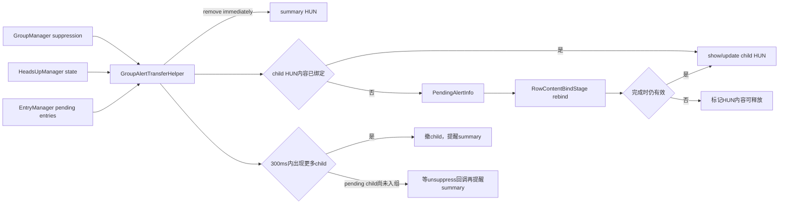
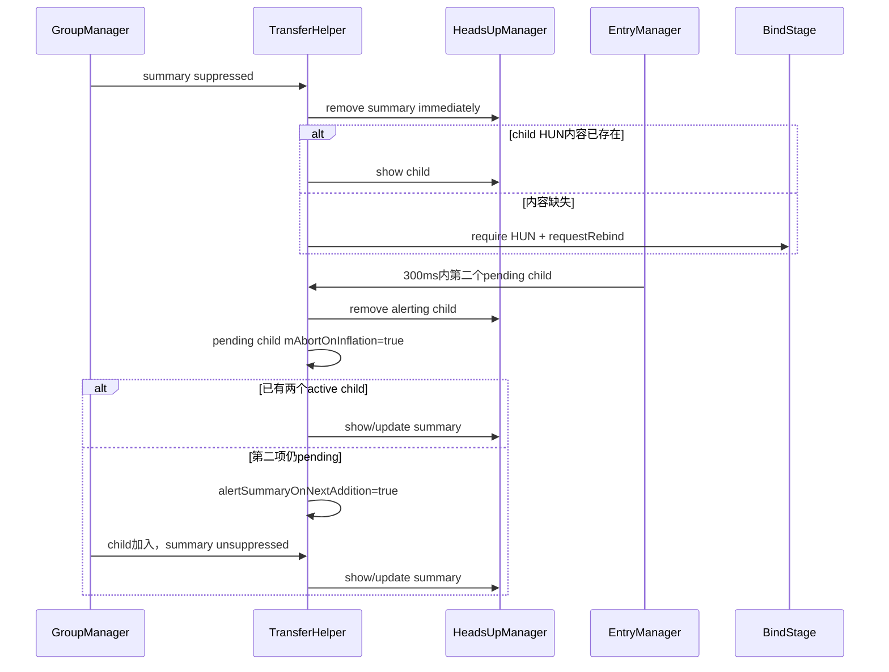
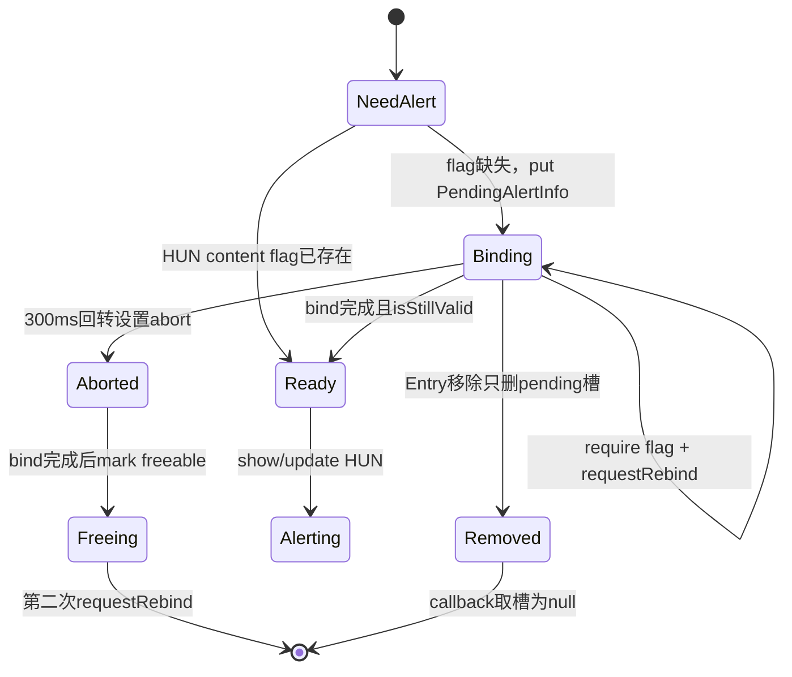

# 第 482 章 Android SystemUI NotificationGroupAlertTransferHelper：摘要与子项 Heads-up 提醒转移、延迟 Inflate 和回转链

> 源码基线：Android 11 / API 30 / android-11.0.0_r48。本章只在 macOS 阅读，不实际编译。核心文件：NotificationGroupAlertTransferHelper.java；交叉阅读 NotificationGroupManager.java、AlertingNotificationManager.java、HeadsUpManager.java、NotifBindPipeline.java、RowContentBindStage.java、RowContentBindParams.java 及本地测试。

## 1. 本章解决什么问题

一个summary先Heads-up，随后因为组里只有一个child而被suppressed：隐藏的summary不能继续提醒，提醒应交给谁？如果child的Heads-up布局还没inflate怎么办？紧接着第二个child到达、summary重新可见时，怎样避免错误地只提醒第一个child？

## 2. 一句话主线

Helper监听group suppression、Heads-up和pending Entry：summary被隐藏时立即撤掉它的alert，并尽可能提醒代表child；child内容缺失就挂PendingAlertInfo；转移后300毫秒内发现组实际有多个child，则撤销child提醒并把提醒交回summary。

## 3. 这里转移的是alert state

它不移动NotificationEntry、不改变group归属，也不复制通知；只调用AlertingNotificationManager的 remove/update/show，并按需要求RowContentBindStage准备对应提醒内容View。

## 4. r48实际只服务Heads-up

方法参数写成通用AlertingNotificationManager，但生产监听和所有调用都传HeadsUpManager，后者的contentFlag是 FLAG_CONTENT_VIEW_HEADS_UP。学习时可用通用抽象理解流程，但不能虚构其他alert类型已接入。

## 5. 为什么需要回转

通知不是作为完整group原子到达。第一帧可能只有summary+一个child，于是summary被抑制、提醒转给child；几毫秒后第二个child到达，summary不再冗余，若不回转就会用第一个child代表一个实际多child组。

## 6. 时间窗口是300毫秒

常量 ALERT_TRANSFER_TIMEOUT=300，使用SystemClock.elapsedRealtime计算，条件是严格小于300。它不是两秒，也不是动画时长；它只是“后续child很可能属于同一批发布”的纠错窗口。

## 7. 两张状态表

mGroupAlertEntries按视觉group key保存GroupAlertEntry，内含group对象、最后一次summary→child时间、是否等下一次组新增再提醒summary；mPendingAlerts按notification key保存等待内容inflate的PendingAlertInfo。

## 8. GroupAlertEntry持有活group对象

它不是group快照。NotificationGroupManager继续修改同一个group的summary、children、expanded与suppressed，Helper读取时看到最新字段；bucket被删除后，map listener再移除对应GroupAlertEntry。

## 9. PendingAlertInfo保存的是发起时快照

它同时保存原始SBN引用和Entry引用，用于bind完成时判断Entry是否换group或child/summary角色改变；另有abort布尔表示提醒已被回转逻辑取消。

## 10. 总体协作图



## 11. 构造器与bind分成两步

构造器立刻注册StatusBarStateController并保存BindStage；bind再注册EntryManager listener和GroupManager listener。重复bind会抛IllegalStateException，但没有unbind。

## 12. GroupManager实例有两条来源

成员mGroupManager在构造时从Dependency获取，bind参数groupManager只用于注册listener。生产与测试都保证两者是同一实例；若装配成不同对象，会从A接回调却向B查询，是一个隐含一致性合同。

## 13. HeadsUpManager又是第三步set

bind本身不检查mHeadsUpManager；suppression回调会直接解引用。正常NotificationsController在EntryManager attach前完成set，但bind与set之间仍是类接口层面的空窗，错误装配可能NPE。

## 14. onStateChanged为何为空

实现StateListener主要为了接收onDozingChanged；普通状态栏state变化不做事。不要因为实现了接口就假设KEYGUARD/SHADE切换会主动转移提醒。

## 15. Dozing变化清什么

只要dozing布尔发生边沿变化，就把所有group的lastTransferTime清0、alertSummaryOnNextAddition清false；它不会遍历或取消mPendingAlerts，也不会直接撤当前Heads-up。

## 16. Group创建与删除

每次NotificationGroupManager创建bucket，Helper都会建GroupAlertEntry；上一章说明standalone也有bucket，因此这张map不只包含真正通知组。bucket删除则按key移除元数据。

## 17. suppression变true的入口

如果summary当前正在HeadsUpManager alerting，就调用handleSuppressedSummaryAlerted；如果未alerting则无需转移。suppression本身由GroupManager负责，Helper不重新计算公式。

## 18. Heads-up变true的入口

另一条入口是onHeadsUpStateChanged：只有isHeadsUp=true且Entry此时是suppressed group summary，才调用同一处理方法。这样“先suppressed后alert”和“先alert后suppressed”两种顺序都能覆盖。

## 19. suppression变false的入口

summary为空直接返回；否则找到GroupAlertEntry。若此前设置alertSummaryOnNextAddition，就在summary未alerting时尝试提醒并清flag；否则调用checkShouldTransferBack检查300毫秒回转。

## 20. pending Entry为什么要尽早监听

onPendingEntryAdded发生在通知内容inflate、正式加入GroupManager之前。它让Helper在第二个child还没改变suppression前，就能撤回刚转给第一个child的提醒，避免等待完整inflate后才纠错。

## 21. Entry移除只清pending map

onEntryRemoved执行mPendingAlerts.remove(key)，注释明确这不会停止由转移启动的inflate任务，只适合“外部已经停止inflate”的清理。代码本身既不cancel bind，也不标记内容可释放。

## 22. 前向转移的三个门

处理方法再次确认summary仍suppressed、from alert manager仍在alert、GroupAlertEntry存在。即使入口刚检查过，也用三门防止同步回调或状态变化造成陈旧调用。

## 23. 有pending child时为何暂不转

pendingInflationsWillAddChildren只要发现将加入同组的新child就返回true，不要求它是GROUP_ALERT_SUMMARY。Helper保留summary提醒，赌pending child很快让summary unsuppress，从而避免先转出又立刻转回。

## 24. 暂不转的视觉窗口

此时summary可能已suppressed但仍alerting，方法直接return。设计优先减少错误转移；如果pending child失败或长时间不落入active group，隐藏summary的alert何时收口依赖其他通知管线事件。

## 25. 代表child如何选择

直接取getLogicalChildren(summary).iterator().next()。上一章确认该List由HashMap values拼出，没有排名顺序保证；suppression通常保证至少有一个逻辑child，但代码未检查List为空。

## 26. 前向转移真实源码

```java
private void handleSuppressedSummaryAlerted(@NonNull NotificationEntry summary,
        @NonNull AlertingNotificationManager alertManager) {
    StatusBarNotification sbn = summary.getSbn();
    GroupAlertEntry groupAlertEntry =
            mGroupAlertEntries.get(mGroupManager.getGroupKey(sbn));
    if (!mGroupManager.isSummaryOfSuppressedGroup(summary.getSbn())
            || !alertManager.isAlerting(sbn.getKey())
            || groupAlertEntry == null) {
        return;
    }

    if (pendingInflationsWillAddChildren(groupAlertEntry.mGroup)) {
        // New children will actually be added to this group, let's not transfer the alert.
        return;
    }

    NotificationEntry child =
            mGroupManager.getLogicalChildren(summary.getSbn()).iterator().next();
    if (child != null) {
        if (child.getRow().keepInParent()
                || child.isRowRemoved()
                || child.isRowDismissed()) {
            // The notification is actually already removed. No need to alert it.
            return;
        }
        if (!alertManager.isAlerting(child.getKey()) && onlySummaryAlerts(summary)) {
            groupAlertEntry.mLastAlertTransferTime = SystemClock.elapsedRealtime();
        }
        transferAlertState(summary, child, alertManager);
    }
}
```

这是r48连续原文；child非null检查不能保护空List，因为iterator.next在赋值之前就会抛异常。

## 27. keepInParent门

child Row若正在删除动画中并要求暂留旧parent，就不接提醒；rowRemoved或rowDismissed也拒绝。代码直接child.getRow()，没有Row为null保护，依赖active/group child已经建立Row的旧管线时序。

## 28. 时间戳不是每次转移都写

只有child当前未alerting且summary的groupAlertBehavior为GROUP_ALERT_SUMMARY才记录时间。若child已经alerting，或summary允许其他alert行为，仍会transfer，但不会开启回转窗口。

## 29. transfer先撤再尝试显示

removeNotification(from, releaseImmediately=true)无视minimum display time立即释放summary；随后alertNotificationWhenPossible(child)。若child内容未准备好，两边会暂时都不alert，pending map记录后半程。

## 30. 为什么用releaseImmediately

AlertingNotificationManager普通remove可能等最短展示时间；这里注释明确要让错误的隐藏summary尽快消失，所以强制立即remove。返回值未检查，因为true参数下只要entry存在就直接remove。

## 31. GROUP_ALERT_SUMMARY是什么

Notification.getGroupAlertBehavior()==GROUP_ALERT_SUMMARY表示应用希望group只由summary发声/提醒。Helper只用它决定是否记录回转时间、是否撤销某个child及哪些pending child算“不会自己alert”，并非前向转移的总开关。

## 32. 非SUMMARY行为也可能前向转

只要隐藏summary正在alert，处理方法仍撤summary并提醒child；差别是通常不记录lastTransferTime，因此随后新增child不会走本Helper的300毫秒纠错。

## 33. pendingInflationsWillAddChildren的范围

遍历EntryManager全部pending notifications，匹配“视觉上是group child、visual groupKey相同、当前group.children还没有该key”。任何group alert behavior都算即将新增。

## 34. pending匹配为什么使用visual key

对group.summary和pending entry都调用GroupManager.getGroupKey，能尊重isolation映射；不过pending Entry尚未正式被GroupManager记录，通常还没有isolated标记，因此主要仍按raw groupKey匹配。

## 35. group.summary为空的合同

isPendingNotificationInGroup直接读取group.summary.getSbn。常规调用来自曾发生summary提醒转移的GroupAlertEntry，summary应存在；类没有把这个前提编码成null门。

## 36. 已在children为何排除

pending迭代器可能包含一个已经通过别的路径进入group.children的同key Entry；containsKey门避免把它重复计作“未来新增”，也避免无意义地阻止当前转移。

## 37. 回转由哪些事件触发

第二个pending Entry出现时调用checkShouldTransferBack；group从suppressed变false且没有wait flag时也调用。没有周期定时器在300ms结束时执行任何动作，时间窗只在事件到来时被查询。

## 38. 严格小于300的边界

elapsed-last==300时不回转；系统调度与方法开销都计入elapsedRealtime差值。它是一次性资格判断，不会post一个300ms Runnable。

## 39. 初始时间0的小边界

GroupAlertEntry新建时lastTransferTime为0；若设备启动后的elapsedRealtime尚小于300ms且恰好触发check，代码会误入窗口。SystemUI正常收到这类通知时通常已超过300ms，但实现没有“是否曾转移”的独立布尔。

## 40. 回转首先要求summary-only

check方法对group summary调用onlySummaryAlerts，不满足立即return。因为只有“本来不该由child独立提醒”的组，才需要把误转的child提醒撤回summary。

## 41. logical children加pending children

numChildren先取已经active的全部逻辑children数，再加“即将加入且GROUP_ALERT_SUMMARY”的pending数；总数大于1才认为第一项child不足以代表完整group。

## 42. 为什么pending计数更窄

getPendingChildrenNotAlerting只数onlySummaryAlerts pending Entry；一个允许child自己提醒的pending项不会成为“应撤回到summary”的证据。与前向阶段“任何pending child都先别转”的政策有意不同。

## 43. 回转会扫描全部active logical children

对于GROUP_ALERT_SUMMARY且当前Heads-up的child，立即remove；对于mPendingAlerts里等待inflate的child，把mAbortOnInflation设true。只要至少做过一种操作，releasedChild才为true。

## 44. pending abort不等于取消任务

这里只改布尔，不调用BindStage cancel。已经启动的内容inflate会继续，直到callback取出PendingAlertInfo、发现invalid、把HUN View标为可释放并再次requestRebind。

## 45. 前向与回转时序图



## 46. notifyImmediately公式

条件是 numChildren-numPendingChildren>1；代数上等于当前active logical children多于一项。只有此时summary已经有完整可展示的多child上下文，才立刻提醒。

## 47. 为什么只有一个active时要等

第二项仍在pending，summary可能尚处suppressed；立刻show summary会再次提醒一张隐藏Row。所以设置alertSummaryOnNextAddition，等待child正式入组导致unsuppress回调。

## 48. flag名称不完全等于inflate完成

mAlertSummaryOnNextAddition并不是BindCallback消费，而是onGroupSuppressionChanged(false)消费。它等的是GroupManager确认组不再suppressed，通常由pending child完成主流程加入active group触发。

## 49. unsuppress时怎样消费flag

若summary还未Heads-up就alertNotificationWhenPossible(summary)，无论是否真正show成功都把flag清false；如果summary已经alerting，则不重复show，同样清flag。

## 50. 回转完成后时间清0

只在releasedChild=true且summary当前未alerting的分支末尾把lastTransferTime清0。若没有找到需释放的child，或summary已alerting，时间保留到自然超出300ms或dozing边沿清理。

## 51. child行为不一致的边界

记录窗口只看summary是GROUP_ALERT_SUMMARY；扫描active child时又要求child自身也是GROUP_ALERT_SUMMARY才remove。如果应用给summary和child设置不一致行为，可能记录时间却不释放该child，最终不回转。

## 52. 300毫秒回转真实源码

```java
private void checkShouldTransferBack(@NonNull GroupAlertEntry groupAlertEntry) {
    if (SystemClock.elapsedRealtime() - groupAlertEntry.mLastAlertTransferTime
            < ALERT_TRANSFER_TIMEOUT) {
        NotificationEntry summary = groupAlertEntry.mGroup.summary;

        if (!onlySummaryAlerts(summary)) {
            return;
        }
        ArrayList<NotificationEntry> children = mGroupManager.getLogicalChildren(
                summary.getSbn());
        int numChildren = children.size();
        int numPendingChildren = getPendingChildrenNotAlerting(groupAlertEntry.mGroup);
        numChildren += numPendingChildren;
        if (numChildren <= 1) {
            return;
        }
        boolean releasedChild = false;
        for (int i = 0; i < children.size(); i++) {
            NotificationEntry entry = children.get(i);
            if (onlySummaryAlerts(entry) && mHeadsUpManager.isAlerting(entry.getKey())) {
                releasedChild = true;
                mHeadsUpManager.removeNotification(
                        entry.getKey(), true /* releaseImmediately */);
            }
            if (mPendingAlerts.containsKey(entry.getKey())) {
                // This is the child that would've been removed if it was inflated.
                releasedChild = true;
                mPendingAlerts.get(entry.getKey()).mAbortOnInflation = true;
            }
        }
        if (releasedChild && !mHeadsUpManager.isAlerting(summary.getKey())) {
            boolean notifyImmediately = (numChildren - numPendingChildren) > 1;
            if (notifyImmediately) {
                alertNotificationWhenPossible(summary, mHeadsUpManager);
            } else {
                // Should wait until the pending child inflates before alerting.
                groupAlertEntry.mAlertSummaryOnNextAddition = true;
            }
            groupAlertEntry.mLastAlertTransferTime = 0;
        }
    }
}
```

这段没有调度器；若300ms内没有pending-add或unsuppress事件，窗口结束不会自动执行一次检查。

## 53. dozing为何取消回转意图

AOD/Doze边沿意味着用户可见场景已经切换，旧Shade HUN转移不应在稍后新child到来时重新提醒summary，所以时间与wait flag都清零。

## 54. dozing没有取消pending inflate

mPendingAlerts原样保留，PendingAlertInfo也不记录dozing代际；bind完成仍可能被判valid并调用HeadsUpManager。最终是否展示还受HeadsUpManager其他政策影响，但本Helper没有主动取消。

## 55. mIsDozing只用于边沿比较

字段不参与handle或alert条件。dozing=true与false本身不改变转移算法，只有值发生变化那一刻执行清理。

## 56. onPendingEntryAdded可能先于GroupManager

这正是设计所需：EntryManager的pending列表包含尚未inflate/active的第二child，而GroupManager还认为只有一项。Helper用两个数据源拼出“即将有多项”的未来事实。

## 57. TODO揭示旧管线债务

bind方法注释希望GroupManager未来直接包含pending notifications；当前因为GroupManager只看到active Entry，Helper不得不依赖EntryManager并担心suppression不及时。

## 58. 回转不是把旧alert对象搬回去

它撤掉child的HeadsUp entry，再对summary执行show或update；post time、最短展示时长、accessibility与pinned状态都由HeadsUpManager重新建立，不是复用原summary AlertEntry。

## 59. summary已alerting时不重复show

alertNotificationWhenPossible发现key已alerting就updateNotification(key,true)，刷新post/removal时间；否则showNotification创建新AlertEntry并标记interruption。

## 60. show child会同步触发更多监听

HeadsUpManager.showNotification内部add entry并逐listener发onHeadsUpStateChanged；GroupManager可能先孤立child、改变suppression，TransferHelper随后又收到Heads-up事件。整个过程可重入，不是线性异步消息链。

## 61. contentFlag从alert manager获取

HeadsUpManager返回FLAG_CONTENT_VIEW_HEADS_UP。Helper不直接查看Row某个child View是否非null，而是查询RowContentBindParams的required content bitmask，判断管线是否承诺保留该内容。

## 62. bit存在不等于像素已绘制

getContentViews包含flag表示该内容属于当前绑定目标；BindPipeline的完成回调才表示这一轮内容已更新。若flag已经存在，Helper直接show，不等待新布局帧。

## 63. 内容缺失时先登记pending

按Entry key put新的PendingAlertInfo，再requireContentViews(flag)，最后requestRebind并注册callback。顺序保证同步或很快的pipeline完成也能找到pending元数据。

## 64. require只表达目标

RowContentBindParams把flag加入mContentViews并在新加入时标dirty；真正cancel旧bind、bind HUN RemoteViews、清dirty发生在RowContentBindStage/NotifBindPipeline。

## 65. requestRebind会重启管线

NotifBindPipeline将Entry标invalid，已有stage执行会先abortStage；RowContentBindStage.abortStage调用binder.cancelBind。这里的“重启”是BindPipeline行为，不等于Helper在回转时主动取消。

## 66. callback先remove pending

bind完成回调按key从mPendingAlerts删除；若返回null就什么也不做。这覆盖Entry移除已经清表、另一个callback先消费或相同key状态被覆盖的情况。

## 67. valid时递归再检查内容

callback不是直接show，而是重新调用alertNotificationWhenPossible；此时flag通常已存在，于是落入update/show分支。递归也让参数读取集中在同一方法。

## 68. callback硬编码mHeadsUpManager

最初方法接收通用alertManager，callback却不捕获它，而固定传mHeadsUpManager。当前所有生产调用本来就是Heads-up，所以结果一致；抽象若扩展到其他AlertingNotificationManager会转错目标。

## 69. invalid时怎样释放

先markContentViewsFreeable(contentFlag)从required/dirty bitmask移除，再requestRebind(null callback)，让Binder在安全时解绑HUN内容。注释承认callback返回不代表View已立刻释放。

## 70. 回转abort为何仍耗inflate

checkShouldTransferBack只设置mAbortOnInflation；直到原rebind完成才执行invalid分支。因此“abort child inflation”测试名更准确应理解为“阻止inflate完成后alert，并安排释放”，不是中途cancel网络/RemoteViews工作。

## 71. Entry移除清理更弱

onEntryRemoved直接remove map；原callback日后看到null，不会进入invalid释放分支。注释假设外部移除流程已经停止inflate并清内容，本类自身不验证这个假设。

## 72. 同key多请求会覆盖

mPendingAlerts是key→单槽；再次为同key put会覆盖旧PendingAlertInfo，但旧requestRebind callback仍存在。哪个callback先remove会消费当前槽，没有request generation字段。

## 73. 同key跨Entry代际风险

若旧Entry callback迟到，而相同notification key已对应新的PendingAlertInfo，它可能remove新槽；valid检查针对槽内Entry，随后递归却使用旧callback捕获的entry。正常清理管线应隔离代际，但Helper没有对象身份核对。

## 74. content flag没有所有权计数

invalid分支直接把HUN flag标freeable，不知道其他消费者是否同时要求同一flag。当前BindParams是共享bitmask而非引用计数；是否与新Heads-up请求冲突要结合管线代际验证。

## 75. 延迟内容与提醒真实源码

```java
private void alertNotificationWhenPossible(@NonNull NotificationEntry entry,
        @NonNull AlertingNotificationManager alertManager) {
    @InflationFlag int contentFlag = alertManager.getContentFlag();
    final RowContentBindParams params = mRowContentBindStage.getStageParams(entry);
    if ((params.getContentViews() & contentFlag) == 0) {
        mPendingAlerts.put(entry.getKey(), new PendingAlertInfo(entry));
        params.requireContentViews(contentFlag);
        mRowContentBindStage.requestRebind(entry, en -> {
            PendingAlertInfo alertInfo = mPendingAlerts.remove(entry.getKey());
            if (alertInfo != null) {
                if (alertInfo.isStillValid()) {
                    alertNotificationWhenPossible(entry, mHeadsUpManager);
                } else {
                    // The transfer is no longer valid. Free the content.
                    mRowContentBindStage.getStageParams(entry).markContentViewsFreeable(
                            contentFlag);
                    mRowContentBindStage.requestRebind(entry, null);
                }
            }
        });
        return;
    }
    if (alertManager.isAlerting(entry.getKey())) {
        alertManager.updateNotification(entry.getKey(), true /* alert */);
    } else {
        alertManager.showNotification(entry);
    }
}
```

源码中callback参数en未使用，所有操作依赖外层捕获的entry和key。

## 76. isAlertTransferPending做什么

查询map槽存在且isStillValid；它不删除invalid槽、不启动/停止bind，也不检查content flag。生产源码中没有调用者，r48本树只有测试使用这个public方法。

## 77. pending map何时真正清除

正常bind callback remove、Entry removed listener remove；回转只设abort不remove。group删除、dozing变化、Heads-up结束均不会直接清mPendingAlerts。

## 78. inflation异常路径

RowContentBindStage发生inflation exception时设置error，但展示的InflationCallback只有成功时调用stage finished；Helper的BindCallback是否最终执行依赖Pipeline错误恢复。本类没有超时或错误回调清pending。

## 79. 回调集合允许重入

NotifBindPipeline完成时先把callbacks复制到scratch、清原集合再逐个执行，注释专门提到为兼容本Helper的reentrant requestRebind。invalid分支在完成callback内再次requestRebind正是该场景。

## 80. 延迟inflate状态图



## 81. 为什么先撤summary会出现空档

前向transfer在请求child bind之前就release summary；Binding状态可能持续多个帧，所以测试明确断言summary和child都不alert、但isAlertTransferPending为true。这是设计接受的中间态。

## 82. child bind完成怎样引起isolation

showNotification(child)触发HeadsUp回调，GroupManager判断折叠组child应孤立，把它移到自身key视觉bucket。提醒转移与视觉提升是两个listener协作的结果，不由Helper单独完成。

## 83. 已alerting时update的效果

AlertingNotificationManager.updateNotification(alert=true)刷新post time和removal计划并发accessibility变化；它不是简单no-op。因此重复转移到已经alerting的child也可能延长提醒。

## 84. show会标记interruption

showNotification最终entry.setInterruption；transfer回summary若重新show，也会把summary作为发生过打断的通知记录。Helper不手工维护该字段。

## 85. remove立即释放的连锁回调

HeadsUpManager移除AlertEntry会发onHeadsUpStateChanged(false)，GroupManager可能停止isolation并重算suppression；这可在transferAlertState尚未调用child alert之前同步发生。

## 86. 所以方法名“transfer”不是原子操作

from remove与to show之间可能执行多个listener、group重组、bind等待甚至失败。正确日志应把remove summary、pending bind、show child、isolate child四个时间点分别记录。

## 87. PendingAlertInfo为什么保存SBN

Entry对象会被复用并setSbn为更新后的通知；保存发起时SBN引用可比较groupKey和summary角色，阻止一项更新后仍沿用旧转移意图。

## 88. 它没有保存suppression快照

bind完成时不重新问目标child的原summary是否仍suppressed，也不检查GROUP_ALERT_SUMMARY、dozing或Heads-up资格；有效性只看abort、groupKey和summary角色。

## 89. 它也没有保存alert manager

pending结构没有contentFlag、manager或transfer来源；这些由callback闭包与Helper字段提供。一个key同时存在不同alert请求时无法在map槽中区分来源。

## 90. 下一步要看字符串比较

最关键的validity细节在groupKey比较：r48使用Java引用不等号，不是Objects.equals。两个内容相同但对象不同的String也会被判“换组”。

## 91. Pending有效性真实源码

```java
private boolean isStillValid() {
    if (mAbortOnInflation) {
        // Notification is aborted due to the transfer being explicitly cancelled
        return false;
    }
    if (mEntry.getSbn().getGroupKey() != mOriginalNotification.getGroupKey()) {
        // Groups have changed
        return false;
    }
    if (mEntry.getSbn().getNotification().isGroupSummary()
            != mOriginalNotification.getNotification().isGroupSummary()) {
        // Notification has changed from group summary to not or vice versa
        return false;
    }
    return true;
}
```

第二个比较是boolean值比较，正确；第一个对String用!=，比较的是对象身份，这是r48可直接确认的实现问题。

## 92. 引用比较会有两类误判

groupKey文本未变但更新创建了新String对象，会把仍在同组误判invalid；理论上文本变了但复用了同一对象不可能表达两个不同文本，所以主要风险是误取消，而不是漏掉真正换组。

## 93. 测试为什么没有暴露同文本新对象

换组测试spy让newSbn返回字面值other_group，只验证明显不同引用时pending为false；没有构造 new String(原groupKey) 的等值不同对象场景。

## 94. validity遗漏isGroup变化

如果Entry从group child变成standalone但groupKey文本对象和isGroupSummary=false都保持，isStillValid仍可能true；它没有比较SBN.isGroup，也不重新调用GroupManager.isGroupChild。

## 95. validity遗漏Entry生命周期

不检查rowRemoved、rowDismissed、Row是否存在或Entry是否仍active。前向选择时检查过一次，但bind等待期间这些事实可以变化；通常onEntryRemoved清map提供补偿，却不是结构内验证。

## 96. invalid查询不清槽

isAlertTransferPending只返回alertInfo.isStillValid结果。group更新后即使返回false，PendingAlertInfo仍留在mPendingAlerts，等bind callback或Entry remove才真正移除。

## 97. 专用测试共九项

覆盖summary→child、立即转回、dozing阻止转回、未inflate pending、inflate后提醒、回转后释放内容、Entry移除清pending、换group invalid、child变summary invalid。

## 98. 测试怎样制造300ms回转

先以GROUP_ALERT_SUMMARY发布summary和第一child并触发转移，马上把第二child放入mock pending map、调用onPendingEntryAdded，再正式onEntryAdded。测试利用真实elapsedRealtime但所有动作紧邻执行，通常落在300ms内。

## 99. dozing测试证明范围有限

它在第一次转移后切dozing，再加第二child，断言summary没有重新alert；证明lastTransferTime被清。它没有覆盖“child HUN内容仍在pending bind时切dozing”的行为。

## 100. abort测试名称容易误导

测试在回转后手工触发原BindCallback，再断言HUN content flag已清且child未alert；这验证“完成后释放”，并没有verify binder.cancelBind或任务在完成前停止。

## 101. 复读发现一：300ms而非两秒

常量、条件与测试都指向300毫秒。把它写成两秒会严重改变对乱序容忍和用户可见重复提醒的判断，因此已同步修正上一章的预告与进度记录。

## 102. 复读发现二：String使用引用比较

PendingAlertInfo把同组有效性建立在groupKey对象身份上；Android内部groupKey常可能复用，但API语义是字符串值。学习文档应明确这是实现事实与潜在误取消，不能解释成有意的代际token。

## 103. 复读发现三：abort不取消in-flight bind

回转只置flag，Entry remove甚至只删map；真正的资源释放依赖旧bind成功回调后再次rebind。若bind失败或callback不达，本类没有timeout清理。

## 104. 复读发现四：dozing只清group元数据

pending child alert未被取消，isStillValid也不看dozing。不能把dozing测试结论扩张为“所有转移工作都被清空”。

## 105. 复读发现五：通用参数被硬编码callback破坏

同步路径尊重传入alertManager，异步恢复固定用mHeadsUpManager。当前产品只有Heads-up所以可工作，但方法签名表达的通用性并未贯穿。

## 106. 一套前向转移诊断顺序

确认summary suppressed且仍alerting；查GroupAlertEntry visual key；扫描pending future child；打印logicalChildren及首项；检查首项Row keepInParent/removed/dismissed；最后看summary行为、时间戳与remove/show先后。

## 107. 一套回转诊断顺序

计算elapsed-last是否严格小于300；确认summary GROUP_ALERT_SUMMARY；分别数active logical与only-summary pending child；记录每个active child行为/alerting和PendingAlertInfo；最后看notifyImmediately或wait flag。

## 108. 一套inflate异常诊断顺序

检查BindParams HUN flag/dirty flag、pending map槽与original SBN；确认requestRebind callback是否登记、stage是否成功finished；完成时检查abort、groupKey对象和值、summary角色，再看markFreeable第二次rebind。

## 109. 一套重入日志字段

每行至少带elapsedRealtime、Entry key、raw/visual groupKey、summary/child、suppressed、Heads-up alerting、pending/abort、content flags与事件名；否则同步remove回调和异步bind callback很容易被误排成一条原子链。

## 110. 本章线程与进程

Helper、EntryManager、GroupManager、HeadsUpManager和BindPipeline都在SystemUI进程；主要控制回调在主线程，实际RemoteViews inflate可由binder内部异步工作再回主线程完成。本文不需要在macOS真正inflate或编译。

## 111. 最小记忆口诀

“隐藏summary先撤；child没HUN内容就等bind；300ms内多一项就回summary；abort只阻止提醒、不立刻停inflate；validity的groupKey误用了引用比较。”

## 112. macOS只读练习一：手算300ms回转

设转移发生在elapsed=10000ms，分别让第二child在10299、10300、10301ms到达；只读checkShouldTransferBack逐条件推演，并区分第二child已active和仍pending时summary何时show。

## 113. macOS只读练习二：推演未inflate空档

从summary alerting开始，令child缺HUN flag；列出remove summary、put pending、require、requestRebind、callback、show child每一步的alerting与content bits，再插入回转abort观察差异。

## 114. macOS只读练习三：验证String引用问题

不运行代码，只写三个Java纸面例子：同一String对象、new String同文本、不同文本；代入!=表达式，说明哪一种会把“同组”误判为换组，并写出应使用Objects.equals的概念修正。

## 115. macOS只读练习四：审计九个测试

逐项标注测试覆盖前向、回转、bind、清理还是validity；再列出未覆盖场景：300ms等号、同文本新String、dozing时pending、bind失败、同key代际、logical child空List。

## 116. 易错理解一：transfer是原子搬运

错误。summary先被同步remove，child可能等待inflate，期间还会触发group isolation与suppression回调；两边同时不alert是明确测试过的中间态。

## 117. 易错理解二：abort立即取消inflate

错误。它只让bind完成后的PendingAlertInfo失效，然后安排释放HUN内容；Entry remove连这个abort标志都不设，只删除map槽。

## 118. 易错理解三：300ms后会自动执行任务

错误。没有定时Runnable；只有pending Entry或unsuppression事件调用check，方法当场判断是否仍在窗口。

## 119. 复读后的最终心智模型

把Helper看成“乱序group提醒纠错器”：GroupManager给当前组事实，EntryManager给尚未来到的未来child，HeadsUpManager持有真正alert，BindStage补齐可展示内容；GroupAlertEntry管理短窗口，PendingAlertInfo管理跨inflate的有效性，两者不是同一状态机。

## 120. 本章结论与下一章

r48能在suppressed summary、单child、pending第二child和缺HUN内容之间完成前向/300ms回转，并用九项测试覆盖主链；复读还确认首logical child无排序、String引用比较、abort不取消任务、dozing不清pending、callback硬编码HeadsUpManager与同key无代际等边界。下一章继续研究 HeadsUpManager/HeadsUpManagerPhone 的AlertEntry生命周期、pinned/sticky、触摸区域、自动移除和组孤立协作。
