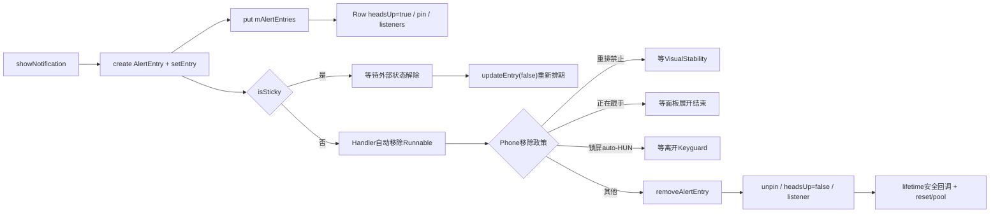
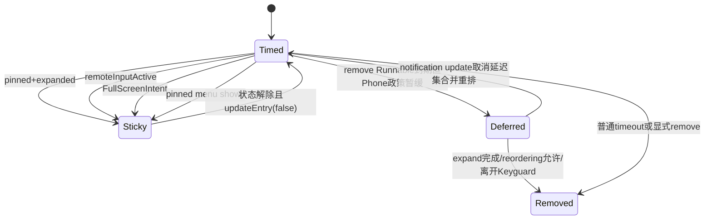
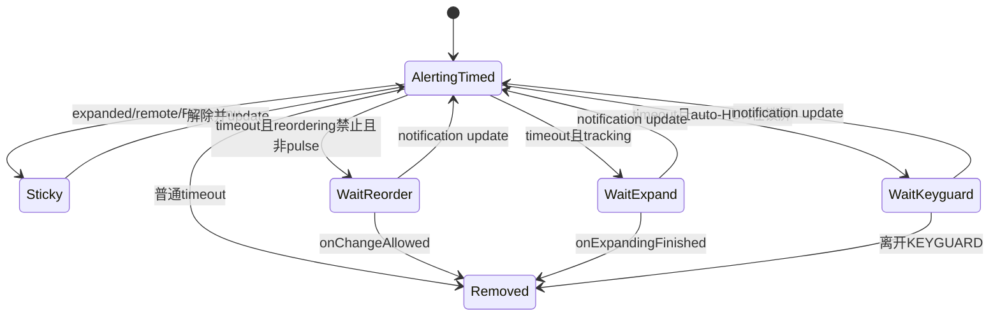

# 第 483 章 Android SystemUI AlertingNotificationManager、HeadsUpManager 与 HeadsUpManagerPhone：生命周期、固定、自动移除、触摸和延迟清理链

> 源码基线：Android 11 / API 30 / android-11.0.0_r48。本章只在 macOS 阅读，不实际编译。核心文件：AlertingNotificationManager.java、HeadsUpManager.java、HeadsUpManagerPhone.java；交叉阅读 HeadsUpTouchHelper.java、StatusBarTouchableRegionManager.java、NotificationGroupManager.java、VisualStabilityManager.java 及三组本地测试。

## 1. 本章解决什么问题

Heads-up显示后为什么不能立刻点击或移除？什么叫alerting、pinned、sticky、top entry？远程输入、展开、菜单、FullScreenIntent怎样暂停自动消失？Shade展开、Keyguard、Doze和VisualStability又怎样把“到点删除”改成延迟清理？

## 2. 一句话主线

AlertingNotificationManager用AlertEntry和Handler管理最短展示、自动移除及生命周期延长；HeadsUpManager加入Row heads-up/pinned、sticky、优先级和包snooze；HeadsUpManagerPhone再按Shade/Keyguard/Bypass、手势追踪、重排限制和触摸区域决定何时真正移除。

## 3. 三层职责不要混

基础层不知道“pinned”；通用HUN层不知道Phone面板是否展开；Phone层复用基础定时器，但把remove Runnable改造成四路政策分发。读一个方法时先确认它在哪一层定义、是否被子类override。

## 4. alerting是什么

只要key存在mAlertEntries，isAlerting就true；它不要求Row pinned、屏幕可见、top-ranked或仍有自动移除Runnable。sticky和延迟清理状态都仍属于alerting。

## 5. pinned是什么

是NotificationEntry Row上的视觉固定事实；Phone通常在SHADE且面板折叠时pin，在Bypass锁屏时也可pin，FullScreenIntent无论状态都可要求pin。全局mHasPinnedNotification是所有alert entries的派生OR值。

## 6. sticky是什么

表示本轮updateEntry不安排自动移除Runnable。通用HUN在“pinned且expanded”、remote input active或有FullScreenIntent时sticky；Phone再加入pinned menu shown。

## 7. sticky不等于不可显式删除

removeNotification仍按releaseImmediately、最早可移除、Row dismissed和Phone top-entry政策处理，并不先查isSticky。sticky只影响自动定时任务，不是永久锁。

## 8. top entry是什么

遍历全部alert entries按compareTo选最小者；Phone可让普通HUN整体压过auto-HUN，通用层再按pinned、FSI、ongoing call、remote input、post time和key排序。

## 9. 两套时间基准

mPostTime服务排序、触摸接纳和finish time；mEarliestRemovaltime服务“外部请求是否可立即删”。二者由同一个elapsedRealtime产生，但HeadsUpEntry会给post time额外加touchAcceptanceDelay。

## 10. 总体生命周期图



## 11. 默认资源时间

r48基础配置为最短展示2000ms、普通自动消失5000ms、auto-HUN 3000ms、触摸接纳700ms、Ambient扩展10000ms、默认snooze 60000ms；设备overlay和无障碍推荐值可改变实际结果。

## 12. show的固定顺序

create entry→setEntry并排定时→put map→子类onAlertEntryAdded→accessibility event→updateNotification(alert=true)再次更新定时→entry.setInterruption。onAdded listener可在show尚未返回时重入。

## 13. 同key重复show的隐含合同

showNotification没有“已alerting则update”的门；同key再次show会用新AlertEntry覆盖map，旧Entry的remove Runnable未被reset，日后可能按同key删除新Entry。正常调用方应对已有key走updateNotification。

## 14. updateNotification的alert参数

无论alert真假都先发送window-content-changed accessibility；只有alert=true才updateEntry并刷新post/removal时间。HeadsUpManager随后还会重新计算是否应pin。

## 15. remove的两种结果

releaseImmediately=true或canRemoveImmediately=true时同步remove并返回true；否则调用removeAsSoonAsPossible、保留alerting并返回false。返回false表示已安排尽早删除，不是请求丢失。

## 16. canRemove基础条件

Entry不存在、已超过earliest removal或Row dismissed即可立即删。wasShownLongEnough使用严格小于，所以currentTime恰好等于earliest时仍返回false。

## 17. removeAsSoon的负delay边界

它直接post earliest-now，不再Math.max；若调用时已过earliest，delay可能为负，Handler通常按立即消息处理。正常canRemove会直接删，负值主要来自时序/直接调用边界。

## 18. releaseAll为何先复制key

removeAlertEntry会修改mAlertEntries并同步通知listeners；基础类先复制key到ArraySet，避免迭代原map时结构变化。快照key若中途已删除，后续remove只是早退。

## 19. AlertEntry初次set两步

先把mPostTime设为calculatePostTime，再调用updateEntry(true)；HeadsUpEntry的calculatePostTime已加700ms接纳延迟，因此update中的max不会把未来post拉回当前。

## 20. earliest从当前时刻算

每次updateEntry都写current+minimum，即使updatePostTime=false。解除expanded/menu/remote input或extend pulse都会重新获得一段最短展示保护，而不只是恢复旧deadline。

## 21. finish从post time算

普通基础Entry为post+decay；HUN用无障碍recommended timeout；Phone auto-HUN用更短auto decay，extend只额外加一次extension。最终delay还要与minimum取最大。

## 22. sticky怎样暂停计时

updateEntry先无条件移除旧callback，再判断isSticky；sticky时不post新任务。以后状态解除必须显式再updateEntry，否则不会凭isSticky字段自动恢复。

## 23. updatePostTime=false仍会改deadline

它保留原post用于排序/总finish公式，但earliest刷新到now+minimum，并重新计算removeDelay；因此“false”只表示不刷新post，不表示不更新计时。

## 24. finish已过仍至少再留minimum

removeDelay=max(finish-current, minimum)。若sticky解除得很晚、finish早已过去，仍从解除时刻起保留minimum，而不是立即消失。

## 25. 定时核心真实源码

```java
public void updateEntry(boolean updatePostTime) {
    if (Log.isLoggable(TAG, Log.VERBOSE)) {
        Log.v(TAG, "updateEntry");
    }

    long currentTime = mClock.currentTimeMillis();
    mEarliestRemovaltime = currentTime + mMinimumDisplayTime;
    if (updatePostTime) {
        mPostTime = Math.max(mPostTime, currentTime);
    }
    removeAutoRemovalCallbacks();

    if (!isSticky()) {
        long finishTime = calculateFinishTime();
        long removeDelay = Math.max(finishTime - currentTime, mMinimumDisplayTime);
        mHandler.postDelayed(mRemoveAlertRunnable, removeDelay);
    }
}
```

这段解释了“解除sticky后至少再显示minimum”，也说明Runnable执行时不会再次检查sticky。

## 26. Runnable不复查sticky

基础remove Runnable直接removeAlertEntry；如果某状态只改sticky字段却没remove callback，到点仍会删除。Phone的expanded/menu/remote-input setter因此都在变sticky时主动取消或重排。

## 27. 生命周期延长解决什么

通知实体已被上游删除，但HUN尚未满足安全移除条件时，NotificationLifetimeExtender让Entry临时继续存在，防止Row突然消失；真正remove alert后再通知onSafeToRemove。

## 28. shouldExtend不是isAlerting同义词

基础实现返回!canRemoveImmediately；一个alerting但已过minimum的Entry不需延长。Phone还要求VisualStability当前允许reordering，否则反而不延长，避免Entry卡到面板收起。

## 29. setShouldManageLifetime的调用前提

shouldExtend=true时把Entry加入集合并直接取map里的AlertEntry调用removeAsSoon；没有null检查，依赖上游只对当前受管且确需延长的Entry调用。

## 30. 安全回调发生在何时

removeAlertEntry先从map删、执行HUN子类清理和accessibility、reset AlertEntry，最后若Entry在extended集合且callback非null才onSafeToRemove并移出集合。

## 31. HUN added的回调顺序

entry.setHeadsUp(true)后先setEntryPinned；这可能先发全局pinned-mode与单Entry pinned回调，最后才遍历onHeadsUpStateChanged(true)。监听器不能假定heads-up true事件总早于pinned事件。

## 32. HUN removed的回调顺序

先entry.setHeadsUp(false)，再unpin并可能发全局/单Entry回调，最后onHeadsUpStateChanged(false)。字段已变与listener通知到达之间存在同步阶段。

## 33. listener集合没有顺序

HeadsUpManager使用HashSet，支持remove但迭代无稳定注册顺序，也未复制或catch异常；监听器回调中修改集合或抛异常可能影响本轮后续通知。

## 34. Phone基础pin公式

状态是SHADE且面板未expanded时pin；Bypass开启时KEYGUARD也pin；最后OR通用层FullScreenIntent。SHADE_LOCKED普通HUN不会仅因面板折叠而pin。

## 35. update也会重新pin

HeadsUpManager.updateNotification先刷新基础entry，随后alert=true且Entry仍存在时根据当前面板/状态/FSI重算pin。alert=false不会重算pin。

## 36. 全局pinned mode怎样派生

每次单Entry pin变化都扫描全部alert entries，只要一张Row pinned即true；边沿变化才发onHeadsUpPinnedModeChanged，进入true还记录note_peek指标。

## 37. unpinAll并不移除alert

逐Entry setPinned(false)，再updateEntry(false)让解除sticky的项恢复定时；userUnPinned且Row mustStayOnScreen时标记heads-up visible，防止后续滚动政策误判。

## 38. expanded sticky的完整条件

只有pinned Row且expanded=true才因展开sticky；非pinned Entry的expanded字段即使true也不阻止定时。Phone override在expanded true时cancel callback，false时updateEntry(false)。

## 39. 通用HeadsUpEntry setter不管timer

基类HeadsUpEntry.setExpanded只赋字段；真正使用的HeadsUpEntryPhone override才取消/恢复callback。若独立匿名HeadsUpManager直接调用setExpanded，已有Runnable不会因sticky字段自动消失，这是基类可复用边界。

## 40. remote input sticky

Phone setRemoteInputActive(true)写字段并cancel；false则updateEntry(false)。它不要求Row pinned，所以回复输入框可以在不同视觉状态下持续保护HUN。

## 41. menu sticky比expanded更窄

setMenuShown只有Entry是HeadsUpEntryPhone且Row当前pinned才调用内部setter；menu open取消timer，close重排。非pinned时传入false也不会清内部menu标志。

## 42. menu与unpin的陈旧风险

若menu标志true后先unpinAll，Phone isSticky仍因mMenuShownPinned为true；之后menu close调用又因Row已非pinned而不进入setter，标志可能保持到Entry remove/reset，导致自动timer不恢复。

## 43. sticky状态图



## 44. FullScreenIntent天然sticky

只要通知仍带FSI，isSticky恒true；没有专门setter在FSI消失时恢复timer，依赖通知update调用updateEntry。FSI也让通用pin公式为true。

## 45. top排序第一层在Phone

一项auto-HUN与普通HUN比较时，auto项直接排低，甚至不会进入通用层pinned/FSI/call比较。因此普通未pinHUN可整体压过auto展示的pinned项，这是override的明确优先级。

## 46. 通用排序优先级

同为auto或同为普通后，依次pinned、FullScreenIntent、ongoing CATEGORY_CALL、remoteInputActive、较新postTime，最后key字典序。compare返回负数表示自己更靠前。

## 47. ongoing call条件

必须SBN isOngoing且Notification.category等于CALL；只有category或只有ongoing都不提升。测试确认ongoing call排在active remote input之前。

## 48. postTime越新越靠前

基础compare中self postTime更大返回-1；相同post才比较key。由于HUN post包含touch delay且update(alert=true)可刷新，更新通知也可能跃为top。

## 49. top影响移除与触摸

getTopEntry供Phone touchable region、extendHeadsUp和canRemoveImmediately使用；非top Entry在Phone可绕过minimum立即移除，top才继承基础最短展示保护。

## 50. sticky与排序真实源码

```java
@Override
public boolean isSticky() {
    return (mEntry.isRowPinned() && expanded)
            || remoteInputActive || hasFullScreenIntent(mEntry);
}

@Override
public int compareTo(@NonNull AlertEntry alertEntry) {
    HeadsUpEntry headsUpEntry = (HeadsUpEntry) alertEntry;
    boolean isPinned = mEntry.isRowPinned();
    boolean otherPinned = headsUpEntry.mEntry.isRowPinned();
    if (isPinned && !otherPinned) {
        return -1;
    } else if (!isPinned && otherPinned) {
        return 1;
    }
    boolean selfFullscreen = hasFullScreenIntent(mEntry);
    boolean otherFullscreen = hasFullScreenIntent(headsUpEntry.mEntry);
    if (selfFullscreen && !otherFullscreen) {
        return -1;
    } else if (!selfFullscreen && otherFullscreen) {
        return 1;
    }

    boolean selfCall = isOngoingCallNotif(mEntry);
    boolean otherCall = isOngoingCallNotif(headsUpEntry.mEntry);

    if (selfCall && !otherCall) {
        return -1;
    } else if (!selfCall && otherCall) {
        return 1;
    }

    if (remoteInputActive && !headsUpEntry.remoteInputActive) {
        return -1;
    } else if (!remoteInputActive && headsUpEntry.remoteInputActive) {
        return 1;
    }

    return super.compareTo(headsUpEntry);
}
```

Phone auto-HUN比较发生在这段之前，所以不能只背本段顺序。

## 51. 无障碍怎样延长timeout

calculateFinishTime把配置decay交给AccessibilityManager.getRecommendedTimeoutMillis，并声明内容含controls/icons/text；返回推荐值后再加post time。测试用600ms推荐值证明活过500ms普通配置。

## 52. touch delay同时影响两件事

HeadsUpEntry.calculatePostTime加700ms：Phone在now<post时吞点击；finish也从这个未来post开始计算。因此接纳延迟不仅防误点，也把自动消失终点向后推。

## 53. minimum没有加touch delay

earliest仍从真实current+2000ms算。默认minimum大于700ms所以通常无冲突；overlay若改变关系，外部可删时间与点击接纳时间是两条独立公式。

## 54. 包snooze怎样记录

snooze遍历当前mAlertEntries，把每个package按user+","+package写入到期elapsed time；同包多HUN覆盖同一key。HeadsUpManager只记录，不主动release。

## 55. Phone snooze的释放时点

Phone override再设mReleaseOnExpandFinish=true；HeadsUpTouchHelper上滑收起手势调用snooze，等panel onExpandingFinished才releaseAllImmediately，避免手势中途突然移除。

## 56. release flag不是Entry快照

完成时releaseAll会删除当时全部HUN，包括snooze调用后新出现的Entry；若expanding finished迟到，范围可能比手势发生瞬间更大。

## 57. isSnoozed按当前user查询

setUser只改mUser；不同用户用不同复合key，切换不会清旧记录。默认mUser初值0，装配需在查询前同步正确用户。

## 58. 过期snooze删除key错误

查找使用"user,package"复合key，但过期分支调用mSnoozedPackages.remove(packageName)，通常删不到原项。返回值仍是false，所以功能表面恢复，过期记录却残留在map/dump直到同复合key被覆盖。

## 59. snooze设置动态更新

Global setting observer运行在主Handler；只接受>=0且与旧值不同的新值。observer没有注销接口，但Manager是SystemUI长寿命对象。

## 60. snooze不改变已有deadline

记录package并不逐Entry更新timer；Phone依赖展开完成统一release。若调用basesnooze而没有Phone手势收口，已有HUN仍按原sticky/timeout行为存在。

## 61. Phone自动移除不是直接remove

HeadsUpEntryPhone为每项构造定制Runnable；到期后依固定顺序检查VisualStability、tracking、auto-Keyguard，只有都不命中才removeAlertEntry。

## 62. 第一优先级是重排限制

若reordering不允许且Entry不是pulsing，就放入mEntriesToRemoveWhenReorderingAllowed并注册一次callback。即使同时tracking或auto-Keyguard，也先走这个分支。

## 63. pulsing为何绕过重排门

注释明确AOD pulse仍必须timeout；showingPulsing时不因为VisualStability禁止重排而无限等待，继续判断tracking/Keyguard或直接remove。

## 64. tracking延迟到展开结束

HeadsUpTouchHelper从HUN开始向下拖面板时setTrackingHeadsUp(true)；timeout Runnable把Entry放入mEntriesToRemoveAfterExpand，onExpandingFinished再删，避免手指跟踪对象中途消失。

## 65. snooze优先于逐项延迟集合

onExpandingFinished若mReleaseOnExpandFinish=true，直接releaseAll并清flag；否则才遍历mEntriesToRemoveAfterExpand。最后无论哪条都clear该集合。

## 66. auto-HUN锁屏延迟

mIsAutoHeadsUp且当前KEYGUARD时，timeout只把key加入mKeysToRemoveWhenLeavingKeyguard；状态监听检测wasKeyguard→not keyguard后按快照remove。

## 67. update会取消所有延期意图

HeadsUpEntryPhone.updateEntry在基础重排timer后，从after-expand、reordering-allowed集合和leave-keyguard key集合移除自身。新的alert/update被视为重新开始生命周期。

## 68. VisualStability允许后的批量清理

onChangeAllowed先让AnimationStateHandler禁止going-away动画，删集合内仍alerting项，clear集合，再恢复动画。没有try/finally，remove listener异常可能让动画允许状态停在false。

## 69. setup是隐含前提

Phone构造器不接VisualStabilityManager，而由package setup后设；shouldExtend、timeout Runnable都会解引用。setAnimationStateHandler也另行注入，onChangeAllowed没有null门。

## 70. swiped key是一次性快速通道

addSwipedOutNotification只加key；下次canRemoveImmediately命中时remove该key并返回true，让手动划走绕过minimum和top保护。

## 71. swiped key可能陈旧

若Entry经releaseImmediately或其他路径移除、从未调用canRemoveImmediately，mSwipedOutKeys不会在onAlertEntryRemoved清理；相同key以后再次Heads-up，第一次普通remove可能被误认为旧滑走。

## 72. 非top为何可立即删

Phone canRemove返回“Entry不存在或不是top或基础允许”。被更高优先级HUN盖住的项无需强制占满minimum；本地对应测试被@Ignore(b/141538055)，说明该行为测试稳定性仍有历史问题。

## 73. 对象池何时复用

createAlertEntry从自建Stack pool acquire；remove时Phone调用super HUN清理后release回pool，随后基础remove流程才send accessibility并reset。正常listener都在release前执行，但对象入池早于最终reset是微妙顺序。

## 74. pool没有容量上限

release总push并返回true；长期峰值决定Stack最大规模。reset会清Entry、callbacks、expanded、remote input、menu、extended和auto字段，正常复用不会继承这些状态。

## 75. timeout Runnable的四路顺序

依次为“等重排→等展开→等离锁屏→立即删除”，不是四个并行flag。Entry update可以把已经进入任一延迟集合的项取回并重新排期。

## 76. Phone移除政策真实源码

```java
public void setEntry(@NonNull final NotificationEntry entry) {
    Runnable removeHeadsUpRunnable = () -> {
        if (!mVisualStabilityManager.isReorderingAllowed()
                // We don't want to allow reordering while pulsing, but headsup need to
                // time out anyway
                && !entry.showingPulsing()) {
            mEntriesToRemoveWhenReorderingAllowed.add(entry);
            mVisualStabilityManager.addReorderingAllowedCallback(HeadsUpManagerPhone.this,
                    false  /* persistent */);
        } else if (mTrackingHeadsUp) {
            mEntriesToRemoveAfterExpand.add(entry);
        } else if (mIsAutoHeadsUp && mStatusBarState == StatusBarState.KEYGUARD) {
            mKeysToRemoveWhenLeavingKeyguard.add(entry.getKey());
        } else {
            removeAlertEntry(entry.getKey());
        }
    };

    setEntry(entry, removeHeadsUpRunnable);
}
```

Runnable捕获Entry对象，而Keyguard集合只保存key；同key跨代与迟到Runnable仍依赖上游正确cancel/reset。

## 77. auto-HUN是什么

Phone每次updateEntry先从NotificationEntry.isAutoHeadsUp读取mIsAutoHeadsUp；它影响排序、decay和Keyguard timeout去向。不是“由HeadsUpManager自动显示的所有通知”的泛称。

## 78. auto-HUN decay更短

普通配置5000ms，auto配置3000ms，二者都先经过无障碍recommended timeout；Phone calculateFinishTime再按extended布尔加10000ms。

## 79. extend只作用top且一次

extendHeadsUp取当前top Phone entry；extended=false才置true并updateEntry(false)，后续调用不再加时。DozeServiceHost在延长pulse时使用它。

## 80. extension不是简单从现在加10秒

finish=原post+decay+extension，但updateEntry(false)又保证从调用时至少minimum。如果调用很晚，实际剩余时间取“旧公式剩余”和minimum较大者。

## 81. 离开Keyguard还清理Bubble

若Bypass开启，状态监听在Keyguard→非Keyguard时扫描所有alert entries，把Bubble且非sticky项移除；使用keys快照避免遍历中修改map。sticky Bubble保留。

## 82. Doze结束重新计时

onDozingChanged(false)对全部alert entries调用updateEntry(true)，把post刷新到当前并恢复正常timeout，防止Doze期间收到的HUN长期卡住；进入Doze不做对称操作。

## 83. Doze重排也会撤销延期集合

由于动态调用HeadsUpEntryPhone.updateEntry，它除更新时间还会把Entry从三个deferred集合删除。Doze结束不仅改deadline，也会取消旧的after-expand/reorder/keyguard延迟意图。

## 84. Phone延迟清理状态图



## 85. panel expanded怎样影响pin

setIsPanelExpanded只在值变化时更新；变为expanded会直接mHeadsUpGoingAway=false。新/更新HUN在SHADE只有面板未展开才pin。

## 86. goingAway清零漏listener

setHeadsUpGoingAway方法会通知phone listeners；setIsPanelExpanded(true)却直接改字段，不走setter，因此此前为true时监听器不会收到false边沿，需依赖其他调用收口。

## 87. goingAway为什么独立存在

最后一张pinned HUN离场动画期间，全局hasPinned可能已false，但状态栏Window仍需保持可触摸/可见；StatusBarTouchableRegionManager把isHeadsUpGoingAway也作为继续观察internal insets的条件。

## 88. goingAway不直接改变Region计算

getTouchableRegion只看hasPinned和top；goingAway主要让外层RegionManager继续安装监听，实际无HUN时它回退为status bar/cutout区域。

## 89. 动画结束谁清goingAway

StatusBar在最后pinned消失且面板仍折叠时置true，并注册panel animation finished callback；确认仍无pinned后关闭window heads-up showing并置false。

## 90. Phone listener也只有add

mHeadsUpPhoneListeners是ArrayList，可重复add且没有remove；setHeadsUpGoingAway逐个同步通知。长寿命生产对象通常匹配，但短生命周期或重复注册会泄漏/重复回调。

## 91. touchable region只为pinned top计算

无全局pinned或top为空就返回null；若top是group child，先向GroupManager取视觉summary，用summary Row几何覆盖整组。这样child HUN不会只留下child那一条狭小触摸带。

## 92. 触摸区域与吞点击真实源码

```java
@Nullable Region getTouchableRegion() {
    NotificationEntry topEntry = getTopEntry();

    // This call could be made in an inconsistent state while the pinnedMode hasn't been
    // updated yet, but callbacks leading out of the headsUp manager, querying it. Let's
    // therefore also check if the topEntry is null.
    if (!hasPinnedHeadsUp() || topEntry == null) {
        return null;
    } else {
        if (topEntry.isChildInGroup()) {
            final NotificationEntry groupSummary =
                    mGroupManager.getGroupSummary(topEntry.getSbn());
            if (groupSummary != null) {
                topEntry = groupSummary;
            }
        }
        ExpandableNotificationRow topRow = topEntry.getRow();
        int[] tmpArray = new int[2];
        topRow.getLocationOnScreen(tmpArray);
        int minX = tmpArray[0];
        int maxX = tmpArray[0] + topRow.getWidth();
        int height = topRow.getIntrinsicHeight();
        mTouchableRegion.set(minX, 0, maxX, mHeadsUpInset + height);
        return mTouchableRegion;
    }
}

/**
 * Decides whether a click is invalid for a notification, i.e it has not been shown long enough
 * that a user might have consciously clicked on it.
 *
 * @param key the key of the touched notification
 * @return whether the touch is invalid and should be discarded
 */
boolean shouldSwallowClick(@NonNull String key) {
    HeadsUpManager.HeadsUpEntry entry = getHeadsUpEntry(key);
    return entry != null && mClock.currentTimeMillis() < entry.mPostTime;
}
```

Region顶部固定为0，底部是status-bar inset加Row intrinsic height，并不使用Row屏幕Y作为上边。

## 93. Region的X与Y策略

X取Row实际屏幕left到left+width；Y从屏幕顶到inset+intrinsic height。它既覆盖状态栏上方入口，也覆盖HUN内容，不是Row矩形的简单拷贝。

## 94. 返回的是内部可变Region

方法复用mTouchableRegion并直接返回引用；当前主要消费者立刻set复制到自己的Region。若新调用者长期保存并修改，会与Manager后续计算共享对象。

## 95. 分组summary查询是视觉查询

调用getGroupSummary而非getLogicalGroupSummary；被孤立child通常已是自己的视觉summary，普通嵌组child才上溯原summary，符合当前屏幕父级。

## 96. 点击接纳边界

now严格小于mPostTime才吞；恰好等于时允许。HeadsUpTouchHelper只在ACTION_UP/CANCEL且确实摸中pinned HUN时查询，吞掉的是过早click，不阻止纵向拖拽开始。

## 97. 拖拽何时tracking

DOWN选中heads-up+pinned Row；纵向位移超过slop且大于横向时启动panel expansion，setTrackingHeadsUp(true)，unpinAll(true)，然后结束本Helper的初始命中状态。

## 98. tracking标志的生命周期

HeadsUpTouchHelper的onTouchEvent在UP/CANCEL时set false；在此期间timeout Entry进入after-expand集合。Panel onExpandingFinished稍后真正清理集合，两者不是同一回调。

## 99. HUN与组孤立的接点

HeadsUpManager发onHeadsUpStateChanged；NotificationGroupManager监听后决定child是否临时孤立，上一章AlertTransferHelper也监听提醒转移。HeadsUpManager本身不维护group children。

## 100. 三个测试文件声明数量

AlertingNotificationManagerTest声明10项，HeadsUpManagerTest额外声明2项，HeadsUpManagerPhoneTest额外声明5项且其中1项@Ignore；两个子类继承基础测试，所以测试Runner还会在子类上下文重复执行基础合同。

## 101. 测试覆盖了什么

基础覆盖show/auto-dismiss、延迟与强制remove、releaseAll、minimum和lifetime；通用HUN覆盖无障碍timeout与call优先remote input；Phone覆盖snooze、swipe immediate和一次pulse extension。

## 102. 测试没覆盖什么

pinned/sticky组合、FSI、expanded/menu/remote input timer、touch delay/Region、Keyguard/Bypass、Doze重排、VisualStability三集合、pool复用、snooze过期key和goingAway listener都没有专用断言。

## 103. 复读发现一：expired snooze删错key

复合key查询后却remove(packageName)，导致过期项留表；isSnoozed返回false使功能测试难发现。应区分“用户不再被snooze”与“内部map已清理”两个结论。

## 104. 复读发现二：同key重复show旧Runnable

map覆盖不reset旧AlertEntry，旧callback仍按key删除。当前上游通常先isAlerting再update规避，但基础public API自身没有保护或generation。

## 105. 复读发现三：menu sticky可跨unpin残留

menu close外层只对仍pinned Row下发；unpin先发生时内部true可能无法清，updateEntry又因menu sticky不排timer。需运行场景验证触发顺序，但字段/门的不对称静态可证。

## 106. 复读发现四：panel展开直接清goingAway

它绕过通知listener的setter；依赖该listener边沿的消费者可能看不到false。外层TouchableRegion还有panel自身刷新，不能直接断言窗口必卡住。

## 107. 复读发现五：deferred清理缺少异常保护

onChangeAllowed在动画禁用与恢复之间同步remove多项，无finally；listener异常还可能让集合只清一部分。SystemUI通常避免回调异常，但恢复合同不完整。

## 108. 一套时间异常诊断顺序

记录now、post、earliest、finish、minimum、decay/a11y、touch delay、sticky及Handler callback；再查Phone extended/auto和三个deferred集合，避免把“timer没post”和“timer到期后被政策延期”混写。

## 109. 一套pin/sticky异常诊断顺序

先看status state、panel expanded、Bypass、FSI算pin；再看expanded、remoteInput、menu算sticky；确认每个状态边沿是否调用updateEntry，最后查Row pinned字段与全局hasPinned派生是否同步。

## 110. 一套触摸异常诊断顺序

确认top排序、hasPinned、group视觉summary、Row location/width/intrinsic、headsUpInset与RegionManager是否仍observe；点击问题再比较ACTION_UP时now和post，不要用通知原始postTime代替AlertEntry post。

## 111. 最小记忆口诀

“alerting是map成员；pinned是Row状态；sticky只停自动timer；post管排序/点击/finish，earliest管外部删除；Phone timeout还要过重排、跟手和锁屏三道门。”

## 112. macOS只读练习一：手算三个deadline

设show时now=1000、touch=700、minimum=2000、decay=5000；算post、earliest、finish和removeDelay，再设3000ms解除sticky并update(false)，重算为什么至少还留2000ms。

## 113. macOS只读练习二：列出sticky矩阵

为pinned、expanded、remote input、FSI、menu五个布尔列至少十组组合，分别计算通用与Phone isSticky；再标注哪个setter会cancel、哪个会update、menu跨unpin为何特殊。

## 114. macOS只读练习三：追一次timeout延期

从Phone remove Runnable开始，分别推演reordering禁止、tracking、auto-Keyguard和普通四条链；写出进入哪个集合、哪个事件清理，以及通知update怎样把Entry从集合取回。

## 115. macOS只读练习四：审计测试空白

阅读三个测试文件，区分“本文件声明@Test数”和“继承后Runner执行合同”；为snooze过期错key、同key重复show、menu-unpin、Region、Doze、goingAway各写一个只读测试设计。

## 116. 易错理解一：pinned就是sticky

错误。只有pinned+expanded才由这一条件sticky；单纯pinned仍自动计时，remote input/FSI又可在不依赖pinned时sticky。

## 117. 易错理解二：timeout到点一定remove

错误。Phone Runnable可能等VisualStability、panel展开结束或离开Keyguard；sticky则根本没有Runnable。

## 118. 易错理解三：top只按发布时间

错误。Phone先降级auto-HUN，通用层再按pinned、FSI、ongoing call、remote input，最后才较新post与key。

## 119. 复读后的最终心智模型

把每张HUN看成带两只钟和多层政策的AlertEntry：基础钟决定“最早允许删”和“计划何时删”，sticky控制计划是否存在；排序决定top，Phone再决定到点是删除还是进入延迟集合；Row/panel/window监听把这些事实投影成pin、触摸区和离场动画。

## 120. 本章结论与下一章

r48三层实现闭合了HUN展示、最短时间、无障碍timeout、pin/sticky、排序、snooze、触摸接纳、重排/跟手/Keyguard延迟与lifetime；复读还确认expired snooze错key、同key旧Runnable、menu-unpin不对称、goingAway漏listener、swiped key残留及延迟清理无finally等边界。下一章继续研究 NotificationInterruptStateProvider、HeadsUpController 与通知为什么获得/失去Heads-up资格的决策链。
