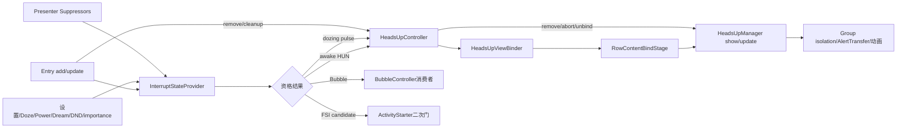
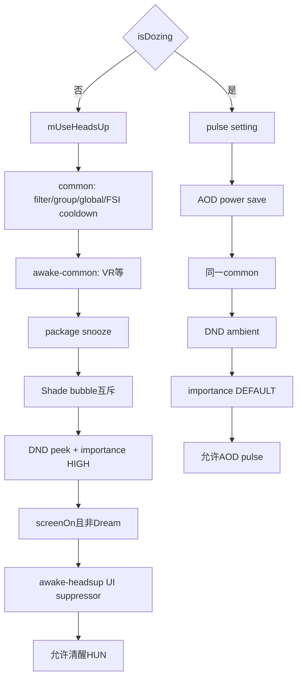
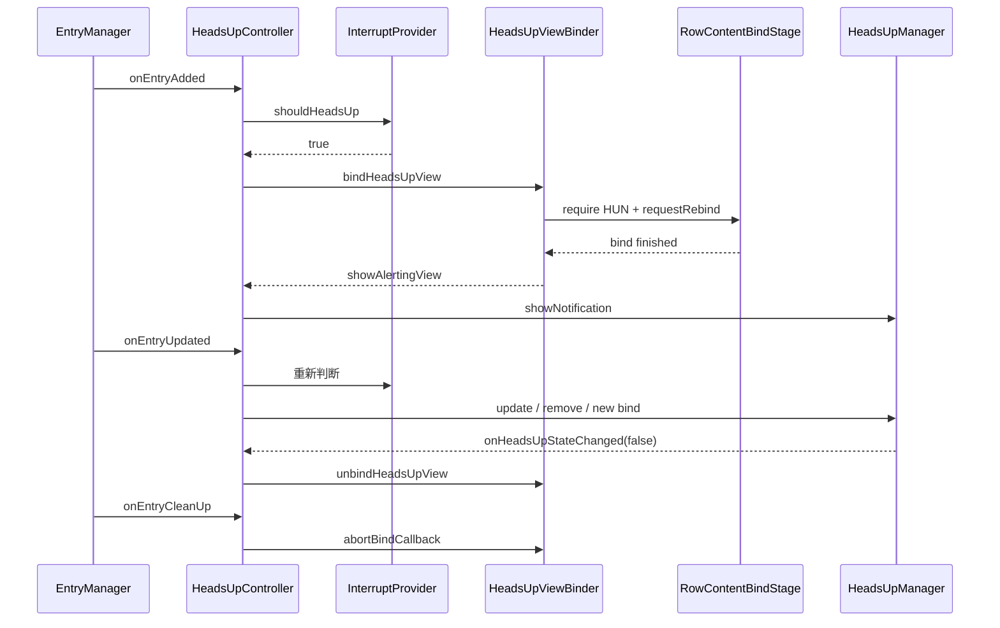

# 第 484 章 Android SystemUI NotificationInterruptStateProvider 与 HeadsUpController：资格决策、内容绑定、显示、更新和移除链

> 源码基线：Android 11 / API 30 / android-11.0.0_r48。本章只在 macOS 阅读，不实际编译。核心文件：NotificationInterruptStateProviderImpl.java、HeadsUpController.java、HeadsUpViewBinder.java；交叉阅读 NotificationInterruptSuppressor.java、StatusBarNotificationPresenter.java、NotificationEntry.java、RowContentBindStage.java、HeadsUpManager.java 及本地测试。

## 1. 本章解决什么问题

一条通知为何能或不能Heads-up？清醒HUN、Doze pulse、Bubble和Fullscreen Intent是否共用同一套门？资格通过后，为何还要等HUN内容bind？通知更新或移除时，Controller怎样决定刷新、延迟移除或释放内容？

## 2. 一句话主线

InterruptStateProvider把设备状态、设置、过滤、group alert、DND、importance和外部Suppressor组合成当下资格；HeadsUpController监听旧管线Entry事件，把资格转成bind/show/update/remove；HeadsUpViewBinder负责HUN专用内容View及取消回调。

## 3. Provider只回答现在应不应该

它不保存每条Entry的决策历史、不显示View、也不安排HUN timeout。shouldHeadsUp每次重新读取当前dozing、状态栏状态、Power/Dream、ranking与suppressor。

## 4. Controller负责新旧状态差分

Entry added时资格true就bind；updated时同时看shouldHeadsUp、wasHeadsUp与alertAgain；removed时向Manager请求停止；cleanup时取消尚未完成的bind callback。

## 5. Binder只准备内容

它设置increased HUN参数、require FLAG_CONTENT_VIEW_HEADS_UP并请求RowContentBindStage；完成后才回调Controller/Manager show。内容已绑定不代表资格仍成立。

## 6. 四种结果不能混写

清醒Heads-up是顶部peek；dozing下shouldHeadsUp返回true表示ambient pulse；shouldBubbleUp表示Bubble/flyout资格；shouldLaunchFullScreenIntentWhenAdded只是FSI候选，还要经ActivityStarter的DND和importance门。

## 7. 三类Suppressor

suppressInterruptions影响清醒HUN、Doze pulse和Bubble；suppressAwakeInterruptions只影响清醒HUN和Bubble；suppressAwakeHeadsUp只影响清醒HUN。默认接口三个方法都false。

## 8. Presenter提供生产Suppressor

全局alerts disabled走所有模式；VR走awake interruptions；面板禁用、锁屏敏感遮挡以及部分FSI/无障碍条件只走awake heads-up。策略被拆成层级而不是一个巨大boolean。

## 9. 决策true仍不是画面完成

Provider true只是政策目标；Binder可能等待RemoteViews，回调可能取消，Manager show后还要pin/isolate/动画。Provider false也可能只让已有HUN走最短展示后的延迟remove。

## 10. 总体协作图



## 11. 全局HUN设置怎样初始化

构造器注册HEADS_UP_NOTIFICATIONS_ENABLED与legacy ticker URI的ContentObserver，然后主动onChange(true)。mUseHeadsUp默认false，以实际Global setting计算初值。

## 12. ticker Observer实际读什么

两个URI变化都会触发，但onChange只读取HEADS_UP_NOTIFICATIONS_ENABLED；ticker_gets_heads_up在本类没有单独逻辑，只作为历史兼容的重新读取触发源。

## 13. 关闭设置的即时动作

mUseHeadsUp从true变false时releaseAllImmediately，清掉当前HeadsUpManager内所有alert entries；从false变true不回看已有通知，也不自动重新HUN。

## 14. 全局开关只门控清醒HUN

shouldHeadsUpWhenAwake开头检查mUseHeadsUp；dozing pulse和shouldBubbleUp都不读它。因此关闭“Heads-up通知”不等于关闭AOD pulse或Bubble资格。

## 15. Observer生命周期

ContentObserver使用主Handler且没有注销方法；Provider是Singleton，符合SystemUI进程寿命。notifyForDescendants=true可能让相关子URI变化也触发重读。

## 16. suppressor列表是追加式

addSuppressor允许重复、没有remove、没有去重或异常隔离；按注册顺序短路。生产通常只加入Presenter长寿命suppressor。

## 17. shouldHeadsUp先按dozing分流

只看StatusBarStateController.isDozing：true完全走pulse路径，false完全走awake路径。它不根据screenOn再选择分支。

## 18. Awake门的固定顺序

全局设置→common→awake-common→package snooze→Shade Bubble→DND peek→importance HIGH→screen/dream→awake-headsup suppressor。前门失败后后门不会执行。

## 19. common门覆盖哪些结果

NotificationFilter、group alert behavior、全局suppressInterruptions与最近FSI冷却同时用于awake HUN、Doze pulse和Bubble。

## 20. awake-common门覆盖哪些结果

只遍历suppressAwakeInterruptions，因此用于awake HUN和Bubble，不用于Doze pulse。Presenter的VR模式放在这里，所以VR不直接阻止AOD pulse。

## 21. package snooze只挡awake HUN

调用上一章HeadsUpManager.isSnoozed(package)；Bubble与pulse不查snooze。过期snooze内部错key不影响这里的false结果，但会留下表项。

## 22. Bubble与HUN互斥只限SHADE

entry.isBubble且StatusBarState==SHADE时拒绝awake HUN，让解锁Shade使用Bubble表现；KEYGUARD或其他state不因这条门自动拒绝HUN。

## 23. DND清醒效果

entry.shouldSuppressPeek来自ranking suppressed visual effects；true拒绝。它与Presenter全局alerts disabled不是同一来源。

## 24. importance阈值

清醒HUN要求IMPORTANCE_HIGH；Doze pulse只要求IMPORTANCE_DEFAULT。测试中DEFAULT通知从dozing切回awake会因阈值不同变false。

## 25. screen与dream共同定义inUse

源码使用PowerManager.isScreenOn且DreamManager不是dreaming；没有使用isInteractive。screen on但screensaver active仍拒绝。

## 26. Dream RemoteException是fail-open

isDreaming初始false；Binder查询失败只Log，若screenOn仍把inUse判true并允许后续HUN。实现优先不因Dream服务错误永久吞通知。

## 27. awake-headsup suppressor最后执行

设备已在用且importance/DND通过后才问Presenter：敏感遮挡、panel禁用、锁屏FSI和touch exploration等UI政策最后裁决。

## 28. panel disabled与alerts disabled不同

panelsEnabled=false只抑制awake HUN；DISABLE_NOTIFICATION_ALERTS通过suppressInterruptions影响HUN/pulse/Bubble，并且StatusBar收到disable变化时还主动release现有HUN。

## 29. FSI与无障碍特殊门

通知带FSI时，锁屏显示且未occluded会拒绝awake HUN，让FSI路径接管；touch exploration开启也拒绝FSI通知的HUN。没有FSI的普通通知不受这两个子条件影响。

## 30. Awake资格真实源码

```java
private boolean shouldHeadsUpWhenAwake(NotificationEntry entry) {
    StatusBarNotification sbn = entry.getSbn();

    if (!mUseHeadsUp) {
        if (DEBUG_HEADS_UP) {
            Log.d(TAG, "No heads up: no huns");
        }
        return false;
    }

    if (!canAlertCommon(entry)) {
        return false;
    }

    if (!canAlertAwakeCommon(entry)) {
        return false;
    }

    if (isSnoozedPackage(sbn)) {
        if (DEBUG_HEADS_UP) {
            Log.d(TAG, "No alerting: snoozed package: " + sbn.getKey());
        }
        return false;
    }

    boolean inShade = mStatusBarStateController.getState() == SHADE;
    if (entry.isBubble() && inShade) {
        if (DEBUG_HEADS_UP) {
            Log.d(TAG, "No heads up: in unlocked shade where notification is shown as a "
                    + "bubble: " + sbn.getKey());
        }
        return false;
    }

    if (entry.shouldSuppressPeek()) {
        if (DEBUG_HEADS_UP) {
            Log.d(TAG, "No heads up: suppressed by DND: " + sbn.getKey());
        }
        return false;
    }

    if (entry.getImportance() < NotificationManager.IMPORTANCE_HIGH) {
        if (DEBUG_HEADS_UP) {
            Log.d(TAG, "No heads up: unimportant notification: " + sbn.getKey());
        }
        return false;
    }

    boolean isDreaming = false;
    try {
        isDreaming = mDreamManager.isDreaming();
    } catch (RemoteException e) {
        Log.e(TAG, "Failed to query dream manager.", e);
    }
    boolean inUse = mPowerManager.isScreenOn() && !isDreaming;

    if (!inUse) {
        if (DEBUG_HEADS_UP) {
            Log.d(TAG, "No heads up: not in use: " + sbn.getKey());
        }
        return false;
    }

    for (int i = 0; i < mSuppressors.size(); i++) {
        if (mSuppressors.get(i).suppressAwakeHeadsUp(entry)) {
            if (DEBUG_HEADS_UP) {
                Log.d(TAG, "No heads up: aborted by suppressor: "
                        + mSuppressors.get(i).getName() + " sbnKey=" + sbn.getKey());
            }
            return false;
        }
    }
    return true;
}
```

这是r48完整连续方法，门序本身就是排障顺序。

## 31. Doze pulse不检查screen/dream

分支已经由isDozing选择，不再问isScreenOn或isDreaming；pulse的设备门是AmbientDisplay notification pulse setting与AOD power save。

## 32. pulse设置使用USER_CURRENT

AmbientDisplayConfiguration.pulseOnNotificationEnabled(UserHandle.USER_CURRENT)动态按当前用户查询；Provider不缓存结果。

## 33. battery门很具体

检查BatteryController.isAodPowerSave，不是任意省电模式布尔。它表达AOD政策已因节能关闭。

## 34. Pulse仍走common

filtered、group alert suppression、全局suppressInterruptions和最近FSI冷却都会拒绝pulse；因此“Doze不看mUseHeadsUp”不等于完全无公共政策。

## 35. Doze DND看Ambient

entry.shouldSuppressAmbient而不是shouldSuppressPeek；DND可分别压制AOD ambient与清醒peek，两者不能互换。

## 36. Pulse阈值较低

IMPORTANCE_DEFAULT即可，低于DEFAULT才拒绝。清醒HUN要求HIGH，所以同一Entry随dozing边沿重新询问可能得到不同结果。

## 37. Pulse不查snooze

用户上滑snooze某包的HUN后，该包仍可能触发AOD pulse；这是代码明确的不对称，而不是snooze过期问题。

## 38. Pulse不查awake suppressor

VR、panels disabled、敏感occluded、touch exploration均不通过awake方法影响pulse；只有suppressInterruptions这种全局层能覆盖。

## 39. 最近FSI冷却是2秒

NotificationEntry.notifyFullScreenIntentLaunched记录elapsed；hasJustLaunchedFullScreenIntent在严格小于last+2000ms时true，common门阻止HUN/pulse/Bubble重复视觉打断。

## 40. group alert门来自Notification本身

仅当SBN isGroup且Notification.suppressAlertingDueToGrouping为true才拒绝；这与SystemUI GroupManager的summary suppressed不是同一字段。

## 41. NotificationFilter先于group

被用户/锁屏/配置等过滤的Entry先拒绝，后续group和suppressor不执行。日志看到filtered就不应继续用importance解释。

## 42. suppressor短路的副作用

第一个返回true的suppressor决定结果和日志name；列表允许重复，后续suppressor不会被询问。接口应保持纯判断，否则顺序会改变副作用。

## 43. Awake与Doze门矩阵



## 44. 矩阵里故意没有的门

Doze侧没有mUseHeadsUp/snooze/screen/dream/awake suppressors；Awake侧没有pulse setting/AOD power save/suppressAmbient。读日志要先确定分支。

## 45. shouldBubbleUp先走哪两层

先canAlertCommon，再canAlertAwakeCommon；所以Bubble受filter、group behavior、全局alerts disabled、FSI cooldown和VR影响。

## 46. Bubble不看哪些HUN门

不看mUseHeadsUp、package snooze、Shade bubble互斥、DND peek、importance HIGH、screen/dream和awake-headsup-only suppressor。

## 47. Bubble核心资格

要求Ranking.canBubble为true，BubbleMetadata非null，并且shortcutId或PendingIntent至少一个非null。Provider不显式检查FLAG_BUBBLE。

## 48. canBubble与isBubble不是同义

NotificationEntry.canBubble只返回Ranking.canBubble；isBubble看Notification flag。有效metadata+ranking允许但flag尚未设置时，本方法静态上仍可返回true。

## 49. Bubble没有importance阈值

Provider代码未比较importance；系统服务对canBubble/channel等可能已做政策，但不能从本类声称“Bubble必须HIGH”。

## 50. Doze资格真实源码

```java
private boolean shouldHeadsUpWhenDozing(NotificationEntry entry) {
    StatusBarNotification sbn = entry.getSbn();

    if (!mAmbientDisplayConfiguration.pulseOnNotificationEnabled(UserHandle.USER_CURRENT)) {
        if (DEBUG_HEADS_UP) {
            Log.d(TAG, "No pulsing: disabled by setting: " + sbn.getKey());
        }
        return false;
    }

    if (mBatteryController.isAodPowerSave()) {
        if (DEBUG_HEADS_UP) {
            Log.d(TAG, "No pulsing: disabled by battery saver: " + sbn.getKey());
        }
        return false;
    }

    if (!canAlertCommon(entry)) {
        if (DEBUG_HEADS_UP) {
            Log.d(TAG, "No pulsing: notification shouldn't alert: " + sbn.getKey());
        }
        return false;
    }

    if (entry.shouldSuppressAmbient()) {
        if (DEBUG_HEADS_UP) {
            Log.d(TAG, "No pulsing: ambient effect suppressed: " + sbn.getKey());
        }
        return false;
    }

    if (entry.getImportance() < NotificationManager.IMPORTANCE_DEFAULT) {
        if (DEBUG_HEADS_UP) {
            Log.d(TAG, "No pulsing: not important enough: " + sbn.getKey());
        }
        return false;
    }
    return true;
}
```

源码完整证明pulse不读取mUseHeadsUp、snooze或awake suppressor。

## 51. FSI候选公式

通知必须有fullScreenIntent，且“当前不应Heads-up”或状态栏state是KEYGUARD。清醒Shade里若HUN可用，优先HUN而不启动FSI。

## 52. KEYGUARD为何强制候选

即使shouldHeadsUp返回true，KEYGUARD OR门仍让FSI进入后续处理；Presenter又会在锁屏未occluded时抑制FSI通知的awake HUN，两条政策互相配合。

## 53. Provider不是FSI最终裁决

ActivityStarter随后检查DND full-screen suppression和IMPORTANCE_HIGH，再awaken Dream并send PendingIntent；所以provider true不保证Intent已发送。

## 54. FSI发送成功才记冷却

PendingIntent.send成功后notifyFullScreenIntentLaunched；CanceledException不记录。记录同时setInterruption并开始2秒common冷却。

## 55. FSI判断会再次shouldHeadsUp

它不是复用Controller之前结果；调用时重新读取当前dozing、设置、Dream Binder和suppressors。快速状态变化可能让两次资格不同。

## 56. DEBUG常量在r48为true

DEBUG和DEBUG_HEADS_UP都开启，拒绝路径大量Log.d；学习排障可按首个“No heads up/pulsing/alerting”定位短路门，但生产日志量也取决于构建/Log配置。

## 57. 外部Suppressor的三层实例

Presenter的suppressInterruptions=alerts disabled；suppressAwakeInterruptions=VR；suppressAwakeHeadsUp包含privacy/panels/FSI accessibility。一个对象同时实现三层，Provider分别在不同位置调用。

## 58. alerts disable还有主动清理

StatusBar disable flags边沿检测到DISABLE_NOTIFICATION_ALERTS时releaseAllImmediately；Suppressor负责拒绝未来资格，主动release负责已有HUN。

## 59. VR只挡awake视觉打断

Bubble和awake HUN都走awake-common而被拒；Doze pulse跳过，因此不能写成“VR关闭所有通知视觉效果”。

## 60. privacy门只挡awake HUN

occluded且设备/用户public并需要redaction时Presenter返回true；Bubble仍只受awake-common，不经过这个heads-up-only privacy门，其他Bubble隐私由自己的管线负责。

## 61. Controller attach的双实例合同

构造器已有mHeadsUpManager，attach又接收headsUpManager参数并在它上注册listener；动作始终调用成员实例。生产传同一Singleton，若测试/装配传不同对象，会监听A却操作B。

## 62. attach没有重复保护

重复调用会重复向EntryManager加collection listener；HeadsUpManager的HashSet可去重同一listener，但EntryManager是否去重需另查。类没有attached布尔或detach。

## 63. Entry added只做一次资格快照

shouldHeadsUp true就调用Binder，false什么也不做。Binder完成前Controller不自动周期复查设备/政策。

## 64. showAlertingView的两个动作

先HeadsUpManager.showNotification；若callback执行时当前不是dozing，再通过NotificationListener标记shown。判断使用完成时状态，不是开始bind时状态。

## 65. setShown失败不撤HUN

捕获RuntimeException只Log，Heads-up已显示仍继续；已读/已展示上报失败与视觉展示被分开处理。

## 66. 更新先算alertAgain

Entry为null、从未interrupted，或新Notification没有FLAG_ONLY_ALERT_ONCE时true。这里传入的是已经更新后的同一Entry和新Notification。

## 67. ONLY_ALERT_ONCE的精确含义

若Entry已经hasInterrupted且新通知带ONLY_ALERT_ONCE，hunAgain=false；已有HUN仍可保留，只是不刷新post/timeout，不应理解成更新立即移除。

## 68. wasHeadsUp且仍符合

调用HeadsUpManager.updateNotification(key,hunAgain)。hunAgain=false时Manager只发accessibility，不update timer，也不重新计算pin。

## 69. wasHeadsUp但不再符合

普通HUN调用removeNotification(false)，遵守最短展示与Phone remove政策；auto-heads-upped Entry被特殊保留，不因provider资格丢失而删除。

## 70. auto-HUN例外的范围

只在“已经alerting且shouldHeadsUp=false”分支生效；未alerting的auto Entry不会绕过shouldHeadsUp获得新HUN。

## 71. 未HUN的更新怎样新提醒

shouldHeadsUp && hunAgain才bind。ONLY_ALERT_ONCE且已interrupted会阻止重新Heads-up，即使当前政策允许。

## 72. update时的旧bind竞态

若add已启动bind但尚未show，wasHeadsUp=false；此时更新后shouldHeadsUp=false，代码没有abortBindCallback，旧callback仍可能完成并show一张已失去资格的HUN。

## 73. 全局关闭也有相同窗口

Observer releaseAll只清Manager当前entries，不知道尚未完成的Binder；旧add callback完成时showAlertingView不复查mUseHeadsUp，可能在关闭后重新显示，直到后续update/移除收口。

## 74. 决策代际没有token

Controller没有保存“第几次shouldHeadsUp”；Binder用CancellationSignal管理callback，但只有新bind或cleanup显式abort。纯政策变化不会自动取消所有pending bind。

## 75. 更新差分真实源码

```java
private void updateHunState(NotificationEntry entry) {
    boolean hunAgain = alertAgain(entry, entry.getSbn().getNotification());
    // includes check for whether this notification should be filtered:
    boolean shouldHeadsUp = mInterruptStateProvider.shouldHeadsUp(entry);
    final boolean wasHeadsUp = mHeadsUpManager.isAlerting(entry.getKey());
    if (wasHeadsUp) {
        if (shouldHeadsUp) {
            mHeadsUpManager.updateNotification(entry.getKey(), hunAgain);
        } else if (!mHeadsUpManager.isEntryAutoHeadsUpped(entry.getKey())) {
            // We don't want this to be interrupting anymore, let's remove it
            mHeadsUpManager.removeNotification(entry.getKey(), false /* removeImmediately */);
        }
    } else if (shouldHeadsUp && hunAgain) {
        mHeadsUpViewBinder.bindHeadsUpView(entry, mHeadsUpManager::showNotification);
    }
}
```

源码没有“wasHeadsUp=false且shouldHeadsUp=false时abort旧bind”的分支。

## 76. Entry removed怎样停止

仅当Manager当前isAlerting才remove；若仍只是pending bind，stopAlerting不处理，随后onEntryCleanUp必须abort callback。

## 77. remote input spinning为何强制remove

发送回复后的cancel若等待minimum，会让UI看起来仍在发送；isSpinning且未强制保留remote input history时ignoreEarliestRemovalTime=true。

## 78. reordering禁止也强制remove

Controller注释认为否则某些通知要等panel关闭才消失；这与Phone shouldExtendLifetime的同类政策一致，宁可立即结束HUN实体。

## 79. 运算符优先级

表达式等价于“(spinning && !FORCE_HISTORY) || !reorderingAllowed”；&&先于||。任一条件即可传releaseImmediately=true。

## 80. remove可能返回false

普通Entry removed且两强制条件都false时，Manager可因minimum尚未满足保留alerting，并安排earliest时删除；Collection已removed与视觉HUN暂留由LifetimeExtender协调。

## 81. HUN state false才unbind内容

Controller listener收到isHeadsUp=false且Row未removed，才HeadsUpViewBinder.unbind；Row已removed时跳过，依赖Entry cleanup/整体bind stage清理。

## 82. cleanup只abort callback

onEntryCleanUp不直接mark HUN content free；Entry从BindPipeline清理时会删除stage params/row，避免对已销毁Entry继续request rebind。

## 83. unbind不是立即删View

Binder先cancel pending callback、mark flag freeable，再requestRebind；RowContentBinder在安全时真正unbind，和上一章pending alert释放使用同一机制。

## 84. Controller异步时序图



## 85. 图中最大的竞态窗口

第一次P返回true到R完成之间，第二次update可能P返回false；当前代码没有从update false分支取消第一次callback。

## 86. show callback不使用Controller包装的原因

新增Entry用showAlertingView，因此可setNotificationsShown；更新后重新HUN直接传mHeadsUpManager::showNotification，不会上报shown。Entry可能早已在Shade生命周期中被视为shown。

## 87. Awake时何时标shown

只有新增bind完成且当时not dozing；Doze pulse不立即标shown，符合ambient pulse不等于用户已在解锁界面查看。

## 88. Entry更新不会重设shown

update路径无论Manager update还是重新bind都不调用setNotificationShown；这是一次新增HUN的上报政策。

## 89. Controller没有专用测试

r48本树找不到HeadsUpControllerTest或HeadsUpViewBinderTest；异步取消、ONLY_ALERT_ONCE、auto-HUN例外、remove强制条件和shown上报没有该类直接单测。

## 90. Provider测试不能替代Controller

25项Provider测试只证明布尔门；不会建立BindPipeline、触发CancellationSignal、检查Manager调用或模拟Entry add/update/remove时序。

## 91. Increased HUN高度怎样决定

NotificationMessagingUtil判important messaging，且Presenter不是fully collapsed时使用increased heads-up height；“面板完全折叠”反而不启用增高版本。

## 92. HUN内容绑定真实源码

```java
public void bindHeadsUpView(NotificationEntry entry, @Nullable BindCallback callback) {
    RowContentBindParams params = mStage.getStageParams(entry);
    final boolean isImportantMessage = mNotificationMessagingUtil.isImportantMessaging(
            entry.getSbn(), entry.getImportance());
    final boolean useIncreasedHeadsUp = isImportantMessage
            && !mNotificationPresenter.isPresenterFullyCollapsed();
    params.setUseIncreasedHeadsUpHeight(useIncreasedHeadsUp);
    params.requireContentViews(FLAG_CONTENT_VIEW_HEADS_UP);
    CancellationSignal signal = mStage.requestRebind(entry, en -> {
        en.getRow().setUsesIncreasedHeadsUpHeight(params.useIncreasedHeadsUpHeight());
        if (callback != null) {
            callback.onBindFinished(en);
        }
    });
    abortBindCallback(entry);
    mOngoingBindCallbacks.put(entry, signal);
}

/**
 * Abort any callbacks waiting for heads up view binding to finish for a given notification.
 * @param entry notification with bind in progress
 */
public void abortBindCallback(NotificationEntry entry) {
    CancellationSignal ongoingBindCallback = mOngoingBindCallbacks.remove(entry);
    if (ongoingBindCallback != null) {
        ongoingBindCallback.cancel();
    }
}

/**
 * Unbind the heads up view from the notification row.
 */
public void unbindHeadsUpView(NotificationEntry entry) {
    abortBindCallback(entry);
    mStage.getStageParams(entry).markContentViewsFreeable(FLAG_CONTENT_VIEW_HEADS_UP);
    mStage.requestRebind(entry, null);
}
```

这是r48连续原文；新request先登记到Pipeline，再cancel map中的旧callback，最后把新signal存入map。

## 93. CancellationSignal取消什么

BindRequester把signal交给Pipeline；cancel listener只从callback集合移除对应callback。requestRebind已经使stage invalid并请求重跑，取消callback不保证取消整个内容bind。

## 94. 先request再abort为何可工作

新callback先加入Set，随后abort拿到的是map里的旧signal，只移除旧callback；最后map换成新signal。若顺序反过来也能表达意图，但当前实现依赖map尚未put新signal。

## 95. 完成callback不清map槽

lambda执行后mOngoingBindCallbacks仍保存signal；正常HUN结束unbind或Entry cleanup会remove。长时间alerting期间这是一份有意/无意保留的Entry→signal引用。

## 96. params是共享可变对象

callback读取params.useIncreasedHeadsUpHeight的完成时值；若同Entry第二次bind在第一callback执行前修改params，Row可能应用最新请求而不是第一请求快照，通常符合合并bind语义。

## 97. Presenter是后设依赖

构造器不接Presenter，必须先setPresenter；NotificationsController确实在初始化BindPipeline和attach EntryManager前设置。类接口未做null检查，错误装配会在首次bind NPE。

## 98. RowContentBindStage缺params的容错

Entry已清理却重入getStageParams时会wtf并返回一个未登记的新params；后续requestRebind可能因Entry不active早退。它避免NPE但不保证请求真正生效。

## 99. Provider测试声明25项

覆盖默认Suppressor、awake/doze成功、filter/group、pulse设置、ambient DND、importance、Bubble、peek DND、screen/dream、三类Suppressor部分路径、snooze、FSI cooldown与Bubble metadata/canBubble。

## 100. 测试的一个弱证明

testShouldNotHeadsUpWhenDozing_notDozing把dozing改false后用IMPORTANCE_DEFAULT；它进入awake分支并因低于HIGH返回false，证明结果false，却不能单独证明“非dozing就不pulse”的全部政策。

## 101. 未覆盖的Provider门

mUseHeadsUp Observer启停、releaseAll、ticker URI、AOD power save、Dream RemoteException fail-open、Shade外Bubble、FSI候选/KEYGUARD、Presenter privacy/panel/VR/alerts-disabled组合均无本类直接测试。

## 102. 复读发现一：全局HUN关闭不挡pulse

observer还会release当前Manager entries，但未来dozing shouldHeadsUp不看mUseHeadsUp。应准确表述为“开关门控清醒peek”，不能泛化成所有heads-up接口结果。

## 103. 复读发现二：Bubble门比HUN少

无全局开关、snooze、importance、DND peek、screen/dream和heads-up-only suppressor；只依赖common、awake-common、canBubble和metadata。名称“InterruptProvider”不意味着所有形态共享同一矩阵。

## 104. 复读发现三：Dream异常fail-open

RemoteException保留isDreaming=false；screenOn时继续允许。文档若写“无法确认Dream就拒绝”与源码相反。

## 105. 复读发现四：update false不cancel pending bind

Entry尚未isAlerting时，updateHunState只有shouldHeadsUp&&hunAgain才新bind，其他情况空操作；旧add bind signal留存，完成后不复查资格。

## 106. 复读发现五：Binder callback无完成清槽

map槽靠下一次bind、unbind或cleanup移除；不是每次callback自动consume。结合同Entry新bind时先request再abort，需要按signal对象而非仅map存在判断真实pending。

## 107. 一套资格异常诊断顺序

先确定isDozing分支；按源码门序记录global/common/awake-common/snooze/bubble/DND/importance/power-dream/UI suppressor，或pulse setting/AOD saver/common/ambient/importance；第一个false就是决策原因。

## 108. 一套异步显示异常诊断顺序

记录每次Entry add/update的decision与generation概念时间；查BindParams HUN flag、CancellationSignal、Pipeline callback集合、Entry active/Row、bind完成时状态，再查Manager show与Group isolation。

## 109. 一套移除异常诊断顺序

确认Entry removed/cleanup先后、Manager isAlerting、remote spinning/FORCE history、reorderingAllowed、remove返回是否延迟；HUN state false后再看Row removed门与unbind rebind。

## 110. 本章线程与进程

Provider/Controller/Binder都在SystemUI进程；设置observer、Entry callbacks和BindStage标注主要走主线程，Dream查询跨Binder，RemoteViews内容绑定可异步完成再回主线程。本文不执行编译或运行。

## 111. 最小记忆口诀

“先分awake/pulse；common只是一部分；Bubble门最少；资格true还要bind；update要看should、was和alertAgain；cleanup才是pending callback最后保险。”

## 112. macOS只读练习一：画三张真值表

分别为awake HUN、Doze pulse、Bubble列出全局开关、snooze、DND、importance、screen、VR、alerts disabled等至少12项输入，标明每个输入在哪张表生效。

## 113. macOS只读练习二：推演pending bind竞态

按“add资格true→开始bind→update资格false→bind完成”逐行追Controller与Binder，写出为何仍会show；再设计只读概念修正：false分支abort或callback重查资格。

## 114. macOS只读练习三：手算update四象限

组合wasHeadsUp true/false、shouldHeadsUp true/false，再加入hunAgain与auto-HUN，列出update、remove、bind或no-op；特别说明ONLY_ALERT_ONCE只影响哪两格。

## 115. macOS只读练习四：审计25项测试

把每项映射到具体门，指出testNotDozing的弱证明；列出至少八个未覆盖点，包括global Observer、AOD saver、Dream异常、FSI、Controller竞态、Binder槽、remove强制和shown上报。

## 116. 易错理解一：关闭Heads-up就不会pulse

错误。mUseHeadsUp只在awake方法检查；pulse由Ambient setting、AOD saver、common、ambient DND和DEFAULT importance决定。

## 117. 易错理解二：Provider true就立即显示

错误。还要准备HUN content，bind callback才show；期间决策可能变化，且r48 callback不自动重查。

## 118. 易错理解三：ONLY_ALERT_ONCE会移除已有HUN

错误。它让hunAgain=false；已有且仍符合的HUN只update(false)并继续当前生命周期。

## 119. 复读后的最终心智模型

把Provider看成无状态政策函数，把Controller看成Entry事件差分器，把Binder看成可取消callback的内容准备器，把Manager看成实际alert生命周期；四层事实可跨帧不同步，排障必须同时记录decision、bind、manager和Row。

## 120. 本章结论与下一章

r48以awake/pulse/Bubble三张不同门表和三层Suppressor完成视觉打断资格，再由旧管线Controller/Binder转成HUN；复读确认global开关不挡pulse、Bubble不看多项HUN门、Dream异常fail-open、FSI仍有下游门、update false不cancel旧bind及callback不清signal槽等边界。下一章继续研究 NotificationFilter、LockscreenUserManager 与通知过滤/锁屏可见性如何成为所有展示与打断的共同前门。
