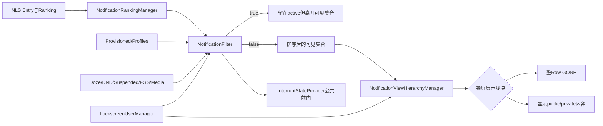
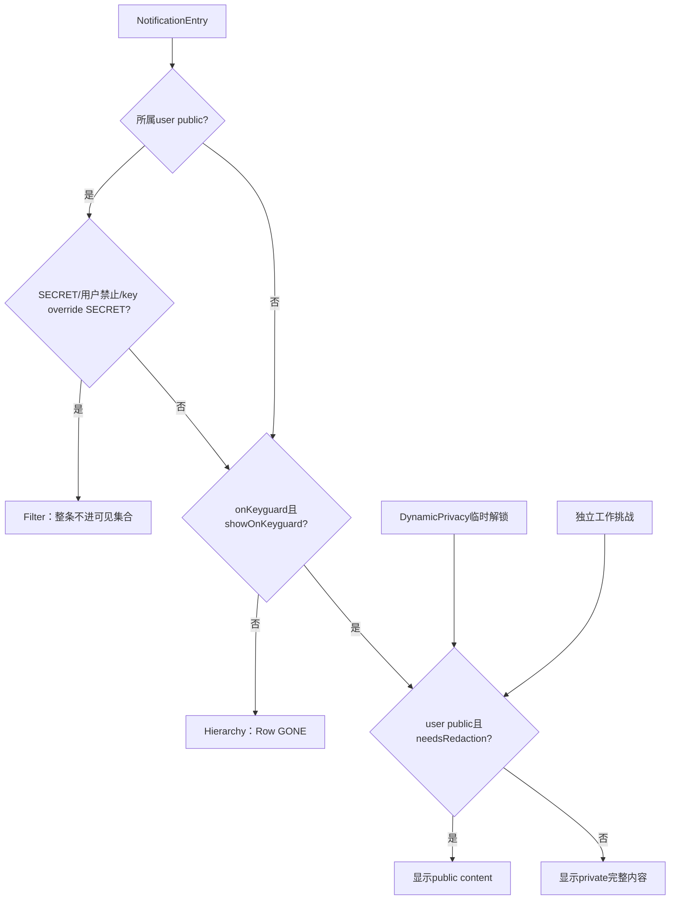
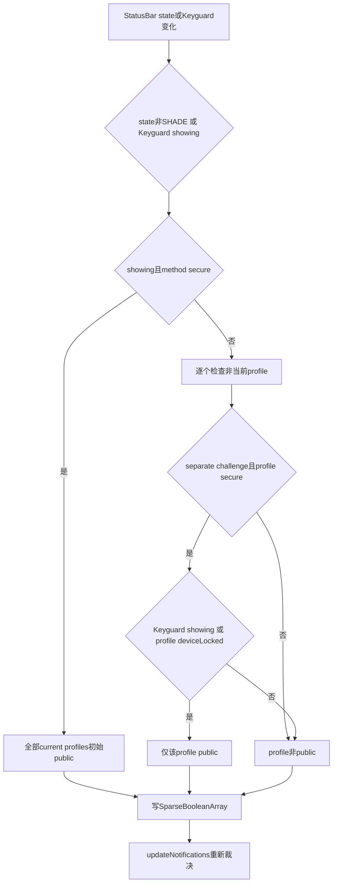

# 第 485 章 Android SystemUI NotificationFilter 与 NotificationLockscreenUserManager：统一过滤、用户切换、锁屏可见性和公开模式链

> 源码基线：Android 11 / API 30 / `android-11.0.0_r48`。本章只在 macOS 阅读，不实际编译。核心文件：`NotificationFilter.java`、`NotificationLockscreenUserManager.java`、`NotificationLockscreenUserManagerImpl.java`；交叉阅读 `NotificationRankingManager.kt`、`NotificationViewHierarchyManager.java`、`KeyguardEnvironmentImpl.java`、`KeyguardCoordinator.java` 及本地测试。

## 1. 本章解决什么问题

一条通知为什么会从列表中彻底消失、只在锁屏隐藏、仍显示但内容被遮住，或者在Doze与清醒状态得到不同结果？用户切换、工作资料单独上锁、DPM策略与Ranking visibility又怎样汇合？

## 2. 先分清三种“看不见”

`shouldFilterOut=true`表示Entry不进入当前排序可见集合；`shouldShowOnKeyguard=false`只在锁屏隐藏Row；`needsRedaction=true`表示进入公开模式时换成public content。三者作用层级不同。

## 3. NotificationFilter是旧管线公共前门

`NotificationRankingManager.filterAndSortLocked`对全部active Entry调用它；上一章的InterruptStateProvider也在`canAlertCommon`调用它。因此被过滤的通知通常既不进Shade列表，也没有HUN、pulse或Bubble资格。

## 4. 过滤不等于删除Entry

旧管线仍在`mActiveNotifications`保存原Entry，`mSortedAndFiltered`只保存当前可见子集。设置或状态变化后重新filter/sort，原Entry可以再次出现，不需要NotificationManager重新post。

## 5. 锁屏管理器是状态与政策聚合器

它缓存当前用户和profiles、各用户public mode、是否独立工作挑战、用户/DPM是否允许通知或私密内容，并监听设置、用户、DPM与状态栏状态变化。

## 6. public mode不是简单的“屏幕锁着”

当前设备需Keyguard显示且解锁方式secure；工作资料即使设备已解锁，只要启用独立挑战、资料本身secure且仍locked，也可单独处于public mode。

## 7. 整条隐藏与内容脱敏不同

`VISIBILITY_SECRET`或“完全不允许锁屏通知”会过滤整条；`VISIBILITY_PRIVATE`通常保留通知外壳但在public mode显示public version。误把PRIVATE当SECRET会错读用户看到的结果。

## 8. 当前用户与工作资料不完全对称

非当前但属于current profile的用户，`userAllowsNotificationsInPublic`直接返回true；是否整条隐藏还继承当前用户的禁止策略及自己的lockdown。私密内容脱敏则对managed profile优先使用资料自己的设置。

## 9. 旧管线与新管线并存

r48的`NotificationFilter`带TODO，计划由新NotifPipeline多个Coordinator替代；本章以旧管线真实执行链为主，并用`KeyguardCoordinator`说明迁移后职责如何拆开，不能把两套实现拼成一次执行。

## 10. 总体协作图



## 11. Filter的门序就是排障顺序

设备初始化→当前profiles→public mode安全隐藏→Doze/清醒DND视觉效果→suspended→FGS disclosure→system alert warning→media迁移。第一个返回true的门决定结果。

## 12. 未完成设备初始化时几乎全隐藏

`isDeviceProvisioned=false`时默认过滤。例外必须同时满足系统权限`NOTIFICATION_DURING_SETUP`和通知extra `EXTRA_ALLOW_DURING_SETUP=true`，二选一并不够。

## 13. setup许可检查按UID

调用`IPackageManager.checkUidPermission(permission, sbn.getUid())`，判断的是发布通知UID持有的权限，不是只看包名或notification channel。

## 14. PackageManager异常不fail-open

`RemoteException`被`rethrowFromSystemServer()`转成运行时异常；该帮助方法不会在Binder故障时把setup通知当作允许，也不会安静地返回false。

## 15. 当前profiles门怎样工作

`KeyguardEnvironmentImpl`取SBN userId后调用`NotificationLockscreenUserManager.isCurrentProfile`；当前用户、其profiles以及`USER_ALL`返回true，其他完整用户的通知被过滤。

## 16. 用户切换后为何旧通知能换集合

切换广播先更新`mCurrentUserId`和profiles缓存，再重新filter/sort；active集合中的Entry按新current profiles重新判断，所以可见集合改变而不必重收通知。

## 17. public mode外层条件很重要

Filter只有在“该通知所属user正处于public mode”时才检查SECRET、用户隐藏策略和key级visibility override。设备解锁且资料也解锁时，这组门完全跳过。

## 18. App声明SECRET会整条消失

`Notification.visibility == VISIBILITY_SECRET`在public mode直接过滤；不是只把标题或正文打码。解锁退出public mode后可重新进入可见集合。

## 19. userId级隐藏包含三种原因

一是该user public且不允许显示；二是非当前用户继承当前用户的隐藏；三是该user处于lockdown。表达式依赖`&&`优先于`||`，等价于三个原因的OR。

## 20. key级隐藏来自Ranking override

`shouldHideNotifications(key)`取未过滤active Entry；当前用户public且Ranking visibility override为SECRET时返回true。它表达系统或channel级覆盖，不是App原始visibility字段。

## 21. Doze检查ambient effect

若此刻`isDozing=true`且Ranking抑制ambient视觉效果，过滤。这里不看peek或notification-list suppress bit。

## 22. 清醒检查notification-list effect

若`isDozing=false`且Ranking抑制notification list，过滤。DND可以分别控制ambient、peek和list，三者不能互相替代。

## 23. isDozing被读取两次

源码没有保存一次快照：先读dozing判断ambient，再读一次判断list。若状态恰在两次读取间从false变true，两项检查都可能跳过；反向变化则可能先查ambient再查list。

## 24. suspended是Ranking状态

`entry.getRanking().isSuspended()`为true直接过滤，常见于包被系统暂停。它排在DND之后，但最终结果同样是不进入当前可见集合。

## 25. FGS disclosure按是否需要决定

SystemUI自身的前台服务汇总披露通知，如果`isDisclosureNeededForUser=false`就隐藏；不是所有前台服务通知都走这一门。

## 26. system alert warning只读第一个包

若识别为系统悬浮窗警告，从`EXTRA_FOREGROUND_APPS`取数组；非空时仅用`apps[0]`询问是否还需警告。数组后续包不会在这里逐个检查。

## 27. malformed system alert选择保留

extra为null或空数组时不进入“无需警告”过滤分支，通知继续显示。测试专门验证空数组不会被隐藏。

## 28. media过滤是迁移开关

构造时缓存`MediaFeatureFlag.getEnabled()`；开关为true且通知被识别为MediaStyle时，从普通通知列表过滤，让独立media controls承接。运行中不会由本类动态重读flag。

## 29. 两个遗留依赖没有参与判断

`mGroupManager`被初始化但`shouldFilterOut`未使用，`getShadeController()`也没有调用点。这是旧实现迁移中的残留，不能据字段存在推断group或shade门。

## 30. Filter真实源码

```java
public boolean shouldFilterOut(NotificationEntry entry) {
    final StatusBarNotification sbn = entry.getSbn();
    if (!(getEnvironment().isDeviceProvisioned()
            || showNotificationEvenIfUnprovisioned(sbn))) {
        return true;
    }

    if (!getEnvironment().isNotificationForCurrentProfiles(sbn)) {
        return true;
    }

    if (getUserManager().isLockscreenPublicMode(sbn.getUserId())
            && (sbn.getNotification().visibility == Notification.VISIBILITY_SECRET
                    || getUserManager().shouldHideNotifications(sbn.getUserId())
                    || getUserManager().shouldHideNotifications(sbn.getKey()))) {
        return true;
    }

    if (mStatusBarStateController.isDozing() && entry.shouldSuppressAmbient()) {
        return true;
    }

    if (!mStatusBarStateController.isDozing() && entry.shouldSuppressNotificationList()) {
        return true;
    }

    if (entry.getRanking().isSuspended()) {
        return true;
    }

    if (getFsc().isDisclosureNotification(sbn)
            && !getFsc().isDisclosureNeededForUser(sbn.getUserId())) {
        // this is a foreground-service disclosure for a user that does not need to show one
        return true;
    }
    if (getFsc().isSystemAlertNotification(sbn)) {
        final String[] apps = sbn.getNotification().extras.getStringArray(
                Notification.EXTRA_FOREGROUND_APPS);
        if (apps != null && apps.length >= 1) {
            if (!getFsc().isSystemAlertWarningNeeded(sbn.getUserId(), apps[0])) {
                return true;
            }
        }
    }

    if (mIsMediaFlagEnabled && isMediaNotification(sbn)) {
        return true;
    }
    return false;
}
```

这是r48完整连续方法；看到通知消失时，应按这段顺序寻找首个true，而不是从importance猜起。

## 31. Filter true还做了一个时间重置

`NotificationRankingManager.filter`发现true后调用`entry.resetInitializationTime()`；Entry以后重新出现时，初始化时间重新计算，避免把长期隐藏时间当作刚显示后的稳定期。

## 32. bucket在过滤之后仍为全部Entry计算

排序可见列表先生成，随后`entries.forEach`给全部输入Entry设置bucket。被过滤Entry也会更新bucket；它以后恢复可见时不必沿用旧分桶。

## 33. updateNotifications与reapply的差别

`reapplyFilterAndSort`只更新`mSortedAndFiltered`；`updateNotifications`先reapply，再在旧渲染管线启用时通知Presenter刷新View。用户切换会显式调用reapply，而若`updatePublicMode`先执行，内部已经触发过一次update。

## 34. public mode按userId缓存

`SparseBooleanArray mLockscreenPublicMode`为当前用户及每个profile分别保存状态。`USER_ALL`查询被映射到当前用户，避免为特殊userId建立独立锁屏状态。

## 35. show lockscreen notifications是当前用户总开关

`mShowLockscreenNotifications`由当前用户`LOCK_SCREEN_SHOW_NOTIFICATIONS`与当前用户DPM的`KEYGUARD_DISABLE_SECURE_NOTIFICATIONS`共同决定；任一禁止即false。

## 36. remote input在r48被硬关闭

常量`ENABLE_LOCK_SCREEN_ALLOW_REMOTE_INPUT=false`，因此不注册对应Secure setting observer，`mAllowLockscreenRemoteInput`总被设置false。不要只看到设置键就认为功能实际开放。

## 37. “允许整条”与“允许私密内容”是两份缓存

`mUsersAllowingNotifications`回答锁屏能否显示通知；`mUsersAllowingPrivateNotifications`回答能否显示完整私密内容。前者影响整条隐藏，后者影响redaction。

## 38. 用户允许也受管理员限制

允许整条需user setting、DPM未禁secure notifications、`KeyguardManager.getPrivateNotificationsAllowed()`三者都true；允许私密内容需private setting和DPM未禁unredacted notifications。

## 39. USER_ALL的私密许可特殊为true

`userAllowsPrivateNotificationsInPublic(USER_ALL)`直接true；但`needsRedaction`还会用当前用户设置约束非managed通知，所以USER_ALL通知并非天然永不脱敏。

## 40. profile整条许可的早返回

如果userId属于current profiles且不是当前用户，`userAllowsNotificationsInPublic`直接true，跳过该profile的user setting、DPM与system global判断。这与managed profile的私密内容许可明显不对称。

## 41. 非当前user继承当前用户隐藏

`shouldHideNotifications(otherUser)`递归调用当前用户版本。只要当前用户策略要求隐藏，工作资料或其他当前profile也整条隐藏，即使profile自己的整条许可早返回true。

## 42. lockdown是无条件临时隐藏

`KeyguardUpdateMonitor.isUserInLockdown(userId)`不依赖普通显示setting；当前user lockdown会通过继承项影响其他profile，profile自己的lockdown也可单独隐藏自己。

## 43. userId整条隐藏的真值表达

可写成`(该user公开且不允许) OR (非当前user且当前user应隐藏) OR 该user lockdown`。由于递归只转向current user，不会形成两个user互相递归。

## 44. key级override为何查未过滤Entry

如果只从可见集合取Entry，正要判断的通知可能已经不在集合中，形成鸡生蛋问题；因此调用`getActiveNotificationUnfiltered(key)`读取Ranking。

## 45. 锁屏三个问题的决策图



## 46. shouldShowOnKeyguard不判断当前是否在锁屏

它只计算“如果需要画在Keyguard，是否达到门槛”；真正的`onKeyguard`条件在ViewHierarchyManager使用处判断。Shade代码也可能调用它做预测或旁路策略。

## 47. 第一门仍是总开关

最终返回`mShowLockscreenNotifications && exceedsPriorityThreshold`。即使Entry很重要，只要用户或DPM关闭锁屏通知就false。

## 48. 新interruption model下怎样藏silent

仅当新模型启用且`LOCK_SCREEN_SHOW_SILENT_NOTIFICATIONS=0`时，使用bucket与importance组合门；否则走旧ambient标志。

## 49. Media bucket总能越过silent门

`BUCKET_MEDIA_CONTROLS`直接满足阈值，即使importance低；这是独立媒体控件在锁屏的明确例外。

## 50. Silent bucket必定失败

非media且`BUCKET_SILENT`时，第二项明确排除；仅把importance调到DEFAULT也不能在bucket仍为SILENT时通过。

## 51. 非Silent还需DEFAULT importance

People或Alerting等非silent bucket不会自动通过，还要`importance >= IMPORTANCE_DEFAULT`。本地测试专门验证LOW的People bucket仍被隐藏。

## 52. 旧模型只看ambient

不启用“新模型+隐藏silent”组合时，门槛是`!ranking.isAmbient()`；此时bucket和importance不直接参与本方法。

## 53. group child有summary补救

ViewHierarchyManager若child自身`shouldShowOnKeyguard=false`，但它的逻辑summary通过，则把child的showOnKeyguard改为true。组摘要可提升低优先级child在锁屏的可见性。

## 54. suppressed summary仍优先GONE

Hierarchy最终还检查`isSummaryOfSuppressedGroup`；即使showOnKeyguard为true，被抑制摘要仍隐藏。锁屏优先级门不是group结构门的替代品。

## 55. Shade也可能隐藏单独上锁的工作资料

最终条件中`shouldHideNotifications(userId)`没有被`onKeyguard`包围。若设备在Shade但工作资料public/lockdown，资料通知仍可整Row GONE；这正是工作挑战隔离需要的效果。

## 56. show与hide不是逻辑取反

`shouldShowOnKeyguard`处理总开关和优先级；`shouldHideNotifications`处理public许可与lockdown。某Entry可能前者true而后者也true，最终hide优先。

## 57. key隐藏只看当前用户public

外层Filter要求通知user public，但`shouldHideNotifications(key)`内部检查的是`mCurrentUserId` public。设备已解锁、仅独立工作资料public时，工作Entry的Ranking SECRET override不会通过key门；这是r48静态可见的不对称。

## 58. hide与show真实源码

```java
public boolean shouldHideNotifications(int userId) {
    return isLockscreenPublicMode(userId) && !userAllowsNotificationsInPublic(userId)
            || (userId != mCurrentUserId && shouldHideNotifications(mCurrentUserId))
            || shouldTemporarilyHideNotifications(userId);
}

/**
 * Returns true if we're on a secure lockscreen and the user wants to hide notifications via
 * package-specific override.
 */
public boolean shouldHideNotifications(String key) {
    if (getEntryManager() == null) {
        Log.wtf(TAG, "mEntryManager was null!", new Throwable());
        return true;
    }
    NotificationEntry visibleEntry = getEntryManager().getActiveNotificationUnfiltered(key);
    return isLockscreenPublicMode(mCurrentUserId) && visibleEntry != null
            && visibleEntry.getRanking().getVisibilityOverride() == VISIBILITY_SECRET;
}

public boolean shouldShowOnKeyguard(NotificationEntry entry) {
    if (getEntryManager() == null) {
        Log.wtf(TAG, "mEntryManager was null!", new Throwable());
        return false;
    }
    boolean exceedsPriorityThreshold;
    if (NotificationUtils.useNewInterruptionModel(mContext)
            && hideSilentNotificationsOnLockscreen()) {
        exceedsPriorityThreshold =
                entry.getBucket() == BUCKET_MEDIA_CONTROLS
                        || (entry.getBucket() != BUCKET_SILENT
                        && entry.getImportance() >= NotificationManager.IMPORTANCE_DEFAULT);
    } else {
        exceedsPriorityThreshold = !entry.getRanking().isAmbient();
    }
    return mShowLockscreenNotifications && exceedsPriorityThreshold;
}
```

这段连续源码同时证明“整条安全隐藏”和“锁屏优先级展示”是两个独立答案。

## 59. getEntryManager的null防守很保守

getter会从Dependency懒取；若仍为null，hide(key)选择true，showOnKeyguard选择false，都是偏安全的fail-closed，并打印wtf。

## 60. priority使用当前Entry bucket

bucket由RankingManager根据HUN、media、system max、conversation和high priority等计算；锁屏管理器不在这里重新推导分桶，调用时序必须保证bucket已更新。

## 61. Redaction回答“内容要不要换壳”

`needsRedaction`本身不检查当前是否public；它回答Entry的敏感政策。ViewHierarchyManager再用`userPublic && needsRedaction`算真正`sensitive`。

## 62. App必须请求PRIVATE才受普通脱敏设置

App原始visibility为PRIVATE且用户策略要求redact，才走普通脱敏。PUBLIC通知不因用户关闭“显示敏感内容”自动变PRIVATE。

## 63. Ranking PRIVATE override会强制脱敏

`packageHasVisibilityOverride`看到Ranking override为PRIVATE就直接让`needsRedaction=true`，不要求App原始visibility也为PRIVATE。

## 64. 强制脱敏仍由public状态控制实际敏感

即使`needsRedaction=true`，设备/资料不public时`sensitive=false`，完整内容仍可展示。needsRedaction是政策属性，不是当前画面状态。

## 65. 当前用户设置覆盖普通secondary profile

对非managed profile，`isNotifRedacted`包含当前用户“不允许私密内容”；因此secondary profile自己允许，也可能被当前用户策略压住。

## 66. Managed profile用自己的私密设置

若Entry属于`mCurrentManagedProfiles`，当前用户redaction项被跳过，仅看managed profile自己的private setting/DPM。工作资料可以比个人空间更严格或更宽松。

## 67. managed判断依赖profile缓存

使用`mCurrentManagedProfiles.contains(userId)`而不是每次Binder查询UserManager。profiles事件尚未刷新或缓存遗漏时，同一Entry可能暂按非managed规则计算。

## 68. USER_ALL怎样脱敏

USER_ALL不属于managed，且其自身private许可被特殊视为true；所以最终主要继承当前用户的private policy，符合“全用户系统通知随当前屏幕所有者”模型。

## 69. public/private content由Row预先准备

`NotificationRowBinderImpl`设置row needsRedaction，Hierarchy再更新Entry sensitive；真正切换时依赖通知已inflate的公开版本。管理器只给政策答案，不创建RemoteViews。

## 70. Redaction真实源码

```java
public boolean needsRedaction(NotificationEntry ent) {
    int userId = ent.getSbn().getUserId();

    boolean isCurrentUserRedactingNotifs =
            !userAllowsPrivateNotificationsInPublic(mCurrentUserId);
    boolean isNotifForManagedProfile = mCurrentManagedProfiles.contains(userId);
    boolean isNotifUserRedacted = !userAllowsPrivateNotificationsInPublic(userId);

    // redact notifications if the current user is redacting notifications; however if the
    // notification is associated with a managed profile, we rely on the managed profile
    // setting to determine whether to redact it
    boolean isNotifRedacted = (!isNotifForManagedProfile && isCurrentUserRedactingNotifs)
            || isNotifUserRedacted;

    boolean notificationRequestsRedaction =
            ent.getSbn().getNotification().visibility == Notification.VISIBILITY_PRIVATE;
    boolean userForcesRedaction = packageHasVisibilityOverride(ent.getSbn().getKey());

    return userForcesRedaction || notificationRequestsRedaction && isNotifRedacted;
}

private boolean packageHasVisibilityOverride(String key) {
    if (getEntryManager() == null) {
        Log.wtf(TAG, "mEntryManager was null!", new Throwable());
        return true;
    }
    NotificationEntry entry = getEntryManager().getActiveNotificationUnfiltered(key);
    return entry != null
            && entry.getRanking().getVisibilityOverride() == Notification.VISIBILITY_PRIVATE;
}
```

注意最后表达式中`&&`先结合：override强制项与“App请求PRIVATE且策略需脱敏”两条路径是OR。

## 71. Dynamic Privacy可以临时解除个人空间public

Hierarchy发现动态解锁，且Entry属于当前用户、USER_ALL或不需独立工作挑战时，把`userPublic`暂改false；于是即使needsRedaction为true也显示完整内容。

## 72. 独立工作挑战阻止动态解锁穿透

工作资料若`needsSeparateWorkChallenge=true`，个人空间的动态解锁不能清掉其public状态；必须完成资料自己的challenge。

## 73. deviceSensitive与entry sensitive不同

`deviceSensitive`只看设备public且当前用户不允许私密通知；`sensitive`还考虑通知user、工作挑战和Entry具体redaction。两个布尔被同时写入Entry供不同UI用途使用。

## 74. public mode输入之一是StatusBar state

`mState != SHADE`时直接把Keyguard视为showing；SHADE时仍问`KeyguardStateController.isShowing()`，覆盖从锁屏打开相机但state看似SHADE的场景。

## 75. devicePublic还要求secure method

Keyguard显示但没有PIN、图案、密码等secure method时，`devicePublic=false`。普通无安全锁屏不触发个人通知的public隐私保护。

## 76. 每个profile先继承devicePublic

循环初值`isProfilePublic=devicePublic`；设备安全锁屏时，当前用户和所有current profiles一起public，然后再记录各自独立挑战标志。

## 77. 独立工作资料可单独public

devicePublic=false时，非当前profile若启用separate challenge且自身secure，则由`showingKeyguard || isDeviceLocked(userId)`决定public。

## 78. showingKeyguard优先规避异步竞态

源码注释说明`KeyguardManager.isDeviceLocked`更新异步；Keyguard仍显示时直接假设独立挑战profile锁着，避免短暂泄露完整工作内容。

## 79. needsSeparateChallenge不等于public

每轮都缓存`isSeparateProfileChallengeEnabled`，但profile还要secure，并在device不public时看Keyguard显示/资料locked才变public。启用独立挑战只是条件之一。

## 80. 当前profile集合来自UserManager

`updateCurrentProfilesCache`清空两张SparseArray，遍历`UserManager.getProfiles(currentUserId)`；userType等于`USER_TYPE_PROFILE_MANAGED`才进入managed子集。

## 81. profile变化触发哪些事件

用户切换、用户添加、managed profile available/unavailable都会刷新；本类未注册`ACTION_USER_REMOVED`，完整secondary user删除若没有其他相关事件，旧public-mode key可暂留在缓存。

## 82. public mode状态机



## 83. public mode数组不会整体clear

`updatePublicMode`逐个覆盖当前profiles，却不清`mLockscreenPublicMode`；离开当前集合的userId旧值可继续存在。`isAnyProfilePublicMode`只遍历当前集合，所以常用途径不会把旧值算进去，但直接按旧id查询可能读到陈旧状态。

## 84. separate challenge数组每轮会clear

与public数组不同，`mUsersWithSeperateWorkChallenge.clear()`后再填当前profiles，因此离开的profile不会保留旧challenge标志。

## 85. 每次updatePublicMode都刷新通知

代码没有比较新旧数组是否变化，循环结束无条件`updateNotifications`。频繁state callback即使结果相同也可能重新filter/sort和更新旧管线View。

## 86. updatePublicMode有同步Binder读取

`LockPatternUtils`调用包在`whitelistIpcs`，`isSecure`、`KeyguardManager.isDeviceLocked`也可能跨system_server；这些读取发生在SystemUI更新公开模式的调用线程。

## 87. state监听在构造时就注册

构造器立刻`statusBarStateController.addCallback(this)`，而Presenter、observers和profile cache要等`setUpWithPresenter`。若过早收到state callback，`updatePublicMode`可能懒取EntryManager并刷新尚在初始化的通知管线。

## 88. public mode真实源码

```java
public void updatePublicMode() {
    //TODO: I think there may be a race condition where mKeyguardViewManager.isShowing() returns
    // false when it should be true. Therefore, if we are not on the SHADE, don't even bother
    // asking if the keyguard is showing. We still need to check it though because showing the
    // camera on the keyguard has a state of SHADE but the keyguard is still showing.
    final boolean showingKeyguard = mState != StatusBarState.SHADE
            || mKeyguardStateController.isShowing();
    final boolean devicePublic = showingKeyguard && mKeyguardStateController.isMethodSecure();


    // Look for public mode users. Users are considered public in either case of:
    //   - device keyguard is shown in secure mode;
    //   - profile is locked with a work challenge.
    SparseArray<UserInfo> currentProfiles = getCurrentProfiles();
    mUsersWithSeperateWorkChallenge.clear();
    for (int i = currentProfiles.size() - 1; i >= 0; i--) {
        final int userId = currentProfiles.valueAt(i).id;
        boolean isProfilePublic = devicePublic;
        // TODO(b/140058091)
        boolean needsSeparateChallenge = whitelistIpcs(() ->
                mLockPatternUtils.isSeparateProfileChallengeEnabled(userId));
        if (!devicePublic && userId != getCurrentUserId()
                && needsSeparateChallenge && mLockPatternUtils.isSecure(userId)) {
            // Keyguard.isDeviceLocked is updated asynchronously, assume that all profiles
            // with separate challenge are locked when keyguard is visible to avoid race.
            isProfilePublic = showingKeyguard || mKeyguardManager.isDeviceLocked(userId);
        }
        setLockscreenPublicMode(isProfilePublic, userId);
        mUsersWithSeperateWorkChallenge.put(userId, needsSeparateChallenge);
    }
    getEntryManager().updateNotifications("NotificationLockscreenUserManager.updatePublicMode");
}
```

连续方法表明它是“重新计算缓存并主动刷新”的动作，而不是只读getter。

## 89. status变化与Keyguard showing变化不是同一监听

本类实现`StatusBarStateController.StateListener`只在state变化调用updatePublicMode；Keyguard状态控制器没有在本类直接注册Callback，实际其他StatusBar协作代码还会在锁屏状态边沿触发更新，排障要确认调用来源。

## 90. 新管线KeyguardCoordinator采用另一套过滤

它仅在Keyguard showing时作为FinalizeFilter工作，显式检查总开关、当前/通知user lockdown、两边public许可、Ranking SECRET与组优先级，并监听设置/Keyguard状态后invalidate list。它是迁移替代，不应与旧Filter+Hierarchy当作串行双重门。

## 91. setUpWithPresenter完成真正初始化

它保存Presenter、建立两个ContentObserver、注册DPM/用户/工作挑战Receiver、加载profiles，再手动调用`mSettingsObserver.onChange(false)`初始化锁屏设置。构造完成不等于管理器已经可正常工作。

## 92. lockscreen observer清两类许可缓存

SHOW_NOTIFICATIONS或ALLOW_PRIVATE变化时，因回调不知道具体哪个user改变，直接清`mUsersAllowingPrivateNotifications`和`mUsersAllowingNotifications`，重算当前总开关并更新全部通知。

## 93. settings observer也监听Zen

它监听Global ZEN_MODE，以及功能开启时的remote-input setting；回调先更新锁屏设置，仅在设备provisioned时刷新通知。r48 remote input功能关闭，所以实际主要由ZEN变化触发。

## 94. DPM receiver的缓存失效不完整

当前profile发来DPM state change时只清`mUsersAllowingPrivateNotifications`，没有清`mUsersAllowingNotifications`；后者缓存也依赖DPM secure-notification flag。若已有当前用户缓存，单看本类可能读到旧“允许整条”结果，直到其他事件清缓存。

## 95. 用户切换的执行顺序

写current user→刷新profiles→重读设置→updatePublicMode并刷新通知→再次reapply filter/sort→Presenter回调→UserChangedListener回调。这里至少存在两次重新裁决机会，顺序是为了Presenter看到新用户集合。

## 96. profile可用性变化只刷新缓存

USER_ADDED、MANAGED_PROFILE_AVAILABLE/UNAVAILABLE只调用`updateCurrentProfilesCache`，本分支不直接updatePublicMode或updateNotifications。后续系统状态/通知更新会收敛，但存在事件间窗口。

## 97. profiles listener异步收到共享对象

缓存更新后向main Handler post，再把内部`mCurrentProfiles`同一对象传给监听者；不是不可变快照。若下一次更新先发生，listener可能看到较新的内容而非post时内容。

## 98. getCurrentProfiles暴露内部SparseArray

getter直接返回成员，没有复制也没有要求调用方持有`mLock`。约定调用方只读；若外部修改，会破坏管理器缓存不变量。

## 99. listener列表没有快照或同步

add/remove直接操作ArrayList，通知时直接for-each。若listener在回调中移除自己，理论上可能触发迭代修改问题；实现依赖主线程和使用约定规避。

## 100. 工作挑战解锁广播还记点击

内部受`PERMISSION_SELF`保护的广播先尝试发送原IntentSender，再按notification key取未过滤Entry、构造NotificationVisibility并通知click。即使IntentSender发送异常被忽略，后续点击记账仍会执行。

## 101. Filter测试有11项

覆盖setup权限+extra三种组合、system alert需要/不需要/空extra、suspended，以及media flag开关对普通与media通知的四种组合。

## 102. Filter测试的明显空白

没有覆盖current profiles、public mode、App SECRET、Ranking SECRET、Doze两次读取、ambient/list suppression、FGS disclosure、RemoteException和第一个foreground app之外的数组元素。

## 103. Lockscreen manager测试有21项

主要覆盖show/private settings、个人/secondary/work redaction矩阵、observer刷新、用户切换Presenter回调、手工public mode，以及silent/people/media bucket四种场景。

## 104. 两个redaction测试名写反了语义

`testCurrentUserPrivateNotificationsNotRedacted`在“不允许private”时断言`needsRedaction=true`；`testCurrentUserPrivateNotificationsRedacted`在“允许private”时断言false。注释和断言正确，方法名的Not位置容易误导阅读者。

## 105. Lockscreen测试未证明的关键分支

没有直接覆盖`updatePublicMode`设备/工作挑战矩阵、lockdown、userAllowsNotifications早返回、DPM三方许可、USER_ALL、stale public key、重复setup、profile callback共享对象、工作挑战广播及DPM整条许可缓存失效。

## 106. 复读发现一：Doze不是单一快照

最初容易把Filter画成稳定二选一；逐行复读发现`isDozing()`调用两次。排查状态边沿偶现漏过滤时，要记录两次读取而非只记录方法入口状态。

## 107. 复读发现二：工作资料的hide与redact不对称

整条显示许可对current profile非当前user直接true，再继承当前用户隐藏；私密内容则managed profile优先自己的设置。必须分别列真值表，不能用“工作资料遵循自己设置”一句概括。

## 108. 复读发现三：两类缓存的clear不对称

锁屏setting observer清整条+private两类，DPM receiver只清private；public-mode数组不clear而separate-challenge数组clear。诊断陈旧结果要先确认是哪一张SparseBooleanArray。

## 109. 一套通知消失诊断顺序

先查Entry是否仍在active unfiltered；再按Filter门序查provision/profile/public/DND/suspended/FGS/media；若仍在sorted list，再查Hierarchy的suppressed summary、shouldHide和onKeyguard priority。

## 110. 一套隐私内容诊断顺序

记录current user、notif user、managed与separate challenge、两者public、dynamic unlocked、App visibility、Ranking override、private setting和DPM；最终区分`needsRedaction`与真正`sensitive`。

## 111. 本章线程、进程与记忆口诀

这些类都在SystemUI进程；ContentObserver使用main Handler，状态与多数通知回调通常在主线程，UserManager/DPM/Keyguard/Settings读取可能跨Binder。口诀：“先过滤集合，再裁锁屏Row，最后裁内容；SECRET整条藏，PRIVATE换公版；个人管普通profile，工作资料管自己的private。”

## 112. macOS只读练习一：手算Filter门序

从本地源码抄出九组门，为“未provision但有权限无extra”“Doze suppressAmbient”“清醒suppressList”“suspended media”各推演首个返回true的位置，并说明后门是否还执行。

## 113. macOS只读练习二：画多用户隐私真值表

组合current/secondary/managed/USER_ALL、device public、work public、current private setting、profile private setting与lockdown，分别计算整条hide、showOnKeyguard和needsRedaction，至少写十二行。

## 114. macOS只读练习三：推演用户切换时序

按Receiver源码列出current id、profiles、settings、public mode、sorted list、Presenter和listener的变化顺序；标出updatePublicMode与显式reapply造成的两次重新排序。

## 115. macOS只读练习四：审计32项测试

把Filter 11项和Lockscreen 21项逐一映射到门；再列至少十个未覆盖点，重点检查Doze双读、DPM缓存、work challenge、lockdown、USER_ALL、stale key和listener共享对象。

## 116. 易错理解一：被Filter就是通知被系统删除

错误。旧管线active unfiltered通常仍保留Entry，只是当前`mSortedAndFiltered`没有它；政策变化后重新filter即可恢复。

## 117. 易错理解二：needsRedaction为true就一直显示公版

错误。它只是内容敏感政策；还要user/device处于public且没有Dynamic Privacy有效解锁，Hierarchy才把Entry设为sensitive。

## 118. 易错理解三：工作资料所有锁屏策略都只看自己

错误。managed profile的private redaction优先自身设置，但整条hide还继承当前用户禁令；`userAllowsNotificationsInPublic`甚至对current profile非当前user直接true。

## 119. 复读后的最终心智模型

把active Entry当库存，把Filter当库存到可见集合的闸门，把LockscreenUserManager当多用户安全状态缓存，把Hierarchy当当前画面裁决器。一次“看不见”必须定位在库存、集合、Row或content四层中的哪一层。

## 120. 本章结论与下一章

r48旧通知管线以NotificationFilter统一收口provision/profile/public/DND/suspended/FGS/media，再由LockscreenUserManager和Hierarchy分别裁决整Row与内容脱敏；复读确认Doze双读、profile策略不对称、public缓存旧key、DPM许可缓存失效不完整及测试命名误导等边界。下一章继续研究NotificationRankingManager、RankingComparator、HighPriorityProvider与bucket/section排序链。
