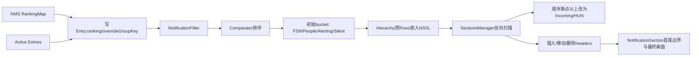
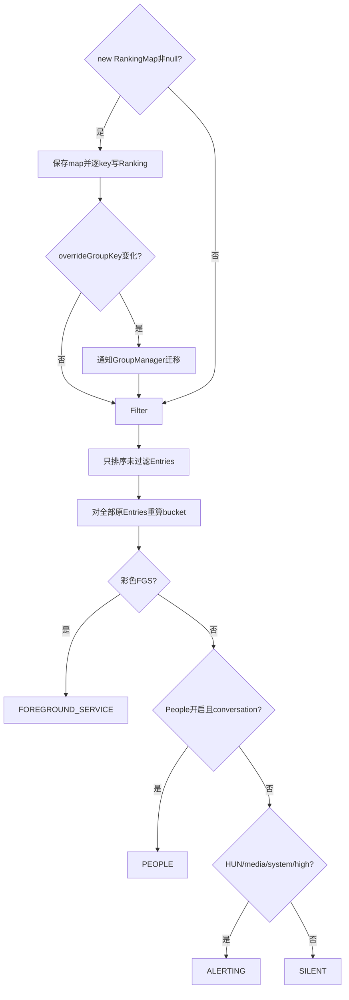
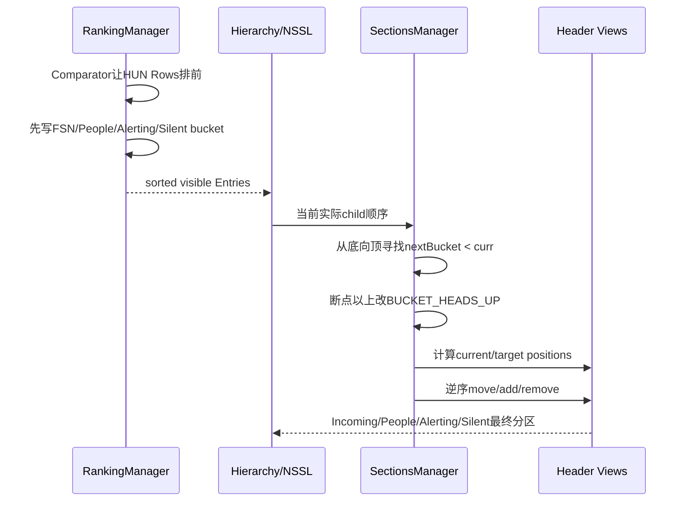

# 第 486 章 Android SystemUI NotificationRankingManager、HighPriorityProvider 与 NotificationSectionsManager：排序、分桶和分区链

> 源码基线：Android 11 / API 30 / `android-11.0.0_r48`。本章只在 macOS 阅读，不实际编译。核心文件：`NotificationRankingManager.kt`、`HighPriorityProvider.java`、`NotificationSectionsFeatureManager.kt`、`NotificationSectionsManager.kt`；交叉阅读四个本地测试文件。

## 1. 本章解决什么问题

NMS已经给了rank，SystemUI为什么还要重排？Heads-up、彩色前台服务、会话、当前媒体、系统通知和“高优先级”谁在谁前？Entry bucket又怎样变成Shade里的Incoming、People、Alerting、Silent区域？

## 2. 一句话主线

RankingManager先把RankingMap写回Entry，再过滤、按本地Comparator排序并给初始bucket；HighPriorityProvider提供可递归的“高优先级”语义；SectionsManager读取实际View顺序，修正Incoming bucket并移动section header。

## 3. 排序、bucket、header是三件事

Comparator回答两个Entry谁在前；bucket给Entry一个类别；header是NSSL中的独立DecorView。排序相同不保证bucket相同，bucket变化也不自动等于header已经移动。

## 4. RankingManager不持有Entry集合

类只保存最新`RankingMap`，输入一组entries后返回新排序List；active/pending生命周期属于EntryManager/NotifCollection。

## 5. Ranking来自system_server

NotificationListenerService接收NMS RankingMap后进入SystemUI；`updateRankingForEntries`为每个key取新Ranking，写入Entry并同步overrideGroupKey变化。

## 6. SystemUI本地排序不是推翻NMS

本地比较器先插入HUN、FSN、People、Media、System和HighPriority政策，只有这些层都相同才回退NMS rank，再以notification.when兜底。

## 7. HighPriority不是importance别名

importance达到DEFAULT直接true；importance较低时，只要用户没有手工锁定importance，前台服务、media session、people或MessagingStyle仍可能提升；group还可被child提升。

## 8. 初始bucket没有HEADS_UP

RankingManager只返回FOREGROUND_SERVICE、PEOPLE、ALERTING、SILENT四类。HUN Entry先落到ALERTING或更早匹配的FSN/PEOPLE，之后SectionsManager按实际顺序断点改成HEADS_UP。

## 9. MEDIA_CONTROLS也不是通知Entry初始bucket

当前media notification会被Comparator上排并进入ALERTING；`BUCKET_MEDIA_CONTROLS`主要标记独立`MediaHeaderView`。不要把媒体通知Row与媒体控制面板当同一个对象。

## 10. 三阶段总图



## 11. Comparator固定优先级顺序

HUN→HUN内部Manager顺序→彩色FGS→People类型→当前media→系统HIGH→HighPriority→NMS rank→`when`新到旧。每一层只在前面完全打平时执行。

## 12. HUN绝对先于非HUN

只要`isRowHeadsUp`不同，HUN返回-1。即使另一条是重要会话、彩色FGS或NMS rank=0，也排在HUN之后。

## 13. 两条HUN交给HeadsUpManager

两边都是HUN时直接`headsUpManager.compare(a,b)`，后续FSN/People/rank全部跳过，保证Shade顶部顺序与Heads-up生命周期管理器一致。

## 14. Row不存在时isRowHeadsUp为false

HUN排序依赖Entry的Row展示状态，不只看Provider资格。尚未inflate或尚未Manager show的Entry不会因“将来可能HUN”提前排序。

## 15. Colorized FGS排在非HUN首位

要求Notification同时foreground service、colorized且importance大于MIN。普通FGS、未着色FGS或MIN彩色FGS不走该专门层。

## 16. People层受feature开关门控

比较器总会先计算两边person type，但只有`usePeopleFiltering=true`且类型不同才调用PeopleIdentifier比较。关闭feature后person type不会改变顺序。

## 17. People类型顺序由Identifier定义

Comparator不假定枚举数值方向，委托`peopleNotificationIdentifier.compareTo`；重要会话、完整联系人、普通person的语义集中在People组件。

## 18. 当前media必须匹配唯一key

`entry.key == mediaManager.mediaNotificationKey`且importance大于MIN才是important media。仅有MediaStyle或media session不等于当前正在播放的media key。

## 19. SystemMax名字比实际门更强

帮助方法要求importance至少HIGH，包名为`android`或`com.android.systemui`；并非严格检查`IMPORTANCE_MAX`。源码注释“PRIORITY_MAX”是历史命名，按代码应理解为system HIGH+。

## 20. HighPriority在system/media之后

它能把DEFAULT或有特殊特征的通知排在普通low之前，但不能越过HUN、彩色FGS、开启的People层、当前media或system HIGH层。

## 21. NMS rank越小越靠前

比较器用`aRank - bRank`；在正常非负小范围rank下，小值返回负数。理论上极端int存在减法溢出，但NMS排名域通常远小于该范围。

## 22. 最后按when倒序

rank也相等时执行`nb.when.compareTo(na.when)`，时间大的新通知靠前。两者when也相等时Comparator返回0，输入排序稳定性决定相对顺序。

## 23. 每次比较会重复计算派生属性

People类型、high priority、media和system状态不是先为整表缓存；排序过程中同一Entry可能被多次计算。HighPriority又可能递归group child，复杂group会增加判断次数。

## 24. feature getter在比较中读取

`usePeopleFiltering`是getter，每次需要该层时问FeatureManager；底层people开关又由进程级静态cache稳定住，通常不会在一次sort中变化。

## 25. 比较器只定义局部顺序

它不写bucket、不移动View、不创建headers；看到Comparator返回-1只能证明排序List位置，不等于画面已动画到目标。

## 26. FGS与People同时成立时谁赢

HUN之后先比较彩色FGS，因此彩色FGS在People前；而同一Entry分bucket时也先匹配FOREGROUND_SERVICE，再匹配PEOPLE，两个阶段保持一致。

## 27. People与当前media同时成立时谁赢

People feature开启时先比较person type，并且分bucket先匹配PEOPLE；因此会话型当前media仍可属于People。关闭People feature后media层才主导上排。

## 28. HUN conversation的初始bucket

bucket的when顺序先People再`isHeadsUp`；因此People开启时HUN会话初始仍是PEOPLE，而非ALERTING。最终Incoming修正发生在SectionsManager。

## 29. HUN彩色FGS的初始bucket

FOREGROUND_SERVICE是bucket第一门，所以HUN彩色FGS初始仍为FSN。比较器把它放到顶部，SectionsManager再从顺序断点识别Incoming区。

## 30. Comparator真实源码

```kotlin
private val rankingComparator: Comparator<NotificationEntry> = Comparator { a, b ->
    val na = a.sbn
    val nb = b.sbn
    val aRank = a.ranking.rank
    val bRank = b.ranking.rank

    val aIsFsn = a.isColorizedForegroundService()
    val bIsFsn = b.isColorizedForegroundService()

    val aPersonType = a.getPeopleNotificationType()
    val bPersonType = b.getPeopleNotificationType()

    val aMedia = a.isImportantMedia()
    val bMedia = b.isImportantMedia()

    val aSystemMax = a.isSystemMax()
    val bSystemMax = b.isSystemMax()

    val aHeadsUp = a.isRowHeadsUp
    val bHeadsUp = b.isRowHeadsUp

    val aIsHighPriority = a.isHighPriority()
    val bIsHighPriority = b.isHighPriority()
    when {
        aHeadsUp != bHeadsUp -> if (aHeadsUp) -1 else 1
        // Provide consistent ranking with headsUpManager
        aHeadsUp -> headsUpManager.compare(a, b)
        aIsFsn != bIsFsn -> if (aIsFsn) -1 else 1
        usePeopleFiltering && aPersonType != bPersonType ->
            peopleNotificationIdentifier.compareTo(aPersonType, bPersonType)
        // Upsort current media notification.
        aMedia != bMedia -> if (aMedia) -1 else 1
        // Upsort PRIORITY_MAX system notifications
        aSystemMax != bSystemMax -> if (aSystemMax) -1 else 1
        aIsHighPriority != bIsHighPriority ->
            -1 * aIsHighPriority.compareTo(bIsHighPriority)
        aRank != bRank -> aRank - bRank
        else -> nb.notification.`when`.compareTo(na.notification.`when`)
    }
}
```

这段连续源码应作为手工排序题的唯一优先级表。

## 31. newRankingMap为null的语义

不更新保存的map，也不写Entry ranking，但仍用Entry现有Ranking完成filter/sort/bucket。null不是“清空Ranking”。

## 32. 非null map先整体替换

`rankingMap = newRankingMap`后遍历entries。某key若`getRanking`失败，Entry保留旧Ranking；没有创建默认Ranking覆盖它。

## 33. Ranking写入还可能改group

新`overrideGroupKey`与SBN当前值不同，先保存old groupKey/isGroup/isSummary，写新override，再调用GroupManager `onEntryUpdated`完成逻辑分组迁移。

## 34. group回调发生在entries监视器内

`updateRankingForEntries`使用`synchronized(entries)`，锁的是调用方传入Collection对象；GroupManager回调也在锁内。它依赖调用者和主线程约定，并非每个Entry独立锁。

## 35. synchronized(this)只包filter/sort

RankingMap赋值与Entry写回在进入` synchronized(this)`之前；这个锁不能单独保证整个updateRanking原子。生产主要依赖SystemUI通知主线串行。

## 36. 过滤发生在排序之前

上一章NotificationFilter返回true的Entry不进入结果List，并重置initialization time；Comparator不会为它与可见Entry比较。

## 37. bucket却为被过滤Entry也计算

`entries.forEach`遍历原输入而不是filtered结果。因此暂时隐藏的Entry也获得最新bucket，未来恢复时状态更接近当前Ranking。

## 38. bucket门序只有四种输出

彩色FGS→People conversation→HUN/current media/system HIGH/highPriority共同进入ALERTING→其余SILENT。UNKNOWN、MEDIA_CONTROLS和HEADS_UP不由此方法返回。

## 39. Conversation判断不等于MessagingStyle

它看PeopleIdentifier类型是否非NON_PERSON；MessagingStyle只是HighPriority特征之一。消息样式可能进ALERTING但不进PEOPLE bucket。

## 40. 普通FGS怎样分桶

未colorized的FGS若importance至少LOW且用户未手调importance，可经HighPriority进入ALERTING；只有满足colorized FGS专门条件才进入FOREGROUND_SERVICE bucket。

## 41. MIN彩色FGS怎样分桶

专门门要求`importance > MIN`，HighPriority的important ongoing要求至少LOW；所以MIN通常落SILENT，除非还有people/media-session/messaging等未被用户importance锁住的特征。

## 42. current media的阈值

必须importance大于MIN；MIN当前media不会仅靠“当前播放key”进入ALERTING，但若Notification有media session且importance未被用户锁定，HighPriority仍可能把它提升。

## 43. 系统通知门只认两个包

`android`与`com.android.systemui`且importance>=HIGH；其他特权包不会因“也是系统应用”自动命中该帮助方法。

## 44. bucket数值同时服务视觉边界

常量UNKNOWN0、MEDIA1、HEADS_UP2、FGS3、PEOPLE4、ALERTING5、SILENT6。对通知Row，数值越小通常越靠前，SectionsManager用`next < curr`检测顺序逆转。

## 45. Ranking更新与分桶图



## 46. bucket在sorted list生成后才写

Comparator中的`isHighPriority`等直接计算，不依赖本次新bucket；排序完成后才给Entry赋bucket，避免Comparator读到一半更新的bucket。

## 47. Filter会重置初始化但bucket仍随后写入

被过滤Entry先reset initialization，随后原entries forEach仍调用setter；两种副作用都发生，不能把filterNot误读成后面完全不再处理。

## 48. overrideGroupKey更新可能改变后续排序上下文

GroupManager同步收到迁移，HeadsUp isolation/summary关系可能变化；但当前Comparator主要看Entry自身属性。View hierarchy重组在后续刷新阶段完成。

## 49. reason只用于日志

`logger.logFilterAndSort(reason)`记录触发原因，不参与排序。相同Entry状态传不同reason，输出List应相同。

## 50. update、filter与bucket真实源码

```kotlin
fun updateRanking(
    newRankingMap: RankingMap?,
    entries: Collection<NotificationEntry>,
    reason: String
): List<NotificationEntry> {
    // TODO: may not be ideal to guard on null here, but this code is implementing exactly what
    // NotificationData used to do
    if (newRankingMap != null) {
        rankingMap = newRankingMap
        updateRankingForEntries(entries)
    }
    return synchronized(this) {
        filterAndSortLocked(entries, reason)
    }
}

/** Uses the [rankingComparator] to sort notifications which aren't filtered */
private fun filterAndSortLocked(
    entries: Collection<NotificationEntry>,
    reason: String
): List<NotificationEntry> {
    logger.logFilterAndSort(reason)
    val filtered = entries.asSequence()
            .filterNot(this::filter)
            .sortedWith(rankingComparator)
            .toList()
    entries.forEach { it.bucket = getBucketForEntry(it) }
    return filtered
}

private fun filter(entry: NotificationEntry): Boolean {
    val filtered = notifFilter.shouldFilterOut(entry)
    if (filtered) {
        // notification is removed from the list, so we reset its initialization time
        entry.resetInitializationTime()
    }
    return filtered
}

@PriorityBucket
private fun getBucketForEntry(entry: NotificationEntry): Int {
    val isHeadsUp = entry.isRowHeadsUp
    val isMedia = entry.isImportantMedia()
    val isSystemMax = entry.isSystemMax()
    return when {
        entry.isColorizedForegroundService() -> BUCKET_FOREGROUND_SERVICE
        usePeopleFiltering && entry.isConversation() -> BUCKET_PEOPLE
        isHeadsUp || isMedia || isSystemMax || entry.isHighPriority() -> BUCKET_ALERTING
        else -> BUCKET_SILENT
    }
}
```

源码直接证明排序结果只含未过滤项，而bucket更新覆盖全部输入项。

## 51. HighPriority接受ListEntry

接口同时支持旧管线NotificationEntry与新管线GroupEntry；先取`representativeEntry`，因此单条通知代表自己，group通常由summary代表。

## 52. null和无代表Entry直接false

即使GroupEntry拥有高优先级children，只要representativeEntry为null就提前返回false，不会进入child递归。这是“group由summary代表”合同的重要边界。

## 53. importance DEFAULT是最强直通门

代表Entry importance>=DEFAULT直接true，不受channel是否user-set影响。用户把importance手工设到DEFAULT或更高仍然是high priority。

## 54. 用户手调只阻止特征提升

`hasUserSetImportance=true`时，people/media/messaging/ongoing这些特征不能把LOW/MIN提升；它不会推翻前面的DEFAULT直通门。

## 55. channel为null视为未手调

只有Ranking channel非null且`hasUserSetImportance()`才算用户设置。缺channel的Entry可以由特征提升。

## 56. Important ongoing要求FGS且LOW+

普通ongoing flag不够，必须`isForegroundService()`且importance至少LOW。它与彩色FGS bucket门不是同一个判断。

## 57. media characteristic只看hasMediaSession

这里不要求当前media key，也没有importance下限；若用户没手调importance，即使很低也可被media session特征提升。

## 58. People characteristic不要求People feature开启

HighPriority总调用PeopleIdentifier；即使People独立分区关闭，person通知仍可能进入ALERTING而不是SILENT。

## 59. MessagingStyle用精确class比较

`Notification.MessagingStyle.class.equals(notification.getNotificationStyle())`；判断的是构建后的style class元数据，不靠category字符串。

## 60. Group优先级可由任一child抬升

代表summary本身不高时，遍历children，首个高优先级child就true。旧管线从GroupManager取children，新管线直接读GroupEntry children。

## 61. child递归不会改summary本身

GroupEntry可以整体high priority，但其low summary作为独立NotificationEntry查询仍false；测试明确验证parent提升而summary对象不被写状态。

## 62. Provider每次现算没有缓存

Ranking或children变化后下一次调用立即反映，不需要invalidate provider cache；代价是Comparator多次比较可能重复递归。

## 63. 旧group识别依赖GroupManager当前状态

只有代表Entry被GroupManager视为summary才取children。Group migration/isolation变化会影响结果，不能只看Notification原始groupSummary flag。

## 64. 子项列表为null等价没有高优先级child

Provider不区分“组尚未建好”和“确实无children”；两者都返回代表Entry自身结果。

## 65. 用户LOW的会话为何仍可能不高

People类型只是characteristic；channel被用户锁定LOW时`!hasUserSetImportance`失败，所以不会提升。这体现用户显式选择高于系统启发式。

## 66. 系统自动LOW的会话为何可提升

若channel没有user-set importance，LOW person/messaging/media可high priority，进入ALERTING或People区；“LOW必定Silent”并不成立。

## 67. HighPriority还服务锁屏

新KeyguardCoordinator在隐藏silent通知时也调用它判断Entry或Group是否越过锁屏门槛；它既影响Shade bucket，又影响Keyguard可见性。

## 68. HighPriority真实源码

```java
public boolean isHighPriority(ListEntry entry) {
    if (entry == null) {
        return false;
    }

    final NotificationEntry notifEntry = entry.getRepresentativeEntry();
    if (notifEntry == null) {
        return false;
    }

    return notifEntry.getRanking().getImportance() >= NotificationManager.IMPORTANCE_DEFAULT
            || hasHighPriorityCharacteristics(notifEntry)
            || hasHighPriorityChild(entry);
}


private boolean hasHighPriorityChild(ListEntry entry) {
    List<NotificationEntry> children = null;

    if (entry instanceof GroupEntry) {
        // New notification pipeline
        children = ((GroupEntry) entry).getChildren();
    } else if (entry.getRepresentativeEntry() != null
            && mGroupManager.isGroupSummary(entry.getRepresentativeEntry().getSbn())) {
        // Old notification pipeline
        children = mGroupManager.getChildren(entry.getRepresentativeEntry().getSbn());
    }

    if (children != null) {
        for (NotificationEntry child : children) {
            if (isHighPriority(child)) {
                return true;
            }
        }
    }

    return false;
}

private boolean hasHighPriorityCharacteristics(NotificationEntry entry) {
    return !hasUserSetImportance(entry)
            && (isImportantOngoing(entry)
            || entry.getSbn().getNotification().hasMediaSession()
            || isPeopleNotification(entry)
            || isMessagingStyle(entry));
}
```

这段连续源码包含三条主门与旧/新group children双路径。

## 69. SectionsFeatureManager决定有哪些区

People与QS media都开：HUN、FGS、Media、People、Alerting、Silent；只开media去People；只开People去Media；都关且新模型开则Alerting+Silent；旧模型只Alerting。

## 70. people开关是进程级静态cache

顶层`sUsePeopleFiltering`被所有FeatureManager实例共享，首次从DeviceConfig读取后不自动重读；`clearCache`标为测试可见。配置变化是否即时生效不能仅从DeviceConfig值推断。

## 71. media开关每次问Utils

`isMediaControlsEnabled()`调用`Utils.useQsMediaPlayer(context)`，与people静态cache机制不同；两者组合决定bucket数组长度。

## 72. bucket数组顺序不是纯数字升序

完整数组是HEADS_UP(2)、FGS(3)、MEDIA(1)、PEOPLE(4)、ALERTING(5)、SILENT(6)。Media是独立置顶View，所以不能拿常量数字全局排序所有View。

## 73. SectionsManager必须initialize一次

第二次调用明确抛IllegalStateException；首次保存NSSL、inflate全部装饰View并注册locale callback。

## 74. locale变化会reinflate headers

旧View若在parent中先记index并移除，新View inflate后放回原位置；若在transient container也先detach。这样语言变化不应打乱section相对位置。

## 75. DecorView与Row共享getBucket入口

silent/incoming/media/people/alerting header各映射固定bucket，NotificationRow读Entry.bucket，其他View返回null。

## 76. beginsSection看身份或bucket变化

任何已知header都开始新区；普通View则在当前bucket与previous bucket不同处开始。Header自身即使和前一Row bucket相同也仍是边界。

## 77. Keyguard隐藏普通section headers

`showHeaders = state != KEYGUARD`；进入锁屏不显示Incoming/People/Alerting/Silent header。Media controls由单独target逻辑决定，仍可放在index 0。

## 78. 核心扫描从底向顶

反向更容易发现顶部Incoming连续区；循环还走到-1，用`child=null`处理“最顶部之前需要插header”的边界。

## 79. GONE Row不参与bucket连续性

ExpandableNotificationRow若visibility GONE就当作null row；它不会设置nextBucket、不会算people present，也不应阻断两个可见section。

## 80. 顺序断点公式

扫描到当前Row时，若下方`nextBucket < currentBucket`，说明更高优先级bucket出现在较低位置，通常来自HUN穿插；从此`inIncomingSection=true`。

## 81. Incoming标志一旦true不再复位

本轮扫描中断点以上所有可见Row都被改写为BUCKET_HEADS_UP，构成连续顶部Incoming区，而不只是最初触发断点的一条。

## 82. 排序到Header的时序图



## 83. Header目标取nextBucket

当前与下方区发生boundary时，在`i+1`、即下方section第一条之前插它的header。case只处理HUN、People、Alerting、Silent。

## 84. FGS没有专用header

它有独立bucket和NotificationSection边界，但header插入switch没有FOREGROUND_SERVICE；画面可形成区段，却不显示一条“前台服务”标题。

## 85. Media不靠扫描边界插入

`mediaState.targetPosition = usingMediaControls ? 0 : null`，直接置顶或移除；所以boundary switch也无需MEDIA case。

## 86. People Hub在无people时可保留header

仅当showHeaders、People filtering与peopleHubVisible都true；target优先复用people边界，否则放在alerting、gentle前或列表末尾。r48常量禁用snoozed conversation hub，生产通常不会由该内部订阅把它打开。

## 87. 移动headers要逆序执行

目标顺序是media、incoming、people、alerting、gentle；实际从后往前adjust，避免先移动前面View导致后面目标index整体偏移。

## 88. currentPosition修正考虑待删除header

扫描遇到已有header时，会把它上方已算出的target减一，因为这个旧header稍后可能移动或删除。算法同时跟踪现状和目标，不能边扫描边立刻改View。

## 89. People header移动时重置translation

people target与current不同会`resetTranslation`；silent header最后更新是否存在可dismiss的gentle通知，决定清除按钮状态。

## 90. Incoming扫描真实源码

```kotlin
for (i in parent.childCount - 1 downTo -1) {
    val child: View? = parent.getChildAt(i)

    child?.let {
        logShadeChild(i, child)
        // If this child is a header, update the tracked positions
        getSectionState(child)?.let { state ->
            state.currentPosition = i
            // If headers that should appear above this one in the shade already have a
            // target index, then we need to decrement them in order to account for this one
            // being either removed, or moved below them.
            headersOrdered.takeUntil { it === state }
                    .forEach { it.targetPosition = it.targetPosition?.minus(1) }
        }
    }

    val row = (child as? ExpandableNotificationRow)
            ?.takeUnless { it.visibility == View.GONE }

    // Is there a section discontinuity? This usually occurs due to HUNs
    inIncomingSection = inIncomingSection || nextBucket?.let { next ->
        row?.entry?.bucket?.let { curr -> next < curr }
    } == true

    if (inIncomingSection) {
        // Update the bucket to reflect that it's being placed in the Incoming section
        row?.entry?.bucket = BUCKET_HEADS_UP
    }

    // Insert a header in front of the next row, if there's a boundary between it and this
    // row, or if it is the topmost row.
    val isSectionBoundary = nextBucket != null &&
            (child == null || row != null && nextBucket != row.entry.bucket)
    if (isSectionBoundary && showHeaders) {
        when (nextBucket) {
            BUCKET_HEADS_UP -> incomingState?.targetPosition = i + 1
            BUCKET_PEOPLE -> peopleState?.targetPosition = i + 1
            BUCKET_ALERTING -> alertingState?.targetPosition = i + 1
            BUCKET_SILENT -> gentleState?.targetPosition = i + 1
        }
    }

    row ?: continue

    // Check if there are any people notifications
    peopleNotifsPresent = peopleNotifsPresent || row.entry.bucket == BUCKET_PEOPLE

    if (nextBucket == null) {
        lastNotifIndex = i
    }
    nextBucket = row.entry.bucket
}
```

这里最关键的副作用是直接写`row.entry.bucket=BUCKET_HEADS_UP`。

## 91. “断点”来自实际View顺序而非HUN布尔

例如一个ALERTING Row因HUN被放到People Row上方：从底向顶扫描时先见People(4)，再见Alerting(5)，于是`4 < 5`成立。算法不重新读取`row.isHeadsUp`，而从顺序异常推断Incoming。

## 92. 单独People HUN可能不产生断点

若顶部与下方都仍是PEOPLE bucket，数值没有逆转，算法不会仅因那条Row正在HUN就改HEADS_UP；本地测试`testPeopleFiltering_PersonHun`正保留两个People Row。这是基于区段连续性的设计。

## 93. 旧HEADS_UP bucket需要上游重算收口

SectionsManager会改Entry bucket，但本轮没有统一恢复所有旧HEADS_UP为初始bucket。正常通知刷新先由RankingManager重算；若孤立重复调用section更新，必须考虑旧bucket副作用。

## 94. SectionBounds假定同bucket连续

`updateFirstAndLastViewsForAllSections`按bucket把全部children折叠成first/last；若同bucket被其他bucket隔开，边界会跨过中间View。排序/Incoming修正必须维持区段连续不变量。

## 95. 未识别ExpandableView会抛异常

边界统计对每个child调用getBucket，返回null就`IllegalArgumentException`；装进该children列表的装饰View必须是管理器认识的header/media/Row。

## 96. first/last返回值文档偏窄

方法注释说“top section最后View变化”时true，实际对所有sections执行`firstChanged || lastChanged`并OR聚合；任一区首或尾变化都可返回true。

## 97. RankingManager测试有9项

覆盖HighPriority胜NMS rank、同priority回退rank、HUN胜People、两种People类型、Alerting/Silent bucket、过滤重置初始化时间与彩色FGS顺序/bucket。

## 98. Ranking测试未覆盖的比较层

没有专门验证两HUN委托HeadsUpManager、current media、system HIGH、when倒序、RankingMap缺key、overrideGroup迁移、null map旧Ranking、HUN conversation/FSN初始bucket和rank减法边界。

## 99. HighPriority测试有10项

覆盖高importance、People、MessagingStyle、LOW/MIN FGS、用户锁定importance，以及旧group child和新GroupEntry summary/child Ranking动态变化。

## 100. HighPriority测试的空白

没有覆盖null Entry、无representative但有children、media session characteristic、null channel、用户手调DEFAULT直通、children null或多层异常结构。

## 101. SectionsManager测试有24项

覆盖重复initialize、header增删前后移动/transient parent、Keyguard隐藏、People多种布局、HUN断点扩张、FSN、Media controls、Incoming header删除与GONE Row。

## 102. FeatureManager测试只有2项

两项都在新interruption model、media关闭下验证People off得到2 buckets、People on得到5 buckets；没有覆盖media开启的5/6 buckets、旧模型单bucket或静态cache跨实例。

## 103. 四个测试文件合计45项

9+10+24+2=45。数量看似充足，但RankingMap写回、media/system比较、section first/last异常和feature动态配置等主链仍需人工复读。

## 104. 复读发现一：HUN bucket是二阶段产物

最初容易从常量存在推断RankingManager直接赋HEADS_UP；复读getBucketForEntry后确认它只赋四类，Incoming由View层顺序断点改写。

## 105. 复读发现二：Media Row与Media View是两条线

current media Entry只是Comparator上排/ALERTING；BUCKET_MEDIA_CONTROLS属于独立MediaHeaderView并被强制放index 0。二者共享“media”名称但对象和生命周期不同。

## 106. 复读发现三：无summary的Group不看children

Provider在递归children前先要求representativeEntry非null；所以“任一child高则group高”隐含group已有summary/代表Entry，不能省略前提。

## 107. 复读发现四：People开关只管独立分区

关闭People filtering会跳过People比较和PEOPLE bucket，但People characteristic仍可经HighPriority进入ALERTING。它不是关闭所有People语义。

## 108. 一套排序异常诊断顺序

为每条Entry记录HUN、colorized FGS、person type、current media、system HIGH、highPriority、NMS rank和when；按Comparator从左到右找到第一处差异，再检查HeadsUpManager内部compare。

## 109. 一套bucket异常诊断顺序

先记录RankingManager初始bucket和People/media feature，再记录NSSL实际Row顺序；检查SectionsManager是否发现`next < curr`并写HEADS_UP，最后看是否有后续Ranking重算覆盖。

## 110. 一套header异常诊断顺序

确认是否multi-section、当前KEYGUARD、各DecorView current/target、GONE rows、PeopleHub/media开关、断点后的nextBucket；移动问题再查transientContainer与逆序adjust。

## 111. 本章线程、进程与记忆口诀

代码都在SystemUI进程，排序、group回调、NSSL/header更新按设计走通知/UI主线；RankingMap源自system_server跨Binder，DeviceConfig/Settings读取也可能跨边界。口诀：“先Ranking写回，后过滤排序；bucket先分四类，View断点再造Incoming；media控件不是media Row。”

## 112. macOS只读练习一：手排八条通知

自造HUN、彩色FGS、重要会话、当前media、SystemUI HIGH、普通DEFAULT、rank优先LOW和同rank不同when八条Entry，逐层比较并写出最终顺序。

## 113. macOS只读练习二：手算bucket

为HUN conversation、HUN彩色FGS、MIN current media、LOW user-locked MessagingStyle、LOW自动People、system HIGH分别计算RankingManager初始bucket，再说明SectionsManager何时会改HEADS_UP。

## 114. macOS只读练习三：模拟反向扫描

在纸上写`ALERTING, PEOPLE, ALERTING, SILENT`四个可见Row，从底到顶记录i、curr、next、inIncoming和改写后bucket，再放入一个GONE People重复推演。

## 115. macOS只读练习四：审计45项测试

将9项Ranking、10项HighPriority、24项Sections、2项Feature测试映射到本章门；补出至少十个空白，重点包括两HUN compare、media/system、无summary group、static cache和旧HEADS_UP恢复。

## 116. 易错理解一：NMS rank决定最终顺序

错误。它只在HUN、FSN、People、media、system与HighPriority全部相同时才参与；SystemUI明确加入本地视觉政策。

## 117. 易错理解二：Entry正在HUN就一定已有HEADS_UP bucket

错误。RankingManager的初始bucket可能是FSN、PEOPLE或ALERTING；SectionsManager根据实际View顺序断点构造Incoming区域。

## 118. 易错理解三：importance LOW必定Silent

错误。若用户未锁importance，LOW FGS、People、media session或MessagingStyle可被HighPriority提升；People feature开启时还可能进PEOPLE。

## 119. 复读后的最终心智模型

把Ranking看成原始排序输入，把Comparator看成SystemUI局部优先级叠层，把bucket看成初始类别标签，把NSSL顺序看成现实布局，再把SectionsManager看成根据现实顺序修正Incoming并维护装饰View的第二阶段算法。

## 120. 本章结论与下一章

r48通过Comparator把HUN/FSN/People/media/system/high priority叠加到NMS rank，通过Provider递归传播group优先级，再由SectionsManager从实际View断点形成Incoming与headers。复读确认HUN/media bucket二阶段语义、People开关不关闭People提升、无summary Group忽略children、旧HEADS_UP依赖重算恢复及section边界连续性假设。下一章继续研究PeopleNotificationIdentifier、ConversationNotificationManager与重要会话/头像/未读状态链。
