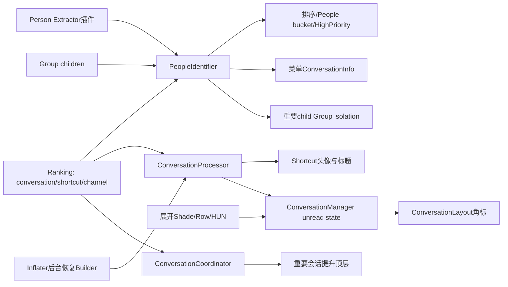
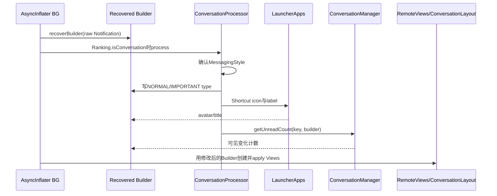
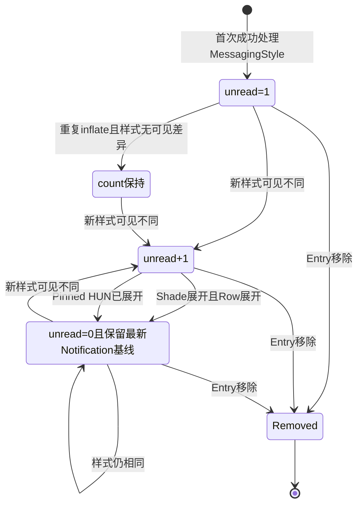

# 第 487 章 Android SystemUI PeopleNotificationIdentifier 与 ConversationNotificationManager：重要会话、头像、未读和提升链

> 源码基线：Android 11 / API 30 / `android-11.0.0_r48`。本章只在 macOS 阅读，不实际编译。核心文件：`PeopleNotificationIdentifier.kt`、`ConversationNotifications.kt`、`ConversationCoordinator.kt`；交叉阅读 `NotificationContentInflater.java`、`NotificationGroupManager.java`、`NotificationMenuRow.java`、`NotificationPanelViewController.java` 与本地测试。

## 1. 本章解决什么问题

SystemUI怎样判断普通通知、Person、完整会话和重要会话？Shortcut头像与标题何时写进MessagingStyle？未读角标为何不是简单的消息数组长度？会话升级后，现有View、group isolation和新管线层级怎样一起变化？

## 2. 一句话主线

PeopleIdentifier把Ranking、Person插件和group children合成类型；Inflater后台让Processor补齐MessagingStyle；ConversationManager跨线程保存可见变化计数并在展开时清零；Coordinator把重要会话child提升为顶层。

## 3. 四级People类型

0 NON_PERSON、1 PERSON、2 FULL_PERSON、3 IMPORTANT_PERSON。数值越大语义越强，比较器按降序排列。

## 4. Ranking是最强信号来源

Ranking `isConversation`、`shortcutInfo`和channel `isImportantConversation`依次区分0/1/2/3。重要会话一旦由Ranking确认，主方法立即返回3，不再访问插件或group children。

## 5. 插件只补到普通Person

`NotificationPersonExtractor`若识别为person只能贡献TYPE_PERSON；它不能凭应用内容直接把通知提升为FULL或IMPORTANT。

## 6. Group summary继承最强child

如果SBN是GroupManager认定的summary，递归计算children类型并取最大值；任一child重要，summary也按重要会话处理。

## 7. People类型影响多个消费者

上一章排序/分桶、HighPriority、NotificationMenu对话设置入口、Row people样式，以及GroupManager重要会话强制isolation都会询问同一Identifier。

## 8. Processor只改恢复出的Builder

它不直接改原Notification对象或现有ConversationLayout；在RemoteViews创建前改`recoveredBuilder.style`，随后模板inflate把会话类型、Shortcut资料和未读数带进View。

## 9. ConversationManager跨UI与后台线程

Inflater后台调用`getUnreadCount`，Entry/ranking/展开回调主要在UI线程，因此状态表用ConcurrentHashMap；View本身仍只在UI路径更新。

## 10. 总体协作图



## 11. Ranking类型判定的精确顺序

不是conversation→NON；是conversation但无shortcut→PERSON；有shortcut且channel重要→IMPORTANT；有shortcut但不重要→FULL。channel安全调用使用`?.`，null不会重要。

## 12. Shortcut是FULL的必要条件

Ranking已经认为conversation仍不够；`shortcutInfo==null`只得到PERSON。FULL表达系统已把通知与长期Shortcut会话绑定。

## 13. IMPORTANT还要求channel标志

Shortcut存在后，channel `isImportantConversation=true`才到3。App单方面设置MessagingStyle或Person无法直接得到该等级。

## 14. upperBound就是取max

Ranking、插件与summary child不会互相降级，只会取更强类型。比如Ranking NON但插件PERSON，最终PERSON；Ranking FULL不会被插件普通Person降回1。

## 15. IMPORTANT短路减少递归

Ranking先得到3直接返回；Ranking+插件合成3也直接返回；只有仍低于3才扫描summary children。

## 16. Summary身份来自当前GroupManager

`isSummaryOfGroup`而非只看Notification原始summary flag；suppression、override group与isolation后的当前逻辑关系会影响是否继承child。

## 17. children为null返回NON贡献

若GroupManager暂时没有children列表，summary child信号贡献0，仍保留前面Ranking/插件得到的类型。

## 18. child递归无visited集合

正常通知group是有限一层，算法直接递归Identifier；若构造出异常循环group关系，没有cycle保护。生产不变量必须阻止这种结构。

## 19. child顺序一般不影响结果

取max满足交换律；遇到IMPORTANT提前break只优化性能。除非外部Identifier/GroupManager getter带副作用，否则HashMap顺序不改变最终类型。

## 20. compareTo把大类型放前

返回`b.compareTo(a)`；a类型更大时结果负数，Comparator认为a在前。`@IntDef`只做静态约束，运行时传越界整数仍按数值比较。

## 21. 插件缺失选择fail-low

PluginBoundary的`isPersonNotification`在plugin为null时返回false，不会因插件未加载把普通通知误提升。

## 22. 插件可运行时替换

ExtensionController callback更新`plugin`字段；Identifier每次调用Extractor，因此新插件可影响后续分类，没有本地类型cache。

## 23. 分类没有Entry级缓存

排序一次可能多次询问相同Entry，并对summary重复递归children；结果实时但计算量随比较次数和group大小增加。

## 24. 重要会话会强制旧管线isolation

GroupManager `shouldIsolate`在检查HUN之前先判断TYPE_IMPORTANT_PERSON，重要child即使当前不Heads-up也返回true，视觉上脱离原summary独立展示。

## 25. 菜单类型随People等级改变

PERSON显示PartialConversationInfo；FULL或IMPORTANT显示完整NotificationConversationInfo；NON显示普通NotificationInfo。

## 26. Row的isConversation包含普通Person

ExpandableNotificationRow只要Identifier结果非NON就视为people/conversation相关；不能把Row `isConversation`一律等同Ranking `isConversation`。

## 27. 排序People层使用同一四级类型

People filtering开启时IMPORTANT、FULL、PERSON、NON由强到弱；summary因child继承也可能进入People bucket或排到更前。

## 28. HighPriority不依赖People feature

即使独立People区关闭，Identifier非NON仍是HighPriority characteristic，可把未被用户锁importance的LOW通知提升到Alerting。

## 29. 识别结果是当前快照

Ranking、plugin、group children任一变化都会改变下一次计算；调用者若把旧结果跨事件缓存，就可能与当前菜单/排序不同步。

## 30. People识别真实源码

```kotlin
@PeopleNotificationType
override fun getPeopleNotificationType(sbn: StatusBarNotification, ranking: Ranking): Int =
        when (val type = ranking.personTypeInfo) {
            TYPE_IMPORTANT_PERSON -> TYPE_IMPORTANT_PERSON
            else -> {
                when (val type = upperBound(type, extractPersonTypeInfo(sbn))) {
                    TYPE_IMPORTANT_PERSON -> TYPE_IMPORTANT_PERSON
                    else -> upperBound(type, getPeopleTypeOfSummary(sbn))
                }
            }
        }

override fun compareTo(@PeopleNotificationType a: Int,
              @PeopleNotificationType b: Int): Int {
    return b.compareTo(a);
}

/**
 * Given two [PeopleNotificationType]s, determine the upper bound. Used to constrain a
 * notification to a type given multiple signals, i.e. notification groups, where each child
 * has a [PeopleNotificationType] that is used to constrain the summary.
 */
@PeopleNotificationType
private fun upperBound(
    @PeopleNotificationType type: Int,
    @PeopleNotificationType other: Int
): Int =
        max(type, other)

private val Ranking.personTypeInfo
    get() = when {
        !isConversation -> TYPE_NON_PERSON
        shortcutInfo == null -> TYPE_PERSON
        channel?.isImportantConversation == true -> TYPE_IMPORTANT_PERSON
        else -> TYPE_FULL_PERSON
    }

private fun extractPersonTypeInfo(sbn: StatusBarNotification) =
        if (personExtractor.isPersonNotification(sbn)) TYPE_PERSON else TYPE_NON_PERSON

private fun getPeopleTypeOfSummary(statusBarNotification: StatusBarNotification): Int {
    if (!groupManager.isSummaryOfGroup(statusBarNotification)) {
        return TYPE_NON_PERSON
    }

    val childTypes = groupManager.getChildren(statusBarNotification)
            ?.asSequence()
            ?.map { getPeopleNotificationType(it.sbn, it.ranking) }
            ?: return TYPE_NON_PERSON

    var groupType = TYPE_NON_PERSON
    for (childType in childTypes) {
        groupType = upperBound(groupType, childType)
        if (groupType == TYPE_IMPORTANT_PERSON)
            break
    }
    return groupType
}
```

这是实现类完整分类核心，三路信号只会上取，不会互相抵消。

## 31. Processor调用发生在inflate后台

AsyncInflationTask恢复Notification.Builder后，仅当Entry Ranking `isConversation=true`才调用；随后才创建contracted、expanded与heads-up RemoteViews。

## 32. 二次MessagingStyle检查

即使Ranking是conversation，recoveredBuilder.style不能转换为MessagingStyle就直接return；不会写conversation type、Shortcut资料或unread state。

## 33. 重要类型写回MessagingStyle

Processor直接检查Ranking channel `isImportantConversation`，写IMPORTANT或NORMAL conversation type；它不复用PeopleIdentifier的summary继承结果。

## 34. Processor的channel调用不是safe-call

源码写`entry.ranking.channel.isImportantConversation`。若异常Ranking缺channel，可能抛空指针并被Inflater外层Exception捕获，最终整次内容inflate失败，而不是只跳过重要徽标。

## 35. Shortcut icon由LauncherApps加载

Ranking有shortcutInfo时调用`getShortcutIcon`写入MessagingStyle；图标来源是Shortcut，而不是重新从Person消息列表选头像。

## 36. Shortcut label覆盖conversation title

label非null才赋值；null时保留原Builder中的标题。空字符串并未在本方法额外过滤，依Launcher/模板后续处理。

## 37. 没有Shortcut仍会计算未读

Shortcut let块可跳过，但最后无条件调用Manager；只要Ranking conversation且样式是MessagingStyle，就有unread count。

## 38. 修改的是builder style对象

RemoteViews随后从该Builder生成；原`entry.sbn.notification`仍作为Manager比较状态保存。把两者分开可避免Processor自己加入的unread字段导致下次总被判变化。

## 39. Launcher异常由外层统一处理

Processor本身没有try/catch；图标读取、channel空值、样式比较等异常一路抛到AsyncInflationTask，记录InflationException。

## 40. conversationType不等People四级类型

MessagingStyle只写NORMAL/IMPORTANT两值；PERSON与FULL在模板的conversationType层都可能是NORMAL。四级类型服务排序/菜单，二级type服务会话模板视觉。

## 41. Processor每次reinflate都会运行

Notification更新或内容flag重绑会恢复Builder并再次处理，未读算法因此必须区分“同一视觉内容的重复inflate”和“真正新内容”。

## 42. Shortcut图标可能随Ranking更新

下一次reinflate读取当下shortcutInfo和LauncherApps图标；Manager不缓存头像，只缓存Notification与unread count。

## 43. Processor没有直接更新已有View

Ranking的重要标志变化若不触发完整reinflate，由ConversationManager的ranking listener直接遍历现有ConversationLayout补徽标。

## 44. 内容生成时序图



## 45. Processor真实源码

```kotlin
fun processNotification(entry: NotificationEntry, recoveredBuilder: Notification.Builder) {
    val messagingStyle = recoveredBuilder.style as? Notification.MessagingStyle ?: return
    messagingStyle.conversationType =
            if (entry.ranking.channel.isImportantConversation)
                Notification.MessagingStyle.CONVERSATION_TYPE_IMPORTANT
            else
                Notification.MessagingStyle.CONVERSATION_TYPE_NORMAL
    entry.ranking.shortcutInfo?.let { shortcutInfo ->
        messagingStyle.shortcutIcon = launcherApps.getShortcutIcon(shortcutInfo)
        shortcutInfo.label?.let { label ->
            messagingStyle.conversationTitle = label
        }
    }
    messagingStyle.unreadMessageCount =
            conversationNotificationManager.getUnreadCount(entry, recoveredBuilder)
}
```

连续方法说明头像/标题与未读数都发生在模板生成前，而非View显示后。

## 46. states按notification key索引

值是`ConversationState(unreadCount, notification)`；同一包不同通知id/tag有不同key，因此独立计数。

## 47. ConcurrentHashMap的必要性

后台Inflater可同时计算count，UI线程可因展开、ranking或移除修改状态。普通HashMap会存在数据竞争，compute/replaceAll提供每key原子更新和弱一致遍历。

## 48. 第一次见到Entry从1开始

state为null时无论消息数组多少都返回1；它表示“这张会话通知出现了一次未读视觉版本”，不是“有一条消息”。

## 49. 后续是否加一看可见差异

恢复旧state.notification的Builder，与当前recoveredBuilder交给`Notification.areStyledNotificationsVisiblyDifferent`；true才`unreadCount+1`，false保持。

## 50. 每次compute都更新比较基线

无论是否increment，新ConversationState都保存当前`entry.sbn.notification`；下一次与最新原始版本比，而不是一直和首次版本比。

## 51. Processor新增字段不会污染旧基线

state保存SBN原Notification，而非已写unread/shortcut的recoveredBuilder build结果，所以自身计数值变化通常不会反过来制造“可见不同”。

## 52. 清零不删除state

`resetCount`只copy count=0，保留最新Notification基线；下次视觉相同仍为0，真正变化才从0加到1。

## 53. Entry移除才删除key

不管removedByUser和reason，`onEntryRemoved`调用remove。相同key以后重新post通常重新从1开始。

## 54. 后台compute与remove仍有竞态

ConcurrentHashMap保证单次操作安全，却不能把“Entry生命周期”与后台compute组成同一事务；remove后迟到的compute理论上可重新插入状态，代码没有generation或active复查。

## 55. Notification对象按引用保存

State没有clone；正常NMS更新通常提供新Notification对象。若外部在原对象上原地变更，旧比较基线也可能被改变，这是对象所有权约定边界。

## 56. recoverBuilder异常没有本地兜底

`getUnreadCount`在compute内恢复旧Builder；异常向Processor/Inflater外层传播，可能让内容inflate失败，而不是保守地只加一。

## 57. states只跟踪MessagingStyle会话

Processor在style cast失败前不会调用getUnreadCount。因此Ranking conversation但非MessagingStyle不会进入states，ranking listener也不会为它更新现有会话布局。

## 58. Ranking更新只遍历states keys

它不是遍历全部active notifications；只处理曾经成功计算过unread的tracked Entry，减少工作也形成上述跟踪边界。

## 59. 一个Ranking对象循环复用

每次`getRanking(key, ranking)`覆盖同一对象；返回false就跳过。代码不会在失败时误用上一Entry残留Ranking。

## 60. 变成非conversation时什么都不做

条件要求getRanking成功且`ranking.isConversation`；若从conversation降为普通通知，现有state不删除、已有Layout重要标志也不在此清理，等待reinflate或Entry remove等其他链收口。

## 61. Ranking listener更新哪些View

对Row的每个NotificationContentView，只枚举contractedChild、expandedChild、headsUpChild，再保留ConversationLayout；single-line、ambient或其他自定义View不在这段序列中。

## 62. 只更新状态不一致的Layout

`important == layout.isImportantConversation`就continue；否则置changed并更新。相同Ranking重复下发不会重复动画。

## 63. 升级与降级动画不对称

只有“变important且Entry marked for user-triggered movement”才延迟并显式animate=true；降级或非用户移动的升级立即调用单参数版本。

## 64. 延迟是三段动画时长之和

标准动画时长+priority change时长+100ms，让Row先在Shade完成位置移动，再播放重要会话徽标进入动画。

## 65. 每个Layout各post一个Runnable

contracted/expanded/HUN可能分别排队；没有合并为Entry级任务。View数量越多，主Handler上延迟任务越多。

## 66. 延迟Runnable没有取消

它捕获layout与当时important=true，不在执行时重查最新Ranking、Row是否移除或Layout是否仍挂载；快速升后降可能让旧Layout迟到又被设true。

## 67. Group isolation先于延迟徽标完成

只要发现任一Layout changed，循环后立即`updateIsolation(entry)`；即使UI标志要延迟，逻辑group可先重组。

## 68. isolation更新依赖View changed

若Entry没有ConversationLayout，或所有Layout已经是目标值，changed=false便不调用GroupManager。重要会话group收口在本类与View状态存在耦合，其他group/ranking事件可能补足。

## 69. 重要会话为何需要isolation

旧GroupManager对IMPORTANT child无条件shouldIsolate；Ranking channel升级后必须重新评估，使child从summary下独立出来，与People顶部语义一致。

## 70. Ranking降级怎样处理

Layout不一致时立即set false并updateIsolation，GroupManager可把child并回原组；不存在与升级相同的移动后延迟。

## 71. ranking.channel仍按非null使用

listener在`ranking.isConversation`后读取`ranking.channel.isImportantConversation`，同样依赖conversation Ranking总带channel的合同；异常null可中断该回调。

## 72. Ranking到现有View真实源码

```kotlin
override fun onNotificationRankingUpdated(rankingMap: RankingMap) {
    fun getLayouts(view: NotificationContentView) =
            sequenceOf(view.contractedChild, view.expandedChild, view.headsUpChild)
    val ranking = Ranking()
    val activeConversationEntries = states.keys.asSequence()
            .mapNotNull { notificationEntryManager.getActiveNotificationUnfiltered(it) }
    for (entry in activeConversationEntries) {
        if (rankingMap.getRanking(entry.sbn.key, ranking) && ranking.isConversation) {
            val important = ranking.channel.isImportantConversation
            val layouts = entry.row?.layouts?.asSequence()
                    ?.flatMap(::getLayouts)
                    ?.mapNotNull { it as? ConversationLayout }
                    ?: emptySequence()
            var changed = false
            for (layout in layouts) {
                if (important == layout.isImportantConversation) {
                    continue
                }
                changed = true
                if (important && entry.isMarkedForUserTriggeredMovement) {
                    // delay this so that it doesn't animate in until after
                    // the notif has been moved in the shade
                    mainHandler.postDelayed({
                        layout.setIsImportantConversation(
                                important, true /* animate */)
                    }, IMPORTANCE_ANIMATION_DELAY.toLong())
                } else {
                    layout.setIsImportantConversation(important)
                }
            }
            if (changed) {
                notificationGroupManager.updateIsolation(entry)
            }
        }
    }
}
```

源码证明逻辑isolation触发点取决于至少一个现有Layout状态变化。

## 73. Entry inflate后才安装展开监听

只对当时Ranking conversation的Entry安装；普通通知以后变conversation需要reinflate才能经`onEntryReinflated`进入同一路径。

## 74. 展开不一定立即标已读

必须Row expanded，并且Shade不collapsed，或者该Entry是pinned and expanded HUN。折叠面板中后台保持expanded标志的普通Row不会清零。

## 75. Pinned HUN是特殊阅读场景

即使通知面板仍collapsed，用户展开顶部HUN也视为看过，reset count并清角标。

## 76. shown Row等待intrinsic height

展开listener发现Row已shown且展开，使用`performOnIntrinsicHeightReached`延后清零，避免布局尚未到可读高度就判已读。

## 77. 回调使用捕获的isExpanded

等待期间若Row又折叠，回调仍传最初true；它会重查面板collapsed/pinned，却不重查Row当前expanded。因此面板仍开时可能在折叠后迟到清零。

## 78. 未shown或折叠直接走updateCount

折叠传false自然不清；未shown但expanded时如果面板已开，当前实现可立即清零，不额外要求`isShown=true`。

## 79. 安装监听后立即检查现状

`onEntryInflated`末尾调用当前`row?.isExpanded`，处理View在listener安装前已经展开的情况。

## 80. reinflate会重新安装listener

调用`onEntryInflated(entry)`覆盖Row的单个ExpansionChangedListener；没有累积多个本类listener，但可能替换同一setter上的先前消费者，依赖Row只为此用途保留槽。

## 81. 面板从collapsed变expanded时批量清零

`onNotificationPanelExpandStateChanged(false)`找tracked keys中active且Row expanded的Entry，先建立Map快照，再把对应state count设0并更新UI。

## 82. 面板收起只更新布尔

参数true后立即return，不修改counts；收起动作本身不是“读完通知”。

## 83. 未读状态机图



## 84. expanded快照只来自tracked keys

没有state的Ranking conversation不会参与；state存在但active Entry已不在unfiltered集合也被mapNotNull跳过。

## 85. 批量判断只看row.isExpanded

这里不要求Row `isShown`、不区分当前user或GONE；依赖active集合和Hierarchy已经表达实际上下文，静态上隐藏但expanded的Row也可能清零。

## 86. replaceAll可能重复执行lambda

源码注释明确ConcurrentHashMap竞争时可重跑，因此lambda只做纯copy，不在里面操作View或发送事件。

## 87. UI更新故意放在replaceAll之后

对expanded.values逐个resetBadgeUi，避免lambda重试造成重复View副作用；状态与UI可能短暂跨几个语句不同步，但最终收敛。

## 88. resetBadgeUi覆盖范围更广

它遍历每个NotificationContentView的`allViews`再筛ConversationLayout，比ranking listener只看contracted/expanded/HUN更全面。

## 89. UI清零不重新inflate

直接`ConversationLayout.setUnreadCount(0)`；State保留Notification基线，下一次inflate会从Manager取得当前count。

## 90. panel状态来自展开动画结束

NotificationPanelViewController在`onExpandingFinished`传`isFullyCollapsed()`；不是每一个拖拽像素都调用，计数以面板展开/收拢阶段完成为边沿。

## 91. 面板打开与单Row展开两条清零链会重叠

Row listener可能先清一次，panel批处理随后再copy count=0并写UI；操作幂等，重复清零不产生负数。

## 92. 未读计算与面板清零真实源码

```kotlin
fun getUnreadCount(entry: NotificationEntry, recoveredBuilder: Notification.Builder): Int =
        states.compute(entry.key) { _, state ->
            val newCount = state?.run {
                val old = Notification.Builder.recoverBuilder(context, notification)
                val increment = Notification
                        .areStyledNotificationsVisiblyDifferent(old, recoveredBuilder)
                if (increment) unreadCount + 1 else unreadCount
            } ?: 1
            ConversationState(newCount, entry.sbn.notification)
        }!!.unreadCount

fun onNotificationPanelExpandStateChanged(isCollapsed: Boolean) {
    notifPanelCollapsed = isCollapsed
    if (isCollapsed) return

    // When the notification panel is expanded, reset the counters of any expanded
    // conversations
    val expanded = states
            .asSequence()
            .mapNotNull { (key, _) ->
                notificationEntryManager.getActiveNotificationUnfiltered(key)
                        ?.let { entry ->
                            if (entry.row?.isExpanded == true) key to entry
                            else null
                        }
            }
            .toMap()
    states.replaceAll { key, state ->
        if (expanded.contains(key)) state.copy(unreadCount = 0)
        else state
    }
    // Update UI separate from the replaceAll call, since ConcurrentHashMap may re-run the
    // lambda if threads are in contention.
    expanded.values.asSequence().mapNotNull { it.row }.forEach(::resetBadgeUi)
}
```

这段源码说明“未读”按视觉版本累积，打开面板只清当时expanded的tracked Entry。

## 93. resetBadgeUi不改Notification

只改现有ConversationLayout的unread显示；下一次模板重建仍从states count取得值，不靠旧View反推。

## 94. ConversationCoordinator属于新管线

attach时添加NotifPromoter；`entry.channel?.isImportantConversation == true`就请求提升顶层。它不看People插件类型、summary继承或当前HUN。

## 95. Promoter只认Entry自己的channel

Group summary因important child被PeopleIdentifier提升，不代表summary自己的channel重要；Coordinator不会因此把summary当important child promotion目标。

## 96. null channel安全返回false

与Processor不同，Coordinator使用safe-call；缺channel的Entry不会抛异常，只是不提升。

## 97. 提升顶层与旧管线isolation对应

新NotifPipeline通过Promoter把重要conversation child从GroupEntry提到顶层；旧管线GroupManager通过`shouldIsolate`实现相近视觉结果，两套代码按feature选择，不是同一Entry必定执行两次。

## 98. Promotion不负责排序类型

顶层后仍由pipeline section/comparator决定相对位置；Coordinator只改变层级，不写People type、bucket或unread。

## 99. Coordinator测试只有1项

同一测试断言important channel Entry为true、空Builder Entry为false；没有group、null/普通channel切换或pipeline实际提升结果断言。

## 100. 测试名提到HUN但没有设置HUN

方法叫`testPromotesCurrentHUN`，正文只设置channel important，未创建Row或HeadsUp状态。因此它证明important promoter门，不证明任何HUN行为。

## 101. Identifier没有专用测试

本地SystemUI tests没有直接实例化PeopleNotificationIdentifierImpl，Ranking/Extractor/summary三路upperBound、递归短路、compare方向与plugin缺失均无该类专用覆盖。

## 102. Processor与Manager也没有专用测试

NotificationContentInflaterTest仅Mock Processor，NotificationPanelViewTest仅把Manager作为mock依赖且未验证本章回调；unread、展开清零、Ranking Layout更新和并发均无直接单测。

## 103. 当前测试证据非常窄

核心三文件只有Coordinator 1项直接测试；因此本章不把“代码看起来线程安全”当成测试已证明，而以ConcurrentHashMap语义和事件时序逐行审计。

## 104. 复读发现一：未读不是消息数

首次固定1，后续每次Styled Notification“可见不同”最多加1；一次更新新增多条message也不按条数累加，重复reinflate无可见变化则不加。

## 105. 复读发现二：重要UI延迟无代际

升级且用户触发移动时，Runnable捕获旧layout和true，没有CancellationSignal、key generation或最新Ranking复查；快速反转存在迟到写旧状态窗口。

## 106. 复读发现三：Ranking降为非会话不清state

listener的conversation条件失败后完全跳过，tracked key继续存在；直到Entry removed才必然remove，期间panel批处理仍可能访问它。

## 107. 复读发现四：isolation更新和Layout差异绑定

只有至少一个现有ConversationLayout重要标志改变才调用GroupManager；无View或View已一致时不调用，逻辑层更新依赖其他通知事件共同收敛。

## 108. 复读发现五：生命周期与线程安全不是同一件事

ConcurrentHashMap避免容器损坏，却不能阻止remove之后后台compute重插，也不能取消延迟UI Runnable。排障要同时记录map原子性、Entry代际和View代际。

## 109. 一套People分类诊断顺序

记录Ranking isConversation、shortcut、channel important；再看Extractor插件结果；最后确认当前是否summary、children列表与每个child类型。逐层取max，遇3短路。

## 110. 一套未读异常诊断顺序

确认Processor是否因Ranking/style进入、key旧state、旧/新Builder可见差异、panelCollapsed、Row expanded/pinned/shown、intrinsic回调时刻、remove与compute先后及所有ConversationLayout count。

## 111. 本章线程、进程与记忆口诀

全部位于SystemUI进程；Inflater处理和count compute可在后台，Entry/ranking/Row/panel与Handler View更新主要在主线程，LauncherApps/Ranking来源跨system_server。口诀：“类型三路取最高；模板补头像标题；未读数可见变化；展开才清零；重要升级先移组后亮徽标。”

## 112. macOS只读练习一：手算People类型

为Ranking非会话+插件Person、会话无Shortcut、有Shortcut普通channel、重要channel、普通summary含FULL child、FULL summary含IMPORTANT child六组输入计算0—3，并写出短路位置。

## 113. macOS只读练习二：推演未读计数

按“首次内容A→重复inflate A→更新B含三条新消息→面板开但Row折叠→Row展开→重复B→更新C”逐步写state count与保存的Notification基线。

## 114. macOS只读练习三：推演延迟升级竞态

列出important true+marked movement→post delayed→Ranking迅速false→立即Layout false→旧Runnable执行的时序；设计只读概念修正：保存generation或执行前重查Ranking/Layout归属。

## 115. macOS只读练习四：补测试矩阵

在唯一Coordinator测试之外，列出至少十五项Identifier/Processor/Manager测试，包括summary递归、plugin null、channel null、视觉同异、展开/HUN清零、remove-compute和延迟Runnable反转。

## 116. 易错理解一：People类型只看Ranking

错误。Ranking是主信号，但插件可补PERSON，summary还可继承最强child；最终是三路upper bound。

## 117. 易错理解二：unreadMessageCount等于消息条数

错误。第一次为1，每次可见样式变化加1；它表达未读更新批次/视觉版本，不解析新增message数量。

## 118. 易错理解三：打开Shade会清全部会话

错误。只清states中仍active且Row当前expanded的Entry；折叠会话保持计数。

## 119. 复读后的最终心智模型

把PeopleIdentifier看成无缓存类型合成器，把Processor看成后台模板增强器，把ConversationManager看成跨线程“视觉版本计数+现有View同步器”，把旧isolation/新Promoter看成重要会话层级提升器；四层可在短时间内不同步。

## 120. 本章结论与下一章

r48以Ranking/插件/group上取构造People四级类型，以Shortcut增强MessagingStyle，以可见差异累计unread，并在展开时清零；重要Ranking变化再同步Layout与group层级。复读确认channel非空合同、非会话降级不清state、延迟升级无代际、remove-compute竞态及isolation依赖View changed等边界。下一章继续研究NotificationContentInflater、RemoteViews apply/reapply、CancellationSignal与多内容View异步膨胀链。
