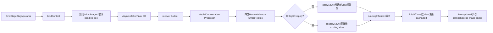
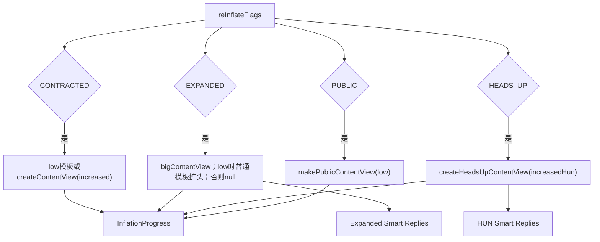
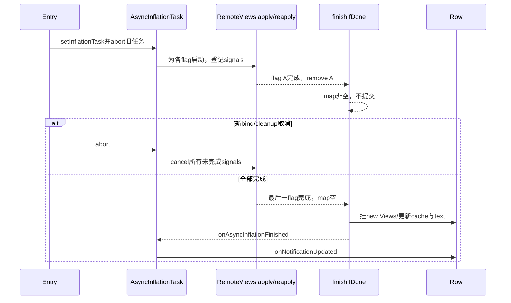

# 第 488 章 Android SystemUI NotificationContentInflater 与 RemoteViews：多内容View创建、复用、异步应用、取消和释放链

> 源码基线：Android 11 / API 30 / `android-11.0.0_r48`。本章只在 macOS 阅读，不实际编译。核心文件：`NotificationContentInflater.java`、`NotificationRowContentBinder.java`、`NotifRemoteViewCacheImpl.java`；交叉阅读 `NotificationContentView.java`、`NotificationEntry.java` 与本地测试。

## 1. 本章解决什么问题

一条通知为什么有contracted、expanded、heads-up和public四套内容？RemoteViews何时创建新View、何时reapply旧View？四路异步任务怎样汇合、失败怎样回退、取消和延迟释放又怎样防止旧内容重新挂回Row？

## 2. 一句话主线

Binder按flag启动单个AsyncInflationTask；后台恢复Builder并生成RemoteViews/Smart Replies，主线对每个flag apply或reapply；所有running signal清空后finishIfDone提交结果、更新cache并通知Row。

## 3. RemoteViews不是已经inflate的View

它是跨进程可传输的布局id与动作描述；SystemUI用通知包Context apply生成真实View，或把新动作reapply到兼容旧View。

## 4. 四类内容各有用途

CONTRACTED=普通折叠私有内容，EXPANDED=展开内容，HEADS_UP=顶部peek内容，PUBLIC=锁屏脱敏折叠内容；四位合并为FLAG_CONTENT_VIEW_ALL=15。

## 5. Binder按位局部更新

调用方可只要求HUN或expanded，不必每次重建全部；InflationProgress的其余字段保持null，finish只处理请求flag。

## 6. 生成和应用分成两阶段

后台阶段恢复Builder、处理media/conversation、创建四类RemoteViews和Smart Replies；apply阶段才触碰NotificationContentView与真实Android View。

## 7. Cache缓存的是RemoteViews

`NotifRemoteViewCache`不保存真实View，而是保存上次应用的RemoteViews，用包名、layoutId和reapply flag判断现有View能否复用。

## 8. 新View与reapply提交语义不同

新View先写InflationProgress，等所有flag完成后挂Row；reapply直接修改existingView，并在单路完成时通知wrapper，因此混合任务不是严格的全有或全无事务。

## 9. CancellationSignal只取消未完成工作

Entry只保存一个InflationTask；新任务先abort旧任务。进入RemoteViews异步apply后，聚合signal取消各子signal，但已完成的reapply副作用不能回滚。

## 10. 总体流水线图



## 11. bind首先拒绝removed Row

入口发现`row.isRemoved()`立即return，不预载图片、不建Task、也不回调callback；调用方必须把这种no-op纳入生命周期设计。

## 12. 入口检查只是瞬时快照

任务启动后Row仍可能被移除；finishIfDone没有再次检查removed。正确性依赖上游在cleanup及时`cancelBind/entry.abortTask`。

## 13. inline图片先预载

`row.getImageResolver().preloadImages(notification)`在force cache clear之前执行；预载的是消息内联图片资源，不是RemoteViews cache。

## 14. forceInflate清RemoteViews cache

它不先删除真实child View；cache空使`canReapply`失败，于是新RemoteViews走apply并在最终提交时替换旧child。

## 15. bind会取消对应pending free

如果某内容正等待“变inactive后释放”，重新require同flag就删除该one-shot runnable，防止新绑定期间旧释放逻辑把View清掉。

## 16. BindParams在Task构造时快照

low priority、contracted increased height和HUN increased height被复制到final字段；后续Stage参数改变不会改正在运行任务。

## 17. media feature也在Inflater构造时缓存

`mIsMediaInQS=mediaFeatureFlag.getEnabled()`不是每次bind读取；进程内feature切换不会自动改变已有Inflater行为。

## 18. Task构造会替换Entry旧任务

`entry.setInflationTask(this)`内部先`abortTask()`，因此同Entry新的内容bind取消旧Row/content inflation任务，再把自己登记为唯一running task。

## 19. 同步模式只用于测试

`mInflateSynchronously=true`时直接调用`doInBackground`和`onPostExecute`；生产用Background Executor执行AsyncTask。

## 20. cancelBind忽略row参数

实现只调用`entry.abortTask()`；传入哪个Row不参与校验。若Entry与Row不匹配，仍取消Entry当前唯一任务。

## 21. unbind按每个bit循环

从curFlag=1左移，找到请求bit就`freeNotificationView`并从mask清除；未知bit进入default no-op但仍会被清掉。

## 22. unbind不等于立刻remove child

`performWhenContentInactive`若该visible type正在展示，会登记Runnable，等切走后才set child null并删cache，避免当前画面突然消失。

## 23. 已inactive时立即释放

目标View为null或`isContentViewInactive=true`时Runnable同步执行；测试中HUN未显示，所以unbind后cache remove可立即verify。

## 24. HUN释放还清Smart Replies

HEADS_UP runnable除setHeadsUpChild(null)和删cache外，还`setHeadsUpInflatedSmartReplies(null)`；expanded释放函数没有在同处显式清expanded Smart Replies。

## 25. Public使用publicLayout contracted槽

PUBLIC没有独立visible type常量，复用Public NotificationContentView的CONTRACTED位置，与private contracted是两个不同parent。

## 26. pending free按View对象保存

NotificationContentView把listener放在`mOnContentViewInactiveListeners`，key是当前View；bind取消时也先按visible type取得当前View再remove。

## 27. replaced View与pending free存在身份窗口

若登记free后当前child已被别处替换，cancel通过新current View找key，未必删除旧View对应Runnable；正常setChild/可见状态流程应负责触发旧listener。

## 28. removed入口不清旧Task

bind在Row removed时直接return，没有主动`entry.abortTask()`；若调用前已有任务仍运行，必须由remove/cleanup路径另行取消。

## 29. callback在入口no-op时不会收到完成

这与错误回调、取消无回调、正常完成回调是四种不同结局。上层不能假定每次bind调用必有终止callback。

## 30. bind入口真实源码

```java
@Override
public void bindContent(
        NotificationEntry entry,
        ExpandableNotificationRow row,
        @InflationFlag int contentToBind,
        BindParams bindParams,
        boolean forceInflate,
        @Nullable InflationCallback callback) {
    if (row.isRemoved()) {
        // We don't want to reinflate anything for removed notifications. Otherwise views might
        // be readded to the stack, leading to leaks. This may happen with low-priority groups
        // where the removal of already removed children can lead to a reinflation.
        return;
    }

    StatusBarNotification sbn = entry.getSbn();

    // To check if the notification has inline image and preload inline image if necessary.
    row.getImageResolver().preloadImages(sbn.getNotification());

    if (forceInflate) {
        mRemoteViewCache.clearCache(entry);
    }

    // Cancel any pending frees on any view we're trying to bind since we should be bound after.
    cancelContentViewFrees(row, contentToBind);

    AsyncInflationTask task = new AsyncInflationTask(
            mBgExecutor,
            mInflateSynchronously,
            contentToBind,
            mRemoteViewCache,
            entry,
            mSmartReplyConstants.get(),
            mSmartReplyController.get(),
            mConversationProcessor,
            row,
            bindParams.isLowPriority,
            bindParams.usesIncreasedHeight,
            bindParams.usesIncreasedHeadsUpHeight,
            callback,
            mRemoteInputManager.getRemoteViewsOnClickHandler(),
            mIsMediaInQS);
    if (mInflateSynchronously) {
        task.onPostExecute(task.doInBackground());
    } else {
        task.executeOnExecutor(mBgExecutor);
    }
}
```

这段连续源码把removed no-op、图片预载、cache策略、free取消和Task替换串在一起。

## 31. 后台先recover Builder

使用SystemUI Row Context和当前SBN Notification恢复Builder，确保标准模板API可重新生成RemoteViews；自定义RemoteViews也从Notification字段带回。

## 32. 模板Context被强制支持RTL

若`recoveredBuilder.usesTemplate()`，包装通知包Context，`getApplicationInfo`把FLAG_SUPPORTS_RTL OR进去，让所有系统模板按RTL能力布局。

## 33. RtlContext会原地改ApplicationInfo

它取得super返回对象后直接修改flags，不clone；若packageContext复用同一ApplicationInfo实例，该支持位可在本次读取之外继续可见。

## 34. Media Processor有QS例外

通知是media，但如果Media-in-QS feature开启且被MediaDataManager识别为media，就跳过旧通知模板media处理；否则新建MediaNotificationProcessor修改Builder。

## 35. Conversation Processor紧接Media

Ranking `isConversation`时调用上一章Processor；若同一通知同时有media与conversation信号，media先处理，conversation后处理同一Builder。

## 36. 任一步异常统一保存mError

recover、package Context、media、conversation、RemoteViews或Smart Replies异常都被catch，后台返回null；onPostExecute不apply，改走handleError。

## 37. 四类RemoteViews按flag创建

contracted用low/increased参数，expanded可big或low fallback，HUN用increased HUN参数，public用low priority参数。

## 38. expanded允许为null

普通通知没有bigContentView且不low priority时返回null；finish随后删除旧expanded child并把Row expandable设false。

## 39. low priority会制造expanded fallback

若没有bigContentView，取普通content并`makeHeaderExpanded`，所以low priority通知可能仍有expanded View。

## 40. HUN也允许为null

builder `createHeadsUpContentView`可返回null；apply阶段跳过该flag，finish删除旧HUN child/cache和Smart Replies。

## 41. contracted和public按合同应非null

apply没有像expanded/HUN那样先判null；若Builder异常返回null，后续调用RemoteViews方法会异常。系统模板创建合同必须保证这两类存在。

## 42. Smart Replies只为expanded和HUN

且对应new RemoteViews非null才inflate；contracted/public不安装这套InflatedSmartReplies。

## 43. 旧Smart Reply状态用于复用

传`row.getExistingSmartRepliesAndActions()`帮助新视图决定按钮/回复是否可复用，避免每次更新都重建全部交互状态。

## 44. status bar text不受请求flag限制

createRemoteViews每次都计算private/public heads-up status text；即使只重绑expanded，finish仍写Entry两个文本字段。

## 45. 四类内容矩阵图



## 46. InflationProgress既存描述又存结果

`new*View`是RemoteViews，`inflated*View`是真实View；另有packageContext、两个status text及两套Smart Replies。它是后台到主线的事务载体。

## 47. packageContext属于通知包

RemoteViews apply必须用发布通知应用的资源/类加载上下文，不是简单使用SystemUI context；parent仍是SystemUI的NotificationContentView。

## 48. only requested flags进入Progress

未请求字段保持null，但finish会用reInflateFlags区分“未请求”与“请求后生成null”，避免错误删除未请求内容。

## 49. create阶段不接触Row child

除Smart Replies读取现状外，真实child设置都留到apply/finish；后台不会直接操作View hierarchy。

## 50. RemoteViews创建真实源码

```java
private static InflationProgress createRemoteViews(@InflationFlag int reInflateFlags,
        Notification.Builder builder, boolean isLowPriority, boolean usesIncreasedHeight,
        boolean usesIncreasedHeadsUpHeight, Context packageContext) {
    InflationProgress result = new InflationProgress();

    if ((reInflateFlags & FLAG_CONTENT_VIEW_CONTRACTED) != 0) {
        result.newContentView = createContentView(builder, isLowPriority, usesIncreasedHeight);
    }

    if ((reInflateFlags & FLAG_CONTENT_VIEW_EXPANDED) != 0) {
        result.newExpandedView = createExpandedView(builder, isLowPriority);
    }

    if ((reInflateFlags & FLAG_CONTENT_VIEW_HEADS_UP) != 0) {
        result.newHeadsUpView = builder.createHeadsUpContentView(usesIncreasedHeadsUpHeight);
    }

    if ((reInflateFlags & FLAG_CONTENT_VIEW_PUBLIC) != 0) {
        result.newPublicView = builder.makePublicContentView(isLowPriority);
    }

    result.packageContext = packageContext;
    result.headsUpStatusBarText = builder.getHeadsUpStatusBarText(false /* showingPublic */);
    result.headsUpStatusBarTextPublic = builder.getHeadsUpStatusBarText(
            true /* showingPublic */);
    return result;
}
```

四个flag互不隐式包含，ALL只是调用方传入的bit组合。

## 51. canReapply需要四个条件

新旧RemoteViews都非null、package都非null且相等、layoutId相同、旧RemoteViews未标FLAG_REAPPLY_DISALLOWED；否则创建新View。

## 52. 检查的是旧View的禁止flag

源码读取`oldView.hasFlags`而不是newView；缓存描述的是现有View由什么RemoteViews创建，旧描述禁止reapply就必须换根。

## 53. Cache按Entry对象和flag索引

不是按notification key字符串；collection onEntryInit创建SparseArray，onEntryCleanUp删除整个槽。相同key的新Entry对象不会共享旧cache。

## 54. put在槽不存在时静默丢弃

Cache实现不会补建，也不抛异常；注释承认remove后仍可能bind/unbind。finish可能挂了View但cache已cleanup，于是以后不能reapply复用。

## 55. apply先为每flag算isNewView

contracted/public始终调用applyRemoteView；expanded/HUN仅new RemoteViews非null时调用。四路CancellationSignal用flag整数作为HashMap key。

## 56. runningInflations是汇合屏障

每路完成从map remove并尝试finish；只有map empty才提交。apply末尾也先调用一次finish，覆盖“没有任何异步任务”的null或同步情况。

## 57. 同步成功不向map放signal

new走RemoteViews.apply并暂存真实View；reuse走reapply并立刻`existingWrapper.onReinflated()`。所有flag循环后统一finish。

## 58. 同步reapply假定wrapper非null

同步分支直接调用`existingWrapper.onReinflated()`，没有async分支的null判断；cache允许reuse但wrapper缺失时会NPE并走错误回调。

## 59. 同步错误放dummy signal

handle error后向map放一个新CancellationSignal，故意让最终finish不触发成功callback；这是测试同步路径的控制技巧，不代表真实任务仍在运行。

## 60. 多个同步flag可多次报错

一次flag失败后循环没有全局return；后续flag仍尝试，若也失败会再次调用handleInflationException。dummy signals只阻止成功finish，不保证错误callback唯一。

## 61. 异步new走applyAsync

RemoteViews在Background Executor inflate/执行动作，listener回到框架约定线程；SystemUI的finish和error都Assert main thread。

## 62. 异步reuse走reapplyAsync

直接以existingView为目标；即使其他flag尚未完成，这个旧View也可能已经被修改，所以屏障只延迟最终callback和新View挂载。

## 63. onViewInflated注入ImageResolver

仅当新inflate根View实现ImageMessageConsumer时设置Row resolver，支持Messaging图片异步加载；普通View跳过。

## 64. 同步路径没有onViewInflated钩子

测试同步apply不会执行这段ImageMessageConsumer注入；因此同步测试不能证明生产inline image resolver链完整。

## 65. onViewApplied处理new与reuse

new根设root namespace并暂存；reuse只在wrapper非null时`onReinflated`。随后remove自己的flag并尝试finish。

## 66. root namespace延迟到apply完成

无论正常async new还是fallback new，最终都经onViewApplied设置；这样RemoteViews根的id搜索与事件边界正确。

## 67. 异步失败会在UI线程同步重试

注释认为失败可能是系统async bug，因此同一个RemoteViews用apply/reapply再试一次；成功会Log.wtf但仍按正常onViewApplied收口。

## 68. fallback成功仍算本次成功

外部只收到finished callback，不收到inflation exception；wtf日志是唯一失败痕迹，Row获得同步重试结果。

## 69. fallback也失败却上报第一次异常

catch变量叫anotherException，但handleInflationError传的是原`e`；真正同步失败原因被丢掉，诊断日志/回调可能只看到较早的async异常。

## 70. fallback new未显式调用onViewInflated

同步apply后直接`onViewApplied(newView)`；若根是ImageMessageConsumer，不会在这条路径设置ImageResolver，除非RemoteViews内部或其他流程补足。

## 71. handleError取消所有兄弟flag

遍历runningInflations cancel，然后向外部callback报错；map没有clear，避免迟到finish把部分结果当成功提交。

## 72. cancel不等于error

聚合CancellationSignal只对子signals调用cancel，不触发Binder callback；上层主动取消通常既无finished也无exception回调。

## 73. 子signal登记有时序假设

代码先调用applyAsync/reapplyAsync取得signal，再put进map；假设RemoteViews不会在返回signal前同步调用onViewApplied。若自定义实现违反，listener可能看到map尚空而提前finish，随后留下永不移除的signal。

## 74. 聚合signal捕获的是live map

cancel listener执行时遍历当下values；已完成flag已remove，不再取消；未完成flag一起cancel。

## 75. 异步apply真实源码

```java
RemoteViews.OnViewAppliedListener listener = new RemoteViews.OnViewAppliedListener() {

    @Override
    public void onViewInflated(View v) {
        if (v instanceof ImageMessageConsumer) {
            ((ImageMessageConsumer) v).setImageResolver(row.getImageResolver());
        }
    }

    @Override
    public void onViewApplied(View v) {
        if (isNewView) {
            v.setIsRootNamespace(true);
            applyCallback.setResultView(v);
        } else if (existingWrapper != null) {
            existingWrapper.onReinflated();
        }
        runningInflations.remove(inflationId);
        finishIfDone(result, reInflateFlags, remoteViewCache, runningInflations,
                callback, entry, row);
    }

    @Override
    public void onError(Exception e) {
        // Uh oh the async inflation failed. Due to some bugs (see b/38190555), this could
        // actually also be a system issue, so let's try on the UI thread again to be safe.
        try {
            View newView = existingView;
            if (isNewView) {
                newView = newContentView.apply(
                        result.packageContext,
                        parentLayout,
                        remoteViewClickHandler);
            } else {
                newContentView.reapply(
                        result.packageContext,
                        existingView,
                        remoteViewClickHandler);
            }
            Log.wtf(TAG, "Async Inflation failed but normal inflation finished normally.",
                    e);
            onViewApplied(newView);
        } catch (Exception anotherException) {
            runningInflations.remove(inflationId);
            handleInflationError(runningInflations, e, row.getEntry(),
                    callback);
        }
    }
};
CancellationSignal cancellationSignal;
if (isNewView) {
    cancellationSignal = newContentView.applyAsync(
            result.packageContext,
            parentLayout,
            bgExecutor,
            listener,
            remoteViewClickHandler);
} else {
    cancellationSignal = newContentView.reapplyAsync(
            result.packageContext,
            existingView,
            bgExecutor,
            listener,
            remoteViewClickHandler);
}
runningInflations.put(inflationId, cancellationSignal);
```

源码明确展示同步fallback、原异常误传和signal后登记三个边界。

## 76. finish只能在main thread

首先Assert，然后取得private/public layout；RemoteViews listener必须以符合该合同的方式回调，否则直接断言失败。

## 77. map非空时完全不提交new View

返回false；每个已完成new结果只停在InflationProgress。最后一路remove后才一次处理所有请求flag。

## 78. Contracted new直接替换child

设置private contracted并put cache；reapply case只更新cache，而且仅在cache槽仍有该flag时更新。

## 79. “仍cached”只保护cache写

reapplyAsync早已修改existingView；finish发现cache已free只能不更新RemoteViews描述，无法回滚真实View已发生的动作。

## 80. New case不检查cache是否仍存在

即使Entry cleanup已移除cache槽，仍`setContracted/Expanded/...Child`；CacheImpl只是静默忽略put。上游取消若漏掉，removed Row可能重新附上内容。

## 81. Expanded null有三项清理

setExpandedChild(null)、remove cache、Smart Replies null，并`row.setExpandable(false)`；非null则安装View/Replies并设true。

## 82. HUN null也清View/cache/replies

但不改变Row expandable；HUN是否存在与普通展开能力独立。

## 83. 异步完成与取消时序图



## 84. Public只更新public contracted

new case替换publicLayout contracted，reuse只更新其cache；不会触碰private contracted。

## 85. heads-up两段文本每次提交

无论请求哪种flag，map空后写`entry.headsUpStatusBarText`与public版本，可能让单独expanded bind顺带刷新状态栏文本。

## 86. endListener在所有状态写完后调用

外部callback看到child、Smart Replies、expandable和status text均已提交；但AsyncTask自己的Row updated与image purge还在下一层回调中。

## 87. 新View提交相对集中

四个inflated字段在同一finish调用顺序安装，减少半套新child画面；不过setChild之间仍是普通语句，没有View hierarchy事务或回滚。

## 88. 混合new/reapply不是原子

reuse View在自己的onViewApplied之前已改；若另一new flag随后最终失败，错误取消兄弟并不恢复reuse的旧内容，也不会调用成功finish。

## 89. expanded/HUN null不会启动signal

apply末尾首次finish可立即执行其删除逻辑；“没有View可inflate”也是一种成功结果，不是异常。

## 90. 最终提交真实源码

```java
private static boolean finishIfDone(InflationProgress result,
        @InflationFlag int reInflateFlags, NotifRemoteViewCache remoteViewCache,
        HashMap<Integer, CancellationSignal> runningInflations,
        @Nullable InflationCallback endListener, NotificationEntry entry,
        ExpandableNotificationRow row) {
    Assert.isMainThread();
    NotificationContentView privateLayout = row.getPrivateLayout();
    NotificationContentView publicLayout = row.getPublicLayout();
    if (runningInflations.isEmpty()) {
        if ((reInflateFlags & FLAG_CONTENT_VIEW_CONTRACTED) != 0) {
            if (result.inflatedContentView != null) {
                // New view case
                privateLayout.setContractedChild(result.inflatedContentView);
                remoteViewCache.putCachedView(entry, FLAG_CONTENT_VIEW_CONTRACTED,
                        result.newContentView);
            } else if (remoteViewCache.hasCachedView(entry, FLAG_CONTENT_VIEW_CONTRACTED)) {
                // Reinflation case. Only update if it's still cached (i.e. view has not been
                // freed while inflating).
                remoteViewCache.putCachedView(entry, FLAG_CONTENT_VIEW_CONTRACTED,
                        result.newContentView);
            }
        }

        if ((reInflateFlags & FLAG_CONTENT_VIEW_EXPANDED) != 0) {
            if (result.inflatedExpandedView != null) {
                privateLayout.setExpandedChild(result.inflatedExpandedView);
                remoteViewCache.putCachedView(entry, FLAG_CONTENT_VIEW_EXPANDED,
                        result.newExpandedView);
            } else if (result.newExpandedView == null) {
                privateLayout.setExpandedChild(null);
                remoteViewCache.removeCachedView(entry, FLAG_CONTENT_VIEW_EXPANDED);
            } else if (remoteViewCache.hasCachedView(entry, FLAG_CONTENT_VIEW_EXPANDED)) {
                remoteViewCache.putCachedView(entry, FLAG_CONTENT_VIEW_EXPANDED,
                        result.newExpandedView);
            }
            if (result.newExpandedView != null) {
                privateLayout.setExpandedInflatedSmartReplies(
                        result.expandedInflatedSmartReplies);
            } else {
                privateLayout.setExpandedInflatedSmartReplies(null);
            }
            row.setExpandable(result.newExpandedView != null);
        }

        if ((reInflateFlags & FLAG_CONTENT_VIEW_HEADS_UP) != 0) {
            if (result.inflatedHeadsUpView != null) {
                privateLayout.setHeadsUpChild(result.inflatedHeadsUpView);
                remoteViewCache.putCachedView(entry, FLAG_CONTENT_VIEW_HEADS_UP,
                        result.newHeadsUpView);
            } else if (result.newHeadsUpView == null) {
                privateLayout.setHeadsUpChild(null);
                remoteViewCache.removeCachedView(entry, FLAG_CONTENT_VIEW_HEADS_UP);
            } else if (remoteViewCache.hasCachedView(entry, FLAG_CONTENT_VIEW_HEADS_UP)) {
                remoteViewCache.putCachedView(entry, FLAG_CONTENT_VIEW_HEADS_UP,
                        result.newHeadsUpView);
            }
            if (result.newHeadsUpView != null) {
                privateLayout.setHeadsUpInflatedSmartReplies(
                        result.headsUpInflatedSmartReplies);
            } else {
                privateLayout.setHeadsUpInflatedSmartReplies(null);
            }
        }

        if ((reInflateFlags & FLAG_CONTENT_VIEW_PUBLIC) != 0) {
            if (result.inflatedPublicView != null) {
                publicLayout.setContractedChild(result.inflatedPublicView);
                remoteViewCache.putCachedView(entry, FLAG_CONTENT_VIEW_PUBLIC,
                        result.newPublicView);
            } else if (remoteViewCache.hasCachedView(entry, FLAG_CONTENT_VIEW_PUBLIC)) {
                remoteViewCache.putCachedView(entry, FLAG_CONTENT_VIEW_PUBLIC,
                        result.newPublicView);
            }
        }

        entry.headsUpStatusBarText = result.headsUpStatusBarText;
        entry.headsUpStatusBarTextPublic = result.headsUpStatusBarTextPublic;
        if (endListener != null) {
            endListener.onAsyncInflationFinished(entry);
        }
        return true;
    }
    return false;
}
```

完整方法证明cache缺失不会阻止new child挂载，也证明success callback位于全部字段提交之后。

## 91. AsyncTask读取执行时的Entry SBN

flags/params在构造时固定，但`doInBackground`才调用`mEntry.getSbn()`；若Entry在排队期间更新而旧Task未及时取消，可能组合“旧参数+新Notification”。正常update会启动新Task并abort旧代际。

## 92. AsyncTask cancel依赖中断合作

`abort()`先`cancel(true)`再取消apply聚合signal；Builder恢复和Processor是否立即响应线程中断取决于各实现，取消不是已执行Java代码的回滚。

## 93. apply signal只在onPostExecute后存在

后台阶段abort时`mCancellationSignal=null`，只靠AsyncTask cancel；apply阶段abort才能进一步取消四路RemoteViews signal。

## 94. error先清Entry running task

handleError调用`onInflationTaskFinished`，记录包/id，再把原异常包装为InflationException交callback；不会调用Row onNotificationUpdated。

## 95. success更新顺序

先清running task→`row.onNotificationUpdated()`→外部finished callback→ImageResolver purge。外部回调执行时Row已更新，但图片缓存尚未清。

## 96. callback重入会改变旧purge的依据

若外部finished callback立即启动新bind，`preloadImages`会先把Resolver的wanted URI集合换成新Notification；返回后旧Task才purge，因此实际按“新集合”清理。新wanted项会保留，但purge已不再对应发起它的旧Task代际，排障时要按Resolver共享状态理解。

## 97. error路径不purge图片

入口已preload；后台或apply失败时handleError不调用ImageResolver purge，缓存要等其他生命周期事件或下一次成功任务清理。

## 98. onInflationTaskFinished没有身份参数

Entry只把`mRunningTask=null`，不判断完成者是否仍是当前Task。若旧任务迟到finished/error而新Task已经登记，旧回调可能清掉新任务引用，使后续cancel失效。

## 99. 正常取消不会清任务两次

`Entry.abortTask`先调用task.abort，再自己把字段null；Task.abort没有再回调Entry。只有迟到的RemoteViews listener是否仍回调，取决于CancellationSignal合同。

## 100. Task后台、错误、取消与完成源码

```java
@Override
protected InflationProgress doInBackground(Void... params) {
    try {
        final StatusBarNotification sbn = mEntry.getSbn();
        final Notification.Builder recoveredBuilder
                = Notification.Builder.recoverBuilder(mContext,
                sbn.getNotification());

        Context packageContext = sbn.getPackageContext(mContext);
        if (recoveredBuilder.usesTemplate()) {
            // For all of our templates, we want it to be RTL
            packageContext = new RtlEnabledContext(packageContext);
        }
        Notification notification = sbn.getNotification();
        if (notification.isMediaNotification() && !(mIsMediaInQS
                && MediaDataManagerKt.isMediaNotification(sbn))) {
            MediaNotificationProcessor processor = new MediaNotificationProcessor(mContext,
                    packageContext);
            processor.processNotification(notification, recoveredBuilder);
        }
        if (mEntry.getRanking().isConversation()) {
            mConversationProcessor.processNotification(mEntry, recoveredBuilder);
        }
        InflationProgress inflationProgress = createRemoteViews(mReInflateFlags,
                recoveredBuilder, mIsLowPriority, mUsesIncreasedHeight,
                mUsesIncreasedHeadsUpHeight, packageContext);
        return inflateSmartReplyViews(inflationProgress, mReInflateFlags, mEntry,
                mRow.getContext(), packageContext, mRow.getHeadsUpManager(),
                mSmartReplyConstants, mSmartReplyController,
                mRow.getExistingSmartRepliesAndActions());
    } catch (Exception e) {
        mError = e;
        return null;
    }
}

@Override
protected void onPostExecute(InflationProgress result) {
    if (mError == null) {
        mCancellationSignal = apply(
                mBgExecutor,
                mInflateSynchronously,
                result,
                mReInflateFlags,
                mRemoteViewCache,
                mEntry,
                mRow,
                mRemoteViewClickHandler,
                this);
    } else {
        handleError(mError);
    }
}

private void handleError(Exception e) {
    mEntry.onInflationTaskFinished();
    StatusBarNotification sbn = mEntry.getSbn();
    final String ident = sbn.getPackageName() + "/0x"
            + Integer.toHexString(sbn.getId());
    Log.e(StatusBar.TAG, "couldn't inflate view for notification " + ident, e);
    if (mCallback != null) {
        mCallback.handleInflationException(mRow.getEntry(),
                new InflationException("Couldn't inflate contentViews" + e));
    }
}

@Override
public void abort() {
    cancel(true /* mayInterruptIfRunning */);
    if (mCancellationSignal != null) {
        mCancellationSignal.cancel();
    }
}

@Override
public void handleInflationException(NotificationEntry entry, Exception e) {
    handleError(e);
}

@Override
public void onAsyncInflationFinished(NotificationEntry entry) {
    mEntry.onInflationTaskFinished();
    mRow.onNotificationUpdated();
    if (mCallback != null) {
        mCallback.onAsyncInflationFinished(mEntry);
    }

    // Notify the resolver that the inflation task has finished,
    // try to purge unnecessary cached entries.
    mRow.getImageResolver().purgeCache();
}
```

源码中的callback-before-purge与无身份finish，是判断代际竞态的直接依据。

## 101. Cache生命周期跟随Collection Entry

onEntryInit先建空SparseArray，onEntryCleanUp移除；不是在首次bind懒创建。若Inflater在init前调用put，结果被静默丢弃。

## 102. Cache key使用Entry对象身份

ArrayMap没有自定义key，NotificationEntry默认对象身份；旧Entry cleanup与同key新Entry init不会共享RemoteViews。

## 103. canReapply不比较RemoteViews动作内容

动作变化正是reapply要执行的内容；只需根package/layout兼容且旧根允许复用，不要求两份RemoteViews equals。

## 104. wrapper通知发生在finish之前

reapply完成就`onReinflated`，即使兄弟flag最终失败；wrapper可能已重算变换/样式，而外部整体bind收到error。

## 105. 复读后的主要非原子边界

新View分批产生、集中挂载；旧View动作分批直接修改；cache cleanup只抑制部分cache更新；取消只阻止未完成操作；四层都没有统一generation/rollback事务。

## 106. 测试文件声明13项

覆盖increased heights、flag局部inflate、Row updated/error、removed no-op、reapply禁用/复用/换新、cache put/unbind remove，以及async失败同步重试。

## 107. 整个测试类被Suppress

类上有`androidx.test.filters.Suppress`，而async retry测试另有`@Ignore`；因此“源码里有13个@Test”不等于常规测试套件会执行这些合同。

## 108. 测试主要强制同步模式

helper调用`setInflateSynchronously(true)`；它不覆盖生产applyAsync并发汇合、signal取消、callback顺序、ImageMessageConsumer onViewInflated或异步兄弟失败。

## 109. 一套inflate异常诊断顺序

先区分removed no-op、主动cancel、后台Builder/Processor异常、async apply失败+sync fallback、最终error；记录每flag new/reapply、running map、cache槽、Row removed与callback代际。

## 110. 一套复用异常诊断顺序

检查cache Entry对象与flag、package/layoutId、旧FLAG_REAPPLY_DISALLOWED、existing child/wrapper、reapply完成时cache是否被free，以及后续finish有没有更新描述。

## 111. 本章线程、进程与记忆口诀

全部在SystemUI进程；Builder/RemoteViews创建与applyAsync工作使用后台Executor，View提交/error/finish在主线程，RemoteViews动作可能调用通知包资源与PendingIntent跨边界。口诀：“四flag各建描述；同根reapply、异根apply；map空才提交；取消不回滚；unbind等inactive。”

## 112. macOS只读练习一：画四flag状态表

分别列contracted/expanded/HUN/public的parent、visible type、创建API、null语义、Smart Replies、cache flag和unbind动作，再推演只请求HUN时哪些字段仍会更新。

## 113. macOS只读练习二：推演混合非原子失败

构造contracted=reapply先成功、expanded=new仍运行、HUN最终失败的时序，记录existing contracted、InflationProgress、running map、cache、Row child与外部callback最终状态。

## 114. macOS只读练习三：推演任务代际

按Task A完成listener已排队→Task B构造并abort A→A迟到finished→Entry running task被清→尝试cancel B，说明无身份`onInflationTaskFinished`为何危险，并设计generation概念修正。

## 115. macOS只读练习四：审计13项受抑测试

标出类级Suppress和单项Ignore；把每个@Test映射到同步/异步、new/reapply、cache/free/error门，再列至少十二个生产异步未覆盖点。

## 116. 易错理解一：RemoteViews cache就是View cache

错误。它只保存RemoteViews描述；真实View在NotificationContentView，二者可能因cleanup/reapply时序短暂不一致。

## 117. 易错理解二：map空提交保证整个bind原子

错误。它让new View集中挂载，却不能延迟或回滚已经执行的reapply和wrapper更新。

## 118. 易错理解三：cancel一定会收到异常回调

错误。主动abort只cancel AsyncTask/signals，通常没有finished或error；上层要自己维护请求取消状态。

## 119. 复读后的最终心智模型

把InflationProgress看成新View暂存区，把cache看成旧View的RemoteViews身份证，把running map看成完成屏障，把Entry task看成可取消但无generation的代际指针；排障同时观察这四层，不能只看Row最终child。

## 120. 本章结论与下一章

r48把四类通知内容拆成后台描述生成、按cache选择apply/reapply、异步signal汇合和主线程提交，再以inactive回调延迟释放。复读确认reapply非原子、cache cleanup不阻止new挂载、fallback丢第二异常、signal后登记假设、旧Task可清新引用及callback-before-purge等边界；测试虽声明13项但整类Suppress。下一章继续研究NotificationContentView的可见类型选择、变换动画、RemoteInput保留和内容inactive判定链。
