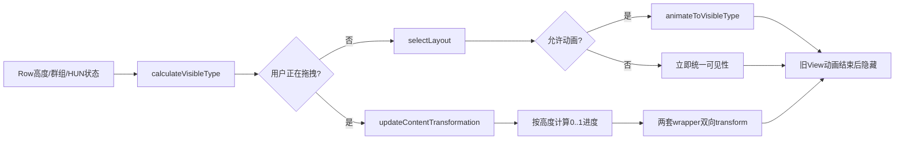
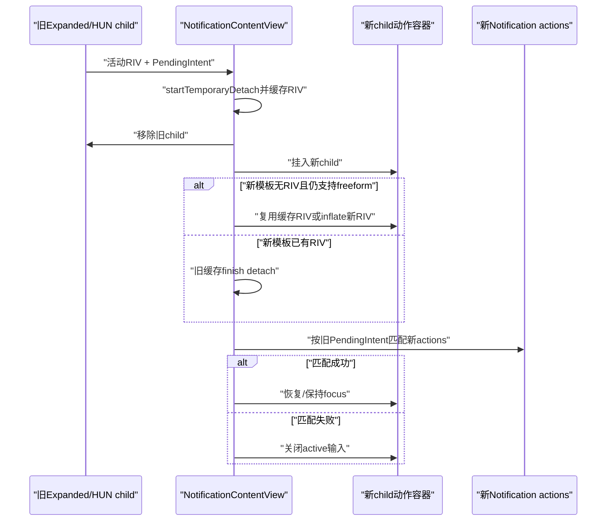
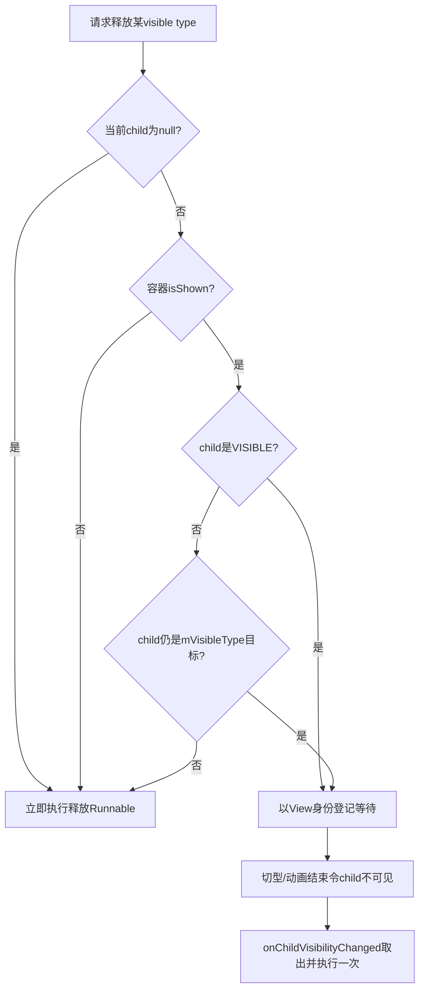

# 第 489 章 Android SystemUI NotificationContentView：可见类型选择、内容变换、RemoteInput保留和inactive释放判定链

> 源码基线：Android 11 / API 30 / `android-11.0.0_r48`。本章只在 macOS 阅读，不实际编译。核心文件：`frameworks/base/packages/SystemUI/src/com/android/systemui/statusbar/notification/row/NotificationContentView.java`；交叉阅读 `NotificationContentInflater.java`、`RemoteInputView.java`、`ExpandableNotificationRow.java` 与 `NotificationContentViewTest.java`。

## 1. 本章解决什么问题

第488章解释了RemoteViews怎样生成并挂到Row；本章继续回答：contracted、expanded、heads-up、single-line四套真实View都在容器里时，谁决定当前显示哪一套，拖拽时怎样连续变形，正在输入的RemoteInput怎样跨布局和重建保留，旧内容又在什么时刻才可安全释放？

## 2. 一句话主线

`NotificationContentView`保存多套child与wrapper，以Row状态和内容高度计算`mVisibleType`；普通切换走一次动画，手势扩缩走双View连续transform；重建expanded/HUN时暂存活动RemoteInput，释放旧内容则等待对应View既非当前目标又已不可见。

## 3. 它是多内容容器而非单个通知模板

一条通知的private layout通常持有contracted、expanded和heads-up child；群组内子通知还可能有single-line child。容器不负责创建RemoteViews描述，但负责这些真实View的布局、切换、裁剪和生命周期协调。

## 4. private与public各有一个容器

`ExpandableNotificationRow`通常有private和public两个`NotificationContentView`。public脱敏内容虽然只使用contracted槽位，仍复用同一容器类型；因此源码注释允许public layout没有contracted child并返回NONE。

## 5. 四个可见类型与NONE

CONTRACTED=普通折叠，EXPANDED=展开，HEADSUP=悬浮提醒，SINGLELINE=折叠群组里的单行子项；NONE=-1表示没有可展示内容。single-line与NONE是private常量，外部主要操作前三种。

## 6. child与wrapper是两层对象

`View`是RemoteViews真正生成的树；`NotificationViewWrapper`把标准模板或自定义模板统一成`TransformableView`，提供变形、可见性、背景色、header translation、expand button等能力。single-line自身实现TransformableView，不另包wrapper。

## 7. 三个容易混淆的类型字段

`mVisibleType`是当前目标类型；`mTransformationStartVisibleType`记录手指驱动变形的起点；`mAnimationStartVisibleType`记录一次自动动画的旧类型。旧类型仍在过渡时不能立刻释放。

## 8. 两个初值并不对称

`mVisibleType`显式初始化为NONE，第一次layout时`mForceSelectNextLayout=true`强制统一可见性；但`mTransformationStartVisibleType`没有初始化，Java默认值0恰好等于CONTRACTED。后者要到手势结束、对应child移除等路径才明确清为NONE，所以首次手势结束前，`isVisibleOrTransitioning(CONTRACTED)`可能持续为true，并影响HUN/pinned的min-height hint判断。这是r48源码事实，不应把两个字段都概括成“初始NONE”。

## 9. 核心字段源码

```java
public static final int VISIBLE_TYPE_CONTRACTED = 0;
public static final int VISIBLE_TYPE_EXPANDED = 1;
public static final int VISIBLE_TYPE_HEADSUP = 2;
private static final int VISIBLE_TYPE_SINGLELINE = 3;
/**
 * Used when there is no content on the view such as when we're a public layout but don't
 * need to show.
 */
private static final int VISIBLE_TYPE_NONE = -1;

private View mContractedChild;
private View mExpandedChild;
private View mHeadsUpChild;
private HybridNotificationView mSingleLineView;

private RemoteInputView mExpandedRemoteInput;
private RemoteInputView mHeadsUpRemoteInput;

private int mContentHeight;
private int mVisibleType = VISIBLE_TYPE_NONE;
/** The visible type at the start of a touch driven transformation */
private int mTransformationStartVisibleType;
/** The visible type at the start of an animation driven transformation */
private int mAnimationStartVisibleType = VISIBLE_TYPE_NONE;
```

这段先建立“内容形态账”和“过渡起点账”，后面所有选择、动画和释放都围绕它们展开。

## 10. 总体状态流图



## 11. setContentHeight同时保存两个高度

`mUnrestrictedContentHeight`至少为`getMinHeight()`，表示Row希望显示的实际内容范围；`mContentHeight`还会受intrinsicHeight与RemoteInput额外高度修正，主要用于选择哪种模板。两者不能互换。

## 12. 为什么扣掉RemoteInput额外高度

输入框激活、IME联动可能把Row撑高；若把这部分高度直接拿去选模板，打开回复框可能意外把HUN或contracted判断成expanded。源码从intrinsic height中减去expanded和HUN RemoteInput的extra height，再与unrestricted height取min。

## 13. 扣减结果没有显式下限

`maxContentHeight=intrinsic-extraExpanded-extraHun`后直接取min，没有在此处`max(0, ...)`。正常上游尺寸合同应保证合理值；静态阅读时应记录这是依赖外部不变量，而不是本方法自证安全。

## 14. 内容选择发生得很频繁

高度变化、layout、HUN状态、HUN正在离场、用户扩缩结束、child被移除等路径都会调用`selectLayout`。因此`mVisibleType`是派生状态缓存，不是只在点击展开按钮时改变一次。

## 15. 首帧不做切换动画

容器可见后注册pre-draw listener，第一帧绘制后再post把`mAnimate=true`；这样初次出现只建立终态，不会把“初始化NONE→某类型”误画成一次切换动画。

## 16. setVisible(false)关闭动画资格

容器不再显示时移除pre-draw listener并令`mAnimate=false`。再次显示仍要等至少一次pre-draw之后才恢复动画资格，避免离屏或首帧动画。

## 17. onLayout会重新选择

layout先记录expanded旧高度，若新高度改变则保存`mContentHeightAtAnimationStart`，随后更新裁剪、outline并调用`selectLayout(false, force)`。布局阶段本身明确不请求自动内容动画。

## 18. expanded尺寸变化也参与min-height hint

当expanded自身内容变高或变矮，hint取动画起点高度与新expanded高度的较小者，让底部动作区对齐时优先裁剪，而不是在过渡中继续压缩内部模板。

## 19. min-height hint不是可见类型

它传给wrapper用于底部元素对齐和内部裁剪；真正选contracted/HUN/expanded仍由`calculateVisibleType`决定。二者都读高度，但解决的问题不同。

## 20. 普通模式先限制intrinsicHeight

非手势模式令`viewHeight=min(mContentHeight, intrinsicHeight)`；intrinsic为0被视为刚reset，退回mContentHeight。0不是“通知真实高度就是0”。

## 21. 精确等于expanded高度优先

只要expanded child存在且`viewHeight==expanded view height`，`getVisualTypeForHeight`先返回EXPANDED，甚至早于群组single-line与HUN分支。这一精确等号的优先级很容易被概括式讲解漏掉。

## 22. 群组折叠时优先single-line

非手势扩缩、是group child且group未展开时，返回SINGLELINE。single-line不是contracted模板的缩小版，而是`HybridNotificationView`生成的独立简化内容。

## 23. 手势扩缩时暂不走single-line早退

上述分支带`!mUserExpanding`；拖拽期间要在起点和终点形态间transform，不能每一帧都被“群组未展开”强制钉回single-line。

## 24. HUN资格是三重条件

需要`mIsHeadsUp || mHeadsUpAnimatingAway`、HUN child非空、并且Row `canShowHeadsUp()`。仅仅生成了heads-up RemoteViews不代表当前必须显示它。

## 25. HUN高度阈值的含义

在HUN资格成立时，如果当前高度不超过HUN高度，或根本没有expanded child，则选HEADSUP；超过HUN高度且expanded存在，选EXPANDED，使固定HUN被用户向下拉时能进入展开形态。

## 26. headsUpAnimatingAway仍保持HUN分支

HUN开始离场后不能马上切contracted，否则动画过程中内容会跳型；`mHeadsUpAnimatingAway`把资格延长到离场完成。

## 27. 没有expanded时回contracted

非HUN路径中`noExpandedChild`直接满足contracted条件。即便当前高度很大，也不能返回一个不存在的expanded child。

## 28. contracted阈值还看群组展开语义

高度不超过contracted并不足够；group child未展开时，还要结合Row自身`isExpanded(allowOnKeyguard)`，防止某些群组语义下错误退回contracted。

## 29. 有expanded且未命中contracted就expanded

剩余正常分支只要expanded存在便返回EXPANDED；最后NONE理论上只在expanded缺失且前面的contracted条件也未成立时出现，常见public无内容路径更多由入口提前返回处理。

## 30. 可见类型选择源码

```java
public int calculateVisibleType() {
    if (mUserExpanding) {
        int height = !mIsChildInGroup || isGroupExpanded()
                || mContainingNotification.isExpanded(true /* allowOnKeyguard */)
                ? mContainingNotification.getMaxContentHeight()
                : mContainingNotification.getShowingLayout().getMinHeight();
        if (height == 0) {
            height = mContentHeight;
        }
        int expandedVisualType = getVisualTypeForHeight(height);
        int collapsedVisualType = mIsChildInGroup && !isGroupExpanded()
                ? VISIBLE_TYPE_SINGLELINE
                : getVisualTypeForHeight(mContainingNotification.getCollapsedHeight());
        return mTransformationStartVisibleType == collapsedVisualType
                ? expandedVisualType
                : collapsedVisualType;
    }
    int intrinsicHeight = mContainingNotification.getIntrinsicHeight();
    int viewHeight = mContentHeight;
    if (intrinsicHeight != 0) {
        // the intrinsicHeight might be 0 because it was just reset.
        viewHeight = Math.min(mContentHeight, intrinsicHeight);
    }
    return getVisualTypeForHeight(viewHeight);
}

private int getVisualTypeForHeight(float viewHeight) {
    boolean noExpandedChild = mExpandedChild == null;
    if (!noExpandedChild && viewHeight == getViewHeight(VISIBLE_TYPE_EXPANDED)) {
        return VISIBLE_TYPE_EXPANDED;
    }
    if (!mUserExpanding && mIsChildInGroup && !isGroupExpanded()) {
        return VISIBLE_TYPE_SINGLELINE;
    }

    if ((mIsHeadsUp || mHeadsUpAnimatingAway) && mHeadsUpChild != null
            && mContainingNotification.canShowHeadsUp()) {
        if (viewHeight <= getViewHeight(VISIBLE_TYPE_HEADSUP) || noExpandedChild) {
            return VISIBLE_TYPE_HEADSUP;
        } else {
            return VISIBLE_TYPE_EXPANDED;
        }
    } else {
        if (noExpandedChild || (mContractedChild != null
                && viewHeight <= getViewHeight(VISIBLE_TYPE_CONTRACTED)
                && (!mIsChildInGroup || isGroupExpanded()
                        || !mContainingNotification.isExpanded(true /* allowOnKeyguard */)))) {
            return VISIBLE_TYPE_CONTRACTED;
        } else if (!noExpandedChild) {
            return VISIBLE_TYPE_EXPANDED;
        } else {
            return VISIBLE_TYPE_NONE;
        }
    }
}
```

阅读顺序应是：先看手势是否改成“端点选择”，再看expanded精确等高，最后才看single-line、HUN和普通阈值。

## 31. 手势模式不按当前高度直接选类型

它先计算collapsed endpoint与expanded endpoint，然后检查起点是不是collapsed：若是就把目标设为expanded，否则目标设为collapsed。也就是说`mVisibleType`表示这次变形的另一端，不是手指所在高度最近的模板。

## 32. 手势终点高度来源有分支

普通通知、已展开群组或Row自身expanded用`getMaxContentHeight()`；折叠群组里的子项用showing layout的min height。若结果暂为0，再退回当前content height。

## 33. collapsed endpoint也有两种

折叠群组子项固定SINGLELINE；其他情况用Row collapsedHeight再次跑同一视觉类型函数，因此HUN状态可能使“collapsed endpoint”实际成为HEADSUP，而非CONTRACTED。

## 34. setUserExpanding(true)冻结起点

方法把当时`mVisibleType`写入`mTransformationStartVisibleType`。后续每帧高度变化都围绕这个固定起点计算，不会因中途目标切换而丢失方向。

## 35. setUserExpanding(false)立即收口

结束时清起点、重算visible type、立即统一各child可见性并更新背景，不继续依赖残留transform。它不在这里请求收尾动画。

## 36. transformation和animation不是同一机制

前者由用户高度连续驱动，显式传0..1 progress；后者由wrapper内部动画从旧型到新型，结束Runnable再隐藏旧View。两者分别使用不同start字段。

## 37. 用户变形先应对旧View被移除

若当前visible type对应wrapper为null，说明变形中内容被重新膨胀或释放；代码直接改目标、统一可见性、更新背景并return，不尝试对null wrapper做transform。

## 38. 目标类型改变时先建立0进度

把旧visible记为transformation start，新wrapper从旧wrapper以0进度开始，先将新真实View设VISIBLE，再让旧wrapper transformTo新wrapper的0态，最后才更新`mVisibleType`。

## 39. 两套View在手势中同时可见

这不是重复显示bug；TransformableView会分别控制内部元素的alpha、translation等。直到手势结束统一visibility，起点View才真正隐藏。

## 40. 背景色也按同一进度插值

起止wrapper颜色不同就插值；任一颜色为0时用Row无tint背景色替代。Row background alpha和content background一起更新，使模板变形与卡片背景变化同步。

## 41. 变形进度由高度距离计算

`abs(current-startHeight)/abs(endHeight-startHeight)`并最多截到1；它没有显式下限，但progress由abs产生非负。高度超过终点后保持1，不继续外推。

## 42. 起终高度相同直接视为完成

totalDistance为0会`Log.wtf`并返回1。这样避免除0，但也说明两种不同视觉类型拥有相同高度被视作违反预期的诊断事件。

## 43. 手势变换核心源码

```java
private void updateContentTransformation() {
    int visibleType = calculateVisibleType();
    if (getTransformableViewForVisibleType(mVisibleType) == null) {
        // Case where visible view was removed in middle of transformation. In this case, we
        // just update immediately to the appropriate view.
        mVisibleType = visibleType;
        updateViewVisibilities(visibleType);
        updateBackgroundColor(false);
        return;
    }
    if (visibleType != mVisibleType) {
        // A new transformation starts
        mTransformationStartVisibleType = mVisibleType;
        final TransformableView shownView = getTransformableViewForVisibleType(visibleType);
        final TransformableView hiddenView = getTransformableViewForVisibleType(
                mTransformationStartVisibleType);
        shownView.transformFrom(hiddenView, 0.0f);
        getViewForVisibleType(visibleType).setVisibility(View.VISIBLE);
        hiddenView.transformTo(shownView, 0.0f);
        mVisibleType = visibleType;
        updateBackgroundColor(true /* animate */);
    }
    if (mForceSelectNextLayout) {
        forceUpdateVisibilities();
    }
    if (mTransformationStartVisibleType != VISIBLE_TYPE_NONE
            && mVisibleType != mTransformationStartVisibleType
            && getViewForVisibleType(mTransformationStartVisibleType) != null) {
        final TransformableView shownView = getTransformableViewForVisibleType(mVisibleType);
        final TransformableView hiddenView = getTransformableViewForVisibleType(
                mTransformationStartVisibleType);
        float transformationAmount = calculateTransformationAmount();
        shownView.transformFrom(hiddenView, transformationAmount);
        hiddenView.transformTo(shownView, transformationAmount);
        updateBackgroundTransformation(transformationAmount);
    } else {
        updateViewVisibilities(visibleType);
        updateBackgroundColor(false);
    }
}
```

关键不是“新View淡入、旧View淡出”这么简单，而是两边wrapper都用同一目标和同一进度计算自己的内部元素状态。

## 44. forceSelect会中断未完成动画

`forceUpdateVisibilities`逐类取消不需要的显示状态，并显式把`mAnimationStartVisibleType`清NONE。否则动画已被wrapper取消，但状态账仍会声称旧类型正在过渡。

## 45. 普通selectLayout的入口保护

contracted child为null就return。public layout不需要展示内容时，这避免后续默认类型映射把NONE误当contracted并解引用空View。

## 46. 非手势切换先把目标View设VISIBLE

`visibleView.setVisibility(VISIBLE)`发生在焦点迁移和动画之前；新wrapper必须先参与绘制，才能从旧wrapper变形。

## 47. animate参数还要通过类型存在性检查

expanded、HUN、single-line必须各自child存在；contracted类型直接允许。条件失败就立即`updateViewVisibilities`，不会为不存在的模板启动动画。

## 48. mVisibleType在动画启动后更新

`animateToVisibleType`调用时仍能通过旧`mVisibleType`取得hidden wrapper；返回后才把字段写成新类型。回调结束时则读取最新字段，避免把后来又成为当前的wrapper误隐藏。

## 49. 同一wrapper无需双向动画

如果shown与hidden是同一TransformableView，或hidden为null，只令shown visible并return。默认映射会把未知/NONE映射contracted wrapper，这种保护尤其重要。

## 50. 自动动画记录旧类型

真正跨wrapper时把旧`mVisibleType`写入`mAnimationStartVisibleType`。min-height hint和“是否仍在过渡”判断都能把旧类型算进去。

## 51. 动画结束回调有当前身份复查

只有`hiddenView != getTransformableViewForVisibleType(mVisibleType)`才隐藏旧wrapper；若中途状态又切回旧类型，回调不会把现任内容隐藏。

## 52. 但动画start字段没有代际号

每次新动画会覆盖同一个`mAnimationStartVisibleType`，旧回调结束时也无条件清NONE。若wrapper取消合同没有完全阻止旧回调，理论上可能提前清掉新动画账；源码依赖TransformableView动画取消/回调时序。

## 53. force与普通结束都会清动画账

`updateViewVisibilities`和`forceUpdateVisibilities`都显式清`mAnimationStartVisibleType`，因为wrapper的setVisible可能取消动画却不会替容器维护这项字段。

## 54. visible wrapper只覆盖三种标准模板

`getVisibleWrapper(SINGLELINE)`返回null；single-line本身不是NotificationViewWrapper。因此背景色、expand button和某些wrapper height更新对single-line会跳过，这是类型设计而非漏判。

## 55. 默认类型映射是contracted

`getViewForVisibleType`和`getTransformableViewForVisibleType`的default都返回contracted。调用者必须先处理NONE和空contracted；否则NONE不是“得到null”，而可能落到contracted。

## 56. getAllViews的顺序不是类型编号顺序

返回contracted、heads-up、expanded、single-line；类型编号却是contracted、expanded、heads-up、single-line。不要用数组下标猜visible type。

## 57. setHeadsUp立即强制重选

它更新`mIsHeadsUp`，调用`selectLayout(false, true)`，再更新expand buttons。HUN状态改变不在这里播放内容切换动画。

## 58. setHeadsUpAnimatingAway同样强制重选

离场标志更新后走无动画force选择，确保HUN在退场阶段仍符合类型判断，结束后再收敛到contracted或expanded。

## 59. 可访问性焦点是一次性请求

`setFocusOnVisibilityChange()`只置boolean；下一次类型真的changed时找新visible wrapper的expand button请求accessibility focus，然后清flag。force但类型未变不会消费它。

## 60. expanded visible listener也是一次性

只有listener非空、expanded child非空、容器`isShown()`且expanded child为VISIBLE才运行并清空。容器稍后聚合可见时，`onVisibilityAggregated(true)`会再尝试。

## 61. listener看到的是视觉可见而非动画完成

新expanded View在动画开始前已设VISIBLE，所以`fireExpandedVisibleListenerIfVisible`可能在变形刚开始就回调；名称不是“expanded transition finished”。

## 62. clipping使用unrestricted高度

clip bottom按`mUnrestrictedContentHeight - bottomClip - translationY`计算，而不是模板选择使用的mContentHeight。选择哪套模板与最终画面裁到哪里仍是两层状态。

## 63. wrapper高度包含header translation

`getViewHeight`先取真实View高度，再加wrapper的header translation。视觉类型阈值和变形距离因此不是简单的`View.getHeight()`。

## 64. child替换先处理活动输入

设置新的expanded child前，旧expanded RemoteInput会先`onNotificationUpdateOrReset()`；若仍active，记录它的PendingIntent，把RemoteInputView本体缓存并开始temporary detach，再从旧父容器移走。

## 65. 只缓存active RemoteInput

非active输入框不会被摘下复用；新内容稍后可重新inflate一个RemoteInputView。保留机制服务于正在编辑/聚焦的用户会话，而不是普通View对象池。

## 66. 为什么保存PendingIntent

通知更新后action数组可能变化。旧RemoteInput只有在新通知里找到匹配action时才应继续输入；PendingIntent是这次回复动作身份的桥梁。

## 67. temporary detach保护View生命周期

直接从parent移除通常会走永久detach语义；`dispatchStartTemporaryDetach`与稍后的finish配对，告诉View这是跨模板搬迁，不是最终销毁。

## 68. 旧child的inactive listener被直接移除

`setExpandedChild`和`setHeadsUpChild`替换旧child时，会从map删除以旧View为key的listener，而不是执行它。这说明第488章延迟free协议假定真正替换动作本身已完成释放目的。

## 69. 替换会取消旧child属性动画

先`animate().cancel()`再removeView，避免旧child离开容器后属性动画仍持有或修改它；wrapper内部transform动画的取消还依赖wrapper/setVisible合同。

## 70. child为null时修复状态账

若被删类型等于手势起点，就清transformation start；若恰是当前visible type，则强制无动画重选其他类型。删除不是只把字段置null。

## 71. 新child加入后才创建wrapper

`addView(child)`、保存字段、`NotificationViewWrapper.wrap(...)`，随后为expanded/HUN应用bubble action。RemoteInput和Smart Reply要等通知更新的统一apply阶段再装配。

## 72. expanded替换源码

```java
public void setExpandedChild(@Nullable View child) {
    if (mExpandedChild != null) {
        mPreviousExpandedRemoteInputIntent = null;
        if (mExpandedRemoteInput != null) {
            mExpandedRemoteInput.onNotificationUpdateOrReset();
            if (mExpandedRemoteInput.isActive()) {
                mPreviousExpandedRemoteInputIntent = mExpandedRemoteInput.getPendingIntent();
                mCachedExpandedRemoteInput = mExpandedRemoteInput;
                mExpandedRemoteInput.dispatchStartTemporaryDetach();
                ((ViewGroup)mExpandedRemoteInput.getParent()).removeView(mExpandedRemoteInput);
            }
        }
        mOnContentViewInactiveListeners.remove(mExpandedChild);
        mExpandedChild.animate().cancel();
        removeView(mExpandedChild);
        mExpandedRemoteInput = null;
    }
    if (child == null) {
        mExpandedChild = null;
        mExpandedWrapper = null;
        if (mTransformationStartVisibleType == VISIBLE_TYPE_EXPANDED) {
            mTransformationStartVisibleType = VISIBLE_TYPE_NONE;
        }
        if (mVisibleType == VISIBLE_TYPE_EXPANDED) {
            selectLayout(false /* animate */, true /* force */);
        }
        return;
    }
    addView(child);
    mExpandedChild = child;
    mExpandedWrapper = NotificationViewWrapper.wrap(getContext(), child,
            mContainingNotification);
    if (mContainingNotification != null) {
        applyBubbleAction(mExpandedChild, mContainingNotification.getEntry());
    }
}
```

heads-up版本几乎对称，分别使用heads-up的RemoteInput、PendingIntent、cache和wrapper字段。

## 73. contracted替换没有RemoteInput缓存

自由回复输入框只装进expanded和HUN动作区；contracted child替换只移inactive listener、取消动画、remove旧View并wrap新View。

## 74. RemoteInput装配需要Controller

`applyRemoteInputAndSmartReply`发现`mRemoteInputController==null`就整体return，RemoteInput与Smart Reply都不继续。测试或某些初始化场景不能只看child存在就假设输入框已装配。

## 75. expanded与HUN分别尝试复用

入口对两套child各调用一次内部`applyRemoteInput`，传各自previous PendingIntent、cached RemoteInput和wrapper；两套输入框状态独立保存。

## 76. 未复用的cache必须结束temporary detach

内部返回的View不是cached对象时，外层调用`dispatchFinishTemporaryDetach()`清理旧缓存，然后无论如何把cache字段置null。缓存只跨一次通知更新。

## 77. action container是硬前提

新模板必须能找到`com.android.internal.R.id.actions_container`且它是FrameLayout；否则内部返回null。自定义RemoteViews没有标准动作容器时，SystemUI不会硬塞输入框。

## 78. 新模板可能已经自带RemoteInputView

先按`RemoteInputView.VIEW_TAG`查existing。存在时调用`onNotificationUpdateOrReset`并优先使用它；此时旧cached active View不会被重新挂入，外层随后结束旧对象temporary detach。

## 79. 没有existing且支持自由回复才创建

cache为空就inflate新RIV、初始设INVISIBLE并MATCH_PARENT加入动作容器；cache存在则直接add、finish temporary detach、requestFocus并作为existing。

## 80. hasRemoteInput为false不新建

如果模板里原本有tagged existing，方法仍可能返回它，但不会执行颜色、wrapper、listener或PendingIntent匹配分支；若没有existing则返回null。旧active cache会由外层完成detach但不会挂回。

## 81. hasRemoteInput为true隐含existing非空

正常路径中要么模板已有，要么本方法刚inflate/复用，所以随后的`existing.setBackgroundColor`没有null检查。它依赖action container与创建分支共同建立不变量。

## 82. 背景色会做对比度修正

通知默认色改用SystemUI默认RemoteInput背景；非默认色也经过`ensureTextBackgroundColor`，同时考虑enabled文本色和hint色，避免应用颜色让输入文字不可读。

## 83. wrapper和可见回调会重新绑定

无论复用旧RIV还是使用新RIV，都给它设置当前wrapper与`setRemoteInputVisible`监听，避免缓存对象仍指向旧模板包装层。

## 84. PendingIntent匹配只在需要恢复时执行

条件是previous intent非空，或existing当前active。普通未激活的新输入框不扫描action数组，等用户点击具体回复action时再建立会话。

## 85. previous intent先写回existing

缓存对象或新模板已有对象都先获得旧PendingIntent，再调用`updatePendingIntentFromActions(actions)`在新通知actions中寻找兼容项。

## 86. 匹配成功会恢复焦点

若匹配成功而existing尚未active，调用`focus()`；已经active则保持。这样重新膨胀模板后，用户的回复会话尽量连续。

## 87. 匹配失败只关闭active输入

action已经消失或PendingIntent不再有效时，active existing会`close()`；非active对象不额外关闭。保留输入不能越过动作身份变更。

## 88. RemoteInput重建链图



## 89. RemoteInput装配源码

```java
private RemoteInputView applyRemoteInput(View view, NotificationEntry entry,
        boolean hasRemoteInput, PendingIntent existingPendingIntent,
        RemoteInputView cachedView, NotificationViewWrapper wrapper) {
    View actionContainerCandidate = view.findViewById(
            com.android.internal.R.id.actions_container);
    if (actionContainerCandidate instanceof FrameLayout) {
        RemoteInputView existing = (RemoteInputView)
                view.findViewWithTag(RemoteInputView.VIEW_TAG);

        if (existing != null) {
            existing.onNotificationUpdateOrReset();
        }

        if (existing == null && hasRemoteInput) {
            ViewGroup actionContainer = (FrameLayout) actionContainerCandidate;
            if (cachedView == null) {
                RemoteInputView riv = RemoteInputView.inflate(
                        mContext, actionContainer, entry, mRemoteInputController);

                riv.setVisibility(View.INVISIBLE);
                actionContainer.addView(riv, new LayoutParams(
                        ViewGroup.LayoutParams.MATCH_PARENT,
                        ViewGroup.LayoutParams.MATCH_PARENT)
                );
                existing = riv;
            } else {
                actionContainer.addView(cachedView);
                cachedView.dispatchFinishTemporaryDetach();
                cachedView.requestFocus();
                existing = cachedView;
            }
        }
        if (hasRemoteInput) {
            int color = entry.getSbn().getNotification().color;
            if (color == Notification.COLOR_DEFAULT) {
                color = mContext.getColor(R.color.default_remote_input_background);
            }
            existing.setBackgroundColor(ContrastColorUtil.ensureTextBackgroundColor(color,
                    mContext.getColor(R.color.remote_input_text_enabled),
                    mContext.getColor(R.color.remote_input_hint)));

            existing.setWrapper(wrapper);
            existing.setOnVisibilityChangedListener(this::setRemoteInputVisible);

            if (existingPendingIntent != null || existing.isActive()) {
                // The current action could be gone, or the pending intent no longer valid.
                // If we find a matching action in the new notification, focus, otherwise close.
                Notification.Action[] actions = entry.getSbn().getNotification().actions;
                if (existingPendingIntent != null) {
                    existing.setPendingIntent(existingPendingIntent);
                }
                if (existing.updatePendingIntentFromActions(actions)) {
                    if (!existing.isActive()) {
                        existing.focus();
                    }
                } else {
                    if (existing.isActive()) {
                        existing.close();
                    }
                }
            }
        }
        return existing;
    }
    return null;
}
```

这段说明“保留输入”并非无条件搬View，而是View临时搬迁与action身份重验两道门。

## 90. 类型切换时还有焦点迁移

普通`selectLayout`在显示目标View后调用`transferRemoteInputFocus`。目标是HUN且expanded RIV active，就让HUN RIV从expanded偷焦点；反向同理。

## 91. 焦点迁移只覆盖HUN与expanded

contracted和single-line没有RemoteInput字段，因此不会参与。切到这两种形态时，输入会话的收起/保持由Row、RemoteInputController及可见性链共同处理，不在本方法直接转移。

## 92. 焦点迁移要求两边RIV都存在

源必须active，目标也必须非null；若目标模板没有自由回复或尚未装配，代码不会创建替代焦点，也不会在这里强制关闭源。

## 93. setRemoved向子对象传播终止

Row最终移除时，expanded/HUN RemoteInput与各wrapper收到`setRemoved`，media transfer也清expanded/contracted。它与temporary detach是不同语义：前者是真正结束通知生命周期。

## 94. inactive不是简单的INVISIBLE

源码定义：容器整体不shown，或某View不VISIBLE且它又不是当前visible type对应的View，才算inactive。当前目标即使暂时INVISIBLE，也被保护为active。

## 95. 为什么保护当前目标身份

状态字段可能已切到新类型，但wrapper visibility尚在同一调用或动画链里更新；若只看`getVisibility()!=VISIBLE`，第488章的free runnable可能在新目标真正出现前把它删掉。

## 96. 过渡旧View靠VISIBLE得到保护

isContentViewInactive没有显式检查两个start字段；动画或手势起点View之所以仍active，是因为它在过渡期间保持VISIBLE。最终wrapper隐藏它时，child visibility callback才触发释放。



## 97. 已inactive时listener同步运行

`performWhenContentInactive`发现View为null或判定inactive，会在当前调用栈直接执行Runnable；调用者不能假设它总是异步回调。

## 98. active时以View身份登记

map的key是真实View，不是visible type。这样类型后来切换后，旧child变INVISIBLE的callback仍能精确找到当初等待的Runnable。

## 99. 每个View最多保存一个listener

ArrayMap `put(view, listener)`会覆盖同一View先前listener，并不会形成列表。上层正常协议应保证每个内容槽同一时刻只有一个pending free。

## 100. cancel也是按当前View反查

`removeContentInactiveRunnable(visibleType)`先取得该类型当前child，再remove map key。若登记后child对象已被替换，它可能找不到旧对象上的登记；而setChild替换路径会主动remove旧key，形成另一条收口。

## 101. child变不可见时执行一次

`onChildVisibilityChanged`重新判定该child；一旦inactive，从map remove listener再run。先remove可避免Runnable重入时再次取得同一项。

## 102. 容器整体隐藏会批量执行

`onVisibilityChanged`发现容器visibility不是VISIBLE，会复制map values、逐个运行，再clear。复制是为了Runnable可能修改map，避免直接迭代时并发修改。

## 103. 批量执行存在重入覆盖边界

它先复制旧values，执行完所有Runnable后才`clear()`；若某个Runnable重入并登记了新的inactive listener，这个新项也会被最后的clear清掉。正常上游应避免在容器隐藏清理回调中重新require内容。

## 104. isShown变化不只来自自身visibility

祖先隐藏或窗口不可见也会令`isShown()`为false，但本类批量清理只挂在自身`onVisibilityChanged`，child释放还依赖child visibility回调。若仅祖先状态改变且没有这些回调，登记中的listener不保证当场执行。

## 105. inactive判定与回调源码

```java
void performWhenContentInactive(int visibleType, Runnable listener) {
    View view = getViewForVisibleType(visibleType);
    // View is already inactive
    if (view == null || isContentViewInactive(visibleType)) {
        listener.run();
        return;
    }
    mOnContentViewInactiveListeners.put(view, listener);
}

void removeContentInactiveRunnable(int visibleType) {
    View view = getViewForVisibleType(visibleType);
    // View is already inactive
    if (view == null) {
        return;
    }

    mOnContentViewInactiveListeners.remove(view);
}

public boolean isContentViewInactive(int visibleType) {
    View view = getViewForVisibleType(visibleType);
    return isContentViewInactive(view);
}

private boolean isContentViewInactive(View view) {
    if (view == null) {
        return true;
    }
    return !isShown()
            || (view.getVisibility() != VISIBLE && getViewForVisibleType(mVisibleType) != view);
}

@Override
protected void onChildVisibilityChanged(View child, int oldVisibility, int newVisibility) {
    super.onChildVisibilityChanged(child, oldVisibility, newVisibility);
    if (isContentViewInactive(child)) {
        Runnable listener = mOnContentViewInactiveListeners.remove(child);
        if (listener != null) {
            listener.run();
        }
    }
}
```

要把“View物理可见性”和“它是不是当前目标身份”一起读，才能理解为何判断式看起来比`visibility != VISIBLE`更复杂。

## 106. 测试文件只有两项

`NotificationContentViewTest`声明2个`@Test`：一个验证AppOps图标投到三套header；另一个验证类型变化后expand button获得accessibility focus。

## 107. 焦点测试顺带固定一个选择细节

测试注释指出HUN是contracted的替代形态；在其构造的高度条件下`setHeadsUp(true)`最终进入expanded，并验证只有expanded expand button收到焦点。

## 108. 主状态机几乎没有直接单测

本地测试未直接覆盖`calculateVisibleType`的群组/HUN阈值、手势transform进度、自动动画中途反转、RemoteInput cache与PendingIntent重验、inactive listener的同步/延迟/替换身份。

## 109. 不能把“有测试文件”当成核心链已覆盖

这里测试数量与生产文件约两千行规模不匹配。静态阅读得出的竞态边界应标记为源码推论，而不是声称已有失败测试证明。

## 110. 一套类型选择诊断顺序

遇到“通知显示错模板”，依次记录：四套child是否存在、group child/group expanded、Row expanded、isHeadsUp/animatingAway/canShowHeadsUp、content/intrinsic/各View高度、userExpanding与两个start type、最终mVisibleType。

## 111. 一套输入丢失诊断顺序

先看旧RIV是否active、previous PendingIntent是否捕获、temporary detach是否配对、新模板是否有FrameLayout actions container/自带RIV、hasFreeformRemoteInput、新actions能否匹配旧PendingIntent，再看expanded↔HUN focus transfer是否两边对象齐全。

## 112. macOS只读练习一：手算可见类型

只读`calculateVisibleType/getVisualTypeForHeight`，自建四组纸面输入：折叠group child、普通HUN低高度、HUN高于HUN模板、无expanded child；逐分支写出返回类型，不运行也不编译。

## 113. macOS只读练习二：画手势双端点

从`setUserExpanding(true)`开始，画出single-line→expanded与HUN→expanded两种起终点，任选三档content height手算transformation amount，并标出两套View为何同时VISIBLE。

## 114. macOS只读练习三：推演RemoteInput重建

分别推演“旧active RIV且新action匹配”“新模板已自带RIV”“action消失”三条路径，记录cached View、temporary detach、existing PendingIntent、focus/close的最终状态。

## 115. macOS只读练习四：审计inactive释放

以同一个expanded View推演四刻：当前可见、动画旧View仍VISIBLE、动画结束变INVISIBLE、容器整体隐藏；逐次代入判定式，并检查listener是登记、child callback执行还是立即执行。

## 116. 易错理解一：mVisibleType就是眼下唯一VISIBLE的View

错。它是当前目标类型；过渡时旧View也可VISIBLE，甚至目标字段更新与wrapper终态之间有短暂窗口。真正画面要联合start type、View visibility和wrapper transform状态。

## 117. 易错理解二：RemoteInput复用只要把旧View挂回去

错。还要检查新模板动作容器、自由回复资格，并用旧PendingIntent在新actions中重新匹配；匹配失败必须关闭active会话，防止把输入发送给已消失的动作。

## 118. 易错理解三：inactive等于View.INVISIBLE

错。当前目标即使暂时不可见仍被保护；容器整体不shown则所有内容都可判inactive；过渡旧View因仍VISIBLE也不能释放。

## 119. 复读后的最终心智模型

把本类想成四本协同账：child/wrapper库存账、当前与过渡类型账、高度/裁剪几何账、RemoteInput与pending-free生命周期账。任何显示跳变、输入丢失或旧View未释放，都应先找哪两本账在同一时刻失配，而不是只盯一个boolean。

## 120. 本章结论与下一章

`NotificationContentView`把多套RemoteViews产物变成连续、可交互且可安全替换的视觉状态机：高度只是一项输入，群组/HUN/Row状态决定端点，wrapper负责形变，PendingIntent守住回复动作身份，View identity与visibility共同守住释放时机。下一章继续阅读`NotificationViewWrapper`家族与`TransformState`，追两套模板内部标题、图标、文本和动作控件究竟怎样逐元素匹配与变形。
