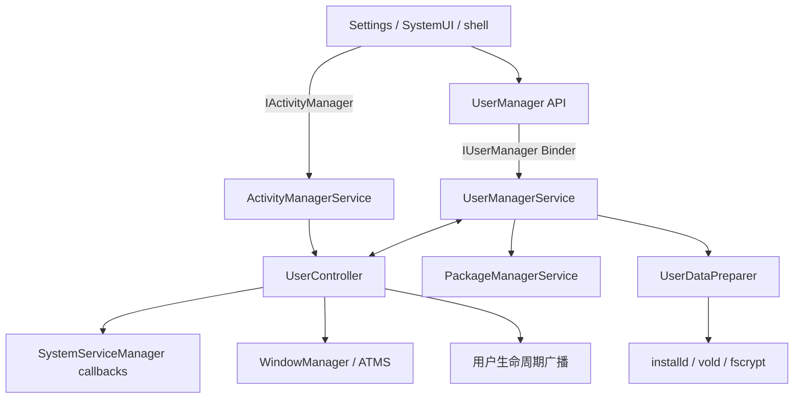
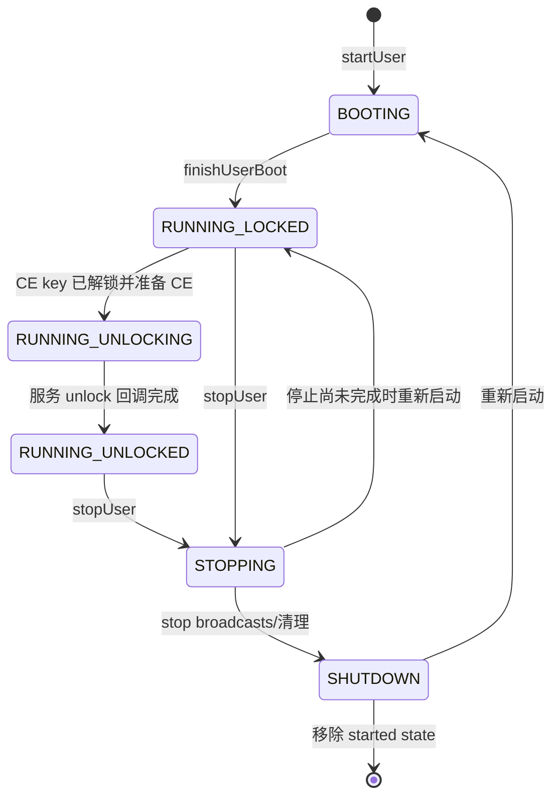
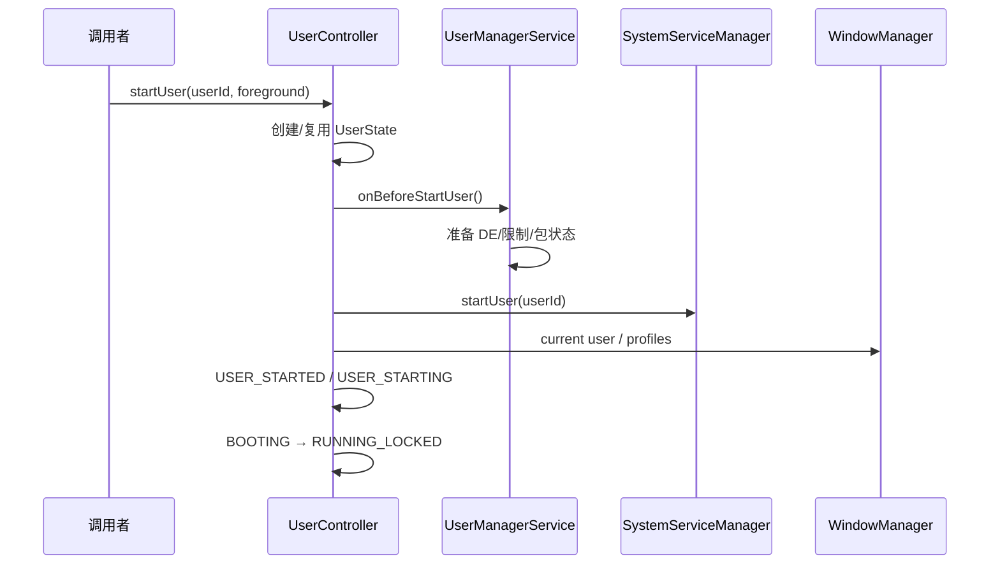
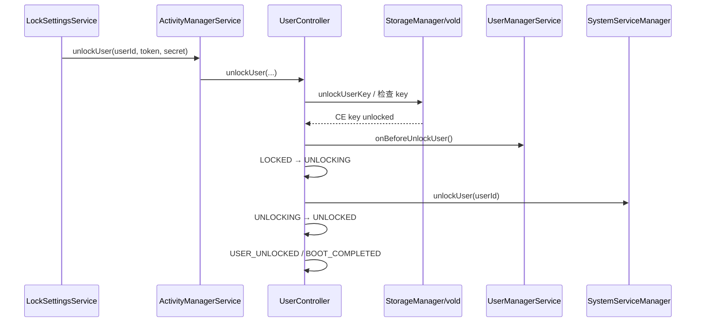

# 49 UserManagerService、UserController、用户启动与多用户隔离

> 源码版本：Android 11 / API 30 / `android-11.0.0_r48`  
> 学习方式：macOS 上只读源码，不要求编译。  
> 本章目标：理解 Android user 的身份、配置、运行状态、存储和应用实例如何组合，并能追踪创建、启动、切换、解锁、停止与删除用户的完整链路。

---

## 1. 先建立总模型

Android 多用户不是在同一个应用进程里切换一套偏好设置，而是把同一个 APK 映射成多个相互隔离的用户实例：

```text
同一个 package / appId
+ 不同 userId
= 不同 Linux UID
+ 不同应用数据目录
+ 不同权限、组件启用状态和运行进程
```

例如 appId 为 `10123`：

```text
user 0  → uid 10123
user 10 → uid 1010123
```

两者可复用同一份 APK 代码，却默认看不到彼此的数据。

---

## 2. 两个核心服务各负责什么

### 2.1 UserManagerService（UMS）

源码：

```text
frameworks/base/services/core/java/com/android/server/pm/UserManagerService.java
```

它管理相对持久的“用户是谁”：

- `UserInfo`、userId、serialNumber；
- 用户类型、flags、profile 关系；
- 用户限制和账户相关元数据；
- 创建、删除用户；
- 用户 XML 持久化；
- DE/CE 用户目录准备；
- 向其他服务发布用户元信息与状态查询。

### 2.2 UserController

源码：

```text
frameworks/base/services/core/java/com/android/server/am/UserController.java
```

它位于 AMS 体系中，管理动态的“用户现在运行到哪一步”：

- 启动用户；
- 切换前台用户；
- 驱动锁定启动、解锁和 boot completed；
- 停止用户并杀进程；
- 维护当前用户、目标用户、已启动用户和 LRU；
- 调用各 SystemService 的用户生命周期回调。

一句话区分：

```text
UMS 管用户档案与持久配置；UserController 管用户运行时状态机。
```

---

## 3. 整体架构



两个核心类都运行在 `system_server`，但会跨 Binder 调用 vold、installd 等 native 服务，并通知大量 Framework 服务。

---

## 4. userId、appId、uid 三者区别

### userId

表示 Android 用户或 profile，例如 0、10、11。

### appId

表示包在所有用户间共享的应用身份编号，例如 10123。它通常由 PMS 分配。

### uid

表示某个用户中的某个 app 实例。Android 11 公式：

```java
uid = userId * PER_USER_RANGE + appId
```

其中：

```java
UserHandle.PER_USER_RANGE = 100000;
```

源码实现会对 appId 取模：

```java
return userId * PER_USER_RANGE + (appId % PER_USER_RANGE);
```

反向解析：

```text
userId = uid / 100000
appId  = uid % 100000
```

---

## 5. 一个计算例子

假设：

```text
userId = 10
appId  = 10123
```

则：

```text
uid = 10 × 100000 + 10123 = 1010123
```

因此日志里的七位 UID 并不是“安装了一百万个应用”，而是在编码 userId。

排查权限或文件 owner 时，第一步经常是拆出 userId 与 appId。

---

## 6. 特殊 UserHandle 不是真实用户

常见特殊值：

- `USER_SYSTEM = 0`：系统用户；
- `USER_ALL`：表示所有用户的操作目标；
- `USER_CURRENT`：当前前台用户；
- `USER_CURRENT_OR_SELF`：当前用户或调用者自己；
- `USER_NULL`：无有效用户。

`USER_ALL`、`USER_CURRENT` 等是 API 语义占位符，不能直接当作真实数据目录编号使用。服务端必须先解析成具体 userId，并进行跨用户权限检查。

---

## 7. serialNumber 为什么不能被 userId 替代

userId 删除后可能在未来被复用。serialNumber 是随用户创建递增的持久世代标识，用于防止旧目录或旧状态被误认为新用户数据。

因此准备用户数据时常同时传：

```text
userId + userSerial
```

可以理解为：

```text
userId = 当前运行编号
serialNumber = 这个编号属于哪一代用户
```

只比较 userId 可能遭遇“ABA”问题：编号看起来相同，实际已是另一个用户。

---

## 8. UserInfo 保存什么

`android.content.pm.UserInfo` 包含：

- id、name、iconPath；
- flags；
- serialNumber；
- creationTime、lastLoggedInTime；
- profileGroupId、restrictedProfileParentId；
- userType；
- partial、preCreated、guestToRemove 等状态。

Android 11 已引入 user type 配置。flags 表示 admin、guest、managed profile、initialized 等属性，但不要仅凭单个 flag 猜测全部行为；类型配置与设备资源同样会决定限制和系统包安装策略。

---

## 9. 用户元数据如何持久化

UMS 的用户信息目录：

```text
/data/system/users/
```

常见结构近似：

```text
/data/system/users/userlist.xml
/data/system/users/0.xml
/data/system/users/10.xml
/data/system/users/10/
```

`userlist.xml` 维护整体列表和下一个 serial；单用户 XML 保存用户信息、限制等。`AtomicFile` 用于降低写入中断导致文件损坏的风险。

这些是用户“档案”，不等于用户的应用数据目录。

---

## 10. 多用户数据目录

常见目录心智模型：

```text
/data/user_de/<userId>/<package>/  // DE 应用数据
/data/user/<userId>/<package>/     // CE 应用数据，通常映射到 /data/user_ce
/data/system_de/<userId>/          // 系统 DE 数据
/data/system_ce/<userId>/          // 系统 CE 数据
```

还可能涉及 misc、profiles、media 等每用户目录。目录创建与权限标签不能只靠 Java `mkdir`，需要 vold、installd、fscrypt、SELinux 配合。

---

## 11. UserDataPreparer 的职责

源码：

```text
frameworks/base/services/core/java/com/android/server/pm/UserDataPreparer.java
```

它协调：

- 准备 DE 或 CE 用户根目录；
- 对内部和可采纳存储卷执行准备；
- 校验目录 inode/serial；
- 出错时尝试恢复或标记损坏；
- 开机时 reconcile 磁盘目录与有效用户列表。

创建用户时先准备 DE/CE 结构；启动前再次确保 DE；解锁前准备 CE。不同阶段的 prepare 不是无意义重复，而是保证幂等与故障恢复。

---

## 12. 同一 APK 如何服务多个用户

APK 通常只需在 `/data/app` 保存一份代码。PMS 为每个用户保存不同的 `PackageUserState`：

- installed；
- enabled state；
- stopped；
- suspended；
- hidden；
- instant app；
- enabled/disabled components；
- overlay paths 等。

所以：

```text
“设备上有 APK” ≠ “该包对每个用户都已安装并启用”
```

应用代码共享，运行身份和数据隔离。

---

## 13. 多用户隔离的五层

### 13.1 UID 隔离

不同 userId 产生不同 Linux UID。

### 13.2 文件系统隔离

每用户 DE/CE 数据目录的 owner、mode、SELinux label 不同。

### 13.3 PackageUserState

安装、启用和组件状态按用户保存。

### 13.4 Framework 跨用户检查

Binder 服务解析 calling UID 的 userId，并检查 `INTERACT_ACROSS_USERS` 或 `INTERACT_ACROSS_USERS_FULL`。

### 13.5 SELinux/AppOps/权限

跨用户能力仍受 SELinux、运行时权限和 AppOps 等共同限制。

多用户安全不是只靠 `uid / 100000` 一个公式完成的。

---

## 14. Android 用户状态机

`UserState.java` 定义：

```text
BOOTING
RUNNING_LOCKED
RUNNING_UNLOCKING
RUNNING_UNLOCKED
STOPPING
SHUTDOWN
```



状态转换使用 `setState(old, new)` 校验预期旧状态，避免过期异步消息把用户推进到错误状态。

---

## 15. “用户存在”和“用户运行”不同

一个用户可以：

- 已存在但未运行；
- 正在 BOOTING；
- 运行但 CE 锁定；
- 正在解锁；
- 已完全解锁；
- 正在停止。

UMS 的用户列表回答“是否存在”；UserController 的 `mStartedUsers` 和 `UserState` 回答“是否运行”。

删除用户与停止用户也不同：停止只终止本次运行，用户档案和数据通常仍保留；删除才移除持久用户与数据。

---

## 16. “前台用户”和“已解锁用户”不同

前台用户是当前 UI、配置、窗口和交互目标；后台用户也可能保持运行甚至已解锁。

反过来，一个刚切到前台的用户可能仍处于 `RUNNING_LOCKED`，正在等待锁屏凭据。

```text
foreground/background：交互位置
locked/unlocked：CE 与生命周期状态
running/stopped：进程和服务运行状态
```

这是三条独立维度，不能压缩成一个布尔值。

---

## 17. 启动用户的入口

核心方法：

```java
UserController.startUser(userId, foreground, unlockListener)
```

入口可能来自：

- 开机启动 system user；
- SystemUI 用户切换器；
- `am start-user`；
- profile 自动启动；
- 系统内部后台用户策略。

它先检查用户是否存在、是否允许启动、是否为 profile/特殊用户，并避免在不合适线程持锁执行复杂流程。

---

## 18. `startUser()` 的核心工作

大致步骤：

1. 查找或创建 `UserState`；
2. 更新 `mStartedUsers` 与 LRU；
3. 若切前台，更新 current/target user；
4. 通知 WMS 当前用户和 profile；
5. `onBeforeStartUser()` 准备 DE、限制和包状态；
6. 通知 SystemServiceManager `startUser`；
7. 发送 `ACTION_USER_STARTED` / `ACTION_USER_STARTING`；
8. 前台则执行 switch 流程，后台则直接 finish boot；
9. 进入 `RUNNING_LOCKED`；
10. 如果 CE 已可用，尝试继续解锁。



---

## 19. `RUNNING_LOCKED` 能做什么

进入该状态意味着用户已经启动，但 CE 数据尚未确认可用。Direct Boot aware 组件可访问 DE 数据并响应锁定启动事件。

`finishUserBoot()` 发送：

```text
ACTION_LOCKED_BOOT_COMPLETED
```

广播接收方需要 `RECEIVE_BOOT_COMPLETED`。Direct Boot unaware 应用不能假定此时普通 credential-protected 数据已经能读。

---

## 20. `maybeUnlockUser()` 为什么可能传空 token

UserController 在 finish boot 后尝试：

```java
unlockUserCleared(userId, null, null, null)
```

无锁屏、存储已解锁或不需用户提供凭据时可能直接成功。有安全锁屏且 CE 仍锁定时不会凭空绕过认证，而是等待第 48 章 LSS 在凭据验证后携带 token/secret 再调用。

“尝试空参数解锁”不等于“所有用户都能无密码解锁”。真正裁决在存储密钥状态与 vold。

---

## 21. 解锁主链与上一章如何衔接



关键前置条件：`finishUserUnlocking()` 首先检查：

```java
StorageManager.isUserKeyUnlocked(userId)
```

CE key 没解开，就不能仅靠修改 UserState 假装用户已解锁。

---

## 22. `RUNNING_UNLOCKING` 期间做什么

进入前，`UserManagerService.onBeforeUnlockUser()` 准备 CE 应用数据。随后：

- 状态从 LOCKED 变为 UNLOCKING；
- `SystemServiceManager.unlockUser(userId)` 分发到系统服务；
- 各服务可读取该用户 CE 状态、初始化数据库或恢复会话；
- 完成后进入 `finishUserUnlocked()`。

这是一个真实的过渡阶段，不应在业务代码中简单等同于 unlocked。

---

## 23. `RUNNING_UNLOCKED` 的完成动作

`finishUserUnlocked()` 会：

- 再次确认 CE key 仍解锁；
- 原子式检查旧状态并转为 UNLOCKED；
- 完成进度监听；
- 启动 encryption-unaware persistent app/provider；
- 发送 `ACTION_USER_UNLOCKED`；
- 对工作资料向父用户发送 `ACTION_MANAGED_PROFILE_UNLOCKED`；
- 系统升级后先发送 PRE_BOOT；
- 首次使用时发送 USER_INITIALIZE；
- 启动 widget；
- 最终发送该用户的 `ACTION_BOOT_COMPLETED`。

因此看到 `USER_UNLOCKED` 不一定代表所有 `BOOT_COMPLETED` receiver 都已经执行完。

---

## 24. 用户生命周期广播顺序

源码注释给出的典型顺序：

```text
USER_STARTED
USER_BACKGROUND / USER_FOREGROUND（按场景）
USER_SWITCHED（前台切换）
USER_STARTING
LOCKED_BOOT_COMPLETED
USER_UNLOCKED
PRE_BOOT_COMPLETED（系统更新时）
USER_INITIALIZE（首次启动时）
BOOT_COMPLETED
```

不是每种用户、每次启动都会收到全部广播。有些只发给注册 receiver，有些跨用户发送，有些是 ordered broadcast。

---

## 25. SystemService 的用户回调

除广播外，Framework 系统服务通过 `SystemServiceManager` 收到：

```text
onStartUser
onUnlockUser
onSwitchUser
onStopUser
onCleanupUser
```

系统服务应把按用户资源放进以 userId 为 key 的容器，并在 stop/cleanup 时释放 observer、Binder connection、数据库句柄和缓存。

只监听广播可能太晚；只实现 start 回调却忘记 cleanup 容易导致跨用户泄漏。

---

## 26. 前台切换不是简单修改整数

`switchUser(targetUserId)` 大致涉及：

- 校验目标用户可切换；
- 设置 `mTargetUserId`；
- 启动目标用户为 foreground；
- 更新 configuration 与 current profile IDs；
- WMS 切换当前用户和窗口；
- 锁屏保护切换过程；
- 通知 user switch observers；
- 处理超时 observer；
- 发送 foreground/background/switched 广播；
- ATMS 切换用户的 Activity/Task 可见性。

旧用户不一定立刻停止，它可能转入后台继续运行。

---

## 27. 为什么需要 target user 和 current user

用户切换是异步过程：UI 已请求从 0 切到 10，但窗口、observer、配置和锁屏尚未全部完成。

因此：

- `mCurrentUserId`：Framework 当前认可的前台用户；
- `mTargetUserId`：正在切换到的目标；
- observer callback：协调各组件完成；
- timeout：防止某个 observer 永久卡住切换。

把“用户点了头像”当成“所有服务已经完成切换”会产生竞态。

---

## 28. Profile 与完整用户的区别

Profile 与父用户共享某些人机交互语境，但仍拥有：

- 独立 userId 与 UID 空间；
- 独立应用数据；
- 独立 PackageUserState；
- 独立 CE key；
- 独立策略和限制；
- 独立运行/解锁状态。

Managed Profile 常用于工作资料。它通常不作为独立全屏前台用户切换，而是与父用户同时出现在 launcher/通知等界面中。

---

## 29. Profile group 的意义

`profileGroupId` 把父用户与若干 profile 关联起来。UserController 更新 current profile IDs，使 WMS、通知、输入和 Activity 可见性等组件知道当前前台用户关联哪些 profile。

“属于同一 profile group”不等于可以随意读对方数据。跨 profile 通信仍需受控 Intent filter、系统 API、DevicePolicy 和权限检查。

---

## 30. Managed Profile 为什么延迟解锁

`finishUserBoot()` 明确检查 profile 的父用户是否 `AND_UNLOCKED`。父用户未解锁时，profile 的自动解锁会被延迟。

统一挑战的 profile 还需要父用户 Keystore 解密其随机 profile credential，再验证 profile 自己的安全体系。因此依赖父用户不等于共享同一密钥。

---

## 31. 用户限制从哪里来

限制可能来自：

- 用户类型默认限制；
- base restrictions；
- DevicePolicyManager 的设备所有者或资料所有者；
- system/user 管理策略。

UMS 会计算 effective restrictions 并通知相关服务。诸如“不允许安装应用、不允许添加用户、不允许调试”等不能只在 Settings UI 隐藏按钮；真正执行服务仍需检查限制。

---

## 32. 跨用户 Binder 调用怎样检查

服务常见流程：

1. 从 `Binder.getCallingUid()` 得到 calling userId；
2. 解析 `USER_CURRENT` 等特殊值；
3. 若目标不是调用者自己，检查 `INTERACT_ACROSS_USERS` 或更严格的 `INTERACT_ACROSS_USERS_FULL`；
4. 检查目标 user/profile 是否允许该操作；
5. 清除 Binder identity 后以内核系统身份执行内部调用；
6. 最终恢复 identity。

`clearCallingIdentity()` 不是授权机制。它必须在已经完成调用方权限验证后使用。

---

## 33. Broadcast 的 user 范围

同一个 Intent 可以：

- 仅发给指定 userId；
- 发给当前用户；
- 发给所有用户；
- 通过 profile group 做受控传播。

Manifest receiver 的解析和动态 receiver 的注册都带 user 语境。一个用户中的应用默认不会收到另一个用户的普通广播。

排查“广播没收到”时，除了 action/permission，还必须检查 sendingUser、targetUser 和 receiver 所在 UID 的 userId。

---

## 34. ContentProvider 与 Service 的多用户语境

获取 Provider、启动 Service、启动 Activity 时，请求都带调用者/目标 user 语境。AMS/PMS 会按用户解析组件和创建进程。

某些系统 Provider 可声明 `singleUser` 或由特殊系统身份跨用户服务，但这是受权限保护的例外。普通应用不能因为 authority 名相同就访问另一个用户的 Provider 数据。

---

## 35. 创建用户主链

UMS 的 `createUserInternalUncheckedNoTracing()` 是核心入口之一。简化步骤：

1. 检查类型、数量、限制和磁盘空间；
2. 分配 userId 与 serialNumber；
3. 创建 `UserInfo/UserData`，先标记 partial；
4. 写用户 XML 与列表；
5. `UserDataPreparer.prepareUserData()` 创建 DE/CE 结构；
6. 通知 PMS 创建 per-user package 状态；
7. 应用默认限制、系统包白名单和账户/profile 配置；
8. 完成后清除 partial；
9. 发送用户创建通知。

先写 partial 是故障恢复设计：若中途崩溃，下次启动可识别未完成用户并清理，而不是把半成品当作正常用户。

---

## 36. 为什么创建用户不等于启动用户

创建只产生持久身份、目录和包状态。用户进程、服务、广播和前台 UI 并不会自动全部运行。

```text
createUser → 用户存在
startUser  → 用户进入运行状态机
unlockUser → CE 与解锁生命周期推进
switchUser → 成为前台交互用户
```

四个动作可组合，但语义不同。

---

## 37. 删除用户主链

删除不是立刻递归删目录：

1. 校验不能删除 system/current 等受保护用户；
2. 标记 `partial` / `FLAG_DISABLED` 或 removing；
3. 从可见用户列表排除，防止重新启动；
4. 请求 AMS `stopUser()`；
5. 发送关闭广播并杀掉用户进程；
6. PMS 清理 per-user package 状态；
7. vold/installd 销毁用户数据与密钥；
8. 删除 XML、限制、图标等元数据；
9. 更新 userlist。

先标记再异步清理同样用于崩溃恢复和防止删除过程中被重新使用。

---

## 38. 停止用户的状态机

```text
RUNNING_* → STOPPING → SHUTDOWN → 从 mStartedUsers 移除
```

停止过程包括：

- 防止停止 system/current user；
- 通知 SystemService stop；
- 停止该用户 Activity/Service/Provider；
- 发送 `ACTION_SHUTDOWN`；
- 杀用户进程；
- cleanup 回调；
- 视策略锁定/驱逐 CE key；
- 调用 stop callbacks。

若 STOPPING 尚未发送 shutdown 就重新 start，可以恢复上一个状态；若已到 SHUTDOWN，则必须当作新一次 BOOTING。

---

## 39. delayed locking 是什么

部分设备为了更快恢复后台用户，停止用户进程时可延迟锁定其 CE key，受最大运行/解锁用户数量和设备能力限制。

因此：

```text
用户不在前台 ≠ 用户已停止
用户已停止 ≠ CE key 必然已立即驱逐
```

安全敏感代码应查询明确的用户/存储状态，不能用前台状态推断密钥状态。

---

## 40. max running users 与 LRU

Android 同时运行用户数量有限。UserController 维护用户 LRU：

- 当前用户不可被停止；
- system user 特殊处理；
- profile 通常与父用户关联考虑；
- 超出上限时选择较旧后台用户停止；
- delayed locking 决定是否同步驱逐 key。

这不是应用进程 OOM LRU，而是用户级运行资源管理。

---

## 41. System user 的特殊性

user 0 是 system user，承载系统级服务和许多设备范围状态。某些设备采用 headless system user 模式：user 0 后台运行，另一个 full user 成为人机交互前台用户。

因此“system user”不必然等于“当前坐在屏幕前的用户”。源码中很多 `USER_SYSTEM` 特判是平台基础设施需要，不应简单复制进普通业务逻辑。

---

## 42. Direct Boot aware 的真实意义

组件声明 direct-boot aware，表示它能在 `RUNNING_LOCKED` 阶段运行并只依赖 DE 数据。

正确设计：

- DE 只存启动前确实需要的数据；
- CE 存用户敏感和常规数据；
- locked boot 中不能意外触碰 CE 数据库；
- 收到 user unlocked 后再迁移到完整功能。

Direct Boot aware 不是“绕过锁屏读取所有文件”的权限。

---

## 43. 常见故障定位表

| 现象 | 优先检查 |
|---|---|
| 用户存在但无法切换 | UserInfo flags/type、restriction、switchability |
| 已切换但只看到锁屏 | 目标 user 处于 RUNNING_LOCKED，属于正常阶段 |
| 正确密码后应用数据打不开 | CE key、onBeforeUnlockUser、UNLOCKING 状态 |
| USER_UNLOCKED 收到但 BOOT_COMPLETED 未到 | PRE_BOOT/初始化/ordered receiver 是否卡住 |
| 工作资料未解锁 | 父用户状态、统一挑战、quiet mode、profile key |
| 同包两个用户数据串了 | 错用 device-wide 缓存、未按 userId 分 key、跨用户 Context |
| 广播在另一个用户收不到 | target user、权限、receiver 用户、注册范围 |
| 删除后残留目录 | partial/removing 状态、PMS、installd/vold 清理 |
| 日志 UID 很大 | 先用 UserHandle 拆出 userId/appId |

---

## 44. 多用户 bug 的固定排查法

### 第一步：写出四元组

```text
(callingUid, callingUserId, targetUserId, appId)
```

### 第二步：写出三种状态

```text
存在状态：UserInfo 是否存在/partial/removing
运行状态：BOOTING/LOCKED/UNLOCKING/UNLOCKED/STOPPING
前台状态：current/target/background
```

### 第三步：确认存储域

访问的是 DE 还是 CE？对应 user key 是否解锁？

### 第四步：确认包的用户状态

该包对目标 user 是否 installed/enabled/stopped/suspended？

### 第五步：确认跨用户授权

调用者是否有跨用户权限？是否在验证后才 clear identity？

---

## 45. 源码阅读地图

### 用户身份和 API

```text
frameworks/base/core/java/android/os/UserHandle.java
frameworks/base/core/java/android/os/UserManager.java
frameworks/base/core/java/android/os/IUserManager.aidl
frameworks/base/core/java/android/content/pm/UserInfo.java
frameworks/base/core/java/android/content/pm/PackageUserState.java
```

### 用户持久配置

```text
frameworks/base/services/core/java/com/android/server/pm/UserManagerService.java
frameworks/base/services/core/java/com/android/server/pm/UserDataPreparer.java
frameworks/base/services/core/java/com/android/server/pm/UserSystemPackageInstaller.java
```

### 运行时状态机

```text
frameworks/base/services/core/java/com/android/server/am/UserController.java
frameworks/base/services/core/java/com/android/server/am/UserState.java
frameworks/base/services/core/java/com/android/server/am/ActivityManagerService.java
frameworks/base/services/core/java/com/android/server/SystemServiceManager.java
```

### 存储和包数据

```text
system/vold/FsCrypt.cpp
system/vold/VoldNativeService.cpp
frameworks/native/cmds/installd/InstalldNativeService.cpp
frameworks/base/services/core/java/com/android/server/pm/PackageManagerService.java
```

---

## 46. 推荐阅读顺序

1. `UserHandle.getUid/getUserId/getAppId`：先掌握身份编码；
2. `UserInfo`：看持久用户属性；
3. `UserState`：记住六个运行状态；
4. `UserManagerService` 构造与用户 XML 读取；
5. `createUserInternalUncheckedNoTracing()`：追创建；
6. `UserDataPreparer`：追 DE/CE 目录；
7. `UserController.startUser()`：追启动；
8. `finishUserBoot/Unlocking/Unlocked`：追状态推进；
9. `switchUser()`：追前台切换；
10. `stopUser/removeUserUnchecked()`：追停止和删除。

---

## 47. 八组只读练习

### 练习一：计算 UID

任选两个 appId 和两个 userId，计算 uid，再用源码公式反解。

### 练习二：画三维状态表

分别列出存在/运行、前台/后台、DE/CE 可用三条维度，证明它们不能合并。

### 练习三：追后台启动

从 `startUser(id, false)` 追到 LOCKED_BOOT_COMPLETED，标记所有跨服务调用。

### 练习四：追解锁

从 `unlockUser()` 追 `isUserKeyUnlocked`、`onBeforeUnlockUser`、SSM 回调和 USER_UNLOCKED。

### 练习五：追前台切换

记录 current/target user、WMS、ATMS、observer 和三个切换广播的顺序。

### 练习六：追创建

标出 userId、serialNumber、partial、prepareUserData 和 PMS per-user state。

### 练习七：追删除

说明为什么先标记 removing/partial，再停止用户，最后才删目录。

### 练习八：追跨用户权限

找一个接受 userId 的 Binder API，记录 calling user、目标 user、权限检查与 identity 清除顺序。

---

## 48. 初学者最容易混淆的十二点

1. Android user 不是 Linux user 的简单 UI 包装，但最终会编码进 Linux UID。
2. userId、appId、uid 是三个概念。
3. userId 可以复用，serialNumber 用来区分世代。
4. 用户存在不代表正在运行。
5. 正在运行不代表 CE 已解锁。
6. 前台用户不一定已经解锁；后台用户也可能保持解锁运行。
7. `LOCKED_BOOT_COMPLETED` 不等于 `BOOT_COMPLETED`。
8. 同一 APK 的代码可共享，但用户数据和 UID 分离。
9. profile 依赖父用户不等于与父用户共享数据目录或 CE key。
10. 停止用户不等于删除用户。
11. `USER_ALL`、`USER_CURRENT` 是选择器，不是真实目录编号。
12. `clearCallingIdentity()` 不能代替跨用户权限检查。

---

## 49. 本章心智模型

遇到多用户问题，按四张表思考：

```text
身份表：userId + appId → uid
档案表：UserInfo + user XML + restrictions
运行表：UserState + current/target/started users
数据表：PackageUserState + DE/CE directories + fscrypt key
```

生命周期则记为：

```text
create（建立身份）
→ start（启动 DE 世界）
→ unlock（打开 CE 世界）
→ switch（成为前台，可选）
→ stop（结束运行）
→ remove（删除身份和数据，可选）
```

---

## 50. 本章总结

Android 11 的多用户体系由 UMS 和 UserController 分工协作：UMS 管理持久用户档案、限制、profile 关系和数据准备；UserController 管理启动、锁定运行、解锁、前台切换、停止和广播回调。

完整主线可以概括为：

```text
UMS 创建 UserInfo、userId/serial 与每用户包状态
→ UserDataPreparer 建立 DE/CE 数据边界
→ UserController.startUser 创建 UserState
→ BOOTING → RUNNING_LOCKED，发送 locked boot
→ LockSettings/vold 解开 CE key
→ RUNNING_UNLOCKING，通知系统服务
→ RUNNING_UNLOCKED，发送 USER_UNLOCKED 和 BOOT_COMPLETED
→ switchUser 协调 WMS/ATMS/UI 和 observers
→ stop/remove 分阶段停止进程、驱逐 key、清除包状态与目录
```

最应该记住的是：**Android 多用户隔离由 UID、文件系统、包用户状态、Framework 权限和加密密钥共同建立；“当前用户”只是运行时视角中的一个维度。**

---

## 51. 下一章预告

下一章进入设备管理体系：

> **第 50 章：DevicePolicyManagerService、Device Owner、Profile Owner 与企业管控**

它会解释设备所有者和资料所有者如何建立、策略怎样持久化并下沉到权限、网络、锁屏、应用和用户限制，以及工作资料的隔离边界如何被企业策略控制。
