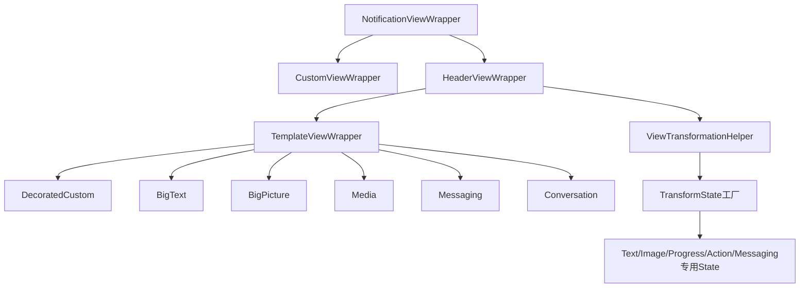
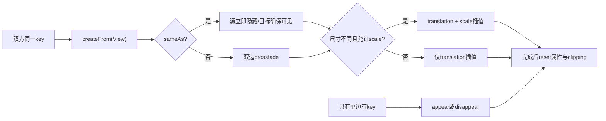
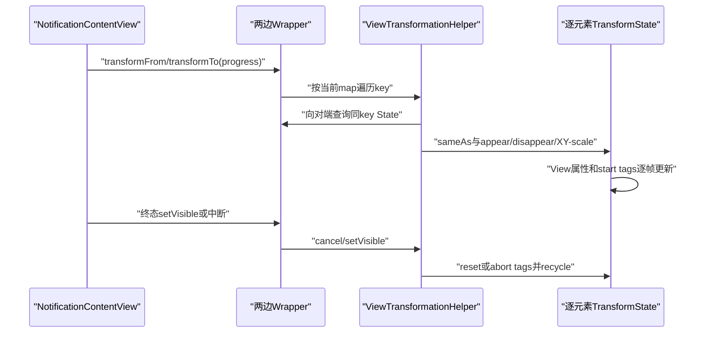

# 第 490 章 Android SystemUI NotificationViewWrapper 与 TransformState：模板分类、逐元素匹配、变形和复位链

> 源码基线：Android 11 / API 30 / `android-11.0.0_r48`。本章只在 macOS 阅读，不实际编译。核心文件：`NotificationViewWrapper.java`、`NotificationHeaderViewWrapper.java`、`NotificationTemplateViewWrapper.java`、`ViewTransformationHelper.java`、`TransformState.java`；交叉阅读各模板Wrapper、各专用TransformState及本地测试。

## 1. 本章解决什么问题

第489章只看到wrapper间调用`transformFrom/To`；本章进入wrapper内部，回答不同模板怎样分类，标题怎样找标题、图标怎样找图标，匹配与不匹配元素分别怎样移动、缩放或淡变，以及中断后怎样恢复正常属性。

## 2. 一句话主线

Factory按根id、tag、Style和View类型选Wrapper；Header/Template Wrapper把关键子View登记到语义key，Helper在两套内容间按key取TransformState；State再按View种类判断sameAs并插值位置、缩放和alpha，结束或取消时复位tag与裁剪。

## 3. 为什么不能整张View交叉淡变

contracted与expanded里通常都有相同小图标、应用名和标题。整张淡变会产生重影；逐元素匹配能让同一个语义对象平滑移动，只让新增或消失的正文、图片、动作淡变。

## 4. Wrapper是模板适配器

它把系统模板、header-only、自定义RemoteViews统一成`TransformableView`，同时封装背景、暗色兼容、expand button、动作区位置、圆角裁剪和RemoteInput历史显示等差异。

## 5. Factory先认系统模板根id

根id为`status_bar_latest_event_content`才进入标准模板分类；否则若根本身是NotificationHeaderView选Header wrapper，其余一律Custom wrapper。

## 6. 标准模板再看tag

tag依次识别bigPicture、bigText、media/bigMediaNarrow、messaging、conversation；conversation还强转`ConversationLayout`。tag是SystemUI对模板形态的快速协议。

## 7. DecoratedCustom靠Notification Style补判

未命中特殊tag时读取当前Notification style；若是DecoratedCustomViewStyle，选DecoratedCustom wrapper，否则选普通Template wrapper。

## 8. tag判断优先于Style判断

一个根先命中messaging等tag就不会再检查DecoratedCustom style；Factory不是把所有属性汇总打分，而是有固定优先顺序。

## 9. Factory源码

```java
public static NotificationViewWrapper wrap(Context ctx, View v, ExpandableNotificationRow row) {
    if (v.getId() == com.android.internal.R.id.status_bar_latest_event_content) {
        if ("bigPicture".equals(v.getTag())) {
            return new NotificationBigPictureTemplateViewWrapper(ctx, v, row);
        } else if ("bigText".equals(v.getTag())) {
            return new NotificationBigTextTemplateViewWrapper(ctx, v, row);
        } else if ("media".equals(v.getTag()) || "bigMediaNarrow".equals(v.getTag())) {
            return new NotificationMediaTemplateViewWrapper(ctx, v, row);
        } else if ("messaging".equals(v.getTag())) {
            return new NotificationMessagingTemplateViewWrapper(ctx, v, row);
        } else if ("conversation".equals(v.getTag())) {
            return new NotificationConversationTemplateViewWrapper(ctx, (ConversationLayout) v,
                    row);
        }
        Class<? extends Notification.Style> style =
                row.getEntry().getSbn().getNotification().getNotificationStyle();
        if (Notification.DecoratedCustomViewStyle.class.equals(style)) {
            return new NotificationDecoratedCustomViewWrapper(ctx, v, row);
        }
        return new NotificationTemplateViewWrapper(ctx, v, row);
    } else if (v instanceof NotificationHeaderView) {
        return new NotificationHeaderViewWrapper(ctx, v, row);
    } else {
        return new NotificationCustomViewWrapper(ctx, v, row);
    }
}
```

这段决定后续有哪些语义子View、专用State和额外策略可用。

## 10. Wrapper层次图



## 11. 基类构造立即提取背景

构造调用`onReinflated`：若策略允许先清旧背景账，再读取根View背景。只认识ColorDrawable；非透明色被保存到`mBackgroundColor`，根背景替换为透明，让Row统一绘制卡片背景。

## 12. 非ColorDrawable被当透明

GradientDrawable、StateListDrawable或复杂背景不会被解析成颜色；基类只做确定可证的纯色迁移。

## 13. summary忽略子模板自定义背景

`getCustomBackgroundColor`发现Row是带children的summary就返回0，父通知使用统一正常背景，避免summary模板自带色破坏群组卡片。

## 14. Custom wrapper保留reapply背景账

它覆盖`shouldClearBackgroundOnReapply=false`；RemoteViews reapply可能已被基类第一次置透明，不能在下一次更新先把已保存颜色清掉。

## 15. Custom默认只整View淡变

基类`getCurrentState`返回null，transformTo/From使用CrossFadeHelper作用于根View；它不知道应用自定义布局内部哪些元素语义相同。

## 16. Custom setVisible还显式设alpha

基类只取消View animator并切VISIBLE/INVISIBLE；Custom wrapper额外把alpha设1或0，确保被交叉淡变过的根View恢复终态。

## 17. 夜间反色只照顾旧target SDK

需处于night mode、targetSdk<Q、背景非彩色，并且是浅灰白背景或发现低对比文本；target Q及以上要求应用自己修暗色兼容。

## 18. 反色在YUV空间反亮度

`invertViewLuminosity`给View设置hardware layer与ColorMatrixColorFilter，RGB→YUV后反Y再转回RGB，尽量保留色度。

## 19. 反色layer没有对应清除路径

Custom `onContentUpdated`需要反色时设置hardware layer；条件后来不需要时，本类没有显式`setLayerType(NONE,null)`。同一View reapply且环境/内容改变时可能保留旧filter，依赖View重建或外部生命周期收口。

## 20. Header wrapper建立变形助手

标准Header不走根View交叉淡变，而是创建`ViewTransformationHelper`，解析icon、header text、app name、expand、work badge、AppOps与audibly alerted等子View。

## 21. onContentUpdated必须重新resolve

RemoteViews reapply可能替换ViewStub或改变子树；wrapper每次更新重新findViewById，再重建transformed map，而不是永久信任构造时引用。

## 22. previous/current集合用于复位退役View

更新前复制旧transforming Views，更新后取得新集合；旧集合中已不再登记的View调用`resetTransformedView`，清translation、scale、alpha和clipping状态。

## 23. 不复位会留下半动画属性

某次选择独立title，下一次改为让其父容器整体变形；旧title若仍带translation/scale，会叠加父容器新变换，产生位置漂移。

## 24. Header基础语义key

小图标固定登记为`TRANSFORMING_VIEW_ICON=0`；low-priority header text可占TITLE；work badge、camera、mic、overlay、alerted icon按自身View id登记并标记similar。

## 25. Template再登记四种内容

title、text、right icon、progress分别使用TITLE、TEXT、IMAGE、PROGRESS固定key。Media额外登记ACTIONS，Messaging用消息容器id，Conversation再登记会话标题、头像、徽章、face pile等。

## 26. key是跨模板匹配协议

两边map拥有同一个key就尝试元素到元素TransformState；key不是数组位置，也不要求两边View对象或id相同。固定语义key能让header title与template title对接。

## 27. 自身id适合剩余控件

没有固定语义的系统子View以resource id作key；contracted和expanded模板中同id控件因此能自然配对。

## 28. 同key后登记会覆盖先登记

Helper内部是`ArrayMap<Integer,View>`；重复key不会保留列表。模板设计必须保证一个wrapper内每个变形key只代表一个目标。

## 29. similar跳过内容相等检查

`addViewTransformingToSimilar`除登记外把key加入set；取得State时设置`mSameAsAny=true`。适合很难比较bitmap内容、但视觉上应平滑接棒的badge和状态icon。

## 30. reply action Image也强制similar

TransformState工厂看到`reply_icon_action`会给ImageTransformState设置same-as-any，即便Wrapper未用similar API登记。

## 31. 剩余View自动补齐

显式语义View及祖先先用tag标出；深度遍历根树，遇到完全未包含显式目标且自身有id的子树，就把该节点作为一个淡变单元并停止深入。

## 32. 无id未处理节点会继续下钻

它自己不能作为map key；若是ViewGroup就搜索后代，直到找到有id的未处理子树或显式目标。

## 33. 自动补齐依赖严格祖先关系

标记阶段从每个登记View一路`getParent()`直到`viewRoot.getParent()`，没有null保护；显式登记错误地引用root外View会在父链上崩溃。标准模板结构承担这个不变量。

## 34. 临时contains tag会被清除

遍历经过节点后把tag设null，避免下一次content update把旧标记当新树事实。

## 35. 自定义Transformation不会随reset清除

`reset()`只清transformed map与similar keys，`mCustomTransformations`保留；Header/Template构造设置的title/text规则可跨每次内容更新继续使用。

## 36. 更新登记源码

```java
public void onContentUpdated(ExpandableNotificationRow row) {
    super.onContentUpdated(row);
    mIsLowPriority = row.getEntry().isAmbient();
    mTransformLowPriorityTitle = !row.isChildInGroup() && !row.isSummaryWithChildren();
    ArraySet<View> previousViews = mTransformationHelper.getAllTransformingViews();

    // Reinspect the notification.
    resolveHeaderViews();
    updateTransformedTypes();
    addRemainingTransformTypes();
    updateCropToPaddingForImageViews();
    Notification notification = row.getEntry().getSbn().getNotification();
    mIcon.setTag(ImageTransformState.ICON_TAG, notification.getSmallIcon());

    // We need to reset all views that are no longer transforming in case a view was previously
    // transformed, but now we decided to transform its container instead.
    ArraySet<View> currentViews = mTransformationHelper.getAllTransformingViews();
    for (int i = 0; i < previousViews.size(); i++) {
        View view = previousViews.valueAt(i);
        if (!currentViews.contains(view)) {
            mTransformationHelper.resetTransformedView(view);
        }
    }
}
```

这里也暴露标准Header必须含`mIcon`的强假设：最后直接`mIcon.setTag`，没有null检查。

## 37. ImageView统一开启cropToPadding

transform期间祖先clipping会临时关闭，图片可能越出padding；Header遍历所有ImageView开启cropToPadding，但会跳过conversation importance ring，因为其动画需要越界。

## 38. Template text到single-line有专门Y轨迹

目标是HybridNotificationView时，正文不做普通XY匹配：自己淡出/淡入，并以对方title底部到自身位置差的33%作为Y端点或起点。

## 39. 33%不是物理锚点完全重合

它故意只走部分垂直距离，视觉上让正文靠近single-line标题再消失，而不是把正文硬塞到标题中心。

## 40. low-priority title有自定义插值器

Header依据变换方向和源/目标是否NotificationHeaderView，在LINEAR_OUT_SLOW_IN与专用PathInterpolator间切换，避免低优先级header和其他文本相撞。

## 41. CustomTransformation可接管四个环节

它能完全处理transformTo/from、初始化start、改写target end，以及分别给X/Y、from/to返回Interpolator。返回true表示Helper不再走默认路径。

## 42. 自定义实现负责State回收

Helper只保证ownState最终recycle；自定义规则自己调用`notification.getCurrentState`时，必须自己recycle otherState。Template text实现做了配对回收。

## 43. Conversation图片容器故意不重复动画

imageMessageContainer已经随消息布局处理；对非Hybrid目标，自定义规则只`ensureVisible`并返回true，不再移动/淡变容器，避免父子动画叠加。

## 44. Conversation similar元素更多

会话头像、badge背景、expand、importance ring和face pile都按similar处理，重点是几何连续，而不是逐像素证明内容相同。

## 45. Messaging不是普通整容器位移

`MessagingLayoutTransformState`会过滤隐藏group、寻找两边消息group配对，再分别处理sender、avatar、message child和isolated image；未配对group按相邻配对位置渐隐/渐现。

## 46. 消息配对从底部向上

变换循环倒序遍历groups，优先让最新、底部内容稳定接棒；上方无法匹配的旧消息随整体位移逐步消失。

## 47. Media action有专用State

actions_container创建ActionListTransformState；它认为两套动作列表同类，但故意不做Y transform，因为Template wrapper已按contentHeight把动作区固定到底部。

## 48. Action reset保留translationY

专用State复位前保存Y，调用父类清属性后再写回；否则一次内容变形结束会破坏动作区基于高度的永久offset。

## 49. Helper只处理非GONE View

`getCurrentState`对null或GONE返回null；INVISIBLE仍可创建State，适合目标元素在变形开始前尚未显示的情况。

## 50. 某key只有自己有就disappear

transformTo找不到对方State，ownState按进度淡出；transformFrom找不到对方则appear。新增/删减元素无需双方map完全一致。

## 51. 自动动画与手势共用逐帧函数

自动模式创建0→1 ValueAnimator，每帧调用带float的transform；第489章手势则直接把高度进度传进同一个float入口。

## 52. 外层Animator使用LINEAR时间

真正位置State内部再用FAST_OUT_SLOW_IN或custom interpolator；外层若也ease会产生双重插值，所以Helper设LINEAR。

## 53. 自动时长沿用通知栈标准时长

`StackStateAnimator.ANIMATION_DURATION_STANDARD`统一内容切型和栈动画节奏；Image出现还会把标准进度映射到210ms子区间。

## 54. transformTo完成顺序

未取消时先执行外部endRunnable，再`setVisible(false)`，最后把Animator字段清null。第489章外部Runnable会先判断旧wrapper是否又成为当前目标。

## 55. transformFrom完成不清Animator引用

成功只`setVisible(true)`，没有把`mViewTransformationAnimation=null`；`isAnimating()`因Animator已不running仍返回false，但Helper保留已结束对象，下一次变换会先cancel它。

## 56. cancel只abort起点tag

取消回调走`abortTransformations`，它只清State的四个start tag，不直接重置translation、scale或alpha；通常紧接的新动画或外层setVisible负责接管当前视觉属性。

## 57. Helper逐帧源码

```java
public void transformTo(TransformableView notification, float transformationAmount) {
    for (Integer viewType : mTransformedViews.keySet()) {
        TransformState ownState = getCurrentState(viewType);
        if (ownState != null) {
            CustomTransformation customTransformation = mCustomTransformations.get(viewType);
            if (customTransformation != null && customTransformation.transformTo(
                    ownState, notification, transformationAmount)) {
                ownState.recycle();
                continue;
            }
            TransformState otherState = notification.getCurrentState(viewType);
            if (otherState != null) {
                ownState.transformViewTo(otherState, transformationAmount);
                otherState.recycle();
            } else {
                ownState.disappear(transformationAmount, notification);
            }
            ownState.recycle();
        }
    }
}

public void transformFrom(TransformableView notification, float transformationAmount) {
    for (Integer viewType : mTransformedViews.keySet()) {
        TransformState ownState = getCurrentState(viewType);
        if (ownState != null) {
            CustomTransformation customTransformation = mCustomTransformations.get(viewType);
            if (customTransformation != null && customTransformation.transformFrom(
                    ownState, notification, transformationAmount)) {
                ownState.recycle();
                continue;
            }
            TransformState otherState = notification.getCurrentState(viewType);
            if (otherState != null) {
                ownState.transformViewFrom(otherState, transformationAmount);
                otherState.recycle();
            } else {
                ownState.appear(transformationAmount, notification);
            }
            ownState.recycle();
        }
    }
}
```

## 58. TransformState是短命适配对象

每帧每个元素创建/obtain一个State，持有真实View与TransformInfo；使用后reset并回对象池。持续视觉状态不放在State字段，而放在View属性和View tag中。

## 59. 工厂先按具体View种类分派

TextView、actions container id、messaging container id、MessagingImageMessage、ImageView、ProgressBar，最后才普通TransformState。顺序决定同一个View使用哪个专用语义。

## 60. 多个State各有40容量池

基类和Text/Image/Progress/Action/Messaging等分别维护SimplePool；recycle清引用后回对应池，减少动画逐帧分配。

## 61. Image子类避免回错父池

ImageTransformState只有`getClass()==ImageTransformState.class`才回自己的池；MessagingImage先调用父recycle但不会进入Image池，再回Messaging专用池。

## 62. 基类sameAs默认false

普通View即便key相同，也只做位置移动加crossfade，不会被认作同一内容；`mSameAsAny`是唯一基类捷径。

## 63. sameAs决定是否交叉淡变

from方向相同内容会ensureVisible而不fadeIn；to方向相同内容会立即把源View alpha置0并INVISIBLE，让目标View独占像素，再做几何连续。

## 64. 相同源会立即隐藏而非随进度淡出

`transformViewTo`只要sameAs且源当前VISIBLE，不区分进度0、0.5或1就隐藏。双边协议依赖目标from方向同时ensureVisible；只单独调用to会看见元素瞬间消失。

## 65. 非same内容才crossfade

两边仍会做XY位移，但own source fadeOut、destination fadeIn，避免不同文本或图片看起来像同一对象变形。

## 66. Text same先比文字和排版

要求TextUtils.equals、首行ellipsis count相同、line count相同，并调用span检查；同文字但折行数不同会crossfade而不是直接接棒。

## 67. r48 span检查在标准模板下实际失效

`hasSameSpans`写成`mText instanceof Spanned`，但`mText`是TextView控件，不是它承载的`mText.getText()`；标准模板里的普通TextView不会实现Spanned，两边均为false，方法直接返回true。理论上的自定义TextView子类可额外实现该接口，但这里的系统模板不靠这种子类修正。不同颜色、粗体或ClickableSpan只要文字与行数相同，仍可能被误判same。

## 68. 即使修正对象，span比较也不比值

后续代码只比较span数量、class、start/end，不比较同类span内部参数；例如两个ForegroundColorSpan同范围但颜色不同仍会视作相同。

## 69. Text宽度用第一行Layout宽

不是整个TextView盒宽；高度用lineHeight。这样单行标题缩放围绕字形区域，而不是包含padding的外框。

## 70. Text缩放条件比sameAs稍宽

文字相同、双方都是单行、ellipsis相同且lineHeight不同就允许scale；这里不调用hasSameSpans，所以样式不同也可能进行几何缩放，同时外层sameAs结果决定是否crossfade。

## 71. Image same依赖Icon tag

Wrapper把Notification small/large Icon放入`ICON_TAG`，ImageState用`Icon.sameAs`；tag为空时即便Drawable视觉一样也返回false，转为crossfade。

## 72. Progress同类型永远same

只要对方也是ProgressTransformState就返回true，不比较当前progress/max/indeterminate状态；它强调控件身份连续，数值更新由View自身承担。

## 73. ActionList同类型永远same

不比较按钮数量、文案或PendingIntent；整个动作容器作为底部稳定区域处理，内部RemoteViews更新与取消样式由Template wrapper负责。

## 74. MessagingImage比较消息自身内容

先走Icon逻辑，再调用`MessagingImageMessage.sameAs`；相同消息不使用普通scaleX/Y，而是插值actualWidth/actualHeight，保持消息图片专用裁切行为。

## 75. actual尺寸起点也存在View tag

`START_ACTUAL_WIDTH/HEIGHT`保存到真实View；reset会恢复为布局width/height，但abortTransformation只清通用四tag，不清这两个专用tag。

## 76. from方向起点可在中断后重建

进度为0，或要求变换的轴没有start tag，或scale起点缺失时重新初始化。这样手势/动画从非零进度接管也能使用当前已布局位置。

## 77. progress为0使用当前屏幕位置

另一边取`getLocationOnScreen()`，保留正在进行的translation；非零补建起点时改取去除translation后的laid-out位置，避免重复计算动画位移。

## 78. laid-out位置会剥离translation

先取得screen location，再减自身translation；`getLocationOnScreen`还修正scale pivot和MessagingPropertyAnimator的top-layoutTop差，力图获得稳定布局锚点。

## 79. from插值回到0 translation

startX/Y是对方位置减自己稳定位置；进度从0到1将translation插值到0，目标元素最终回到自己的布局位置。

## 80. to插值走向对方稳定位置

start取当前tag或当前translation，end是对方laid-out坐标减自己laid-out坐标；进度1时源几何抵达目标锚点。

## 81. scale只在允许且尺寸不同执行

from起点比例包含other View当前scale，to终点比例是other尺寸/own尺寸；pivot设为左上0，防止中心缩放额外改变位置匹配。

## 82. Custom target字段默认UNDEFINED

只有customTransformTarget返回true并先设置EndX/Y才可覆盖默认端点；若实现返回true却没写对应字段，可能把-1当真实位移。

## 83. 同一个custom target可被X/Y各调用一次

to实现分别在X和Y分支调用`customTransformTarget`；实现若有副作用不能假设每帧只调用一次。

## 84. State核心分派图



## 85. TransformState创建源码

```java
public static TransformState createFrom(View view,
        TransformInfo transformInfo) {
    if (view instanceof TextView) {
        TextViewTransformState result = TextViewTransformState.obtain();
        result.initFrom(view, transformInfo);
        return result;
    }
    if (view.getId() == com.android.internal.R.id.actions_container) {
        ActionListTransformState result = ActionListTransformState.obtain();
        result.initFrom(view, transformInfo);
        return result;
    }
    if (view.getId() == com.android.internal.R.id.notification_messaging) {
        MessagingLayoutTransformState result = MessagingLayoutTransformState.obtain();
        result.initFrom(view, transformInfo);
        return result;
    }
    if (view instanceof MessagingImageMessage) {
        MessagingImageTransformState result = MessagingImageTransformState.obtain();
        result.initFrom(view, transformInfo);
        return result;
    }
    if (view instanceof ImageView) {
        ImageTransformState result = ImageTransformState.obtain();
        result.initFrom(view, transformInfo);
        if (view.getId() == com.android.internal.R.id.reply_icon_action) {
            ((TransformState) result).setIsSameAsAnyView(true);
        }
        return result;
    }
    if (view instanceof ProgressBar) {
        ProgressTransformState result = ProgressTransformState.obtain();
        result.initFrom(view, transformInfo);
        return result;
    }
    TransformState result = obtain();
    result.initFrom(view, transformInfo);
    return result;
}
```

## 86. 变形期间临时关闭祖先裁剪

初始化translation/scale时调用ViewClippingUtil，让元素跨原父边界移动；否则图标从contracted到expanded途中会被各自容器截断。

## 87. 裁剪停止在Row边界

ClippingParameters遇到ExpandableNotificationRow且它不是group child就停止向上；group child则可能继续处理外层群组结构。

## 88. 裁剪状态还反向修改Row

开始clipping deactivation时回调参数`isClipping=false`；若Row是group child，就`setClipToActualHeight(false)`。恢复祖先裁剪时参数为true，Row改回`setClipToActualHeight(true)`。这不是只改ViewGroup.clipChildren，而会联动Row自身真实高度裁剪策略。

## 89. reset恢复几何与裁剪

translationX/Y=0、scaleX/Y=1，重新启用clipping，并abort四个起点tag。alpha与visibility由`setVisible`另外统一。

## 90. setVisible默认不碰GONE

force=false且View为GONE就直接return；模板布局决定永久不存在的控件不会被变形收尾误改成INVISIBLE/VISIBLE。

## 91. force=true也不会把GONE改VISIBLE

它绕过早退后，真正setVisibility仍只在当前不是GONE时执行；force主要保证后续cancel、alpha和reset仍发生。

## 92. appear进度0先prepareFadeIn

这会先reset残留translation/scale/clipping，再执行CrossFade；防止一个此前被中断的元素用脏几何开始新增动画。

## 93. Image对Hybrid使用缩放出现

图片向single-line形态出现/消失时，pivot在顶部中间，alpha与scale在映射后的210ms窗口变化；普通目标仍用基类crossfade。

## 94. transform map更新与动画可能交错

onContentUpdated可重建map并复位退役View；正在运行Animator每帧读取的是Helper当前map，而不是启动时快照，因此reapply会让后续帧作用到新集合。

## 95. Animator目标notification是启动时引用

map可以更新，但对端`TransformableView`由闭包捕获；若对端wrapper被替换，旧动画仍询问旧wrapper，外层内容生命周期必须及时取消切型动画。

## 96. Header若缺标准子View可直接崩溃

`mIcon.setTag`、`mExpandButton.setVisibility`等位置没有null保护；Header wrapper只适用于满足系统模板id合同的树，不能随意给自定义相似布局套用。

## 97. Conversation更严格使用requireViewById

多个核心控件缺失会在resolve时立即抛异常；相比静默降级，这让系统conversation模板版本不匹配尽早暴露。

## 98. addTransformedView(View)也拒绝NO_ID

显式登记无id View抛IllegalArgumentException；自动补齐则跳过无id节点并继续搜索其后代，两条API的容错语义不同。

## 99. same-as-any可能掩盖内容替换

它让目标直接接棒、源立即隐藏；如果同key的badge/icon语义实际已变化，会没有crossfade。使用者用视觉连续换取内容比较成本。

## 100. 文本same误判的视觉后果

相同字符与行数、不同span样式可能让源立即隐藏、目标直接显示，再做位置/缩放；颜色或字重会在一帧间跳变，而不是平滑交叉淡变。

## 101. Progress same也有类似取舍

不同进度值不触发crossfade；通常ProgressBar自己的progress动画承担数值连续，若未启用则会直接跳值。

## 102. 对象池不保存View状态

State.recycle会清mTransformedView、TransformInfo、same flag、custom end和interpolator；真实View的start tags只有reset/abort路径清。不能把“State已回池”等同“视觉状态已复位”。

## 103. 线程模型

这些类直接读写View、Animator、visibility和tag，属于SystemUI主线程UI链；代码本身没有线程检查或同步，调用方必须维持主线程合同。

## 104. 进程边界

所有变形发生在SystemUI进程的真实View上；应用只通过RemoteViews提供描述，不会执行Wrapper或TransformState逻辑，也无法获得这些对象。

## 105. 三层变换时间线



## 106. 本地Wrapper测试只有一项

`NotificationViewWrapperTest`仅调用`childrenNeedInversion`验证半透明背景场景“不崩溃”，没有断言反色结果；它不覆盖Factory分类、背景迁移或任何变形。

## 107. Helper与核心State没有同名专用测试

本地SystemUI tests中未找到ViewTransformationHelperTest、TransformStateTest及Text/Image等核心State专用测试；Messaging可能由其他组件间接覆盖，但主合同没有直接单测矩阵。

## 108. 测试最缺的四组边界

同key不同内容、动画中reapply重建map、transformTo/from取消反转、View.GONE/INVISIBLE与裁剪恢复，均是高风险却未被现有一项Wrapper测试覆盖的组合。

## 109. 一套变形错位诊断顺序

先确认Factory wrapper类型，再dump两边map的key→View、visibility与similar标志；然后看State具体类、sameAs结果、laid-out/screen位置、四个start tag、translation/scale/alpha和clipping是否复位。

## 110. 一套内容跳变诊断顺序

对文本检查字符、line count、ellipsis与span差异；对Image检查ICON_TAG；对Progress/Action记住它们同类恒same；最后判断是错误same导致瞬切，还是无对端key导致appear/disappear。

## 111. 本章记忆口诀

“Factory定适配器，Wrapper登记语义，Helper按key配对，State判断同物；同物移缩接棒，异物边移边淡，结束复位属性，取消至少清起点。”

## 112. macOS只读练习一：画Wrapper分类树

只读Factory，为bigText、conversation、DecoratedCustom、header-only和任意自定义根各写出命中顺序与最终Wrapper，不运行、不编译。

## 113. macOS只读练习二：建立两边key表

任选contracted与expanded标准模板，按ICON/TITLE/TEXT/IMAGE/PROGRESS/自身id列两张表，标出匹配、单边存在和similar三类元素及各自视觉策略。

## 114. macOS只读练习三：手算一个Text变形

设两标题坐标、lineHeight和文字相同，手算progress 0、0.5、1的translation/scale；再只改span颜色，结合r48失效检查判断为何仍可能same。

## 115. macOS只读练习四：推演动画中断

从transformTo 40%开始，记录View alpha、translation、scale和start tags；随后调用setVisible与启动反向transform两种路径，分别指出哪些字段被reset、哪些只abort。

## 116. 易错理解一：相同key就一定相同内容

错。key只决定是否能配对；sameAs还由专用State判断。但similar、Progress和Action会放宽到同类即相同，Text的span检查在r48又实际失效。

## 117. 易错理解二：State对象保存整段动画状态

错。State每帧短暂取得并回池，连续性主要保存在真实View的translation/scale/alpha和start tags，以及Helper持有的Animator中。

## 118. 易错理解三：取消动画等于恢复初始画面

错。Helper取消分支主要abort起点tag；完整几何和alpha复位要依赖setVisible、prepareFadeIn、resetTransformedView或下一动画接管。

## 119. 复读后的最终心智模型

把一次内容切型看成“两个语义View字典的join”：相同key生成一对State，sameAs决定接棒还是crossfade；缺项做appear/disappear；每个State把稳定布局坐标转换成临时View属性，最终再恢复裁剪与几何。

## 120. 本章结论与下一章

NotificationViewWrapper家族把模板差异压成统一变形协议，ViewTransformationHelper负责配对和时钟，TransformState家族负责内容相同性与几何细节。下一章继续阅读`RemoteInputView`、`RemoteInputController`和`NotificationRemoteInputManager`，追内联回复从按钮点击、IME/焦点、发送、历史显示到通知移除的完整链。
