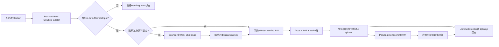
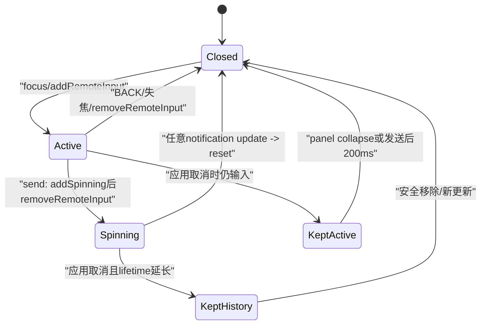
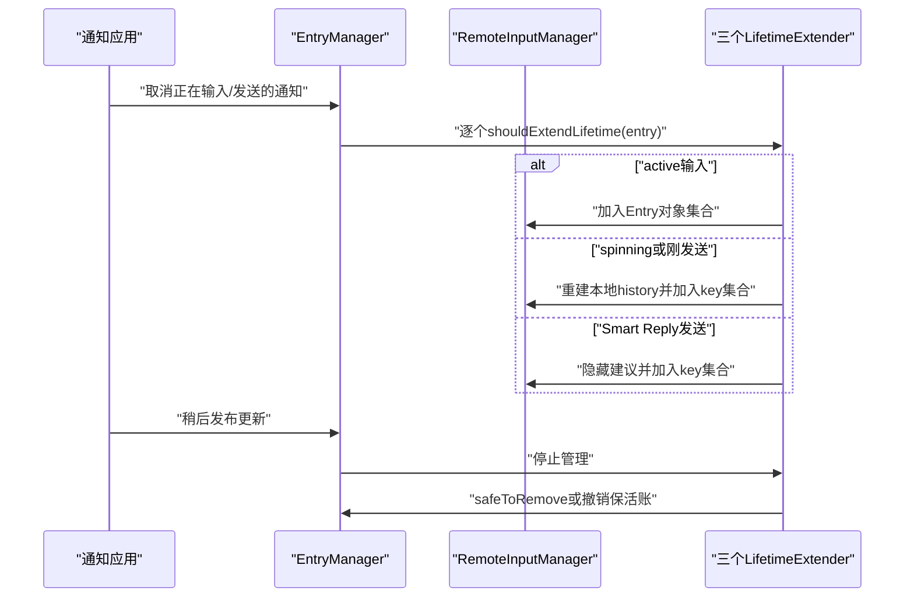

# 第 491 章 Android SystemUI RemoteInputView、Controller 与 NotificationRemoteInputManager：点击、解锁、输入、发送、历史和生命周期链

> 源码基线：Android 11 / API 30 / `android-11.0.0_r48`。本章只在 macOS 阅读，不实际编译。核心文件：`NotificationRemoteInputManager.java`、`RemoteInputController.java`、`RemoteInputView.java`、`StatusBarRemoteInputCallback.java`；交叉阅读`RemoteInputQuickSettingsDisabler.java`、`NotificationEntry.java`及四份本地测试。

## 1. 本章解决什么问题

用户点通知里的“回复”后，为什么有时先解锁、有时展开通知、有时直接弹键盘？文字怎样装进PendingIntent送给应用？应用已经取消通知时，SystemUI为什么还能短暂显示“正在发送”和回复历史？

## 2. 一句话主线

RemoteViews点击先由Manager识别free-form RemoteInput并经过锁屏门，再定位HUN/expanded中的RemoteInputView；View负责焦点、草稿、IME与发送UI，Controller记录active/spinning，三个LifetimeExtender则在应用更新或取消竞态中暂留Entry并重建本地回复历史。

## 3. 三个核心对象各管一层

`NotificationRemoteInputManager`管点击路由、安全门与Entry寿命；`RemoteInputController`管全局active和每key spinning账；`RemoteInputView`管一个真实输入框、EditText、发送按钮和进度条。

## 4. StatusBarRemoteInputCallback补齐UI政策

Manager不直接操作Bouncer、Shade和工作资料挑战，而经Callback让StatusBar实现解锁后重放点击、展开group/Row、滚动到通知及普通PendingIntent启动。

## 5. RemoteInput不是SystemUI私有协议

应用在Notification.Action里声明`RemoteInput[]`和action PendingIntent；SystemUI收集结果写进fill-in Intent，再发送应用提供的PendingIntent。应用进程最终从Intent提取结果。

## 6. free-form与choice要区分

Manager寻找`getAllowFreeFormInput()`为true的RemoteInput；纯预设选项不一定打开EditText。编辑Smart Reply时则额外携带`EditedSuggestionInfo`，发送来源标成CHOICE。

## 7. 总体交互图



## 8. 点击入口会先唤醒Doze

OnClickHandler不论最终是回复还是普通action，先`wakeUpIfDozing(..., "NOTIFICATION_CLICK")`，再沿父链找ExpandableNotificationRow与Entry。

## 9. 自定义Callback拥有最高消费权

`mCallback.shouldHandleRemoteInput(view,pendingIntent)`先执行；StatusBar在通知Shade被DISABLE2禁用时直接返回true，阻止回复动作借点击展开Shade。

## 10. RemoteInput数组来自View tag

标准RemoteViews action把`RemoteInput[]`放在`remote_input_tag`；tag类型不对或为null就降级成普通PendingIntent点击。

## 11. 多个free-form输入取最后一个

循环命中后没有break，`input`会被后续允许free-form的元素覆盖。模板通常只有一个主输入，但源码没有拒绝多项歧义。

## 12. 普通点击继续做Activity政策

非RemoteInput action恢复app switches，交给StatusBar Callback；Activity PendingIntent先dismiss Keyguard、按resolver情况决定afterKeyguardGone，再启动并可能收起Shade，非Activity直接默认发送。

## 13. 点击入口源码

```java
private boolean handleRemoteInput(View view, PendingIntent pendingIntent) {
    if (mCallback.shouldHandleRemoteInput(view, pendingIntent)) {
        return true;
    }

    Object tag = view.getTag(com.android.internal.R.id.remote_input_tag);
    RemoteInput[] inputs = null;
    if (tag instanceof RemoteInput[]) {
        inputs = (RemoteInput[]) tag;
    }

    if (inputs == null) {
        return false;
    }

    RemoteInput input = null;

    for (RemoteInput i : inputs) {
        if (i.getAllowFreeFormInput()) {
            input = i;
        }
    }

    if (input == null) {
        return false;
    }

    return activateRemoteInput(view, inputs, input, pendingIntent,
            null /* editedSuggestionInfo */);
}
```

这里的true只表示“点击已由RemoteInput流程接管”，并不保证此刻已经显示输入框或发送成功。

## 14. activate先找root namespace

从被点action的parent向上爬，遇到`View.isRootNamespace()`就在该子树找带`RemoteInputView.VIEW_TAG`的RIV，并从root tag取Row。

## 15. Row tag是第489章加入的身份桥

NotificationContentView `onViewAdded`给child设置`row_tag_for_content_view`；Manager因此无需全局按key搜索，就能从RemoteViews子树回到所属Row。

## 16. Row tag直接强转

代码将tag强转ExpandableNotificationRow，没有`instanceof`；系统Inflater合同一旦被破坏会ClassCastException，而不是返回“未处理”。

## 17. 找不到Row才返回false

这会让OnClickHandler继续普通PendingIntent逻辑；找到了Row但后面被锁屏门拦截，则返回true等待解锁后重放。

## 18. 点击一开始就setUserExpanded

安全门之前先`row.setUserExpanded(true)`。所以锁屏点击即便尚不能输入，也会先改变Row展开意图，后续解锁/显示动作更容易找到expanded内容。

## 19. 是否允许锁屏直接回复是总门

`shouldAllowLockscreenRemoteInput()`为false才进入锁屏与managed profile检查；允许时可以绕过下面的public-mode/Bouncer分支直接尝试激活RIV。

## 20. Creator user决定工作资料

使用PendingIntent creator UserHandle，而不是通知当前展示user；再用UserManager/KeyguardManager判断它是否locked managed profile。

## 21. UserInfo没有null保护

`mUserManager.getUserInfo(userId).isManagedProfile()`直接解引用。若creator user已删除或查询异常返回null，activate路径可能NPE。

## 22. 父用户锁定与资料锁定分开

locked work profile但parent已解锁，走`onLockedWorkRemoteInput`只解工作挑战；否则公共锁屏或KEYGUARD状态走普通`onLockedRemoteInput`显示Bouncer。

## 23. public mode与StatusBar state是或关系

目标user处于public mode，或全局状态为KEYGUARD，都不会直接显示输入；即使设备没有安全凭据，也要走Callback以完成从锁屏进入Shade的UI流程。

## 24. HUN RIV脱窗时退到expanded

root子树找到的RIV若已不attached就丢弃，再去Row private expanded child查找。HUN退场与点击竞态不会直接使用已脱离窗口的输入框。

## 25. expanded内容也可能尚未准备

expanded child没有RIV就返回false；OnClickHandler随后可能当普通action发送PendingIntent，这意味着内容绑定正确性是激活回复的重要前提。

## 26. expanded被选但尚未shown要延迟重放

若找到的是expanded RIV而expanded child未shown，Callback先展开group/Row，给NotificationContentView登记expanded visible listener，再调用原clicked View的`performClick()`。

## 27. 延迟重放没有generation

listener捕获原clicked View；通知在expanded出现前若reapply并替换action View，旧对象仍可能被调用，能否正确回父链取决于它是否仍attached及上游取消时序。

## 28. 最终attached检查是最后防线

即使fallback找到了RIV，只要仍未attached就返回false，不设置PendingIntent、不请求IME。

## 29. reveal中心按action可见文字修正

若action是TextView，使用首行文字宽加compound padding，避免按钮很宽但文字偏一侧时圆形展开中心不自然。

## 30. reveal半径使用曼哈顿式上界

对四角计算横纵距离之和的最大值，不是欧氏平方根；半径偏大但确保覆盖整个RIV，换取简单计算。

## 31. 激活入口源码

```java
if (riv == null) {
    riv = findRemoteInputView(row.getPrivateLayout().getExpandedChild());
    if (riv == null) {
        return false;
    }
}
if (riv == row.getPrivateLayout().getExpandedRemoteInput()
        && !row.getPrivateLayout().getExpandedChild().isShown()) {
    // The expanded layout is selected, but it's not shown yet, let's wait on it to
    // show before we do the animation.
    mCallback.onMakeExpandedVisibleForRemoteInput(row, view);
    return true;
}

if (!riv.isAttachedToWindow()) {
    // if we still didn't find a view that is attached, let's abort.
    return false;
}
int width = view.getWidth();
if (view instanceof TextView) {
    // Center the reveal on the text which might be off-center from the TextView
    TextView tv = (TextView) view;
    if (tv.getLayout() != null) {
        int innerWidth = (int) tv.getLayout().getLineWidth(0);
        innerWidth += tv.getCompoundPaddingLeft() + tv.getCompoundPaddingRight();
        width = Math.min(width, innerWidth);
    }
}
int cx = view.getLeft() + width / 2;
int cy = view.getTop() + view.getHeight() / 2;
int w = riv.getWidth();
int h = riv.getHeight();
int r = Math.max(
        Math.max(cx + cy, cx + (h - cy)),
        Math.max((w - cx) + cy, (w - cx) + (h - cy)));

riv.setRevealParameters(cx, cy, r);
riv.setPendingIntent(pendingIntent);
riv.setRemoteInput(inputs, input, editedSuggestionInfo);
riv.focusAnimated();
```

## 32. RemoteInputView是每套模板的真实控件

expanded与HUN各可有一个RIV；每个实例持有独立`mToken`，Controller用它区分同Entry先后接管焦点或spinner的View代际。

## 33. inflate注入Entry和Controller

它inflate SystemUI自己的`R.layout.remote_input`，绑定Controller/Entry，设置文本操作user，再用全局唯一对象`VIEW_TAG`标记，方便第489章和Manager查找。

## 34. USER_ALL在inflate时解析当前用户

通知user为ALL时映射`ActivityManager.getCurrentUser()`；这个结果保存在RemoteEditText。若RIV跨用户切换长期复用，没有专用回调重新计算。

## 35. focus建立完整可编辑态

设RIV VISIBLE、通知wrapper RemoteInput可见、EditText可聚焦与显示cursor、恢复Entry草稿、光标移到末尾、requestFocus并向Controller登记active。

## 36. Wrapper收到可见状态有额外作用

Messaging/Conversation wrapper会显示历史消息，NotificationContentView的listener会关闭clipChildren；RemoteInput可见不只是输入框自身visibility。

## 37. focus还影响横屏QS

QuickSettingsDisabler记录active；仅在landscape时向disable2 flags补`DISABLE2_QUICK_SETTINGS`，防止键盘与横屏QS争夺有限空间。

## 38. 初次方向字段有延迟

构造保存`mLastOrientation`，但`misLandscape`默认false，没有用初始orientation赋值；若进程启动时已经横屏且尚无orientation change callback，active输入可能暂不禁QS。

## 39. EditText的背景随可编辑态切换

`setInnerFocusable(true)`恢复构造时保存的Drawable；false时背景设null，同时关cursor/focusable，收起后不留下输入框样式。

## 40. IME显示经InputConnection后post

focus先令`mShowImeOnInputConnection=true`；创建InputConnection时按文本user取得Context，再post `viewClicked/showSoftInput`，避免在IMM仍搭建连接时过早请求。

## 41. post显示IME没有状态复查

Runnable执行时不重新检查View是否仍focused、attached或flag是否仍true；快速关闭/替换输入框后，旧post仍可能调用showSoftInput，实际效果依赖IMM当前连接校验。

## 42. 键盘BACK有三条入口

EditText吞onKeyDown，onKeyUp defocus；`onKeyPreIme`在BACK UP也defocus。两条UP路径可能重复调用，但第二次因已不可focus而通常no-op。

## 43. 失焦与不可见都会收口

onFocusChanged(false)带动画defocus；`!isShown()`无动画defocus。触摸外部也可由Manager ACTION_OUTSIDE调用Controller关闭所有RIV。

## 44. Row移动与temporary detach是例外

Row changingPosition或EditText temporarily detached时不defocus；temporary detach还把当前文字保存到Entry，给HUN↔expanded焦点转移或模板重建使用。

## 45. 条件表达式依赖运算符优先级

`mRemoteInputView != null && row.isChangingPosition() || isTemporarilyDetached()`等价于两种例外的或关系。它不会在RIV为null时解引用Row，但temporary detach仍可独立成立。

## 46. onDefocus先删active账再保存草稿

Controller用token删除；Entry.remoteInputText指向EditText当前内容。随后若未removed，才隐藏RIV或播放圆形收起并通知wrapper不可见。

## 47. removed状态故意不隐藏

Row移除动画会重新attach/失焦；`mRemoved=true`时跳过visibility和wrapper切换，防止出场闪烁，但仍关闭Controller active与QS active。

## 48. 收起圆形动画无代际保护

动画对象不保存字段，也不在focus时取消；若close动画期间又focus同一RIV，旧onAnimationEnd仍可能把它设INVISIBLE并通知wrapper false。

## 49. active的定义不等于VISIBLE

`isActive()`要求EditText focused且enabled；发送时EditText被disable，因此即使RIV仍VISIBLE显示spinner，也不算active。

## 50. sending则结合spinner token

`isSending()`要求RIV VISIBLE且Controller `isSpinning(key, token)`；只看进度条可见或只看key spinning都不足以确认是这个View在发送。

## 51. Controller的open账按Entry弱引用

`mOpen`保存`Pair<WeakReference<NotificationEntry>, token>`；查询、增删时顺便清已回收Entry，避免Controller强持有通知。

## 52. 同Entry最终只保留最新token

add发现同Entry但token不同，会删旧pair再插新pair；HUN与expanded焦点接力后，旧View的remove不会误删新View active状态。

## 53. remove token为null表示强制清

用户真正移除通知、Panel collapse等路径不关心哪个RIV持有焦点，传null删除该Entry所有匹配项。

## 54. spinning账是key到单token

后一次`put(key,token)`覆盖前一次；旧token removeSpinning会因身份不等而不删新发送态。它没有WeakReference，必须由update/detach/移除路径清理。

## 55. apply同步更新局部与全局

每次active增删先让Delegate `setRemoteInputActive(entry, bool)`更新Row，再把“是否任意Entry active”同步通知所有Callback。

## 56. Callback列表不去重也不能移除

`addCallback`直接append；重复初始化会重复通知，且没有remove API。正常Dependency生命周期应只注册一次。

## 57. Controller账源码

```java
public void addRemoteInput(NotificationEntry entry, Object token) {
    Objects.requireNonNull(entry);
    Objects.requireNonNull(token);

    boolean found = pruneWeakThenRemoveAndContains(
            entry /* contains */, null /* remove */, token /* removeToken */);
    if (!found) {
        mOpen.add(new Pair<>(new WeakReference<>(entry), token));
    }

    apply(entry);
}

public void removeRemoteInput(NotificationEntry entry, Object token) {
    Objects.requireNonNull(entry);

    pruneWeakThenRemoveAndContains(null /* contains */, entry /* remove */, token);

    apply(entry);
}

public void addSpinning(String key, Object token) {
    Objects.requireNonNull(key);
    Objects.requireNonNull(token);

    mSpinning.put(key, token);
}

public void removeSpinning(String key, Object token) {
    Objects.requireNonNull(key);

    if (token == null || mSpinning.get(key) == token) {
        mSpinning.remove(key);
    }
}
```

## 58. closeRemoteInputs先做Entry快照

关闭会反向修改mOpen，所以先收集仍有Row的Entry，再逐项`entry.closeRemoteInput()`；快照避免迭代中删除。

## 59. RIV拦截触摸防Row长按

ACTION_DOWN调用Delegate请求禁止long press和dismiss；RIV `onTouchEvent`恒返回true，避免触摸穿透到被输入框覆盖的action或Row点击。

## 60. requestRectangle转成栈滚动锁

IME请求显示光标区域时，RemoteEditText调用Controller `lockScrollTo(entry)`，让通知栈滚到该Row并保持，防止输入框被键盘遮住。

## 61. 文本发送有按钮和IME两入口

send button onClick直接发送；Editor action只在DONE/NEXT/SEND或confirm key DOWN且文字长度>0时发送，并消费事件防IME自动关闭。

## 62. 按钮依赖enabled阻挡空发送

TextWatcher让send button仅非空enabled；但`onClick`自身不重新检查长度，程序化`performClick`或状态异常仍可能构造空字符串结果。

## 63. 文字结果用resultKey写Bundle

`RemoteInput.addResultsToIntent(mRemoteInputs,fillInIntent,results)`把目标RemoteInput结果编码进前台Broadcast Intent；应用用RemoteInput API解码。

## 64. 来源字段区分自由输入与编辑建议

Entry没有EditedSuggestionInfo时设SOURCE_FREE_FORM_INPUT；有则SOURCE_CHOICE，随后system_server还能记录建议index、原文及发送前是否修改。

## 65. remoteInputText保存的是Editable引用

prepare把`mEditText.getText()`直接赋给Entry而非复制；reset清EditText时同一Editable可能变空，因此reset先复制到`remoteInputTextWhenReset`，HistoryExtender发现主字段空再用备份。

## 66. 图片结果先授予临时URI权限

data路径把MIME→Uri加入Intent前，经RemoteInputUriController让通知发布应用可以读取内容Uri，再记录Entry mime/uri与占位文字。

## 67. EditorInfo没有广告允许MIME

源码TODO注释掉`setContentMimeTypes`；IME通常不知道目标接受哪些图片类型。若commitContent仍到达，代码取ClipDescription第一个MIME，没有与RemoteInput allowedDataTypes再比对。

## 68. commitContent总返回true

description为空或无MIME时不发送，仍返回true表示已消费；IME不会再走其他fallback，用户可能看不到失败反馈。

## 69. send先切UI与账，再真正发送

disable EditText、隐藏按钮、显示spinner、记elapsed time、addSpinning、remove active、关闭IME请求、通知callbacks和setHasSentReply，最后才`PendingIntent.send`。

## 70. 发送核心源码

```java
private void sendRemoteInput(Intent intent) {
    mEditText.setEnabled(false);
    mSendButton.setVisibility(INVISIBLE);
    mProgressBar.setVisibility(VISIBLE);
    mEntry.lastRemoteInputSent = SystemClock.elapsedRealtime();
    mController.addSpinning(mEntry.getKey(), mToken);
    mController.removeRemoteInput(mEntry, mToken);
    mEditText.mShowImeOnInputConnection = false;
    mController.remoteInputSent(mEntry);
    mEntry.setHasSentReply();

    // Tell ShortcutManager that this package has been "activated".  ShortcutManager
    // will reset the throttling for this package.
    getContext().getSystemService(ShortcutManager.class).onApplicationActive(
            mEntry.getSbn().getPackageName(),
            mEntry.getSbn().getUser().getIdentifier());

    MetricsLogger.action(mContext, MetricsProto.MetricsEvent.ACTION_REMOTE_INPUT_SEND,
            mEntry.getSbn().getPackageName());
    try {
        mPendingIntent.send(mContext, 0, intent);
    } catch (PendingIntent.CanceledException e) {
        Log.i(TAG, "Unable to send remote input result", e);
        MetricsLogger.action(mContext, MetricsProto.MetricsEvent.ACTION_REMOTE_INPUT_FAIL,
                mEntry.getSbn().getPackageName());
    }
}
```

## 71. remoteInputSent并非传输ACK

Callback在PendingIntent.send之前触发；它表示SystemUI已发起发送，而不是应用receiver已收到，更不是应用服务器已处理回复。

## 72. CanceledException不回滚UI

catch只日志和metrics，不重新enable输入框、不隐藏spinner、不removeSpinning、不撤销hasSentReply。若应用不会再更新通知，UI可停在发送态，直到其他生命周期清理。

## 73. Shortcut活跃记账也早于send

即使PendingIntent已取消，发布通知的包仍先被ShortcutManager视为active并重置throttling；源码明确承认真实receiver可能不是publisher。

## 74. lastRemoteInputSent提供500毫秒窗口

NotificationEntry `hasJustSentRemoteInput()`以elapsedRealtime和500ms cooldown判断；它让应用紧接着取消通知时，HistoryExtender仍能识别刚发回复。

## 75. onNotificationUpdateOrReset把应用更新当完成信号

只要spinner当前VISIBLE，通知发生更新就reset输入框、清spinner账并defocus；它不验证更新内容是否真的包含发送的回复。

## 76. 任意更新都可能结束spinner

应用更新图标、时间或其他字段也会被当成发送完成；协议是“发布方更新通知”这一事件式确认，不是带request id的精确ACK。

## 77. reset保存历史备份后清Editable

先SpannedString复制当前文字，再clear、enable、恢复send button、隐藏progress、按token删spinning，最后无动画defocus。

## 78. accessibility事件在reset期间被抑制

清文字会产生TextView事件，但RIV保持可见用于动画；`mResetting`期间拒绝EditText accessibility event，避免读屏误报用户主动清空。

## 79. HUN与expanded可偷焦点

第489章切型时目标RIV `stealFocusFrom`：先close旧RIV，再复制PendingIntent、RemoteInputs、选择信息和reveal参数，最后focus恢复Entry草稿。

## 80. PendingIntent更新只做Intent.filterEquals

重膨胀时拿旧PI Intent与新actions的Intent比较action/data/type/component/categories，不比较extras；基础Intent相同但extras语义变化仍会被当作匹配。

## 81. 匹配action同样取最后free-form input

内部循环没有break；匹配action含多个free-form输入时最后一个成为`mRemoteInput`。

## 82. temporary detach特意摘下EditText

RIV开始临时detach时先让父类标记，再`detachViewFromParent(mEditText)`，避免EditText收到真正onDetached并丢IME焦点；finish时按RIV是否attached选择attach或removeDetachedView。

## 83. finish temporary detach依赖配对

漏调用会让EditText保持detached；重复或错误时序可能触发ViewGroup内部状态异常。第489章缓存复用/放弃两条路径都必须finish。

## 84. active与spinning时间线图



## 85. 三个LifetimeExtender是三个原因

RemoteInputHistory管spinning/刚发送，SmartReplyHistory管SmartReply发送，RemoteInputActive管用户仍在输入。EntryManager可逐个询问并让它们管理寿命。



## 86. 三个Extender共享一个完成Callback字段

`setCallback`只有字段为null才保存，后两个传入不同callback会被忽略；框架通常给同一个安全移除回调，这是一项隐含合同。

## 87. History开启由debug属性控制且默认true

`debug.force_remoteinput_history`默认true；关掉后spinning/刚发送和SmartReply不延长历史，但active输入Extender仍可保活。

## 88. 应用取消时重建本地Notification

HistoryExtender取当前文字，空则取reset备份；Manager clone原Notification、prepend RemoteInputHistoryItem、关spinner、隐藏Smart Replies，再用同身份构造新SBN交EntryManager更新。

## 89. 新回复插在history索引0

旧数组整体右移，最新文字或MIME/Uri在第一项；连续本地保活可形成多条历史。

## 90. 自定义RemoteViews被恢复成原引用

Builder build可能产生compatibility views；代码随后把原Notification的content/big/HUN RemoteViews重新赋回，避免本地历史重建意外替换应用自定义布局。

## 91. SBN保留原postTime

包、opPkg、id、tag、uid、pid、user、overrideGroupKey和postTime沿用原值；这不是应用真正重新post的一条新通知。

## 92. rebuild会永久hide Smart Replies到后续应用更新

无论remote input还是取消Smart Reply重建，都`setHideSmartReplies(true)`；本地保活阶段不再让用户重复点击过期建议。

## 93. History管理先update再加key

重建并`mEntryManager.updateNotification`后检查entry是否removed，最后才将key加入`mKeysKeptForRemoteInputHistory`。Inflation异常导致移除时避免留下幽灵key。

## 94. rebuild异常没有本地catch

recoverBuilder/build/update过程中RuntimeException可向上冒泡；`newSbn==null`检查几乎不是异常保护，因为方法正常总构造对象。

## 95. onRemoteInputInserted清500ms证据

History extender重建后调用Entry `onRemoteInputInserted()`，把last sent设回NOT_LAUNCHED并清reset备份，防止同一次发送反复满足“刚发送”。

## 96. active保活按Entry对象存集合

`mEntriesKeptForRemoteInputActive`不是key集合；同key换Entry代际会被视为不同对象，延迟Runnable也捕获具体Entry。

## 97. active发送后延迟200毫秒释放

若Entry已因active被保留，remoteInputSent postDelayed；200ms后若集合仍含该对象，就通知safeToRemove，给应用一次短更新机会。

## 98. 200毫秒Runnable没有generation

若同一Entry在窗口内因新一轮输入又被加入集合，旧Runnable仍会remove并释放新保活。它只用集合contains/remove，不核对发送代际或当前active状态。

## 99. 已是history key时发送立即safe-remove

FORCE开启且key已由history管理，onRemoteInputSent直接调用safe callback，不走active 200ms分支；多个extender的交接依赖EntryManager调用顺序。

## 100. 生命周期重建源码

```java
protected class RemoteInputHistoryExtender extends RemoteInputExtender {
    @Override
    public boolean shouldExtendLifetime(@NonNull NotificationEntry entry) {
        return shouldKeepForRemoteInputHistory(entry);
    }

    @Override
    public void setShouldManageLifetime(NotificationEntry entry,
            boolean shouldExtend) {
        if (shouldExtend) {
            CharSequence remoteInputText = entry.remoteInputText;
            if (TextUtils.isEmpty(remoteInputText)) {
                remoteInputText = entry.remoteInputTextWhenReset;
            }
            String remoteInputMimeType = entry.remoteInputMimeType;
            Uri remoteInputUri = entry.remoteInputUri;
            StatusBarNotification newSbn = rebuildNotificationWithRemoteInput(entry,
                    remoteInputText, false /* showSpinner */, remoteInputMimeType,
                    remoteInputUri);
            entry.onRemoteInputInserted();

            if (newSbn == null) {
                return;
            }

            mEntryManager.updateNotification(newSbn, null);

            // Ensure the entry hasn't already been removed. This can happen if there is an
            // inflation exception while updating the remote history
            if (entry.isRemoved()) {
                return;
            }

            mKeysKeptForRemoteInputHistory.add(entry.getKey());
        } else {
            mKeysKeptForRemoteInputHistory.remove(entry.getKey());
        }
    }
}
```

## 101. Panel collapse强制释放active保活

遍历active集合，按Entry强制removeRemoteInput，若safe callback非null立即通知，最后clear集合。收起通知栏不继续保留一个用户看不见的编辑会话。

## 102. Panel遍历存在回调重入风险

safe callback在clear之前逐项同步外调；若回调导致集合增删，按索引遍历可能跳项或处理变化后的元素，最后clear还会清重入新加项。

## 103. 用户主动移除会清两类账

Entry removedByUser时`onPerformRemoveNotification`删history key，并若Controller仍active则传null强制remove；它没有主动removeSpinning，后续detach/reset路径仍需收口token。

## 104. 外部点击关闭条件很苛刻

只在ACTION_OUTSIDE且x==0、y==0并存在active输入时close all；普通落在通知栏其他位置的DOWN并不由这个方法直接关闭。

## 105. 解锁重放流程

普通锁屏把clicked View存单槽并show Bouncer；状态变SHADE且不再请求Keyguard时post `callOnClick`。工作资料则先启动ConfirmCredential，收到DEVICE_LOCKED_CHANGED后展开Shade、Row、滚动完成再callOnClick。

## 106. pending View都是单槽且无通知身份复核

连续点击会覆盖前一次；解锁后只对保存的View对象callOnClick，不检查它是否仍属于当前Entry、是否attached或action PendingIntent是否更新。工作资料路径在开始Runnable时虽把字段复制成局部变量来找旧Row，但滚动完成回调又调用当前`mPendingWorkRemoteInputView`字段；等待滚动期间被新点击覆盖时，可能按旧Row滚动后点击新View。

## 107. Work Challenge启动失败仍返回true

createConfirm intent为null才false；Binder start RemoteException被吞掉，方法仍返回true。调用方已保存pending View，可能长期等待不会到来的解锁事件。

## 108. 工作资料Receiver只响应当前profile的非当前user

DEVICE_LOCKED_CHANGED的user必须不是current user且`isCurrentProfile(userId)`；这正对应managed profile挑战，不处理主用户同action。

## 109. 测试数量与重点

Manager 12项主要覆盖三种shouldExtend、collapse和历史重建；RemoteInputView 5项覆盖文本结果/source、三种IME target user和null visibility listener；StatusBar Callback仅1项Receiver user路由；QS Disabler 4项覆盖active/orientation。

## 110. 主交互缺少直接测试

未直接覆盖锁屏激活矩阵、HUN脱窗fallback、expanded visible重放、焦点偷取、PendingIntent匹配、发送失败回滚、close动画再focus、temporary detach和200ms代际竞态。

## 111. 本章排障顺序

“点回复没反应”依次查View remote_input_tag、Row root tag、锁屏/资料门、RIV attached与expanded shown；“一直转圈”查PI send异常、spinning token、应用是否post任意update、History Extender与Entry是否仍保活。

## 112. macOS只读练习一：画点击门表

只读`activateRemoteInput`，为普通Shade、主用户锁屏、parent已解锁的locked work profile、HUN已detach、expanded未shown五种情况写出Callback或返回值，不运行不编译。

## 113. macOS只读练习二：推演发送失败

从非空文字开始逐行记录enabled、button、progress、active、spinning、lastSent和hasSentReply；假设PendingIntent抛CanceledException，指出哪些状态没有回滚及可能如何收口。

## 114. macOS只读练习三：推演HUN到expanded

先让HUN RIV active并输入草稿，再触发可见类型切换；沿`stealFocusFrom`和Controller token替换写出两个RIV、Entry草稿、IME与active pair的最终状态。

## 115. macOS只读练习四：审计三种保活

分别为active typing、spinning send、Smart Reply sending模拟应用cancel；写出命中的Extender、集合/key、重建history/spinner/hide replies，以及何时调用safeToRemove。

## 116. 易错理解一：remoteInputSent表示应用已收到

错。它在PendingIntent.send之前同步触发，只表示SystemUI启动了发送UI和记账；CanceledException甚至发生在“sent”回调之后。

## 117. 易错理解二：active与sending是同一状态

错。active要求focused+enabled；发送第一步disable并从open账移除，同时以key+token进入spinning。二者是相邻但互斥的主要阶段。

## 118. 易错理解三：通知取消就一定立即消失

错。用户正在输入、刚发送或Smart Reply发送中都可能由不同LifetimeExtender暂留，并用SystemUI本地重建Notification显示历史。

## 119. 复读后的最终心智模型

把RemoteInput看成“点击重放状态机+View会话账+Entry寿命事务”：锁屏只延期点击，RIV token保护焦点代际，spinning只是乐观发送，应用更新充当弱ACK，Extender则在应用取消与SystemUI UI收尾之间搭临时桥。

## 120. 本章结论与下一章

Android 11的内联回复链能跨HUN/expanded、IME用户、锁屏和通知取消保持连续，但不是强事务：发送记账早于PendingIntent、更新ACK无request id、多个延迟回调无generation。下一章继续阅读Smart Reply的候选选择、Inflater、SmartReplyView布局、发送与lifetime协作链。
