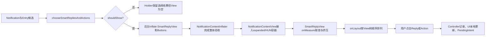
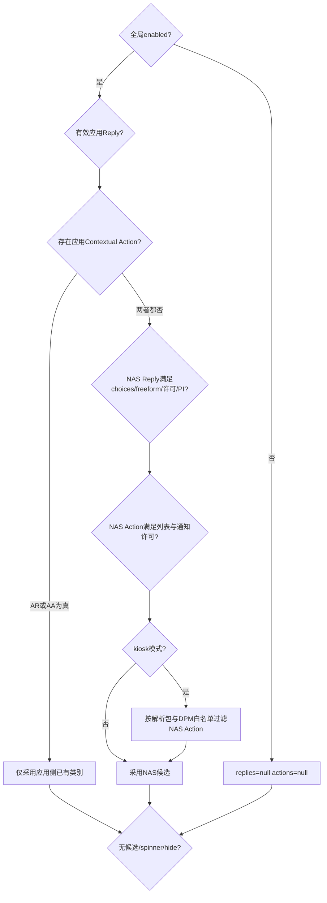
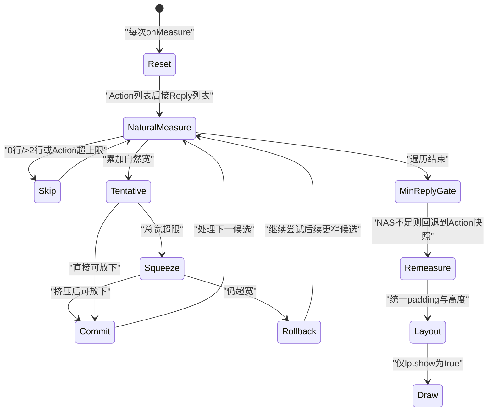

# 第 492 章 Android SystemUI InflatedSmartReplies 与 SmartReplyView：候选选择、按钮挤压、点击发送和生命周期链

> 源码基线：Android 11 / API 30 / `android-11.0.0_r48`。本章只在 macOS 阅读源码，不实际编译。核心文件：`InflatedSmartReplies.java`、`SmartReplyConstants.java`、`SmartReplyView.java`、`SmartReplyController.java`；交叉阅读 `NotificationContentInflater.java`、`NotificationContentView.java`、`NotificationRemoteInputManager.java` 及四份本地测试。

## 1. 本章解决什么问题

通知底部的“好的”“稍后联系”等按钮从哪里来？应用候选和系统智能候选谁优先？空间不足时为什么有些按钮消失、有些被挤成两行？点击之后又为什么会先出现本地发送状态，即使真正的 `PendingIntent.send()` 最后失败？

## 2. 一句话主线

`InflatedSmartReplies`先从应用与Notification Assistant候选中选一组，在后台预创建View和Button；`NotificationContentView`把结果接入expanded或Heads-up模板；`SmartReplyView`在测量阶段按“Action优先入选、Reply优先排列”的双重规则取舍和挤压；点击后Controller、RemoteInputManager与应用PendingIntent共同完成发送和临时生命周期。

## 3. Smart Reply和Smart Action不是同一种按钮

Smart Reply是一段预置回复文字，最终通过`RemoteInput`结果交给应用；Smart Action是一个`Notification.Action`，点击后启动它自己的`PendingIntent`。两者外观看起来相似，数据来源、发送协议和点击后处理却不同。

## 4. 本章涉及的五层对象

第一层是`Notification`与`NotificationEntry`中的原始候选；第二层是`SmartRepliesAndActions`选择结果；第三层是`InflatedSmartReplies`预创建的View与Button；第四层是`SmartReplyView`布局；第五层是`SmartReplyController`的发送状态与遥测。

## 5. 先建立三种“顺序”概念

源码同时存在候选来源优先级、测量入选优先级和最终View排列顺序。应用候选优先于NAS候选；测量时Action先于Reply；但真正加入View树时Reply又先于Action。把三种顺序混成一个，是阅读本章最常见的错误。

## 6. 整体生产与消费图



## 7. 运行进程与线程先说清

这些类都运行在SystemUI进程。候选选择和按钮inflate作为通知内容异步膨胀的一部分，可在后台任务中执行；View的接入、测量、布局、点击和大部分Controller状态则回到SystemUI主线程。`PendingIntent`最终跨进程进入应用或系统目标。

## 8. 入口位于NotificationContentInflater

只有重膨胀标志包含expanded且`newExpandedView != null`时，才为expanded预创建一套Smart Replies；Heads-up同理。contracted和public内容不走这段Smart Reply预创建路径。

## 9. expanded和Heads-up各有独立实例

源码对expanded与Heads-up分别调用一次`InflatedSmartReplies.inflate()`，所以两边不是共享同一个`SmartReplyView`或Button对象。这样避免一个View同时拥有两个parent，也让两套宽度约束独立测量。

## 10. HUN开关不是后台生产总门

`inflateSmartReplyViews()`创建Heads-up候选时没有读取`getShowInHeadsUp()`；真正接入时`NotificationContentView`才用该开关决定是否调用HUN的apply。因此关闭HUN展示不等于一定省掉HUN预创建工作。

## 11. inflate首先选择候选

`InflatedSmartReplies.inflate()`先执行`chooseSmartRepliesAndActions()`，而不是先创建Button。选择逻辑只产生轻量的数据容器，后面才判断是否值得创建UI。

## 12. shouldShow为false仍返回Holder

当没有候选、通知显示发送spinner或要求隐藏Smart Replies时，返回的Holder中View与Button列表为null，但`SmartRepliesAndActions`仍被保存。这一点使“选到了什么”和“当前是否画出来”可以分开追踪。

## 13. shouldShow的三个否决条件

候选两类都为null时不显示；`Notification.EXTRA_SHOW_REMOTE_INPUT_SPINNER`为true时不显示；`Notification.EXTRA_HIDE_SMART_REPLIES`为true时也不显示。后两个条件通常出现在正在发送或为发送保活的本地通知副本中。

## 14. 空对象和null对象并不完全等价

`shouldShow`只检查`smartReplies == null && smartActions == null`。若kiosk过滤把Action列表过滤成空列表，但仍包装成非null的`SmartActions`，方法会认为可以显示；随后可能得到一个没有Button的空容器。

## 15. 候选选择源码骨架

```java
if (!smartReplyConstants.isEnabled()) {
    return new SmartRepliesAndActions(null, null);
}

boolean appRepliesExist = enableAppGeneratedSmartReplies
        && remoteInputActionPair != null
        && !ArrayUtils.isEmpty(remoteInputActionPair.first.getChoices())
        && remoteInputActionPair.second.actionIntent != null;
boolean appActionsExist = !notification.getContextualActions().isEmpty();

if (appRepliesExist || appActionsExist) {
    // 只装入应用侧实际存在的类别
} else {
    // 才考虑Entry中的NAS replies/actions
}
```

这里最关键的是最后的二选一：只要应用提供任意一种有效候选，NAS的两种候选都会整体失去机会。

## 16. 全局enabled是最外层总门

`SmartReplyConstants.isEnabled()`为false时，应用回复、应用Action、NAS回复和NAS Action全部不参与。它不是只控制“AI生成的回复”。

## 17. 应用Smart Reply从非free-form配对取

代码调用`notification.findRemoteInputActionPair(false)`，寻找带choices的RemoteInput/Action组合。这里的false表示查找不允许自由输入的配对，不是说这个Action绝不可能还有其他RemoteInput。

## 18. 应用Reply有targetSdk门

默认要求通知应用target P或更高，原因是旧版本曾把choices API用于Wear场景，不一定表示手机通知智能回复。DeviceConfig可关闭该要求。

## 19. 应用Reply还需要三个条件

必须找到配对、choices非空、Action的`actionIntent`非null。任意条件不满足都不构成有效的应用Smart Reply来源。

## 20. 应用Smart Action没有targetSdk门

`notification.getContextualActions()`非空就算存在，源码没有给它套target P检查，因为Contextual Action API是较新的通知能力。

## 21. “应用优先”是两类一起压制

如果应用只有Contextual Actions而没有Reply，NAS Reply仍不会补进来；反过来，应用只有Reply时，NAS Action也不会补进来。源码追求来源一致，而不是把两边最丰富的候选拼在一起。

## 22. NAS Reply来自Entry而不是Notification choices

Notification Assistant给出的智能回复由排名/调整链写入`NotificationEntry.getSmartReplies()`。它们需要借用通知中可自由输入的RemoteInput通道才能送回应用。

## 23. NAS Reply需要free-form配对

代码调用`findRemoteInputActionPair(true)`。还要求choices非空、Action允许generated replies，并且`actionIntent`非null；缺少真正可接收文本的通道时，Assistant文字不能凭空发送。

## 24. allowGeneratedReplies属于Action合同

`Notification.Action.getAllowGeneratedReplies()`是应用给系统的许可。Assistant有候选不代表SystemUI必然展示；应用可通过Action合同拒绝系统生成回复。

## 25. NAS Action也受Notification许可

Entry中的`getSmartActions()`非空还不够，Notification必须允许system-generated contextual actions。这样建议生产方和通知发布方共同决定是否可展示。

## 26. Kiosk过滤只处理NAS Action

锁任务kiosk模式下，系统生成Action要过滤到DevicePolicy白名单应用。应用自己的Contextual Actions没有走这段过滤；源码把两者信任和责任边界分开。

## 27. Kiosk注释与实现存在细缝

注释说只允许explicit intent，但实现没有检查`intent.getComponent() != null`，而是直接`resolveActivity()`并检查解析结果包名是否在白名单。一个隐式Intent只要能解析到许可包，也可能通过这段代码。

## 28. Kiosk过滤不会回写null

全部Action被过滤掉后，仍创建`new SmartActions(emptyList, true)`。因此上面提到的空非null对象会穿过`shouldShow`，这是静态源码可见的边界，不代表每个模板一定显示出可见空白。

## 29. fromAssistant是后续政策标志

应用候选标false，NAS候选标true。这个标志会影响最少Reply数量政策和点击遥测，但不改变Reply的PendingIntent协议。

## 30. 选择阶段完整决策图



## 31. 相似候选只决定点击保护

`areSuggestionsSimilar(existing,new)`不会复用旧Button，也不会阻止重膨胀。它只决定新按钮是否套一层短暂的`DelayedOnClickListener`。

## 32. Reply相似性使用List.equals

两边Reply最终转为空列表再比较，内容、顺序和`CharSequence.equals()`结果都影响相等。它不比较RemoteInput对象或PendingIntent身份。

## 33. Action相似性交给NotificationUiAdjustment

Action列表通过`NotificationUiAdjustment.areDifferent()`判断，不是简单引用比较。即便认为相似，当前实现仍创建一整套新SmartReplyView与Button。

## 34. 为什么要延迟新按钮点击

通知刚更新时，旧按钮可能在用户手指落下期间被替换；若新位置恰好出现别的候选，UP事件可能误触新语义。初始化延迟用于吸收这种内容替换竞态。

## 35. 相同候选会绕过延迟

若选择结果被判相似，新按钮不加延迟，避免频繁通知更新让用户一直无法点击同一候选。这是可用性与误触保护的折中。

## 36. 延迟起点早于真正展示

`DelayedOnClickListener`在Button inflate时记录`SystemClock.elapsedRealtime()`，而inflate可能发生在后台，之后还要等RemoteViews整体完成和主线程接入。若这段时间足够长，按钮第一次可见时保护期可能已耗尽。

## 37. 负延迟等价于立即放行

判断式为`now >= initTime + delay`，DeviceConfig没有范围校验；负值会让条件立刻成立。它不会自动夹到0。

## 38. 预创建顺序是Reply再Action

`suggestionButtons`先`addAll(inflateReplies...)`，再加入Action按钮。随后`addPreInflatedButtons()`按该列表顺序加入View树，所以最终绘制和布局顺序是Reply在前、Action在后。

## 39. View与Button先分开保存

后台创建SmartReplyView时，Button只是用它作为inflate root来获得LayoutParams，并未立即add到View。Holder分别保存View和Button列表，主线程接入时才`addView()`。

## 40. resetSmartSuggestions做了什么

它记录外层容器、移除现有child并把当前背景色恢复成默认值。它没有重置`mSmartRepliesGeneratedByAssistant`，但正常生产链每次使用新inflate的SmartReplyView，因此通常不会跨通知残留。

## 41. 非标准复用要小心assistant标志

若某个调用者绕过正常Holder替换，复用同一SmartReplyView并用`resetSmartSuggestions()`换成另一来源的Button，这个布尔值可能保持旧值，从而错误应用“NAS至少显示N条Reply”政策。

## 42. Reply Button初始内容

每个choice生成一个`smart_reply_button`，文字直接设为choice。它的LayoutParams默认类型是REPLY，并会安装带“发送智能回复”标签的Accessibility click action。

## 43. Action Button初始内容

每个有非null `actionIntent`的Action生成`smart_action_button`，文字来自title，左侧Drawable来自Action Icon，并将LayoutParams类型改成ACTION。

## 44. Action图标有空值风险

代码直接调用`action.getIcon().loadDrawable(packageContext)`，接着对结果`setBounds()`，没有检查Icon或Drawable是否为null。异常应用数据或资源加载失败可在预创建阶段触发NPE。

## 45. 为什么使用应用packageContext加载图标

Action Icon可能引用应用资源ID，必须用应用包上下文解析；随后再套SystemUI主题Context构造按钮，以兼顾资源归属与系统样式。

## 46. Holder接入expanded内容

`NotificationContentView.applySmartReplyView()`先在模板中找内部ID `smart_reply_container`，并要求它是`LinearLayout`。自定义或不含标准容器的RemoteViews会返回null，不强行插入。

## 47. 接入时再次执行shouldShow

后台inflate到主线程apply之间Entry状态可能变化，所以接入前重新看spinner/hide等条件。若此时不应显示，只把容器设为GONE并返回null。

## 48. 旧SmartReplyView的替换条件很窄

只有容器恰好有一个child且该child是SmartReplyView时才`removeAllViews()`。如果容器有其他child或数量大于1，新View不会被加入，旧/异物child也不会在这里清掉。

## 49. 接入成功后完成四步

先把新SmartReplyView加到容器，再reset并添加预创建Button，然后按Row当前背景重新着色，最后把外层容器设为VISIBLE。

## 50. smartSuggestionsAdded只由expanded上报

expanded成功拿到非null SmartReplyView后才调用Controller上报建议数量。Heads-up接入不重复上报，以免同一通知的两套UI被统计两次。

## 51. 上报数量是候选数不是可见数

Reply count取choices大小，Action count取actions列表大小，发生在SmartReplyView测量取舍之前。屏幕太窄而被隐藏的按钮仍可能计入“added”遥测。

## 52. fromAssistant上报如何选择

若有Reply，使用Reply的来源；否则使用Action来源。正常选择政策不会混合应用与NAS来源，所以一个布尔值足够表达这一组候选。

## 53. editBeforeSending也在接入时计算

只有存在Reply时才读取RemoteInput的edit choice模式并交给`SmartReplyConstants`求有效值。Action不参与编辑发送政策。

## 54. HUN只在开关开启时接入

`mHeadsUpChild != null && getShowInHeadsUp()`才应用预创建结果。expanded不受这个特定开关影响。

## 55. onMeasure每次从零做选择

所有child的`lp.show`先重置false，squeezeStatus重置NONE。前一次测量结果不是下一次的候选真相；宽度变化会重新做整轮选择。

## 56. 真正的View visibility没有被改

布局算法用自定义`lp.show`控制是否参与layout和draw，而没有把未入选Button改成GONE。调试时只看`child.getVisibility()`可能误以为所有Button都会显示。

## 57. 候选队列泄漏会wtf但继续

正常每轮结束会clear squeeze优先队列。若新一轮开始仍非空，代码记录`Log.wtf`并清空，然后继续测量，而不是直接崩溃终止。

## 58. 测量优先级是Action再Reply

源码从View树筛出Action列表和Reply列表，再拼成`actions + replies`。宽度有限时先尝试保住Action，即使最终排列顺序仍是Reply在前。

## 59. “先入选”和“排在左边”不是一回事

一个Action可以凭测量优先级占住空间，但绘制时仍在前面已入选的Reply之后。这是读UI顺序最容易踩的坑。

## 60. 布局选择核心源码

```java
List<View> smartActions = filterActionsOrReplies(ACTION);
List<View> smartReplies = filterActionsOrReplies(REPLY);
List<View> smartSuggestions = new ArrayList<>(smartActions);
smartSuggestions.addAll(smartReplies);

for (View child : smartSuggestions) {
    child.measure(UNSPECIFIED_WIDTH, heightMeasureSpec);
    int lineCount = ((Button) child).getLineCount();
    if (lineCount < 1 || lineCount > 2) continue;
    // 累加宽度；超宽时从最宽单行候选开始尝试挤成两行
    // 仍放不下就回退本轮，继续试更低优先级、更窄的按钮
}
```

这不是简单“从前往后，遇到放不下就停止”，而是放不下当前项后还会继续试后面的较窄项。

## 61. maxNumActions只限制Action

计数只在成功显示Action后增加。`-1`是唯一表示无限的值；0会隐藏所有Action，但Reply仍可参与。

## 62. 其他负数会隐藏全部Action

例如配置为-2时，初始`numShownActions=0`已满足`0 >= -2`，因此每个Action都continue。源码没有把小于-1的值纠正成-1。

## 63. child先用无限宽测一次

每个候选先以UNSPECIFIED宽度测量，获得自然宽和行数。若0行或超过2行，它不参与展示，但算法继续看后续候选。

## 64. 后面的短按钮仍可能被选中

当前高优先级长按钮放不下时，算法回退这一个按钮带来的测量变化并continue；后面更短的候选仍可进入。这与“只显示连续前缀”注释并不完全一致。

## 65. single-line候选进入挤压优先队列

只有初测为一行的Button可成为squeeze candidate。优先队列按“测量宽度减左右padding”从大到小排序，先尝试挤压文字主体最宽者。

## 66. Action图标不决定候选队列排序

比较器只减padding，没有减左侧compound drawable宽度，所以Action的图标宽仍留在比较值中。注释说without padding，不等于without icon。

## 67. 两行模式会统一缩小横向padding

只要本轮出现天然两行按钮或总宽超限，accumulatedMeasures会从single-line padding切到double-line padding，并调整已显示按钮与当前按钮的总宽估算。

## 68. mSingleToDoubleLineButtonWidthIncrease可能为负

它等于`2 * (doublePadding - singlePadding)`。典型资源中double padding更小，所以名字叫Increase但数值可为负；代码用它在两种padding模式间换算宽度。

## 69. 挤压不是缩放字体

它寻找靠近文字中点的换行边界，给Button一个较窄的AT_MOST宽度，让文字成为两行。字号、字形本身没有被压缩。

## 70. BreakIterator按语言寻找边界

`BreakIterator.getLineInstance()`寻找可断行位置，比按字符中点硬切更适合不同语言。找不到任意断点时，返回SQUEEZE_FAILED。

## 71. TransformationMethod也参与估宽

若Button有全大写等文字转换，估宽使用转换后的字符串，尽量让预测宽度与真实layout一致，而不是只测原始choice。

## 72. 最多尝试次数来自动态配置

从中点初始断点向更平衡方向移动，每次只有新的最大半行宽更小时才保留。达到`maxSqueezeRemeasureAttempts`或越过平衡点就停止。

## 73. 负尝试次数会直接跳过改良循环

初始断点仍会测，但`for (i=0; i<negative; i++)`一次也不执行。它不会导致无限循环，只是失去寻找更优断点的机会。

## 74. Action挤压会把图标宽算回来

为Button构造目标宽时，加上左compound drawable的bounds宽度和drawable padding。否则两行文字目标宽可能把图标空间吃掉。

## 75. 只有严格变窄才算成功

重新测量后若超过两行或`newWidth >= oldWidth`，状态设FAILED；必须不超过两行且宽度严格下降，才返回减少量并标PENDING。

## 76. PENDING表示暂时成功

一次挤压可能让当前候选看似放得下，但若整轮仍失败，需要把本轮临时结果回滚。因此先标PENDING，只有本轮最终装下当前项才改SUCCESSFUL。

## 77. coveredSuggestions跨多个候选累积

列表在整个for循环中持续添加，没有每轮清空。回滚或确认时会扫描所有已处理候选，但只修改仍为PENDING的项，因此旧SUCCESSFUL和NONE不会被误改。

## 78. 当前项仍放不下时如何回滚

累计宽高恢复到加入当前项前的clone，所有PENDING改FAILED，当前项不显示，然后继续尝试后面的候选。Button真实measure可能暂时保留，最终remeasure负责修正显示项。

## 79. 当前项放下后如何提交

所有PENDING改SUCCESSFUL，当前LayoutParams的show设true，displayedChildCount增加；若它是Action，numShownActions也增加。

## 80. NAS Reply还有“最低数量”二次门

只有`mSmartRepliesGeneratedByAssistant`为true才执行。已显示Reply数量为0，或达到配置N，都允许；若是1到N-1，则全部Reply的show改false。

## 81. 为什么0条被认为足够

该规则目标是避免只显示一两个孤零零的系统生成回复，而不是强迫界面一定展示Reply。空间完全不够时显示0条是合法结果，Action仍可保留。

## 82. 应用Reply不受最低数量限制

应用明确给出的choice即使只能放下一条，也不会被整组清空。最低数量政策只针对Assistant生成内容。

## 83. actionsMeasures是回退快照

第一次处理Reply前，保存只含Action的宽高状态。若NAS Reply数量不足，所有Reply隐藏，并把最终测量恢复到这份Action快照。

## 84. minNum小于等于0会使门失效

只要显示Reply数大于等于负数或0就满足条件，因此不会触发“数量不足”清空。动态整数同样没有范围校验。

## 85. 最后一次remeasure统一高度

显示项可能经历不同padding和挤压路径，最终`remeasureButtonsIfNecessary()`修复FAILED项、统一横向padding，并把所有显示Button测成相同最大高度。

## 86. corner radius对隐藏项也设置

循环遍历全部smartSuggestions，不看lp.show，为每个Button按容器最终高度设置半圆角。隐藏候选虽然不画，也会收到背景shape修改。

## 87. onLayout回到View树顺序

它按`getChildAt(0..n)`排列，而child加入顺序是Reply再Action；只跳过`lp.show=false`。因此“Action先测量”不会把Action自动移动到视觉最前面。

## 88. RTL只反转坐标推进方向

RTL从容器右侧向左放置，仍按child索引遍历。逻辑上的第一项位于起始侧，顺序没有通过重新排序实现。

## 89. drawChild再次执行show门

即使某个未入选child碰巧保留旧layout，`drawChild()`仍返回false，不把它画出来。layout与draw构成双保险。

## 90. 未入选Button的无障碍边界

源码没有在`lp.show=false`时同步改visibility或`importantForAccessibility`，只在布局和绘制层过滤。是否会进入特定无障碍遍历还受ViewGroup与几何状态影响，但本类没有显式将其从语义树移除，值得单独测试。

## 91. 布局状态机图



## 92. 点击Reply先经过解锁工具

OnClick调用`KeyguardDismissUtil.executeWhenUnlocked(action, !entry.isRowPinned())`。是否折叠Shade与Row是否pinned有关；真正发送动作在安全门完成后执行。

## 93. edit-before-send分支不直接发送

若RemoteInput显式要求编辑，或AUTO结合全局配置得到true，就创建`EditedSuggestionInfo(originalText,index)`并调用`NotificationRemoteInputManager.activateRemoteInput()`，把候选填入输入框等待用户修改。

## 94. 激活返回值被忽略

edit分支调用`activateRemoteInput()`后直接返回false，没有检查它是否成功找到并激活RemoteInputView。若激活失败，本次点击也不会自动回退为直接发送。

## 95. 直接Reply先通知Controller

代码在构造Intent和执行`PendingIntent.send()`之前调用`smartReplyController.smartReplySent()`。所以Controller的“已发送”更准确地说是“开始走智能回复发送流程”。

## 96. Controller回调先重建本地通知

NotificationRemoteInputManager注册的Callback会用回复文字重建带本地reply history和spinner的`StatusBarNotification`，再调用EntryManager更新。这个本地反馈发生在真实PendingIntent发送之前。

## 97. Controller再把key加入sending集合

`smartReplySent()`先调用Callback，再执行`mSendingKeys.add(key)`，然后经Binder向StatusBarService上报遥测。若Callback为空会先NPE，集合和遥测都不会执行。

## 98. Callback重入带来可观察顺序

本地`updateNotification()`可能同步触发Entry listener，而listener会调用`stopSending(entry)`；由于sending key此刻尚未add，remove没有效果，随后方法才add。最终集合仍可能处于sending状态。

## 99. RemoteInput Intent的关键字段

结果Bundle用RemoteInput resultKey存choice字符串；fill-in Intent加`FLAG_RECEIVER_FOREGROUND`；`RemoteInput.addResultsToIntent()`写入结果，并把source标为`SOURCE_CHOICE`。

## 100. entry.hasSentReply也早于真实成功

代码在try发送之前调用`entry.setHasSentReply()`。该标志与Controller sending、spinner一样，都不能单独证明目标应用已经接收。

## 101. CanceledException只记录日志

若PendingIntent已取消，catch只打印warning；不撤销本地history、spinner、sending key或hasSentReply，也不会恢复Smart Reply容器。

## 102. 无论成功失败容器都隐藏

try/catch之后执行`mSmartReplyContainer.setVisibility(GONE)`。因此发送失败时用户也看不到原按钮，除非后续通知更新重新膨胀恢复。

## 103. 直接发送源码顺序

```java
smartReplyController.smartReplySent(entry, replyIndex, b.getText(), location, false);
Bundle results = new Bundle();
results.putString(remoteInput.getResultKey(), choice.toString());
Intent intent = new Intent().addFlags(Intent.FLAG_RECEIVER_FOREGROUND);
RemoteInput.addResultsToIntent(new RemoteInput[]{remoteInput}, intent, results);
RemoteInput.setResultsSource(intent, RemoteInput.SOURCE_CHOICE);
entry.setHasSentReply();
try {
    pendingIntent.send(context, 0, intent);
} catch (PendingIntent.CanceledException e) {
    Log.w(TAG, "Unable to send smart reply", e);
}
smartReplyView.mSmartReplyContainer.setVisibility(View.GONE);
```

阅读顺序比记API更重要：UI和账本变化大多位于真正send之前，失败处理没有回滚。

## 104. sending key何时停止

NotificationRemoteInputManager监听任意`onPreEntryUpdated()`和Entry移除，都会调用`stopSending(entry)`。它把任何通知更新当作弱确认，而不是匹配某次发送的唯一ack。

## 105. sending集合只有String key

没有reply代际、PendingIntent身份或发送序号。同一key连续发送时，较早的一次通知更新也可能清理较晚一次的状态。

## 106. Smart Action点击链不同

Action交给`ActivityStarter.startPendingIntentDismissingKeyguard()`。只有成功回调执行时才调用`smartActionClicked()`上报，并让HeadsUpManager立即移除对应HUN。

## 107. Action启动失败不会走成功回调

若PendingIntent无法启动或ActivityStarter没有执行success callback，本类不会记录Action click，也不会在该回调中移除HUN。它不像Reply那样先记账再尝试发送。

## 108. 两种点击语义不能混用

Reply是传文本结果给应用接收端，允许先进入编辑框；Action是启动预定义行为。Reply的`return false`表示OnDismissAction不延期，并不是发送失败；Action success callback也不等于目标Activity业务完成。

## 109. SmartReplyConstants的更新模型

构造时读取资源默认值并注册SystemUI namespace的DeviceConfig监听。属性变化通过指定Executor转贴到main Handler，再在`synchronized`块里逐字段更新。

## 110. volatile不提供整组快照

每个字段都是volatile，getter却不加锁。源码注释明确表示只要求单字段可见性，不要求一次读取的多个参数来自同一轮更新，因此后台inflate可能看到“新enabled + 旧maxActions”这样的混合代际。

## 111. 动态配置的范围与测试审计

布尔配置只接受精确小写`true`/`false`，空值或非法值退回资源默认；整数没有范围校验。四份测试严格按独立`@Test`注解统计为15、19、45、6，共85项，布局覆盖较多，但没有系统覆盖混合配置快照、kiosk空结果/隐式Intent、空Icon、后台延迟耗尽、PendingIntent失败回滚、edit激活失败和同key发送代际。

## 112. macOS只读练习一：画候选来源真值表

在源码中定位`chooseSmartRepliesAndActions()`，列出“应用Reply有/无、应用Action有/无、NAS Reply有/无、NAS Action有/无”组合。只读推演最终来源，特别验证只要任意应用候选存在，NAS两类都会被压制；不要修改或编译源码。

## 113. macOS只读练习二：手算一轮按钮取舍

从`SmartReplyViewTest`选择一组宽度案例，给三个Action和三个Reply假设自然宽，按Action先测、Reply后测、最宽单行先挤压、失败后继续尝试后项的规则手算`lp.show`。最后再按Reply先Action后的View树顺序画出视觉排列。

## 114. macOS只读练习三：推演CanceledException

从`inflateReplyButton()`逐行写出Controller callback、本地通知更新、sending add、Intent构造、hasSentReply、PendingIntent.send和容器GONE的发生顺序。假设send抛异常，标出哪些状态已变化且没有回滚。

## 115. macOS只读练习四：审计动态配置坏值

只读检查`SmartReplyConstants.updateConstants()`与使用点，分别推演`maxActions=-2`、`minReplies=0`、`maxSqueezeAttempts=-1`、`clickDelay=-100`。记录实际分支结果，并说明为什么“DeviceConfig能写整数”不等于“业务范围已校验”。

## 116. 易错理解一：Action显示在前面

不准确。Action在测量取舍时优先，但Button加入View树时Reply在前，onLayout也按View树顺序，所以视觉顺序通常仍是Reply后接Action。

## 117. 易错理解二：smartReplySent表示应用已收到

不准确。该调用发生在PendingIntent.send之前，并先触发本地spinner/history；send还可能抛CanceledException。它表示SystemUI开始发送及记录交互，而不是端到端成功确认。

## 118. 易错理解三：隐藏按钮就是GONE

不准确。空间取舍主要写`SmartReplyView.LayoutParams.show`，而非`View.visibility`；onLayout与drawChild读取该私有标志。调试、测试和无障碍审计都要区分两层可见性。

## 119. 复读后的最终心智模型

先问候选来自应用还是NAS，再问spinner/hide是否允许创建UI；接着分开看后台预创建和主线程接入；布局时牢记“Action优先抢名额、Reply优先占视觉位置”；点击时再分编辑Reply、直接Reply和Action三条链，并把“本地反馈”“遥测记账”“PendingIntent真正成功”当作三个不同完成点。

## 120. 本章结论与下一章

Smart Reply不是几个静态Button，而是一条跨候选政策、异步inflate、模板接入、定制测量、锁屏点击、RemoteInput与生命周期账本的链。Android 11 r48的主要边界是应用候选整组压制NAS、kiosk过滤空对象、配置无范围校验、双重顺序、`lp.show`私有可见性，以及Reply发送前置记账且失败不回滚。下一章继续阅读NotificationGuts、NotificationInfo与ChannelEditorDialog，理解长按通知后的设置、频道变更和保存链。
