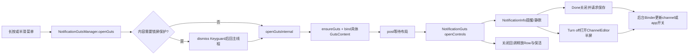
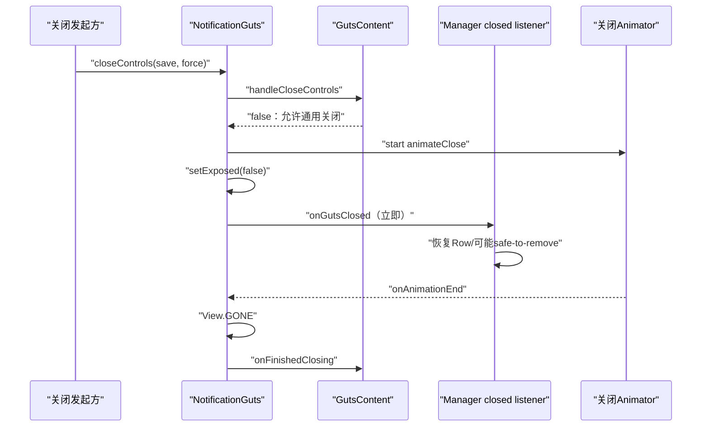
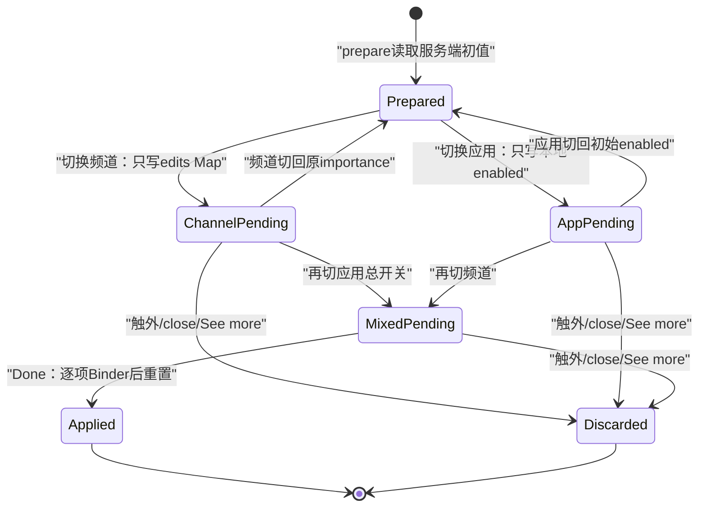

# 第 493 章 Android SystemUI NotificationGuts 与 ChannelEditor：长按打开、频道修改、保存、关闭和保活链

> 源码基线：Android 11 / API 30 / `android-11.0.0_r48`。本章只在 macOS 阅读，不实际编译。核心文件：`NotificationGuts.java`、`NotificationGutsManager.java`、`NotificationInfo.java`、`ChannelEditorDialogController.kt`、`ChannelEditorListView.kt`；交叉阅读`ExpandableNotificationRow.java`、`NotificationManagerService.java`及三份本地测试。

## 1. 本章解决什么问题

长按通知后为什么通知正文会变成“提醒/静默/关闭通知”等控制面板？选择“静默”什么时候才真正写进系统？多频道通知为什么不能直接改一个频道？半屏频道编辑器、系统设置、锁屏解锁、关闭动画和通知保活又怎样连接？

## 2. 一句话主线

`NotificationGutsManager`接住长按、解锁和内容绑定，`NotificationGuts`管理一个可替换控制面的暴露/动画/关闭合同，`NotificationInfo`把简化的提醒或静默选择转换成频道/应用级更新，`ChannelEditorDialogController`则在独立半屏Dialog里暂存多频道开关，最终经`INotificationManager`跨进程写入system_server。

## 3. “Guts”是什么

Guts可理解为通知行背面的控制区域。它不是新Activity，而是`ExpandableNotificationRow`内部的一块`FrameLayout`，长按后与通知内容交换可访问性和高度表现。

## 4. Guts容器与GutsContent要分开

`NotificationGuts`是通用容器；`NotificationInfo`、`NotificationSnooze`、`AppOpsInfo`、会话设置等实现`GutsContent`。容器只关心打开、关闭、动画和高度，具体内容自己决定保存、拦截关闭和是否移除通知。

## 5. 本章聚焦NotificationInfo

本章主线是普通通知的频道控制。Snooze、AppOps和Conversation虽然由同一个Manager分派，但它们有不同保存语义，下一章再继续展开Snooze链。

## 6. 五个关键状态不要混

Row是否已挂Guts、容器是否`mExposed`、Manager当前引用哪一个Guts、NotificationInfo是否选择了importance、ChannelEditor是否有待提交edits，是五份不同账。某一份变了，不代表其他账自动同步。

## 7. 总体调用图



## 8. 运行进程与线程

长按、View绑定、动画、Dialog和点击运行在SystemUI主线程。`NotificationInfo`显式把importance更新post到BG looper；ChannelEditor的准备、查询和apply则由点击路径直接调用Binder，代码没有额外切换后台线程。最终配置写入发生在system_server的NotificationManagerService。

## 9. GutsContent合同的九个问题

内容要提供真实View和高度，处理关闭，回答是否删除通知、是否leavebehind、是否应保存、是否需要锁屏误触保护，并接收父容器、无障碍delegate及关闭动画完成回调。

## 10. handleCloseControls返回值的真实含义

返回true表示“内容暂时接管关闭，容器不要关闭”；返回false才让通用容器继续动画。它不是“保存成功”或“关闭成功”的返回值。

## 11. shouldBeSaved只生成默认save参数

Manager调用批量关闭接口时，容器会从当前GutsContent读取`shouldBeSaved()`，再传给`handleCloseControls(save,force)`。按钮也可直接调用`closeControls(view,true)`显式要求保存。

## 12. leavebehind是另一类关闭政策

Snooze属于leavebehind，普通NotificationInfo不是。`closeControls(removeLeavebehinds,removeControls,...)`可选择只关哪一类，避免一次外部事件错误关闭另一种交互。

## 13. 长按入口来自Manager

`getNotificationLongClicker()`返回`this::openGuts`，Row不用知道NotificationInfo细节，只把自己、触点坐标和MenuItem交给Manager。

## 14. needsFalsingProtection先决定是否解锁

若MenuItem的View实现GutsContent且返回true，Manager设置Keyguard隐藏后保持Shade的政策，再通过StatusBar执行dismiss Keyguard，最后把真正打开动作post回main Handler。

## 15. NotificationInfo永远返回true

普通频道控制的`needsFalsingProtection()`固定true，因此锁屏场景先通过Keyguard安全门。这里的“protection”既影响是否先解锁，也影响打开后是否启用8秒自动关闭。

## 16. 解锁Runnable经过两层投递

StatusBar完成安全门后执行Runnable，该Runnable再`mMainHandler.post()`调用`openGutsInternal()`。这保证View操作回主线程，但捕获的Row、坐标和MenuItem没有generation校验。

## 17. 非Row View直接拒绝

`openGutsInternal()`首先要求View是`ExpandableNotificationRow`，否则返回false，不做触觉反馈，也不设置全局exposed引用。

## 18. 未attach也拒绝

入口检查`getWindowToken()==null`就记录错误并返回false。长按回调与Row被移除的竞态不会在此时强行创建控制面。

## 19. 触觉反馈早于“已打开”判断

通过类型与attach检查后立刻`performHapticFeedback(LONG_PRESS)`；随后若Row的Guts已经exposed，Manager反而关闭它并返回false。因此重复长按关闭时仍会先震一下。

## 20. 已打开时相当于toggle close

Manager调用`closeAndSaveGuts()`，请求关闭controls、重置菜单，但不移除leavebehind。返回false表示没有新打开一份Guts。

## 21. ensureGutsInflated只保证容器存在

Row懒膨胀通用NotificationGuts；具体显示哪个MenuItem内容由后续`setGutsView(item)`替换。容器与内容实例的生命周期并不完全相同。

## 22. bindGuts先安装内容和关闭监听

它让Row设置MenuItem对应的GutsContent，把包名写到Row tag，并为容器安装统一closed listener；然后才根据内容类型执行NotificationInfo、Snooze等专用初始化。

## 23. bind异常被吃成false

任一初始化抛Exception时，Manager记录`error binding guts`并返回false。调用者不会打开动画，但此前已做的`setGutsView()`、tag和closed listener不会自动回滚。

## 24. exposed引用在bind之前写入

`mNotificationGutsExposed = guts`发生在`bindGuts()`之前。若bind失败，Manager仍可能暂时持有一个实际上未打开的Guts引用，这是r48静态可见的状态缝隙。

## 25. 打开动作为什么要post

Guts先设INVISIBLE，再把Runnable post给Guts自身，让View完成layout后才能用真实宽高计算圆形揭示半径和Row高度变化。

## 26. openGuts返回true不等于已经可见

post成功前方法就返回true。真实VISIBLE、`openControls()`、关闭RemoteInput、通知列表高度更新和`mGutsMenuItem`赋值都在Runnable中。

## 27. Runnable再次检查attach

Row若在等待布局时脱窗，Runnable只记录错误并return。它没有清理Manager的exposed引用，也没有把INVISIBLE Guts恢复到一个明确关闭状态。

## 28. 实际falsing门在打开时重算

只有StatusBar当前仍为KEYGUARD且Touch Exploration关闭，容器才得到`needsFalsingProtection=true`。使用无障碍触摸探索时不启用8秒自动关，避免辅助操作被超时打断。

## 29. blocking helper改用淡入

普通Guts从触点做Circular Reveal；如果Row正在显示Blocking Helper，则传false，改用alpha动画，避免两个辅助面板的圆形动画叠加。

## 30. 打开核心源码

```java
row.ensureGutsInflated();
NotificationGuts guts = row.getGuts();
mNotificationGutsExposed = guts;
if (!bindGuts(row, menuItem)) return false;

guts.setVisibility(View.INVISIBLE);
mOpenRunnable = () -> {
    if (row.getWindowToken() == null) return;
    guts.setVisibility(View.VISIBLE);
    boolean protect = state == KEYGUARD && !touchExplorationEnabled;
    guts.openControls(!row.isBlockingHelperShowing(), x, y, protect, row::onGutsOpened);
    row.closeRemoteInput();
    mListContainer.onHeightChanged(row, true);
    mGutsMenuItem = menuItem;
};
guts.post(mOpenRunnable);
```

这段代码包含两个完成点：方法返回只表示已排队，`row.onGutsOpened()`要等打开动画结束。

## 31. onGutsOpened切换无障碍焦点

Row把普通通知内容及children设为`IMPORTANT_FOR_ACCESSIBILITY_NO_HIDE_DESCENDANTS`，只让Guts成为当前语义面。关闭时再恢复AUTO并把焦点请求回Row。

## 32. 打开后主动关闭RemoteInput

同一通知如果正在输入回复，Guts打开后调用`row.closeRemoteInput()`，避免键盘输入面与通知设置面并存。

## 33. NotificationGuts的exposed不是visibility

`setExposed(true)`独立于View的VISIBLE。动画或脱窗失败时，visibility与mExposed可能短时不一致，排障时必须同时打印。

## 34. 8秒falsing计时器

容器在exposed且needsFalsingProtection时post一个8秒Runnable；到点仍满足条件就以未知坐标、save=false、force=false关闭。

## 35. resetFalsingCheck会重新计时

进入系统设置或应用自定义设置前，Manager调用Guts的reset，让用户交互后重新获得完整8秒窗口，而不是沿用最初打开时的剩余时间。

## 36. setExposed触发窗口状态事件

exposed变化时，内容View发送`TYPE_WINDOW_STATE_CHANGED`；打开还请求Accessibility focus。NotificationInfo会在事件文字中追加“通知频道控制已打开/关闭”语义。

## 37. 长按无障碍动作也可关闭

容器给内容安装AccessibilityDelegate，添加ACTION_LONG_CLICK；执行时调用`closeControls(host,false)`。因此二次无障碍长按不会保存尚未点击Done的修改。

## 38. close先尝试dismiss Blocking Helper

私有关闭方法一开始调用`NotificationBlockingHelperManager.dismissCurrentBlockingHelper()`，其结果会决定是否强制走通用关闭以及使用淡出而非圆形收起。

## 39. 脱窗关闭路径不保存

若`getWindowToken()==null`，代码只调用closed listener后return，不执行GutsContent的`handleCloseControls()`，也不`setExposed(false)`。因此save请求、Dialog关闭和exposed账都可能被跳过。

## 40. 内容可以拦截普通关闭

当`handleCloseControls()`返回true且没有Blocking Helper被dismiss时，容器不会动画、不会清exposed、也不会通知closed listener。Snooze等内容可借此完成自己的中间流程。

## 41. NotificationInfo从不拦截

它在需要时保存importance、关闭ChannelEditor，然后固定返回false，所以普通通知设置最终都由通用容器完成关闭动画。

## 42. closed listener早于关闭动画完成

容器先启动animateClose、立刻`setExposed(false)`并同步调用closed listener；真正View.GONE和`onFinishedClosing()`在Animator结束后。因此“Guts逻辑关闭”与“像素完全消失”是两个时刻。



## 43. 关闭动画完成才隐藏View

AnimateCloseListener再次检查当前`isExposed()`；若旧关闭动画期间同一容器已重新打开，就不会把新界面误设GONE，也不会调用捕获内容的finished callback。

## 44. 未attach的animateClose直接完成内容回调

若动画开始时已不attached，方法只记录warning并调用`mGutsContent.onFinishedClosing()`，但本身不设置GONE。外层脱窗早退路径甚至不会进入这里。

## 45. Manager关闭时只移除一个Runnable引用

`closeAndSaveGuts()`从当前exposed Guts移除`mOpenRunnable`。Manager只有一个该字段；快速切换不同Row时，旧Guts上更早的Runnable没有独立token可供精确取消。

## 46. closed listener负责Row恢复

它调用`row.onGutsClosed()`恢复普通内容无障碍，根据Row是否将被删除决定是否通知列表高度变化，并在身份相等时清Manager的exposed与MenuItem引用。

## 47. captured sbn可能早于当前Entry

closed listener闭包在bind时捕获`sbn`，保活释放使用该对象的key。通常同一个Row更新仍保持key，但源码没有在关闭时重新读取Entry并核对代际。

## 48. Guts也会延长通知寿命

如果Entry的Guts正是Manager当前exposed对象且不是leavebehind，`shouldExtendLifetime()`返回true，避免用户正在操作设置时通知先被移除。

## 49. 保活只有一个key槽

`mKeyToRemoveOnGutsClosed`只能记录一个key，符合正常UI一次只暴露一份Guts的假设。异常重入打开多份时，后写key会覆盖前一份。

## 50. 安全移除回调发生得很早

closed listener发现key匹配就调用`onSafeToRemove(key)`，而它发生在关闭动画刚启动时，不等待View真正GONE或NotificationInfo的`onFinishedClosing()`。

## 51. bindNotification先保存上下文

NotificationInfo记录PackageManager、INotificationManager、频道集合、Entry、回调、应用UID、代理包、设备是否provisioned、nonblockable及“此前是否高优先级”。

## 52. 频道集合不能为空

`uniqueChannelsInRow.size()==0`直接抛IllegalArgumentException，由Manager的bind异常捕获后放弃打开。模板控制依赖至少一个真实频道。

## 53. 单一默认频道有特殊显示

必须同时满足Row只有一个unique channel、其ID为DEFAULT_CHANNEL_ID、应用总频道数也为1，才把它视为旧应用的单一默认频道并隐藏频道名。

## 54. total channel查询是Binder调用

bind阶段主线程调用`getNumNotificationChannelsForPackage()`；绑定group名也会调NotificationManager。这些不是读取Entry本地字段，慢Binder会直接影响长按面板打开延迟。

## 55. 三种inline界面模式

nonblockable只显示不可配置说明，隐藏提醒/静默和关闭通知；多频道Row隐藏单频道提醒/静默，显示多频道说明；单频道才显示完整提醒/静默选择。

## 56. “关闭通知”实际打开半屏编辑器

只要不是nonblockable，turn-off按钮就有listener。点击并不立刻禁用通知，而是准备并展示`ChannelEditorDialog`，让用户按应用或频道确认。

## 57. 防止同一Info重复开Dialog

`mPresentingChannelEditorDialog`为true时点击无效；Dialog dismiss回调把它复位并要求父Guts关闭。

## 58. 系统设置按钮的可见条件

appUid非负、Manager提供listener、设备已完成provisioning三者都满足才安装点击；多频道Row传null channel，让设置页落到应用级通知设置，单频道则携带该channel。

## 59. USER_ALL还有用户政策门

Manager仅在通知user不是ALL，或当前用户就是system user时创建系统设置listener。多用户环境下不会无条件为USER_ALL通知提供跨用户频道设置入口。

## 60. 应用自定义通知设置是另一入口

应用若声明可处理`INTENT_CATEGORY_NOTIFICATION_PREFERENCES`，且Notification提供非空settingsText，NotificationInfo才显示app settings链接，并显式绑定解析到的第一个Activity。

## 61. 应用设置Intent携带哪些信息

可带channel ID、notification ID和tag，目标应用可据此打开更具体的内部通知配置。该入口与系统Settings Activity不是同一个Intent。

## 62. delegate只显示“由代理发布”状态

当`sbn.getOpPkg()`与通知package不同，delegate视图设VISIBLE。局部变量`delegatePkg`被声明却未使用，实际代码没有在这里加载代理应用名称。

## 63. 初始行为来自HighPriorityProvider

`mWasShownHighPriority`不只是看channel importance；第486章已知它还会考虑通知特征和group child。NotificationInfo初始选中“提醒/静默”描述的是当前展示分类，不保证等于原始importance的简单阈值。

## 64. 点击提醒只写暂存值

`mChosenImportance=IMPORTANCE_DEFAULT`并更新选择UI；此时没有Binder更新，也没有把`mPressedApply`设true。

## 65. 点击静默同样只暂存

`mChosenImportance=IMPORTANCE_LOW`。如果用户随后点面板外部关闭，因为`shouldBeSaved()`仍false，这次选择不会提交。

## 66. Done才声明用户确认

Done listener先设`mPressedApply=true`，再调用父Guts的`closeControls(view,true)`；圆形收起中心按Done View计算，同时save显式为true。

## 67. Done文案提示是否跨分类

如果当前选择与`mWasShownHighPriority`不同，文案为“确定/应用”；同一分类则显示“完成”。文案依据高/低分类，不比较精确importance数值。

## 68. 保存时即使没选择也会锁定

Done被按下但`mChosenImportance==null`时，saveImportance把它设为starting importance再更新。源码注释明确希望用户即使“保持接收通知”，也锁定importance字段，记录明确偏好。

## 69. 精确importance保留规则

若起始importance已知，且用户选择仍处于原有高/低一侧，真正`newImportance`恢复starting值；只有跨越DEFAULT阈值时才使用DEFAULT或LOW。

## 70. importance归一化源码

```java
int newImportance = mChosenImportance;
if (mStartingChannelImportance != IMPORTANCE_UNSPECIFIED) {
    if ((mWasShownHighPriority && mChosenImportance >= IMPORTANCE_DEFAULT)
            || (!mWasShownHighPriority && mChosenImportance < IMPORTANCE_DEFAULT)) {
        newImportance = mStartingChannelImportance;
    }
}

bgHandler.post(new UpdateImportanceRunnable(
        noMan, pkg, uid,
        mNumUniqueChannelsInRow == 1 ? mSingleNotificationChannel : null,
        mStartingChannelImportance, newImportance));
```

选择控件只有两档，但保存尽量不破坏同一档内部的原始等级。

## 71. 单频道更新频道对象

Runnable把channel importance设为new值、显式锁`USER_LOCKED_IMPORTANCE`，再调用`updateNotificationChannelForPackage()`。system_server还会按用户更新语义持久化、通知监听者，并在importance NONE时取消该频道通知。

## 72. 多频道inline保存作用到整个应用

当Row包含多个unique channel时传null channel，Runnable调用`setNotificationsEnabledWithImportanceLockForPackage(pkg,uid,new>=current)`。跨到更低一档会禁用应用全部通知，并非只改当前Row涉及的频道。

## 73. 为什么多频道inline不直接改一个channel

一个group summary或聚合Row可能代表多个频道，单一提醒/静默按钮没有无歧义目标。因此inline面板转为应用级开关，细粒度修改交给ChannelEditor或Settings。

## 74. 更新在SystemUI后台但仍是Binder

NotificationInfo每次创建一个绑定BG looper的Handler并post。UI先关闭，实际system_server更新可稍后失败；catch只记日志，不把界面重新打开。

## 75. 更新前临时允许重新排序

`VisualStabilityManager.temporarilyAllowReordering()`让importance变化引发的section/rank迁移可及时反映，不被旧的视觉稳定门长期卡住。

## 76. Binder失败前本地channel已被改

Runnable先`mChannelToUpdate.setImportance()`和`lockFields()`，再跨进程调用。若Binder抛RemoteException，共享的本地NotificationChannel对象已经改变，但服务端可能没成功持久化。

## 77. onFinishedClosing更新的是chosen而非newImportance

关闭动画结束时只要chosen非null，就执行`mStartingChannelImportance=mChosenImportance`，并不检查本次close的save值。于是保存归一化把newImportance恢复成更精确旧值时，本地账会与真正提交值不同；甚至用户选了Silent后从外部关闭、根本没保存，starting账也会在动画结束时改成LOW。

## 78. bind没有复位chosen与pressedApply

`bindNotification()`重写大量上下文字段，却没有把`mChosenImportance=null`或`mPressedApply=false`。同一个NotificationInfo View在密度重绑或再次打开时，旧“已选择/已确认”状态可能影响shouldBeSaved和后续关闭。

## 79. bindInlineControls也不会清暂存选择

`onFinishedClosing()`重新绑定按钮和显示，但初始行为仍按`mWasShownHighPriority`设置，暂存字段则保留。画面选择与内部chosen可能因此不同步。

## 80. CheckSaveListener在r48已成为悬空链

Presenter构造了一个可在锁屏显示挑战后再保存的`CheckSaveListener`，Manager也接收并存进`mCheckSaveListener`，但本树中没有任何生产调用读取它；NotificationInfo自身也未接收该listener。不要沿旧注释误以为每次save仍经过checkSave。

## 81. 为什么不能直接称为锁屏漏洞

普通NotificationInfo的Guts在打开前已因`needsFalsingProtection=true`进入Keyguard dismiss链，因此旧保存挑战可能已被前置安全门替代。准确结论是listener未消费，而不是仅凭此就断言可绕过锁屏。

## 82. ChannelEditor是单例Controller

所有NotificationInfo共享同一个Controller实例，内部只保存一组package、uid、Dialog、edits和finish listener。这依赖UI一次只展示一份频道编辑器。

## 83. prepare先同步查询应用状态

它记录应用信息，调用`areNotificationsEnabledForPackage()`，查询全部ChannelGroup，建立group ID到名称的Map，再挑最多四个频道并创建Dialog。

## 84. 查询异常采用保守UI值

获取groups异常返回空列表；查询应用通知是否开启异常返回false。后者会让Dialog看起来像应用通知已关闭，但只要用户不改变该状态，apply不会写服务端。

## 85. 最多四个频道如何选择

先从调用者提供的Set按其迭代顺序取最多四个，再从所有group中补充未出现频道；补充项按name字符串、name为空时按id排序。

## 86. provided Set顺序未被强制排序

若传入HashSet，当前Row相关频道的前四个顺序可不稳定。只有“用于补齐”的其他频道走字母排序。

## 87. 补齐候选过滤三类频道

OEM锁importance、critical device function锁importance、importance NONE的频道不作为额外补齐项。但调用者直接provided的频道在前置加入时没有经过这组过滤。

## 88. 仅默认miscellaneous频道时不显示频道行

若最终恰好只有DEFAULT_CHANNEL_ID，列表清空，只保留应用总开关。这面向target O及更老应用的兼容模型。

## 89. groupNameLookup在prepare开头未clear

正常Done/close会在resetState清Map；但若未完成上次Dialog就再次prepare，旧group ID仍可能残留，因为新prepare只clear channelGroupList，不先clear groupNameLookup。

## 90. show只检查prepared布尔值

第一次prepare后`prepared=true`，而resetState从不把它改回false。Dialog结束后再次直接调用show不会触发“必须先prepare”异常，却可能展示已清空状态的旧Dialog。

## 91. Dialog是Status Bar子面板

Window类型为`TYPE_STATUS_BAR_SUB_PANEL`，从底部居中、宽MATCH_PARENT、高WRAP_CONTENT，透明背景并使用输入法风格动画；它不是普通应用可创建的Dialog窗口。

## 92. 点击外部只dismiss不apply

`setCanceledOnTouchOutside(true)`，OnDismiss只调用finish listener。待提交edits只有Done按钮先调用`apply()`；触外、父Guts强关或Controller.close都不会保存。

## 93. finish listener反向关闭父Guts

NotificationInfo打开Dialog时设置listener：清`mPresentingChannelEditorDialog`并调用父Guts关闭。于是半屏Dialog消失后，后面的通知控制面也一起收起。

## 94. 父Guts先关闭时会断开listener

NotificationInfo.handleCloseControls发现Dialog仍展示，会先把finish listener设null，再`controller.close()`，避免Dialog dismiss回调重复发起父Guts关闭。

## 95. Done应用后才reset

Dialog Done依次`apply()`、`done()`；done先reset所有Controller状态，再dismiss。OnDismiss listener看到的Controller字段已经被清理。

## 96. See more不会提交临时编辑

“查看更多”先启动系统Settings，再直接done，没有调用apply。用户在半屏中尚未按Done的频道/应用开关会被丢弃，由完整Settings重新承担配置。

## 97. 应用总开关与频道开关分开暂存

应用开关保存在`appNotificationsEnabled`；频道变化保存在`Map<NotificationChannel,Importance>`。改变UI时不立刻修改NotificationChannel对象，直到apply。

## 98. 频道关闭再打开如何撤销

ChannelRow关时提议IMPORTANCE_NONE；再次打开时提议该channel对象当前原始importance。若等于原始值，Controller从edits Map移除，Done文案恢复“完成”。

## 99. apply逐项跨Binder

它遍历edits，先在本地channel上改importance，再调用`updateNotificationChannelForPackage()`；最后若应用总开关与初始值不同，再调用`setNotificationsEnabledForPackage()`。



## 100. Channel对象是可变HashMap key

`NotificationChannel.hashCode()`包含importance等可变字段，apply期间又修改importance。不过紧接着done用`Map.clear()`整体清空，不按变后hash逐个remove；当前路径没有因此遗留项，但这种key设计不适合扩展为修改后再查找。

## 101. 单项失败不阻止后续项

`setChannelImportance()`内部catch所有Exception，apply循环继续；可能部分频道成功、部分失败，随后状态仍被reset且Dialog关闭，没有事务回滚或错误提示。

## 102. app开关关闭会隐藏频道行

`ChannelEditorListView.updateRows()`每次移除并重建所有ChannelRow；应用disabled时只保留应用总开关，不创建频道行。

## 103. 频道编辑与应用开关的错位边界

先把某频道关掉只会写edits Map，不改channel对象；再把应用总开关关掉并重新打开，频道行从原始channel.importance重建，视觉会重新显示为开，但Map里仍保留“提交为NONE”。若此时按Done，最终频道会被关。

## 104. 错位为什么不是推测过头

源码同时满足三件事：重建行读取`nc.importance != NONE`，propose只写Map，updateRows不清edits。因此这条状态错位可以静态推导；实际产品是否允许完整操作序列仍可用UI测试验证。

## 105. ChannelRow的gentle字段没有消费者

它按importance低于DEFAULT计算`gentle`，但本文件及本地SystemUI生产搜索没有读取该字段。当前Dialog仅提供开/关，不以gentle改变样式或排序。

## 106. 高亮只是提示来源频道

Dialog onShow遍历providedChannels，让匹配Row执行六段200ms往返色彩动画。若频道没进入最多四项列表，highlight静默找不到，不改变选择。

## 107. prepared与finish listener也可能陈旧

resetState既不清prepared，也不清onFinishListener。正常NotificationInfo每次都会覆盖listener，但脱离正常调用顺序直接复用Controller时，旧listener仍可能在未来dismiss时收到回调。

## 108. ChannelEditor保存与NotificationInfo保存不同

ChannelEditor在点击Done的主线程直接逐项Binder调用；NotificationInfo则post BG Handler并显式临时允许重新排序。两套UI最终都改通知政策，却没有共享同一提交队列或错误反馈协议。

## 109. system_server最终做什么

频道更新写PreferencesHelper、通知listener并保存policy；importance变NONE会取消该频道现有通知。应用禁用会取消该包现有通知、切AppOps POST_NOTIFICATION、发block状态广播并保存policy。

## 110. Guts关闭与服务端更新的时序

NotificationInfo可在后台更新尚未完成时关闭并释放保活；ChannelEditor则通常在Dialog Done的同步Binder返回后dismiss。UI关闭完成都不等于磁盘policy文件已经持久化成功。

## 111. 测试覆盖审计

严格按独立`@Test`统计：ChannelEditorDialogController 10项、NotificationInfo 38项、NotificationGutsManager 15项，共63项；没有独立`NotificationGutsTest`。现有测试重点覆盖频道挑选四项、基础apply、Info绑定/importance、Manager打开/设置Intent/保活，未系统覆盖脱窗关闭、bind失败残留、旧open Runnable、Info字段重绑、prepared复位、finish listener陈旧、应用开关重建频道错位和部分Binder失败。

## 112. macOS只读练习一：画打开的两个完成点

从`openGutsInternal()`标出方法返回true、post Runnable执行、`openControls()`、Animator结束和`row.onGutsOpened()`五个时刻。假设Row在post前脱窗，只读推演visibility、mExposed、Manager引用和无障碍状态分别停在哪里。

## 113. macOS只读练习二：手算importance归一化

为starting importance分别取MIN、LOW、DEFAULT、HIGH，wasShownHighPriority分别取true/false，再点击Alert或Silent，手算chosen与最终newImportance。特别记录onFinishedClosing写回的是哪一个值；不要修改或编译源码。

## 114. macOS只读练习三：重放频道错位

按“频道A原始DEFAULT→关A→关应用→再开应用→按Done”逐行追`edits`、`channel.importance`、新ChannelRow switch和最终Binder参数。再设计一个最小UI测试断言，仍只写测试思路，不运行编译。

## 115. macOS只读练习四：审计关闭与保活

分别推演正常Done、点击外部、8秒falsing、Row脱窗、Blocking Helper被dismiss五条关闭路径，记录是否调用handleClose、是否保存、何时closed listener、何时onFinishedClosing、何时safe-to-remove。

## 116. 易错理解一：点“静默”就立即生效

不准确。点击只写mChosenImportance和UI；必须点Done使save=true，随后后台Runnable才更新。外部关闭、falsing关闭或无障碍长按关闭通常不会保存。

## 117. 易错理解二：关闭通知只影响当前频道

不准确。多频道inline路径可能转成应用级enabled更新；半屏Dialog才提供最多四个具体频道开关，同时还有整个应用总开关。

## 118. 易错理解三：closed listener就是动画结束

不准确。通用容器在启动close动画后立即发closed listener，View.GONE与GutsContent.onFinishedClosing要等Animator结束。通知保活可能在像素完全消失前释放。

## 119. 复读后的最终心智模型

先分清Manager全局引用、Row内部容器、容器exposed、具体GutsContent和独立Dialog；打开时追解锁→bind→post→动画完成，保存时追choice→Done→本地暂存→Binder→服务端policy，关闭时再追内容是否拦截→closed listener→动画完成→保活释放。任何一步都不要用“面板开/关”一个布尔值概括。

## 120. 本章结论与下一章

Notification Guts是一套嵌入通知行的可替换控制面协议，而非简单设置弹窗。Android 11 r48主链清晰，但存在bind失败后exposed引用、脱窗关闭不清账、单OpenRunnable无代际、Info暂存字段不复位、悬空CheckSaveListener、ChannelEditor prepared/finish状态不复位及频道行重建错位等边界。下一章继续阅读NotificationSnooze、SnoozeOption与SnoozeHelper，理解暂缓选择、leavebehind关闭、服务端持久化和重投递链。
