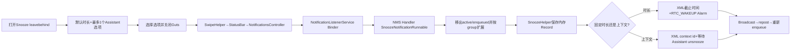
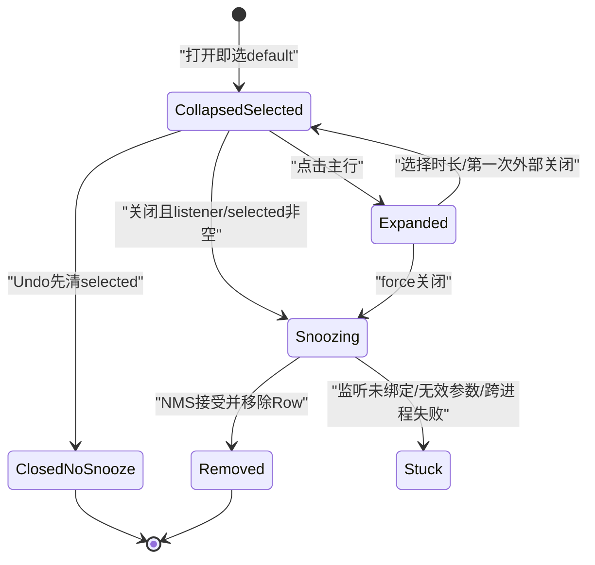
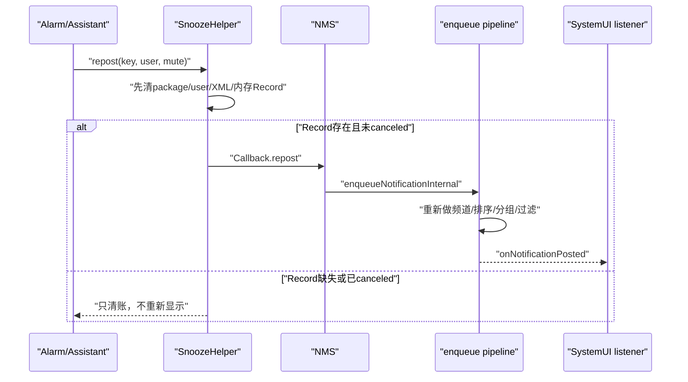

# 第 494 章 Android SystemUI NotificationSnooze 与 SnoozeHelper：选项提交、分组暂缓、持久化、闹钟和重投递链

> 源码基线：Android 11 / API 30 / `android-11.0.0_r48`。本章只在 macOS 阅读，不实际编译。核心文件：`NotificationSnooze.java`、`NotificationsControllerImpl.kt`、`NotificationListenerService.java`、`NotificationManagerService.java`、`SnoozeHelper.java`、`SnoozeCriterion.java`；交叉阅读`NotificationGuts.java`、`NotificationGutsManager.java`、`NotificationSwipeHelper.java`及两份本地测试。

## 1. 本章解决什么问题

通知的“稍后提醒”为什么默认选中一个时长？点选一个选项后为什么还要关闭面板才真正暂缓？固定时长与“到家后提醒”怎样分流？通知消失后存在哪里、更新会不会丢、重启后如何恢复、闹钟到点又怎样重新投递？

## 2. 一句话主线

`NotificationSnooze`只负责选项与leavebehind UI，关闭时经SwipeHelper和SystemUI通知监听器发起Binder请求；NMS在工作Handler中从当前/已暂缓集合找到NotificationRecord，按group规则移除并交给`SnoozeHelper`；Helper以内存Record、XML元数据和AlarmManager三份账维持暂缓，最后重新enqueue。

## 3. Snooze不是普通Guts controls

它实现`GutsContent`但`isLeavebehind()`返回true。第493章的NotificationInfo是controls；批量关闭API可分别决定是否关闭leavebehind和controls。

## 4. Snooze也不是删除

NMS以`REASON_SNOOZED`从活跃列表取消显示，但在SnoozeHelper保留Record或元数据。到期重投递时仍以原应用、uid、tag、id和Notification重新enqueue。

## 5. 三份状态账先分开

SystemUI View保存“展开、选择、是否开始snoozing”；system_server内存保存真实NotificationRecord；policy XML只保存截止时间或Assistant上下文ID。AlarmManager再保存一个未来触发器，但它也不包含完整Record。

## 6. 全链总图

## 7. 线程与进程边界

NotificationSnooze的View操作在SystemUI主线程；Controller通过SystemUI注册的NotificationListenerService跨Binder进入system_server；NMS把snooze工作post到自己的Handler并在`mNotificationLock`内处理；Alarm广播也在system_server进程接收，再调用Helper repost。

## 8. GutsManager怎样绑定Snooze

Manager设置SwipeActionHelper作为listener、写入当前StatusBarNotification、把Entry中的SnoozeCriteria传给View，并给Guts安装高度变化回调。

## 9. Snooze不要求先解锁

`needsFalsingProtection()`返回false，所以Manager不会因这个内容走NotificationInfo的Keyguard dismiss链；打开后也不启用Guts的8秒falsing自动关闭。

## 10. leavebehind不参与Guts寿命延长

NotificationGutsManager的LifetimeExtender明确排除`isLeavebehind()`。真正的通知移除由NMS Snooze请求驱动，而不是靠SystemUI保留Entry直到关闭动画结束。

## 11. onFinishInflate创建默认选项

View找到主行、Undo、展开箭头、divider和选项容器；选项容器初始INVISIBLE且alpha 0，随后读取默认配置、创建TextView并选中默认项。

## 12. 默认配置来自Settings.Global

读取`Settings.Global.NOTIFICATION_SNOOZE_OPTIONS`，用逗号KeyValueListParser解析`default`与`options_array`；缺值回退framework资源的默认分钟数和时长数组。

## 13. 非法整串配置如何处理

`setString()`抛IllegalArgumentException时只记录“Bad snooze constants”，Parser的后续状态取决于KeyValueListParser合同；getter仍带资源fallback，不会在catch里显式新建干净Parser。

## 14. 最多只有四个固定时长

循环同时受`snoozeTimes.length`与四个Accessibility Action ID限制。配置数组即使更长，后面的时长也不会生成普通选项。

## 15. default如何确定

第一项总会先成为default；之后任何minutes恰好等于配置default的项会覆盖它。默认值不在数组时仍用第一项。

## 16. 重复默认时长取最后一个匹配

循环没有break，数组中重复出现default分钟数时，mDefaultOption最终指向最后一个匹配对象，列表中前面的重复项仍保留。

## 17. 配置值没有范围校验

0或负分钟仍会进入`createOption()`和复数资源格式化；极大整数也不会夹紧。显示、metrics和最终NMS参数可能因此出现无效或溢出值。

## 18. 小时展示会截断余数

minutes大于等于60就显示hours，数量用`minutes / 60`整数除法。90分钟会显示类似“1小时”，但真正提交仍是90分钟，显示与实际可能不一致。

## 19. 确认文案会加粗时长

代码在`snoozed_for_time`结果里搜索description，找到就用Spannable加粗；找不到则退回普通字符串，不影响提交分钟数。

## 20. SnoozeCriterion代表上下文而非时间

它包含id、用户可见explanation和confirmation，可Parcelable跨进程。它没有时长字段；什么时候满足由Notification Assistant决定。

## 21. SnoozeCriterion字段允许null

构造器没有运行时非空校验，Parcel也显式支持null。若criterion对象存在但id为null，SystemUI会选择“按上下文”重载，NMS却因context null且duration无效而拒绝请求。

## 22. 最多接纳一个Assistant建议

`MAX_ASSISTANT_SUGGESTIONS=1`，原因是只预留了一个对应的Accessibility action资源。Entry给更多criteria时只取列表第一项。

## 23. Assistant选项的minutes固定为0

`NotificationSnoozeOption(sc,0,...)`用criterion区分语义。SystemUI selection metrics里的duration因此是0，但NMS另外记录“是否criteria”。

## 24. setSnoozeOptions(null)保留原默认项

null直接return；非null时重新构造默认时长并追加最多一个Assistant建议，之后重建选项View。

## 25. 空options数组是危险配置

若固定时长数组为空且没有Assistant建议，mSnoozeOptions为空，而后续`get(0)`与default选择都依赖非空不变量。正常资源保证非空，Settings.Global坏值却没有本类显式保护。

## 26. 每个选项放进View tag

选项TextView显示description，tag保存SnoozeOption，统一OnClick根据tag判断“选择某项”；主行和Undo没有该tag。

## 27. 当前选项会从展开列表隐藏

`hideSelectedOption()`按对象引用`child.getTag()==mSelectedOption`设GONE，其他项VISIBLE。主行已经展示选中确认文案，无需列表再重复一遍。

## 28. getContentView每次恢复default

Guts绑定内容时调用`setSelected(mDefaultOption,false)`，收起选项列表并更新确认文案。它不把`mSnoozing`复位为false。

## 29. mSnoozing可能跨复用残留

一旦提交就设true，类中没有复位点。正常snooze会让Row被移除并重建，通常不再复用同一个View；异常重绑同一对象时`willBeRemoved()`仍可能返回true。

## 30. attach日志不等于用户选择

`onAttachedToWindow()`固定记录default option的SNOOZE_CLICKED，即使之后才注入Assistant选项或当前选择发生变化。它更像“入口曝光时的默认动作”，不是最终提交遥测。

## 31. 展开/收起改变真实高度

collapsed时`getActualHeight()`返回固定`snooze_snackbar_min_height`，expanded时返回View当前height；状态变化通知Guts `onHeightChanged()`，再由Manager让通知栈动画调整。

## 32. 展开动画会取消旧动画

新切换先cancel mExpandAnimation，再从当前alpha过渡到目标alpha；收起正常结束才把选项容器设INVISIBLE，取消的旧收起动画不会错误隐藏新展开内容。

## 33. 展开图标同步切换

show=true用collapse icon，show=false用expand icon。图标表达“下一步动作”，不是当前状态的名称。

## 34. onClick首先重置falsing计时

虽然Snooze自身不需要falsing保护，通用代码仍调用父Guts reset；在当前内容下通常不会真正post 8秒任务。

## 35. option点击只选择不提交

tag非null时调用setSelected、自动收起列表、隐藏已选项、发焦点事件并记录选择metrics。listener.snooze尚未调用。

## 36. 主行点击切换展开状态

id为notification_snooze时执行`showSnoozeOptions(!mExpanded)`；否则统一当作Undo。这依赖只有主行、选项和Undo三类点击源。

## 37. 展开/收起Metrics在r48写反

代码先改变mExpanded，再用`!mExpanded ? OPTIONS_OPEN_LOG : OPTIONS_CLOSE_LOG`。从收起点开后mExpanded已true，反而记录CLOSE；从展开收起后记录OPEN。

## 38. Undo并不是撤销已发送的服务端snooze

UI中的Undo在提交前把selected设null并关闭Guts；这时还没有Binder请求。它更准确是“取消这次即将提交的默认暂缓”。

## 39. 无障碍Undo始终被添加

根View总是增加action_snooze_undo，不要求用户先选择或展开；执行后同样selected=null并关闭，不提交。

## 40. collapsed时requestAccessibilityFocus返回false

方法先让主Snooze View请求焦点，却固定return false；调用方看到的返回值不反映子View请求是否成功。

## 41. close是实际commit触发器

SnoozeOption选中后，外部关闭leavebehind、滑动结束或其他Guts关闭动作会进入`handleCloseControls()`；只有这里才调用mSnoozeListener.snooze。

## 42. expanded时第一次外部关闭只收起

若mExpanded且force=false，方法收起并return true，通用Guts停止关闭。用户还需要第二次外部关闭，或force关闭，才进入提交分支。

## 43. save参数被忽略

Snooze的`shouldBeSaved()`固定true，但`handleCloseControls(save,force)`根本不读取save。collapsed且selected非null时，即便调用方传save=false也会提交。

## 44. Undo为什么仍不会提交

它在调用`closeControls(v,false)`之前先把mSelectedOption设null，所以绕过listener分支，进入真正关闭分支。关键是清selected，不是save=false。

## 45. 正常提交会拦截通用Guts关闭

设`mSnoozing=true`、调用listener后return true。容器当下不做close动画，等待NMS移除通知Row；因此`willBeRemoved()`告诉Guts这是即将离场的内容。

## 46. listener缺失时不会提交

mSnoozeListener为null但selected非null时走else，恢复第一项并return false，由Guts正常关闭。Manager正常绑定会设置listener。

## 47. 无效时长可能让UI卡在snoozing态

0/负分钟被选后，SystemUI仍先设mSnoozing=true并return true；NMS的`snoozeNotificationInt()`会拒绝duration<=0且无criterion。没有服务端移除来收尾，Guts也已被内容拦截。

## 48. 提交状态图

## 49. SwipeHelper只是回调桥

`NotificationSwipeHelper.snooze()`不改UI或服务端状态，只调用NSSL提供的`onSnooze()`，再由StatusBar转给NotificationsController。

## 50. 固定时长与criterion在Controller分流

有SnoozeCriterion就调用`notificationListener.snoozeNotification(key,criterion.id)`；否则把分钟乘成毫秒，走duration重载。

## 51. 分钟转毫秒存在前半段Int运算

表达式`minutes * 60 * 1000.toLong()`先做`minutes*60`的Int乘法，再升为Long乘1000。极大配置分钟数可在升Long前溢出，进而得到错误甚至负duration。

## 52. 旧hours入口也有类似风险

`hours * 60 * 60 * 1000.toLong()`前两次乘法仍是Int。正常UI小时值很小，但API本身不夹范围。

## 53. NotificationListenerService未绑定时静默return

两种`snoozeNotification()`都先`if (!isBound()) return`，不把失败回传SystemUI View。RemoteException也只写verbose日志。

## 54. Binder入口验证listener token

NMS在`mNotificationLock`内用NotificationListeners检查SystemUI listener token，然后clear calling identity并转入内部snooze方法。

## 55. 内部请求还要校验key和参数

key为null直接拒绝；duration<=0且criterionId为null也拒绝。criterionId非null时允许duration使用UNSPECIFIED负常量。

## 56. 为什么还要post Handler

注释说明通知可能尚在enqueue队列，不能只查当前posted列表；post让之前的入队操作有机会完成，再统一查current与snoozed记录。

## 57. Runnable也能找到已经snoozed的Record

`findInCurrentAndSnoozedNotificationByKeyLocked()`先查活跃，再问SnoozeHelper。重复snooze请求可再次处理已暂缓Record并覆盖其时间或上下文。

## 58. group规则先扩展再处理目标

若目标属于group，summary会把同组其他项一起snooze；child若是唯一child且存在有效summary，也把summary一起snooze；最后无论如何再snooze目标本身。

## 59. group集合同时包含当前与已暂缓项

NMS把SnoozeHelper中的同组Record和active/enqueued同组Record拼在一起，所以group size不是“当前屏幕可见child数”。

## 60. summary条件使用isGroup与isGroupSummary

只看通知声明和groupKey，不依赖SystemUI视觉group/isolated HUN。第481章的视觉孤立不会改变服务端逻辑group。

## 61. child唯一判断用总数等于2

期望集合恰好是一个summary加一个child；若有已snoozed重复、enqueued项或其他同组Record，总数变化就不会自动snooze summary。

## 62. r48用String引用排除目标

两处代码写`mKey != groupNotifications.get(i).getKey()`而非`!mKey.equals(...)`。等值但不同String对象会被当作“其他项”再次snooze。

## 63. group各项截止时间并非完全相同

同一个Runnable逐项调用Helper，而Helper每次以当下`System.currentTimeMillis()+duration`计算Alarm和持久化截止；循环耗时会带来毫秒级差异。

## 64. snoozeNotificationLocked先移出通知列表

它记录metrics和用户交互，执行`removeFromNotificationListsLocked()`，以REASON_SNOOZED取消listener可见状态，更新灯光，最后才把Record交给SnoozeHelper。

## 65. criterion还会通知Assistant

NMS先调用`notifyAssistantSnoozedLocked(sbn,criterionId)`，再Helper.snooze(record,contextId)。Assistant据此知道哪一个上下文要负责未来unsnooze。

## 66. 每个Record都会触发policy保存

group批量snooze时，每个`snoozeNotificationLocked()`末尾都调用`handleSavePolicyFile()`，不是整组处理完只保存一次。

## 67. SnoozeHelper的四个核心Map

`mSnoozedNotifications`存内存Record；两份persisted Map分别存时间Long与context String；`mPackages`和`mUsers`按notification key保存定位信息。

## 68. 外层索引是userId加package

`getPkgKey()`简单拼成`userId + "|" + pkg`，内层再由全notification key索引。notification key本身通常已经包含用户与包，但Helper仍维护两层结构便于包/用户查询。

## 69. storeRecordLocked同步更新反向索引

无论目标是内存Record、时间Map还是context Map，都会重写mPackages[key]与mUsers[key]。多个存储之间的数据一致性靠调用顺序，不是一个原子结构。

## 70. 固定时长保存顺序

先保存内存Record，再安排Alarm，之后再次读取wall clock计算activateAt并写时间Map。Alarm时间与XML时间可能相差几毫秒。

## 71. 使用的是wall clock而非elapsed time

截止值和Alarm类型是RTC_WAKEUP，依赖`System.currentTimeMillis()`。用户或网络校时改变墙上时间会影响实际剩余时长。

## 72. Alarm精确且允许Idle

`setExactAndAllowWhileIdle()`确保Doze中也能在目标wall-clock时间唤醒处理；每次schedule前先cancel相同PendingIntent，覆盖同key旧闹钟。

## 73. PendingIntent如何保证每个key唯一

requestCode固定1，但Intent data为`repost:/<notification-key>`，PendingIntent身份包含不同data；extras保存key和userId，FLAG_UPDATE_CURRENT更新同一身份数据。

## 74. context暂缓没有Alarm

Helper只写context Map和内存Record。Assistant或有权限的system listener必须主动unsnooze，否则没有时间自动触发器。

## 75. 新post同key时不会显示

NMS资格检查发现Helper仍有内存Record，就记录“NOT_POSTED_SNOOZED”，用最新NotificationRecord替换旧Record、保存policy并拒绝本次显示。

## 76. update会覆盖canceled标志

cancel只是把旧Record的`isCanceled=true`；应用随后post同key时，`update()`放入新的未canceled Record。专用测试明确期待到期仍能repost，这是r48设计语义。

## 77. cancel不是unsnooze

按id/tag、用户或包cancel只标记Record，不移除Map，也不取消Alarm。到期repost会清理账，但看到isCanceled后不回调重新入队。

## 78. repost先清索引再找Record

方法在锁内先remove mPackages/mUsers、两份persisted元数据，再从内存bucket remove Record；之后只有Record非null且未canceled才取消Alarm、记日志和callback。

## 79. 手动unsnooze与Alarm共用repost

Assistant可unsnooze，system listener也可在截止前unsnooze且带`muteOnReturn=true`；Alarm广播则传false。Callback把该flag交给NMS重投递政策。

## 80. system listener提前unsnooze有权限门

`unsnoozeNotificationFromSystemListener()`要求ManagedServiceInfo.isSystem，否则抛SecurityException；Notification Assistant走自己的token检查。

## 81. Callback并不直接恢复旧Record对象到列表

NMS Callback取Record中的SBN字段，重新调用`enqueueNotificationInternal(..., true)`，重新走频道、Ranking、分组和过滤链，而不是把旧Record直接塞回mNotificationList。

## 82. enqueue异常只记日志

Callback catch所有Exception并记录“Cannot un-snooze notification”；Helper账已经在callback前清除，没有失败回滚或重试Alarm。

## 83. 重投递时序图

## 84. group child重新post会提前唤回summary

正常enqueue一个group child时，NMS调用`repostGroupSummary()`；它在同包同user的snoozed records中找同group summary并单独callback恢复。

## 85. repostGroupSummary没有走通用repost清理

它只从内存bucket、mPackages和mUsers移除summary，然后callback；没有清时间/context persisted Map，也没有cancel该summary Alarm。

## 86. group summary会留下持久化残账

后续Alarm触发时反向索引已丢，难以定位原pkg bucket；writeXml也会因pkg/user缺失跳过输出。内存persisted Map仍可能保留直到进程生命周期结束或其他路径清理。

## 87. clearData用于包数据清除

NMS `clearData(package,uid,...)`调用Helper.clearData，遍历该user/pkg内存Record，移除反向索引、取消Alarm并记录dismiss metrics。

## 88. clearData没有移除持久化Map

方法不删除`mPersistedSnoozedNotifications`和context Map里的同key，也不移除空的mSnoozedNotifications外层bucket。测试只断言运行时isSnoozed和Alarm，没有覆盖XML元数据。

## 89. clearData后同key新post可能再次被snooze

EnqueueNotificationRunnable在正式入队前会查persisted时间/context；既然clearData残留这些Map，新post仍可能命中并再次进入SnoozeNotificationRunnable。这是由本地源码可静态推导的r48边界。

## 90. 重启只恢复元数据不恢复Record

policy XML没有序列化完整NotificationRecord。readXml只重建deadline/context及package/user索引，mSnoozedNotifications仍为空。

## 91. 开机为未来deadline重设Alarm

`scheduleRepostsForPersistedNotifications(currentTime)`遍历时间Map，数据齐全且deadline仍在未来才安排Alarm；过去的时间不安排。

## 92. Alarm到点没有Record就无法重建通知

repost会先清元数据，随后找不到运行时Record便return。只有应用在重启后重新post同key，使NMS用persisted元数据重新构造并snooze新Record，未来才有内容可恢复。

## 93. 重启后应用post固定时长通知

Enqueue Runnable发现persisted deadline仍在未来，就用剩余duration新建SnoozeNotificationRunnable；它保存新Record、重新安排Alarm并再次写deadline。

## 94. 重启后应用postcontext通知

查到contextId就以duration 0、context非null重新snooze，同时再次通知Assistant并保存新Record。

## 95. 过期persisted时间不会主动从Map删除

readXml只不加载过期项；但运行期间Map里deadline过期后，如果Alarm/Record链失配，没有一个统一清扫器在查询时remove它。

## 96. XML写入的过期过滤存在结构错误

时间Inserter看到value<currentTime只return，但外层generic writer已经startTag，随后仍写version/key/pkg/user并endTag；结果是没有`time`属性的notification元素，而不是完全跳过该元素。

## 97. 下次读取会把缺time当0丢弃

`readLongAttribute(...,0)`使上述元素不满足`time>currentTime`，所以功能上不恢复，但policy文件仍写出一个语义残缺节点。

## 98. version属性缺失可在try外NPE

`parser.getAttributeValue(...version).equals("1")`位于进入try之前。恶意或损坏XML节点没有version时会对null调用equals，不能被内部catch(Exception)吸收。

## 99. context XML不会检查id非null

读取context标签时直接取id并store；损坏XML可放入null value，后续writer向XmlSerializer写null attribute可能再失败。

## 100. cleanupPersistedContext没有生产调用

本地搜索只有定义；而实现又把`mUsers.get(key)`直接拆箱int，key索引缺失时会NPE。不能把它当作实际持续清理context残账的主链。

## 101. Helper锁内做了哪些外部工作

schedule persisted在mLock内调用AlarmManager，repostGroupSummary也在mLock内执行Callback；锁范围不只保护Map，还覆盖潜在Binder/重入工作，增加锁等待与顺序分析复杂度。

## 102. removeRecordLocked只清目标Map外层空bucket

它会在内层size为0时移除对应target的user|pkg bucket；但通用repost直接`records.remove(key)`，group summary和clearData也没有统一调用它清runtime空bucket。

## 103. mPackages/mUsers是一致性单点

repost与XML写入都依赖它们反查pkg/user；某条特殊路径只清索引、不清persisted值，就会形成“值仍在但无法输出/定位”的半残状态。

## 104. 时间使用两套Clock入口

Helper直接用`System.currentTimeMillis()`，NMS Enqueue检查用注入的`mSystemClock.currentTimeMillis()`。测试可控制后者，生产通常一致，但两者不是同一个可替换时钟对象。

## 105. policy保存不是Record持久化

`handleSavePolicyFile()`保存的是deadline/context及通知政策，不会把应用Notification的RemoteViews、PendingIntent、extras完整写入XML。重启恢复能力因此依赖应用再post。

## 106. SnoozeCriteria从哪里来

Notification Assistant在Ranking调整中给NotificationRecord/Entry设置criteria，SystemUI只显示最多第一项。选择后criterion id回传同一Assistant链，不由SystemUI自己判断“到家”。

## 107. confirmation与explanation的职责

explanation用于选项列表和Accessibility action，例如“到家后”；confirmation显示在已选主行，例如“将在到家后提醒”。服务端只收到id，不收到这两段文案。

## 108. snooze后应用更新为何不打断期限

只要内存Helper仍标记同key snoozed，新的enqueue会更新保存的Record并返回false，不重新展示；原Alarm仍保持。到期恢复的是较新的Notification内容。

## 109. app cancel为何不立即清Alarm

cancel只标isCanceled，让统一repost时清账并抑制callback，避免多条取消路径都重复操作Alarm/Map。但代价是截止前仍占内存与Alarm槽。

## 110. group与单条的完成点不同

UI只提交一个key，NMS可能扩展成summary/children多条，每条分别取消、保存、排Alarm。SystemUI面板关闭并不知道最终被暂缓的精确group集合。

## 111. 测试覆盖审计

严格按独立`@Test`统计：NotificationSnooze只有5项，全部围绕默认配置解析；SnoozeHelper有30项，覆盖XML、time/context、cancel、update、repost、group summary和clearData，共35项。UI提交/展开/Undo/日志反转/无效参数未测；Helper未覆盖String引用比较、expired空time标签、缺version、clearData持久化残留、group summary持久化残账及重启无Record Alarm。

## 112. macOS只读练习一：推演两次外部关闭

从expanded且default已选开始，第一次调用`closeControls(removeLeavebehinds=true,force=false)`，记录mExpanded、返回值和Guts exposed；再调用第二次，记录mSnoozing、listener调用和为何容器仍不执行close动画。

## 113. macOS只读练习二：画三份持久化账

为一个固定时长通知列出mSnoozedNotifications、persisted time、mPackages/mUsers和Alarm四列；依次推演snooze、应用update、app cancel、Alarm触发、callback失败，每一步只读标记哪些账先被清。

## 114. macOS只读练习三：审计重启场景

假设policy XML仍有未来deadline但内存Record为空，分别推演“应用重启后不post”和“应用立刻post同key”。解释为什么前者Alarm到点不能凭XML重建Notification，后者可以恢复最新Record。

## 115. macOS只读练习四：构造XML与group边界

只写测试思路：一个过期time记录应完全不输出tag、一个缺version输入不应崩溃、一个等值不同引用String key不应重复snooze目标、clearData后persisted查询应为空。不修改生产源码，也不运行编译。

## 116. 易错理解一：选中时长就已经snooze

不准确。option点击只改SystemUI选择；真正请求发生在Guts关闭的handleCloseControls。expanded外部关闭甚至先只收起，第二次才提交。

## 117. 易错理解二：XML保存了完整通知

不准确。XML只有key、pkg、user以及deadline或context ID；完整NotificationRecord只在system_server内存。重启后通常要应用再post同key才能重建可恢复内容。

## 118. 易错理解三：cancel等于提前恢复

不准确。cancel把Record标为canceled，到期只清账不callback；unsnooze才走repost并重新enqueue。System listener提前unsnooze还需要system权限。

## 119. 复读后的最终心智模型

UI层先看default/Assistant选择和leavebehind关闭状态；Binder层区分duration与criterion；NMS层看Handler、group扩展和REASON_SNOOZED；Helper层始终并排检查运行时Record、persisted元数据、反向索引与Alarm；重投递则先清账再重新enqueue，所以任何失败都不能简单回到旧状态。

## 120. 本章结论与下一章

Android 11 Snooze是一条“UI延迟提交→服务端逻辑取消→内存保留→可选XML/Alarm→重新enqueue”的链。r48的重要边界包括UI日志反转、save参数无效、无效时长可悬住Guts、group key引用比较、特殊repost/clearData清理不完整、XML过期tag与version空值，以及重启只恢复元数据不恢复Record。下一章继续阅读NotificationBlockingHelperManager与Assistant反馈，理解“是否继续显示通知”教学面板、用户选择和自动触发政策。
