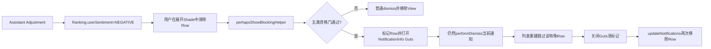
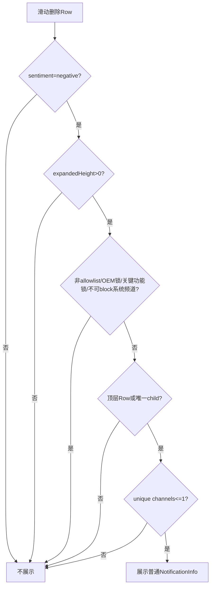
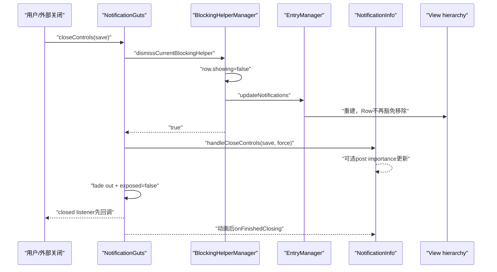

# 第 495 章 Android SystemUI NotificationBlockingHelperManager：负向情绪触发、滑动删除、Guts 临时保留和关闭收口链

> 源码基线：Android 11 / API 30 / `android-11.0.0_r48`。本章只在 macOS 阅读，不实际编译。核心文件：`NotificationBlockingHelperManager.java`、`ExpandableNotificationRow.java`、`NotificationStackScrollLayout.java`、`NotificationViewHierarchyManager.java`、`NotifViewManager.kt`、`NotificationGuts.java`、`NotificationGutsManager.java`、`NotificationInfo.java`；上游交叉阅读`Adjustment.java`、`NotificationRecord.java`和本地测试。

## 1. 本章解决什么问题

用户已经把通知滑走，为什么原位置却可能出现通知设置面板？这条通知究竟删没删？谁决定“可能不喜欢这类通知”，为什么有些通知永远不展示帮助面板，关闭面板后临时留下的Row又怎样真正消失？

## 2. 一句话主线

Notification Assistant可把频道情绪标成negative；用户在已展开通知栏滑除符合条件的Row时，Manager先把普通`NotificationInfo`作为Guts打开并标记Row，随后仍执行真实dismiss；列表重建暂时跳过这个特殊Row，关闭Guts才清标记并触发再次重建，使它最终离场。

## 3. 名字里的Blocking是什么意思

这里的blocking是“帮助用户调整或阻止后续同类通知”，不是阻塞主线程、Binder或当前dismiss。类注释称其为notification blocking helper affordance，核心载体其实是NotificationInfo。

## 4. 它不是删除确认框

用户不需要在面板中再确认“是否删除当前通知”。`performDismissWithBlockingHelper()`无论helper是否展示，后面都会调用`performDismiss()`。

## 5. 它也不是Undo Snackbar

当前r48源码没有把已删除NotificationEntry恢复到active集合的Undo逻辑。Row短暂留在View层，只是承载Guts，不表示通知仍在通知数据管线中。

## 6. 全链总图



## 7. 三层状态必须分开

第一层是NotificationEntry是否还在数据管线；第二层是ExpandableNotificationRow是否还挂在容器；第三层是Row里的Guts是否exposed。Blocking Helper恰好制造“Entry已dismiss、Row仍挂着、Guts已打开”的短暂组合。

## 8. 入口在滑动完成回调

`NotificationStackScrollLayout`的`handleChildViewDismissed()`在滑动删除动画完成后调用Row的`performDismissWithBlockingHelper(false)`。Accessibility删除也能调用该Row方法，但传入来源只影响后续dismiss，不改变helper资格判断。

## 9. Heads-up会先被记为swiped out

若Row仍是Heads-up，NSSL先把key交给HeadsUpManager，再尝试Blocking Helper。不过资格门要求shade expanded，目的正是避免在折叠状态直接对浮动HUN展示面板。

## 10. Shade expanded从哪里来

NSSL构造时把expanded height监听器连接到Manager：每次高度变化都调用`setNotificationShadeExpanded(height)`。

## 11. expanded不是“完全展开”

实现只有一行：`mIsShadeExpanded = expandedHeight > 0.0f`。注释写fully expanded，但代码实际上把任意正高度都视作expanded，正在半拉开的shade也可能通过。

## 12. 第一扇门是negative sentiment

```java
row.getEntry().getUserSentiment() == USER_SENTIMENT_NEGATIVE
```

`DEBUG`可绕过，但r48常量固定false，正常构建只能靠Ranking中的negative值。

## 13. userSentiment不是SystemUI自己猜的

Entry只从`Ranking.getUserSentiment()`读取。这个Ranking由system_server发给NotificationListener，SystemUI不根据滑动次数在本地训练或计算情绪。

## 14. Assistant怎样写入negative

Notification Assistant通过Adjustment的`KEY_USER_SENTIMENT`提交正、负或中性int；NotificationRecord应用adjustment时把该值写进mUserSentiment。

## 15. 情绪表达的是频道倾向

Adjustment注释说明它用于表达用户对“与该通知同频道的通知”的感受。虽然Ranking值附在单条通知上，政策语义并非只评价这个唯一实例。

## 16. 用户已明确选择时Assistant不能覆盖

Record仅在app importance未锁、channel的`USER_LOCKED_IMPORTANCE`也未锁时接受Assistant sentiment。用户自己改过频道重要性后，Assistant不能继续用negative覆盖。

## 17. 用户锁定还会推成positive

`calculateUserSentiment()`发现频道importance或应用importance已被用户锁定时，把情绪设为positive。因此Blocking Helper更像“尚未明确选择时的引导”，不是永久纠缠用户。

## 18. neutral和positive都不展示

Manager测试分别覆盖neutral、positive并期待false。缺省int通常也是neutral，所以没有Assistant明确给negative时不会偶然触发。

## 19. 第二扇门是shade高度大于零

这条门试图保证操作来自通知栏而不是纯Heads-up界面。不过它读取最后一次高度回调的布尔快照，不检查当前StatusBarState或动画终态。

## 20. 第三扇门是Row可被block

`!row.getIsNonblockable()`必须成立。注意“可dismiss”与“可block”是两套政策：当前通知可以清除，也不代表允许用户关闭其未来频道。

## 21. 非blockable先查资源allowlist

Manager读取framework的`config_nonBlockableNotificationPackages`，既支持整包名，也支持`package:channelId`精确键。

## 22. 裸AOSP默认allowlist

r48的基础config列出`com.android.dialer`和`com.android.messaging`。设备厂商可用资源overlay替换或扩展，因此实际产品列表不能只看基础文件。

## 23. 参数名channelName其实是channelId

`isNonblockable(String packageName, String channelName)`调用方传入`entry.getChannel().getId()`。变量名叫name容易误导，配置格式实际必须与频道ID一致。

## 24. 拼接格式存在冒号歧义

键只是`pkg + ":" + channel`，没有转义或结构化解析。正常Android包名不含冒号，但自定义channelId理论上可含冒号；匹配仍是完整字符串精确比较。

## 25. OEM锁定的重要性不可block

Row还检查`channel.isImportanceLockedByOEM()`。厂商锁住的重要性不能由这个面板修改，因此直接阻止helper。

## 26. 关键设备功能锁也不可block

`isImportanceLockedByCriticalDeviceFunction()`同样使Row nonblockable。这比资源allowlist更细，政策可以落在具体NotificationChannel对象上。

## 27. 系统通知还要看channel.isBlockable

Row异步识别该通知是否来自系统包；若是系统通知且channel明确不可block，也把它视为nonblockable。

## 28. 系统通知判定可能回退主线程

缓存异步任务未结束、Entry的`mIsSystemNotification`仍为null时，`getIsNonblockable()`会cancel任务并在主线程同步查询。注释称很少发生，但触发滑动时仍可能增加主线程工作。

## 29. getIsNonblockable的空值顺序不安全

方法开头在检查mEntry是否为空前就读取`mEntry.getSbn()`与`mEntry.getChannel()`；正常已绑定Row保证非空，测试或异常生命周期不能把它当成空安全API。

## 30. 第四扇门约束group child

条件要求`!row.isChildInGroup() || row.isOnlyChildInGroup()`。多child组中的单个child不展示helper，避免一个子项的面板与整组结构发生冲突。

## 31. only child允许展示

一个视觉group只剩唯一child时允许通过。随后`performDismiss()`还可能把可清除summary一起dismiss，但注释明确不再给summary展示第二个helper。

## 32. 第五扇门是unique channel最多一个

`row.getNumUniqueChannels() <= 1`才通过。多频道group无法把一次选择安全归因到某个频道，所以直接放弃教学面板。

## 33. 零频道也会通过数值门

条件写`<=1`而非`==1`；但之后NotificationInfo绑定要求unique channel至少一个并会抛IllegalArgumentException。正常Row应维持非空频道不变量，Manager自身没有防御。

## 34. 资格判断图



## 35. 通过后先关闭旧helper

Manager首先调用`dismissCurrentBlockingHelper()`，保证同一时间最多跟踪一个Row。新滑动可以把旧面板收口，再把Manager指针转向新Row。

## 36. 关闭旧helper不直接调用Guts.close

它只把旧Row的blocking标志清掉并触发通知列表更新。真正Guts对象可能随后因Row移除而detach，不是这里显式执行圆形关闭动画。

## 37. detached旧Row不请求列表更新

若`isAttachedToWindow()`为false，Manager仍清标记、清指针并返回true，但不调用EntryManager.updateNotifications，避免对已经离开窗口的Row多做一次刷新。

## 38. 状态矛盾只记录错误

Manager指针非null但Row标志为false时只Log.e，仍继续清标记和指针。它没有抛异常，也没有尝试修复Guts exposed状态。

## 39. 新Row先设标志再openGuts

顺序是保存`mBlockingHelperRow`、`setBlockingHelperShowing(true)`，再写metrics并调用openGuts。因为Guts打开动画与列表保留策略都读取该标志，顺序不能反过来。

## 40. 打开的菜单项来自长按入口

`menuRow.getLongpressMenuItem(context)`返回普通长按NotificationInfo菜单项。坐标固定传0、0，因为不是从明确的长按触点打开。

## 41. openGuts返回值被忽略

Manager不检查`mNotificationGutsManager.openGuts(...)`的boolean，随后照样count shown并return true。绑定失败、Row未attach或post后窗口token消失时，状态仍可能被当作已展示。

## 42. openGuts的两阶段失败

同步阶段可能因bind异常return false；异步mOpenRunnable还可能发现window token为null后直接return。Manager对两种失败都没有回滚`mBlockingHelperRow`与Row标志。

## 43. 失败为什么可能留下幽灵Row

调用方看到true后不会把View加入普通swiped-out集合，层级管理也因blocking标志跳过移除；如果Guts没有真正expose，就缺少常规关闭动作触发Manager清理。

## 44. Manager写两种曝光日志

它先写category为NOTIFICATION_BLOCKING_HELPER、subtype为TRIGGERED_BY_SYSTEM的Metrics事件，再增加字符串counter`blocking_helper_shown`。

## 45. 注释要求触发日志在display之前

Manager在openGuts前写trigger log；NotificationInfo绑定时又写controls open日志。这个先后可让分析系统区分“系统为何触发”和“内容确实开始绑定显示”。

## 46. r48没有独立Blocking Helper内容类

本地生产源码只把NotificationInfo塞进Guts，没有`BlockingHelperView`。因此不要照搬旧Android截图，期待“Stop notifications / Keep showing / Undo”专用按钮。

## 47. NotificationCounters有历史残留

`BLOCKING_HELPER_STOP_NOTIFICATIONS`、`DELIVER_SILENTLY`、`KEEP_SHOWING`、`UNDO`等常量仍在，但本地SystemUI生产源码没有调用；实际只有shown等极少部分仍接线。

## 48. NotificationInfo也不接initial action

它的`bindNotification()`参数没有“因为blocking helper打开”的动作参数。GutsManager测试名叫`withInitialAction`，但断言中也只是传普通bind参数，是测试命名残留。

## 49. 面板初态由HighPriorityProvider决定

GutsManager传`mHighPriorityProvider.isHighPriority(entry)`；NotificationInfo据此默认选中alerting或silent，而不是因为negative sentiment自动选silent。

## 50. negative不等于立即降频道

Assistant的negative只让SystemUI在一次dismiss时展示机会。用户不点“静默”并保存，NotificationInfo不会仅凭negative修改channel importance。

## 51. 面板内容与第493章相同

单频道显示提醒/静默选择，多频道显示不可直接配置提示，nonblockable显示不可配置文本；但Manager资格门已经排除了nonblockable和多unique-channel的典型情况。

## 52. 用户选择alerting

点击alert把`mChosenImportance`设为IMPORTANCE_DEFAULT并切换描述。若原来已经高优先级，保存时可能规范回原始importance而非强行改成精确DEFAULT。

## 53. 用户选择silent

点击silent把chosen设为IMPORTANCE_LOW。关闭时只有save=true才将变化post到BG Looper的UpdateImportanceRunnable。

## 54. Done按钮决定save参数

NotificationInfo的Done点击先设`mPressedApply=true`，再调用`mGutsContainer.closeControls(v,true)`；普通外部关闭会根据`shouldBeSaved()`读取这个字段。

## 55. Blocking Helper没有特殊保存语义

关闭Guts先调用Manager的dismiss，再照常把save交给NotificationInfo的handleCloseControls。是否保存仍遵循普通NotificationInfo，不因Row已dismiss而自动改变。

## 56. 单频道更新锁住用户importance

后台Runnable修改NotificationChannel importance并调用`lockFields(USER_LOCKED_IMPORTANCE)`。下一次NotificationRecord计算情绪时，这个用户锁能阻止Assistant再提交negative。

## 57. 这是避免重复教学的关键闭环

如果用户明确选alert或silent并成功保存，后续同频道记录会被视为用户已表达偏好。Blocking Helper并没有单独写“已教学”数据库，而借用channel的用户锁字段。

## 58. 多频道分支理论上很少由本入口到达

NotificationInfo对多频道会改应用整体enabled状态，但Manager已要求Row unique channel<=1。除绑定前后频道集合变化等竞态外，helper主链通常走单频道。

## 59. BG更新失败没有UI回滚

RemoteException只写日志；Row当前已经dismiss，Guts也已关闭。用户不会在原面板收到失败提示，后续频道情绪可能仍保持未锁。

## 60. openGuts为什么不用圆形揭示

GutsManager传`!row.isBlockingHelperShowing()`给`openControls()`。helper标志已为true，所以shouldDoCircularReveal=false，改用240ms alpha fade-in。

## 61. 普通长按为什么不同

正常长按Row没有blocking标志，Guts以触点坐标做circular reveal。两者复用相同NotificationInfo，但进入动画体现来源不同。

## 62. needsFalsingProtection仍为true

NotificationInfo要求防误触；若在Keyguard且未启用触摸探索，Guts会安排falsing保护。通常helper要求shade有高度，但不能由此推断绝不会处于锁屏状态。

## 63. 打开后Row内容怎么移动

原滑动删除动画已经把可平移内容移向边缘；helper显示期间，`getTranslateViewAnimator()`动画结束会在Row标志为true时置`mNotificationTranslationFinished=true`。

## 64. translationFinished没有每次显式复位

字段初始false，设置helper false时并不清零。正常Row随后被移除而结束生命周期；若同一Row异常复用，再展示helper时可能继承true。

## 65. helper就绪后平移目标改成Guts

`setTranslation()`发现helper showing且translation finished时，只给`mGuts.setTranslationX()`。这样第二次滑动移动的是设置面板，而不是已经dismiss的原通知内容。

## 66. getTranslation也改读Guts

只有`areGutsExposed && showing && translationFinished`三者同时成立才返回Guts translation；否则仍从普通可平移View或Row translation读值。

## 67. 再次滑动为什么允许dismiss

NSSL的`canChildBeDismissed()`通常在Guts exposed时返回false，但先特殊检查`isBlockingHelperShowingAndTranslationFinished()`并return true。

## 68. 门的顺序很重要

若先统一检查areGutsExposed，helper永远无法二次滑走。当前实现先允许完成平移的helper，再阻止普通Guts被滑除。

## 69. 尚未translation finished时不能再滑走

Row虽然标为helper showing，但special predicate还为false；随后areGutsExposed为true，于是can dismiss返回false。这避免打开与删除动画重叠。

## 70. 首次dismiss仍真实执行

```java
boolean shown = manager.perhapsShowBlockingHelper(this, mMenuRow);
performDismiss(fromAccessibility);
return shown;
```

这三行是理解全章最关键的证据。

## 71. dismissal counter无条件增加

无论helper是否展示，Row都增加`NOTIFICATION_DISMISSED`计数。helper不是把首次操作重新分类成“只打开设置”。

## 72. only-child还可能删除summary

`performDismiss()`发现Row是唯一child，会找到逻辑summary；summary可清除时先普通dismiss summary，再dismiss child。summary不会再次调用带helper版本。

## 73. clearable才执行OnDismissRunnable

Row总调用`dismiss()`完成视觉动作，但只有Entry clearable时运行通知删除回调。Blocking Helper资格本身没有显式要求clearable，正常滑动入口则由can dismiss政策先把关。

## 74. NSSL为何不把helper Row记为swipedOut

`handleChildViewDismissed()`只有shown=false才把View加入`mSwipedOutViews`。shown=true时它要把Row当作临时承载面板的特殊视图。

## 75. 这不阻止数据层dismiss

mSwipedOutViews是栈布局动画/视图 bookkeeping，不是NotificationEntryManager的删除真相。不要因未加入该集合就推断服务端通知仍active。

## 76. 旧渲染管线怎样保留Row

NotificationViewHierarchyManager构造toShow列表后，发现容器child不在toShow时通常加入viewsToRemove；若`row.isBlockingHelperShowing()`则跳过。

## 77. 旧管线还跳过排序计数

同步容器与toShow顺序时，遇到helper Row直接continue，不增加目标索引j。它像插入列表中的临时decoration，不参与正常通知排序。

## 78. 新NotifPipeline也保留Row

Kotlin的NotifViewManager在detachRows前过滤掉`isBlockingHelperShowing`的ListItem。新旧渲染路径都维持同一可见合同。

## 79. 注释称effectively detached

旧管线源码说helper“实际上是一个detached view”，但物理上它仍在list container。准确理解应是：它已从正常通知模型脱钩，却暂留在容器承载Guts。

## 80. 临时Row不参与toShow会有位置边界

排序逻辑跳过它，其他通知仍按toShow调整。helper本身保持当时容器位置，列表变化时它不是普通稳定排序成员。

## 81. 关闭链从NotificationGuts开始

任何`closeControls()`最终进入私有close方法，第一件事就是调用Manager.dismissCurrentBlockingHelper，而不是先让NotificationInfo保存。

## 82. 清理顺序是先解特殊标记

Manager把Row标志设false；若仍attach，调用`mNotificationEntryManager.updateNotifications("dismissCurrentBlockingHelper")`；最后把mBlockingHelperRow置null。

## 83. updateNotifications可能同步重建列表

Manager在清指针前调用外部EntryManager，存在重入分析点；Row标志已经false，所以重建时会被当作不在toShow的普通Row移除。

## 84. wasBlockingHelperDismissed控制动画

Guts得到true后调用`animateClose(..., false)`，不做circular reveal，而用240ms alpha fade-out，与打开时fade-in配对。

## 85. 被helper关闭时内容不能拦截

条件写成`!content.handleCloseControls(...) || wasBlockingHelperDismissed`。即使内容返回true想延迟关闭，只要Manager已dismiss helper，Guts仍会关闭。

## 86. NotificationInfo通常返回false

它在save=true时发起保存，然后return false，允许容器继续关闭。因此helper强制分支对NotificationInfo不是必需，但让Guts合同对其他内容也稳健。

## 87. window token为空仍会通知closed listener

Manager清理先发生；随后若Guts未attach，close方法直接调用listener并return，不再走content handleClose或动画。这可能意味着用户选择尚未保存。

## 88. attached关闭时closed listener早于动画完成

Guts启动fade后立即`setExposed(false)`并调用closed listener；真正`onFinishedClosing()`要等Animator listener。状态收口点不是单一瞬间。

## 89. 完整关闭时序



## 90. 二次滑动也会再次进入perhapsShow

helper Row被允许再次dismiss后仍调用`performDismissWithBlockingHelper()`。如果Ranking依然negative且其他门仍通过，Manager会先dismiss当前helper再尝试为同一Row重新open，存在重复触发的可能。

## 91. 为何通常不会形成明显循环

第二次滑动先移动Guts，关闭/重建和Entry已dismiss状态共同促使Row离场；但Manager方法本身没有“当前Row已经是helper”拒绝条件，不能仅从局部代码证明绝无重复open竞态。

## 92. dismissCurrent返回值只表示有指针

它不证明Guts曾成功显示，也不证明NotificationInfo保存成功。返回true的精确定义是Manager当时持有非null mBlockingHelperRow并执行了清理。

## 93. showing counter可能是假阳性

因为openGuts返回值被忽略，`blocking_helper_shown`实际更接近“已决定尝试展示”。做数据分析时应与NotificationInfo controls open日志或UI事件交叉验证。

## 94. dismissed等旧counter没有生产接线

本地搜索找不到`BLOCKING_HELPER_DISMISSED`等常量的调用。不能从常量名称推导r48一定会上报对应交互。

## 95. NotificationInfo日志subtype始终unknown

`notificationControlsLogMaker()`把subtype固定为`BLOCKING_HELPER_UNKNOWN`，普通长按和helper打开都共用。Manager另外的TRIGGERED_BY_SYSTEM日志才标示系统触发来源。

## 96. 测试覆盖了五类资格门

ManagerTest验证negative展示，neutral/positive、shade折叠、nonblockable、多child中的child、多频道group不展示，也验证单频道大group与唯一child可以展示。

## 97. 测试覆盖旧helper替换不足

现有测试验证show后dismiss、attached触发update、detached不触发update；没有构造“已有helper后立刻展示第二个Row”的完整Guts与层级联动。

## 98. openGuts失败没有专用测试

setUp把openGuts mock固定返回true。没有测试false、异步token丢失或bindNotification抛错后的标志回滚，这正是静态复读发现的风险。

## 99. expanded注释与实现差异未测

测试只传1f和0f，没有传0.1f或负值。源码明确0.1f也为true，不能把测试名或注释当作“完全展开”的证明。

## 100. nonblockable测试只覆盖字符串匹配

ManagerTest验证整包与`pkg:channel`精确键；OEM锁、critical function、系统通知不可block的组合位于ExpandableNotificationRow，未在Manager测试里直接覆盖。

## 101. Row测试验证helper调用路由

ExpandableNotificationRowTest覆盖普通Row、唯一child、group summary的dismiss路由与showing flag getter/setter，但不能替代真实NSSL动画、Guts和管线保留的集成测试。

## 102. 两套管线都接线很重要

r48处在旧EntryManager与新NotifPipeline迁移期。只读NotificationViewHierarchyManager会漏掉feature flag打开时的NotifViewManager；本章并列检查两者才完整。

## 103. 非blockable与不可dismiss不要混淆

nonblockable保护未来频道政策，clearable/dismissable保护当前通知实例。持续前台服务通知可能不可滑除，甚至到不了helper入口；两者判断位置和目的不同。

## 104. user sentiment与importance也不要混淆

sentiment是Assistant/用户偏好信号，importance是最终排序和打扰级别。negative只触发教育入口，不等于NotificationChannel已经变成LOW或NONE。

## 105. Manager不是生命周期所有者

它只保存一个Row引用和shade布尔，真正Guts open/close由GutsManager/Guts负责，真正Entry dismiss由Row回调负责，真正View保留由两套hierarchy manager负责。

## 106. 单指针设计的代价

最多一个helper易于收口，但异步open、快速连续滑动和Row detach需要多个组件共同维持一致性。Manager没有generation token来区分迟到的旧open Runnable。

## 107. mOpenRunnable可能迟到

GutsManager把打开动作post到Guts；在它运行前Manager可能已切换helper或Row被移除。Runnable只检查当前Row token，不核对Manager仍指向该Row。

## 108. stale Runnable的视觉风险

若旧Row仍attach且token有效，迟到Runnable仍可能把旧Guts设VISIBLE并open；Manager的单指针已经指向新Row时，之后关闭旧Guts会先dismiss“当前”新helper。

## 109. 这是静态竞态推论而非已复现Bug

本章没有编译和运行设备测试；源码缺少generation校验能支持风险推论，但真实主线程消息顺序和外层取消逻辑可能缩小窗口。应明确证据等级。

## 110. 最可靠的阅读抓手

沿四个布尔/集合追：Ranking sentiment、Row blockingHelperShowing、Row notificationTranslationFinished、管线toShow/notifList。再沿一个Manager指针追所有权，整条链就不会混乱。

## 111. 测试数量审计

严格按独立`@Test`统计，NotificationBlockingHelperManagerTest有15项；ExpandableNotificationRowTest共26项但只有少量涉及helper；NotificationViewHierarchyManagerTest共6项，未见专门覆盖helper保留。专用测试没有覆盖open失败、partial shade、异步迟到、第二个helper替换和完整关闭动画。

## 112. macOS只读练习一：画三层状态表

从negative Row滑动开始，逐步列出Entry active、Row attached、Guts exposed、blocking flag四列，推演perhapsShow、performDismiss、列表重建、关闭Guts和再次列表重建；不编译、不改源码。

## 113. macOS只读练习二：逐项验证资格门

只用`rg`和编辑器定位五个条件，分别构造neutral、height=0.1、allowlist包、两child group、两unique-channel的纸面输入，写出每个短路在哪一项发生。

## 114. macOS只读练习三：推演open失败

假设`openGuts()`同步返回false，再假设post阶段window token为null；记录Manager指针、Row标志、NSSL swipedOut集合和层级remove豁免，解释为什么两种情况都可能需要显式回滚。

## 115. macOS只读练习四：设计竞态测试

只写测试方案：Row A post了open Runnable尚未执行，快速滑Row B触发新helper，然后依次执行两个Runnable；断言旧Runnable不能打开A、关闭A不能误清B。不运行Gradle或AOSP编译。

## 116. 易错理解一：helper取消了首次删除

不准确。源码明确先尝试展示，再无条件`performDismiss()`；只是View层暂时豁免remove。Entry、Row和Guts三层状态必须分开。

## 117. 易错理解二：negative会自动关闭通知

不准确。negative只是展示入口。只有用户在NotificationInfo选择并保存，后台Runnable才更新频道importance；保存失败也不会自动重试。

## 118. 易错理解三：r48仍有旧版四按钮教学卡

不准确。本工程复用普通NotificationInfo，旧STOP/KEEP/UNDO counter常量没有生产调用。阅读网络文章时必须核对Android版本与本地类签名。

## 119. 复读后的最终心智模型

先把Blocking Helper理解为“dismiss后借壳展示普通频道控件”：Assistant提供negative资格，Manager决定是否借壳，Row仍执行dismiss，两套管线按flag保留壳，Guts关闭清flag并触发移壳；用户importance锁则让后续Assistant不再反复建议。

## 120. 本章结论与下一章

Android 11 r48的Blocking Helper不是撤销删除，而是负向情绪驱动的临时NotificationInfo载体。关键边界包括partial shade也算expanded、nonblockable多源合并、open结果未回滚、两套管线只保留View壳、fade而非圆形动画、旧counter/测试命名残留，以及异步单指针竞态。下一章继续读取Notification Assistant adjustment在NMS中的入队、校验、排序重算与Ranking回传链。
