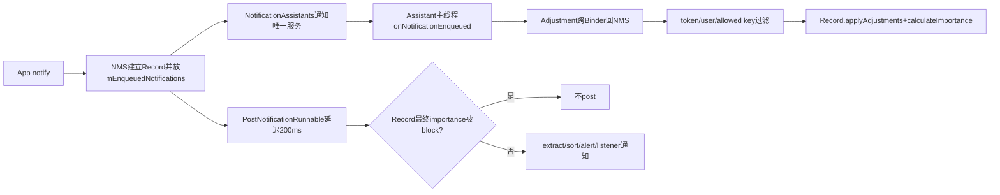
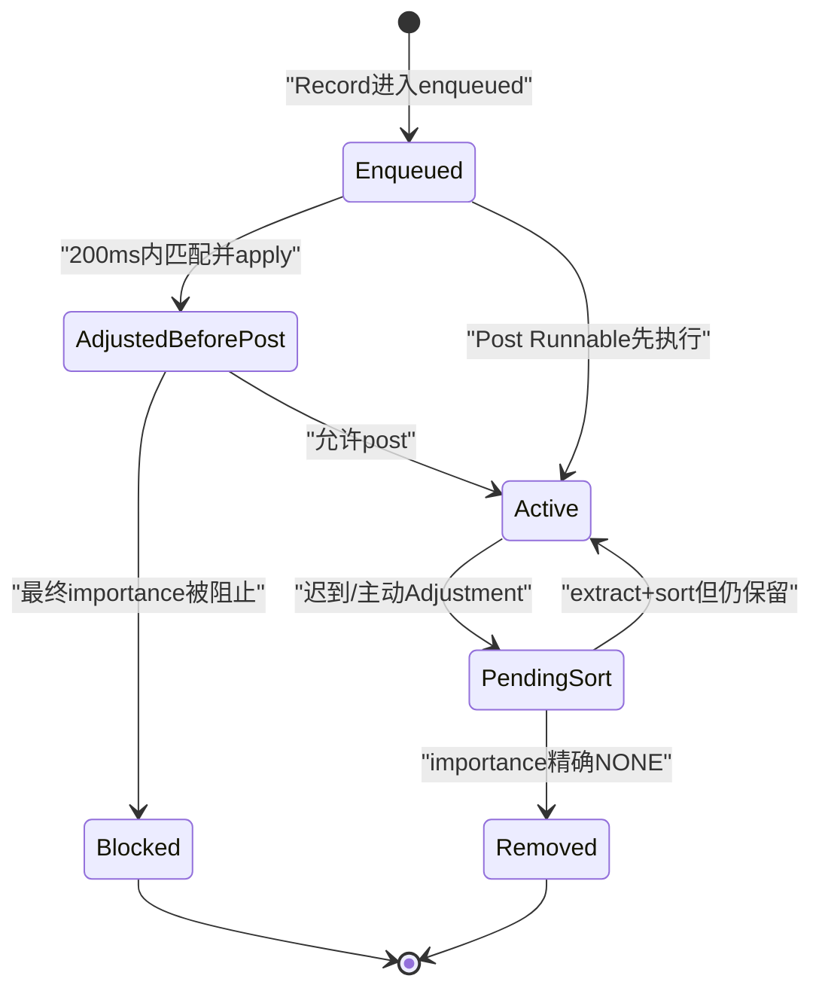
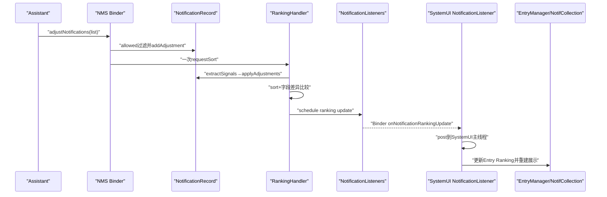

# 第 496 章 Android NotificationAssistantService 与 Adjustment：入队等待、能力过滤、Record应用、排序和Ranking回传链

> 源码基线：Android 11 / API 30 / `android-11.0.0_r48`。本章只在 macOS 阅读，不实际编译。核心文件：`NotificationAssistantService.java`、`Adjustment.java`、`NotificationManagerService.java`中的`NotificationAssistants`、`NotificationRecord.java`、`NotificationAdjustmentExtractor.java`、SystemUI `NotificationListener.java`；交叉阅读NMS RankingHandler、NotificationListeners和本地测试。

## 1. 本章解决什么问题

Assistant如何在通知出现前给出智能回复、动作、重要性或负向情绪？为什么API注释说100ms而NMS实际延迟200ms？已显示通知的Adjustment怎样批量应用、何时取消、何时重新排序，又怎样经RankingMap回到SystemUI？

## 2. 一句话主线

NMS把新Record放进enqueued集合后通知唯一Assistant，并把post Runnable延迟200ms；Assistant主线程返回Adjustment，Binder入口核验token、user和allowed keys后将信号挂到Record；入队链立即apply并重算importance，已发布链在Ranking extractor中批量消费、排序并按差异发送RankingUpdate给SystemUI。

## 3. Assistant是特殊Listener

`NotificationAssistantService`继承`NotificationListenerService`，所以既接收posted、removed、ranking等监听回调，又多出“入队前调整”和用户交互反馈能力。

## 4. 同时只允许一个Assistant

API类注释明确only one active；NMS启用新组件时先撤销当前allowed component，再交给ManagedServices启用新组件。

## 5. 绑定有两层权限

服务声明必须匹配`BIND_NOTIFICATION_ASSISTANT_SERVICE`，而候选应用还需signature/privileged级`REQUEST_NOTIFICATION_ASSISTANT_SERVICE`。普通三方App不能仅声明service就成为Assistant。

## 6. 默认Assistant来自资源

NMS读`config_defaultAssistantAccessComponent`，解析组件并查询USER_SYSTEM中真实存在的服务；空值、无法解析或查询不包含目标组件都会跳过。

## 7. 用户选择优先于默认

`mUserSetMap`记录某用户是否已显式选择；reset defaults只对尚未user-set的活跃用户批准默认Assistant。

## 8. managed profile语义特殊

Assistant可运行在managed profile，也能像listener一样收到当前用户、其profiles和USER_ALL相关回调；但`onNotificationEnqueued`只针对当前用户，Adjustment也只接受相同用户。

## 9. Assistant回调线程

服务端Binder wrapper不直接执行应用实现，而是把消息发到`mHandler`；Handler绑定service进程main looper，所以API承诺所有callback在主线程。

## 10. 入队调整总图

## 11. Record先进入enqueued集合

EnqueueNotificationRunnable在锁内把Record加入`mEnqueuedNotifications`，再处理group、日志并准备PostNotificationRunnable。这给返回的Adjustment提供可查找目标。

## 12. 只有Assistant已启用才延迟

`mAssistants.isEnabled()`为true时才通知Assistant并postDelayed；没有绑定服务则直接post通知，不平白等待。

## 13. 注释100ms与实现200ms冲突

Assistant API两种`onNotificationEnqueued`注释都要求within 100ms，但NMS常量`DELAY_FOR_ASSISTANT_TIME`是200ms。阅读本基线应把100ms当服务实现预算，把200ms当发布Runnable的源码延迟。

## 14. 200ms不是严格响应超时器

NMS没有为每个callback启动一个“到点取消Assistant工作”的Future；它只是把post任务延后。迟到Adjustment仍可落到已发布链，效果不同但不会自动被拒绝。

## 15. 通知Assistant通过Worker Handler

NMS在锁内枚举服务、构建trim后的SBN holder，再post callback到自己的Handler；真正跨Binder调用不在持有通知锁的原调用栈里同步完成。

## 16. sameUserOnly在入队链为true

`onNotificationEnqueuedLocked()`调用通用notify helper时明确传true，只有Assistant和Record同user才收到入队前机会。

## 17. 传给Assistant的SBN可能被裁剪

TrimCache根据listener信息生成适当版本，避免无条件发送所有heavy RemoteViews资源；Assistant不能假设所有回调都持有原始完整对象。

## 18. 同时传NotificationChannel

Binder调用`onNotificationEnqueuedWithChannel(holder, r.getChannel())`；service wrapper最终在主线程调用双参数重载。

## 19. 旧单参数重载仍被兼容

默认双参数实现只是调用`onNotificationEnqueued(sbn)`。实现类若只覆盖旧方法仍工作；覆盖新方法时API注释说明旧方法不会再被调用。

## 20. 返回null表示不调整

Handler只在Adjustment非null时跨Binder回NMS。null不是失败，也不产生空Adjustment或排序。

## 21. issuer由框架覆盖

service在发送前调用`setAdjustmentIssuer()`，写成`opPackageName/className`。Assistant构造对象时不能可靠伪造另一个issuer。

## 22. explanation不是政策输入

Adjustment保存human-readable explanation，但Record应用逻辑不依据文案做决策；真正影响展示的是signals Bundle和key/user。

## 23. Adjustment的五个身份字段

对象包含package、notification key、signals、explanation、user，另有可空issuer。NMS匹配目标主要用key和user，而不是用mPackage再次定位Record。

## 24. 公共构造器带NonNull注解

UserHandle版本把pkg/key/signals/explanation标NonNull；旧SystemApi int-user构造器不做运行时Objects.requireNonNull。Parcel输入也可构造出注解合同之外的null字段。

## 25. Bundle是开放信号容器

Adjustment没有为每个key建立强类型类；类型合同靠常量文档和调用方遵守。错误类型在getInt/getParcelableArrayList等读取时可能回退、抛异常或产生坏对象。

## 26. r48 StringDef并不列全实现key

`@StringDef`列people、snooze、group、sentiment、contextual actions、text replies、importance；类中另定义`KEY_RANKING_SCORE`、`KEY_NOT_CONVERSATION`，Record也会消费它们。

## 27. 默认允许能力只有两项

NMS的`DEFAULT_ALLOWED_ADJUSTMENTS`只包含contextual actions与text replies。定义了key不等于Assistant默认获准修改。

## 28. importance可由DeviceConfig事件放开

监听SYSTEMUI namespace的`NAS_DEFAULT_SERVICE`变化时，NMS调用`allowAdjustmentType(KEY_IMPORTANCE)`并重置默认Assistant。此处由配置事件驱动，不是构造时默认集合的一部分。

## 29. system/SystemUI/shell可改能力

Binder的allow/disallow先执行`checkCallerIsSystemOrSystemUiOrShell()`，普通Assistant自己不能给自己扩权。

## 30. 能力集合写入policy XML

NotificationAssistants把逗号连接的allowed types写到`q_allowed_adjustments` tag；读取时先clear默认集合，再用XML内容覆盖。

## 31. 空XML值意味着全部不允许

读取tag后无论types是否为空都会clear；空字符串不再添加默认项。所谓default只适用于没有持久化覆盖的初始状态。

## 32. 能力变化通知Assistant主线程

allow/disallow遍历当前services并在NMS Handler上post `notifyCapabilitiesChanged`；service wrapper又post到自身main Handler，最后执行`onAllowedAdjustmentsChanged()`。

## 33. Assistant应主动查询当前集合

回调不给增删diff，API要求通过`NotificationManager.getAllowedAssistantAdjustments()`读取快照。

## 34. 查询也有权限门

NMS要求caller是传入pkg本身；非system/phone还必须是当前获批Assistant，否则抛SecurityException。

## 35. 入队返回走哪个Binder API

无论onNotificationEnqueued返回，还是后续单条`adjustNotification()`，service端都调用`applyEnqueuedAdjustmentFromAssistant()`；这个名字并不保证目标仍在enqueued。

## 36. adjustNotification先看isBound

未绑定时静默return，不缓存待发送Adjustment。RemoteException则rethrowFromSystemServer，与unsnooze只记录日志的策略不同。

## 37. 入队Binder先clear calling identity

NMS保存并清Assistant Binder身份，再进入锁和内部操作，finally恢复。token校验仍在锁内通过传入的INotificationListener完成。

## 38. token必须属于已注册Assistant

`checkServiceTokenLocked(token)`防止普通NotificationListener或伪造Binder调用Assistant专属调整入口。

## 39. 入队匹配三项

遍历mEnqueuedNotifications，要求Adjustment key等于Record key、Adjustment user等于Record user、token也与Record同user。

## 40. package字段没有参与匹配

Adjustment里的pkg即便与SBN package不一致，只要key/user/token通过，当前方法仍把它应用到Record。key本身通常包含包信息，但这是间接一致性，不是显式pkg验证。

## 41. 找到后先过滤再入Record

`applyAdjustment(r,a)`先把signals标为defusable，移除当前不允许的key，之后才`r.addAdjustment(a)`。

## 42. 过滤会原地修改Bundle

NMS不是复制一份allowed Bundle，而是从Adjustment持有的原Bundle中remove。Binder反序列化通常已是服务端副本，但Record和后续日志看到的是被裁剪后的对象。

## 43. 为什么先收集toRemove

遍历Bundle.keySet时不能安全同时remove，所以先记录非法key，再第二轮删除。

## 44. 未知key也会被删除

能力检查是集合contains，不是“已知key才审查”。任何实验性或拼错的key，只要未显式allow，就在进入Record前消失。

## 45. 空signals Adjustment仍会入队

signals非null但所有key都被删掉时，NMS仍调用`r.addAdjustment()`；Record apply后清队列，但不会设置issuer，因为signals已empty。

## 46. null signals的路径不一致

`applyAdjustment()`对null signals直接不添加；但已发布批量路径随后无空保护地调用`adjustment.getSignals().containsKey()`。公共合同标NonNull，损坏Parcel或旧构造器违约可能导致NPE。

## 47. 入队找到后立即apply

NMS调用`r.applyAdjustments()`，不等待常规Ranking extractor。因为PostNotificationRunnable很快要检查是否blocked。

## 48. 入队还显式calculateImportance

Record应用KEY_IMPORTANCE只设置assistant importance，不立即计算最终值；NMS紧接着调用`calculateImportance()`，确保post前block判断看到新值。

## 49. importance会被夹到范围

Record把Assistant int夹在IMPORTANCE_UNSPECIFIED到IMPORTANCE_HIGH之间。超大值降到HIGH，过小值升到UNSPECIFIED，而不是任意int进入排序。

## 50. 用户频道重要性优先

最终importance只有在channel尚未user-set、也未被OEM或关键设备功能锁定时才采用Assistant importance。

## 51. system importance优先级更高

即使Assistant覆盖成功，随后存在mSystemImportance时又覆盖最终importance，并把explanation改成SYSTEM。

## 52. IMPORTANCE_NONE如何在post前阻止

PostNotificationRunnable找到enqueued Record后先调用`isBlocked(r)`；若Assistant最终importance使其被block，写日志并return，不加入mNotificationList。

## 53. 早退后的enqueued清理要继续追finally

不能只看到return就断言Record永久留在mEnqueuedNotifications；PostNotificationRunnable外围try/finally负责通用移除。阅读时应把方法尾部清理与早退一起检查。

## 54. 迟到Adjustment如何降级

入队遍历找不到目标时，在同一锁内调用单条posted入口；Java synchronized可重入，所以不会因再次进入mNotificationLock自锁死。

## 55. 迟到不等于忽略全部信号

KEY_IMPORTANCE文档说late enqueue importance可能被忽略其“发布前阻止/静音”时机，但NMS实际会在active Record仍存在时按已发布Adjustment处理，可能视觉降级或取消。

## 56. 已发布单条只是包装批量

`applyAdjustmentFromAssistant()`建一个ArrayList放入Adjustment，再调用`applyAdjustmentsFromAssistant()`，没有独立排序算法。

## 57. 批量API只跨一次Binder

service为列表中的每个Adjustment写issuer后一次提交。NMS在一把notification lock内循环，非NONE项目最终合并成一次requestSort。

## 58. 批量列表没有显式null元素保护

循环直接读取`adjustment.getKey()`。API参数NonNull只约束列表引用，不自动证明每个元素都非null；违约元素可中断整批。

## 59. 已发布目标从mNotificationsByKey找

这里不遍历enqueued，直接按key查active map。找不到的Adjustment静默跳过，不回传逐项结果。

## 60. 已发布路径只验证token同user

target Record存在且`mAssistants.isSameUser(token,r.userId)`才应用。Adjustment自身的user字段在这条路径没有参与判断，与入队路径不同。

## 61. 这是两条路径的重要不对称

同一个Adjustment在入队时user不匹配会找不到并fallback；fallback后的active路径却不再看Adjustment user。真正安全边界仍由token所属user和Record user维持。

## 62. IMPORTANCE_NONE立即走cancel

过滤并挂到Record后，NMS检查原Adjustment signals中的importance是否精确NONE；是则调用`cancelNotificationsFromListener()`，让正常取消链负责排序和removed回调。

## 63. cancel判断发生在allowed过滤之后

因为Bundle被原地remove，若importance当前不允许，containsKey变false，不会被Assistant借未授权key取消通知。

## 64. NONE判断看原值不是夹紧结果

只有signals中的int精确等于IMPORTANCE_NONE才立即cancel。更低的非法值虽以后会被Record夹范围，却不会进入这条即时取消分支。

## 65. 非NONE只标needsSort

NMS不在Binder线程直接调用`r.applyAdjustments()`，而是请求RankingHandler重新提取信号和排序。

## 66. 一批只请求一次sort

只要至少一个有效非NONE目标，循环结束、退出notification lock后调用一次`mRankingHandler.requestSort()`。

## 67. requestSort会合并旧消息

RankingHandler先remove已有MESSAGE_RANKING_SORT，再发新消息。连续批次会把排序推到最近一次请求之后，而不是每批都执行。

## 68. 这是一种debounce而非queue

反复Adjustment可能持续推迟sort；没有最大等待兜底。正常流量有限，但语义不是“每次请求都至少执行一次”。

## 69. Ranking线程应用Adjustment

`handleRankingSort()`遍历当前mNotificationList，`mRankingHelper.extractSignals(r)`会经过NotificationAdjustmentExtractor，后者只做`record.applyAdjustments()`并返回null。

## 70. Record内部队列有自己的锁

`addAdjustment()`与`applyAdjustments()`同步mAdjustments；外面通常还有notification lock，但内部锁让Record队列的并发合同更明确。

## 71. 多个Adjustment按加入顺序覆盖

Record逐个处理，每个相同key的后值覆盖前值。例如两项都给group override，最后应用的值留下；没有按issuer或置信度合并。

## 72. apply完成会清空队列

循环后`mAdjustments.clear()`。已消费Adjustment不是长期事件日志，Record只保留结果字段和最后一个非空issuer。

## 73. KEY_PEOPLE覆盖人员线索

Bundle中的String ArrayList写入peopleOverride，后续People/affinity extractor可据此改变分类和排序。

## 74. KEY_SNOOZE_CRITERIA只提供选项

它把criteria列表放入Record/Ranking，SystemUI Snooze面板最多展示第一项；不会因为收到criteria就自动snooze。

## 75. KEY_GROUP_KEY改视觉逻辑group

Record设置SBN override group key，可能触发SystemUI group迁移。空值可用于清override，具体分组重建依赖排序/Ranking回传。

## 76. KEY_USER_SENTIMENT有用户锁门

只有app importance与channel importance均未user-locked才接受。第495章的negative helper正从这里获得Ranking信号。

## 77. KEY_CONTEXTUAL_ACTIONS提供NAS动作

Record保存system-generated smart actions；SystemUI第492章会在应用没有自己提供有效候选时考虑显示它们。

## 78. KEY_TEXT_REPLIES提供NAS回复

CharSequence列表进入Record并经RankingMap到Entry；是否可见还要经过RemoteInput存在、数量、空间和SmartReply配置门。

## 79. KEY_RANKING_SCORE没有范围夹紧

实现直接`getFloat()`写mRankingScore，虽注释宣称0到1，本类没有clamp。NaN、负数或大于1的值要看后续比较器如何处理。

## 80. KEY_NOT_CONVERSATION是降级覆盖

boolean写mIsNotConversationOverride，供conversation识别阻止误分类。它不是StringDef默认列出的能力，必须确实在allowed集合才不会被NMS剥离。

## 81. issuer只在signals非空时更新

Record每处理一个non-empty Adjustment且issuer非null，就覆盖mAdjustmentIssuer。最终dump/stats只反映最后一个满足条件的issuer。

## 82. issuer不证明哪个字段最终生效

最后一个Adjustment可能写一个后续被用户锁政策忽略的sentiment，却仍成为issuer；不能把单一issuer当成每个结果字段的完整来源表。

## 83. 排序前建立差异快照

NMS保存order、visibility、badge、bubble、channel、group、people、snooze、sentiment、suppressed effects、smart actions/replies和importance。

## 84. extract对所有active Record运行

一次Assistant更新触发全列表信号提取，而非只处理目标Record。其他extractor的动态结果也可能在同一轮改变。

## 85. sort之后逐索引比较

NMS把排序前第i项快照与排序后第i项Record比较；顺序改变时key不同立即构成change。

## 86. 只在可见差异时发RankingUpdate

若Adjustment被锁政策忽略、结果与旧值相同、顺序也没变，handleRankingSort不会schedule update。

## 87. Ranking更新消息也会合并

Worker Handler的`scheduleSendRankingUpdate()`只有队列不存在同类消息才发送，多个排序变化可合成一次listener通知。

## 88. Ranking回传时序

## 89. NMS为每个Listener生成专属Ranking

`makeRankingUpdateLocked(serviceInfo)`按可见性、用户和trim政策构造更新，不是把同一个全局对象无差别广播。

## 90. Binder通知在NMS Handler异步执行

NotificationListeners在锁内准备update，再post Runnable调用listener Binder，避免在notification lock内直接跨进程。

## 91. NLS wrapper再切Assistant/SystemUI线程

NotificationListenerService收到Binder update后建立RankingMap并发Handler消息；SystemUI的NotificationListener又post到自己的mMainHandler后分发handlers。

## 92. SystemUI有旧新两套消费者

旧NotificationEntryManager和新NotifCollection都实现ranking update入口；具体启用哪条由通知管线feature配置决定。

## 93. Entry拿到的是新Ranking快照

SystemUI按key更新Entry Ranking，随后可能触发过滤、排序、分组、Row重新绑定、Smart Replies变化和Blocking Helper资格变化。

## 94. Adjustment不会直接调用SystemUI View

Assistant只和NMS Binder交互；所有UI结果都经NotificationRecord→RankingUpdate→SystemUI数据管线投影。这样政策真相仍在system_server。

## 95. 已发布importance降低可能已经来不及静音

API文档明确现有通知不会重新alert，但刚发出的声音可能已经发生。late Adjustment不能倒回已经播放的声音、震动或Heads-up曝光。

## 96. 但解除拦截可能对新通知补提醒

NMS某些Ranking reconsideration路径发现intercepted从true变false且Record仍new enough，会调用buzzBeepBlink；不能笼统说所有排序更新永远不触发提醒。

## 97. IMPORTANCE_NONE取消有正常removed原因链

它复用listener cancel API，不是从mNotificationList裸remove，因此SystemUI和Assistant可收到removed回调及Ranking变化。

## 98. Adjustment结果不是频道持久化

Assistant importance保存在当前NotificationRecord，不等于修改NotificationChannel XML。应用下一次post会新建Record并需要再次调整，除非其他政策另有记忆。

## 99. user sentiment也主要属于Record/Ranking

用户真正从NotificationInfo保存importance时才锁Channel字段；Assistant给negative本身不会把频道写成用户锁状态。

## 100. 默认allowed集合为何偏向建议

contextual actions与text replies只增加候选UI，不直接屏蔽通知；importance具有取消/静音能力，需额外政策放开，体现更高风险级别。

## 101. capabilities callback可能连续到达

allow/disallow每次都遍历services并post，无去重消息；短时间反复改变同一key，Assistant应在回调中重新查询最终集合，不依赖次数推算。

## 102. policy XML集合顺序不稳定

mAllowedAdjustments是Set，TextUtils.join输出顺序不应被当成稳定API；语义是成员集合，不是优先级列表。

## 103. addAdjustment与cancel的中间状态

已发布NONE路径先把Adjustment挂到Record，再发起cancel，未调用applyAdjustments。若取消链异常或被延迟，Record队列仍可能由后续extract消费。

## 104. 批量不是事务

循环前几项可能已挂入Record或触发cancel，后面某个坏Adjustment抛异常时没有回滚。一次Binder批量只减少排序次数，不提供全有或全无语义。

## 105. 锁范围包含cancel调用

NMS在notification lock内调用`cancelNotificationsFromListener()`；内部路径必须遵守可重入锁与异步回调约束。分析死锁时要继续追其是否跨进程，而不能只看方法名。

## 106. 入队调整也不是严格一对一响应

相同key更新快速入队时mEnqueuedNotifications可能有多个Record；代码从头找到第一个key/user匹配就break，没有generation、postTime或instanceId匹配。

## 107. 同key多代际是重要竞态

迟到的旧回调只携带key/user，可能调整列表中当前匹配的另一个generation。issuer与explanation也没有携带服务端下发的请求token。

## 108. 这是源码风险而非已复现结论

通常每key enqueue顺序和200ms post清理缩小窗口，但本地实现确实没有generation字段。要确认用户可见影响需设备时序测试，本章只做静态边界标注。

## 109. Assistant断开时回调发送策略

service Handler在执行入队结果前再次检查isBound；若已断开就跳过。SecurityException被框架代应用捕获并记录，因为应用已无法通过断连状态自救。

## 110. 测试覆盖很窄

NotificationAssistantsTest只有4项，主要验证XML升级和“同用户只保留一个Assistant”；NotificationAdjustmentExtractorTest只有2项，验证people/snooze/group/actions被消费。

## 111. 缺失的关键测试

现有两份专用测试未覆盖200ms竞速、allowed原地过滤、importance NONE、用户锁/OEM锁、批量部分失败、同key多代际、requestSort合并、RankingUpdate到SystemUI完整链和null/type错误Bundle。

## 112. macOS只读练习一：对比100与200毫秒

只读定位API注释和NMS常量，画出callback跨NMS Handler、Binder、Assistant main Handler再返回的时间线；说明100ms是实现承诺，200ms是post延迟，两者都不是硬取消器。

## 113. macOS只读练习二：推演allowed过滤

构造包含TEXT_REPLIES、IMPORTANCE和拼错key的纸面Bundle，分别推演默认能力、DeviceConfig放开importance、policy XML为空三种集合；记录Bundle最终剩哪些key。

## 114. macOS只读练习三：比较入队与已发布路径

为同一个Adjustment列出目标查找、user校验、apply时机、importance NONE处理、排序请求五列，解释为什么入队路径立即calculate、posted路径交给extractor。

## 115. macOS只读练习四：设计同key代际测试

只写测试方案：先入队A1并延迟Assistant，随后同key入队A2，再返回A1的negative/importance Adjustment；为Record增加generation期望，验证旧结果不能污染A2。不运行编译。

## 116. 易错理解一：Assistant可修改所有Adjustment key

不准确。定义常量只说明协议；NMS会按全局allowed集合原地删除未授权key，默认只允许contextual actions与text replies。

## 117. 易错理解二：100ms后结果一定丢弃

不准确。r48把post Runnable延迟200ms，迟到后若Record已active还会fallback到posted链；只是无法保证在首次声音/展示前生效。

## 118. 易错理解三：批量adjust是数据库事务

不准确。它只把多项放进一次Binder和一次排序请求；逐项挂Record、逐项cancel，异常没有整体回滚。

## 119. 复读后的最终心智模型

先看Assistant是否唯一获批并同user，再看当前allowed能力；接着区分Record仍在enqueued还是已active；然后追signals只是排队还是已apply，importance是否被用户/OEM/system覆盖；最后检查排序差异是否真的生成RankingUpdate并抵达SystemUI主线程。

## 120. 本章结论与下一章

Android 11 r48的Adjustment是一条“智能服务建议→NMS能力裁剪→Record暂存/消费→统一Ranking投影”的受控通道。关键边界包括100ms文档与200ms实现差异、默认能力很窄、两条user校验不对称、Bundle原地修改、批量非事务、sort消息合并和同key无generation。下一章继续阅读通知点击、ActivityStarter、Keyguard解锁、PendingIntent发送、自动取消与Shade收起链。
