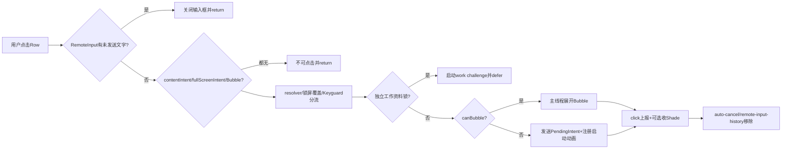
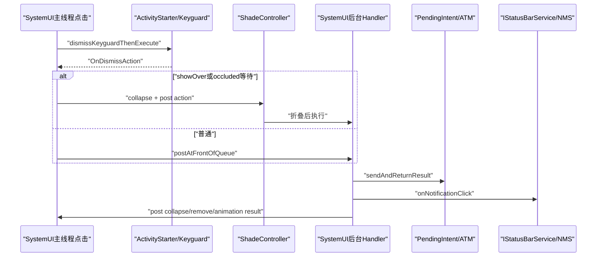
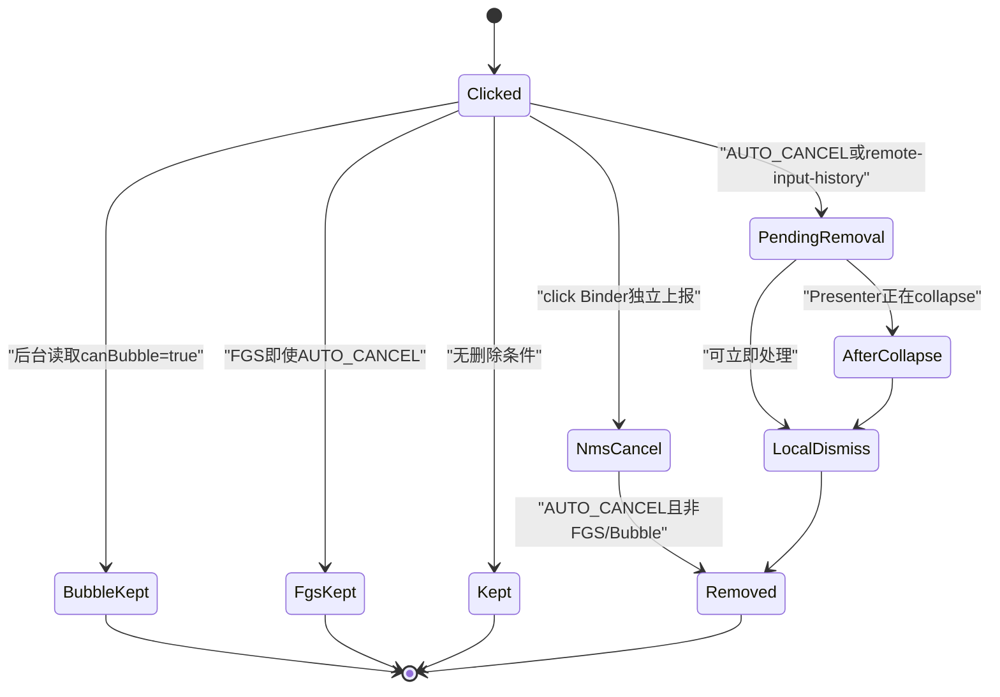

# 第 497 章 Android SystemUI 通知点击：ActivityStarter、Keyguard解锁、PendingIntent、Bubble、自动取消和Shade收起链

> 源码基线：Android 11 / API 30 / `android-11.0.0_r48`。本章只在 macOS 阅读，不实际编译。核心文件：`StatusBarNotificationActivityStarter.java`、`NotificationActivityStarter.java`、`NotificationClickNotifier.kt`、`NotificationManagerService.java`点击回调与取消链；交叉阅读`ActivityLaunchAnimator`、`ShadeController`、`StatusBarRemoteInputCallback`、Bubble/Heads-up/RemoteInput组件及本地测试。

## 1. 本章解决什么问题

点通知后为什么有时只收起输入框、有时解锁、有时进入工作资料挑战、有时展开Bubble？PendingIntent何时真正发送，Shade为什么先后顺序不同，`FLAG_AUTO_CANCEL`由SystemUI还是NMS负责，发送失败后通知会不会仍消失？

## 2. 一句话主线

Row点击先排除有草稿的RemoteInput并选择content/fullscreen Intent或Bubble；按resolver、锁屏覆盖和工作资料决定解锁/折叠时机，再在后台线程发送PendingIntent或切主线程展开Bubble；之后独立上报click、按auto-cancel在新旧管线移除Entry，而NMS也按点击上报再次执行服务端AUTO_CANCEL政策。

## 3. 接口非常小，实现非常大

`NotificationActivityStarter`只声明Row点击、Guts设置Intent、历史设置和一个状态查询；复杂政策集中在Phone实现`StatusBarNotificationActivityStarter`。

## 4. 点击监听器由Row绑定层安装

ExpandableNotificationRow本身不决定目标Activity；绑定器把点击交给ActivityStarter。Row负责提供Entry、RemoteInput状态、动画起点和Bubble能力。

## 5. 点击总图

## 6. 第一扇门保护RemoteInput草稿

若Entry正在active RemoteInput且Row输入文字非空，点击被认为大概率误触；Controller关闭所有remote inputs并立即return。

## 7. 这里只看Row当前active文字

条件用`row.getActiveRemoteInputText()`，不是Entry缓存草稿。Entry.remoteInputText在后续fill-in阶段承担不同作用。

## 8. 关闭输入不会上报通知点击

早退发生在NotificationClickNotifier之前，也不发送PendingIntent、不auto-cancel、不收Shade。用户动作被解释成“退出编辑”而非“打开通知”。

## 9. Intent优先级是content优先

Notification有contentIntent就用它，否则回退fullScreenIntent。普通Row点击不会因为fullScreenIntent更“强”就覆盖已有contentIntent。

## 10. Fullscreen自动拉起是另一条链

通知新加入时`handleFullScreenIntent()`可直接send fullScreenIntent；Row点击使用它仅是contentIntent缺失时的fallback，二者触发时机和资格完全不同。

## 11. Bubble允许没有contentIntent

代码特别允许`intent==null && isBubble`继续。Bubble点击打开嵌入任务栈，不要求走通知content PendingIntent。

## 12. 非Bubble无Intent直接return

既无content也无fullscreen、也不是Bubble时记录non-clickable日志并退出，不执行解锁、折叠、上报或移除。

## 13. isBubble与canBubble不是一回事

入口先用`entry.isBubble()`决定无Intent是否有效；真正执行阶段用`entry.canBubble()`决定是否展开Bubble。这两个状态若在异步期间变化，可能走到不同分支。

## 14. isActivityIntent排除Bubble

只有PendingIntent非null、`intent.isActivity()`且不是Bubble才为true。Broadcast/Service PendingIntent不会触发activity专属resolver和work challenge逻辑。

## 15. resolver为什么要afterKeyguardGone

若目标会启动ResolverActivity，ActivityStarter在Keyguard真正gone后再执行，避免chooser被锁屏状态遮挡或启动顺序错误。

## 16. resolver判断看当前SystemUI用户

`wouldLaunchResolverActivity()`传LockscreenUserManager current user，不直接使用PendingIntent creator user；工作资料目标稍后另行判断。

## 17. showOverLockscreen是特殊快路径

Keyguard正在showing、Intent非null且ActivityIntentHelper判断可显示在锁屏上时，不调用dismissKeyguardThenExecute，而是立即进入postKeyguardAction。

## 18. showOver不等于Keyguard消失

它允许目标Activity覆盖锁屏，Keyguard仍可处于showing。字段`mIsCollapsingToShowActivityOverLockscreen`用来让外部知道正在折叠以展示覆盖Activity。

## 19. Bubble无Intent不能showOver判断

条件显式要求intent非null；Bubble即使最终会显示内容，也不会由这里判定为可直接over lockscreen。

## 20. 普通路径委托ActivityStarter解锁

`dismissKeyguardThenExecute(postAction,null,afterKeyguardGone)`把认证、bouncer和取消交给公共ActivityStarter。本类只提供成功后的OnDismissAction。

## 21. OnDismissAction返回值语义

`handle...AfterKeyguardDismissed()`返回`!panel.isFullyCollapsed()`，告诉Keyguard dismiss链是否还要为shade collapse延迟完成，不是“PendingIntent发送成功”。

## 22. 解锁后先移除Heads-up

进入第二阶段第一件事是`removeHUN(row)`，避免启动Activity时浮动通知继续盖在屏幕上。

## 23. 折叠状态下点击HUN会打标

若Presenter完全collapsed，先用HeadsUpUtil给Row标记clicked HUN，再立即从HeadsUpManager release；下游动画可识别这是点击离场。

## 24. HUN移除不等于通知取消

HeadsUpManager只停止浮层alerting，通知仍可能在shade/数据管线中；auto-cancel是后面的独立路径。

## 25. only child可能带走summary

若点击child应auto-cancel且它是逻辑组唯一child，代码查summary；summary自身也应auto-cancel才保存为parentToCancel。

## 26. parent只在非Bubble后移除

真正删除阶段包在`if (!canBubble)`中；Bubble展开保留通知与summary，不走这套点击自动取消。

## 27. showOver路径先折叠再执行

把后续Runnable加入ShadeController post-collapse actions，然后`collapsePanel(true)`；PendingIntent在折叠完成之后发送。

## 28. occluded Keyguard路径等afterGone

若此时Keyguard仍showing且StatusBar occluded，把Runnable交给KeyguardViewManager的after-keyguard-gone列表，同时触发shade collapse。

## 29. 普通路径投到后台队首

不需要上述两类等待时，`mBackgroundHandler.postAtFrontOfQueue(runnable)`，优先于该Handler已有普通消息执行。

## 30. 为什么不能说始终先收Shade

普通路径可能先在后台发送Intent，随后才按shouldCollapse切主线程折叠；showOver路径却明确先collapse完成再发送。

## 31. 三阶段线程图

## 32. 后台阶段先恢复app switches

调用ActivityManagerService `resumeAppSwitches()`，让用户点击触发的目标不因刚切Home等app-switch限制被挡住。

## 33. resume失败被完全吞掉

RemoteException catch为空；后续仍继续工作挑战、PendingIntent和上报。日志中也看不到这一步失败。

## 34. 工作资料判断只针对Activity Intent

Broadcast或Service PendingIntent即使creator user是受锁work profile，也不走separate profile challenge逻辑。

## 35. creator user决定工作资料目标

代码从`intent.getCreatorUserHandle()`取userId，再检查separate challenge enabled与`KeyguardManager.isDeviceLocked(userId)`。

## 36. startWorkChallenge返回true即defer

它传IntentSender和notification key启动确认凭据；成功发起后只安排主线程collapse并return，不发送PendingIntent、不点击上报、不本地移除。

## 37. 注释说remove但当前代码没有

源码注释写“do not run PendingIntent and remove notification”，实际这个分支没有调用removeNotification。准确行为是当前阶段不发、不上报、不移除，未来挑战回调可能继续。

## 38. startWorkChallenge false会继续

即使profile仍locked，只要callback报告“不需要/未能启动挑战”，代码继续发PendingIntent，让系统端最终权限和启动政策决定结果。

## 39. fillInIntent只携带草稿

Entry.remoteInputText非空且controller对该key不处于spinning，构造新Intent加入`Notification.EXTRA_REMOTE_INPUT_DRAFT`。

## 40. 草稿不是RemoteInput结果

这个extra让目标Activity知道未发送文字，不等同`RemoteInput.addResultsToIntent()`的正式回复结果，也不会触发reply PendingIntent。

## 41. spinning时不带草稿

若RemoteInput发送正在等待更新，避免把已发送/处理中内容又作为draft交给Activity。

## 42. canBubble在后台时重新读取

Entry状态可能在点击与后台Runnable之间更新。后台用当前`entry.canBubble()`而非入口捕获的isBubble，这既能跟随最新资格，也造成路径变化窗口。

## 43. Bubble展开必须切主线程

后台调用helper，若非main就post `expandStackAndSelectBubble(entry)`；方法返回不等待Bubble真正展开完成。

## 44. 普通Intent发送仍在后台线程

`startNotificationIntent()`由BackgroundHandler调用，避免Binder/ATM工作占SystemUI主线程；动画结果再post回主线程。

## 45. 启动动画先按Row和occluded选择

ActivityLaunchAnimator用点击Row作为源几何，并参考点击时捕获的wasOccluded。后续StatusBar状态变化不重新计算adapter。

## 46. Remote Animation按creator package注册

若adapter非null，先告诉ActivityTaskManager“下一个由该creator package启动的Activity”使用它，再send PendingIntent。

## 47. 注册与发送不是原子事务

两次独立Binder调用之间可能有其他启动；PendingIntent发送失败时，已注册的next animation如何被系统消费/过期不由本类回滚。

## 48. sendAndReturnResult返回启动结果码

它不是简单`send()`；返回值post给ActivityLaunchAnimator，后者结合isActivityIntent判断能否继续启动动画。

## 49. 非Activity PendingIntent也调用同API

Broadcast/Service Intent同样sendAndReturnResult，但`isActivityIntent=false`让动画控制器不把结果当Activity启动。

## 50. 发送失败只记录日志

RemoteException或CanceledException被catch，记录简短失败信息；没有返回boolean给外层，也没有恢复Keyguard或Shade。

## 51. 发送失败后主链仍继续

catch结束即回到调用者，后面仍可能hide Assist、collapse Shade、上报click、auto-cancel通知。这是本章最重要的失败边界。

## 52. 注释TODO承认Keyguard收口不足

catch里有`TODO: Dismiss Keyguard`，说明失败时锁屏/解锁视觉状态并未由该类完整处理。

## 53. Activity或Bubble会隐藏Assist

如果是Activity Intent或canBubble，调用AssistManager.hideAssist；Broadcast/Service点击不隐藏当前Assistant UI。

## 54. hideAssist也发生在send失败后

判断基于Intent类型而非实际launch success，进一步说明“用户交互意图”和“外部动作成功”在此链分离。

## 55. shouldCollapse的反直觉条件

只要StatusBar state不是SHADE，或ActivityLaunchAnimator没有pending animation，就折叠。只有处于SHADE且launch animation pending时暂不立即collapse，让动画接管。

## 56. Bubble也走同一个shouldCollapse

展开Bubble后通常仍根据状态折叠shade，但Bubble展开和collapse都是post到主线程，具体先后由消息入队顺序决定。

## 57. collapse helper做线程归一

当前已经main就直接`mShadeController.collapsePanel()`，否则post；后台点击阶段不会直接操作Panel View。

## 58. 点击可见性快照在发送之后建立

读取当前visible count、Entry rank和location，构造NotificationVisibility。若发送导致列表迅速变化，这些值可能已不是用户点击瞬间的原始位置。

## 59. 新旧管线count来源不同

新管线用`NotifPipeline.getShadeListCount()`，旧管线用EntryManager active count；前者更接近最终shade list，语义不完全相同。

## 60. location来自NotificationLogger

它区分Heads-up、AOD、主列表、隐藏等展示位置；但HUN已在第二阶段先remove，location读取时可能受状态改变。

## 61. NotificationClickNotifier做两件事

第一，跨Binder调用IStatusBarService上报system_server；第二，在mainExecutor通知进程内interaction listeners。

## 62. Binder失败不阻止本地interaction

RemoteException被吞，随后仍execute本地listener。SystemUI的“已交互”缓存可能更新，而NMS没有收到click。

## 63. 本地listener要求主线程管理

add/remove调用Assert.isMainThread；实际通知也通过mainExecutor执行，避免监听集合并发修改。

## 64. NMS click首先退出idle

StatusBarManagerService delegate到NotificationDelegate后，NMS `exitIdle()`，再在notification lock内找Record。

## 65. Record已不存在就提前return

找不到key只写warning；当前代码在return前没有recycle传入NotificationVisibility，形成跨Binder对象池资源清理不对称风险。

## 66. 找到后记录三套日志

写Metrics LogMaker、NotificationRecordLogger事件和EventLog，包含寿命、freshness、exposure、rank与count。

## 67. NMS也执行AUTO_CANCEL

它调用cancelNotification，must-have为`FLAG_AUTO_CANCEL`，must-not-have为`FLAG_FOREGROUND_SERVICE | FLAG_BUBBLE`，reason为REASON_CLICK。

## 68. 服务端排除Bubble

即使Bubble通知带AUTO_CANCEL，NMS click路径不取消；Bubble作为持续会话入口应继续存在。

## 69. 服务端排除FGS

Foreground Service通知不能因AUTO_CANCEL点击消失，保持用户对持续后台工作的可见性。

## 70. SystemUI shouldAutoCancel规则相同但不完全同源

本地helper要求AUTO_CANCEL且非FGS；Bubble由外层`!canBubble`排除。一个看Notification flag，一个看Entry当前canBubble，竞态时可能不完全一致。

## 71. 为什么SystemUI与NMS都取消

SystemUI需要及时更新本地View/新管线用户dismiss统计；NMS click上报是服务端政策真相。两条链通过key幂等收口，而不是一个事务。

## 72. 双取消会有竞态

谁先到NMS取决于Binder和主线程post；后到者可能找不到Record或成为no-op。reason、dismiss surface和统计应以实际成功链为准。

## 73. 新管线移除带DismissedByUserStats

它计算surface为SHADE、若仍alerting则PEEK、否则只要Panel有pulsing通知就AOD，并用neutral sentiment和新的Visibility。

## 74. AOD surface判断很粗

`hasPulsingNotifications()`是面板全局状态，不验证被点击Entry自身正在pulse；可能把同屏其他pulse状态投射到目标dismiss surface。

## 75. 旧管线直接performRemove

调用EntryManager `performRemoveNotification(sbn, REASON_CLICK)`，不在此处构造DismissedByUserStats；服务端/日志路径由旧管线内部处理。

## 76. removeNotification始终post主线程

即使调用点可能已在main，也不立即执行；这确保顺序一致，也给NMS click Binder先取消留下竞态窗口。

## 77. Shade正在collapse时继续延迟remove

main Runnable发现Presenter collapsing，就把真正remove加入post-collapse actions，避免列表移除动画与Shade折叠争用造成卡顿。

## 78. 否则立即执行管线remove

“立即”指已post到main之后的当前Runnable内，不是用户触摸回调的同一调用栈。

## 79. remote-input-history也会被移除

即使通知本身没有AUTO_CANCEL，只要RemoteInputManager标记“为了回复历史临时保留”，点击后也调用removeNotification。

## 80. Bubble跳过history移除

整个删除块只在`!canBubble`执行，Bubble即使也处于remote input history状态仍保留。

## 81. auto-cancel状态图

## 82. parent summary移除是旧管线兼容

注释说明新ShadeListBuilder可通过group pruning处理空summary，显式parentToCancel计划未来删除；当前实现无论feature flag都会先计算，非Bubble时调用remove。

## 83. group manager使用逻辑组

isOnlyChild与getLogicalGroupSummary不是单看View children；Heads-up孤立等视觉状态不会自动改变逻辑group判断。

## 84. summary空值缺少防御

代码假定only-child为true就能得到非nullsummary并立即`summarySbn.getSbn()`。Group状态瞬变或不一致时可能NPE。

## 85. mIsCollapsing标志只在末尾清

showOver路径开头置true，正常完成后台方法末尾置false；工作资料challenge早退和潜在运行时异常都不会走末尾清理。

## 86. work challenge可让标志残留

若showOver理论上与separate profile Activity同时成立并在challenge分支return，当前方法没有finally复位。实际组合要依赖ActivityIntentHelper政策，但局部代码不自洽防御。

## 87. 非showOver从未先置true

所以普通work challenge早退不会制造该标志；风险只针对特殊路径组合。

## 88. ActivityLaunchAnimator结果是异步回主线程

PendingIntent已发送后才post launchResult；在回调到达前Shade和Entry可能已变化，Animator必须容忍Row detach。

## 89. send失败不调用setLaunchResult

catch分支没有通知Animator失败。若之前已经产生pending animation，清理由Animator其他timeout/状态路径承担。

## 90. click notifier先于本地remove调用

源码顺序先onNotificationClick Binder，再进入auto-cancel block；但Binder方法调用同步返回前NMS可能已经移除Record。

## 91. NMS回调里会recycle Visibility

正常找到Record后记录、发起cancel并`nv.recycle()`；SystemUI后续本地remove会另外obtain一个Visibility，不复用同对象。

## 92. fullScreen自动入口的资格

Entry加入旧/新管线时调用handleFullScreenIntent；先问InterruptStateProvider，再看DND/VR suppression和importance至少HIGH。

## 93. DND suppression先于importance日志

if/else if顺序意味着同时被DND抑制且importance低时只记录suppressed by DnD，不会再记录not important enough。

## 94. FSI先唤醒Dream

用UiBackground Executor调用IDreamManager.awaken，但不等待其完成就继续在当前线程send fullscreen PendingIntent。

## 95. awaken与send也是并行竞态

设备可能在PendingIntent启动时仍处于Dream转场；源码没有Future join或确认回执。

## 96. FSI发送成功后记Entry状态

调用`notifyFullScreenIntentLaunched()`并增加note_fullscreen counter；CanceledException被完全忽略且不更新Entry。

## 97. 自动FSI不会走点击上报

它不调用NotificationClickNotifier，也不因AUTO_CANCEL删除通知。来电类fullscreen展示不是用户点击。

## 98. Guts设置跳转是第四种启动链

`startNotificationGutsIntent()`先dismiss Keyguard，再用TaskStackBuilder构造父栈，按appUid user启动设置Activity；不使用通知content PendingIntent。

## 99. Guts跳转也支持Row动画

获取ActivityLaunchAnimator adapter，startActivities结果post回main并removeHUN；如果shouldCollapse则通过CommandQueue强制折叠非Recents panel。

## 100. history/settings入口构造自己的Back Stack

showHistory为true时先加Notification Settings，再加History；false时只进入Settings。使用UserHandle.CURRENT。

## 101. startHistory不提供Row动画

TaskStackBuilder传null options，与Guts/通知点击的Row remote animation不同。

## 102. ActivityStarter中的多个“完成点”

Keyguard OnDismiss执行、Shade折叠完成、PendingIntent Binder返回、Activity真正drawn、Animator结束、click上报、通知移除都是不同时间点。

## 103. sendAndReturnResult不是Activity完成回执

它只报告启动请求处理结果，不表示目标Activity已onResume或首帧绘制；动画系统仍要等待窗口转场事件。

## 104. 点击链不是原子事务

解锁、折叠、发送、上报和删除跨线程/进程逐步发生，任一步失败都没有整体回滚。设计故障处理时要问“已完成到哪一层”。

## 105. stale Row/Entry风险

Runnable捕获sbn、row、controller和intent，随后在后台读取`row.getEntry()`；等待解锁/折叠期间通知可能更新、Row复用或detach，没有key generation复核。

## 106. PendingIntent本身相对稳定

入口就捕获原Notification的PendingIntent，后续即使Entry更新，也仍发送原intent；但fill-in draft、canBubble、rank和location读取的是较新Entry状态，形成混合快照。

## 107. parentToCancel也是早期快照

在解锁后、折叠前计算summary Entry，真正remove时group可能已变化；没有再次确认它仍是目标child的summary。

## 108. visibility true是固定值

构造NotificationVisibility时visible参数写true，没有在异步阶段重新确认Row仍对用户可见。

## 109. 测试只有四项

StatusBarNotificationActivityStarterTest严格统计4个`@Test`：Keyguard showing点击，以及Bubble无content在无锁屏/有锁屏、Bubble有content在锁屏的几种路径。

## 110. 大部分关键分支无专用覆盖

RemoteInput草稿、resolver、showOver、occluded、work challenge、send失败、Activity动画、HUN、auto-cancel、summary、双管线remove、FSI和click Binder均未在该测试文件直接验证。

## 111. 静态复读最值得加的测试

应优先覆盖CanceledException后是否仍click/remove、showOver flag的finally、isBubble与canBubble变化、summary null、click Binder失败、本地/NMS双取消顺序和Visibility recycle。

## 112. macOS只读练习一：画点击完成点

列出Keyguard dismissed、Shade collapsed、PendingIntent returned、Activity drawn、click Binder、Entry removed六个时间点；分别标注showOver、普通Activity和Bubble路径的可能顺序。

## 113. macOS只读练习二：推演发送失败

假设sendAndReturnResult抛CanceledException，继续沿源码记录hideAssist、shouldCollapse、NotificationClickNotifier、auto-cancel和Animator结果；解释为何“打不开App”仍可能“通知消失”。

## 114. macOS只读练习三：比较双取消

为SystemUI新管线dismiss与NMS onNotificationClick cancel画两条并发时序，分别让任一方先成功；记录后到方、reason、Visibility和用户统计可能看到什么。

## 115. macOS只读练习四：设计混合快照测试

只写测试：点击捕获Intent A，等待Keyguard期间Entry同key更新为Intent B并改变canBubble/rank；断言产品希望发送哪个Intent、是否展开Bubble及点击rank应来自哪个generation。不运行编译。

## 116. 易错理解一：点击先确保Activity成功再删通知

不准确。发送异常被吞后主链仍继续上报和auto-cancel；PendingIntent结果也不是Activity首帧成功证明。

## 117. 易错理解二：AUTO_CANCEL只由SystemUI处理

不准确。SystemUI有本地新旧管线remove，NMS收到click也按AUTO_CANCEL、非FGS、非Bubble再取消；两者非事务地竞争收口。

## 118. 易错理解三：所有点击都先完全收起Shade

不准确。showOver明确等collapse action，occluded等Keyguard gone，普通路径则先投后台执行，是否立刻折叠还受launch animation pending控制。

## 119. 复读后的最终心智模型

把点击拆成“解释触摸→安全门→选择载体→Keyguard/资料挑战→发送或Bubble→动画/Assist/Shade→click证据→本地与服务端移除”八段；每段单独记录线程、捕获快照和失败后是否继续，才能解释各种半成功状态。

## 120. 本章结论与下一章

Android 11通知点击不是一次startActivity，而是跨SystemUI主/后台线程、Keyguard、Shade、ATM、StatusBarService和NMS的非原子工作流。关键边界包括RemoteInput误触保护、isBubble/canBubble双状态、工作资料defer、原Intent与新Entry混合快照、send失败仍上报/删除、SystemUI与NMS双auto-cancel及极窄测试覆盖。下一章继续阅读通知Clear All、DismissedByUserStats、LifetimeExtender与NMS批量取消收口链。
