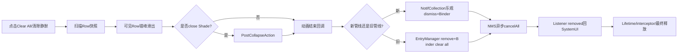
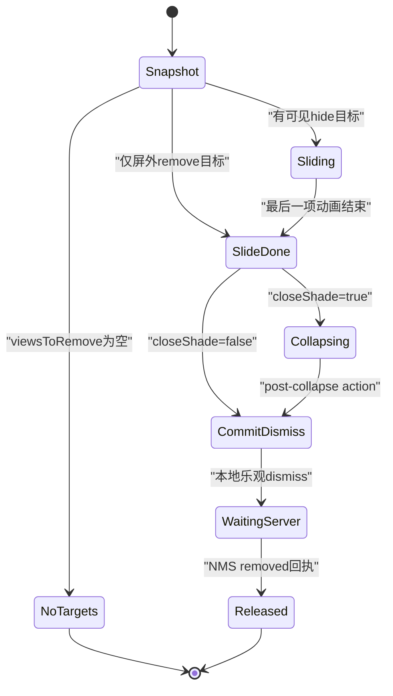
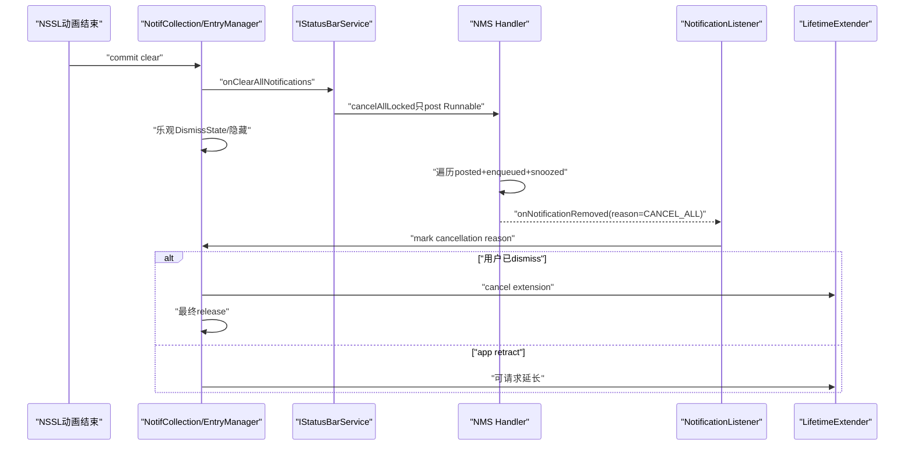

# 第 498 章 Android SystemUI Clear All：批量动画、DismissedByUserStats、新旧管线、LifetimeExtender和NMS取消链

> 源码基线：Android 11 / API 30 / `android-11.0.0_r48`。本章只在 macOS 阅读，不实际编译。核心文件：`NotificationStackScrollLayout.java`、`NotifCollection.java`、`NotificationEntryManager.java`、两代LifetimeExtender接口、`NotificationManagerService.java` cancelAll链；交叉阅读Heads-up、Guts、RemoteInput、ForegroundService extenders、dismiss interceptor和本地测试。

## 1. 本章解决什么问题

点击“全部清除”后为什么先飞走再真正删除？静默分区清除和全部清除为何走不同Binder API？哪些通知不会清，group child怎样处理，DismissInterceptor与LifetimeExtender有什么区别，新旧通知管线又有哪些不一致？

## 2. 一句话主线

NSSL先从当前Row快照挑选可dismiss项并做加速错峰滑出，必要时等Shade折叠，动画结束才把快照交给新NotifCollection或旧EntryManager；SystemUI乐观隐藏并向StatusBarService报清除，NMS异步按flag/user遍历posted、enqueued和snoozed账，而用户dismiss会绕开LifetimeExtender但仍可能被DismissInterceptor改道。

## 3. Clear All不是一个方法

至少包含按钮入口、Row选择、View动画、Shade折叠、SystemUI本地dismiss、StatusBarService Binder、NMS cancelAll、listener removed回执与最终Entry释放九段。

## 4. 全链总图

## 5. Footer按钮清全部Row

Footer dismiss点击先记`ACTION_DISMISS_ALL_NOTES`，再调用`clearNotifications(ROWS_ALL,true)`，表示清全部并关闭Shade。

## 6. 静默Header只清Gentle

NotificationSectionsManager把silent header的clear按钮连接到`ROWS_GENTLE`，通常可选择不关闭整个Shade；它不是NMS的真正“clear all”语义。

## 7. 三种selection

ROWS_ALL全选；ROWS_HIGH_PRIORITY选bucket小于BUCKET_SILENT；ROWS_GENTLE只选bucket精确等于BUCKET_SILENT。

## 8. HIGH_PRIORITY当前没有对应UiEvent

`NotificationPanelEvent.fromSelection()`只映射ALL和GENTLE；HIGH_PRIORITY在非DEBUG返回INVALID事件，DEBUG才抛unexpected selection。

## 9. Footer可见先看是否有clearable通知

`showDismissView = config enable && hasActiveClearableNotifications(ROWS_ALL)`；设备资源可完全关闭Clear All入口。

## 10. UI可见不等于NMS一定可取消

SystemUI依据Entry/Row当前clearable和bucket，NMS稍后依据最新Record flags、user和profile过滤。两边快照之间可以变化。

## 11. 扫描只看顶层容器child

循环遍历NSSL直接children；遇到ExpandableNotificationRow，再另外遍历它的attached children。Footer、Header、Shelf等decor不会进viewsToRemove。

## 12. viewsToRemove与viewsToHide不同

Remove列表包含准备真实dismiss的Row；Hide列表只含当前VISIBLE且clip bounds高度大于0的Row，用于肉眼可见的错峰动画。

## 13. 屏外Row可删但不动画

被clip到零高度或不可见的Row仍可能进viewsToRemove，只是不加入viewsToHide。动画结束后它与可见Row一起提交删除。

## 14. 选择门先要求can dismiss

`includeChildInDismissAll(row,selection)`等于`canChildBeDismissed(row) && matchesSelection(row,selection)`。

## 15. 普通Guts exposed不能清

NSSL canChildBeDismissed发现Guts exposed返回false，避免批量动画把正在操作设置的Row扫走；Blocking Helper translation finished是前置特例。

## 16. Entry初始化未完成也不能清

Row Entry `hasFinishedInitialization()`为false时返回false，防止用户清除尚未完整接入管线的View。

## 17. Row最终还要canViewBeDismissed

它综合clearable、group和其他Row状态；selection只负责优先级分区，不替代可清除政策。

## 18. parentVisible如何影响child动画

父Row自身可见或虽不被选但可见时parentVisible=true；只有父可见且children expanded，child才可能加入viewsToHide。

## 19. 折叠group child不单独飞出

child可进入viewsToRemove，但若group未展开，它不会作为独立View加入hide动画；用户只看到summary整体离场。

## 20. child判断传错对象

attached children循环中源码写`includeChildInDismissAll(row, selection)`，仍传父Row，而不是当前`childRow`。

## 21. 可证结果是child继承父门

只要父符合，循环把每个attached child加入viewsToRemove；父不符合则所有child都不加入，即使某child自身可dismiss且匹配selection。

## 22. 可能影响分区清除

若summary bucket与child bucket不同，清GENTLE时child是否进入快照仍按summary判断。具体视觉分桶是否允许这种组合，要结合Ranking/group规则验证。

## 23. 这是静态边界不是已复现误删

参数错误由源码直接可证；是否在真实r48产生用户可见误删，需要构造mixed-priority group并跑设备测试，本章不编译不夸大。

## 24. 即使没有目标也记录UiEvent

源码在判`viewsToRemove.isEmpty()`之前log dismiss event，所以空列表点击仍算一次用户dismiss面板动作。

## 25. 空列表也可能收Shade

closeShade=true时仍调用animateCollapsePanels；只是不会进入dismissAllInProgress，也不会通知NMS clear all。

## 26. 动画不等于删除

方法注释明确`performDismissAllAnimations()`只把View动画移走，真实dismiss必须在onAnimationComplete执行。

## 27. 错峰从列表尾开始

for从`numItems-1`递减到0，通常视觉上从底部向上滑走；哪个方向仍取决于hide列表的容器顺序。

## 28. 延迟逐渐加速

首个totalDelay为180ms，currentDelay从140每项减10，最低50；下一项启动间隔越来越短，形成加速连锁。

## 29. 每个Row动画时长一致

所有dismissViewAnimated使用`ANIMATION_DURATION_SWIPE`，差异在start delay，不在单项duration。

## 30. 最后完成回调挂在i等于0

虽然i=0是循环最后安排的一项，它的totalDelay最大；其动画结束被当作整批slide完成点。

## 31. clear all动画状态图

## 32. dismissAllInProgress何时置true

只有hideAnimatedList非空才置true；viewsToRemove非空但全都不可见时直接走完成回调，状态从未置true。

## 33. 状态同步给AmbientState

NSSL字段与AmbientState同时更新，StackScrollAlgorithm可在批量离场期间调整位置和裁剪政策。

## 34. clipping防止下方内容穿帮

遍历child时，若前一个child将被dismiss，则把当前child minClipTopAmount锁在现值，避免前项平移时后项向上露出被裁区域。

## 35. previousChild用实时can dismiss

不看selection，只调用canChildBeDismissed。清静默时一个可dismiss但不匹配的高优先Row也会影响后继clip锁定。

## 36. closeShade时先注册post action

slide结束后把“清状态+提交真实dismiss”加入ShadeController，再启动collapse。确保通知数据变化尽量不与Panel折叠动画竞争。

## 37. 不close时立即提交

先`setDismissAllInProgress(false)`，再run complete callback。Row重新布局可以在真实dismiss触发的列表重建中恢复正常动画政策。

## 38. post-collapse action丢失会悬状态

若ShadeController因为异常生命周期没有执行已登记action，mDismissAllInProgress与真实dismiss都没有超时兜底。本类没有generation或fallback Runnable。

## 39. onDismissAllAnimationsEnd是管线分叉点

新管线调用NotifCollection；旧管线逐Row调用EntryManager并在ALL时额外通知BarService。

## 40. 新管线ALL不使用Row快照逐项删

选择ROWS_ALL时直接`dismissAllNotifications(currentUserId)`，该方法重新扫描Collection全量Entry；动画开始后新增的通知也可能被纳入服务端clear-all和本地筛选。

## 41. 这是动画快照与提交快照差异

用户没看到新通知参加滑出动画，但只要它在commit时已进入Collection、同user且clearable nonbubble，就可能被本地标dismiss并由NMS取消。

## 42. 新管线GENTLE使用旧Row快照

非ROWS_ALL时为viewsToRemove每项构造DismissedByUserStats，再调用`dismissNotifications(list)`，因此只提交动画前捕获的Entries。

## 43. GENTLE的stats固定SHADE

dismissalSurface写DISMISSAL_SHADE、sentiment neutral；不区分目标原先是否HUN或AOD，因为操作来自shade section按钮。

## 44. count取提交时shadeListCount

所有目标共享同一个numVisibleEntries，但每个rank从Entry当前Ranking读；动画期间Ranking变化会形成混合时间快照。

## 45. NotificationVisibility visible固定true

即使某Row因clip为零没参与hide动画，提交时仍用visible=true。它在viewsToRemove中的资格不等于真正屏幕可见。

## 46. dismissNotifications先验证Entry身份

要求传入对象正是mNotificationSet按key保存的实例；同key旧generation会抛IllegalStateException并交Eulogizer记录。

## 47. 已DISMISSED项静默跳过

重复批量中已本地dismiss的Entry不再通知BarService，也不再次进入locallyDismiss列表。

## 48. 单项dismiss会查询所有Interceptor

`updateDismissInterceptors(entry)`调用每个NotifDismissInterceptor；任一个返回true，该Entry本次不发NMS clear也不本地dismiss。

## 49. Interceptor与LifetimeExtender不同

Interceptor阻止“用户dismiss请求”发生；LifetimeExtender只在服务端已经retract/cancel后暂留Entry。前者是操作门，后者是回执后的生命周期门。

## 50. eligible单项先发Binder再本地标记

如果Entry尚未canceled，调用`onNotificationClear(pkg,tag,id,user,key,stats...)`；RemoteException只记录，仍加入本地dismiss列表。

## 51. Binder失败会造成乐观隐藏

SystemUI把Entry标DISMISSED并重建列表，但system_server可能仍保留通知，后续Ranking/update/reconnect可能让它再次出现。

## 52. 已canceled但被extender留存时不再发clear

`isCanceled(entry)`为true就跳过Binder；本地用户dismiss会取消LifetimeExtension并立即尝试释放。

## 53. dismissAll先发一个全局Binder

`mStatusBarService.onClearAllNotifications(userId)`在本地扫描之前调用。System server开始异步cancel时，SystemUI仍未给每项标DismissState。

## 54. Clear All Binder失败也继续本地隐藏

RemoteException记录后继续复制all notifs、筛选并locallyDismiss，和单项路径一样是optimistic UI。

## 55. 本地ALL筛选四项

user匹配、Entry clearable、没有FLAG_BUBBLE、DismissState不是DISMISSED。

## 56. USER_ALL是双向通配

requested user为USER_ALL，或Entry user为USER_ALL，或两者精确相等，均算user match。

## 57. profile处理由服务端更宽

StatusBar onClearAll通常传current user，NMS delegate调用cancelAllLocked时includeCurrentProfiles=true；SystemUI本地helper只做精确/USER_ALL匹配，managed profile清理可能先依赖服务端removed回执。

## 58. Bubble明确不在Clear All中

SystemUI筛掉FLAG_BUBBLE，NMS flagChecker在REASON_CANCEL_ALL也把FLAG_BUBBLE加入不可取消集合，两端一致保护活跃Bubble。

## 59. ongoing与no-clear由NMS排除

NMS flagChecker拒绝FLAG_ONGOING_EVENT或FLAG_NO_CLEAR；SystemUI的`entry.isClearable()`应投影相同政策，但仍以服务端最新flags为准。

## 60. Clear All对Interceptor的处理反直觉

NotifCollection仅对`shouldDismissOnClearAll`为false的Entry调用updateDismissInterceptors并记录是否拦截；对真正eligible的clearable Entry不查询Interceptor，直接本地dismiss。

## 61. 因此Interceptor不能普遍阻止ALL

单项/GENTLE会尊重Interceptor，ALL eligible路径不会。这是当前源码明确差异，不应把接口名理解成所有dismiss统一门。

## 62. locallyDismiss只是改状态

Entry设DISMISSED并记录日志，仍留在mNotificationSet等待system_server removed；ListBuilder会把DismissState投影为不显示。

## 63. summary会把children标PARENT_DISMISSED

本地dismiss summary时遍历collection，匹配同group、非summary、非FGS、非Bubble、尚未dismiss的child做父级dismiss标记。

## 64. PARENT_DISMISSED不等于服务端已取消

这是SystemUI乐观列表状态；NMS cancelGroupChildren链稍后按自己的flags和group规则发送removed。

## 65. 已canceled Entry可立即释放

如果某Entry之前收到服务端removed但被LifetimeExtender留存，现在用户dismiss会加入canceledEntries并`tryRemoveNotification()`。

## 66. 用户dismiss永远取消新管线LifetimeExtension

tryRemove发现DismissState非NOT_DISMISSED，调用`cancelLifetimeExtension(entry)`而不是询问extenders是否还想保留。

## 67. 这保证Clear All不会被HUN/RemoteInput长期拖住

一旦用户明确dismiss，扩展器收到cancel并清空列表，Entry可在已经canceled时立即释放；未收到server cancel时仍等待回执。

## 68. app自行retract时才查询extenders

DismissState仍NOT_DISMISSED的canceled Entry进入`updateLifetimeExtension()`，对所有注册extender逐个调用shouldExtend。

## 69. 新管线允许多个Extender同时持有

接口注释和实现都遍历全部，不在第一个true后break；Entry保存List，只有全部callback结束才remove。

## 70. 旧管线只能有一个active Extender

EntryManager循环在第一个true后break，mRetainedNotifications映射Entry到单个Extender；若替换还会通知旧Extender停止管理。

## 71. 这是迁移期重要行为差异

同一通知同时满足HUN和RemoteInput延长时，新管线等待两者，旧管线只由注册顺序最先命中的一个管理。

## 72. 新Extender callback带自身身份

`onEndLifetimeExtension(extender,entry)`先从Entry list remove指定extender；找不到就抛并Eulogizer记录，防止双回调或错Entry被静默接受。

## 73. 最后一个Extender结束才tryRemove

若列表仍非空只记日志；为空时再次验证Entry已canceled，再产生EntryRemoved/Cleanup事件和列表重建。

## 74. cancelLifetimeExtension的重入保护

调用外部extender前置`mAmDispatchingToOtherCode=true`；若extender同步回调Collection公共API，`checkForReentrantCall()`会抛。

## 75. 但布尔缺少finally

循环中extender抛RuntimeException时，mAmDispatchingToOtherCode不会恢复false，Collection后续会持续认为发生重入。这是静态异常安全边界。

## 76. updateLifetimeExtension也缺finally

先clear当前list，再遍历所有extender；中途异常既可能留下部分新列表，也可能把dispatching标志卡true。

## 77. 通知更新取消旧延长

同key新post更新Entry时，NotifCollection会cancelLocalDismissal、cancelLifetimeExtension、cancelDismissInterception并把cancellationReason恢复NOT_CANCELED。

## 78. 更新是新生命周期代际

虽然复用同一个NotificationEntry对象，旧retract原因和extender所有权被清掉；新SBN重新bind并进入列表。

## 79. 旧EntryManager pending也能延长

通知在inflate完成前被取消时，调用`shouldExtendLifetimeForPendingNotification()`；例如FGS最短展示可确保它至少出现。

## 80. pending若无人延长就abort inflation

取消异步inflate、从mAllNotifications移除并交LeakDetector追垃圾；没有Row可做离场动画。

## 81. 旧active已rowDismissed不询问Extender

`!forceRemove && !entryDismissed`才遍历LifetimeExtenders。用户滑除/Clear All使Row dismissed，因此同样优先尊重用户意图。

## 82. 旧forceRemove也绕过Extender

强制路径直接进入真实清理，停止任何当前管理者、remove Row、处理summary children和更新通知列表。

## 83. 旧Extender安全回调用key

`NotificationSafeToRemoveCallback.onSafeToRemove(String key)`没有Entry对象或Extender身份；同key新generation到来时必须由EntryManager当前映射谨慎判断。

## 84. Guts/HUN/RemoteInput是旧管线Extender

Presenter注册HeadsUpManager、NotificationGutsManager和RemoteInputManager的多个extenders；ForegroundService extender在别处接入。

## 85. Guts不延长leavebehind

第493/494章已确认NotificationGutsManager排除Snooze leavebehind；普通NotificationInfo exposed才可能因app撤回而保留到关闭。

## 86. HUN延长满足最短显示

app刚撤回正在alerting的通知时，HeadsUpManager可延长到最短展示结束；用户主动clear则不该强留。

## 87. RemoteInput有多类延长器

active输入、发送中的spinning、历史保留针对不同完成点；Clear All用户dismiss会使管线终止延长，但服务端clear回执仍决定最终释放。

## 88. NMS Clear All异步执行

StatusBar callback在notification lock内调用`cancelAllLocked()`，该方法只是post Runnable；真正遍历在NMS Handler稍后再次拿lock完成。

## 89. clear all服务端时序图

## 90. NMS flagChecker的排除集合

始终排ONGOING_EVENT与NO_CLEAR；reason为LISTENER_CANCEL_ALL或CANCEL_ALL时再排BUBBLE。

## 91. NMS同时处理posted和enqueued

先遍历mNotificationList并发送delete，再遍历mEnqueuedNotifications；后者wasPosted=false，避免当成已展示通知发送同样listener语义。

## 92. NMS还取消SnoozeHelper账

posted/enqueued处理后调用`snoozeHelper.cancel(userId,includeCurrentProfiles)`。第494章说明cancel通常标Record canceled，而不是立即删除每份持久账。

## 93. includeCurrentProfiles为true

来自StatusBar `onClearAll`时清当前用户并包括当前profiles；Listener自行cancel-all路径可依据info.userid与调用参数走相应范围。

## 94. sendDelete为true

用户Clear All会触发Notification deleteIntent；应用应把deleteIntent视为用户清除通知的回调，不是点击contentIntent。

## 95. group summary会递归取消children

NMS按group key遍历posted与enqueued children，排FGS，并再次应用flagChecker；child reason改成GROUP_SUMMARY_CANCELED。

## 96. important conversation有特殊保护但条件有限

child取消条件中，当reason为REASON_CANCEL时保护important conversation；Clear All reason是REASON_CANCEL_ALL，所以此特例不保护，仍由clearable/flag政策决定。

## 97. UI与NMS group预测并非完全相同

NotifCollection本地shouldAutoDismissChildren排FGS/Bubble；NMS还看Notification group标志、channel important conversation和具体reason。乐观父dismiss可短暂不同步。

## 98. Gentle clear不用服务端全局clear

新管线逐项onNotificationClear，旧管线逐Row performRemove；因此只取消动画快照中选定的silent通知，不触碰其他clearable项。

## 99. 旧ALL先逐Row又全局clear

动画结束先对viewsToRemove调用EntryManager remove，随后再`mBarService.onClearAllNotifications()`；服务端全局clear是最终兜底，逐Row提供本地及时收口。

## 100. 旧Binder异常被完全吞掉

NSSL旧ALL catch`Exception`为空，不记录日志；新NotifCollection至少通过logger记录RemoteException。

## 101. 旧逐Row结束仍重查can dismiss

动画期间状态可能变化；commit时不可dismiss的Row只resetTranslation，不调用EntryManager。但随后ALL全局Binder仍可能按NMS最新flag取消其他合格Record。

## 102. Gentle结束只重查dismiss不重查bucket

旧管线commit分支检查canChildBeDismissed，却不再`matchesSelection`。若动画期间bucket从silent变alerting，仍会按早期快照删除。

## 103. 新Gentle也不重查bucket

它直接使用viewsToRemove Entry列表。快照语义能保持用户最初选择，但也意味着Ranking更新不能挽回已选项。

## 104. Clear All不是ACID事务

View动画、本地DismissState、多个Binder通知、NMS异步遍历和listener回执之间无提交/回滚协议；崩溃可留下“UI已空但重连又出现”的半状态。

## 105. 重复点击的防护主要靠UI状态

mDismissAllInProgress影响手势回调与布局，Footer会随可见列表变化；没有全局operation ID让服务端拒绝重复clear。

## 106. 单次操作也没有generation

viewsToRemove捕获Row/Entry对象，动画期间同key更新可能复用Entry；提交时身份校验可发现旧对象不一致，但Row.getEntry也可能已指向新数据。

## 107. 新ALL重新扫描减少stale对象问题

它不信赖Row列表，直接复制Collection当前allNotifs；代价是会清到动画后新来的通知，体现一致性与用户视觉预期的取舍。

## 108. DismissedByUserStats不是删除授权

surface/sentiment/visibility用于服务端统计和政策学习；真正能否取消仍由Record flags、user、Bubble/FGS等门决定。

## 109. 测试数量

严格统计NotifCollectionTest 43项、EntryManagerTest 22项、NSSLTest 22项；其中不少覆盖lifetime与clear all，但不能把文件总数等同本章每个分支覆盖。

## 110. 已有测试覆盖重点

NotifCollection覆盖多个Extender共同延长、逐个结束、更新取消延长、Clear All user/clearable/interceptor等；NSSL多为布局/可见性，EntryManager覆盖旧单Extender生命周期。

## 111. 仍缺的高价值覆盖

父Row误传child判断、mixed-bucket group、动画中新增通知被新ALL清除、post-collapse action丢失、旧Binder异常静默、profile本地/服务端差异、Extender抛异常导致reentrant标志卡住等未形成完整集成测试。

## 112. macOS只读练习一：拆两份快照

记录动画开始的viewsToRemove与动画结束时NotifCollection allNotifs；在中间新增一条clearable通知，分别推演ROWS_ALL和ROWS_GENTLE是否清除它。

## 113. macOS只读练习二：构造mixed group

只在纸面构造silent summary、alerting child和不可clear child，逐行代入attached-child循环，确认代码传父Row；再列出新Gentle、旧Gentle提交各自会怎样处理。

## 114. macOS只读练习三：比较Interceptor与Extender

画一条用户Gentle dismiss和一条app retract时序，标出DismissInterceptor何时询问、LifetimeExtender何时询问、用户DismissState为何会取消extension。

## 115. macOS只读练习四：设计异常安全测试

让第二个NotifLifetimeExtender在cancel或shouldExtend中抛RuntimeException，随后调用Collection另一公共API；期望dispatching标志能在finally恢复且已激活Extender集合一致。不运行编译。

## 116. 易错理解一：动画飞走就已经服务端删除

不准确。动画完成、Shade折叠、本地DismissState、NMS Handler遍历和listener removed是多个阶段；动画只处理像素。

## 117. 易错理解二：LifetimeExtender能阻止用户Clear All

不准确。新管线用户dismiss会cancel全部extension，旧管线rowDismissed也跳过查询；能拦用户操作的是DismissInterceptor，而且新ALL对eligible项甚至不普遍询问它。

## 118. 易错理解三：Clear All只处理当前屏幕Row

不准确。动画按Row快照；新ALL与NMS服务端全局clear会重新遍历数据集合，还覆盖屏外、enqueued及current profiles中的合格通知。

## 119. 复读后的最终心智模型

先区分selection与dismissable，再分remove快照和hide快照；接着看是否等Shade折叠；提交时判断新ALL重新扫描还是Gentle沿用快照；最后分别追乐观DismissState、Interceptor、NMS flag/user/group遍历、removed回执和LifetimeExtender释放。

## 120. 本章结论与下一章

Android 11 Clear All是“视觉批处理在前、数据提交在后、服务端异步兜底”的非原子链。r48关键边界包括父Row误用于child选择、全清与静默清快照不同、新ALL不普遍尊重Interceptor、用户dismiss取消LifetimeExtension、新旧管线多Extender能力不同、profile范围不对称和异常路径缺finally。下一章继续阅读SystemUI DumpController、DumpHandler、LogBuffer、通知管线dump与跨服务证据采集链。
