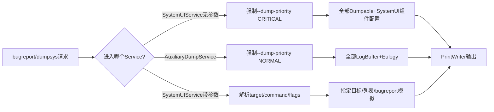
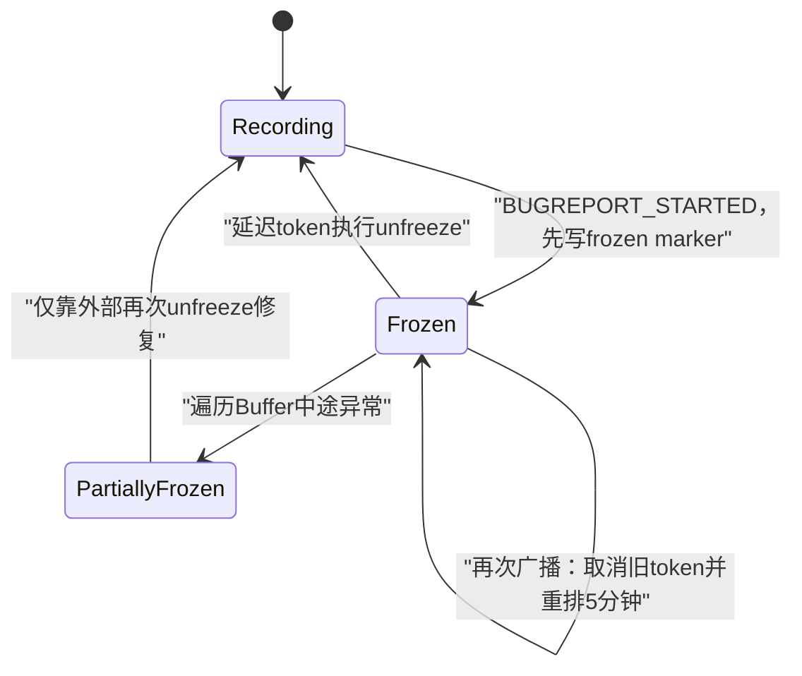
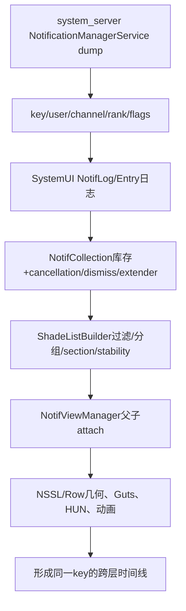

# 第 499 章 Android SystemUI DumpHandler、DumpManager 与 LogBuffer：分级Dump、冻结和通知跨服务证据采集链

> 源码基线：Android 11 / API 30 / `android-11.0.0_r48`。本章只在 macOS 阅读，不实际编译，也不要求连接设备。核心文件：`SystemUIService.java`、`SystemUIAuxiliaryDumpService.java`、`DumpHandler.kt`、`DumpManager.kt`、`LogBuffer.kt`、`LogBufferFreezer.kt`；交叉阅读NotifCollection、ShadeListBuilder、GroupCoalescer、EntryManager/NSSL等dump实现与本地测试。

## 1. 本章解决什么问题

SystemUI为什么用两个Service输出bugreport？CRITICAL、NORMAL、HIGH实际怎样路由？指定NotifCollection或NotifLog时怎样匹配，`--tail`裁的是消息还是文本行，Bugreport开始为什么冻结Buffer，诊断通知丢失又该怎样把SystemUI和NMS证据对齐？

## 2. 一句话主线

SystemUI组件和LogBuffer向单例DumpManager注册；主SystemUIService无参数dump时强制CRITICAL输出短状态与配置，辅助Service强制NORMAL输出全部Buffer和崩溃挽歌；手工参数由DumpHandler解析并按suffix选目标，Bugreport广播先冻结所有Buffer五分钟，保住故障前环形日志供跨服务时间线比对。

## 3. Dump不是普通日志

Dumpable描述“此刻对象状态”，LogBuffer保存“最近发生过什么”。定位竞态要同时看状态快照与事件历史，单独一类证据经常不够。

## 4. 两个Service的原因

Bugreport的CRITICAL部分要求快且体积受限，NORMAL部分可以更长。SystemUI把Dumpables放前者，把大量LogBuffers放后者。

## 5. 分级总图

## 6. 主Service启动辅助Service

SystemUIService onCreate中`startServiceAsUser(SystemUIAuxiliaryDumpService, SYSTEM)`，确保bugreport NORMAL阶段有可发现的组件。

## 7. 两个Service都不提供bind接口

`onBind()`返回null；dump由系统Service dump机制调用，不是供普通客户端绑定RPC。

## 8. 主Service无参数才默认CRITICAL

`args.length==0`时替换为`--dump-priority CRITICAL`。手工指定任何参数则原样交DumpHandler，不自动附加优先级。

## 9. 辅助Service忽略传入参数

它无论调用者给什么args，都新建只含NORMAL优先级的数组；不能通过Auxiliary Service点名某个buffer或tail。

## 10. CRITICAL输出两部分

DumpManager全部dumpables，再dump SystemUIServiceComponents配置；配置列vendor component、global和per-user服务数组。

## 11. NORMAL输出两部分

DumpManager全部buffers，再让LogBufferEulogizer读取存在的崩溃挽歌；不会输出常规Dumpables。

## 12. HIGH被解析但没有专门实现

优先级选项允许CRITICAL/HIGH/NORMAL，但when只为CRITICAL和NORMAL建分支；HIGH落入`dumpParameterized()`。

## 13. HIGH无其他目标时通常Nothing to dump

priority flag/value已从nonFlagArgs移除，command为空、targets为空且listOnly=false，最终打印`Nothing to dump :(`。不能假设HIGH自动输出CRITICAL子集。

## 14. 这是r48实现缺口

HIGH常量存在不等于SystemUI定义了HIGH内容；bugreport框架可能不用这个Service的HIGH阶段，但手工调用仍会看到空路由。

## 15. DumpHandler先开Trace

入口`Trace.beginSection("DumpManager#dump()")`并记uptime start，正常完成后打印耗时并endSection。

## 16. 参数解析失败漏Trace结束

catch ArgParseException后打印错误并直接return，`Trace.endSection()`不会执行。没有try/finally包住整段。

## 17. Dumpable抛异常也漏收尾

下游dump若RuntimeException向上传播，同样跳过耗时行和Trace.endSection。当前Handler不隔离单个坏组件。

## 18. rawArgs与nonFlagArgs并存

ParsedArgs保存原数组给具体Dumpable，同时持有移除flags和值后的列表用于命令/target匹配。

## 19. flag可出现在任意位置

解析遍历全部mutable args，看到以`-`开头就处理并remove，不要求flags放在target前。

## 20. 未知flag立即报错

`-x`不会下传给目标Dumpable，而是在DumpHandler层抛ArgParseException。注册组件无法定义自己的短横线参数扩展。

## 21. 已知flags仍原样传给Dumpable

虽然从nonFlagArgs删除，`args.rawArgs`仍是初始数组；dump target可能再次看到`--tail`、`--list`或priority参数。

## 22. tail参数必须是Int

缺值与解析失败会转换为统一错误文案。负数能成功toInt，后续LogBuffer把`tailLength<=0`当全部输出。

## 23. list不需要值

`-l/--list`只置boolean；与targets同时使用时，当前dumpTargets逻辑仍逐个dump目标，不把listOnly用于每个target。

## 24. listOnly只在三个场景生效

命令dumpables、命令buffers或完全无target时列名称；指定具体target加`--list`不会改成“验证/列出匹配项”。

## 25. help由flag触发

`-h/--help`直接设置command=help。COMMANDS数组不包含help，但无需第二阶段识别。

## 26. config处理存在不可达命令边界

dumpParameterized支持`command=="config"`，但COMMANDS数组未包含config，parse也没有config flag；手工传`config`会被当target suffix而非命令。

## 27. help裸单词也不是命令

同理COMMANDS不含help，必须使用`-h/--help`；传`help`会尝试dump名为help结尾的注册目标。

## 28. 四个可识别裸命令

只有bugreport-critical、bugreport-normal、buffers、dumpables会从nonFlagArgs第一个元素提取为command。

## 29. 命令必须是第一个非flag参数

`NotifCollection buffers`不会把buffers识别为命令，而是两个target；`buffers NotifCollection`则command=buffers，剩余target被忽略并输出全部buffers。

## 30. 点名目标支持多个

无command时对nonFlagArgs逐项调用dumpTarget，因此可一次组合状态组件与LogBuffer。

## 31. target匹配用endsWith

注册名为全限定类名时，可用完整名、后半包名或简单类名。它不是正则、glob或contains。

## 32. suffix匹配先查Dumpable

DumpManager先遍历dumpables，找到第一个endsWith就return；之后才查buffers。相同suffix跨两类时永远优先Dumpable。

## 33. 多个Dumpable同suffix也只输出第一个

注册名称可不同但都以`Controller`结尾；target过短会匹配ArrayMap迭代顺序中的第一项，没有ambiguous提示。

## 34. 不匹配目标静默无输出

dumpTarget走完两张表不打印“not found”。批量命令中一个拼错target很难从结果区分“目标空dump”和“没注册”。

## 35. 最稳妥做法先list

先读取dumpables/buffers名称，再用足够长的唯一suffix点名，避免短名碰撞与拼写静默。

## 36. DumpManager两张注册表

ArrayMap分别存Dumpable与LogBuffer，value包装注册名和对象；同一name在两张表共享命名空间。

## 37. 同名同对象重复注册允许

`canAssignToNameLocked()`发现已有对象与new对象引用相同就返回true，并覆盖相同wrapper；同名不同对象抛IllegalArgumentException。

## 38. Buffer没有unregister API

Dumpable可按name unregister，LogBuffer只有registerBuffer；动态生命周期Buffer无法从此类显式撤销。

## 39. 所有公共操作都Synchronized

注册、列举、dump、freeze、unfreeze共用DumpManager实例锁，保证ArrayMap遍历期间结构不变。

## 40. 锁内调用外部Dumpable

`dumpDumpables()`持有Manager monitor遍历并直接执行`module.dump()`；慢组件会阻塞其他dump、注册、freeze和unfreeze。

## 41. 重入同一线程不会死锁

Java/Kotlin monitor可重入；Dumpable同步调用同一Manager方法不会自锁死，但可能修改集合导致遍历不一致风险，且跨线程等待会形成复杂锁图。

## 42. 单个Dumpable异常中止全部后续

Manager没有per-component try/catch。一个模块崩溃意味着其后的注册项均不输出，故障证据本身可能被故障对象遮断。

## 43. Dump输出顺序不是诊断合同

依赖ArrayMap当前迭代顺序和注册顺序，不应写脚本假设NotifCollection永远在ShadeListBuilder之前。

## 44. 每个Dumpable有明显分隔头

输出空行、注册名、横线，再调用对象dump；Buffer则用`BUFFER name`和等号分隔。

## 45. fd只传给Dumpable

LogBuffer dump只需要PrintWriter和tail；Dumpable可使用FileDescriptor输出proto或其他二进制能力，但DumpHandler本身不做proto路由。

## 46. 通知诊断的核心Dumpables

新管线至少看NotifCollection、ShadeListBuilder、GroupCoalescer、NotifViewManager；旧管线看NotificationEntryManager、GroupManager、NSSL/Presenter相关状态。

## 47. feature flag决定哪套状态是真相

r48两套通知管线共存；dump里同时出现对象不代表都在驱动画面。先找pipeline enabled/rendering enabled证据，再解释列表。

## 48. NotifCollection dump看库存状态

它列未排序/未过滤Entry，以及cancellation reason、dismiss state、LifetimeExtenders、DismissInterceptors等，回答“数据还在不在”。

## 49. ShadeListBuilder dump看最终列表

它展示pipeline当前stage、最终ListEntry树、filters/promoters/sections/stability信息，回答“库存为何没出现在Shade”。

## 50. GroupCoalescer dump看延迟批次

某个Entry既不在Collection又刚收到listener事件时，可能正在coalescing group batch；只看Collection会误判丢事件。

## 51. NotifViewManager dump看View投影

回答最终ListItem是否attach到NSSL、parent/children关系如何；与第495章Blocking Helper借壳Row等特殊状态配合。

## 52. NSSL dump看像素容器

可检查children、scroll、expanded、animation和clear-all等View状态；“Entry在且final list在，但屏幕不见”时继续走这里。

## 53. LogBuffer是对象池环形日志

保存LogMessageImpl字段和printer函数，直到dump/logcat echo时才格式化字符串，降低高频日志分配。

## 54. maxLogs包含消息与可回收池弹性

buffer ArrayDeque同时承担已提交日志和从队首取出的复用对象来源；poolSize控制document尚未push时buffer可缩到什么程度。

## 55. log是obtain+initialize+push

只有未frozen时才执行整个流程；冻结期间initializer也不会运行，避免采集新状态。

## 56. document冻结时仍运行initializer

`document()`没有外层`if(!frozen)`，会obtain一个新dummy、执行initializer并返回；之后push因frozen丢弃。注释说不影响buffer，不等于完全零工作。

## 57. obtain的三分支

frozen时新建dummy；buffer size大于`maxLogs-poolSize`时removeFirst复用；否则新建对象。

## 58. 边界使用大于而非大于等于

size恰好等于`maxLogs-poolSize`时仍create，下一次才从buffer取；实际瞬时对象数量要结合未push documents计算。

## 59. push要求具体实现

强制`message as LogMessageImpl`；外部伪造其他LogMessage实现会ClassCastException，API虽接接口但合同更窄。

## 60. 满maxLogs会额外写Logcat错误

正常obtain策略应复用并避免push时满；若多次document造成未配对或其他顺序使buffer已满，push先Log.e再removeFirst。

## 61. Echo在入Buffer后执行

message先add，再问buffer/tag是否可logcat；printer在echo时格式化，打印异常会发生在消息已保存之后。

## 62. Echo级别由Buffer或Tag任一放开

`isBufferLoggable || isTagLoggable`；两个设置不是相与。默认文档称WARN及以上，但实际阈值由LogcatEchoTracker实现/设置决定。

## 63. tag长度限制只在注释

LogBuffer本身不检查23字符；真正Logcat平台限制或下游行为负责，buffer dump仍可保存长tag。

## 64. tail按消息条数

`tailLength`用于`buffer.size-tailLength`，每个LogMessage最终通常打印一行。printer若包含换行，输出文本行数会超过N。

## 65. tail大于size输出全部

start为负数，所有索引i都大于等于start；没有clamp但功能上等同从0开始。

## 66. tail等于0或负数也输出全部

这与常见Unix tail的0行语义不同。`--tail 0`在SystemUI代表不裁剪。

## 67. Buffer dump持有自身锁格式化

方法Synchronized且在锁内调用每个message.printer；慢printer阻止该Buffer的log/obtain/push/freeze。

## 68. printer不得捕获外部变量

注释要求只读LogMessage字段，否则每次log可能分配新lambda对象，破坏轻量目标；这属于性能合同，不是运行时检查。

## 69. 日期使用wall clock

LogMessage timestamp来自`System.currentTimeMillis()`并格式化为MM-dd HH:mm:ss.SSS；系统校时会使日志时间倒退/跳跃。

## 70. Dump耗时用uptime

DumpHandler用SystemClock.uptimeMillis测耗时，不受墙上时间修改影响，但深度睡眠时间也不计入uptime。

## 71. 两种时钟要分开

跨Buffer按wall time拼事件线；评估dump卡顿看uptime“Dump took”。两者不能直接相减推导等待。

## 72. static SimpleDateFormat线程不安全

DATE_FORMAT是文件级共享对象；单个Buffer dump有实例锁，但不同Buffer/不同dump请求可并发调用同一formatter，存在格式竞态风险。

## 73. Freeze先写一条marker

`freeze()`在frozen=false时先调用log写入“name frozen”，再把frozen设true，所以marker保留在Buffer末尾。

## 74. Unfreeze marker实际不会进入Buffer

`unfreeze()`在frozen仍为true时先调用log，而log外层检查失败；然后才设false。因此源码中的“unfrozen”日志调用被丢弃。

## 75. 重复freeze是幂等

already frozen时不写第二条marker，也不改变内容。DumpManager遍历所有Buffer逐个调用。

## 76. Freeze不复制快照

只是阻止后续push，现有ArrayDeque仍原地保存。Dump时读取同一对象集合，并非生成不可变副本文件。

## 77. Bugreport广播触发Freezer

监听内部`BUGREPORT_STARTED`，范围USER_ALL，回调运行在注入的Main DelayableExecutor。

## 78. 默认冻结五分钟

构造器注入版使用`TimeUnit.MINUTES.toMillis(5)`，测试构造器可传更短duration。

## 79. pendingToken是取消令牌

executeDelayed返回Runnable；下一次bugreport开始先`pendingToken?.run()`取消旧解冻任务，再重新freeze并安排新期限。

## 80. 重复Bugreport延长冻结窗口

第二次freeze对已冻结Buffer无变化，但旧unfreeze被取消，新unfreeze从第二次时点重新计五分钟。

## 81. Freezer异常没有finally兜底

若freezeBuffers在某个Buffer抛异常，可能前几个已冻结、旧unfreeze又被取消，而新pendingToken尚未建立，形成部分永久冻结直到别处unfreeze。

## 82. DumpManager冻结也持全局锁

逐个Buffer freeze期间不能同时register/dump；Buffer freeze内部再拿各自锁，锁顺序是Manager→Buffer。

## 83. 反向锁顺序要警惕

若某Buffer printer或日志路径持Buffer锁再尝试Manager操作，可能与freeze线程形成反向等待；当前主要路径需逐个验证，不能因每个方法都Synchronized就认为安全。

## 84. Eulogy用于进程崩溃后的旧日志

NORMAL dump在当前buffers之后读取保存的eulogy，让新SystemUI进程还能提供上次崩溃前buffer线索。

## 85. 当前Buffer与Eulogy要区分代际

进程重启后当前日志时间从新启动开始，Eulogy属于旧PID/旧对象状态；诊断时不能把二者当一条无缝内存时间线。

## 86. Rescue/主动崩溃开关

debuggable构建可用`debug.crash_sysui`在SystemUIService启动时抛RuntimeException，用于RescueParty调试；user build不会因该属性执行。

## 87. Binder proxy监控也仅debuggable

启用proxy计数，水位1000/900，超限通过主Handler写warning；这条日志可帮助诊断SystemUI Binder对象泄漏，但不是DumpManager Buffer。

## 88. 通知丢失的五层证据

依次看NMS active/ranking、SystemUI listener/collection、ShadeListBuilder filter/group、ViewManager/NSSL attach、Row content/visibility。每层回答“信号到没到”和“在哪一步被排除”。

## 89. 跨服务证据图

## 90. key是首要关联键

同一notification key贯穿NMS Record、RankingMap、NotifCollection Entry、Row和多数LogBuffer；先按key聚合，再看package/id/tag会减少同ID多用户混淆。

## 91. userId必须一起记录

USER_ALL、current profile、managed profile过滤能让相同key近似信息出现在不同可见范围；只按包名判断“丢通知”不够。

## 92. Ranking与View快照时间不同

Dumpables按注册顺序逐个执行，不是在stop-the-world事务中原子采样；前一个组件dump后通知事件仍可能变化，后一个输出已是新状态。

## 93. Freeze只冻结LogBuffer不冻结业务状态

Bugreport期间Collection、Ranking和View继续运行；“日志停在故障前”与“Dumpable是采集时当前状态”需要有意识对齐。

## 94. Dump顺序不能证明因果顺序

输出A段在B段之前只因注册顺序；真正因果看timestamp、key、reason和阶段字段。

## 95. NotifLog也不是全部日志

不同子系统有独立Buffer，如pipeline、heads-up、QS等；点名NotifLog可能漏GroupCoalescer或其他专属Buffer，先buffers --list核实。

## 96. logcat echo不是Buffer的替代

低级别消息默认只留环形Buffer，logcat可能没有；相反Buffer满会覆盖旧消息，持久logcat可能保留更久。两者互补。

## 97. Buffer容量影响可见窗口

高频故障期间新消息迅速覆盖旧消息；BugreportStarted冻结的价值正是阻止采集动作本身和后续噪声继续覆盖故障现场。

## 98. 冻结也会丢采集期间新线索

五分钟内所有正常log调用被忽略；如果故障继续演化，Dumpable当前状态能看到结果，但Buffer没有演化事件。

## 99. 不应随意把freeze当调试开关

它是bugreport现场保护机制，冻结太久会让后续问题无日志；重复bugreport又会延长期限。

## 100. Dumpables应控制体积

DumpManager注释要求CRITICAL组件不要输出过多。大规模历史数据应进LogBuffer/NORMAL，否则拖慢bugreport最关键阶段。

## 101. Dump方法不自动切后台

Service dump由系统调用线程进入，DumpHandler同步执行所有组件；Dumpable若等待主线程而主线程同时等待dump相关锁，可能超时/死锁。

## 102. 输出中敏感信息要谨慎

通知extras、RemoteInput草稿、联系人和PendingIntent元数据可能涉及隐私；Dump实现应裁剪，分享bugreport前也应按安全范围处理。

## 103. `--tail`只作用LogBuffer

Dumpable收到rawArgs但DumpHandler不会裁它的文本；NotifCollection等状态输出量不受tailLength限制。

## 104. 指定混合target的顺序由用户决定

dumpTargets按targets列表顺序调用；这能把NotifCollection紧邻NotifLog输出，但仍不是原子快照。

## 105. target重复会重复dump

Handler不去重nonFlagArgs；同一唯一suffix传两次会执行两次，第二次状态可能已变化。

## 106. no-target默认不dump全部

主Service带一个无关已解析flag后，既无priority专用路由又无target，会打印Nothing；只有主Service真正零args才被massage为CRITICAL。

## 107. 手工全量应显式命令

状态用dumpables或bugreport-critical，日志用buffers或bugreport-normal；不要依赖“无参数”在不同Service/调用方式下含义相同。

## 108. 解析错误信息不含usage

只打印单行错误并return，不自动附help；需要再次用--help查看支持项。

## 109. 测试数量

DumpHandlerTest严格统计4项，LogBufferFreezerTest 3项；本目录没有同名DumpManagerTest或LogBufferTest，核心注册冲突、suffix歧义、freeze marker、formatter并发与异常安全缺少直接同名覆盖。

## 110. DumpHandler测试覆盖重点

主要验证特定target、tail和优先级/参数路由的基础行为；不能从4项推导HIGH、config不可达、Trace早退和多target异常隔离均有保障。

## 111. Freezer测试覆盖重点

验证广播freeze、延迟unfreeze和重复bugreport重置计时；未覆盖某个Buffer freeze抛异常、部分冻结及取消token后新调度失败。

## 112. macOS只读练习一：手算参数解析

不运行adb，只在纸面依次推演`--dump-priority HIGH`、`config`、`--help`、`NotifLog --tail -1`、`buffers NotifCollection`的ParsedArgs四个字段和最终分支。

## 113. macOS只读练习二：构造suffix冲突

用本地`rg registerDumpable`找两个以Controller结尾的注册名，推演target=`Controller`会命中哪个类别、为何只输出第一项；写出更安全的唯一suffix。

## 114. macOS只读练习三：画通知证据包

选一个假想notification key，列出NMS Record、NotifLog、NotifCollection、ShadeListBuilder、NotifViewManager、NSSL六栏，每栏写“存在/不存在分别说明什么”，不连接设备。

## 115. macOS只读练习四：设计冻结异常测试

只写测试：三个Buffer中第二个freeze抛异常，随后确认第一个能在期限后unfreeze、第三个状态明确、DumpManager锁可用且pending token仍有兜底。不运行编译。

## 116. 易错理解一：CRITICAL包含所有SystemUI日志

不准确。CRITICAL主要是Dumpables+组件配置；大量LogBuffers和Eulogy在Auxiliary Service的NORMAL阶段。

## 117. 易错理解二：冻结等于整个SystemUI状态快照

不准确。只冻结LogBuffer写入，业务对象和View继续变化；Dumpables仍是逐个采集的非原子当前状态。

## 118. 易错理解三：HIGH会输出介于两者之间的内容

不准确。r48虽接受HIGH字符串，却没有专门when分支；没有target时通常落到Nothing to dump。

## 119. 复读后的最终心智模型

先确认调用的是主Service还是辅助Service，再看priority/command/target解析；区分Dumpable状态与Buffer历史，明确suffix只取第一项；采集通知故障时以key/user为轴，从NMS→Collection→ListBuilder→View逐层拼接，并用freeze时间点解释日志为何停止。

## 120. 本章结论与下一章

Android 11 SystemUI诊断系统是一套“注册表+分级Service+按suffix点名+对象池环形日志+bugreport冻结”的轻量证据基础设施。r48关键边界包括HIGH空路由、config裸命令不可达、parse/组件异常漏Trace收尾、Manager锁内调用外部代码、suffix歧义、unfreeze marker丢失、SimpleDateFormat并发和部分freeze无兜底。下一章进行第401—499章SystemUI端到端故障树、核心心智模型与第411—500结构/准确性总审计。
