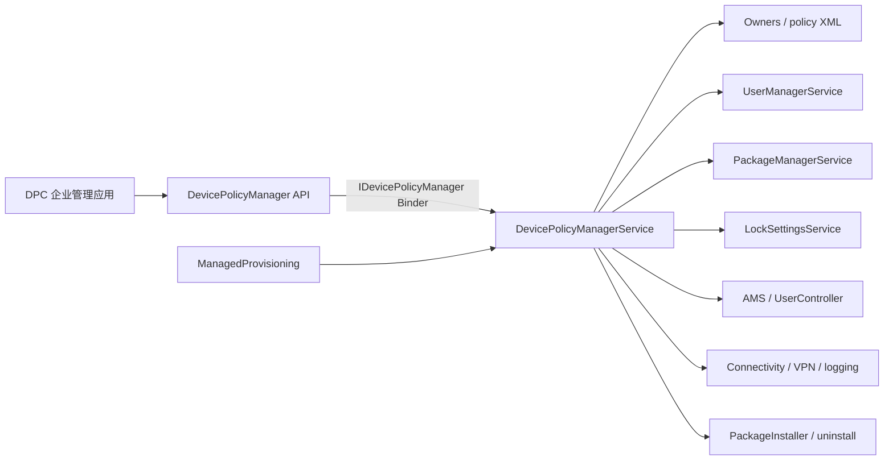
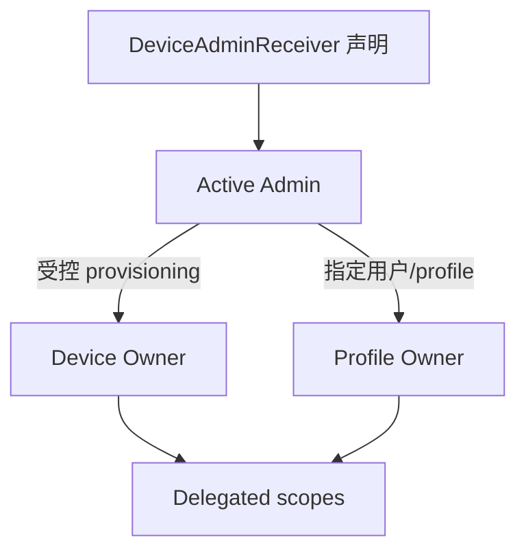
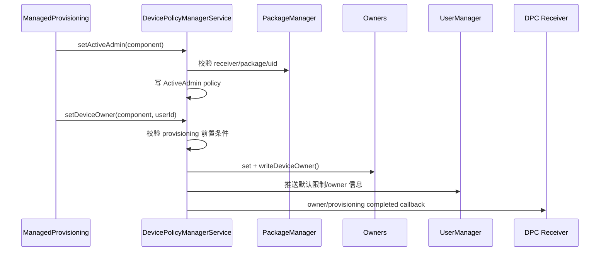
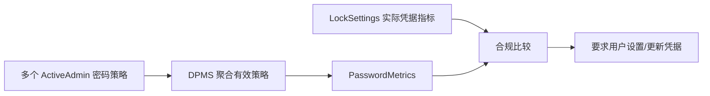
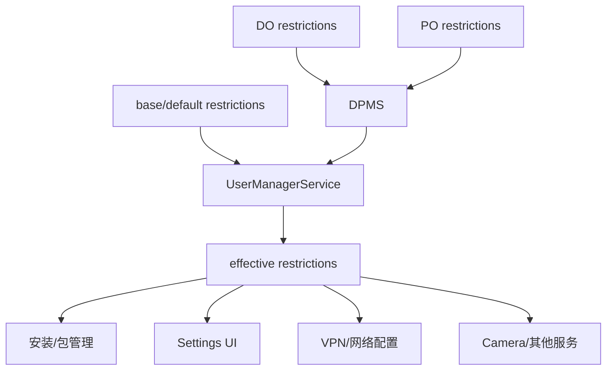

# 50 DevicePolicyManagerService、Device Owner、Profile Owner 与企业管控

> 源码版本：Android 11 / API 30 / `android-11.0.0_r48`  
> 学习方式：macOS 只读源码，不要求编译。  
> 本章目标：分清普通 Device Admin、Device Owner、Profile Owner、DPC 与 delegated admin，并能追踪一条企业策略如何校验身份、持久化、聚合并下沉到真正执行服务。

---

## 1. 先用一句话理解设备策略

Android 企业管理不是让一个管理 App 获得 root，而是由系统授予它一个受严格约束的管理角色，再由 `DevicePolicyManagerService` 代表系统把合法策略下沉到相关服务。

```text
DPC 提出策略意图
→ DPMS 验证角色、调用 UID、用户范围和前置条件
→ 持久化策略
→ 计算有效结果
→ 通知 UMS/PMS/AMS/LockSettings/Connectivity 等实际执行者
```

DPMS 是策略权威与协调器，但并不亲自完成所有执行。

---

## 2. 主要组件



关键源码：

```text
frameworks/base/core/java/android/app/admin/
frameworks/base/services/devicepolicy/java/com/android/server/devicepolicy/
packages/apps/ManagedProvisioning/
```

---

## 3. 五个角色先分清

### 3.1 Device Admin

一个声明了 `DeviceAdminReceiver` 并被用户激活的管理员组件。它只能使用 XML 中声明且系统允许的旧式管理策略。

### 3.2 Device Policy Controller（DPC）

实现企业管理逻辑的 App。DPC 是应用身份/产品角色，不自动等于 Device Owner。

### 3.3 Device Owner（DO）

设备级所有者，通常在设备初始配置阶段建立，适用于全托管设备。每台设备最多一个。

### 3.4 Profile Owner（PO）

某个用户或工作资料的所有者。它主要管理自己所在的 user/profile；不同用户可各有 PO。

### 3.5 Delegated Admin

DO/PO 可把证书安装、应用限制、网络日志等特定 scope 委托给另一个包。委托方只得到明确 scope，不会自动成为 owner。

---

## 4. Active Admin 不等于 Owner

这是本章最重要的区别：

```text
active admin = 该 DeviceAdminReceiver 已在某用户激活
owner = 系统额外记录该 admin 具有 DO 或 PO 身份
```

建立 owner 前通常必须先成为 active admin，但 active admin 数量可以多个，DO 全设备最多一个，PO 是每用户至多一个。



---

## 5. DeviceAdminReceiver 如何声明

DPC Manifest 中通常声明：

```xml
<receiver
    android:name=".MyDeviceAdminReceiver"
    android:permission="android.permission.BIND_DEVICE_ADMIN"
    android:exported="true">
    <meta-data
        android:name="android.app.device_admin"
        android:resource="@xml/device_admin" />
    <intent-filter>
        <action android:name="android.app.action.DEVICE_ADMIN_ENABLED" />
    </intent-filter>
</receiver>
```

策略 XML 可声明 `limit-password`、`watch-login`、`reset-password`、`force-lock`、`wipe-data` 等旧策略能力。

`DeviceAdminInfo` 负责解析 Receiver 与 XML。声明能力只是“可申请”，仍要经过激活、owner 身份和每个 API 的服务端检查。

---

## 6. 服务端为什么不能相信 ComponentName

DPC 调用通常传入 `ComponentName who`。攻击者也能填写别人的组件名，所以 DPMS 必须验证：

1. Binder calling UID；
2. `who` 所属包 UID；
3. admin 是否在调用用户 active；
4. 是否声明所需 policy；
5. API 是否要求 DO/PO/delegated scope；
6. parent instance 和目标用户是否合法。

核心入口之一：

```text
getActiveAdminForCallerLocked(who, requiredPolicy)
```

真正授权来自 Binder 身份与系统状态，而不是调用参数声称“我是谁”。

---

## 7. DPMS 的主要内存对象

### DevicePolicyData

每用户一份，包含：

- active admin map/list；
- password owner 与 failed attempts；
- provisioning state；
- permission policy；
- delegated scopes；
- lock task packages/features；
- status bar、keyguard、应用限制等用户级设置。

### ActiveAdmin

每个激活管理员一份，包含它设置的策略值：

- 密码质量、长度、复杂度、历史；
- 最大锁定时间；
- 最大失败次数与 wipe；
- user restrictions；
- 允许/禁止 keyguard 功能；
- 证书、VPN、账户、应用与日志策略；
- parent admin（组织所有工作资料影响父用户时）。

### Owners

保存“哪个组件是 DO/PO”及所有权相关元数据。

---

## 8. 两类持久化不要混淆

### 8.1 每用户 policy 数据

DPMS 用 `saveSettingsLocked(userId)` 写每用户策略 XML，常见文件语境是：

```text
/data/system/device_policies.xml
/data/system/users/<userId>/device_policies.xml
```

具体路径由 `JournaledFile`/环境目录封装决定。

### 8.2 Owners 数据

`Owners.java` 管理：

```text
device_owner_2.xml
profile_owner.xml
```

前者保存设备所有者及设备级信息，后者按用户保存 profile owner。

Owner 记录与 ActiveAdmin 策略记录相互关联但不是同一个文件。只恢复一个、丢失另一个会造成不一致，需要加载时校验和迁移。

---

## 9. DPMS 如何启动

DPMS 在 `system_server` 启动，通过 Binder 发布 `device_policy` 服务。启动/boot phase 中会：

- 加载 owner；
- 加载 system user 及其他已启动用户的 policy；
- 校验管理员包、Receiver 与签名/UID；
- 迁移旧数据格式；
- 推送用户限制、锁屏、应用和网络相关状态；
- 注册 package/user/time 等监听；
- 启动证书、网络日志、安全日志监控。

磁盘有策略不等于执行层已经同步，启动恢复必须重新 push。

---

## 10. ManagedProvisioning 的职责

`packages/apps/ManagedProvisioning` 是受信任的系统应用，负责 provisioning 流程 UI 与编排：

- 校验设备/用户是否适合建立 owner；
- 下载或确认 DPC；
- 创建 managed profile；
- 删除不需要的系统 App；
- 处理同意界面、免责声明、加密与网络；
- 激活 admin 并调用 DPMS 设置 DO/PO；
- 启动/完成 profile；
- 向 DPC 发送 provisioning 完成广播。

它不是策略最终权威。最终合法性仍由 DPMS 服务端校验。

---

## 11. 为什么 DO 必须在受限时机建立

如果普通 App 能在已使用设备上自行成为 DO，它就可能接管设备、静默安装应用、限制用户甚至擦除数据。

因此 Android 11 对 `setDeviceOwner()` 检查非常严格，通常要求：

- 调用者是系统/受信 provisioning 路径或 shell 测试路径；
- admin 已激活且包存在；
- 尚无 DO；
- 设备/用户 setup 状态允许；
- 账户、用户数量和设备 provisioning 条件满足；
- 目标 user 合法且运行状态满足。

生产环境的角色建立通常发生在 Setup Wizard、QR/NFC/zero-touch/企业注册流程中，而不是 DPC 运行时随意调用。

---

## 12. Device Owner 建立主链



建立后还会更新系统属性和缓存，让 PMS、UMS、ActivityManager 等能快速查询设备是否被管理。

---

## 13. Profile Owner 建立主链

PO 通常与新建 managed profile 一起建立：

```text
创建 profile user
→ 准备 profile 数据和包状态
→ 在 profile 内安装/启用 DPC
→ 激活 DeviceAdminReceiver
→ setProfileOwner(component, profileUserId)
→ 写 profile_owner.xml
→ 应用默认 profile restrictions
→ 启动并解锁 profile
→ 发送 PROFILE_PROVISIONING_COMPLETE
```

PO 的天然边界是其所在 user/profile。组织所有工作资料场景可对父用户施加一组受限策略，但不等于完整 DO 权限。

---

## 14. Parent profile instance 是什么

工作资料 PO 可通过：

```java
devicePolicyManager.getParentProfileInstance(admin)
```

获得针对父用户的受限 DPM 视图。服务端以 `parent=true` 选择 `ActiveAdmin.parentAdmin`，只允许明确列出的父侧策略，例如某些密码、锁屏或个人应用限制。

它不是跨用户任意调用通道。每个 API 都必须显式支持 parent instance，否则服务端拒绝。

---

## 15. 策略调用的通用模板

很多 setter 都遵循类似结构：

```text
检查 feature 是否存在
→ 解析 calling user/uid
→ synchronized 获取 DPMS lock
→ getActiveAdminForCallerLocked()
→ 校验 DO/PO/delegate 与目标范围
→ 修改 ActiveAdmin/DevicePolicyData
→ saveSettingsLocked(userId)
→ 释放锁后或安全点调用实际服务
→ 发送 changed broadcast / 更新 cache
```

读一个陌生策略 API 时，优先找这五点：身份、角色、存储、聚合、执行。

---

## 16. 为什么需要聚合策略

同一用户可能有多个 active admin，它们可分别设置密码长度：

```text
Admin A：至少 6 位
Admin B：至少 10 位
```

最终有效要求通常取更严格值 10。不同策略的聚合规则不同：

- 最小长度取最大；
- 最大空闲时间取最小非零；
- 禁止类 restriction 常做 OR；
- 白名单可能求交集或由特权 owner 独占；
- 某些 API 仅 DO/PO 可设，不存在多管理员聚合。

不能假设“最后一次写入者获胜”。要看具体 getter 如何遍历 `mAdminList`。

---

## 17. 密码策略怎样执行

DPC 设置的密码质量、长度、复杂度、历史、过期时间等保存在 `ActiveAdmin`。DPMS 聚合后，通过 LockSettings/Keyguard 查询实际凭据指标并判断是否合规。



DPMS 一般不读取用户明文 PIN。它使用 `PasswordMetrics` 等统计属性做策略判断。

---

## 18. 最大锁定时间怎样下沉

管理员设置 `setMaximumTimeToLock()` 后，DPMS 聚合所有 admin 的最严格非零时间，再通知电源管理相关逻辑。

策略链大致是：

```text
DPC → DPMS ActiveAdmin.maximumTimeToUnlock
→ 聚合最小值
→ PowerManagerInternal / Settings
→ 屏幕超时上限与自动锁定行为
```

DPMS 保存“政策要求”，PowerManager/Keyguard 执行屏幕和锁定动作。

---

## 19. 失败次数与擦除

管理员可设置最大失败尝试次数。LockSettings 报告凭据验证失败后，DPMS 更新计数、通知 admin；达到最严格阈值时可能擦除 profile、secondary user 或整台设备，取决于 admin 角色和目标。

```text
错误凭据
→ LockSettings reportFailedPasswordAttempt
→ DPMS failedPasswordAttempts++
→ 聚合 wipe threshold
→ 选择受影响 user/device
→ RecoverySystem/UserManager 执行擦除
```

因为是破坏性动作，源码包含调用身份、owner 类型、用户关系和系统用户等多重检查。

---

## 20. `lockNow()` 与真正锁定

DPC 调用 `lockNow()` 后，DPMS 验证管理员具有 force-lock/owner 权限，再协调 WindowManager/Trust/Power/LockSettings 立即锁屏；若带特定 flag 且权限允许，还可驱逐 CE key。

“熄灭屏幕”和“锁定认证状态”不是完全同一动作。组织策略关心的是用户再次访问时是否必须认证。

---

## 21. User Restrictions 怎样下沉

DPC 可以设置 `DISALLOW_INSTALL_APPS`、`DISALLOW_CAMERA`、`DISALLOW_CONFIG_VPN` 等限制，但每个 restriction 对 DO、PO、组织所有 profile owner 的可设置范围不同。

`pushUserRestrictions(originatingUserId)` 会汇总 owner/admin 维护的 restriction，交给 UserManagerInternal 更新有效限制，再由 UMS 通知各实际服务。



只在 Settings 中隐藏按钮不是安全执行；PMS、Connectivity 等服务端也必须检查限制。

---

## 22. 应用管理策略

DO/PO 可在权限边界内：

- 隐藏应用；
- suspend packages；
- block uninstall；
- 启用系统应用；
- 安装现有包到 profile；
- 设置 persistent preferred activity；
- 配置 lock task/kiosk allowlist；
- 设置应用 restrictions；
- 允许/禁止 personal apps（组织所有工作资料场景）。

DPMS 负责授权和状态，最终包状态通常由 PMS 以目标 userId 执行。策略只影响指定用户时，不应误改其他用户的 `PackageUserState`。

---

## 23. Runtime Permission 管理

DO/PO 可设置 permission policy，并对特定运行时权限执行 grant、deny 或 default。

链路：

```text
DPC setPermissionGrantState
→ DPMS 验证 owner/delegate、package、permission、targetSdk
→ PermissionManager 授予/拒绝并设置 policy-fixed 标记
→ 按 userId 写入权限状态
```

`policy-fixed` 意味着普通用户 UI 不能随意改变，但系统升级、role 和特殊权限仍有独立规则。DPC 也不能把任意 signature 权限变成 runtime grant。

---

## 24. Delegation 如何工作

DO/PO 为包配置 scope 列表，例如：

- `delegation-cert-install`；
- `delegation-app-restrictions`；
- `delegation-network-logging`；
- `delegation-security-logging`；
- `delegation-package-access`；
- `delegation-enable-system-app`。

DPMS 保存 package → scopes 映射。被委托包调用 API 时，服务端校验 calling package/UID 和所需 scope。

Delegation 是最小权限设计：证书安装代理不应顺便获得 wipe 或用户管理权。

---

## 25. Always-on VPN

DO/PO 可为受管用户设置 always-on VPN，并选择 lockdown。DPMS 持久化包名/状态，再调用 Connectivity/Vpn 执行。

需要区分：

- DPC 有权指定哪个 VPN 包；
- 目标包必须存在并提供合法 VpnService；
- ConnectivityService/Vpn 建 TUN、路由和防泄漏规则；
- lockdown 决定 VPN 未连通时是否阻断普通流量。

DPMS 本身不转发数据包。

---

## 26. 网络日志和安全日志

Device Owner 可在严格条件下启用 network logging/security logging：

- `NetworkLogger` 接收 DNS/connect 等网络事件；
- `NetworkLoggingHandler` 批处理、编号并通知 DO；
- `SecurityLogMonitor` 读取安全日志；
- API 对取回频率、批次和权限有限制；
- 用户界面会显示设备受管理/可能被监控的提示。

Profile Owner 的可见范围更窄；组织所有工作资料也需遵循平台隐私边界。

---

## 27. CA 证书与 KeyChain

DO/PO 或受委托证书安装器可安装 CA、客户端证书和私钥。DPMS 通过 KeyChain/Keystore 执行，并用 `CertificateMonitor` 跟踪用户安装 CA，向用户展示安全提示。

“DPC 请求安装证书”不等于 DPC 能读取所有硬件私钥。Keystore 的不可导出和 UID/grant 规则仍然生效。

---

## 28. 系统更新策略

DO 可设置：

- 自动安装；
- 窗口安装；
- 推迟安装；
- freeze period。

DPMS 校验时间窗口与冻结周期是否冲突，保存 `SystemUpdatePolicy`，并与 UpdateEngine/系统更新流程协作。

策略控制“何时允许更新”，并不会让任意 DPC 绕过系统镜像签名和 Verified Boot。

---

## 29. Kiosk / Lock Task

DO/PO 可配置 lock task packages/features，使指定 App 进入受控 kiosk：

```text
DPC 配置 allowlist
→ DPMS 保存并通知 ActivityTaskManager
→ ATMS 校验任务包和 feature
→ SystemUI 禁用/保留指定导航、通知、全局操作
```

应用调用 `startLockTask()` 是否进入完全锁定模式，取决于它是否被策略允许。普通 screen pinning 与企业 lock task 权限不同。

---

## 30. 跨 Profile 通信

工作和个人资料拥有不同 userId。允许跨 profile 的 Intent 通常由 PO 配置 cross-profile intent filter：

```text
源 profile Intent
→ PMS Intent resolver
→ 检查 cross-profile filters / direction / flags
→ 显式转发到父或 profile
```

这是一条受控桥梁，不会合并两边 UID、数据目录、账号或 Provider。

---

## 31. Quiet Mode 与工作资料暂停

暂停工作资料时，系统停止/禁用该 profile 的运行组件和通知表现，同时保留用户、应用和数据。恢复后重新启动并解锁 profile。

它不是删除 profile，也不是简单隐藏 Launcher 图标。UserController、PMS、Launcher、Notification 和 Keyguard 都会参与状态变化。

---

## 32. 策略缓存为什么存在

`DevicePolicyCache` / `DeviceStateCache` 给 system_server 内其他服务提供快速只读查询，例如：

- 屏幕捕获是否禁用；
- 密码质量；
- 是否为受管设备；
- 某些传感器或 keyguard 策略。

缓存不是持久化真相。setter 必须先更新 DPMS 状态并保存，再同步 cache；启动时从 XML 重新恢复。

---

## 33. 锁和 Binder 调用的风险

DPMS 是巨型协调服务，很多方法持有内部锁。如果持锁跨 Binder 调用 PMS、UMS、KeyChain 等，而对方又回调 DPMS，可能死锁。

阅读时注意模式：

```text
synchronized 获取/修改纯内存状态
→ 保存必要快照
→ 释放锁
→ 跨服务调用
→ 必要时重新加锁核验状态
```

并非所有旧代码都完全理想，但这是判断并发风险的重要视角。

---

## 34. 清除 Binder 身份的正确顺序

DPMS 代表系统调用其他服务时常：

```java
long ident = Binder.clearCallingIdentity();
try {
    // 调用系统内部服务
} finally {
    Binder.restoreCallingIdentity(ident);
}
```

必须先用原 calling UID 完成 admin/owner/delegate 权限检查。若先 clear，再检查，所有调用看起来都来自 system UID，会形成严重提权漏洞。

---

## 35. 移除 Active Admin 与清除 Owner

普通 active admin 可在用户确认/系统许可后移除。DO/PO 不能简单走普通 remove admin 绕过企业所有权清理。

清除 owner 需要：

- 验证调用者就是对应 owner；
- 判断平台是否允许清除；
- 移除 owner 记录；
- 撤销 delegated scopes；
- 清理用户限制、VPN、logging、lock task、应用策略；
- 更新系统属性/cache；
- 保存 policy/Owners 文件；
- 必要时删除 managed profile 或恢复个人应用。

“删掉 DPC APK”若绕过清理会遗留不可管理策略，因此 PMS 会保护 active owner 包。

---

## 36. 转移所有权

Android 支持在严格条件下把 DO/PO 从一个 DPC 转给另一个兼容 DPC。流程需要：

- 源 owner 发起并指定目标；
- 校验目标 admin/签名/metadata；
- 写 transfer metadata 以便崩溃恢复；
- 迁移 ActiveAdmin/owner 记录和政策；
- 通知源和目标；
- 原子清理临时文件。

它不是修改一个 packageName 字符串；中途失败必须能回滚或恢复一致状态。

---

## 37. 常见错误定位表

| 现象 | 优先检查 |
|---|---|
| `SecurityException: not active admin` | Receiver、userId、激活状态、calling UID |
| active admin 仍不能调用 API | API 是否仅 DO/PO，XML 是否声明旧 policy |
| `setDeviceOwner` 失败 | setup/provisioned、账户、已有用户/owner、调用路径 |
| PO 策略影响不到个人侧 | 是否允许 parent instance/组织所有 profile owner |
| restriction UI 隐藏但接口仍能执行 | 实际执行服务是否检查 effective restriction |
| 重启后策略丢失 | `saveSettingsLocked`、Owners 文件、加载/migration |
| policy 已保存但未生效 | push/cache/下游 Binder 调用是否成功 |
| delegated app 被拒绝 | scope、package UID、用户、delegate mapping |
| VPN 设置成功但无网络 | Connectivity/Vpn/TUN/底层网络，不只是 DPMS |

---

## 38. 一条通用排障路线

### 第一步：确认身份

```text
callingUid / callingUserId / admin ComponentName / admin package UID
```

### 第二步：确认角色

```text
active admin / DO / PO / org-owned PO / delegate + scope
```

### 第三步：确认目标范围

策略作用于 calling user、profile、parent 还是全设备？

### 第四步：确认持久化

对应值在 `ActiveAdmin`、`DevicePolicyData` 还是 `Owners`？是否调用保存？

### 第五步：确认聚合

是否被另一个 admin 的更严格值覆盖？effective getter 返回什么？

### 第六步：确认执行者

最终由 UMS、PMS、LockSettings、ATMS、Connectivity、Power 还是 RecoverySystem 执行？

---

## 39. 源码阅读地图

### API 与 Binder

```text
frameworks/base/core/java/android/app/admin/DevicePolicyManager.java
frameworks/base/core/java/android/app/admin/IDevicePolicyManager.aidl
frameworks/base/core/java/android/app/admin/DeviceAdminReceiver.java
frameworks/base/core/java/android/app/admin/DeviceAdminInfo.java
frameworks/base/core/java/android/app/admin/PasswordMetrics.java
```

### 服务核心

```text
frameworks/base/services/devicepolicy/java/com/android/server/devicepolicy/DevicePolicyManagerService.java
frameworks/base/services/devicepolicy/java/com/android/server/devicepolicy/Owners.java
frameworks/base/services/devicepolicy/java/com/android/server/devicepolicy/DevicePolicyCacheImpl.java
frameworks/base/services/devicepolicy/java/com/android/server/devicepolicy/DeviceStateCacheImpl.java
frameworks/base/services/devicepolicy/java/com/android/server/devicepolicy/DeviceAdminServiceController.java
```

### 专项功能

```text
NetworkLogger.java
NetworkLoggingHandler.java
SecurityLogMonitor.java
CertificateMonitor.java
PersonalAppsSuspensionHelper.java
TransferOwnershipMetadataManager.java
```

### Provisioning

```text
packages/apps/ManagedProvisioning/src/com/android/managedprovisioning/
packages/apps/ManagedProvisioning/src/com/android/managedprovisioning/provisioning/
packages/apps/ManagedProvisioning/src/com/android/managedprovisioning/task/
```

---

## 40. 推荐阅读顺序

1. `DeviceAdminReceiver`：看 DPC 接收哪些事件；
2. `DeviceAdminInfo`：看 policy XML 如何解析；
3. `IDevicePolicyManager.aidl`：浏览能力全貌；
4. DPMS `DevicePolicyData` 与 `ActiveAdmin`；
5. `getActiveAdminForCallerLocked()`：理解身份检查；
6. `setActiveAdmin()`：理解激活；
7. `setDeviceOwner()` / `setProfileOwner()`：理解角色建立；
8. `Owners.java`：理解 owner 持久化；
9. `saveSettingsLocked/loadSettingsLocked`：理解 policy 持久化；
10. 选 restriction/password/app/VPN 各追一条执行链。

---

## 41. 八组只读练习

### 练习一：角色矩阵

列出 active admin、DO、PO、org-owned PO、delegate 的数量、范围和能力差异。

### 练习二：追 admin 激活

从 `setActiveAdmin()` 追 Receiver 解析、UID 校验、ActiveAdmin 创建、XML 保存和启用广播。

### 练习三：追 Device Owner

从 ManagedProvisioning 追到 `setDeviceOwner()`、Owners 写入、限制推送和 DPC 完成通知。

### 练习四：追用户限制

任选 `DISALLOW_INSTALL_APPS`，从 DPC 追到 effective restriction，再到 PMS 拒绝安装。

### 练习五：追密码长度

设置两个 admin 的不同最小长度，找到 DPMS 聚合逻辑和 PasswordMetrics 比较。

### 练习六：追应用 suspend

从 DPM API 追到 DPMS 角色校验和 PMS 的 per-user package state。

### 练习七：追 delegation

选择 certificate install scope，记录 owner 设置、delegate 调用和服务端 scope 检查。

### 练习八：追清除 owner

列出 Owners、ActiveAdmin、restriction、VPN、logging、cache 和 package protection 的清理顺序。

---

## 42. 初学者最容易误解的十二点

1. DPC 是应用，DO/PO 是系统授予的角色。
2. Active Admin 不等于 Device Owner。
3. Manifest 声明 policy 不等于已经获得能力。
4. `ComponentName` 参数不能证明调用者身份。
5. DO 是设备唯一角色；PO 以用户/profile 为边界。
6. PO 不能默认管理父用户所有内容。
7. Delegated admin 只获得明确 scope。
8. DPMS 保存策略，不一定亲自执行策略。
9. 多管理员策略不一定最后写入获胜，常需聚合最严格值。
10. User restriction 必须由实际服务端执行，隐藏 UI 不够。
11. 管理 App 不是 root，仍受 Binder、用户和 API 能力边界约束。
12. 清除 owner 不是简单删除一个 XML 节点或卸载 APK。

---

## 43. 本章心智模型

每读一个 DevicePolicy API，都回答六个问题：

```text
谁调用：calling UID/package/component？
什么角色：admin、DO、PO、parent、delegate？
管哪里：本用户、profile、父用户还是设备？
存哪里：ActiveAdmin、DevicePolicyData 还是 Owners？
怎么合并：独占、OR、min、max、交集？
谁执行：UMS、PMS、LockSettings、ATMS、Connectivity……？
```

整个体系可记成四层：

```text
Provisioning 建立可信角色
→ DPMS 校验并保存策略
→ 聚合得到 effective policy
→ 各系统服务在真实操作入口强制执行
```

---

## 44. 本章总结

Android 11 企业管理的核心是基于角色的系统代理机制。DPC 不直接控制内核或其他应用，而是经由 DPMS 请求被平台定义的策略。

完整主链可以概括为：

```text
ManagedProvisioning 建立 active admin 和 DO/PO
→ Owners 保存所有权，DevicePolicyData/ActiveAdmin 保存每用户政策
→ DPC 通过 DevicePolicyManager 发起 Binder 调用
→ DPMS 验证 calling UID、admin、owner/delegate、用户范围与前置条件
→ 保存并聚合有效策略
→ 推送 UserManager/PMS/LockSettings/Power/ATMS/Connectivity 等执行者
→ 广播、cache、日志和 UI 反映新的受管状态
```

真正应该记住的是：**企业管理的安全边界不在 DPC UI，而在 DPMS 的服务端角色校验，以及每个下游系统服务对有效策略的强制执行。**

---

## 45. 下一章预告

下一章进入 Android 辅助功能体系：

> **第 51 章：AccessibilityManagerService、AccessibilityService 与无障碍事件分发**

它会解释无障碍服务如何注册、窗口内容为什么能被观察、AccessibilityNodeInfo 如何跨进程查询与执行动作，以及系统如何控制敏感窗口、权限、事件过滤和性能风险。
