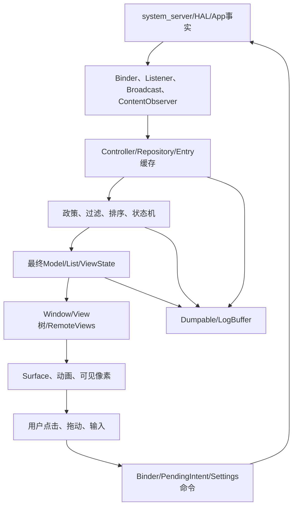
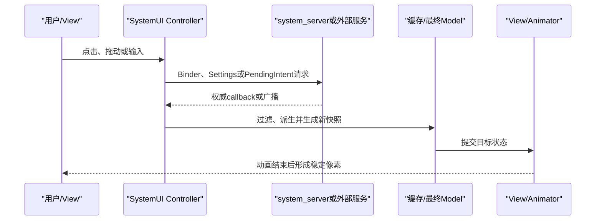
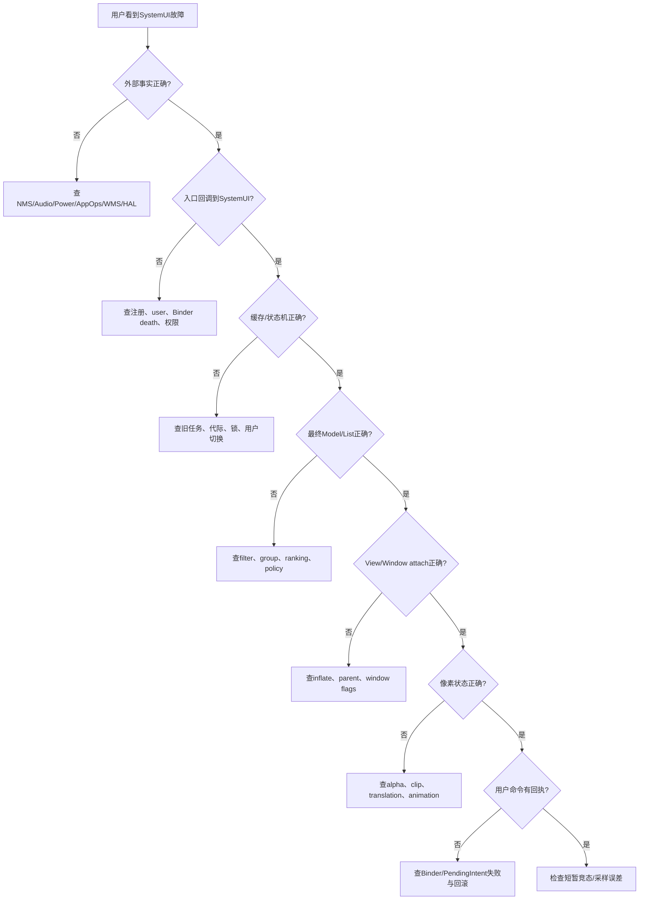

# 第 500 章 Android SystemUI 端到端故障树：第401—499章核心心智模型复盘和源码阅读方法

> 源码基线：Android 11 / API 30 / `android-11.0.0_r48`。本章只在 macOS 复读本地源码，不实际编译。它不重复99章细节，而是把SystemUI进程启动、窗口与Panel、QS、媒体、隐私、Keyguard/Doze、通知数据/视图/交互和Dump证据重新拼成一张可执行的源码阅读地图。

## 1. 本章解决什么问题

读完大量类后，遇到“状态栏没图标、QS点了没反应、锁屏黑屏、通知不见、点击打不开、SystemUI重启”时，怎样迅速判断从哪一层开始？怎样避免把动画当状态、把回调当完成、把日志常量当真实接线？

## 2. 一句话总模型

SystemUI通常不是最终政策源，而是一个长期运行、按用户装配、跨Binder订阅事实、在主线程把状态投影为多个窗口/View，并通过异步命令把用户意图送回system_server的客户端。遇到界面或交互故障时，优先按“事实→缓存→派生→列表/状态机→View→像素→回执”逆向定位；若问题属于SystemUI自身维护的临时交互政策，再回到对应Controller或状态机确认。

## 3. 先画八层而不是先搜类名

八层依次是：外部事实源、Binder/广播入口、SystemUI缓存、政策/状态机、最终数据模型、View树、Surface/动画、反向命令与回执。一个类可能跨两层，但不能把层次删掉。

## 4. SystemUI全景图

## 5. SystemUI不是system_server

NotificationChannel、AppOps、Audio、Power、Window、Keyguard安全事实多数由服务端掌握；SystemUI保留镜像并发起请求。界面变了不证明服务端成功，服务端成功也不保证界面已完成动画。

## 6. 进程启动是第一条因果链

SystemUIApplication创建Dagger根依赖，按资源服务数组启动SystemUI组件；BootCompleteCache把一次性boot事实分发给晚注册观察者。启动故障先确认组件有没有实例化，而不是直接看View。

## 7. 资源数组是隐形装配代码

`config_systemUIServiceComponents`、per-user数组、vendor service和overlay决定实际产品启动哪些类。AOSP基线存在类不等于设备一定实例化。

## 8. Dagger与Dependency并存

r48迁移期既有构造注入，也有全局Dependency.get。定位同名对象时先确认实际取得的是哪个实例、生命周期是Singleton还是按组件重建。

## 9. Startable顺序不等于依赖顺序全部可见

显式数组顺序、Dagger provider惰性创建、构造器副作用、InitController post-init任务共同影响接线时点。看到字段非null也不证明callback已经注册。

## 10. BootComplete是缓存状态不是广播重放

晚注册listener可能立即收到cache回调；组件不能假设只在原始BOOT_COMPLETED广播时运行一次。

## 11. BroadcastDispatcher把注册与业务分开

它按user、filter、Handler/Executor复用接收器；注销与已投递callback有竞态。用户切换故障要同时看注册user和执行时current user。

## 12. Current user是一条移动边界

UserSwitcher、CurrentUserTracker、Settings observer、Notification profiles、媒体filter和Keyguard目标用户并非同一瞬间切换。任何跨Handler任务都应问“捕获user还是执行时重读”。

## 13. CommandQueue是SystemUI总线之一

StatusBarManagerService跨Binder调用CommandQueue，后者按display与callback分发状态栏命令。命令到达不等于目标Fragment/View已attach。

## 14. Callback列表是生命周期资源

注册不注销会重复处理；在dispatch期间增删可能依赖复制/反向遍历策略。每读一个Controller都应找addCallback与removeCallback成对点。

## 15. Configuration不是一次重建

密度、fontScale、locale、uiMode、theme、overlay、rotation可分别触发资源更新、View reinflate或Controller callback。配置变化故障先定位变化粒度。

## 16. 插件是另一套ClassLoader世界

PluginManager发现包、检查版本、创建独立ClassLoader并做崩溃保护。插件接口对象不能随意强转为主进程实现类，也不能假设静态单例共享。

## 17. TunerService把Settings变成动态配置

Tunable注册通常立即收到当前值，用户切换会重读；坏字符串、null删除和默认值需看每个消费者如何解析。

## 18. Dump是启动链的验证工具

第499章的config/dumpables可确认资源服务列表与已注册对象；“源码里有类”应升级为“运行对象已注册且状态符合”。

## 19. StatusBar是装配器而不是单一UI

它连接窗口、Panel、通知、Keyguard、导航、CommandQueue与ActivityStarter。大类中的成员多是跨子系统桥，真正算法常在Controller中。

## 20. 顶部状态栏与通知Shade是不同窗口职责

StatusBarWindow控制顶部条；NotificationShadeWindowController控制可展开大窗口。图标正常但下拉无响应，应从Shade window/focus/touch查，不先怀疑IconController。

## 21. Window可见有多个维度

View visibility、WindowManager.LayoutParams height/flags、focusable、touchable、wallpaper、blur、alpha和Surface存在是不同门。“window added”不等于用户能触摸或看到。

## 22. Panel expansion是连续状态

expanded fraction、height、tracking、flinging、closing、fully expanded/collapsed各自存在。代码注释写expanded时要核对实现是`height>0`还是精确终态。

## 23. 第495章已给出典型反例

Blocking Helper注释称fully expanded，实际只判断expandedHeight大于0。阅读时条件表达式优先于自然语言注释。

## 24. Falsing是额外政策层

触摸命中View后仍可能因Keyguard、传感器分类、动作类型被判误触。按钮没反应要区分listener未触发、listener触发但falsing拒绝、命令已发送三种情况。

## 25. StatusBar icon是slot模型投影

SignalPolicy/Controllers产生状态，IconController按slot维护模型，再由多个IconManager同步到状态栏、Keyguard等容器。某一容器缺图标不一定是源状态缺失。

## 26. disable flags是组合政策

CommandQueue的disable1/disable2、Keyguard状态、Panel状态和网络政策共同决定CollapsedStatusBar区域显示。不要只查View.GONE的最后一行。

## 27. 网络图标有多源异步合流

Wi‑Fi、mobile、VPN、airplane、Ethernet和subscription变化到达顺序不同。瞬间互相覆盖往往是旧callback迟到或新订阅表尚未重建。

## 28. 图标问题的逆向路径

从目标ImageView/slot开始，查IconManager持有的IconState，再查StatusBarIconController slot，再查SignalPolicy缓存，最后查NetworkController callback与服务端事实。

## 29. QS Host先解释“有哪些Tile”

QSTileHost解析spec、创建Tile、处理custom/default、持久化顺序与用户切换。Tile类正常但面板没有它，先查spec列表而不是Tile refreshState。

## 30. QSTileImpl把线程切换藏进模板

点击从UI进Tile Handler，Controller callback再触发refresh，State复制后回主线程通知View。点击方法return不是Tile已变色的完成点。

## 31. Tile State对象有快照语义

tmp state与published state比较后才回调；直接修改旧published对象或equals漏字段会造成界面不刷新。

## 32. Tile lifecycle决定监听成本

setListening由Panel可见、分页和host驱动；未listening时某些Controller仍缓存，另一些停止监听。只在面板打开才复现的问题要查注册时点。

## 33. QS点击通常只是请求

Wi‑Fi、Bluetooth、Cellular、Hotspot、Airplane、Battery Saver、Data Saver、Location、Rotation、DND都需等待Settings/Binder/广播回读，不能在click后直接把临时UI当真相。

## 34. 限制门要在UI前后都查

ECM、Data Saver、用户限制、管理员策略、无SIM、provisioning、Keyguard分别可能阻止命令。Tile disabled、点击弹Dialog和服务端拒绝是不同表现。

## 35. Detail Adapter是第二个View状态机

主Tile状态与详情列表设备扫描/连接状态分开。Bluetooth主图标正确但详情空，应查device callback和DetailAdapter生命周期。

## 36. 线程问题的固定问法

输入在哪个Looper？状态在哪个线程写？View在哪个线程读？跨线程传的是不可变快照、复制对象还是共享可变集合？这四问能覆盖大多数SystemUI竞态。

## 37. 媒体从通知中来但不是通知Row

MediaDataManager从媒体通知提取模型，经过resume、timeout、session filter、device combine与user filter，再由MediaHost/Carousel展示独立卡片。

## 38. Media key会迁移

notification key、package resume key与媒体数据旧/新key可变化。Map remove/add次序错误会留下半边孤儿或重复卡。

## 39. CombineLatest需要两边都到

MediaData与MediaDeviceData分别异步产生；只有满足合流条件才向下游发送。卡片不见时先查哪一边缺，不要直接怀疑Carousel。

## 40. MediaSession filter处理远端/本地重复

同package token与remote playback会抑制另一卡；会话销毁、token迁移和通知移除次序决定是否恢复。

## 41. Timeout不是立刻删除

播放暂停后延迟任务把active状态改变，MediaDataFilter/Carousel再决定保留或移除；旧Runnable需要key/generation防止误伤新session。

## 42. Resume卡依赖组件发现与持久化

并非任何历史媒体App都能恢复；需要MediaBrowserService候选、用户设置、持久key和可连接回调。

## 43. Media Host只有一个真实View

MediaHierarchyManager在QS、锁屏、Shade等Host间移动同一内容，必要时经overlay过渡。两个区域不是各渲染一套独立Carousel。

## 44. UniqueObjectHostView优化重挂

快速从旧parent detach并attach可绕过常规measure；缓存尺寸不一致会造成瞬时几何问题。

## 45. TransitionLayout用测量状态插值

Controller生成起终ViewState，再按progress插值bounds、alpha与子View状态。目标数据正确但动画跳变，应查状态捕获时机与child mapping。

## 46. SeekBar轮询有三类时间

PlaybackState position、elapsedRealtime更新时间和UI polling interval必须换算；用户drag时暂停自动覆盖，release后seekTo只是请求。

## 47. 输出设备芯片有可信门

MediaDeviceManager/Transfer要等local media manager扫描和当前设备有效，不能用一条route callback直接宣布可切换。

## 48. 媒体故障从合流点二分

上游没有MediaData查通知/session；有MediaData没合流查device；已合流没卡查user filter/host；卡在但不可见查Hierarchy/Transition/View。

## 49. Screenshot与ScreenRecord是跨服务流水线

捕获、编码、保存MediaStore、生成预览/通知、分享/编辑Intent各自异步。通知出现不证明文件可读，保存成功不证明分享Intent权限正确。

## 50. PendingIntent安全关注身份与可变性

系统生成动作要明确目标组件、user、URI grant和flags；用户点击时捕获的旧PendingIntent可能在延迟期间被取消。

## 51. PowerUI是多警告仲裁器

低电、温度、USB过热分别由不同事实源和阈值控制；WarningsUI只是展示接口。Dialog没出先查show条件、已有警告优先级和screen状态。

## 52. StorageNotification按卷状态建通知状态机

disk/volume/record/move事件会更新同ID通知；采用存储、缺失私有卷和迁移是不同user/action范围。

## 53. KeyboardUI依赖Boot与Bluetooth双门

自动配对不是开机立刻扫描；要等待Boot complete、Bluetooth adapter状态和设置，再进入扫描/配对状态机。

## 54. AuthController只承载系统认证UI

BiometricService/SystemServer决定认证会话，SystemUI管理Dialog、sensor位置、orientation、credential fallback与dismiss回调。Dialog消失不一定是认证成功。

## 55. 隐私从AppOps事实开始

AppOpsController监听active/noted operation，维持当前与短时历史；Privacy Chip、location icon和通知只是不同投影。

## 56. Active与Recently Active要分开

操作结束后可延迟保留几秒，避免图标闪烁；看到隐私点不等于传感器此刻仍在采样。

## 57. 麦克风静音改变展示语义

AppOp active与SensorPrivacy/Mic mute组合后，Chip可能显示“被阻止/仍请求”。不能只用active布尔解释数据真的流出。

## 58. Sensor Privacy有总开关与服务端执行层

SystemUI Toggle发请求，SensorPrivacyService/HAL/Audio/Camera链真正封锁。UI switch更新应等callback回读。

## 59. Location icon是请求投影

高功耗定位、AppOps、用户开关和restriction共同决定状态栏图标与Tile；位置总开关off不等于没有任何location-related AppOp记录。

## 60. 隐私故障用三列核对

应用是否请求、服务是否允许、SystemUI是否显示。把“请求存在”误写成“数据访问成功”会造成错误安全结论。

## 61. KeyguardUpdateMonitor是事实总线

SIM、电源、Trust、biometric、user与phone状态汇集后推callback。它不是最终解锁政策，也不是Keyguard View本身。

## 62. KeyguardViewMediator是总状态机

负责show/hide、延迟锁、occluded、going away与WMS回调。View已经INVISIBLE但Mediator仍showing会影响Activity启动和Shade政策。

## 63. Bouncer是认证UI容器

StatusBarKeyguardViewManager决定何时show/hide Bouncer，SecurityContainer根据SecurityModel切PIN/Pattern/Password/SIM。

## 64. 认证成功也有多阶段

LockPatternChecker early match、final callback、失败记账、StrongAuth、Mediator keyguardDone、WMS going-away与Activity transition不是一个完成点。

## 65. Async credential需要代际

用户快速重试、切用户或View pause时旧回调可能迟到；cancel(false)不保证服务端校验停止。每次结果必须绑定target user和attempt generation。

## 66. Lockout用elapsedRealtime

倒计时deadline不能用wall clock推断；暂停/恢复时应重建剩余时间并恢复输入enabled状态。

## 67. SIM PIN/PUK是Telephony远程状态机

PUK→新PIN→确认只是UI阶段；真正retry count、锁定和多SIM状态来自Telephony回调。当前subId变化需使旧异步结果失效。

## 68. Biometric unlock有多种模式

WAKE_AND_UNLOCK、仅唤醒、show Bouncer、dismiss Bouncer取决于interactive、Keyguard、pulsing与Bypass；收到authenticated不等于总走同一动画。

## 69. Face Bypass受通知/QS展开阻挡

认证可先pending，等QS/Panel收起再解锁。用户看到“人脸成功但没动”应查bypass pending与可放行条件。

## 70. DozeMachine是严格状态转换器

各Part接收相同state变化，不能各自发明全局状态；非法转换、WakeLock包裹和requested state队列决定执行顺序。

## 71. DozeTriggers决定何时Pulse

通知、传感器、Dock、prox与Host政策都可拒绝。通知已到不等于屏幕一定pulse。

## 72. DozeSensors只提供事件不是决定

抬腕、双击、长按、significant motion有注册条件、prox检查和配置；最终交Triggers/Machine。

## 73. 屏幕state与brightness是两条Part

DozeScreenState可延迟display state，Brightness读取sensor bucket/默认值并做scrim；AOD黑屏要分别查panel state和alpha/brightness。

## 74. AOD minute tick依赖Alarm

DozeUi按整分钟RTC/elapsed映射调度，漏tick有检测；立即帧与500ms补帧不等于另一个周期Alarm。

## 75. Wallpaper、Dock、Falsing是Doze投影

它们观察Machine子集并通知各自服务。状态集合相似但不相同，不能用一个Part的active集合推断另一个。

## 76. WakeLock保护的是异步收尾窗口

Pulse、临时indication、Alarm callback需要CPU保持；acquire/release位置和延迟包装必须成对审计，避免睡眠前Runnable丢失或长期持锁。

## 77. AOD通知又跨回通知管线

WakeUpCoordinator以dozing、pulsing、visibility amount和Bypass控制Row/Shelf；NotificationEntry存在也可能alpha为0或clip隐藏。

## 78. PulseExpansion把AOD手势转Shade

它要通过falsing、拖动阈值、locked shade政策并协调WakeUpCoordinator；手势失败可回弹而不是解锁失败。

这里也适合把SystemUI最常见的异步闭环单独画出来。用户动作通常只产生“请求”；服务端或外部事实源的后续回调才是权威状态，Controller再据此生成新模型并提交给View。请求成功返回、回调到达和像素稳定是三个不同完成点。

## 79. 通知问题先分“没有数据”与“没有像素”

NMS没Record、SystemUI没Entry、final list被filter、View未attach、Row内容inflate失败、alpha/clip/translation隐藏是六个不同层。

## 80. NotificationListener是跨进程入口

posted/removed/ranking经Binder wrapper与main Handler进入SystemUI；插件、GroupCoalescer、新旧pipeline再分流。到达回调不证明列表已build。

## 81. Collection是真实库存而ShadeList是投影

NotifCollection可保留被filter、dismiss、lifetime-extended的Entry；ShadeListBuilder只输出当前用户可展示、分组、排序后的ListEntry树。

## 82. 新旧通知管线要先选一条

r48同时保留EntryManager与NotifCollection/Builder。feature enabled与rendering enabled还可能不同；不要拼接两套互斥路径形成不存在的调用链。

## 83. Ranking只是一组服务端快照

importance、rank、channel、sentiment、smart actions、snooze criteria等随RankingUpdate变化；Entry更新后Row/section可能异步重绑。

## 84. Filter与Lockscreen privacy不是一层

NotificationFilter可从final list完全排除；LockscreenUserManager还可保留Row却使用public version脱敏。用户说“不见”要问是整行无还是内容隐藏。

## 85. Group有逻辑与视觉两套key

NMS raw/override group、SystemUI group bucket、Heads-up isolated key和View parent不同。summary suppressed不是summary数据被删除。

## 86. Heads-up也是View政策不是新通知

AlertingNotificationManager在同一Entry上维护alerting/pinned/sticky/auto-remove；HUN离场后Row可回Shade。

## 87. HUN资格与显示是两阶段

InterruptStateProvider判断awake/pulse/bubble/FSI候选，HeadsUpController再异步绑定HUN content并show。资格true但bind迟到/取消仍不显示。

## 88. StackScrollAlgorithm生成目标而非动画

AmbientState输入经算法得到ExpandableViewState；apply或StackStateAnimator把目标变成像素。目标正确但画面错查Animator/旧tag/clip。

## 89. Shelf与Icon有连续变换量

Row进入Shelf不是布尔瞬移；content clip、icon transform、alpha、roundness和overflow状态并行。只查`inShelf`会漏半途中间态。

## 90. Group children高度上限随状态变

折叠/系统展开/用户展开、low priority、conversation、locked drag使用不同可见child数与header；summary height不是children简单求和。

## 91. RemoteViews inflate是多槽事务近似

contracted/expanded/HUN/public异步apply/reapply，全部成功才提交cache，但reapply对旧View的副作用可能提前发生；错误回退不是真正回滚。

## 92. ContentView选择当前可见类型

高度、Heads-up、group、user expanding与动画决定contracted/expanded/HUN/single-line；“expanded View已inflate”不等于当前会选它。

## 93. TransformState依赖跨View语义key

title/icon/action等按key匹配并在View tag存连续状态；取消动画若不清tag会污染下一次transform。

## 94. RemoteInput有active、spinning、history三层

输入框聚焦、PendingIntent已发送等待更新、通知因历史延长生命周期不是同一bool。点击保护和LifetimeExtender分别读取不同状态。

## 95. Smart Reply先选候选再选可见按钮

应用候选可整体压制NAS；SmartReplyView measure再按宽度挤压，Action测量优先与View视觉顺序又不同。

## 96. 点击发送常先本地记账

RemoteInput/Smart Reply在PendingIntent前可能写sent/spinning/history；CanceledException没有统一回滚，造成“UI以为发了、App没收到”。

## 97. Guts是Row内部翻面容器

open包含bind与post两阶段；close包含内容保存、exposed状态、closed listener与动画完成。任一“close”回调都不能自动等同像素完全消失。

## 98. Channel设置通常异步提交

NotificationInfo在UI暂存alert/silent，关闭save后BG Handler Binder更新；ChannelEditor多项更新无事务，部分失败不回滚。

## 99. Snooze是服务端移出后未来re-enqueue

SystemUI选择只在关闭Guts时commit；SnoozeHelper的Record、persisted metadata、reverse index、Alarm四账不等价，重启只恢复元数据。

## 100. Blocking Helper是dismiss后的借壳View

negative sentiment触发普通NotificationInfo；Entry仍真实dismiss，View hierarchy按flag暂留Row，关闭后再移壳。它不是Undo。

## 101. Adjustment是受能力过滤的建议

Assistant定义key不等于allowed；入队200ms窗口与active批量路径不同，importance还会被用户/OEM/system覆盖。

## 102. 通知点击是非原子工作流

RemoteInput门、Keyguard、work challenge、PendingIntent、Bubble、Shade、click证据和auto-cancel独立完成。发送失败仍可能上报并删除。

## 103. Clear All是动画快照加服务端全局遍历

View先滑走，commit后新ALL重扫Collection，NMS又遍历posted/enqueued/snoozed与profiles。LifetimeExtender不应阻止明确用户dismiss。

## 104. 端到端故障树

## 105. 第一现场先记录稳定标识

通知用key/user，媒体用key/token/package，Window用display/token，认证用user/sensor/session，Tile用spec。没有关联键的日志只能做背景噪声。

## 106. 再记录三种时间

wall clock用于跨进程日志对齐，uptime/elapsed用于timeout，动画fraction/帧用于像素状态。不要把System.currentTimeMillis deadline与elapsed timeout混算。

## 107. 对每个异步操作找代际

常见代际是key、Entry对象身份、PendingIntent、userId、subId、session token、generation counter。若源码只有key而同key可更新，就标记stale callback风险。

## 108. 对每个异常找回滚

catch后是return、继续、重试、清状态还是只日志？第497章send失败继续auto-cancel、第496章批量无回滚、第493章频道部分失败都说明异常策略决定用户体验。

## 109. 对每个布尔问谁清零

`showing`、`pending`、`spinning`、`expanded`、`animationRunning`、`mIsCollapsing...`若只有置true点没有finally/取消点，往往是卡状态入口。

## 110. 对每张Map问四个操作

谁insert、谁update、谁remove、进程重启怎么恢复。Snooze四账、Media双边Map、NotifCollection extenders、DumpManager注册表都用这套方法审计。

## 111. 对每段测试先数覆盖面再读断言

测试总数不等于目标链覆盖；先用`@Test`定位，再映射资格门、成功、失败、取消、迟到、用户切换、重启和异常安全七类场景。

## 112. macOS只读练习一：通知不见六层定位

选第499章假想key，只读列出NMS Record、NotificationListener callback、NotifCollection、ShadeListBuilder、NotifViewManager、NSSL/Row六层；为每层写一个“存在但下一层不存在”的源码入口。

## 113. macOS只读练习二：QS点击不生效定位

任选Airplane或Location Tile，从handleClick开始，画Settings/Binder请求、Controller回调、handleUpdateState、State复制、TileView更新；标出政策拒绝和旧callback迟到位置。

## 114. macOS只读练习三：锁屏黑屏定位

并排阅读KeyguardViewMediator、DozeMachine、DozeScreenState/Brightness、Scrim、NotificationShadeWindow五栏，区分display off、brightness 0、scrim alpha 1、window invisible与View alpha 0。

## 115. macOS只读练习四：设计统一异步审计表

为RemoteInput发送、Assistant Adjustment、通知点击、Clear All各写输入标识、线程切换、完成回执、timeout、cancel、异常回滚、generation七列；不改源码、不运行编译。

## 116. 易错理解一：看到最终View代码就找到根因

不准确。View通常只是最后投影；应先确认外部事实、回调、缓存、政策和final model。否则会在alpha/GONE处修补上游状态错误。

## 117. 易错理解二：方法返回就代表操作完成

不准确。SystemUI大量方法只post Handler、发Binder或启动动画；真正完成需服务端callback、listener removed、Animator end或View attach等明确回执。

## 118. 易错理解三：注释、常量和测试名等于当前行为

不准确。r48已有fully expanded注释与`height>0`差异、旧Blocking Helper counters、Dump HIGH空路由、测试名残留。最终以本地实现和调用点为准。

## 119. 第401—499章最终心智模型

基础设施决定对象是否活着；Window/Panel/QS决定系统壳交互；媒体、隐私和系统功能是多源状态投影；Keyguard/Doze是安全与低功耗状态机；通知则是库存、Ranking、分组、内容、View和交互的多级流水线；Dump/Log把这些层用稳定标识和时间重新串起来。

## 120. 第500章结论与阶段收口

学SystemUI源码的核心不是记住类，而是掌握“分层、线程、身份、代际、完成点、回滚、证据”七件事。到此第401—500章形成从进程启动到端到端诊断的闭环；下一步不再生成新章，而是对第411—500章执行结构、链接、Mermaid、练习位置和高风险绝对化表述审计，更新进度后停止等待确认。
