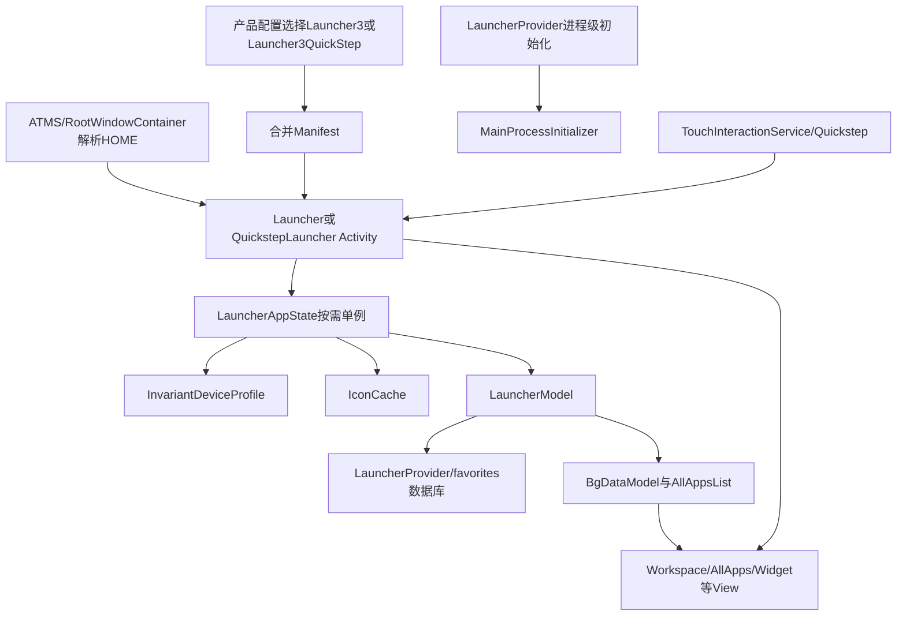
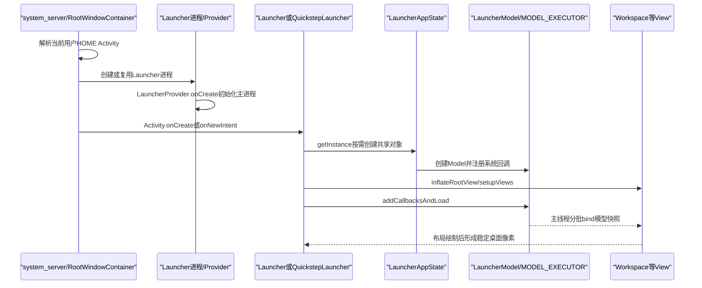
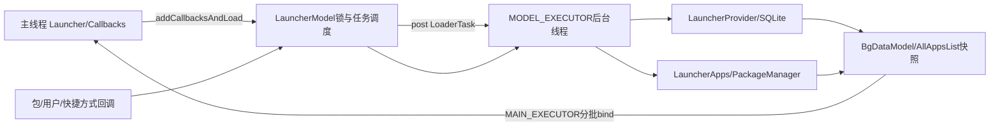

# 第501章 Android Launcher3工程全景：Manifest、LauncherProvider主进程初始化、LauncherAppState与首页加载链

> 源码基线：Android 11 / API 30 / `android-11.0.0_r48`。本章只在macOS复读本地源码，不编译。主要源码位于`packages/apps/Launcher3`，服务端HOME启动入口位于`frameworks/base/services/core/java/com/android/server/wm`。

## 1. 本章先解决什么问题

按下Home键或系统开机后，谁选择桌面应用？Launcher3进程里的第一个初始化入口是谁？`LauncherAppState`是不是`Application`？桌面View出现与图标数据加载完成是不是同一个时刻？本章先建立全景，后续49章再逐个拆解数据库、模型、图标、Widget、拖拽和Quickstep。

## 2. 学完应能回答的五个问题

你应能说清：HOME Intent怎样解析到Activity；AOSP手机为何通常构建`Launcher3QuickStep`；为什么生产Manifest没有自定义Application；`LauncherProvider`、`LauncherAppState`、`LauncherModel`和`Launcher`分别负责什么；以及“Activity已创建”“模型已绑定”“首帧可见”三个完成点为何不同。

## 3. 先把Launcher3分成六层

六层是：产品构建与Manifest、system_server的HOME解析、进程级初始化、应用级共享对象、后台Model/数据库、Activity/View投影。类名都叫Launcher并不可怕，只要先判断它在哪一层。

## 4. Launcher3全景图



图中两条入口要分开：HOME Activity负责桌面页面；Quickstep Service负责手势和最近任务接线。它们可以属于同一个APK和进程，但不是同一个生命周期回调。

## 5. 本章真实源码入口

建议先读`packages/apps/Launcher3/Android.mk`、`AndroidManifest.xml`、`AndroidManifest-common.xml`、`quickstep/AndroidManifest-launcher.xml`、`LauncherProvider.java`、`MainProcessInitializer.java`、`LauncherAppState.java`、`Launcher.java`和`LauncherModel.java`。

## 6. Android 11里存在多个Launcher构建变体

`Android.mk`同时定义`Launcher3`、`Launcher3Go`、`Launcher3QuickStep`与`Launcher3QuickStepGo`。它们复用大量`src`代码，却合入不同Manifest、资源和Quickstep源码。看到基类实现不能直接断言设备安装的是哪一个变体。

## 7. 普通Launcher3模块的边界

普通`Launcher3`使用`Launcher3CommonDepsLib`，收集`src`、shortcut override与UI override源码，声明为privileged、system_ext模块，并覆盖旧`Home`与`Launcher2`包名。

## 8. Quickstep模块多了什么

`Launcher3QuickStepLib`额外包含`quickstep/src`、`quickstep/recents_ui_overrides/src`、SystemUI shared library和statsd依赖；最终`Launcher3QuickStep`覆盖普通Launcher3。最近任务与手势能力来自构建输入，不是运行时凭空加载。

## 9. AOSP手持产品通常选择Quickstep

本地`build/make/target/product/handheld_system_ext.mk`明确把`Launcher3QuickStep`加入`PRODUCT_PACKAGES`。这是通用手机/平板产品基线的证据；具体厂商产品仍可覆盖，因此应说“AOSP handheld配置选择”，不能说“所有Android 11设备都选择”。

```make
PRODUCT_PACKAGES += \
    Launcher3QuickStep \
    Provision \
    Settings \
    SystemUI
```

## 10. 普通与Quickstep的HOME Activity不同

普通`AndroidManifest.xml`登记`com.android.launcher3.Launcher`；Quickstep的`AndroidManifest-launcher.xml`登记`com.android.launcher3.uioverrides.QuickstepLauncher`。后者沿继承链最终复用`Launcher.onCreate()`，再追加预测Hotseat与Recents行为。

## 11. Manifest不是单文件事实

`AndroidManifest-common.xml`声明Provider、通知监听服务、固定快捷方式接收器、设置页和副屏HOME；变体Manifest声明主HOME Activity；Quickstep Manifest再声明TouchInteractionService与RecentsActivity。最终安装包行为来自合并结果。

## 12. HOME入口的最小合同

主Activity使用`ACTION_MAIN`、`CATEGORY_HOME`和`CATEGORY_DEFAULT`：

```xml
<intent-filter>
    <action android:name="android.intent.action.MAIN" />
    <category android:name="android.intent.category.HOME" />
    <category android:name="android.intent.category.DEFAULT" />
</intent-filter>
```

这表示它是HOME候选，不表示它天然就是当前默认桌面。

## 13. LAUNCHER_APP不是普通应用抽屉LAUNCHER

这里附加的是`android.intent.category.LAUNCHER_APP`，并非普通应用图标常见的`CATEGORY_LAUNCHER`。阅读Intent filter必须核对完整常量，不能只看“LAUNCHER”字符串片段。

## 14. 谁决定当前默认HOME

PackageManager的Intent解析、用户当前默认选择以及Android 11的HOME Role共同影响结果。Launcher3提供候选能力；最终选择权在系统服务和当前用户配置，不在`Launcher.onCreate()`。

## 15. system_server怎样启动HOME

`RootWindowContainer.startHomeOnTaskDisplayArea()`取得HOME Intent，调用`resolveHomeActivity()`解析当前用户的ActivityInfo，再把Intent改为显式Component并加`FLAG_ACTIVITY_NEW_TASK`，最后交`ActivityStartController.startHomeActivity()`。

## 16. 服务端会先解析再显式启动

核心顺序可简化为：

```java
homeIntent = mService.getHomeIntent();
aInfo = resolveHomeActivity(userId, homeIntent);
homeIntent.setComponent(new ComponentName(
        aInfo.applicationInfo.packageName, aInfo.name));
homeIntent.setFlags(homeIntent.getFlags() | FLAG_ACTIVITY_NEW_TASK);
mService.getActivityStartController().startHomeActivity(...);
```

因此启动时已经选定具体Activity，Launcher进程不需要再次竞选“谁是HOME”。

## 17. HOME按用户解析

`resolveHomeActivity(userId, homeIntent)`把userId传给PackageManager，并重新取得目标用户的ApplicationInfo。多用户切换时不能复用另一个用户解析出的组件或UID。

## 18. HOME按DisplayArea启动

默认TaskDisplayArea使用primary HOME；可放系统装饰的副屏可能走`SECONDARY_HOME`解析。Launcher3 common Manifest另有`SecondaryDisplayLauncher`，它与主`Launcher`不是同一个Activity。

## 19. HOME是特殊Activity类型

`ActivityStartController`把启动选项设为`ACTIVITY_TYPE_HOME`并确保Home root task存在。它仍遵循Activity启动、进程创建和生命周期规则，但在任务层级、返回行为和进程记账上有特殊身份。

## 20. Home键不总是新建Launcher实例

主Activity声明`launchMode="singleTask"`。已有任务/实例符合复用条件时，系统可能把任务带到前台并走`onNewIntent()`，不能把每次Home键都画成一次全新`onCreate()`。

## 21. 正确的进程初始化顺序

生产Manifest没有`android:name`指定自定义Application，因此先由Framework创建默认`android.app.Application`；随后安装适用的ContentProvider，再创建被启动的Activity或Service。Launcher3自己的一次性初始化放在Provider而非Application子类。

## 22. LauncherApplication是一个错误称呼

本地全树只有Robolectric测试的`LauncherTestApplication`，没有生产`LauncherApplication`。`LauncherAppState`只是普通Java共享对象，不继承`Application`，不能把两者混为一谈。

## 23. LauncherProvider声明自己是首个主进程组件

`LauncherProvider.onCreate()`中的注释写明Provider在Launcher主进程全生命周期存在并作为首个组件创建；实现只执行主进程初始化，没有立刻打开数据库：

```java
public boolean onCreate() {
    MainProcessInitializer.initialize(getContext().getApplicationContext());
    return true;
}
```

## 24. Provider创建不等于数据库已打开

`mOpenHelper`在`createDbIfNotExists()`里惰性创建，query/insert/update等数据访问才触发。看到Provider已经onCreate，最多证明主进程初始化执行过，不能证明favorites表已经加载完成。

## 25. MainProcessInitializer支持资源替换

静态`initialize()`通过`R.string.main_process_initializer_class`和`Overrides.getObject()`取得实现。AOSP默认类可被产品资源指向派生实现，所以真正执行类仍需看资源overlay。

## 26. 默认一次性初始化做四件事

`init()`设置FileLog目录、初始化FeatureFlags、应用SessionCommitReceiver默认用户偏好、初始化IconShape；若BitmapCreationCheck启用再开始追踪位图创建。

## 27. FeatureFlag必须在消费前初始化

Launcher大量分支读取FeatureFlags。把初始化放在主进程首组件可以降低“某个Activity先读取、flag尚未接线”的风险，但资源替换和Direct Boot分支仍要结合实际组件创建顺序复核。

## 28. FileLog目录来自应用filesDir

它是Launcher自己的诊断文件目录，不等同于logcat，也不等同于SystemUI第499章的LogBuffer。排障时要先确认日志落在哪里。

## 29. IconShape是进程级资源事实

Adaptive Icon裁剪形状会影响后续IconCache和View渲染。先初始化形状再创建图标对象，避免同一进程中早晚生成的图标采用不同mask。

## 30. Session默认偏好服务Promise图标

安装会话是否在桌面展示占位图标受用户偏好与Session回调控制。初始化只是建立默认值，真正库存更新后续由InstallSessionTracker和LauncherModel完成。

## 31. Direct Boot让“Provider永远第一”需要限定

Quickstep的`TouchInteractionService`声明`directBootAware="true"`，而LauncherProvider没有该声明。Provider注释准确描述普通已解锁主进程路径；若进程在Direct Boot阶段因Quickstep服务启动，还要结合ActivityThread收到的provider列表核对，不能把注释扩大成无条件平台定律。

## 32. Quickstep服务与HOME Activity是双入口

TouchInteractionService由SystemUI/系统导航接线，HOME Activity由ATMS启动。服务可以先存在而桌面Activity尚未可见；桌面已可见也不代表手势代理已经连接。

## 33. 主Activity的关键Manifest属性

`singleTask`控制复用，`taskAffinity=""`避免普通包Affinity，`stateNotNeeded="true"`允许系统不保存传统实例状态，`clearTaskOnLaunch`与HOME任务回前台行为协作。这些属性要结合Activity任务规则理解。

## 34. stateNotNeeded不表示Launcher不保存状态

`Launcher`仍在Bundle中维护当前页面、LauncherState、PendingRequest和Widget面板状态。Manifest属性描述系统是否必须保留Activity状态，不会删除类里显式的save/restore代码。

## 35. Launcher自行处理许多配置变化

Manifest列出orientation、screenSize、screenLayout、smallestScreenSize、keyboard等`configChanges`，所以不少变化走`onConfigurationChanged()`而非Activity重建。uiMode并未写在这一列表里，类中仍会比较配置差异，具体是否重建要看Framework分发。

## 36. targetSdk与平台版本不是同一个数

两个主Launcher Manifest在Android 11源码中写`targetSdkVersion="29"`、`minSdkVersion="25"`。源码位于Android 11不代表它的targetSdk自动等于30。

## 37. QuickstepLauncher没有重写整个桌面

继承链是`QuickstepLauncher → BaseQuickstepLauncher → Launcher`。它主要添加Recents、预测Hotseat、导航模式和手势行为，基础View装配与Model加载仍落回`Launcher.onCreate()`。

## 38. Launcher本身是什么

`Launcher`继承`StatefulActivity<LauncherState>`，并实现`BgDataModel.Callbacks`等接口。它既是Activity，又是Model向View提交数据的callback目标，但不拥有数据库事实本身。

## 39. BaseActivity维护可见性与生命周期位

`ACTIVITY_STATE_STARTED/RESUMED/DEFERRED_RESUMED/WINDOW_FOCUSED`等是位集合。系统生命周期回调到达不等于一帧已经显示，`DEFERRED_RESUMED`专门表达resume后又经过一帧且未立即pause。

## 40. Launcher.onCreate的四段结构

可分为共享对象取得、Controller/View构建、状态恢复、Model加载与外围监听。不要从文件第一行一路平铺；按这四段读更容易找到故障所在层。

## 41. HOME冷启动时序图



图中`addCallbacksAndLoad()`返回并不是最后一步；后台读取、主线程bind、View布局和首帧提交分别有自己的完成点。

## 42. onCreate先建立Trace段

`TraceHelper.beginSection(Launcher.onCreate)`用于性能观察。调试版还可开启StrictMode，但本地常量`DEBUG_STRICT_MODE=false`，不能把这段检测写成默认产品行为。

## 43. super.onCreate之后才取LauncherAppState

Framework Activity基础初始化先完成，然后`LauncherAppState.getInstance(this)`。如果进程级Provider初始化失败，通常不会正常走到这里；若AppState构造失败，桌面Activity会在View创建前终止。

## 44. LauncherAppState是按需主线程单例

它通过`MainThreadInitializedObject<LauncherAppState>`保存实例，provider只做MainProcessInitializer，并不主动创建AppState。第一次调用通常来自`Launcher.onCreate()`，其他组件也可能更早请求它。

## 45. MainThreadInitializedObject怎样保证主线程创建

调用者若在main looper，直接执行provider；若在其他线程，就向`MAIN_EXECUTOR`提交并同步`get()`等待：

```java
if (Looper.myLooper() == Looper.getMainLooper()) {
    mValue = mProvider.get(context.getApplicationContext());
} else {
    return MAIN_EXECUTOR.submit(() -> get(context)).get();
}
```

因此“任意线程可调用”不等于“任意线程构造”。

## 46. 后台首次get可能阻塞

后台线程会等待主线程完成构造。如果主线程又持锁等待该后台任务，就可能形成死锁。这个工具只解决线程归属，不自动解决调用方锁顺序。

## 47. 单例保存Application Context

provider最终拿`context.getApplicationContext()`构造对象，避免长期持有Launcher Activity。但AppState中的listener与Manager仍具有进程生命周期，注销策略必须独立审计。

## 48. PreviewContext是有意例外

预览渲染使用`PreviewContext.getObject()`保存独立对象，不污染生产全局单例。这说明“INSTANCE全进程唯一”在预览隔离环境里不是严格描述。

## 49. LauncherAppState构造分成基础与监听两段

两参数构造器先建立IDP、IconCache、WidgetPreviewLoader、LauncherModel和PredictionModel；公开构造器再注册LauncherApps、广播、图标、用户、安装会话和通知点监听。

## 50. 构造器明确要求UI线程

`Preconditions.assertUIThread()`位于基础构造器。它与MainThreadInitializedObject的转发配合，防止大量资源与回调对象在不一致线程创建。

## 51. InvariantDeviceProfile先于图标缓存

IconCache需要IDP提供目标dpi与bitmap尺寸；先有网格/尺寸事实，后有图标缓存。配置变化时AppState还会更新IconCache参数并强制Model reload。

## 52. IconCache不是View缓存

它缓存组件/用户对应的图标与标题数据；BubbleTextView等真实View由Activity布局创建。图标缓存命中不代表View已经attach。

## 53. LauncherModel是共享数据调度器

AppState创建一个LauncherModel，Activity把自己作为Callbacks加入。Model负责后台库存、加载任务和主线程绑定，不应直接持有某个具体View节点。

## 54. PredictionModel与LauncherModel分账

预测会话的持久化/候选不是favorites数据库的普通workspace库存。首页看见预测图标时，要区分固定item、all apps库存和prediction三种来源。

## 55. AppState注册LauncherApps.Callback

包新增、删除、暂停、快捷方式变化等通过LauncherApps进入Model。进程活着且回调注册后，通常不必每次回前台都全量扫描所有包。

## 56. 广播补充用户与语言变化

locale变化强制reload；managed profile available/unavailable/unlocked触发用户可用性和锁状态任务。包回调与广播各自覆盖不同事实。

## 57. onTerminate不是可靠销毁点

AppState提供`onTerminate()`注销回调，但注释明确Application.onTerminate在真实设备不保证调用。进程死亡主要由内核回收全部资源，而不是依赖这个方法优雅收尾。

## 58. FeatureFlag listener还有显式TODO

代码给`APP_SEARCH_IMPROVEMENTS`添加change listener，却留有“remove listener on terminate” TODO。长寿命单例通常影响不大，但不能把生命周期描述成所有注册都严格成对。

## 59. IDP后台验证是post而非构造完成

构造器用主线程Handler post `verifyConfigChangedInBackground`。AppState对象已经返回时，验证任务可能尚未运行；若它发现变化，后面还可能触发reload。

## 60. Launcher先取得Model再造View

`mModel=app.getModel()`发生在inflate之前。此时Model对象存在，但Activity尚未注册为callback，后台Loader也未必启动。

## 61. DeviceProfile把不变网格变成当前窗口布局

Launcher从IDP取得当前`DeviceProfile`，多窗口时再派生MultiWindowProfile。IDP与DeviceProfile不是同一个对象层级。

## 62. Controller先于根View建立

DragController、AllAppsTransitionController和StateManager在inflate前创建，随后`setupViews()`把它们与实际View连接。Controller非null不表示它已经有View引用。

## 63. 初始State是NORMAL

`new StateManager<>(this, NORMAL)`先给出目标状态；随后restoreState可能改成保存状态，再调用`reapplyState()`把属性投影到刚创建的View。

## 64. WidgetHost很早开始监听

`LauncherAppWidgetHost.startListening()`发生在根View inflate前。Widget provider回调和View绑定是不同阶段，早到事件需要依赖后续库存/布局接住。

## 65. inflateRootView只创建View树

`inflateRootView(R.layout.launcher)`得到根布局，不会自动把数据库里的快捷方式填进Workspace。动态item要等待Model callback。

## 66. setupViews连接固定骨架

它查找DragLayer、Workspace、Hotseat、AllApps、Scrim等固定节点，设置touch/drop/controller关系。固定骨架缺失是布局/资源问题，动态图标缺失是Model/bind问题，排障第一步就应分开。

## 67. PopupDataProvider在View之后创建

通知点、deep shortcut与Widget快捷入口通过PopupDataProvider投影。它不是LauncherProvider，两者名字相近但层级完全不同。

## 68. Remote Animation注册不代表动画已经运行

`LauncherAppTransitionManager.registerRemoteAnimations()`只是向系统登记能力；真正应用启动或返回HOME时才创建对应动画会话。

## 69. ActivityTracker可在创建中改内部状态

`ACTIVITY_TRACKER.handleCreate(this)`允许等待Activity的内部handler先设置状态。若已处理，Launcher会从savedInstanceState移除普通state字段，避免两套恢复逻辑相互覆盖。

## 70. restoreState之后还要reapplyState

恢复只决定逻辑状态；`mStateManager.reapplyState()`才把当前State重新施加到View属性。逻辑state正确而像素不对，要继续检查reapply与各StateHandler。

## 71. 当前页面决定同步绑定优先级

配置变化重建时从Bundle取current screen，写入`mPageToBindSynchronously`。这是“先让用户当前看到的页面恢复”的性能策略，不表示全Workspace同步完成。

## 72. addCallbacksAndLoad是一条关键分界线

Activity先加入Model callback列表，再调用startLoader。这样后台结果有明确接收者；Activity销毁时必须移除callback，避免旧Activity继续收到bind。

## 73. 返回true只表示可以同步绑定已有模型

`startLoader()`在`mModelLoaded && !mIsLoaderTaskRunning`时用现有内存模型bind并返回true；否则投递LoaderTask并返回false。返回值不是“整个Launcher加载成功”的通用布尔。

## 74. false路径先把DragLayer alpha置0

若不是内部状态处理且无法同步bind，Launcher暂时把加载alpha通道设0，等首屏bind完成再淡入。根View可能已经存在却被透明度隐藏。

## 75. setContentView发生在Loader调度之后

源码先`addCallbacksAndLoad()`，后`setContentView(getRootView())`。后台结果最终回主线程排队，正常依赖消息队列顺序与bind逻辑协调；不能用传统“先setContentView再开始一切”的模板套这里。

## 76. dispatchInsets是显式补发

setContentView后立刻让RootView dispatchInsets，保证DeviceProfile相关padding能落到View树。Window attach和真实系统Insets仍有自己的时序。

## 77. SCREEN_OFF Receiver属于Activity生命周期资源

Launcher在onCreate动态注册屏幕关闭广播，onDestroy要对应注销。进程级AppState listener与Activity级receiver不能混为一套注销时机。

## 78. SystemUiController只设置窗口UI投影

它依据主题决定状态栏/导航栏图标明暗等窗口标志，不管理SystemUI服务本身。名字叫SystemUiController不表示代码运行在SystemUI进程。

## 79. Overlay插件在基础桌面之后接入

Launcher取得默认空Overlay，再监听OverlayPlugin。插件迟到时会销毁旧manager并替换；左侧Feed等能力不能作为基础Launcher创建成功的前置条件。

## 80. RotationHelper最后初始化

大部分View和状态已经建立后才`mRotationHelper.initialize()`。旋转设置回调到达时，应当能访问已准备的Activity字段。

## 81. 用户变化会把State拉回NORMAL

Launcher最后向UserCache注册listener，回调执行`goToState(NORMAL)`。它解决界面状态收口，不等于Model用户库存已重载；库存更新由AppState/Model另一条链负责。

## 82. LauncherModel有三份核心状态

`BgDataModel`保存workspace/folder/widget/deep shortcut等内存库存，`AllAppsList`保存应用库存，`mModelLoaded/mLoaderTask`保存加载代际。它们不能压成一个`loaded`布尔。

## 83. Model与UI线程图



图中Model的`mLock`保护任务代际，BgDataModel又有自己的访问约束。不要因为最终callback在主线程，就假设整个加载过程都在主线程。

## 84. Callback列表允许不止一个接收者

`mCallbacksList`是ArrayList而非单字段。通常只有当前Launcher，但测试、预览或重绑定时期可能出现不同callback快照；任务创建时会取得数组快照。

## 85. startLoader先开启快捷方式安装队列

Loader运行期间`InstallShortcutReceiver.enableInstallQueue(FLAG_LOADER_RUNNING)`，避免外部安装快捷方式与初始库存加载交错写入。最终在`Launcher.finishBindingItems`关闭相应队列门。

## 86. 没有callback就不启动Loader

`startLoader()`先检查callbacks长度。AppState和Model已经存在，不代表它会无接收者地读取全库；Activity callback是启动绑定流程的重要条件。

## 87. mLock保护Loader代际

start/stop、mLoaderTask和model loaded状态在同一锁下协调。锁保证字段切换原子性，但后台旧任务仍需读取stopped标志并合作退出。

## 88. 每次启动先清旧pending bind

Model把`clearPendingBinds`投到每个callback主线程，随后停止旧Loader。这样减少旧批次Runnable在新加载后继续改View，但清理与已经开始执行的Runnable仍有时间边界。

## 89. stopLoader不是Thread强杀

它把`mLoaderTask`置null并调用`oldTask.stopLocked()`。后台任务在检查点结束；已经执行到的数据库查询或主线程post不一定瞬时撤回。

## 90. LoaderResults携带callback快照

新建时捕获AppState、BgDataModel、AllAppsList、callbacks和MainExecutor。若Activity随后销毁，bind阶段仍必须验证callback是否还有效，不能只信构造时数组。

## 91. 已加载分支也不是全部同步

代码先bindWorkspace，但注释明确AllApps继续post异步绑定，因为同步AllApps还有其他问题。因此`startLoader()`返回true也不能翻译成“所有页面在方法返回前完成”。

## 92. 未加载分支总是post

`startLoaderForResults()`即使当前就在MODEL_EXECUTOR，也用`MODEL_EXECUTOR.post(mLoaderTask)`，目的是先退出嵌套`synchronized`。post是锁安全策略，也是一个新的异步边界。

## 93. 数据库读取发生在LoaderTask而非onCreate正文

Launcher onCreate只触发调度。真正workspace数据库、all apps、shortcuts、widgets加载分阶段发生在LoaderTask，后续章节会逐段拆解。

## 94. Loader取消是合作式的

stop标志需要任务在阶段间检查。若你看到旧查询完成日志，不代表stop无效；要继续看它是否在绑定前识别取消并停止提交。

## 95. BgDataModel不是不可变快照

它是共享可变库存，约定在后台线程/锁下更新，绑定时提取所需列表。把其集合直接交给View长期持有会破坏线程与代际边界。

## 96. LauncherApps callback进入Model后再排任务

`onPackageAdded/Changed/Removed`不直接改View，而是创建`PackageUpdatedTask`进入Model executor。Binder/系统回调到达和桌面图标变化之间隔着任务队列与主线程bind。

## 97. locale变化采用全量forceReload

因为应用标题和排序都可能变化，广播不只更新一个View文本。managed profile事件则使用更细的用户可用性/锁状态任务，体现不同事实选择不同更新粒度。

## 98. 通知点监听还有Settings观察链

AppState按资源决定是否创建通知设置observer；启用时请求NotificationListener rebind。通知点资源开启、用户授权开启和Listener实际连接是三个条件。

## 99. LauncherProvider兼有进程入口与数据库API

同一个类一方面用onCreate初始化主进程，另一方面用query/insert/update访问favorites库。读源码时必须按方法区分职责，不能因为叫Provider就把MainProcessInitializer当成数据库迁移代码。

## 100. Wallpaper服务明确在独立进程

common Manifest的ColorExtractionService使用`android:process=":wallpaper_chooser"`。它不会与主进程共享LauncherAppState静态单例；进程级事实必须按进程重新判断。

## 101. NotificationListener默认仍在主应用进程

它没有单独process属性，通常与Launcher Activity共享进程。系统绑定它可能让进程在HOME Activity之前存在，但Direct Boot、provider安装与组件顺序仍应以实际bind现场为准。

## 102. Quickstep TouchInteractionService是特权入口

它要求`android.permission.STATUS_BAR_SERVICE`，普通App不能随意绑定。`directBootAware=true`让系统导航可在用户解锁前接线一部分手势能力。

## 103. RecentsActivity不是默认HOME

Quickstep Manifest登记独立`RecentsActivity`，但没有HOME Intent filter。它服务fallback/overview场景，不能因为包名相同就把它当桌面Activity。

## 104. 冷启动至少有两种现场

第一种是system_server解析HOME后创建Activity；第二种是系统先绑定Quickstep/Notification服务而创建进程，之后HOME Activity再启动。诊断“Launcher进程已活着但桌面没出现”时必须区分。

## 105. Activity onCreate结束不是首帧完成

onCreate只完成对象和View树装配；ViewRoot traversal、measure/layout/draw、Surface提交在之后。再加上Model异步bind，用户看见完整图标的时间通常更晚。

## 106. Model loaded也不是像素稳定

`mModelLoaded=true`表示后台模型阶段完成并且当前loader收口，不保证所有主线程bind Runnable、图标decode、Widget RemoteViews和动画已经完成。

## 107. 首次可交互还受窗口焦点影响

BaseActivity单独记录`ACTIVITY_STATE_WINDOW_FOCUSED`。桌面画出来但没有焦点时，键盘/触摸或弹窗行为可能不同，不能只看RESUMED。

## 108. SecondaryDisplayLauncher是另一套View实现

副屏HOME继承不同Activity并使用SECONDARY_HOME合同。主Launcher的Workspace、Hotseat假设不一定全部适用，后续排副屏问题应从该Activity单独开始。

## 109. privileged不表示所有调用都不会失败

模块是privileged并申请BIND_APPWIDGET、WRITE_SECURE_SETTINGS等权限，但授权还受privapp whitelist、签名、用户与服务端检查影响。Manifest声明只是资格的一部分。

## 110. 最实用的冷启动排错顺序

依次确认产品装的是哪个模块、当前用户HOME解析到哪个Activity、进程因哪个组件创建、MainProcessInitializer是否完成、LauncherAppState是否创建、Activity是否onCreate、Model是否有callback/loader、bind是否到主线程、根View是否attach和首帧是否提交。

## 111. 本章测试覆盖怎么看

Launcher3全测试树约有152个`@Test`命中，但分散在Model、数据库、UI和Quickstep。测试总数不能证明冷启动全链被一个集成测试覆盖；Robolectric还使用专用`LauncherTestApplication`，不能据此反推生产Manifest存在同名Application。

## 112. macOS只读练习一：核对产品变体

只读比较`Android.mk`中Launcher3、QuickStep和Go四个模块的源码、资源、Manifest与overrides；再看`handheld_system_ext.mk`，画出“类存在→模块收集→产品选包→最终Manifest”四步证据，不执行编译。

## 113. macOS只读练习二：追HOME服务端入口

从`RootWindowContainer.startHomeOnTaskDisplayArea()`追到`resolveHomeActivity()`和`ActivityStartController.startHomeActivity()`，记录userId、displayId、显式Component、Activity type与NEW_TASK分别在哪一步确定。

## 114. macOS只读练习三：手推一次冷启动

按LauncherProvider→MainProcessInitializer→Launcher.onCreate→LauncherAppState→setupViews→addCallbacksAndLoad→LoaderTask→bind的顺序，为每一步写“对象已存在”和“用户已看见”的差别。

## 115. macOS只读练习四：区分四个完成点

建立表格对比Provider onCreate返回、Launcher onCreate返回、`mModelLoaded=true`、首屏bind/首帧稳定；分别写出可用证据和仍未保证的事情，不修改源码、不运行Gradle或AOSP编译。

## 116. 易错理解一：LauncherAppState就是Application

不准确。生产Manifest没有自定义Application，LauncherAppState是由MainThreadInitializedObject按需创建的普通共享对象；进程初始化入口则在LauncherProvider调用MainProcessInitializer。

## 117. 易错理解二：源码有Launcher类就一定运行它

不准确。普通模块的HOME是Launcher，AOSP handheld选择Quickstep模块，其HOME是QuickstepLauncher；厂商还可用产品配置、Manifest和资源override替换。

## 118. 易错理解三：Provider启动就完成数据库加载

不准确。Provider onCreate只初始化主进程，数据库helper在首次真实数据访问时惰性创建，workspace完整读取又在LoaderTask中进行。

## 119. 易错理解四：onCreate返回就能看到完整桌面

不准确。setContentView、Window traversal、Model后台加载、主线程分批bind、图标/Widget内容和动画分别完成；需要明确所讨论的是逻辑Activity、Model还是最终像素。

## 120. 本章结论与下一章

Launcher3启动不是单一`Launcher.onCreate()`，而是“产品选择→HOME解析→进程组件初始化→AppState共享对象→Activity骨架→Model后台库存→主线程View投影”的分层链。第502章继续精读`LauncherAppState`的单例装配、监听注册、配置变化与生命周期边界。
