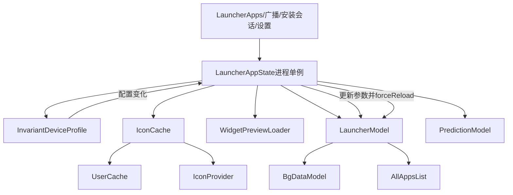
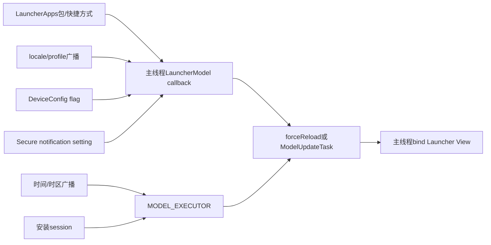
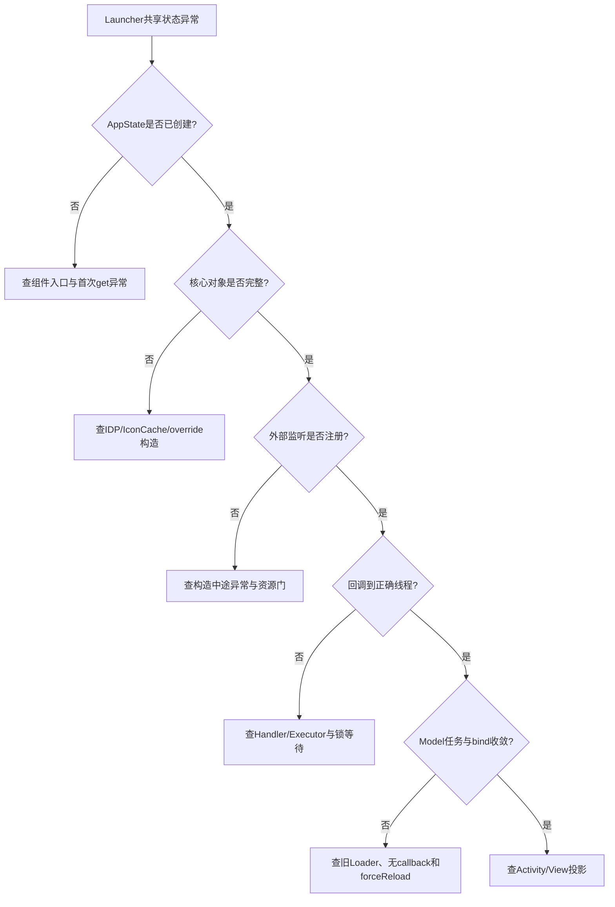

# 第502章 Android LauncherAppState：主线程单例、对象装配、监听注册、配置变化和进程生命周期链

> 源码基线：Android 11 / API 30 / `android-11.0.0_r48`。本章只在macOS复读本地源码，不编译。核心文件是`packages/apps/Launcher3/src/com/android/launcher3/LauncherAppState.java`，并交叉阅读`MainThreadInitializedObject`、`InvariantDeviceProfile`、`IconCache`、`UserCache`、`InstallSessionHelper`与`FeatureFlags`。

## 1. 本章解决什么问题

`LauncherAppState`为什么看起来像Application却不是Application？它创建了哪些长寿命对象，又注册了哪些回调？网格或图标形状变化后谁清缓存、谁重载Model？Activity销毁时这些对象是否销毁？理解这些问题，才能避免把进程单例、Activity和后台Model三个生命周期混成一团。

## 2. 一句话定位LauncherAppState

它是Launcher主进程内按需创建、强制在主线程构造的对象装配器：拥有IDP、图标/Widget缓存、LauncherModel和PredictionModel，并把包、用户、时间、安装会话、DeviceConfig、Widget插件和通知点设置接入Model。

## 3. 它不是业务库存本身

AppState持有库存对象，却不直接保存workspace items或all apps列表。真实内存库存主要在LauncherModel的BgDataModel与AllAppsList，数据库则由LauncherProvider访问。

## 4. 对象所有权总图



图里AppState是连接点，不是所有对象的唯一创建者：IDP、UserCache、InstallSessionHelper和CustomWidgetManager各自还有MainThreadInitializedObject单例。

## 5. 建议的源码阅读顺序

先读`LauncherAppState.java`两个构造器，再读`MainThreadInitializedObject.get()`；接着逐个进入IDP、IconCache、WidgetPreviewLoader、LauncherModel、PredictionModel；最后按注册顺序读UserCache、InstallSessionTracker、SecureSettingsObserver和onTerminate。

## 6. INSTANCE保存的是什么

源码声明：

```java
public static final MainThreadInitializedObject<LauncherAppState> INSTANCE =
        new MainThreadInitializedObject<>(LauncherAppState::new);
```

静态字段保存的是延迟初始化容器，真正LauncherAppState直到第一次`get(context)`才出现。

## 7. LauncherAppState仍是普通Java类

它没有extends Application、Service或ContentProvider，也没有Android组件生命周期回调。它的存活来自静态容器强引用，而不是AMS单独管理的组件记录。

## 8. getInstance允许创建

`getInstance(context)`调用`INSTANCE.get(context)`，在值为空时触发构造。调用它是有副作用的：可能创建数据库缓存对象、跨Binder注册回调并创建ContentObserver。

## 9. getInstanceNoCreate只观察

它返回`INSTANCE.getNoCreate()`，值尚不存在时得到null。LauncherProvider.dump和外部写入后的reload检查使用它，避免仅为诊断或通知就启动整套Launcher模型。

## 10. 生产代码没有显式reset

容器只有测试用`initializeForTesting(value)`，没有正常运行时clear。单例一旦创建，通常跟随进程直到死亡。

## 11. PreviewContext是隔离分支

若context是LauncherPreviewRenderer的PreviewContext，容器把对象保存在预览上下文自己的表里，不复用生产全局值。预览生成不能污染桌面真实IconCache与Model。

## 12. 构造必须发生在主线程

MainThreadInitializedObject在main looper直接调用provider；LauncherAppState基础构造器又执行`Preconditions.assertUIThread()`，形成双重约束。

## 13. 后台第一次调用会同步等待

非主线程调用get时向MAIN_EXECUTOR提交`get(context)`并调用Future.get。后台调用者会阻塞，直到主线程完成全部构造与监听注册。

## 14. InterruptedException被包装

等待被中断或主线程构造抛错时，工具统一抛RuntimeException。它不恢复线程interrupt标志，也不提供部分构造回滚协议，调用方会看到同步失败。

## 15. mValue没有volatile但依赖线程合同

读写设计集中在主线程，后台首次get通过Executor/Future建立同步关系；`getNoCreate()`本身没有线程断言或同步。把它从任意线程当作通用并发单例API并不稳妥。

## 16. 两个构造器分成对象与接线两阶段

`LauncherAppState(Context,String)`创建核心对象；`LauncherAppState(Context)`先调用它，再注册所有外部监听。测试可以传null或临时icon DB名，只构造同一套核心对象。

## 17. 基础对象必须先完整建立

监听回调可能随注册立即或很快到达，因此公开构造器开始注册前，mModel、mIconCache、mInvariantDeviceProfile等final字段已经完成赋值。

## 18. 默认Icon数据库名来自LauncherFiles

公开构造器传`LauncherFiles.APP_ICONS_DB`，让IconCache使用持久化图标数据库。这个库与favorites数据库、Widget preview数据库不是一个文件。

## 19. Context被长期保存

MainThreadInitializedObject传入applicationContext，AppState再保存为mContext。这样不会泄漏Launcher Activity，但也意味着资源读取反映应用Context当前Configuration，而不是某个窗口的ContextTheme。

## 20. 第一个依赖是InvariantDeviceProfile

IDP提供网格、图标大小、density、数据库文件名与横竖屏DeviceProfile候选。图标缓存需要它的`fillResIconDpi`和`iconBitmapSize`，所以必须先创建。

## 21. IDP本身也是主线程单例

`InvariantDeviceProfile.INSTANCE.get(context)`可能在AppState构造内触发另一层延迟创建。单例嵌套不代表循环依赖；要看构造器是否反向请求尚未完成的AppState。

## 22. IconCache绑定MODEL_EXECUTOR

构造器把MODEL_EXECUTOR looper交给BaseIconCache，同时启用内存缓存。图标对象可从多线程请求，但持久化更新和批量加载主要受Model线程与内部同步约束。

## 23. IconCache继续装配四个策略对象

它取得LauncherApps、UserCache、InstantAppResolver和IconProvider，并创建不同CachingLogic。图标并非简单的PackageManager.loadIcon包装。

## 24. WidgetPreviewLoader依赖IconCache

Widget预览要读取应用图标与user badge，因此在IconCache之后创建。它自己维护`widgetpreviews.db`和bitmap复用集合。

## 25. LauncherModel取得AppState反向引用

`new LauncherModel(this,mIconCache,AppFilter.newInstance(context))`把AppState交给Model，用于访问Context、缓存和配置。此时AppState构造尚未返回，但Model构造器只保存引用并建立库存，没有立即启动Loader。

## 26. 核心对象构造时序

调用者先进入MainThreadInitializedObject；容器把创建工作转到主线程，然后AppState依次创建IDP、IconCache、WidgetPreviewLoader、LauncherModel和PredictionModel，最后才注册外部监听。只有整个构造器正常返回，容器才把对象写入mValue；中途异常不会把一个公开可取的半成品写进容器。

## 27. 依赖对象仍可能留下部分外部副作用

虽然mValue不会保存半成品，但异常若发生在后半段，前面已经注册的LauncherApps callback或广播可能没有统一catch/finally回滚。构造原子性与外部接线原子性不是同一件事。

## 28. PredictionModel也是资源可替换对象

`PredictionModel.newInstance()`先按`prediction_model_class`资源创建实现，再调用init保存device prefs和UserCache。产品可替换预测实现，不应只读AOSP基类就断言最终算法。

## 29. AppFilter也来自资源override

AOSP默认`shouldShowApp()`返回true，但`app_filter_class`可指向派生过滤器。AllApps缺少某应用时，要先确认产品过滤器而不是直接怀疑PackageManager。

## 30. 公开构造器先创建广播接收器对象

`SimpleBroadcastReceiver(mModel::onBroadcastIntent)`只包装Consumer；真正register发生在后面。对象存在不表示广播已经接线。

## 31. LauncherApps.Callback注册在当前主线程

AppState调用`LauncherApps.registerCallback(mModel)`且不传Handler。Framework实现会`new Handler()`，因此使用调用线程Looper；本构造器被约束在主线程，包变化callback最终投到主Looper。

## 32. Binder入站与Model callback已分线程

system_server先跨Binder通知LauncherApps内部Stub，再由CallbackMessageHandler切到主线程调用LauncherModel。Model随后把PackageUpdatedTask排到MODEL_EXECUTOR，View更新又回主线程。

## 33. locale广播触发全量reload

Locale变化会影响所有应用标题与排序，Model.onBroadcastIntent调用forceReload，而不是逐个修改现有BubbleTextView。

## 34. Managed profile广播更细粒度

available/unavailable创建用户可用性PackageUpdatedTask；unavailable/unlocked还创建UserLockStateChangedTask。一个广播可能排两个任务。

## 35. Studio专用force reload不是产品常规入口

只有`FeatureFlags.IS_STUDIO_BUILD`才注册`ACTION_FORCE_ROLOAD`。本地类有这个字符串，不证明AOSP产品会接受该广播。

## 36. 动态日历与时钟走IconProvider Receiver

IconProvider读取资源里的calendar/clock Component；两者都为空时返回空SafeCloseable，不注册Receiver。动态图标能力取决于产品资源。

## 37. 图标时间广播在MODEL_EXECUTOR处理

AppState把`MODEL_EXECUTOR.getHandler()`传给registerIconChangeListener，所以Receiver不在主线程执行；它调用Model.onAppIconChanged，再查询pinned shortcut并排更新任务。

## 38. 时区变化可同时更新Clock与Calendar

TIMEZONE_CHANGED先通知clock package，随后仍遍历calendar；DATE_CHANGED/TIME_CHANGED主要更新calendar。不能把一次广播等同于一个package更新。

## 39. Calendar更新遍历所有UserProfile

Receiver从UserCache取得profiles，为每个用户调用callback。动态日历图标不是只更新当前Process.myUserHandle。

## 40. APP_SEARCH_IMPROVEMENTS是DeviceFlag变体

FeatureFlags把它声明为`DeviceFlag`，但同包类由构建变体选择：普通Launcher编入`src_ui_overrides`版本，它只继承DebugFlag；Quickstep编入`quickstep/src`版本，后者监听`DeviceConfig[launcher]`。

## 41. 同一行接线在不同构建里效果不同

AppState无条件调用`APP_SEARCH_IMPROVEMENTS.addChangeListener`；普通DeviceFlag继承BooleanFlag的空实现，Quickstep DeviceFlag则保存Runnable并在mainExecutor回调变化。准确行为必须结合最终模块编入的同名类。

## 42. DeviceFlag没有removeChangeListener API

LauncherAppState源码TODO要求terminate时移除，但BooleanFlag/DeviceFlag只暴露add。当前r48无法从AppState成对注销这条Runnable。

## 43. DeviceConfig变化在主Executor分发

DeviceFlag注册时传`context.getMainExecutor()`，回调重读值并遍历listeners。随后Model.forceReload会停止旧Loader并在有callback时重启。

## 44. CustomWidgetManager也是主线程单例

第一次get会构造Manager并向PluginManager注册CustomWidgetPlugin listener；AppState随后用`setWidgetRefreshCallback`把插件变化桥接到Model。

## 45. Widget回调字段是单槽而非列表

后一次set会覆盖前一次。onTerminate设null并不是“移除某个listener”，而是清空唯一Consumer；CustomWidgetManager仍可继续持有插件listener。

## 46. 早到插件存在空回调风险

CustomWidgetManager构造时先addPluginListener，AppState要等`INSTANCE.get()`返回后才set callback；`onPluginConnected()`直接调用`mWidgetRefreshCallback.accept(null)`且无null检查。若PluginManager同步回放已连接插件，静态代码存在时序风险，是否可触发需结合PluginManager行为验证。

## 47. UserCache按首个listener启用缓存

`addUserChangeListener`发现列表为空时才注册profile added/removed广播，并构建serial↔UserHandle双向缓存。AppState持有返回的SafeCloseable。

## 48. 最后一个UserCache listener关闭时注销

remove后列表为空才unregisterReceiver并把两张cache置null。之后查询退回UserManager实时Binder调用。

## 49. UserCache回调在锁外还是锁内

`onUsersChanged()`先调用同步方法重建缓存，然后直接`mUserChangeListeners.forEach`；forEach本身没有包在显式synchronized块中。若listener同时增删，需按主线程调用约束继续判断，类没有复制快照。

## 50. AppState的用户回调只做forceReload

UserCache关注profile新增/移除；LauncherModel自己的广播又处理available/unavailable/unlocked。两条用户事件覆盖面不同，不能删掉其中一条当重复接线。

## 51. IDP change listener没有保存句柄

AppState用`mInvariantDeviceProfile.addOnChangeListener(this::onIdpChanged)`注册方法引用，却没有字段保存这个listener，也未在onTerminate remove。

## 52. 方法引用不是随时可重建的注销token

以后再次写`this::onIdpChanged`不保证与原listener对象引用相同。可靠注销应保存同一个listener实例；r48当前没有这样做。

## 53. verifyConfigChanged通过无参Handler post

构造器已断言主线程，因此`new Handler()`绑定main looper。post的Runnable再检查主题图标mask与grid变化，AppState返回时它可能尚未执行。

## 54. 安装会话回调明确投MODEL_EXECUTOR

AppState调用`registerInstallTracker(mModel, MODEL_EXECUTOR)`；Android Q及以上路径使用LauncherApps的PackageInstaller session callback与Executor，避免直接在主线程处理进度库存。

## 55. Android 11不会走旧PackageInstaller Handler分支

`Build.VERSION.SDK_INT < Q`才向PackageInstaller直接注册Handler；r48运行平台为R，正常走LauncherApps executor分支。保留旧代码不表示两条同时执行。

## 56. InstallSessionTracker维护sessionId映射

完成事件已无法再取SessionInfo，因此Tracker先在created/badging时缓存sessionId→PackageUserKey；finished时用缓存生成INSTALLED/FAILED状态。

## 57. Tracker缓存是惰性初始化

第一次需要时从InstallSessionHelper active sessions填充SparseArray。注册完成不表示所有active session已经立即复制。

## 58. 通知点先看资源总门

`R.bool.notification_dots_enabled=false`时observer字段直接为null；即使Settings.Secure.NOTIFICATION_BADGING为1，也不会建立通知点设置监听。

## 59. SecureSettingsObserver使用构造线程Handler

其父ContentObserver接收`new Handler()`；AppState在主线程构造，所以Settings变化回主Looper调用listener。

## 60. register之后手动dispatch当前值

ContentObserver注册不会自动回放已有值，因此AppState显式`dispatchOnChange()`。这保证首次构造能根据当前设置请求NotificationListener rebind。

## 61. 外部事实汇流图



这张图说明AppState不是统一把一切放主线程；它按事件成本选择main或MODEL_EXECUTOR，最终Model任务再收敛。

## 62. 设置变false时AppState不主动requestUnbind

`onNotificationSettingsChanged`只有true分支requestRebind；false分支为空。关闭通知访问后的解绑由系统通知监听授权机制处理，本类不做对称调用。

## 63. requestRebind也不是连接完成

它只是向NotificationListenerService框架请求重新绑定，真正onListenerConnected与通知点库存初始化在后续异步回调。

## 64. onIdpChanged先检查changeFlags

0直接return，既不刷新缓存也不reload。IDP仍可能重新创建ConfigMonitor，但消费者不会做无意义工作。

## 65. 图标参数变化先清LauncherIcons池

池里的BaseIconFactory带旧尺寸/mask相关状态，继续复用会产生尺寸不一致，因此先`LauncherIcons.clearPool()`。

## 66. IconCache原地更新尺寸参数

`updateIconParams(fillResIconDpi,iconBitmapSize)`调整缓存配置并处理持久化/内存失效。AppState没有直接new一个IconCache替换旧引用。

## 67. WidgetPreviewLoader.refresh只清数据库

r48实现是`mDb.clear()`，没有同步取消所有正在执行的PreviewLoadTask，也没有重建Loader对象。旧任务完成后的写入时序值得单独审计。

## 68. 任意非零IDP变化都会forceReload

只有图标参数变化才额外清图标/Widget preview，但纯grid变化也会走`mModel.forceReload()`，因为workspace放置、span和数据库文件可能变化。

## 69. forceReload有callback才立刻启动

Model先stop旧Loader并把mModelLoaded=false；若Launcher Activity callback存在就startLoader，否则等下一次Activity加入callback再加载。

## 70. 配置变化不是一次原子换世界

IDP先原地重算字段，再通知listeners；AppState随后更新cache并触发Model；Launcher Activity自己的IDP listener又重建DeviceProfile与View布局。各消费者依次执行，不是单个事务。

## 71. IDP按注册顺序遍历原列表

`for (OnIDPChangeListener listener : mChangeListeners)`没有复制快照。listener内同步增删同一ArrayList可能触发遍历问题；正常路径依赖主线程与listener行为克制。

## 72. AppState与Launcher都监听IDP

AppState负责共享缓存和Model；Launcher Activity负责当前窗口DeviceProfile、Controller/View重应用。只保留一方会漏掉另一层收口。

## 73. ConfigMonitor会先注销再重建

IDP.apply先`mConfigMonitor.unregister()`，再new ConfigMonitor，然后通知listeners。监听窗口短暂切换，但消费者收到的是新IDP字段。

## 74. iconShape变化还会重新初始化IconShape

onConfigChanged比较旧新path；不同就`IconShape.init(context)`，同时设置CHANGE_FLAG_ICON_PARAMS。AppState再清Factory池，形成上游形状与下游缓存两段更新。

## 75. AppState拥有五个可关闭句柄

ModelChangeReceiver、LauncherApps callback、InstallSessionTracker、CalendarChangeTracker、UserChangeListener与NotificationDotsObserver构成主要注销清单；其中Receiver和LauncherApps没有SafeCloseable字段，但onTerminate显式处理。

## 76. onTerminate先注销普通广播

只有mModelChangeReceiver非null才unregister。构造中途失败而对象未公开时，这个方法通常也没有调用机会。

## 77. LauncherApps callback按对象身份注销

传回同一个mModel实例。Framework内部列表以`==`查找callback，因此必须是原对象，不能new一个等价Model。

## 78. InstallSessionTracker.unregister反向选择同一路径

Android R走LauncherApps.unregisterPackageInstallerSessionCallback，使用原Tracker对象；active session本地Map随对象失去引用回收。

## 79. Calendar SafeCloseable持有原Receiver

IconProvider返回lambda调用`context.unregisterReceiver(receiver)`，确保使用注册时同一Receiver身份。

## 80. UserCache SafeCloseable持有原Runnable

返回lambda闭包调用removeUserChangeListener(command)。它既处理listener列表，也在最后一个listener离开时关闭广播与缓存。

## 81. CustomWidget只清callback不销毁Manager

onTerminate调用`setWidgetRefreshCallback(null)`，没有调用CustomWidgetManager.onDestroy。因此插件listener仍注册，后续插件connected直接accept可能因null产生NPE；真实设备又通常不调用onTerminate，这条更多是测试/特殊环境边界。

## 82. Notification observer显式unregister

只有资源门开启并成功构造observer时字段非null。关闭资源的产品不需要注销不存在的observer。

## 83. IDP listener没有在onTerminate清理

源码onTerminate没有`removeOnChangeListener`。由于AppState与IDP同为进程单例，正常进程寿命内不会形成多代AppState；测试替换单例或显式terminate场景则可能保留旧引用。

## 84. FeatureFlag listener同样留存

源码TODO和缺失remove API共同证明它未成对清理。不能在文档里写成“onTerminate注销全部监听”。

## 85. IconCache和WidgetPreview DB没有close

onTerminate不显式close两类SQLite helper。真实Android进程终止会统一释放资源；若测试在同进程反复初始化，需要单独的测试清理机制。

## 86. 为什么这些缺口在生产中常不爆发

因为AppState设计为每进程唯一、进程死亡即整体清空，正常不会在同进程创建第二代对象。生命周期缺口仍影响测试、预览、热替换与异常恢复，不能说完全无害。

## 87. Application.onTerminate在设备上不保证调用

注释已经明确。Android通常直接杀进程，不给Java单例逐个执行析构；onTerminate更多用于模拟环境或显式测试调用。

## 88. Launcher Activity onDestroy不会销毁AppState

Activity只移除自身Model callback、IDP listener和UI资源。旋转/重建后新Activity复用同一个AppState、IconCache和已加载Model，这是快速重绑定的基础。

## 89. Activity callback与进程listener要分账

Model的Callbacks列表属于页面接收者；LauncherApps、安装session与UserCache监听属于进程事实源。前者随Activity增删，后者随AppState存活。

## 90. 没有Activity时Model仍可接收更新

包变化会入Model任务并更新库存；forceReload若无callback只标记未加载，下一次Launcher出现再全量加载。具体任务是否执行取决于每个ModelUpdateTask路径。

## 91. Context不会跟随Activity主题变化

AppState保存applicationContext，主题/窗口相关对象应留在Launcher Activity。若把View或Theme Context塞进AppState，很容易跨重建泄漏。

## 92. UserCache也是跨多个消费者共享

IconCache、PredictionModel和AppState都取同一UserCache INSTANCE。AppState关闭自己的listener不会销毁其他消费者仍使用的UserCache。

## 93. 静态单例只在当前进程唯一

Wallpaper chooser独立进程会有另一套静态字段；若它调用这些类，也会创建自己的INSTANCE。Android包级单例不等于跨进程单例。

## 94. PreviewContext又形成进程内隔离实例

即便同进程，预览对象表也可产生独立AppState依赖图。诊断内存对象数量时要把preview路径考虑进去。

## 95. 三个数据库不要混淆

IconCache使用app icons DB，WidgetPreviewLoader使用widget preview DB，LauncherProvider使用IDP选定的favorites DB。清一个缓存不会自动清另外两个。

## 96. AppState不拥有favorites DatabaseHelper

DatabaseHelper在LauncherProvider里惰性创建；AppState只有LauncherModel通过ContentResolver/Loader间接访问。它的onTerminate也不会close Provider helper。

## 97. getInstanceNoCreate适合无副作用诊断

Provider.dump先检查AppState是否存在且Model已加载；若没有直接return。一次dumpsys不应为了打印空状态而把Launcher整套监听全部启动。

## 98. 外部Provider写入也避免强制创建

外部进程修改favorites后，LauncherProvider只在AppState已经存在时forceReload；Launcher尚未运行时数据库已经保存，未来首次Loader自然读取。

## 99. 日志“LauncherAppState initiated”只证明开始构造

Log写在基础构造器开头。若后续IconCache或监听注册抛错，仍能看到该日志；它不是构造成功标记。

## 100. 更可靠的成功证据

组合看Launcher onCreate取得实例、Model callback注册、startLoader、LoaderTask和bind日志；必要时dump已加载Model。单一init日志证据太弱。

## 101. 首次get延迟可能落在Launcher首帧关键路径

IDP、IconCache和多个Binder注册都在Launcher.onCreate同步触发。冷启动性能分析应把这段与View inflate、LoaderTask分开计时。

## 102. TraceHelper.allowIpcs承认构造会有IPC

MainThreadInitializedObject在创建时包`TraceHelper.allowIpcs("main.thread.object",...)`，说明主线程构造可能访问系统服务。它是trace/严格策略标注，不会把IPC自动移到后台。

## 103. 构造重入要检查依赖反向get

若某个依赖构造器同步调用LauncherAppState.getInstance，mValue仍为null，可能再次构造。当前核心构造链未见直接同步反向get；PredictionModel只在以后缓存任务里请求AppState。

## 104. 典型故障树



## 105. 排查卡死先找后台get主线程等待

如果后台线程堆栈停在Future.get，同时主线程等待该后台锁或结果，就要检查首次INSTANCE.get调用位置。MainThreadInitializedObject不会检测死锁。

## 106. DeviceConfig变化不是后台回调

DeviceFlag明确使用mainExecutor，再运行Model.forceReload。若reload前有重计算或Binder慢操作，会占主线程；真正Loader读取才转MODEL_EXECUTOR。

## 107. 动态图标广播不是主线程回调

AppState显式传MODEL_EXECUTOR Handler。不要看到BroadcastReceiver就默认onReceive一定在主Looper；Context.registerReceiver的scheduler决定线程。

## 108. LauncherApps callback默认主线程是构造时推导

registerCallback未传Handler时new Handler绑定当前Looper；因为AppState构造受主线程断言，所以此处是主线程。若未来移除断言或改用显式Handler，结论也会变化。

## 109. Listener顺序可能影响观察到的中间态

IDP先通知AppState还是Launcher取决于注册顺序；AppState通常更早注册，但新Activity的listener后来加入。消费者应根据changeFlags和当前IDP计算，不依赖另一个listener已经完成。

## 110. 本章测试覆盖边界

全测试树只有少量文件直接调用LauncherAppState，多数为Model测试的基础设施，没有独立覆盖构造中途失败、onTerminate缺口、DeviceFlag listener移除、CustomWidget早到callback与PreviewContext多实例矩阵。

## 111. 一张实用审计表

对每个AppState字段记录：创建线程、是否资源override、是否跨Binder、谁读取、谁更新、是否有close token、Activity重建是否复用、独立进程是否另建。这比背字段名更能定位问题。

## 112. macOS只读练习一：画对象所有权树

从LauncherAppState两个构造器出发，画IDP、IconCache、WidgetPreviewLoader、LauncherModel、PredictionModel以及它们二级依赖；标出“AppState new”“其他INSTANCE.get”和“资源override”三种创建方式。

## 113. macOS只读练习二：制作监听注册注销表

逐项列LauncherApps、广播、IconProvider、DeviceFlag、CustomWidget、UserCache、IDP、InstallSession与通知设置的注册线程、回调线程、注销代码和缺口，不修改源码。

## 114. macOS只读练习三：推演IDP图标变化

从IDP.onConfigChanged比较旧新profile开始，追IconShape.init、apply、AppState.onIdpChanged、LauncherIcons池、IconCache参数、Widget preview DB、Model.forceReload与Launcher View重应用。

## 115. macOS只读练习四：推演构造失败

假设异常分别发生在IconCache创建、LauncherApps.registerCallback和Notification observer注册处，写出INSTANCE是否赋值、哪些外部副作用已发生、谁能回滚以及进程重启为何能最终清理；不运行编译。

## 116. 易错理解一：主线程单例就是无锁线程安全单例

不准确。它依赖所有构造集中到主Looper；后台get会同步等待，getNoCreate又没有强制线程检查。应按线程合同使用，而不是把它当通用并发容器。

## 117. 易错理解二：onTerminate会清理所有资源

不准确。真实设备不保证调用；IDP与DeviceFlag listener未移除，CustomWidgetManager也未销毁，Icon/Widget数据库没有显式close。

## 118. 易错理解三：配置变化只需刷新View

不准确。图标mask/尺寸影响Factory池、IconCache与Widget预览，grid影响Model和数据库布局；Activity View只是最后投影层。

## 119. 易错理解四：所有系统回调都在主线程

不准确。LauncherApps、SecureSettings和DeviceFlag在本接线中落主线程；动态图标与安装session明确使用MODEL_EXECUTOR。必须逐个看Handler/Executor。

## 120. 本章结论与下一章

LauncherAppState的核心价值是把长寿命共享对象和多源事件接成一个Model更新入口；它的代价是首次主线程构造较重、监听生命周期依赖进程单例假设。第503章继续进入LauncherProvider的favorites数据库、默认布局与惰性初始化。
