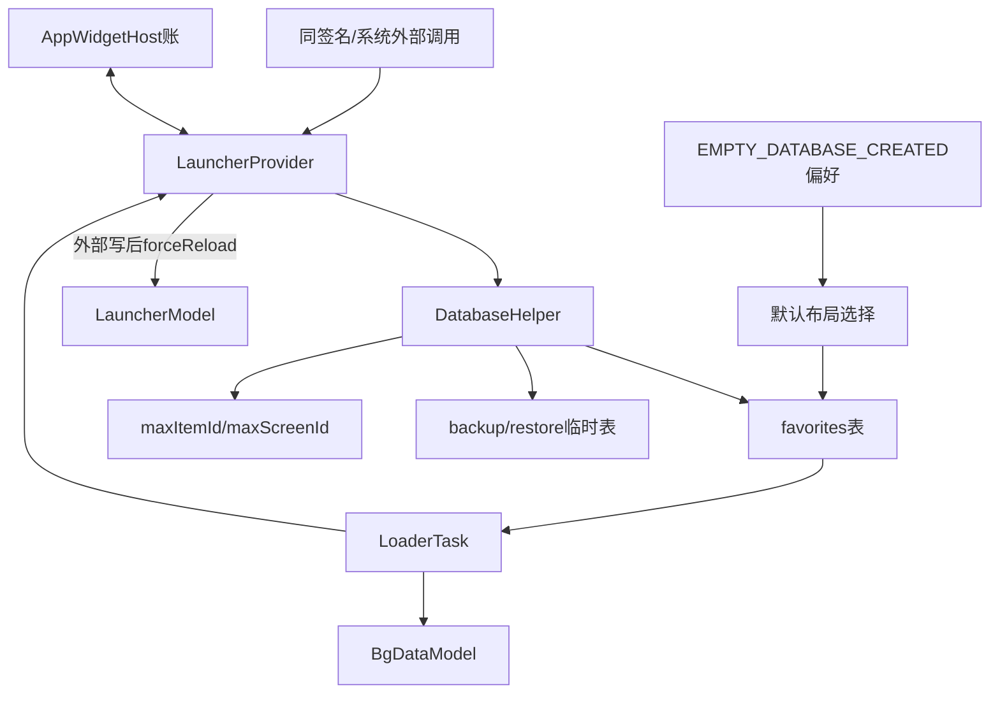
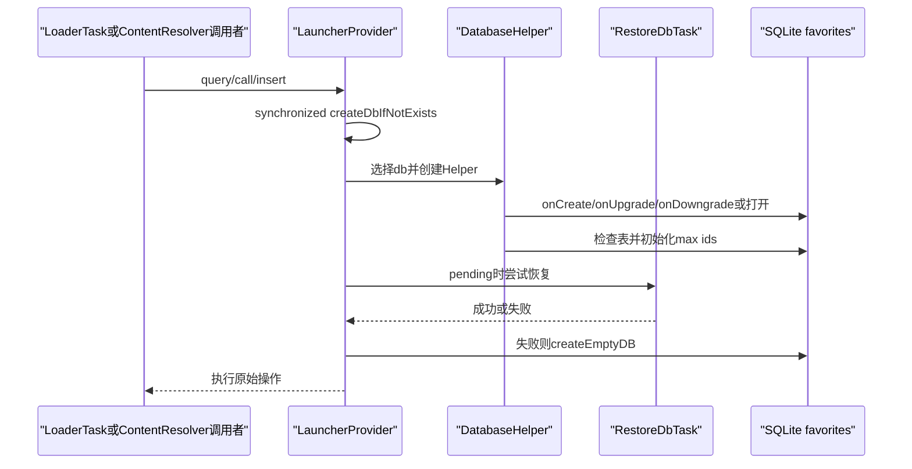
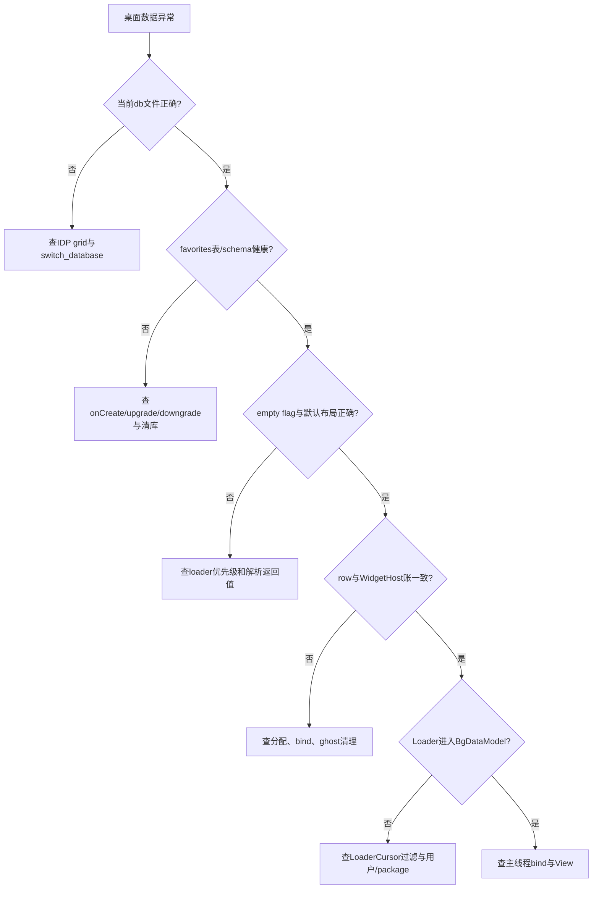

# 第503章 Android LauncherProvider：Favorites数据库、惰性初始化、默认布局、恢复迁移和外部写入链

> 源码基线：Android 11 / API 30 / `android-11.0.0_r48`。本章只在macOS复读本地源码，不编译。核心文件是`packages/apps/Launcher3/src/com/android/launcher3/LauncherProvider.java`、`LauncherSettings.java`、`model/LoaderTask.java`及默认布局解析器。

## 1. 本章解决什么问题

桌面图标究竟保存在哪张表？Provider创建时为什么数据库还可能不存在？新用户默认桌面从哪个XML来？恢复、升级或网格迁移失败为何会清空数据库？外部进程写库后Launcher怎样刷新？本章把“进程入口Provider”和“数据Provider”两种职责拆开。

## 2. 一句话定位

LauncherProvider既是主进程一次性初始化入口，也是favorites数据库的ContentProvider门面；它惰性创建DatabaseHelper，用空库标志驱动默认布局，在写操作中维护ID/备份账，并在外部写入后通知已存在的LauncherModel强制重载。

## 3. 先分五份账

五份账是：SQLite favorites表、SharedPreferences空库标志、AppWidgetHost分配的widgetId、DatabaseHelper内存max item/screen id、LauncherModel内存库存。它们会互相影响，但不是一个事务里的同一份状态。

## 4. 数据链总图



图中favorites表是持久化事实，BgDataModel是一次加载后的内存投影；修改一边不会神奇地同步另一边。

## 5. 主要源码入口

先读LauncherProvider的onCreate/createDbIfNotExists/query/insert/bulkInsert/applyBatch/delete/update/call，再读内部DatabaseHelper的onCreate/onUpgrade/onDowngrade/createEmptyDB，最后回LoaderTask.loadWorkspace看调用顺序。

## 6. Provider的两个职责不要混写

`onCreate()`只调用MainProcessInitializer；首次query或写操作才调用createDbIfNotExists。进程初始化完成不等于SQLiteOpenHelper创建，更不等于默认布局加载。

## 7. 数据库schema版本是28

`SCHEMA_VERSION=28`只描述Launcher favorites库，不是Android API level，也不是应用版本号。升级逻辑用它决定SQLite迁移。

## 8. authority来自最终applicationId

`LauncherProvider.AUTHORITY=BuildConfig.APPLICATION_ID+".settings"`。普通AOSP通常是`com.android.launcher3.settings`，派生包改applicationId后authority一起变化。

## 9. Provider在Manifest中可导出

common Manifest写`exported=true`，但读写分别受`${packageName}.permission.READ_SETTINGS/WRITE_SETTINGS`保护，protectionLevel为signatureOrSystem。可导出不等于任意App能写。

## 10. Content URI只表达表和可选行

Favorites.CONTENT_URI形如`content://authority/favorites`；`getContentUri(id)`再追加行ID。SqlArguments把URI路径转成table与where。

## 11. 核心表名就是favorites

应用、普通快捷方式、文件夹、Widget和Deep Shortcut都存在同一张表，通过itemType区分。它不是“一种item一张表”的设计。

## 12. container表达父级或特殊区域

桌面是-100、Hotseat是-101；文件夹child的container则是Folder row的_id。screen/cellX/cellY必须结合container解释。

## 13. screen在不同container下含义不同

桌面item的screen是页面ID；Hotseat通常把screen/rank映射到槽位；文件夹内容还使用rank。不能统一翻译成“第几屏”。

## 14. profileId保存用户序列号

表里不是直接存UserHandle对象，而是UserManager serial number。UserCache负责serial↔UserHandle转换，用户删除后旧serial item需在Loader清理。

## 15. modified是墙钟时间

Provider写操作调用`System.currentTimeMillis()`。它适合数据同步/新旧比较，不适合计算不受改时间影响的timeout。

## 16. restored与options是独立状态位

restored描述备份恢复/Promise状态，options承载item附加标志。看到row存在不能直接当成可立即启动的已安装应用。

## 17. Provider onCreate不碰mOpenHelper

字段初始为null，onCreate只做：

```java
public boolean onCreate() {
    MainProcessInitializer.initialize(getContext().getApplicationContext());
    return true;
}
```

因此冷启动日志“Provider创建”不能证明库文件健康。

## 18. createDbIfNotExists是同步惰性门

方法使用`synchronized`，只在mOpenHelper为空时创建Helper并处理pending restore。同一Provider实例的并发首次访问不会创建两份Helper。

## 19. 数据库名可能随网格变化

MULTI_DB_GRID_MIRATION_ALGO开启时默认用IDP.dbFile，否则固定LauncherFiles.LAUNCHER_DB。读取文件名必须先确认feature和当前grid。

## 20. Helper创建后主动检查favorites表

注释承认SQLite table creation有时静默失败；若`tableExists`为false，就再次`addFavoritesTable(...,true)`。这是崩溃循环恢复兜底。

## 21. optional table使用IF NOT EXISTS

补建路径不会无条件drop现有表。它修“表没出现”，不修列损坏、数据语义错或一半迁移。

## 22. Helper还探测备份表

普通非multi-db路径检查favorites backup，始终检查hybrid hotseat restore table，并保存boolean。后续增删会据此丢弃过期备份。

## 23. initIds从现有表恢复内存计数

若onCreate/onUpgrade没设置max id，Helper查询MAX(_id)与桌面screen。数据库打开成功不等于ID计数已初始化，createDatabaseHelper最后显式补齐。

## 24. 首次访问还可能执行RestoreDbTask

RestoreDbTask.isPending为true时，Helper创建后先performRestore；返回false就createEmptyDB。无论成功失败，pending标志都会清掉，避免每次访问无限重试。

## 25. 恢复失败会进入空库流程

createEmptyDB重新建表并写EMPTY_DATABASE_CREATED，随后LoaderTask调用load default favorites。用户最终看到默认桌面，不代表备份恢复成功。

## 26. 首次数据库访问时序



## 27. query使用WritableDatabase

即使只读查询，代码也取得`getWritableDatabase()`，确保升级/创建路径可执行；存储只读或升级失败时，普通query也可能失败。

## 28. Cursor登记notification URI

`result.setNotificationUri`让观察者知道该Cursor对应URI，但Provider本身写路径没有调用ContentResolver.notifyChange。不能仅凭setNotificationUri断言写后观察者必被通知。

## 29. dump不会为了输出而建库

dump使用LauncherAppState.getInstanceNoCreate并要求Model已加载，否则直接return。它打印Model而非原始SQLite表，也不会触发createDbIfNotExists。

## 30. dbInsertAndCheck要求调用方提供_id

values为null或缺_id就抛RuntimeException。内部ModelWriter通常先通过call生成ID；外部insert则由initializeExternalAdd覆盖生成。

## 31. checkId同步抬高max值

插入自带较大_id时，Helper把mMaxItemId更新到最大；桌面container的screen也更新mMaxScreenId，避免后续生成冲突。

## 32. 外部与本进程用PID区分

`Binder.getCallingPid()!=Process.myPid()`就走外部初始化和reload。它不是按包名判断，也不是单看UID；同UID不同进程仍被视为外部。

## 33. Manifest权限先于Provider业务门

ContentProvider框架先检查read/writePermission；进入insert后才判断PID。业务代码的external分支不能替代权限保护。

## 34. 外部insert总会生成新item ID

initializeExternalAdd不信任传入_id，调用generateNewItemId并put覆盖。这样外部调用方不能随意占用已有row ID。

## 35. 外部Widget可由Provider分配widgetId

若itemType是APPWIDGET且没给APPWIDGET_ID，Provider创建LauncherAppWidgetHost、allocate ID并尝试bind provider。

## 36. bind不允许时删除刚分配ID

`bindAppWidgetIdIfAllowed`为false就deleteAppWidgetId并返回false，insert最终返回null。数据库row不会写入。

## 37. Widget provider字符串无效也失败

ComponentName.unflattenFromString得到null时直接return false。数据库不会留下无provider的外部Widget占位。

## 38. RuntimeException只包Widget初始化段

allocate/bind异常被记录并return false；generateNewItemId发生在try之前，异常不会被该catch兜底。

## 39. 单行insert先写modified

Provider会改变调用方传入的ContentValues：补modified，外部还补_id/widgetId。调用者若复用同一对象要知道它已被原地修改。

## 40. SQLite insert失败返回null

dbInsertAndCheck返回负数时insert直接return null，不调用onAddOrDeleteOp，也不reload Model。

## 41. 成功增删会使备份失效

onAddOrDeleteOp若发现favorites backup或hotseat restore backup存在就drop。旧备份不再对应当前用户编辑后的布局。

## 42. 单行insert没有显式大事务

SQLite单条insert本身原子，但widgetId分配发生在数据库写之前；如果后续DB insert失败，源码没有删除已成功绑定的widgetId，可能暂时形成ghost widget账。

## 43. bulkInsert使用SQLiteTransaction

所有values逐条补modified并insert，全部成功才commit。任意一条失败return 0，try-with-resources关闭未commit事务并回滚数据库。

## 44. bulkInsert不执行external widget初始化

它没有逐项调用initializeExternalAdd，调用方必须提供合法_id/widget字段。权限允许不等于Provider替批量数据补齐合同。

## 45. applyBatch再包一层事务

每个ContentProviderOperation调用当前Provider的insert/update/delete，最后commit。内部单行方法仍会执行自己的modified、backup失效与reload逻辑。

## 46. applyBatch可能在commit前触发reload

外部batch中的insert/delete会在各自方法末尾调用forceReload，而外层SQLiteTransaction尚未commit；batch结尾又reload一次。Model可能先读到旧快照，之后再重载收敛，源码没有延迟通知到commit后的统一队列。

## 47. applyBatch的isAddOrDelete不是唯一备份门

insert结果通常用URI而非count，外层条件未必识别；但内部insert/delete已经调用onAddOrDeleteOp，所以备份仍可能被drop。阅读嵌套Provider方法要看到副作用重复。

## 48. 外部delete前先清ghost widgets

当目标表是favorites且调用PID外部，Provider在真正delete前调用removeGhostWidgets。它清的是“Host有ID但DB无row”的旧ghost，不会删除本次即将删row对应的widgetId。

## 49. update无论count是否为0都reload

源码直接调用reloadLauncherIfExternal，没有`count>0`门。一次没有命中row的外部update仍可能让Model forceReload。

## 50. update不让备份表失效

onAddOrDeleteOp只由增删触发；update修改坐标或字段时不drop备份。是否有意取决于备份语义，不能笼统说任何写都会清备份。

## 51. reload只作用于已创建AppState

getInstanceNoCreate为null时不主动启动Launcher模型。数据库已成功写入，未来Launcher首次加载自然读到新值。

## 52. forceReload不是事务回执

它只停止旧Loader、标记未加载并在有callback时启动；View何时变化还取决于MODEL_EXECUTOR与主线程bind。

## 53. call只允许同UID

`Binder.getCallingUid()!=Process.myUid()`直接return null。即使外部App持有signature read/write permission，也不能调用这些内部管理方法。

## 54. call暴露的是内部协议

包括生成item/screen ID、建空库、装默认布局、删空文件夹、清ghost widget、开事务、刷新/恢复备份、切数据库和preview迁移。

## 55. 生成ID返回Bundle而不是插入

ModelWriter先取得新ID，再组ContentValues写入。ID生成与insert是两个操作，中途失败会留下未使用的号码；ID无需连续，只需不冲突。

## 56. NEW_TRANSACTION返回Binder包装对象

SQLiteTransaction通过Bundle binder交给同UID调用方，用于跨ContentResolver调用包住多步操作。事务生命周期必须由调用方close/commit正确收口。

## 57. 恢复backup有30秒墙钟节流

`System.currentTimeMillis()-mLastRestoreTimestamp>30s`才执行。用户修改时间会影响节流判断，它不是elapsedRealtime timeout。

## 58. switch database会替换Helper

如果目标名不同，保存旧Helper、设置layout provider authority、创建新Helper、关闭旧Helper，再在AppState存在时forceReload。

## 59. 数据库切换不是原子跨对象事务

同UID调用者进入switch_database后，Provider依次读取旧Helper、更新layout provider authority、创建并赋值新Helper、关闭旧Helper，最后让LauncherModel forceReload并异步绑定新DB投影。任一步异常都没有总回滚到旧Helper的事务包装；调用者需从当前Helper与Model重新确认结果。

## 60. DatabaseHelper继承NoLocaleSQLiteHelper

它避免SQLite因Locale变化做不必要的collator配置，版本仍由SQLiteOpenHelper式回调管理。

## 61. 新库onCreate先设初始max值

mMaxItemId=1、mMaxScreenId=0，然后建favorites表，再从空表查询修正item max；非migration Helper最后写空库标志。

## 62. favorites表默认profileId来自当前用户serial

`Favorites.addTableToDb(db,getDefaultUserSerial(),...)`把profileId列默认值设为当前进程用户序列号。跨用户row仍应显式写正确serial。

## 63. 空库标志按数据库文件名分区

主Launcher DB使用原key；其他grid DB追加`@dbName`。multi-db切换时每个库独立记录是否需要装默认布局。

## 64. migration Helper故意不写空库标志

onCreate只有`!mForMigration`才onEmptyDbCreated。临时迁移/preview表不应触发生产默认桌面填充。

## 65. 默认布局只在empty flag为true时加载

表为空但flag被错误清掉时，loadDefaultFavoritesIfNecessary不会扫描行数补救。触发条件是偏好标志，不是`SELECT COUNT(*)`。

## 66. 默认布局优先级有四层

顺序是layout provider/app restriction、AutoInstallsLayout提供包、Partner系统APK、IDP内部默认XML。高优先级返回loader后不会继续合并低优先级布局。

## 67. 外部layout authority可临时覆盖Settings

mProviderAuthority非空优先；否则读Secure Settings字符串`launcher3.layout.provider`。switch database可通过extras设置该字段。

## 68. ProviderInfo不存在就回退

resolveContentProvider失败只记录错误并return null，随后尝试AutoInstalls、Partner或内部布局，不会因远程布局包缺失直接终止启动。

## 69. layout URI携带当前网格参数

path是launcher_layout，query包含version=1、gridWidth、gridHeight和hotseatSize。外部提供者可按设备网格返回不同XML。

## 70. 远程XML先完整读入内存

源码用IOUtils.toByteArray再转String，注释称这样能尽早发现IO错误；超大或恶意内容仍会带来内存成本，但Provider权限/产品配置限制来源。

## 71. AutoInstallsLayout只是解析器名字

它能解析远程/预装布局并通过LayoutParserCallback插入DB，不代表必须来自Play Store网络实时下载。

## 72. Partner布局来自系统镜像APK

Partner.get找到配置包且有default layout资源时构造DefaultLayoutParser。资源ID为0则继续回退内部布局。

## 73. 内部布局来自IDP

getDefaultLayoutParser取idp.defaultLayoutId；demo用户且demoModeLayoutId非0时换用demo布局。默认桌面与当前网格配置绑定。

## 74. 加载前总会createEmptyDB

即使已有“部分恢复”的row，只要empty flag仍true，就先清表，避免旧bug留下半恢复数据与默认项混合。

## 75. 外部布局零条时回退内部

`loadFavorites<=0 && usingExternallyProvidedLayout`会再次清库，并用内部DefaultLayoutParser加载。

## 76. 内部布局零条不会第二次回退

此时usingExternallyProvidedLayout=false，没有另一层fallback；方法仍清empty flag。内部XML解析出0项可能形成持久空桌面，All Apps仍可用。

## 77. empty flag最后用commit同步清除

`clearFlagEmptyDbCreated`调用SharedPreferences.commit而非apply。数据库加载线程会同步等待偏好落盘，减少下次重复装默认布局，但增加I/O时延。

## 78. 默认布局中的Widget会占用Host账

解析器可能allocate/bind appWidgetId；数据库事务失败与Widget服务账并非天然同事务，需要解析器自己的清理路径。

## 79. LoaderTask先做数据导入与网格迁移

loadWorkspace先ImportDataTask，再GridSizeMigrationTask；任一失败就设置clearDb并调用METHOD_CREATE_EMPTY_DB。

## 80. 清空后紧接着请求默认布局

LoaderTask无论是否刚清库都会调用METHOD_LOAD_DEFAULT_FAVORITES；Provider通过empty flag决定是否真正执行。

## 81. 最后才query favorites

默认布局填充完成后，LoaderCursor查询Content URI并把row转换进BgDataModel。数据库正确但LoaderCursor过滤/修复删除仍可能让某项不进入内存。

## 82. Provider调用发生在MODEL_EXECUTOR

LoaderTask在Model线程通过ContentResolver进入同进程Provider；ContentProvider本地调用可能同步执行数据库工作，不会自动开新Binder线程。

## 83. 外部ContentProvider调用可在Binder线程

Provider公共方法也可能被远程Binder线程并发调用。只有createDbIfNotExists/prepForMigration/loadDefaultFavorites显式synchronized，其他内存字段并非全有锁。

## 84. onUpgrade利用switch贯穿迁移

case故意没有break，让旧版本逐级执行到28；某一步返回false或抛被捕获后break，最终走createEmptyDB。

## 85. 低于12没有迁移路线

switch无匹配就落到“Destroying all old data”。注释也说明Launcher3从未支持更低版本。

## 86. 部分迁移失败选择保正确性

添加列、folder rank或screen变换失败时清空旧数据，而不是继续运行未知schema。这牺牲布局保留，避免后续Loader按新列读取时崩溃。

## 87. v25转换Shortcut异常不阻止整体升级

`convertShortcutsToLauncherActivities`内部catch SQLException只日志且无boolean返回；外层仍继续后续case。该步骤失败可能保留旧shortcut类型，但不会自动清库。

## 88. v27移除workspaceScreens表

先按screenRank查询最终顺序，构造CASE更新favorites.screen，再drop旧表。screen ID会被重映射，不应把升级前ID当永久稳定外部标识。

## 89. case28是成功终点

到28直接return；若任何前置case break，才执行底部createEmptyDB。阅读无break switch时要找到唯一成功return。

## 90. onDowngrade依赖JSON schema文件

DbDowngradeHelper.parse(downgrade_schema.json)执行可支持的逆迁移；任何异常都记录并清空数据库。

## 91. schema文件在onOpen更新

Helper打开时写当前schema描述，并处理历史一次性升级。文件缺失不等于数据库必然新建。

## 92. createEmptyDB本身有事务

drop favorites与workspaceScreens、调用onCreate重建表，全部在SQLiteTransaction中，commit后才成为新空库。

## 93. onCreate会再次写empty flag

非migration Helper通过onEmptyDbCreated同步commit true。createEmptyDB不是单纯删行，它还建立下一次默认布局加载信号。

## 94. 增删会丢弃两类backup表

普通favorites backup与hybrid hotseat restore table只要标志为存在就drop。用户新编辑后旧恢复点被视为过期。

## 95. update却不会触发这条失效逻辑

这是r48实际边界。若更新内容也破坏备份一致性，需由调用链其他步骤处理，不能从方法名想当然补上。

## 96. removeGhostWidgets以DB为有效集

查询favorites中ITEM_TYPE_APPWIDGET的widgetId，再遍历Host全部ID，删除不在有效集者。它不会检查row对应provider是否仍安装。

## 97. 删除ghost失败被忽略

deleteAppWidgetId的RuntimeException catch后继续，数据库操作不因某个ghost清理失败回滚。

## 98. item ID生成只是假定主UI线程

源码注释要求generateNewItemId主要从主线程调用，但Provider外部insert可在Binder线程调用它；方法本身未synchronized。

## 99. 并发外部insert存在ID竞争风险

两个Binder线程同时读写mMaxItemId理论上可能取得冲突值。signature/system权限缩小调用面，却不是并发锁；是否在实际产品触发需运行压力验证。

## 100. checkId也没有独立同步

它原地更新两个int。SQLite唯一主键能拒绝重复row，但内存max账可能在竞态下落后于数据库MAX，后续需重新init或进程重启修复。

## 101. switch database也没有方法级synchronized

call协议限制同UID但同UID可多线程；若与query/write并发，mOpenHelper替换与旧Helper.close可能交错。上层通常序列化网格迁移，但Provider自身合同不强制。

## 102. Provider没有统一读写锁

SQLiteDatabase内部支持并发与事务，mOpenHelper引用、max IDs和ProviderAuthority却是额外Java状态。排查竞态不能只看SQLite锁。

## 103. 数据库commit与Model reload不是原子

单写通常先commit再forceReload，但applyBatch嵌套路径可提前reload；Model又是异步加载。用户短时看到旧布局并不一定表示DB写失败。

## 104. 本进程写为何不自动forceReload

ModelWriter通常先更新BgDataModel/View，再写Provider，因此不需要Provider反向重载；若某段本进程代码绕开ModelWriter直接写库，Provider的PID门不会帮它刷新UI。

## 105. 外部写成功也不保证View马上变化

AppState可能不存在、Launcher无callback、forceReload在队列中、Loader又可能被新代际取消。ContentResolver返回只代表Provider操作层完成。

## 106. 默认布局只发生在真正空库代际

普通用户删除桌面全部图标不会自动重新装默认布局，因为empty flag早已清除。空桌面是合法用户状态。

## 107. 故障定位先看empty flag与row数

“首次开机桌面空”要同时确认当前DB文件、EMPTY_DATABASE_CREATED@db key、favorites count、所选layout loader和loadFavorites返回值。

## 108. 再看WidgetHost与数据库是否分叉

有Widget row无host binding会显示pending/错误；有host ID无row会成为ghost。单查favorites不足以判断Widget完整性。

## 109. 最后看BgDataModel与View

DB row存在后仍要经过LoaderCursor合法性检查、用户/package状态、BgDataModel分桶与LoaderResults bind。数据库是第一层，不是最终像素。

## 110. Launcher数据库故障树



## 111. 测试覆盖边界

DefaultLayoutProviderTest只有4个测试，覆盖远程布局的Hotseat app、普通/自定义标题Folder和pending Widget；它不覆盖Provider并发外部insert、applyBatch commit前reload、switch database竞态、内部布局零项或WidgetId与DB跨账失败。

## 112. macOS只读练习一：画favorites行

选应用、文件夹child和Widget三种item，只读从LauncherSettings.Favorites列定义写出_id、itemType、container、screen、cell、span、profileId和intent/provider的含义，指出哪些列不能脱离itemType解释。

## 113. macOS只读练习二：推演首次空库

从LoaderTask的Import/Grid迁移开始，追METHOD_CREATE_EMPTY_DB、empty flag、四级默认布局、loadFavorites、清flag和最终query；为每个失败点写用户会看到的结果。

## 114. macOS只读练习三：比较三种写入

并排阅读insert、bulkInsert和applyBatch，记录事务范围、ID补齐、Widget绑定、modified、backup失效、reload时点和失败回滚，特别标出applyBatch内层副作用。

## 115. macOS只读练习四：审计数据库切换

从METHOD_SWITCH_DATABASE与两个prepForMigration方法画旧Helper、新Helper、临时表、provider authority、close和Model reload顺序；不改源码、不执行数据库或编译命令。

## 116. 易错理解一：Provider onCreate会打开数据库

不准确。它只初始化主进程；createDbIfNotExists由首次query/write/call惰性触发。

## 117. 易错理解二：favorites表就是当前屏幕

不准确。它是持久化库存，还需LoaderCursor、BgDataModel、主线程bind和View布局；Widget又有独立Host账。

## 118. 易错理解三：外部写返回就完成UI刷新

不准确。Provider写和SQLite事务完成后只请求Model forceReload；AppState、callback、Loader代际和View bind决定最终显示时间。

## 119. 易错理解四：升级失败会尽力保留半套数据

不准确。多数关键迁移失败会break并createEmptyDB，以丢布局换schema可用；个别内部catch步骤又可能继续，必须逐case阅读。

## 120. 本章结论与下一章

LauncherProvider用惰性Helper、空库标志和默认布局优先级建立桌面持久化起点，再通过Model形成内存与View投影；数据库、WidgetHost、ID计数和Model从来不是单一原子账。第504章继续精读schema迁移、备份恢复、网格切库和失败降级策略。
