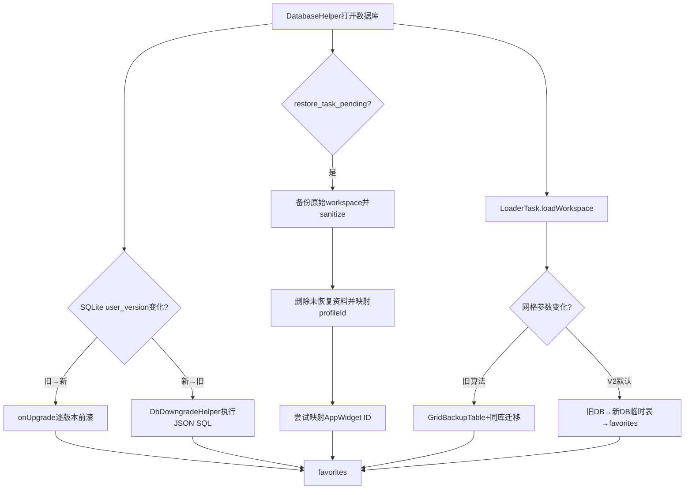
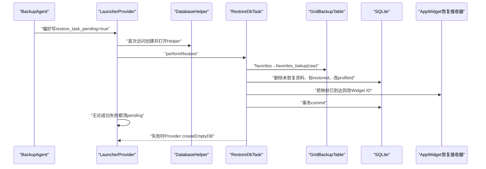
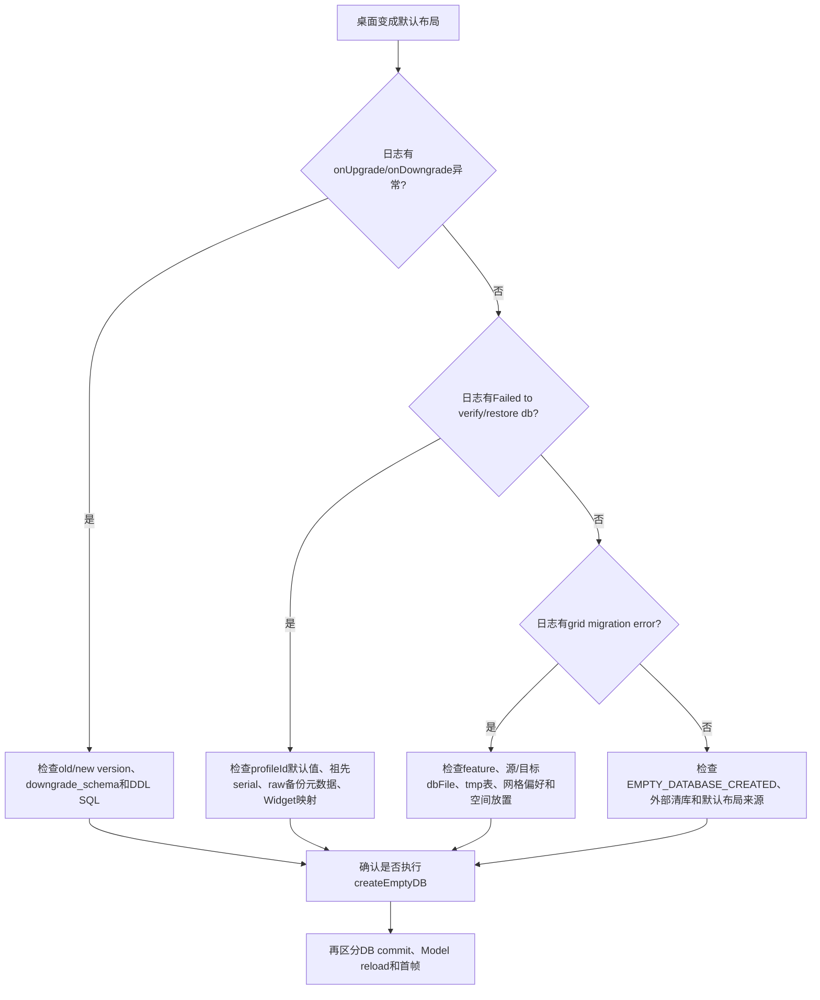

# 第504章 Android Launcher数据库：Schema升级降级、RestoreDbTask、GridBackup、网格迁移和失败恢复链

> 源码基线：Android 11 / API 30 / `android-11.0.0_r48`。本章只在macOS阅读本地源码，不执行编译。核心文件：`LauncherProvider.java`、`provider/RestoreDbTask.java`、`model/GridBackupTable.java`、`model/GridSizeMigrationTask.java`、`model/GridSizeMigrationTaskV2.java`、`model/DbDowngradeHelper.java`。

## 1. 本章解决什么问题

Launcher数据库为什么既有升级、降级，又有备份恢复和网格迁移？`favorites_bakup`为什么拼错却不能修名？换设备后用户序列号与Widget ID怎样重写？网格迁移失败后为何可能清空桌面？本章把这些“都会改数据库、但目的完全不同”的机制拆开。

## 2. 一句话定位

Schema迁移解决“列和表能否被当前代码读取”，RestoreDbTask解决“恢复来的数据属于谁、是否可用”，GridBackupTable提供同库快照，网格迁移解决“相同item如何放进新的行列”，多数据库迁移还负责把旧网格数据库复制到新网格数据库。

## 3. 先分清六种变化

六种变化分别是：应用版本改变schema、系统版本回退导致schema降级、Android Full Backup恢复整库、用户/工作资料serial改变、桌面行列或Hotseat数量改变、当前IDP切换到另一数据库文件。它们可能在一次启动中连续发生，却不能互相替代。

## 4. 总体关系图

## 5. 阅读入口顺序

先从`LauncherProvider.createDbIfNotExists()`看恢复触发，再看内部`DatabaseHelper.onUpgrade/onDowngrade`；之后读`RestoreDbTask`和`GridBackupTable`；最后从`LoaderTask.loadWorkspace()`进入V1/V2网格迁移。这样不会把“打开数据库”和“加载模型”混成一次操作。

## 6. Schema版本固定为28

Android 11这份Launcher3源码中`LauncherProvider.SCHEMA_VERSION=28`。它最终传给`SQLiteOpenHelper`，与Android API 30、Launcher APK versionCode、备份格式版本都不是一回事。

## 7. SQLite什么时候调用onUpgrade

数据库文件的`user_version`小于构造Helper时给出的28，第一次真正打开可写数据库时，SQLiteOpenHelper调用`onUpgrade(db, oldVersion, 28)`。仅创建Provider对象不会自动完成升级。

## 8. onUpgrade使用switch贯穿

代码故意不写`break`，从旧版本case一路落入后续case。例如从22开始，会依次处理22、23、24、25、26、27，最后在28位置`return`。这是逐版本前滚，不是遗漏break。

## 9. case标签表示“从这个旧版本继续”

`case 22`中的逻辑把版本22的数据变成更高版本可接受状态，执行完继续落到23。不要把case 22理解成“把数据库降到22”，方向正好相反。

## 10. 最低只支持版本12

注释说明Launcher3未支持比12更低的数据库。switch没有匹配时会走末尾清库；这是一种明确的数据兼容边界，而非SQLite自动推断迁移SQL。

## 11. 13到15增加关键列

从13开始增加`appWidgetProvider`，从14增加`modified`，从15增加`restored`。这些列对应Widget提供者、修改时间和恢复状态，缺列会让当前查询或模型语义不成立。

## 12. addIntegerColumn返回成功与否

整数列添加封装返回boolean；失败时case里的`break`只跳出整个switch，随后进入“Destroying all old data”并`createEmptyDB`。这里的break不是保留半迁移数据继续运行。

## 13. 19增加profileId

新增`profileId`的默认值来自`getDefaultUserSerial()`。这一步让同一张favorites表能区分主用户和工作资料；恢复到新设备后默认值本身还可能需要重建。

## 14. 20修文件夹rank

`updateFolderItemsRank`把旧数据补成当前文件夹排序模型所需的rank。Schema迁移不仅能改DDL，也会修正已有行的业务值。

## 15. 22增加options

`options`承载item额外标记。降级到22时，JSON中的建表SQL会去掉options列；再次升级则通过case 22补回来。

## 16. 25转换旧快捷方式

`convertShortcutsToLauncherActivities`尝试把旧Shortcut表示转成Launcher Activity。它是数据语义升级，不能只用`ALTER TABLE`描述。

## 17. 26为QSB腾出首行

当`FeatureFlags.QSB_ON_FIRST_SCREEN`成立时，升级会调用`prepareScreenZeroToHostQsb`。失败会break并清库，所以“表列都添加成功”仍不等于升级整体成功。

## 18. 27重新整理screen ID

旧`workspaceScreens`按screenRank给出页面顺序；代码把页面ID映射成排序后的值，然后删除`workspaceScreens`表。当前模型由favorites中的screen信息表达页面，不再依赖旧表。

## 19. 成功必须走到case 28

只有落到`case 28`并`return`才被视为完整升级。中途SQLException、辅助函数false或不支持的oldVersion都会落到末尾清空旧数据。

## 20. 升级失败的最终兜底

`createEmptyDB`在事务内drop favorites和workspaceScreens，再调用onCreate建新表。它保证当前代码获得可读结构，却以丢弃旧桌面为代价。

## 21. 清库后为何还能看到图标

onCreate会设置`EMPTY_DATABASE_CREATED`；随后LoaderTask调用`METHOD_LOAD_DEFAULT_FAVORITES`，加载设备默认布局。因此“出现一套图标”只能证明兜底布局被装载，不能证明旧布局迁移成功。

## 22. 升级不是逐case总事务

部分步骤各自使用小事务，整个switch外没有把所有版本变化包成一个总事务。中途失败后依靠`createEmptyDB`收敛，而不是将所有已执行的DDL统一回滚到旧版本。

## 23. onDowngrade为何需要独立方案

应用降级时，新代码已写入较新schema，旧APK无法凭升级switch反推删除哪些列、重建哪些表，所以Launcher把逆向SQL预先写进`res/raw/downgrade_schema.json`。

## 24. downgrade_schema的version也是28

JSON顶层`version:28`表示这份文件最多认识数据库28。`onOpen`把资源复制到应用files目录的`downgrade_schema.json`，实际降级读取的是这个持久化副本。

## 25. 为什么先保存schema文件

如果设备先运行新版、后安装旧版，旧APK资源未必包含“从新版降回来”的SQL。新版在运行时留下的files副本，可以把已知的逆向路径交给旧版使用。

## 26. updateSchemaFile的更新判断

若现有文件能解析且其中version大于等于当前expectedVersion，就保留；否则用当前APK的raw资源覆盖。解析失败也进入覆盖尝试。

## 27. downgrade按版本倒序执行

从`oldVersion-1`递减到`newVersion`，逐个取得`downgrade_to_N`命令并合并。例如28降到22需要依次取得27、26、25、24、23、22。

## 28. 空数组代表兼容

`downgrade_to_26:[]`表示从27到26不必执行SQL，但这个路径明确受支持。缺少`downgrade_to_N`则表示不支持，二者语义不同。

## 29. 28降27会重建workspaceScreens

JSON先建`workspaceScreens`，再从favorites桌面行按screen分组生成screenRank。这是升级case 27删除旧表的逆过程。

## 30. 降到22要重建favorites

SQLite缺乏通用的旧式DROP COLUMN流程，因此SQL把favorites改名为temp，按旧列集合建新表，`INSERT SELECT`复制，再删除temp。

## 31. 降级SQL整体有事务

DbDowngradeHelper先收集所有SQL，再用一个`SQLiteTransaction`逐条execSQL，全部执行后才commit。任一命令抛异常时，close会结束未成功事务并回滚。

## 32. 降级失败同样清库

JSON解析失败、路径缺失、SQL错误都会被DatabaseHelper.onDowngrade捕获，随后`createEmptyDB`。所以files中的schema文件损坏会直接改变数据保留结果。

## 33. JSON注释是实现依赖

资源写了`//`注释，并说明Android解析器宽松。标准JSON工具可能拒绝它；分析或生成该文件时不能武断地用严格JSON验证结果替代Android `org.json`行为。

## 34. onOpen还执行一次性兼容修正

只有files中的schema文件尚不存在时，代码先调用`handleOneTimeDataUpgrade`，删除旧intent里的profile extra，再更新schema文件。注释明确禁止日后继续往这里添加新逻辑。

## 35. Schema完成不代表恢复完成

升级/降级只确保当前表结构可用；恢复来的profileId可能属于旧设备，AppWidget ID也可能已重分配，应用图标还需要标为restored。接下来才轮到RestoreDbTask。

## 36. Full Backup完成只设置pending

`LauncherBackupAgent.onRestoreFinished()`调用`RestoreDbTask.setPending(true)`。它没有当场打开数据库做清理，因为此时Launcher模型尚未初始化，APK版本也可能在首次启动前变化。

## 37. pending使用同步commit

`restore_task_pending`写SharedPreferences时用`commit()`，需要立即持久化。若这里只用异步且进程很快结束，首次Launcher访问可能看不到待恢复标记。

## 38. 真正恢复发生在首次数据库访问

LauncherProvider第一次`createDbIfNotExists()`创建Helper后检查pending，再调用`performRestore`。因此恢复完成点不是BackupAgent回调结束，而是Provider首次访问中的事务完成。

## 39. performRestore的三步

一个数据库事务中依次：把当前恢复进来的workspace做raw backup、sanitizeDB、若已收到Widget映射则处理ID。任一步异常都会让事务不成功并返回false。

## 40. 为什么先备份再清洗

Android Full Backup还原的是旧设备数据库；sanitize可能删除无法映射的工作资料item。先留原始副本，后续若用户资料映射条件改善，可尝试从raw backup恢复。

## 41. raw backup就在同一个数据库

GridBackupTable把favorites复制成`favorites_bakup`，不是另一个文件或云副本。主库文件损坏、被删除或整体清除时，这份表也会一起丢失。

## 42. 拼写bakup为什么不能顺手修

`Favorites.BACKUP_TABLE_NAME`的值确实是`favorites_bakup`。它已经成为持久化schema契约；单方面改成backup会让旧表被当作不存在，除非同时写完整迁移逻辑。

## 43. raw状态写在元数据行

备份表里`_id=-1`专门保存元数据：DB版本、旧网格宽高、Hotseat大小和options。普通item复制时使用`_id>-1`排除这行。

## 44. OPTION_REQUIRES_SANITIZATION

performRestore创建备份时把该bit写进options，GridBackupTable把它解释为STATE_RAW；普通网格备份options为0，对应STATE_SANITIZED。

## 45. 恢复时序图

## 46. pending无论结果如何都会清除

Provider注释明确：performRestore成功或失败后都`setPending(false)`，防止每次启动重复执行。失败则立即createEmptyDB，不会靠pending自动重试。

## 47. sanitize先找旧默认profileId

它执行`PRAGMA table_info(favorites)`，读取profileId列的`dflt_value`。不是随便找第一行，也不是把当前用户serial当成旧值。

## 48. 默认值本身就是恢复证据

旧设备建表时profileId默认值记录了旧主用户serial；数据来到新设备后，这个DDL默认值可能与当前`getDefaultUserSerial()`不同，因此必须连表定义一起改。

## 49. 主用户映射总会建立

代码先放入`oldProfileId→myProfileId`。即使数值相同，也保留这项映射，以便构造“允许保留哪些profile”的集合。

## 50. 工作资料先从表里枚举

`SELECT profileId ... WHERE profileId != oldDefault GROUP BY profileId`得到旧managed profile serial集合。它只看favorites里实际出现过的资料。

## 51. 工作资料映射依赖BackupManager

Android Q及以上调用`getUserForAncestralSerialNumber(oldSerial)`；得到UserHandle后再由DatabaseHelper取新serial。无法识别祖先serial的资料不会进入mapping。

## 52. Android Q之前不会映射工作资料

`getUserForAncestralSerialNumber`在`!ATLEAST_Q`时返回null。因此这份源码的兼容分支会把无法映射的非主资料当成未恢复资料处理。

## 53. 未映射资料的item被删除

删除条件是`profileId NOT IN(所有旧侧可映射ID)`。这里先用旧ID筛选，因为数据库行尚未完成新ID替换。

## 54. 删除数会决定是否保留raw backup

后续手动恢复若`itemsDeleted==0`，代码认为全部item恢复成功，drop备份表；只要删过item，raw backup继续保留，为未来恢复提供机会。

## 55. 普通item统一标restored

所有favorites行先写`WorkspaceItemInfo.FLAG_RESTORED_ICON`；若系统属性KEEP_ALL_ICONS开启，再加`FLAG_RESTORE_STARTED`。Loader之后根据包安装状态逐步转正。

## 56. Widget使用另一组restored位

Widget行随后被覆盖成`ID_NOT_VALID|PROVIDER_NOT_READY|UI_NOT_READY`，可选再加RESTORE_STARTED。普通图标与Widget虽然共用列，bit语义由item类型解释。

## 57. 为什么要先标所有再覆盖Widget

第一条update覆盖整表，第二条只筛`itemType=APPWIDGET`；最终Widget拿到Widget专用状态。读源码时不能停在第一条update就断言Widget也使用图标flag。

## 58. profileId直接替换可能碰撞

假设旧ID A要改成B，而表里旧资料B还要改成C；直接先A→B会把两组行混在一起。代码先检查新ID是否也是mapping中的旧key。

## 59. Long.MIN_VALUE充当临时命名空间

碰撞时先把目标改成`Long.MIN_VALUE+newId`，完成其他映射后再移回newId。注释依据是合法profile serial不为负，从而避免与正常值重叠。

## 60. 临时映射不是通用数学证明

它依赖UserManager serial的非负约束和加法不溢出到正常区间。这里应理解为Android用户ID领域内的约束技巧，而不是可复制到任意long主键迁移的算法。

## 61. changeDefaultColumn要重建整表

SQLite列默认值无法简单update；代码把favorites改名为favorites_old，用当前主用户serial重新建favorites，`INSERT SELECT *`复制，再drop旧表。

## 62. 为什么既改行又改列默认值

现有行的profileId由migrateProfileId更新；未来insert若未显式给profileId，则依赖列默认值。只改其中一个都会留下新旧身份分裂。

## 63. 整个sanitize在外层事务中

performRestore和restoreIfPossible都创建SQLiteTransaction，profile删除、状态标记、ID迁移、表重建受同一事务保护。抛异常时不会提交半套数据库修改。

## 64. Widget映射广播可能先到也可能后到

`ACTION_APPWIDGET_HOST_RESTORED`携带oldIds/newIds。Receiver先把数组写入SharedPreferences；Provider恢复时若两份都存在，才调用真正的`restoreAppWidgetIds`。

## 65. Widget数组用commit持久化

`setRestoredAppWidgetIds`把数组编码为拼接字符串并同步commit，降低广播进程结束前数据未落盘的风险。

## 66. 两份数组必须同时存在

`restoreAppWidgetIdsIfExists`只有在old与new两个key都存在时才执行映射；缺一份只记日志。之后无论执行与否都移除两项偏好。

## 67. 移除Widget偏好使用apply

清理key是异步apply，而不是数据库事务的一部分。进程在极窄窗口结束时可能再次看到旧偏好；不过真正Receiver还会检查restore pending，避免数据库已使用后继续修改。

## 68. restoreAppWidgetIds再次检查pending

若pending已为false，代码认为数据库已经被Loader使用，不再重映射，并删除新分配的widgetId。这个门防止迟到广播覆盖运行中的模型。

## 69. Widget只改主profile的待恢复行

ContentWriter条件要求旧appWidgetId、`restored&1=1`且profileId等于当前主profile。注释指出工作资料Widget恢复在平台上有问题，Loader会用正确host/provider重建。

## 70. 新Widget provider决定状态

若`AppWidgetManager.getAppWidgetInfo(newId)`有效，状态设UI_NOT_READY；否则设PROVIDER_NOT_READY。ID映射成功不代表Widget立刻能显示。

## 71. 找不到原Widget时删除新ID

update结果为0后再查询旧ID；数据库中完全没有该Widget，就调用AppWidgetHost删除newId，避免Host账中产生孤儿ID。

## 72. Widget恢复可能触发模型reload

`LauncherAppState.getInstanceNoCreate()`非空时，Receiver在映射结束后forceReload。若AppState尚未创建则不主动创建；首次正常Loader会读取最终数据库。

## 73. restoreIfPossible不是首次恢复主路径

它由Provider的`METHOD_RESTORE_BACKUP_TABLE`触发，用于从保留的raw backup再试一次；还有5秒节流，避免短时间内反复恢复。

## 74. raw backup恢复有四个门

备份表必须存在、元数据必须STATE_RAW、旧Hotseat大小相同、旧网格宽高相同。维度不匹配直接返回false，不会拿raw表强塞到当前布局。

## 75. raw恢复先覆盖favorites

`copyTable`先drop目标favorites，再按oldProfileId默认值重建，之后复制`_id>-1`的item。随后才重新sanitize为当前用户环境。

## 76. restoreWorkspace中的forceReload位置反直觉

源码在外层数据库事务尚未commit时调用`LauncherAppState.getInstance(context).getModel().forceReload()`。它发起模型重载，不等于此刻Loader已经读到已提交的新快照。

## 77. forceReload不是事务提交屏障

数据库commit发生在`restoreWorkspace`返回之后。若模型工作线程过早查询，能否看到未提交变更取决于连接与SQLite隔离；因此不能把这次调用描述成“保证模型立即看到最终数据”。

## 78. raw backup何时被删除

本轮sanitize未删除任何item才drop；若删除过未恢复资料则保留。之后正常insert/delete会通过DatabaseHelper.onAddOrDeleteOp丢弃过期备份，避免恢复覆盖用户的新修改。

## 79. update不会触发备份失效

上一章已看到Provider只有add/delete路径调用onAddOrDeleteOp，普通update没有。因而仅修改行字段不一定删除raw/grid backup，这是r48的具体实现边界。

## 80. GridBackupTable同时服务两种业务

它既保存Full Backup后的raw副本，也给旧版网格迁移保存sanitized副本。区分依据不是表名，而是`_id=-1`元数据行中的options状态。

## 81. 备份还校验DB版本

`loadDBProperties`比较当前`mDb.getVersion()`与元数据rank保存的版本。版本不一致返回STATE_NOT_FOUND，避免用不同列布局的`SELECT *`恢复。

## 82. GridBackup元数据借用了业务列

Hotseat写screen、gridX写spanX、gridY写spanY、DB版本写rank。这是特殊`_id=-1`行的内部编码，不能按普通桌面item解释。

## 83. copyTable为什么过滤_id大于-1

同库GridBackupTable私有copy只复制真实item，排除元数据行。迁移后目标favorites不应包含`_id=-1`伪item。

## 84. backupOrRestoreAsNeeded的行为

没备份表且不是刚创建的空库：建立sanitized备份并返回false；已有备份：只有状态为SANITIZED才恢复到favorites并返回true。

## 85. 空库不会建立无意义备份

它通过Provider call读取`WAS_EMPTY_DB_CREATED`。若数据库刚创建，直接return false；默认布局稍后加载，没有必要先复制空favorites。

## 86. 旧网格迁移的触发记录

SharedPreferences保存`KEY_MIGRATION_SRC_WORKSPACE_SIZE`和`KEY_MIGRATION_SRC_HOTSEAT_COUNT`。与当前IDP不同即需要迁移；首次没有记录时也会判定需要。

## 87. LoaderTask决定用V1还是V2

`MULTI_DB_GRID_MIRATION_ALGO.get()`为true走GridSizeMigrationTaskV2，否则走旧GridSizeMigrationTask。r48普通FeatureFlags默认值为true，但调试覆盖或派生产品可能改变。

## 88. V1在一个数据库内调整位置

它通过Provider取得当前DB事务，必要时从sanitized backup还原，然后分别迁移Hotseat与workspace网格。目标仍是同一数据库中的favorites表。

## 89. V1预览使用favorites_preview

预览时先复制favorites到preview表，再对preview执行迁移；真实桌面不应被网格选择界面的预览试算直接改动。

## 90. V1会过滤无效包

validPackages包含已安装包和正在安装包；迁移Reader会移除其他无效item，为新网格腾空间。注释认为Loader本来也会清它们，但这仍是数据删除点。

## 91. V1不能把所有item删光

若本轮确实改过数据库，代码用ContentResolver查询目标表，若一行都没有就抛异常，事务不提交。这个检查只防“全空”，不保证每一个原item都保留。

## 92. V1成功后刷新备份存在标记

真实迁移commit后调用`METHOD_REFRESH_BACKUP_TABLE`，让DatabaseHelper重新探测备份表；后续用户增删才能正确将它丢弃。

## 93. V2为什么叫multi-db

不同网格选项可以由`InvariantDeviceProfile.dbFile`指向不同数据库文件。迁移目标不只是改同表坐标，而是把旧当前库数据搬到新网格对应库。

## 94. V2第一步会切换Provider Helper

`METHOD_UPDATE_CURRENT_OPEN_HELPER`调用`prepForMigration`：保留旧Helper作为源，创建当前IDP目标DB Helper并赋给`mOpenHelper`，再把旧favorites复制到目标库的favorites_tmp。

## 95. 同名数据库反而返回false

若目标dbFile与当前Helper数据库名相同，prepForMigration直接false；V2把它当迁移准备失败。正常调用依赖“网格变化同时对应数据库变化”的配置契约。

## 96. 跨库copy使用ATTACH DATABASE

LauncherDbUtils先在目标库重建目标表，再ATTACH源库为`from_db`，执行`INSERT INTO target SELECT * FROM from_db.source`，最后DETACH。

## 97. 数据库路径直接拼入SQL

`ATTACH DATABASE '" + fromDb.getPath() + "'`没有参数绑定。这里路径来自应用内部Helper而非不可信网络输入；审计时仍应认识到引号路径是实现假设。

## 98. V2源Reader与目标Reader

真实迁移时srcReader读目标库中的favorites_tmp，destReader读目标favorites；预览时源读favorites、目标读favorites_preview。算法计算源目标差集并安置缺失item。

## 99. V2不是简单整表覆盖

它先读取目标数据库已有的Hotseat/workspace，再计算与源的diff，使用placement solution寻找位置。目标库若曾保存过该网格的布局，这些既有item可与旧库item合并；全新目标库则可能为空，不能一概称为“默认布局”。

## 100. V2真实迁移结束删除临时表

task.migrate完成后drop favorites_tmp，再commit。预览路径不执行这个真实迁移临时表删除分支，因为它使用favorites_preview。

## 101. V1与V2失败都会返回false

LoaderTask看到false就把`clearDb=true`，调用Provider `METHOD_CREATE_EMPTY_DB`，随后加载默认favorites。迁移失败的外部表现通常是桌面回到默认布局。

## 102. 最反直觉的finally行为

V1与V2真实迁移无论成功还是异常，finally都会把当前gridSize和Hotseat数写入SharedPreferences。也就是说失败后记录也可能显示“已经迁移到当前配置”。

## 103. 为什么不能期待下次自动重试

下次`needsToMigrate`比较偏好时可能返回false；本次Loader又已清库并加载默认布局。因此失败恢复策略是“当前启动清库收敛”，不是无限保留旧布局并重试。

## 104. 预览失败不会更新真实迁移偏好

finally只在`!migrateForPreview`时保存当前配置。网格选择界面的预览失败不会谎称真实桌面已迁移。

## 105. Provider切库也不是大事务

prepForMigration先替换`mOpenHelper`，再跨库复制；`METHOD_SWITCH_DATABASE`也会关闭旧Helper、创建新Helper并forceReload。这些Helper引用、文件切换和模型reload不在一个SQLite事务里。

## 106. 数据完整性至少有四层

第一层DDL能打开；第二层favorites行可解析；第三层profile/Widget身份有效；第四层item能放进当前网格并进入BgDataModel。只检查`sqlite3 .schema`无法证明后面三层。

## 107. 日志应按阶段归类

`onUpgrade triggered`/`Destroying all old data`属于schema；`Failed to verify db`属于首次restore；`Failed to restore db`属于raw再恢复；`Error during grid migration`属于网格；`loadWorkspace: resetting launcher database`是Loader统一兜底。

## 108. 事务成功与用户可见完成不同

SQLite commit只说明数据库原子变更落地；forceReload只是调度模型重建；Launcher绑定workspace、绘制图标、Widget provider ready又是后续完成点。排障时要标明你观察的是哪一个。

## 109. 本章的失败决策树

先看数据库版本是否支持；schema失败直接清库。schema成功再看pending restore；失败清库。模型加载时再看网格迁移；失败也清库。任何一层清库后都会进入默认布局，导致最终UI相似但根因不同。

## 110. 故障诊断图

## 111. 建议的静态验证顺序

先记录`SCHEMA_VERSION`和当前IDP.dbFile；再查favorites/profileId默认值与特殊表；然后读迁移偏好；最后沿LoaderTask判断FeatureFlags分支。没有运行设备时，只下“源码会如何决策”的结论，不伪造实际执行结果。

## 112. macOS只读练习一：还原升级链

在源码根目录执行`sed -n '780,910p' packages/apps/Launcher3/src/com/android/launcher3/LauncherProvider.java`。选oldVersion 22，手写会经过的case、可能break点和最终成功标志；再解释为什么中途break会清库。

## 113. macOS只读练习二：核对raw备份

执行`sed -n '1,250p' packages/apps/Launcher3/src/com/android/launcher3/model/GridBackupTable.java`与`rg -n "OPTION_REQUIRES_SANITIZATION|itemsDeleted|BACKUP_TABLE_NAME" packages/apps/Launcher3/src/com/android/launcher3`。画出raw与sanitized两种状态，说明各自创建者、使用者和删除时机。

## 114. macOS只读练习三：模拟profile碰撞

阅读`RestoreDbTask.sanitizeDB`，假设mapping为`10→11、11→20`，逐步写出临时ID变化。再假设旧工作资料无法由BackupManager映射，指出对应行在哪条delete中消失。不要修改或运行数据库。

## 115. macOS只读练习四：比较V1与V2

执行`sed -n '900,1010p' .../GridSizeMigrationTask.java`和`sed -n '116,220p' .../GridSizeMigrationTaskV2.java`。列出源表、目标表、Helper是否切换、失败返回值、finally偏好写入五项差异，并从LoaderTask找出失败后的清库调用。

## 116. 易错点一：备份表不是可靠的第二份文件

`favorites_bakup`与favorites同属一个SQLite数据库；它能对抗业务迁移误删，不能对抗数据库文件整体丢失。把它叫“本地回滚快照”比“完整灾备”准确。

## 117. 易错点二：升级完成不等于数据已经适配设备

Schema 28只证明列结构兼容。旧profile serial、失效Widget ID、未安装应用、不同网格坐标仍要由restore与Loader处理。

## 118. 易错点三：forceReload不等于立即可见

forceReload通常把旧Loader停掉并安排新加载；它不是同步等待数据库、模型绑定和绘制都结束。尤其restoreWorkspace在事务提交前调用它，更要区分调度点与可见完成点。

## 119. 易错点四：失败不一定会无限重试

首次restore会无条件清pending；真实网格迁移finally会无条件记录当前配置。两条路径都偏向“失败后清库并收敛到可用默认桌面”，而不是保存原状反复试。

## 120. 本章总结与下一章

Launcher数据库演进是多层协议：onUpgrade/onDowngrade保障结构，RestoreDbTask清洗跨设备身份，GridBackupTable保存带状态的同库快照，V1/V2迁移重新布局或跨库搬运，LoaderTask负责把失败统一收敛为空库默认布局。下一章进入`LoaderTask`，逐阶段追踪数据库如何变成BgDataModel、AllApps、Widgets和最终Workspace绑定数据。
