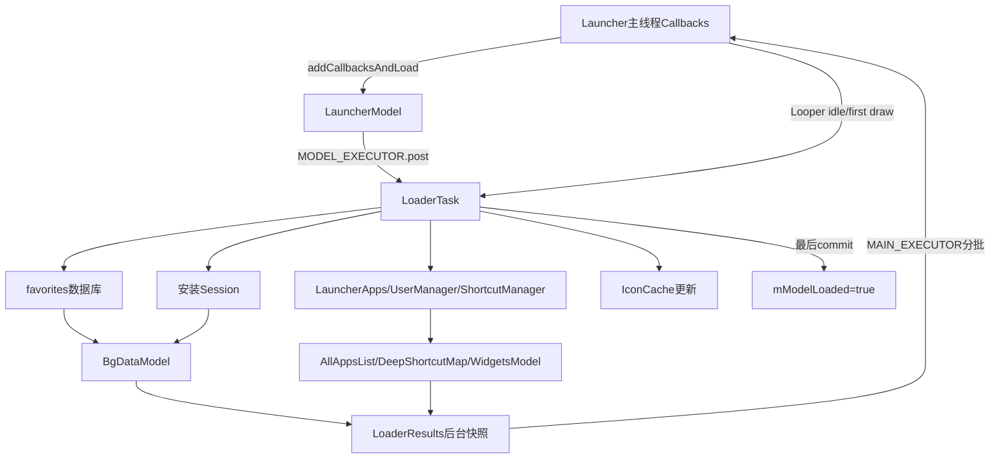
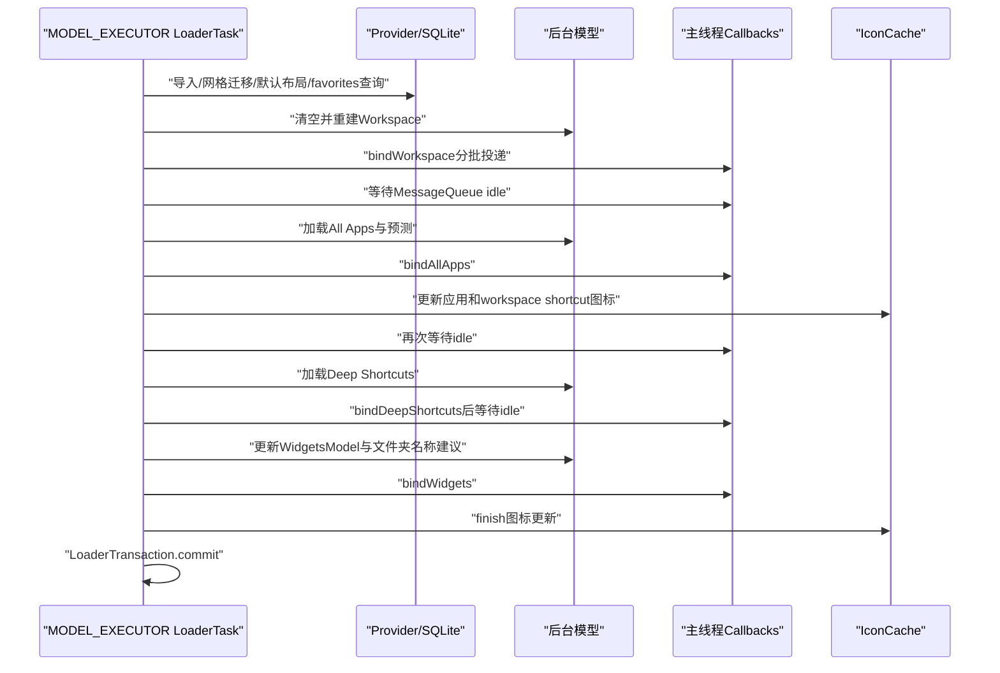
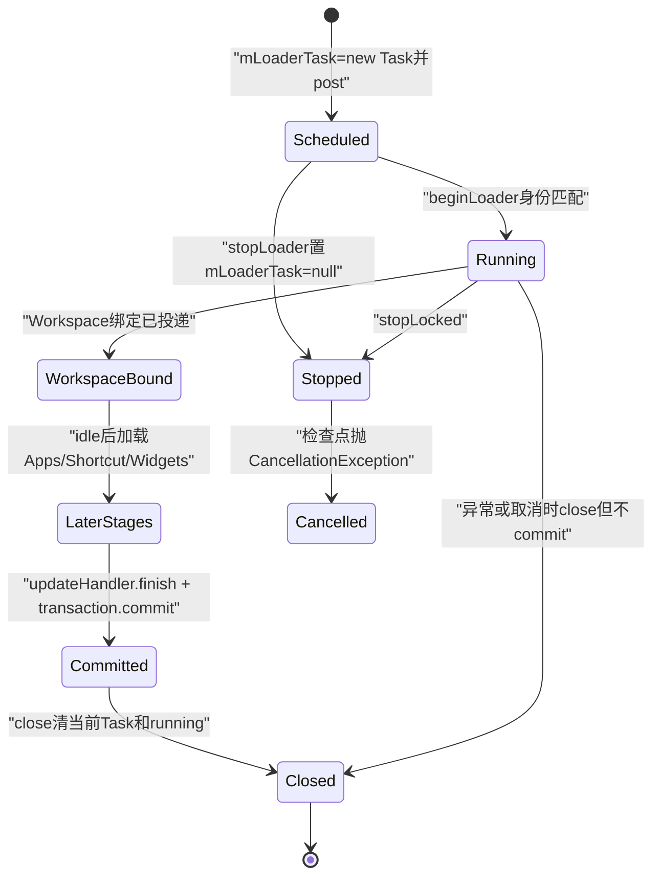

# 第505章 Android LauncherModel与LoaderTask：后台分阶段加载、数据校验、内存提交和Workspace绑定链

> 源码基线：Android 11 / API 30 / `android-11.0.0_r48`。本章只在macOS复读本地源码，不编译。核心文件：`LauncherModel.java`、`model/LoaderTask.java`、`model/LoaderCursor.java`、`model/BaseLoaderResults.java`和产品选中的`src_shortcuts_overrides/.../LoaderResults.java`。

## 1. 本章解决什么问题

Launcher何时算“加载完成”？为什么桌面图标先出现，抽屉、Deep Shortcut与Widget列表后到？数据库坏行怎样清理？旧Loader的回调为什么不会覆盖新页面？本章沿`startLoader→LoaderTask→LoaderResults→Callbacks`解释数据读取、内存构建与UI绑定的不同完成点。

## 2. 一句话定位

LauncherModel管理Loader代际与共享库存；LoaderTask在MODEL_EXECUTOR上分五阶段重建Workspace、All Apps、Deep Shortcuts、Widgets和文件夹建议；LoaderResults把后台快照分批投到主线程；只有最后的LoaderTransaction.commit才把模型标为完整加载。

## 3. 先分清四份状态

四份状态是SQLite favorites、后台`BgDataModel/AllAppsList`、主线程Callbacks所管理的View状态、磁盘IconCache。Loader会读取和修正它们，但四者没有一个横跨全流程的总事务。

## 4. 加载全景图

## 5. LauncherModel是什么

它不是Activity，也不是SQLite Helper，而是Launcher进程内的数据协调者。它持有`AllAppsList`、`BgDataModel`、Callbacks列表、当前LoaderTask以及“当前模型是否完整”的状态。

## 6. LoaderTask运行在哪个线程

`startLoaderForResults`通过`MODEL_EXECUTOR.post(mLoaderTask)`执行。它不是Launcher主线程，也不是任意Binder线程；同一个模型更新队列还承载包变化等ModelUpdateTask。

## 7. 为什么总是post而不直接run

源码注释说明：即使调用者已经在同线程，也要post，先退出可能嵌套的`synchronized`块。这样避免拿着Model锁直接进入长时间加载。

## 8. Callbacks通常是谁

Launcher Activity实现`BgDataModel.Callbacks`，通过`addCallbacksAndLoad(this)`加入列表。测试或其他展示端也可实现同一接口，因此LoaderResults按启动时快照遍历Callbacks数组。

## 9. addCallbacks要求UI线程

`Preconditions.assertUIThread()`保证Callbacks列表的生命周期从主线程接入。真正Loader状态则由`mLock`保护，两把锁职责不同。

## 10. startLoader先开启安装快捷方式队列

`InstallShortcutReceiver.enableInstallQueue(FLAG_LOADER_RUNNING)`避免加载过程中新的安装快捷方式与正在重建的模型交错；队列在Launcher的`finishBindingItems`阶段关闭，而非LoaderTask读取完DB立刻关闭。

## 11. 无Callbacks就不启动

startLoader取得Callbacks快照，长度为0时不创建LoaderTask。forceReload也只在hasCallbacks时立即start；否则等下次Launcher接入时再加载。

## 12. 每次启动先清旧绑定任务

对每个Callback把`clearPendingBinds`投到主线程，目的是清理旧代际尚未运行的绑定Runnables。它是异步投递，不表示调用startLoader的线程已同步完成清理。

## 13. startLoader会停止旧Loader

`stopLoader()`先把`mLoaderTask=null`，再对旧对象调用`stopLocked()`。旧Task的`mStopped=true`并notify，等待idle的循环可醒来。

## 14. stop不是线程强杀

它没有interrupt MODEL_EXECUTOR，也不会撤销已经执行中的PackageManager或SQLite调用。旧Task要在循环条件或`verifyNotStopped`检查点自行退出。

## 15. mLoaderTask也是代际令牌

新Task开始时，`LoaderTransaction`要求`mLoaderTask==task`；旧Task即使稍后获得执行，也会抛CancellationException，不能把自己登记成当前加载代际。

## 16. mIsLoaderTaskRunning与mLoaderTask不同

前者表示某个LoaderTransaction正在run区间，后者指向最后调度的Task。Task已排队但尚未begin时可能有mLoaderTask而running为false。

## 17. mModelLoaded的准确含义

它表示最后完整加载代际已commit，并不直接表示View已经绘制。`isModelLoaded()`还要求`mLoaderTask==null`，避免提交后close之前对外报告完成。

## 18. 已加载时可走快速重绑定

若`mModelLoaded && !mIsLoaderTaskRunning`，startLoader不重查数据库，直接用已有内存数据调用四类bind，并返回true。

## 19. 返回true也不是全部同步完成

注释说“page could be bound synchronously”，但bindAllApps等仍会投递主线程任务；Workspace其他页还可能延迟到第一次onDraw后。因此返回true只描述特定当前页快速绑定能力。

## 20. 新加载创建两个对象

LauncherModel先用Callbacks快照构造LoaderResults，再创建LoaderTask并传入共享BgDataModel与AllAppsList。Results负责绑定，Task负责生产数据。

## 21. 五阶段时序

## 22. run入口先做快速停止检查

Task对象若已被stop，进入run后直接return，连Trace和Transaction都不创建。这个检查缩短排队旧任务的退出路径。

## 23. Trace与TimingLogger边界

run用TraceHelper包住整段，TimingLogger为每个阶段记录split并在finally dump。它测量的是Loader工作流，不等于每个主线程绑定Runnable都已经执行完。

## 24. LoaderTransaction构造会清loaded

beginLoader确认当前Task身份后设置`mIsLoaderTaskRunning=true`、`mModelLoaded=false`。即使进程里还有上一代可见View，新一代模型状态已标为未完成。

## 25. 第一阶段先loadWorkspace

Workspace是首页首屏最关键数据，所以先于All Apps与Widgets目录加载。方法还把已解析的pinned deep shortcut收集到`allShortcuts`，供后面的IconCache更新。

## 26. loadCachedPredictions紧随Workspace

PredictionModel保存的ComponentKey会查询实际LauncherActivity，存在才创建AppInfo并取高分辨率图标，写入`cachedPredictedItems`。它为Hotseat预测绑定准备候选。

## 27. Workspace加载前先尝试导入

`ImportDataTask.performImportIfPossible`服务于从其他Launcher或旧格式导入。抛异常只设置clearDb，后面统一清库。

## 28. 然后执行网格迁移

只有导入未失败才依据FeatureFlag调用V2或V1；返回false也设置clearDb。第504章已经说明真实迁移失败后偏好可能仍记录当前网格。

## 29. clearDb只在统一位置执行

导入失败或网格迁移失败都调用Provider的`METHOD_CREATE_EMPTY_DB`，随后继续而非直接return。这样下一步能加载默认favorites。

## 30. 每次都会请求加载默认布局

`METHOD_LOAD_DEFAULT_FAVORITES`内部只有EMPTY_DATABASE_CREATED标志为true时才真正执行。正常已有库调用是快速无操作，所以源码可以无条件发call。

## 31. Workspace构建持有BgDataModel锁

从`mBgDataModel.clear()`到行遍历、清理、文件夹整理和恢复状态提交都在`synchronized(mBgDataModel)`中。其他线程若要安全访问静态模型，也应遵守这把锁。

## 32. 长锁不等于整个Loader只有一把锁

期间还调用ContentResolver、LauncherApps、ShortcutManager和IconCache等外部组件，可能耗时。r48以模型一致性换取了较粗的Workspace加载临界区。

## 33. 先清后台模型再查行

共享BgDataModel不是在临时新对象里构造完成后整体交换，而是原地clear再逐项add。旧View仍可能显示旧对象，但后台库存处于逐步重建状态。

## 34. 安装Session先形成快照

`getActiveSessions()`按PackageUserKey提供正在安装信息，并更新IconCache的session缓存。恢复图标和Widget据此判断安装是否已开始、显示何种进度。

## 35. Provider query返回全部favorites列

LoaderCursor包装Cursor并缓存列索引；外层又取得Widget ID、provider、span、rank、options列。缺少schema列会在`getColumnIndexOrThrow`处失败，说明schema升级是Loader前置条件。

## 36. UserManagerState是一轮快照

它遍历UserCache profiles，保存serial→UserHandle以及quiet mode的两种索引。后续本轮判断基于这次init，不会每行重新问UserManager。

## 37. Deep Shortcut还需要unlocked快照

对每个用户先问`isUserUnlocked`；解锁时查询PINNED shortcuts。ShortcutRequest失败会把本轮该用户当作locked，避免在锁状态竞态中继续依赖不完整结果。

## 38. allUsers的来源有一个细节

LoaderCursor构造时引用`mUserManagerState.allUsers`，随后`init()`再填充同一个LongSparseArray。它不是构造时复制，因此后填入的serial映射仍能被moveToNext读取。

## 39. 每一行先加载公共字段

`LoaderCursor.moveToNext()`读取itemType、container、id、profile serial、UserHandle和restoreFlag；具体Intent、Widget列按item类型再解析。

## 40. 用户不存在的行先标删除

`c.user==null`意味着serial无法映射到当前UserHandle，当前行不进入内存模型，只加入itemsToRemove。真正DELETE被批量延迟到遍历之后。

## 41. 单行异常不会终止整表

while内每一行有`try/catch(Exception)`，错误只记录“Desktop items loading interrupted”，继续下一行。Cursor创建、列索引或外层清理异常则不受这层保护。

## 42. 应用类item先解析Intent

Application、legacy Shortcut和Deep Shortcut共用一个switch分支；Intent为空或URI解析失败会标删除。

## 43. targetPkg的推导顺序

显式Component存在时用其package，否则用Intent package。非legacy Shortcut若两者都没有，Loader认为无合法目标并删除。

## 44. implicit legacy Shortcut是例外

旧快捷方式可能使用隐式Intent且没有包名，源码把它视为可保留。新式应用与Deep Shortcut不能套用这个例外。

## 45. Activity失效时尝试fallback

包有效、显式组件无效且不是Deep Shortcut时，PackageManagerHelper尝试取得该包新的launch Intent；成功则更新数据库Intent并清restoreFlag，失败才删除。

## 46. 缺包不一定立即删除

若restoreFlag非0且安装Session已开始，保留Promise item并更新RESTORE_STARTED；外置存储App或系统尚未BOOT_COMPLETED也可以暂时保留为disabled。

## 47. 恢复未开始会被清理

恢复item对应包不存在、没有RESTORE_STARTED且当前安装Session也没有它，标记“Unrestored app removed”。恢复标志不是无限期保留许可证。

## 48. SD卡未就绪有延迟复查

缺包会按user加入pendingPackages，继续构建灰态图标；加载末尾注册BOOT_COMPLETED receiver，在MODEL_EXECUTOR Handler上复查。

## 49. App图标可能使用低分辨率

Loader根据是否当前页面等条件选择useLowResIcon，先保证首屏质量与速度。文件夹预览里的低分辨率应用稍后会特别补成高分辨率。

## 50. 安全模式增加运行时禁用位

非系统App在safe mode下写`FLAG_DISABLED_SAFEMODE`到内存对象。它不是删除数据库行，退出安全模式后可恢复。

## 51. suspended与quiet也是运行时位

PackageManager suspended和工作资料quiet mode会叠加disabledState。数据库item存在、Activity存在仍可能因运行政策不可点击。

## 52. Deep Shortcut优先用系统权威对象

用户已解锁且pinned查询成功时，按ShortcutKey找ShortcutInfo，用它更新WorkspaceItemInfo并取图标。旧数据库只是保存定位信息，不是Shortcut当前状态的最终权威源。

## 53. 锁定用户用降级对象

无法查询Shortcut时加载简单WorkspaceItem，并加`FLAG_DISABLED_LOCKED_USER`。解锁事件后UserLockStateChangedTask会再更新。

## 54. applyCommonProperties不填全部字段

它只写id、container、screenId、cellX、cellY；title、Intent、rank、span、user和状态由各item分支补齐。看到函数名“Common”不能误判为完整反序列化。

## 55. Folder使用findOrMakeFolder

子item可能先于文件夹行出现，BgDataModel可提前创建占位FolderInfo；读到真实folder行后再应用位置、标题和options。

## 56. Folder标题不trim

注释说明这是用户设置文本，保留原样。普通快捷方式标题则经Utilities.trim，二者故意不同。

## 57. Folder恢复标记直接转正

文件夹不需包安装或provider检查，调用`markRestored()`把ID加入待更新集合并把当前Cursor restoreFlag置0。

## 58. Widget先判断全局禁用

Go或产品配置若`WidgetsModel.GO_DISABLE_WIDGETS`，普通AppWidget行标删除；custom widget会进入后续独立处理分支。

## 59. 搜索Widget重新解析provider

options含`OPTION_SEARCH_WIDGET`时，不直接信数据库provider，而用QsbContainerView当前搜索组件；没有组件则删除。

## 60. Widget有两个“有效”维度

`isIdValid`来自restore flag，`isProviderReady`来自当前Widget provider map。有效ID不保证provider存在，provider存在也不保证旧ID仍可绑定。

## 61. Provider map按需只构建一次

本轮首次Widget才调用`WidgetManagerHelper.getAllProvidersMap`，后续行复用。加载期间provider变化不会自动重建这张局部快照。

## 62. 非安全模式下会删除真实失效Widget

若过去provider ready、现在不ready，且不是custom widget和safe mode，认为应用已卸载并删除。safe mode下保留，防止把暂时不可见系统组件当永久丢失。

## 63. 恢复中的Widget可继续等待

provider仍未就绪时，若恢复曾开始或安装Session正在进行就保留；否则在非safe mode下删除。

## 64. provider恢复后要重算状态

代码清`RESTORE_STARTED`和`PROVIDER_NOT_READY`；若过去provider不ready但ID已有效，则加UI_NOT_READY，让界面提示配置而非当作完全可用。

## 65. Widget尺寸与container有硬校验

spanX/spanY必须大于0，container只能是Desktop或Hotseat，否则标删除。普通文件夹child不会通过Widget分支进入文件夹容器。

## 66. Widget修正会写回数据库

真实providerName或restoreStatus变化时，Loader用ContentWriter update当前行。加载不是纯读操作，它同时执行数据清洗与状态收敛。

## 67. 未完成Widget需要pendingItemInfo

Loader为provider包创建PackageItemInfo并取应用标题图标，供Pending Widget占位UI展示。它不是AppWidgetHostView已完成绑定。

## 68. checkAndAddItem先做位置检查

LoaderCursor维护每屏GridOccupancy。位置合法且不重叠才调用BgDataModel.addItem；失败则延迟删除数据库行。

## 69. Hotseat按screenId占槽

screenId必须小于numHotseatIcons，同一rank不能重复。cellX/cellY不是Hotseat冲突判断的主要键。

## 70. Workspace检查边界与重叠

Desktop item的cell和span必须落在当前IDP网格内；第一页还可按FeatureFlag把QSB首行预占。重叠item后读到者被丢弃，结果受Cursor行顺序影响，而查询未指定sortOrder。

## 71. 文件夹child跳过屏幕占用检查

container既非Desktop也非Hotseat时，`checkItemPlacement`直接true；文件夹内部排序由rank与FolderGridOrganizer处理，而非全局Workspace GridOccupancy。

## 72. 删除先累计后批量commit

itemsToRemove是IntArray。遍历完成后仅当真实favorites URI加载时调用ContentResolver.delete，预览或测试的其他contentUri不会走相同清库副作用。

## 73. 删除后再清空文件夹

若commitDeleted确实删除行，Provider call删除没有child引用的Folder，随后同步移除BgDataModel中的Folder对象与itemsIdMap索引。

## 74. Ghost Widget也只在有删除时清

`METHOD_REMOVE_GHOST_WIDGETS`嵌在`if(c.commitDeleted())`内。没有坏行删除时，本轮不会单独执行ghost Host ID清理。

## 75. pinned Shortcut还有反向清理

系统ShortcutManager里pinned、但Workspace计数为0且不在InstallShortcutReceiver pending集合的Shortcut会被unpin。数据库清理因此可能改变系统Shortcut固定状态。

## 76. 文件夹内容按位置比较器排序

遍历后统一`Collections.sort(folder.contents, Folder.ITEM_POS_COMPARATOR)`，再把内存rank压成0..size-1，消除删除造成的空洞。

## 77. rank修正暂不写数据库

注释明确rank才是文件夹item真值，但此处只改内存；等用户手动修改文件夹时才写DB。加载后内存与SQLite rank可暂时不同。

## 78. 文件夹预览补高分图标

处在FolderGridOrganizer预览位置、又使用low-res的Application item会重新从IconCache取高分图，避免首页文件夹预览模糊。

## 79. restoredRows最后统一清零

`markRestored`只累计ID；`commitRestoredItems()`在遍历与清理结束后用一次update把这些行RESTORED设0。内存对象已先按转正状态构建。

## 80. mStopped的中途处理不完全相同

while条件会停止读行；Cursor关闭后若mStopped，Loader清空BgDataModel并return。run随后在bind前`verifyNotStopped`抛CancellationException。

## 81. loadWorkspace提前return不会结束run

它本身返回void；停止分支返回到run，紧接着loadCachedPredictions仍可能执行，然后verifyNotStopped才取消。因此“stop瞬间不再做任何工作”不准确。

## 82. Workspace绑定使用快照

BaseLoaderResults在BgDataModel锁内复制workspaceItems、appWidgets和screen IDs，并递增`lastBindId`。之后主线程任务使用这份浅拷贝集合，不继续遍历原集合。

## 83. 浅拷贝仍共享Item对象

ArrayList是新容器，但元素引用相同。后续后台代码若不遵守代际和线程协议修改Item，主线程任务仍可能看到对象字段变化。

## 84. lastBindId淘汰旧回调

每个执行任务先比较`mMyBindingId`与BgDataModel.lastBindId；不相等则跳过并记录obsolete bind。它防旧代际操作UI，但不会从主线程消息队列物理删除所有Runnable。

## 85. 每个Callback各有WorkspaceBinder

Callbacks数组有多个对象时，为每个创建独立Binder并查询自己的`getPageToBindSynchronously()`。不同展示端可以优先绑定不同页面。

## 86. 当前页优先

Binder把当前screen的Workspace items和Widgets与其他页分开，并按网格空间顺序排序。当前页先投主线程，减少首屏可见延迟。

## 87. Workspace item每六个一批

`ITEMS_CHUNK=6`，普通图标用`bindItems(subList, false)`分批；Widget一次只绑定一个，降低单次主线程任务过重的风险。

## 88. 先startBinding再bindScreens

Callbacks先清pending并进入startBinding，然后得到screen ID列表，再接收item。View层可以先重置旧Workspace结构并建立页面容器。

## 89. Hotseat预测在当前页阶段绑定

`getMissingHotseatRanks`计算缺口，Binder复制cachedPredictedItems并调用bindPredictedItems。预测库存来自本轮Workspace后的缓存加载。

## 90. 其他页延迟到first draw后

当前页有效时使用`ViewOnDrawExecutor`承载其余页面与finishBindingItems；Callback在下一次draw挂接该executor。这是“首屏优先”，不是所有页面同步建立。

## 91. finishFirstPageBind不是全部完成

它表示首屏首批绑定已排好；`onPageBoundSynchronously`还明确告诉Launcher后续页未完。最终finishBindingItems可能在first draw之后。

## 92. bindWorkspace调用返回也不等于UI绑完

Loader线程只是把Runnables投给Executor。随后它发送首屏安装广播并进入waitForIdle，让主线程有机会实际消费这些任务。

## 93. 首屏安装广播基于后台模型

Task复制workspaceItems与appWidgets，取collectWorkspaceScreens第一个screen，筛出首屏item，把活跃安装信息通知对应installer包。注释假设screen集合不空。

## 94. waitForIdle怎样工作

LoaderResults在主Looper MessageQueue添加IdleHandler，LoaderTask在自身monitor上每次最多wait一秒；queueIdle把锁状态清除并notify。

## 95. 一秒不是阶段固定延时

循环每秒醒来是防止状态变化却没通知，若队列很快idle会提前结束；若持续繁忙会反复等待。它不是“每阶段sleep 1秒”。

## 96. stop可唤醒idle等待

stopLocked与waitForIdle使用同一个Task monitor，设置mStopped后notify；循环条件立即允许退出，随后verifyNotStopped取消。

## 97. 第二阶段清空并加载All Apps

遍历所有profiles调用LauncherApps.getActivityList，创建AppInfo并加入AllAppsList。列表是可启动Activity库存，不等于已放在Workspace的图标。

## 98. 一个profile空列表会提前返回

源码TODO承认目前任一profile的apps为空就返回已累计allActivityList；后续profile不再加载。它不只针对当前主用户，是r48的已知粗糙边界。

## 99. Promise App可进入All Apps

FeatureFlag开启时，经过验证的安装Session会生成Promise App。之后缓存预测对应的包还会再次枚举Activity，AllAppsList自身负责过滤或去重细节，下一章专讲。

## 100. AllApps flags随本轮快照设置

它记录是否任一profile quiet、Launcher是否有Shortcut Host权限、是否有修改quiet mode权限。UI可据此决定工作资料开关和Shortcut能力。

## 101. bindAllApps传数组快照

`copyData()`返回AppInfo数组并连同flags投主线程。任务同样检查lastBindId，旧代际数组不会覆盖最新Callbacks。

## 102. IconCache更新晚于All Apps绑定投递

Loader先bindAllApps，再创建UpdateHandler批量更新磁盘缓存；更新回调又通过ModelUpdateTask刷新相关包。首次UI可能先使用已有缓存，之后再收敛。

## 103. Promise包会加入ignore集合

Workspace Promise icon和provider未ready Widget对应包被UpdateHandler忽略，避免普通缓存刷新用缺包默认信息覆盖恢复占位内容。

## 104. 第三阶段加载Deep Shortcut库存

先clear deepShortcutMap；只有AllAppsList显示具备Shortcut Host权限时，才遍历已解锁用户查询ALL shortcuts，并按组件更新数量。

## 105. Workspace pinned与Deep Shortcut库存不同

第一阶段PINNED查询服务于桌面上已有Deep Shortcut对象与图标；第三阶段ALL查询服务于长按菜单计数。它们目的、过滤条件和绑定接口不同。

## 106. 第四阶段更新WidgetsModel

`widgetsModel.update(mApp,null)`枚举所有Widget/Shortcut条目并返回需要缓存标签图标的组件列表；随后bindWidgets投递分组列表，UpdateHandler再刷新组件缓存。

## 107. Go版本LoaderResults会省略两类绑定

源码模块选择若使用`go/src/.../LoaderResults`，`bindDeepShortcuts`与`bindWidgets`是空实现；普通Shortcut override版本才复制map和WidgetListRowEntry回调。读AOSP必须确认最终source set。

## 108. 第五阶段只补文件夹名称建议

FeatureFlag开启时，为`suggestedFolderNames==null`的Folder调用FolderNameProvider。它不直接重命名用户文件夹，只把建议缓存到FolderInfo。

## 109. 提交与取消状态图

## 110. commit只写一个内存标志

LoaderTransaction.commit在mLock内设置`mModelLoaded=true`；它不是SQLite commit，也不等待主线程View绑定、first draw或IconCache回调完成。

## 111. close负责代际清理

try-with-resources无论正常、取消还是RuntimeException都会close。只有当前`mLoaderTask==mTask`才清指针，但`mIsLoaderTaskRunning=false`没有按Task分代；模型依赖MODEL_EXECUTOR串行，若执行模型被改变需重新审计这一假设。

## 112. macOS只读练习一：画五阶段链

执行`sed -n '130,290p' packages/apps/Launcher3/src/com/android/launcher3/model/LoaderTask.java`，按Workspace、All Apps、Deep Shortcuts、Widgets、Folder Names列出每阶段的load、bind、IconCache和idle位置，并标出唯一transaction.commit。

## 113. macOS只读练习二：推演坏行清理

阅读`LoaderTask.loadWorkspace`与`LoaderCursor.checkItemPlacement`，构造“已删除用户”“缺失恢复包”“Hotseat越界”“两item重叠”四行，说明何时只标记、何时批量DELETE、何时再删除空Folder和ghost Widget。

## 114. macOS只读练习三：验证旧代际淘汰

执行`rg -n "lastBindId|mMyBindingId|stopLoader|LoaderTransaction" packages/apps/Launcher3/src/com/android/launcher3`。推演Loader A已投六批item、Loader B开始后，A剩余Runnable为何跳过，以及A为什么不能把mModelLoaded设回true。

## 115. macOS只读练习四：区分三个完成点

阅读`BaseLoaderResults.WorkspaceBinder`、`LooperIdleLock`和`LauncherModel.isModelLoaded`，分别写出“首屏任务已投递”“主Looper出现idle”“模型完整commit”的证据；解释三者为何都不等于像素已经稳定显示。

## 116. 易错点一：Loader不是只读数据库

它会修Intent、恢复位和Widget provider，删除坏行与空文件夹，清ghost Widget并unpin系统Shortcut。把它当简单ORM反序列化会漏掉关键副作用。

## 117. 易错点二：Workspace绑定完成不等于Loader完成

Workspace是第一阶段；All Apps、图标缓存、Deep Shortcuts、Widgets和文件夹建议仍在后面。首页可交互时`mModelLoaded`仍可能是false。

## 118. 易错点三：mModelLoaded不等于首帧

commit发生在后台任务末尾，而主线程绑定任务可能排队，其他页还依赖onDraw executor。该flag表达模型代际完整，不是渲染完成fence。

## 119. 易错点四：stop不是立即回滚

旧Task已做的Provider update/delete、系统Shortcut unpin或IconCache写入不会随CancellationException撤销；代际机制主要防旧内存提交和旧UI绑定覆盖。

## 120. 本章总结与下一章

LauncherModel用Task身份、停止位、lastBindId和LoaderTransaction管理加载代际；LoaderTask优先构建并绑定首屏，在主线程idle间隙继续其他库存，同时清洗数据库与系统账；最终commit仅宣布后台模型完整。下一章深入BgDataModel，解释itemsIdMap、workspaceItems、appWidgets、folders、pinnedShortcutCounts和deepShortcutMap之间如何保持索引关系。
