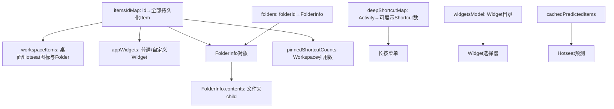
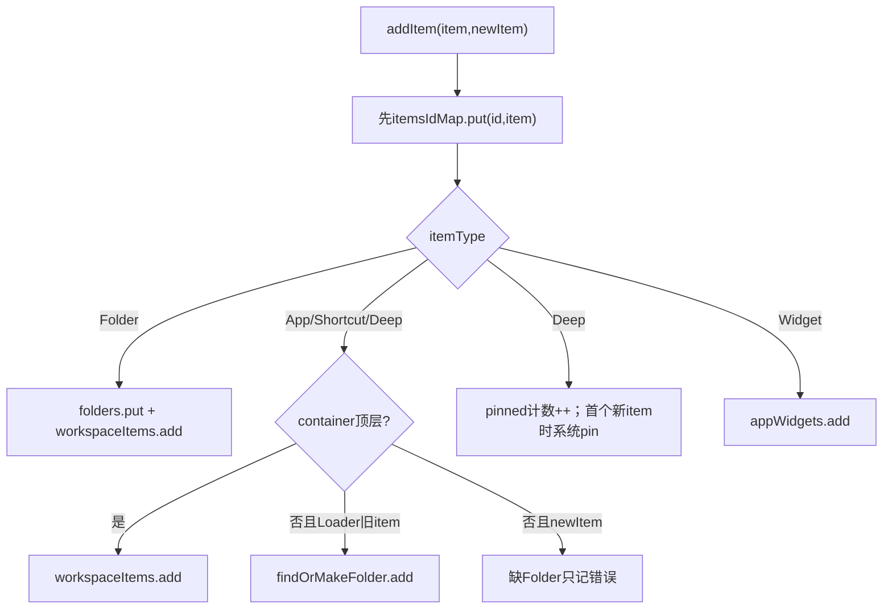
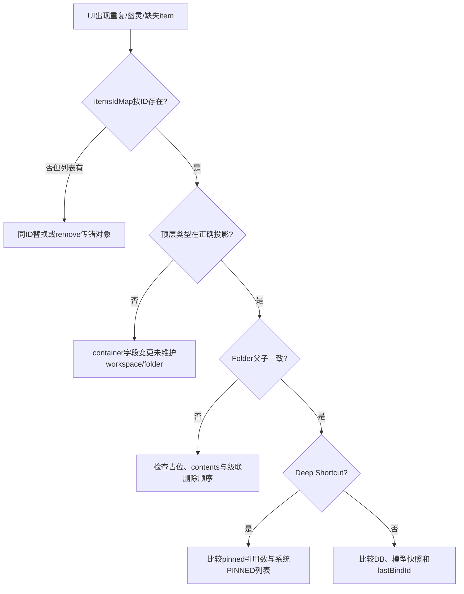

# 第506章 Android BgDataModel：内存模型、复合索引、Folder占位、Deep Shortcut计数和一致性边界

> 源码基线：Android 11 / API 30 / `android-11.0.0_r48`。本章只在macOS阅读本地源码，不编译。核心文件是`model/BgDataModel.java`，并结合`LoaderTask.java`、`BaseLoaderResults.java`、`ModelWriter.java`和`FolderInfo.java`理解读写者。

## 1. 本章解决什么问题

为什么一个图标会出现在多份集合里？Folder child为何不在workspaceItems？同一Deep Shortcut放两次怎样记数？占位Folder什么时候变成真实Folder？本章建立BgDataModel的内存不变量。

## 2. 一句话定位

BgDataModel不是单一列表，而是以`itemsIdMap`为全量主索引，配合首页投影、Widget列表、Folder索引/contents、系统pinned引用计数、Deep Shortcut菜单计数和Widget目录形成的复合内存模型。

## 3. 先分清“对象”和“索引”

同一个ItemInfo对象可被多个集合引用；集合不是对象副本。修改对象字段会被所有持有者看到，增删集合成员则必须分别维护。

## 4. 复合索引总图

## 5. itemsIdMap是最接近全量的索引

注释称它保存LauncherModel创建的shortcuts、folders和widgets，键是数据库`_id`。常规持久化item应在此可按ID找到。

## 6. “最接近”而不是绝对全量

`findOrMakeFolder`可先造占位Folder并只放入folders；真实Folder行尚未读取时，它没有有效持久化ID状态，也未进入itemsIdMap。

## 7. workspaceItems只服务顶层首页

它包含直接位于Desktop或Hotseat的Application、Shortcut、Deep Shortcut，以及顶层Folder；不含Widget和Folder child。

## 8. workspaceItems名称容易误导

它不仅包含Desktop页面，也包含Hotseat；同时不包含所有“属于Workspace语义”的Widget。应理解为顶层非Widget item投影。

## 9. appWidgets单独成表

普通AppWidget与Custom AppWidget进入`appWidgets`，同时也进入itemsIdMap。绑定器因此能把普通item分批、Widget逐个绑定。

## 10. folders按ID查FolderInfo

它既保存真实Folder，也暂时保存child先到时创建的占位对象。其value还拥有`contents`列表。

## 11. Folder child仍在itemsIdMap

文件夹里的WorkspaceItemInfo不会进入workspaceItems，却会进入itemsIdMap并加入对应FolderInfo.contents，因此仍能被包更新任务全局扫描。

## 12. pinnedShortcutCounts按ShortcutKey计数

Key由package、shortcut ID和user身份组成；同一个Deep Shortcut若在桌面出现两次，计数为2，而不是两个不同系统pin。

## 13. deepShortcutMap是另一份计数

它按`ComponentKey(Activity+User)`统计可在长按菜单展示的manifest/dynamic Shortcut数量，不表示Workspace固定了几次。

## 14. 两份Shortcut计数不能互换

pinnedShortcutCounts来自Workspace持久化item；deepShortcutMap来自ShortcutManager查询。前者管理系统pin引用，后者驱动Popup菜单角标/入口。

## 15. cachedPredictedItems不是数据库item

它保存PredictionModel解析出的AppInfo候选，通常没有favorites行，不应放进itemsIdMap。

## 16. widgetsModel也不是首页Widget列表

widgetsModel是可添加Widget/Shortcut目录；appWidgets才是已经放到首页的实例。一个provider可在目录中存在但首页无实例。

## 17. flags定义展示能力快照

三个bit注释表示Shortcut Host权限、任一profile quiet、是否可切quiet mode。不过在r48主路径中未找到`BgDataModel.flags`的读写者；Loader实际设置并绑定的是AllAppsList内部同类flags，不能因为字段存在就断言它生效。

## 18. lastBindId是绑定代际

每次BaseLoaderResults复制Workspace快照就递增它；主线程Runnable用自己的bindingId比对，跳过旧代际绑定。

## 19. 所有核心方法使用synchronized

clear、collect、dump、add、remove、findOrMakeFolder、updateDeepShortcutCounts都锁当前BgDataModel对象。外部直接遍历公开集合时也常显式锁它。

## 20. public集合仍靠约定保护

Java类型没有强制调用者拿锁；错误调用仍能直接修改ArrayList/Map。线程安全来自LauncherModel代码纪律，不是不可变封装。

## 21. addItem分发流程

## 22. addItem总是先put主索引

无论类型是否被switch识别，先执行itemsIdMap.put。相同ID会替换map value，但旧对象可能仍留在其他列表，这是调用者必须避免的冲突。

## 23. put不检查重复ID

BgDataModel自身没有抛错或先remove旧投影。ID唯一性依赖Provider生成、Loader校验和ModelWriter调用协议。

## 24. Folder添加进三处

真实Folder会进入itemsIdMap、folders与workspaceItems。三个集合通常引用同一个FolderInfo。

## 25. Folder为何不检查container

Folder case无条件加入workspaceItems；Launcher数据模型假定Folder只作为顶层item，不支持Folder嵌套。

## 26. 普通图标按container分流

Desktop/Hotseat进入workspaceItems；其他container视作Folder ID，正常加载时进入FolderInfo.contents。

## 27. newItem参数改变Folder处理

Loader从DB重建传false，可以findOrMakeFolder；用户新建/移动写入传true，若Folder不存在只记错误，不自动造占位并加入contents。

## 28. 为什么新item不自动加入Folder contents

交互路径通常已由Folder UI维护FolderInfo.contents；BgDataModel若再次add会重复。newItem参数表达“UI对象关系已处理”和“从DB重建”的不同责任。

## 29. newItem命名并不等于数据库新行

它主要控制Shortcut系统pin和Folder contents补建行为；不能仅凭名称推断数据库事务时机。

## 30. Deep Shortcut先增加引用数

找不到Key就创建MutableInt(1)，已有则value++。MutableInt让Map value可原地变化。

## 31. 只有首个新引用触发pin

`newItem && count.value==1`时调用updatePinnedShortcuts添加ID。第二个同Key图标不需要重复向系统pin列表添加同一字符串ID。

## 32. Loader重建不会重复pin

Loader调用addItem(...,false)，只重建内存引用数，不修改系统ShortcutManager pin；加载末尾另有反向一致性检查。

## 33. Deep Shortcut switch故意贯穿

计数处理后没有break，继续落入Application/Shortcut分支，把顶层Deep Shortcut放进workspaceItems或Folder contents。

## 34. Widget也先进入itemsIdMap

随后强制cast为LauncherAppWidgetInfo加入appWidgets；itemType与实际Java类型不匹配会抛ClassCastException。

## 35. 未知itemType的结果

它只留在itemsIdMap，不进入专用列表。Loader正常switch不会为未知类型调用addItem，但其他调用者若传入会造成半索引状态。

## 36. findOrMakeFolder先查现有对象

若folders已有ID，直接返回，保证早到child与后到Folder行能汇聚到同一对象。

## 37. 占位Folder初始ID不是参数ID

方法只`new FolderInfo()`并`folders.put(id, object)`，没有给`folderInfo.id=id`。真实Folder行随后由LoaderCursor.applyCommonProperties补ID。

## 38. 占位不进入itemsIdMap

这避免把尚未确认有Folder数据库行的壳当完整持久化item，但短时间内`folders`与itemsIdMap集合大小不一致。

## 39. child先到为何可工作

Loader按Cursor未知顺序遍历；child的container指Folder ID，findOrMakeFolder取得占位并add child。真实Folder行到达时再次取得同一对象并填充字段。

## 40. 真实Folder可能永远不到

若数据库有孤儿child却没有Folder行，占位仍在folders，child在itemsIdMap与contents。Provider后续删除空Folder并不能删除这种“无父行但有child”的相反异常。

## 41. Loader通常靠排序吗

favorites query没有sortOrder，所以不能依赖Folder行先于child。占位机制正是对顺序不确定的容错。

## 42. FolderInfo.add维护contents

add的第二参数false表示不通知监听器/不触发动画语义，适合后台模型重建。UI交互路径可能使用不同参数。

## 43. removeItem也先按类型分发

它从专用索引/列表移除，再在switch结束统一`itemsIdMap.remove(id)`。

## 44. remove Folder先删folders

随后从workspaceItems删除；Studio build会扫描itemsIdMap，若仍有child的container指它，只打印错误，不自动级联child。

## 45. 生产构建缺少Folder非空诊断

该一致性扫描受`IS_STUDIO_BUILD`控制。生产版本删除非空Folder时不会付出全表扫描，也不会显示这条开发日志。

## 46. remove Folder不删除contents

方法不递归remove FolderInfo.contents。ModelWriter.deleteFolderAndContents会先显式remove contents，再remove Folder。

## 47. 删除责任在更高层组合

BgDataModel提供原子“移除这些对象”的索引操作，不决定数据库级联业务。调用者必须传完整对象集合。

## 48. remove Deep Shortcut先减计数

取得MutableInt后执行`--count.value`；如果count为null，条件短路也会进入unpin判断，不抛空指针。

## 49. count为0时不从Map删除

源码没有`pinnedShortcutCounts.remove(key)`。Key可能继续保留MutableInt(0)，加载整轮clear或后续再add才改变。

## 50. 负数在异常调用下可能出现

若同一对象被重复remove且Map仍有0，下一次会减为-1，不满足`==0`，也不会unpin。实现依赖“每个引用只移除一次”的调用不变量。

## 51. pending Shortcut阻止unpin

计数归零或缺失时，还检查InstallShortcutReceiver pending集合；正在排队添加的Shortcut存在就暂不从系统pin列表移除。

## 52. unpin是外部系统副作用

removeItem虽然在BgDataModel锁内，却会查询ShortcutManager并调用LauncherApps.pinShortcuts。内存锁不能使系统服务操作与本地集合成为事务。

## 53. Shortcut删除继续贯穿普通item

计数处理后从workspaceItems移除；若它在Folder中，workspaceItems.remove是无操作，Folder contents需要调用者或Folder UI另行维护。

## 54. removeItem没有从Folder contents查删

BgDataModel只根据itemType和顶层列表处理，没有按container定位FolderInfo.remove。ModelWriter删除路径需先/同时保持Folder对象内容一致。

## 55. Widget从appWidgets删除

无论普通或custom，都从专用列表remove，然后从itemsIdMap删ID。AppWidgetHost ID释放仍属于更高层责任。

## 56. ArrayList.remove按equals语义

若传入不是列表里同一对象而ItemInfo未按ID等价，remove可能失败；itemsIdMap仍按id删除，形成列表幽灵项。通常调用者传模型内对象。

## 57. clear清六份集合

workspaceItems、appWidgets、folders、itemsIdMap、pinnedShortcutCounts、deepShortcutMap被清空。

## 58. clear不清cachedPredictedItems

预测缓存没有在BgDataModel.clear中清；LoaderTask.loadCachedPredictions稍后单独clear并重建。

## 59. clear不清widgetsModel

WidgetsModel由第四阶段`update`重建/更新。停止在Workspace阶段时，旧Widget目录可能暂时仍存在。

## 60. clear也不重置flags和lastBindId

权限标志与绑定代际保留；相关所有者在各自阶段覆盖。它不是把对象恢复为构造初值的通用reset。

## 61. collectWorkspaceScreens扫itemsIdMap

它不扫workspaceItems，选择container==DESKTOP的所有item screenId。Widget也在itemsIdMap，所以Widget所在页面会被收集。

## 62. Folder child不会贡献页面

其container是Folder ID，不满足DESKTOP；child自己的screen/rank不会误当Workspace screen。

## 63. 页面集合使用IntSet

IntSet用二分查找按值插入，所以内部IntArray保持升序并去重；ordered screens来自数值排序，不来自favorites查询行顺序。

## 64. 第一屏兜底规则

QSB_ON_FIRST_SCREEN开启或screenSet为空时，强制加入`Workspace.FIRST_SCREEN_ID`。只有Hotseat item的桌面也能获得空首页。

## 65. QSB关闭且已有页面时不强加0

如果items只在screen 3且Feature关闭，集合不必含FIRST_SCREEN_ID。不能假设任何数据都从0页开始。

## 66. dump展示四个主要容器

它打印workspaceItems、appWidgets、folders和itemsIdMap；`--all`时额外只打印deepShortcutMap的count值。

## 67. dump不打印Shortcut key

只遍历values输出数字，难以从文本定位哪个Activity对应哪个count。这是r48诊断信息的限制。

## 68. dump不打印pinnedShortcutCounts

系统pin引用账需要源码调试或其他dumpsys交叉确认，仅靠BgDataModel.dump看不到。

## 69. dump也不证明数据库一致

它展示内存快照；Loader可能已修内存rank但尚未写DB，ModelWriter任务也可能排队。

## 70. updatePinnedShortcuts先重查系统

它按package+user查询当前PINNED列表，收集所有ID，再对单个ID执行add或remove，最后整列表调用pinShortcuts。

## 71. 它不是增量Binder API

LauncherApps.pinShortcuts提交该package最终ID集合。并发修改若没有串行化，基于旧快照写回可能覆盖另一变化。

## 72. GO_DISABLE_WIDGETS名称很奇怪

updatePinnedShortcuts在该flag成立时直接return，虽然操作对象是Shortcut。Go产品把Widgets/Shortcut能力一并裁剪，名称不能按字面局部理解。

## 73. pin失败只记录日志

SecurityException或IllegalStateException被catch，本地pinnedShortcutCounts仍已更新。因此本地引用账与系统pin账可能暂时不一致。

## 74. updateDeepShortcutCounts支持局部包刷新

packageName非null时先遍历map，删除同package+user的旧ComponentKey；其他包与其他user不受影响。

## 75. 全量加载传packageName null

LoaderTask先显式clear map，再逐user传null与查询结果，因此方法本身不删除此前key。

## 76. 只有可展示Shortcut参与计数

要求enabled，且是manifest声明或dynamic，并且activity非null。Pinned-only、disabled或无Activity项不进入长按菜单数。

## 77. 计数按目标Activity聚合

多个Shortcut指同Activity会累加；同包不同Activity分开；同Activity不同User也因ComponentKey user不同而分开。

## 78. deepShortcutMap不保存Shortcut详情

value只有Integer数量。真正长按展开时还需查询ShortcutManager，不能从此Map还原标题、图标和rank。

## 79. HashMap顺序没有UI承诺

Map只用于按ComponentKey查数量；显示顺序由后续Shortcut查询与排序决定。

## 80. pinned key与deep key粒度不同

前者细到Shortcut ID，后者粗到Activity。因此不能用deepShortcutMap某组件count推导桌面固定了几个。

## 81. 一项多索引的不变量

顶层App应在itemsIdMap+workspaceItems；Folder child在itemsIdMap+Folder.contents；Folder在itemsIdMap+folders+workspaceItems；Widget在itemsIdMap+appWidgets。

## 82. Deep Shortcut再多一份引用账

无论顶层还是Folder child，还应对ShortcutKey贡献一个pinnedShortcutCounts计数。

## 83. 索引维护不是自动观察者

修改ItemInfo.container字段不会自动把对象从workspaceItems移到Folder.contents；必须经过ModelWriter等显式迁移逻辑。

## 84. ModelWriter负责移动时修投影

它会检查旧/新container，从Folder contents和workspaceItems移出/加入，并最终更新数据库。下一章将逐行讲这条链。

## 85. itemsIdMap适合全局匹配

包删除、Session进度、用户锁状态和缓存更新任务遍历它，能覆盖顶层、Folder child与Widget。

## 86. workspaceItems适合首页绑定

BaseLoaderResults复制它再按当前screen过滤；Folder child由绑定FolderInfo时随contents进入Folder UI，不单独作为首页View。

## 87. appWidgets单列避免类型分支

绑定器可逐个处理昂贵Widget；安装状态任务也能只扫描Widget恢复项。

## 88. folders索引支持child归属

container保存folderId，O(1)取FolderInfo；无需每次扫描workspaceItems找父对象。

## 89. objects是可变共享实体

FolderInfo同时在三处，修改title或contents不用替换各索引value；优点是高效，代价是线程与更新顺序必须受控。

## 90. 浅拷贝绑定仍共享实体

LoaderResults复制ArrayList但不克隆ItemInfo。后台若在主线程消费前修改对象，快照只冻结成员集合，不冻结字段。

## 91. Model executor串行降低竞态

LoaderTask和ModelUpdateTask通常在同一MODEL_EXECUTOR排队，减少后台写写并发；主线程读则靠快照、锁和代际。

## 92. 外部代码仍可能读公开字段

LauncherPreviewRenderer等读取workspaceItems/appWidgets；是否复制与是否加锁要逐调用点确认，不能把类级synchronized当自动覆盖字段访问。

## 93. addItem不是数据库写

它只改内存并可能pin系统Shortcut。数据库insert通常由ModelWriter的独立任务负责。

## 94. removeItem也不是数据库delete

它只改内存和可能unpin；删除favorites、Folder contents、Widget Host ID由调用者组合。

## 95. 所以没有跨账回滚

系统pin成功而数据库失败、数据库成功而内存任务取消，都需要后续Loader重建或事件收敛，没有一个统一事务管理器。

## 96. 占位Folder是有意的短暂不一致

它允许无序Cursor单遍加载，避免先排序或缓存全部行。代价是加载中途观察模型会看到不完整父对象。

## 97. Loader用大锁隐藏大部分中间态

loadWorkspace在BgDataModel锁内clear和逐行add；遵守锁的读者通常要等重建完。没有拿锁的读者仍可能看到中间态。

## 98. stop时会再次clear

Loader发现mStopped后清主要索引，避免留下半加载Workspace；但cachedPredictions/widgetsModel等不属于clear全集。

## 99. Folder删除诊断只看itemsIdMap.container

Studio检查不直接看FolderInfo.contents；两者若已经不一致，日志可能只反映其中一面。

## 100. 重复对象会怎样

ArrayList允许同一引用重复add。BgDataModel没有contains防护；正确性依赖每个业务事件只调用一次以及ModelWriter检查。

## 101. 同ID不同对象更危险

Map指向新对象，列表可能仍含旧对象；按ID删除Map后，旧列表项继续绑定，形成典型“幽灵图标”。

## 102. pinned计数是引用计数而非真值

它从当前模型item推导，系统ShortcutManager的PINNED列表才是跨进程事实；两者通过updatePinnedShortcuts尽力对齐。

## 103. 引用计数需要成对操作

每个Deep Shortcut add必须有一次remove。异常重复删除造成负数，漏删造成系统ID长期pinned。

## 104. 系统pin列表按包整体写回

移除一个ID时仍保留查询到的同包其他ID，因此同包多个Shortcut不会被全部误删；前提是查询快照新鲜。

## 105. User是Key的一部分

个人资料和工作资料即便package、Shortcut ID相同也分账；pin API也带UserHandle。

## 106. clear本身不会unpin

重载前清内存引用计数不会逐个调用系统服务。Loader完成后根据Workspace实际计数清理查询到但不再使用的pinned shortcuts。

## 107. collect screens包含Widget的意义

若某页只有Widget，workspaceItems不含它，但itemsIdMap扫描仍保留该screen，避免绑定时页面消失。

## 108. 页面集合不看Folder contents

Folder child不会创造独立页面；父Folder所在screen已由父行贡献。

## 109. 一致性故障树

## 110. 推荐诊断顺序

先用item ID在itemsIdMap定位对象，再检查其itemType/container对应的专用索引，Folder再查contents，Deep Shortcut再查两份计数，最后与favorites和ShortcutManager事实交叉。

## 111. 推荐测试不变量

分别构造顶层App、Folder+child、Widget、同Key两个Deep Shortcut；每次add/remove后断言主索引、投影、contents和引用数，不只断言itemsIdMap.size。

## 112. macOS只读练习一：手画索引矩阵

执行`sed -n '60,280p' packages/apps/Launcher3/src/com/android/launcher3/model/BgDataModel.java`，以行表示五种item、列表示itemsIdMap/workspaceItems/appWidgets/folders/contents/pinned count，填写add后的成员关系。

## 113. macOS只读练习二：推演child先到

假设Cursor先读Folder child id=20、container=10，再读Folder id=10。逐步写出folders、itemsIdMap、workspaceItems和contents状态，并指出占位对象的id何时真正变成10。

## 114. macOS只读练习三：推演引用计数

对同一ShortcutKey依次执行newItem add、第二次add、第一次remove、第二次remove、重复remove；记录MutableInt、系统pin/unpin条件和为何最后一步暴露调用不变量。

## 115. macOS只读练习四：查调用者责任

执行`rg -n "addItem\(|removeItem\(" packages/apps/Launcher3/src/com/android/launcher3/model`，比较LoaderTask与ModelWriter传入的newItem及删除Folder顺序，标出数据库写、Folder contents维护和Widget Host释放分别由谁负责。

## 116. 易错点一：itemsIdMap不是唯一存储

它是主索引但不是所有关系的完整表达；只从Map删除不会自动清ArrayList、Folder contents或系统pin。

## 117. 易错点二：deepShortcutMap不是固定数

它统计可展示Shortcut并按Activity聚合；Workspace固定引用要看pinnedShortcutCounts与系统PINNED查询。

## 118. 易错点三：占位Folder不是数据库Folder

它只是解决行顺序的内存壳；在真实父行到来前，不应当作可直接绑定或写回的完整item。

## 119. 易错点四：synchronized不提供跨系统事务

锁能保护本对象集合，却不能回滚SQLite、ShortcutManager、AppWidgetHost或主线程View。异常后的最终一致性依赖Loader重建和后续事件。

## 120. 本章总结与下一章

BgDataModel以共享可变对象构成多份互补索引，靠add/remove协议、Folder占位、Deep Shortcut引用计数、MODEL_EXECUTOR串行和绑定代际维持一致。下一章进入AllAppsList，分析应用Activity库存的add/update/remove、AppFilter、Promise App、组件去重、flags与changeFlag。
